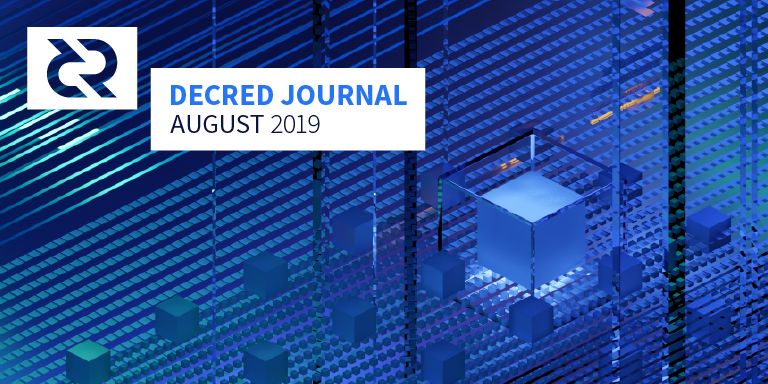

# Decred Journal – Sierpień 2019

_Obraz: Kluczowa symetria, aut. @saender. Gdy wszystko się układa, rodzą się wspaniałe rzeczy._

Główne wiadomości z sierpnia:

* Funkcja prywatności, nad którą Company 0 pracowała w tajemnicy, została ujawniona, wydano pierwszą jej implementację, a pierwsze miksy już zostały zaobserwowane w sieci mainnet. Więcej szczegółów w sekcji "Prywatność" poniżej.
* Rozpoczął się rozwój zdecentralizowanej giełdy wymian Decred, po tym, jak propozycja złożona przez @chappjc i @buck54321 na kwotę do 230 tys. USD została zatwierdzona przez 90% głosujących.
* Odsetek znajdujących się w obiegu DCR zablokowanych w biletach PoS po raz pierwszy przekroczył 50% w dniu 15 sierpnia. To, wraz ze wzrostem cen biletów, wskazuje na to, że zaufanie posiadaczy biletów Decred rośnie z czasem, ponieważ coraz więcej posiadaczy decyduje się na czasowe zablokowanie swoich DCR w celu uczestnictwa w zarządzaniu projektem.
* Interesariusze Decred zasygnalizowali, że chcą sfinansować animatora rynku w celu rozwiązania problemów związanych z płynnością (87% poparcia). Głosowanie za propozycjami i2 Trading, Grapefruit Trading i Tantra Labs rozpoczęło się 4 września i jest bardzo konkurencyjne, ponieważ wszystkie 3 propozycje mają 50-62% poparcia w momencie publikacji. Więcej informacji na ten temat znajduje się w części poświęconej zarządzaniu.

## Prywatność

21 sierpnia ukazał się [wpis na blogu](https://blog.decred.org/2019/08/21/Surveying-the-Privacy-Landscape/) autorstwa @jy-p badający krajobraz prywatności. Post ten rozważa kompromisy związane z różnymi podejściami do prywatności kryptowalut i dokonuje przeglądu zalet i wad podejścia przyjętego przez Monero, Zcash, Grin, Beam, Dash i bitcoinowego Wasabi Wallet.

Pierwsze szczegóły dotyczące funkcji prywatności, nad którą w tajemnicy pracowała Company 0, zostały ujawnione publicznie przez @jz w [odcinku](https://unchainedpodcast.com/after-years-of-secret-work-decred-adds-a-new-feature-privacy/) podcastu Unchained Laury Shin 27 sierpnia.

28 sierpnia ukazał się [wpis na blogu](https://blog.decred.org/2019/08/28/Iterating-Privacy/) autorstwa @jy-p, który w pełni dokumentuje podejście Company 0 do prywatności i wyjaśnia jego powody. Jedynie podejścia, które pozwoliłyby na przycinanie zużytych transakcji, przy czym preferowano mniej złożone rozwiązania, które pozwalają na utrzymanie audytowalności podaży DCR był brane pod uwagę. Ten [wątek tweetowy](https://twitter.com/decredproject/status/1166746979160023046) oferuje bardziej zwięzłe wprowadzenie, a dodatkowo @Dustorf napisał również [post](https://medium.com/@dlefebvr/decred-privacy-taking-the-long-road-62d218223db6), który uwzględnia znaczenie prywatności i z nieco mniej technicznym zacięciem wyjaśnia działanie nowego podejścia do prywatności. @jy-p nagrał również godzinny [odcinek](https://twitter.com/decredproject/status/1168558002867191808) Decred in Depth z @anshawblack skupiający się na prywatności, w którym omówił tematy począwszy od uchylania się od kapitalizmu nadzoru do tego, dlaczego różne podejścia były mniej lub bardziej odpowiednie dla Decred. Współpraca między @anshawblack i GhostWridah zaowocowała również 1-minutowym [rapowym flow](https://soundcloud.com/decredindepth/privacy-flow/s-5ifuN) na temat Decred i prywatności.

Podejście to opiera się na protokole CoinShuffle++, zintegrowanym z procesem zakupu biletów tak, aby zainteresowane strony mogły zdecydować się na mieszanie swoich kredytów przy zakupie biletów. Dzięki temu rozwiązaniu można również mieszać mniejsze nominały używane do zwykłych transakcji (bez stakingu). Protokół rozwiązuje kwestię identyfikowalności (kto do kogo wysyła), lecz nie ukrywa kwot. Rozwiązanie opiera się na scentralizowanym serwerze, który koordynuje mieszanie - informacje o adresach wejściowych i adresach reszt są ujawniane serwerowi, ale nie innym użytkownikom procesu mieszania, a adresy wyjściowe są w pełni anonimizowane. Ponieważ mieszanie odbywa się poza łańcuchem, nie była wymagana zmiana zasad konsensusu. Ponieważ cały rozwój do tej pory był finansowany przez Company 0, nie była również wymagana żadna propozycja finansowania na platformie Politeia.

Pierwsze wydanie działa tylko dla użytkowników interfejsu wiersza poleceń dcrwallet. Minie trochę czasu, zanim funkcja ta zostanie zintegrowana z portfelem Decrediton, a w celu zaoferowania go użytkownikom VSP wymagane są znaczące ulepszenia dcrstakepool. Długoterminowo, poufne transakcje (z Bulletproofs) będą brane pod uwagę. Można by je wykorzystać do ukrycia kwot, co zwiększyłoby prywatność i zapobiegło konieczności szerokiego mieszania środków z adresów reszt w transakcjach. Tego rodzaju rozwój wymagałby wprowadzenia zmian w zasadach konsensusu, a więc poddany byłby normalnemu procesowi zarządzania.

## Rozwój

[dcrd](https://github.com/decred/dcrd): Wprowadzono nowy moduł o nazwie [`blockchain/standalone`](https://github.com/decred/dcrd/pull/1808), którego celem jest zapewnienie kilku samodzielnych funkcji obecnie dostępnych w module `blockchain`. Podstawowym celem oferowania tych funkcji za pośrednictwem oddzielnego modułu jest zmniejszenie zależności od kodu klienta. Będzie to również korzystne dla aplikacji takich jak lekkie klienty, które muszą zapewnić podstawowe właściwości bezpieczeństwa i obliczyć odpowiednie dotacje za głosowanie. Skorzystano z okazji, aby napisać solidniejsze i pełniejsze funkcje, które w następnym głównym wydaniu zastąpią te z modułu `blockchain`. Nowy moduł będzie dostarczony wraz z obszernymi testami, pełną dokumentacją pakietów i podstawowymi przykładami użycia.

Nowe główne wersje modułów [`blockchain`](https://github.com/decred/dcrd/pull/1823), [`mining`](https://github.com/decred/dcrd/pull/1831), [`connmgr`](https://github.com/decred/dcrd/pull/1833), [`peer`](https://github.com/decred/dcrd/pull/1834) i [`mempool`](https://github.com/decred/dcrd/pull/1835) zostały wprowadzone w celu wykorzystania innych nowych głównych wersji modułów. Moduł główny został również [zaktualizowany](https://github.com/decred/dcrd/pull/1837) do wykorzystania ich wszystkich, co na razie oznacza koniec sagi aktualizacyjnej modułów. Ogólną zaletą jest to, że aktualizują one dcrd, aby wykorzystał wszystkie najnowsze aktualizacje kodu i znacznie zmniejszają ilość przyszłego przemiału niezbędnego w niektórych modułach, gdy wymagają one zmian w API, które stanowią poważną przerwę w wersji semantycznej.

Moduł `gcs` otrzymał wiele [ulepszeń](https://github.com/decred/dcrd/pulls?q=is%3Apr+is%3Aclosed+merged%3A2019-08-01..2019-08-31+gcs), aby doprowadzić go do poziomu jakości wymaganego przez kod konsensusu w celu ostatecznego włączenia do [zobowiązań nagłówka](https://proposals.decred.org/proposals/0a1ff846ec271184ea4e3a921a3ccd8d478f69948b984445ee1852f272d54c58). Dodano [wsparcie](https://github.com/decred/dcrd/pull/1854) dla niezależnego wskaźnika fałszywych dodatnich i rozmiaru kosza kodowego Golomb. Pozwala to między innymi na określenie bardziej optymalnych parametrów minimalizacji rozmiaru filtra. Ta właściwość zostanie wykorzystana w zbliżającej się wersji 2 filtrów, które ostatecznie zostaną uwzględnione w zobowiązaniach nagłówka. Początek cyklu deweloperskiego v2 modułu oznaczał również początek [nowego podejścia](https://github.com/decred/dcrd/pull/1843) w kierunku obsługi wersji modułu pomiędzy cyklami wypuszczania w celu zmniejszenia obciążenia związanego z utrzymaniem kodu.

Implementacja Blake256 została [skopiowana](https://github.com/decred/dcrd/pull/1811) do repozytorium dcrd aby dcrd nie wymagał już tej zewnętrznej zależności. Podczas gdy optymalizacje wymagane przez dcrd zostały [zaakceptowane](https://github.com/dchest/blake256/pull/3) w repozytoriach upstream, nadal istnieje potrzeba, aby kod niezbędny dla poprawnego fukcjonowania zasad konsensusu znajdował się pod ścisłą kontrolą opiekunów dcrd, aby uniknąć sytuacji wymienionych [tutaj](https://github.com/decred/dcrd/issues/1810).

Automatyczne [wykrywanie adresów](https://github.com/decred/dcrd/pull/1522) zostało scalone. Pozwala ono użytkownikom stojącym za NAT uruchamiać publicznie wykrywalne węzły bez określania `-externalip`.

Zasięg testów został zwiększony i wzmocniony w wielu obszarach bazy kodowej.

[Rozpoczęto prace](https://github.com/decred/dcrd/pull/1829) nad maksymalizacją opłat za szablony blokowe w oparciu o łańcuchy transakcji w mempoolu.

[dcrwallet](https://github.com/decred/dcrwallet): Dodano nowy [RPC](https://github.com/decred/dcrwallet/pull/1522), który umożliwia użytkownikowi porzucenie (lub usunięcie) niepotwierdzonej transakcji z portfela, a także wszelkich innych transakcji zależnych od jej danych wyjściowych. Kolejne nowe RPC umożliwia eksport [rozszerzonego klucza prywatnego](https://github.com/decred/dcrwallet/pull/1533) konta po odblokowaniu portfela.

Utrzymanie kodu: aktualizacja w celu wykorzystania nowych modułów w dcrd i [usunięcie](https://github.com/decred/dcrwallet/pull/1531) wykorzystania starych modułów, [ulepszenie](https://github.com/decred/dcrwallet/pull/1539) kompatybilności z błędami Go 1.13.

Rozpoczęto prace nad dodaniem [wsparcia](https://github.com/decred/dcrwallet/pull/1541) do tworzenia transakcji CoinJoin dla transakcji zakupu biletów "split", jak również mieszania poszczególnych transakcji reszt na mniejsze standardowe ilości.

[Decrediton](https://github.com/decred/decrediton): ulepszenia w interfejsie użytkownika, poprawki błędów, oczyszczanie kodu.

Wstępna wersja [ciemnego trybu](https://github.com/decred/decrediton/issues/2089) została [zakończona](https://github.com/decred/decrediton/pull/2163). Kontynuowane są prace nad tym, aby interfejs użytkownika reagował w sposób elastyczny, z dodanymi [czterema nowymi widokami](https://github.com/decred/decrediton/pull/2174).

[Politeia](https://github.com/decred/politeia): Prace nad nowym designem Politei postępują w tempie, ze [scaleniem](https://github.com/decred/politeiagui/pull/1356) [szeregu](https://github.com/decred/politeiagui/pull/1338) [PRów](https://github.com/decred/politeiagui/pull/1360), które dodają istniejącą funkcjonalność do przeprojektowanego interfejsu. Na backendzie istotne prace nad stworzeniem podstaw dla procesu [DCC](https://proposals.decred.org/proposals/fa38a3593d9a3f6cb2478a24c25114f5097c572f6dadf24c78bb521ed10992a4), który ma zostać włączony do CMS, zostały [scalone](https://github.com/decred/politeia/pull/980).

Kwestia, w jaki sposób wspierać propozycje typu RFP na platformie Politeia, była przedmiotem dyskusji w tym [zagadnieniu](https://github.com/decred/politeia/issues/966) oraz na kanale #politeia (więcej szczegółów sekcji poświęconej zarządzaniu).

Logowanie za pomocą nazwy użytkownika zostało przełączony z powrotem na e-mail, aby zapobiec [celowemu blokowaniu](https://github.com/decred/politeia/issues/860#issuecomment-520871500) kont. [Uwierzytelnianie dwuskładonikowe](https://github.com/decred/politeia/issues/544) rozwiąże ten problem i zezwoli na logowanie bez użycia adresu email.

[dcrdex](https://github.com/decred/dcrdex): W lipcu ogłoszono [repozytorium dcrdex](https://twitter.com/decredproject/status/1156652694502817793), które miało pomieścić [specyfikację DEX](https://github.com/decred/dcrdex/tree/master/spec), i pierwsze merytoryczne PR są już [otwarte](https://github.com/decred/dcrdex/pull/17). Stworzono również nowy kanał [#dexdev](https://riot.im/app/#/room/!EzTSRQITaqHuFBDFhM:decred.org) na Matrixie aby właśnie tam prowadzić rozmowy dotyczące rozwoju platformy.

[cspp](https://github.com/decred/cspp): To nowe repozytorium zawiera implementacje klienckie i serwerowe potrzebne do umożliwienia protokołu mieszania [CoinShuffle++](https://crypsys.mmci.uni-saarland.de/projects/FastDC/paper.pdf). Pakiety klienta i serwera są wystarczająco ogólne, aby anonimowo mieszać i łączyć elementy dowolnej grupy.

Przed CoinShuffle++, Company 0 opracowała implementację protokołu TumbleBit w Go. Pomimo niezintegrowania protokoł€ z Decred, kod został wydany dla korzyści publicznej w repozytorium [tumblebit](https://github.com/decred/tumblebit).

[dcrstakepool](https://github.com/decred/dcrstakepool): Duży [wysiłek](https://github.com/decred/dcrstakepool/pulls?q=is%3Apr+is%3Aclosed+227) by [odłączyć](https://github.com/decred/dcrstakepool/issues/227) działanie dcrstakepool od dcrwallet, rozpoczęty w kwietniu, wreszcie [został zakończony](https://github.com/decred/dcrstakepool/pull/470). Zmiana ta zmniejsza złożoność kodu i zmniejsza ilość połączeń RPC w sieci, co z kolei zwiększa wydajność i bezpieczeństwo.

Operatorzy VSP uzyskali wsparcie dla SMTPS w zakresie wysyłania wiadomości e-mail dotyczących rejestracji i odzyskiwania konta za pośrednictwem szyfrowanych połączeń (w tym [certyfikaty z własnym podpisem](https://github.com/decred/dcrstakepool/pull/486)), ulepszonych [stron statusu](https://github.com/decred/dcrstakepool/pull/484) oraz lepszego raportowania błędów.

W celu zwiększenia produktywności testowania dodano [uprząż testową](https://github.com/decred/dcrstakepool/pull/476) tmux.

W sumie [30 PRów](https://github.com/decred/dcrstakepool/pulls?q=is%3Apr+is%3Aclosed+merged%3A2019-08-01..2019-08-31) zostało scalonych.

[dcrlnd](https://github.com/decred/dcrlnd): Prace scalone w sierpniu dotyczą poprawy stabilności testów i wstępnych prac nad wsparciem przy użyciu istniejących portfeli (obecnie obsługiwany jest tylko portfel wbudowany w dcrlnd).

Więcej prac z głównego repozytorium zostało [przeniesione](https://github.com/decred/dcrlnd/pull/36#issuecomment-526721084) i jest testowane przed scaleniem z dcrlnd. W sumie dostosowano 400+ PR-ów i 1700+ linijek kodu.

> Aby zachować synchronizację, musieliśmy dostosować prawie każdy pojedynczy commit po naszym punkcie scalenie z 10 stycznia ([@matheusd](https://twitter.com/matheusd_tech/status/1169194706636615680)).

Kran LN uzyskał formularz do [płacenia faktur](https://github.com/decred/lightning-faucet/pull/8) oraz nowe [parametry](https://github.com/decred/lightning-faucet/pull/14) konfiguracyjne.

[dcrandroid](https://github.com/decred/dcrandroid): Trwają prace nad wdrożeniem [nowego interfejsu użytkownika](https://github.com/decred/dcrandroid/pull/400), który dostosuje aplikację do standardowych zaleceń dotyczących projektowania aplikacji dla systemu Android. Na backendzie w toku są również prace nad [wsparciem dla wielu portfeli](https://github.com/decred/dcrandroid/issues/188), które umożliwi korzystanie z portfeli [typu "watch-only"](https://github.com/decred/dcrandroid/issues/393) (tylko do podglądu) do monitorowania biletów.

[dcrios](https://github.com/raedahgroup/dcrios): Trwają prace nad ulepszonym interfejsem użytkownika i obsługą portfeli tylko do podglądu, podobnie jak w przypadku aplikacji dla systemu Android.

[dcrdata](https://github.com/decred/dcrdata): wcielono aktualizacje z dcrd, ulepszenia UI, optymalizacje i poprawki błędów.

Dużą zmianą, która była na liście rzeczy do zrobienia przez długi czas, była [rezygnacja z SQLite](https://github.com/decred/dcrdata/pull/1480). To sprawia, że architektura bazy danych jest znacznie prostsza, wymaga jedynie PostgreSQL i sprawia, że budowa jest wolna od błędów (czyste Go, bez C).

Prace nad przeprojektowaniem coraz bardziej nabierają tempa, lecz rozwój backendu znajduje się teraz głównie w trybie konserwacji, ponieważ kluczowi współpracownicy przenoszą punkt ciężkości w pracach rozwojowych na dcrdex. Nadal jest wiele miejsca na poprawę i rozbudowę dcrdata, zwłaszcza w przypadku transakcji mieszanych.

[docs](https://github.com/decred/dcrdocs): [dodano](https://github.com/decred/dcrdocs/pull/968) nową stronę w szczegółach opisującą [atomic swaps](https://docs.decred.org/advanced/atomic-swap/), [zaktualizowano](https://github.com/decred/dcrdocs/pull/979) dane dotyczące wsparcia [portfeli sprzętowych](https://docs.decred.org/wallets/hardware-wallets/), oraz wdrożono drobne poprawki.

Rozpoczęły się prace nad oddzielną, od dawna wyczekiwaną stroną internetową poświęconą [dokumentacji deweloperskiej](https://github.com/decredcommunity/issues/issues/135). Początowe stadium rozwoju strony ma miejsce w osobistym repozytorium, które zostanie przeniesione pod główną organizację Decred na GitHub, gdy strona zostanie uruchomiona.

[decred.org](https://github.com/decred/dcrweb): Mapa rozwoju została [zaktualizowana](https://github.com/decred/dcrweb/pull/695) z wraz nowymi aktualizacjami, strona prasowa z ostatnimi relacjami [została zaktualizowana](https://github.com/decred/dcrweb/pull/706), oraz [dodano](https://github.com/decred/dcrweb/pull/712) sekcję prywatności do strony głównej i mapy rozwoju.

Statystyki aktywności deweloperskiej na sierpień: 244 aktywne PR-y, 274 master commitów, 46 tys. dodanych i 24 tys. usuniętych linijek kodu spośród 15 repozytoriów. Wkład pochodził od 2-9 programistów na każde repozytorium.

## Ludzie

Witamy nowych, początkujących współpracowników, których kod scalono z głównymi gałęziami repozytoriów Decred na GitHubie: aarcamp ([dcrd](https://github.com/decred/dcrd/commits?author=aarcamp)), skipcheru ([dcrandroid](https://github.com/decred/dcrandroid/commits?author=skipcheru)), RyanBRiley ([politeia](https://github.com/decred/politeia/commits?author=RyanBRiley)), UferePease ([dcrstakepool](https://github.com/decred/dcrstakepool/commits?author=UferePease)), fguisso ([lightning-faucet](https://github.com/decred/lightning-faucet/commits?author=fguisso)).

Statystyki społeczności:

* Użytkownicy platformy Politeia: 174 (+20)
* Obserwujący na Twitterze: 40,597 (+25)
* Subskrybenci na Reddit: 9,594 (+38)
* Użytkownicy na Matrixie: 412 (+28)
* Użytkownicy na Slacku: 6,834 (+25)
* Użytkownicy na Discordzie: 2,442 (+65), zweryfikowani z możliwością pisania postów: 310 (+29)
* Użytkownicy na Telegramie: 3,148 (-142)
* Subskrybenci na YouTube: 3,819 (+19)
* Obserwujący na Facebooku: 3,271 (+18), polubień: 2,999 (+16)
* Obserwujący na LinkedIn: 603 (+12)
* GitHub: 516 gwiazdek (+18) i 1,383 forki repozytorium dcrd (+18)

W następstwie [wydarzeń](https://github.com/decredcommunity/events/blob/master/reports/20190725-cointime-summit-ho-chi-minh-city-vietnam.md) w Ho Chi Minh City utworzono konta na platformach [Telegram](https://t.me/decredvietnam), [Twitter](https://twitter.com/DecredVietnam) i [Facebook](https://www.facebook.com/Decred-DCR-Vietnam-108991833777572/) w języku wietnamskim [Telegram](https://t.me/decredvietnam). Lista wszystkich grup w mediach społecznościowych znajduje się na [tej stronie](https://github.com/decredcommunity/wiki/blob/master/wiki/social-media.md).

## Zarządzanie

W sierpniu [Skarbiec](https://explorer.dcrdata.org/address/Dcur2mcGjmENx4DhNqDctW5wJCVyT3Qeqkx) otrzymał 15278 DCR i wydał 8223 DCR. Wykorzystując dzienną średnią dzienną stawkę DCR/USD w sierpniu, wynoszącą 26,23 USD, jest to odpowiednio 401 tys. dolarów i 216 tys. dolarów. Są to opłaty za pracę wykonaną w lipcu po stawce w wysokości 28,97 dolarów, co przekłada się na wydatki na sumę 238 tys. dolarów. Na dzień 9 września saldo Skarbca wynosi 638 tys. DCR (15,8 mln USD po kursie 24,80 USD).

@chappjc i @buck54321 (którzy pracują nad dcrdata) złożyli propozycję [budowy DEX](https://proposals.decred.org/proposals/417607aaedff2942ff3701cdb4eff76637eca4ed7f7ba816e5c0bd2e971602e1) przy wsparciu Company 0, która została zatwierdzona stosunkiem 90% głosów na "tak". Szacuje się, że koszt budowy projektu z interfejsem wiersza poleceń, który może zostać rozszerzony o przyszłe propozycje oferujące interfejs użytkownika wykorzystujący framework Electron, wyniesie 230 000 USD.

Repozytorium [propozycji decredcommunity](https://github.com/decredcommunity/proposals) zawiera [indeks](https://github.com/decredcommunity/proposals/blob/master/dex/index.md) materiałów związanych z DEX.

7 sierpnia opublikowano 3 propozycje odnośnie usługi animatora rynku autorstwa [Altonomy](https://proposals.decred.org/proposals/772d083fef79fa2e443d8424b353deadc3af69c8d8764e473cb200f98f356c60), [i2 Trading](https://proposals.decred.org/proposals/2eb7ddb29f151691ba14ac8c54d53f6692c1f5e8fe06244edf7d3c33fb440bd9) oraz [Grapefruit Trading](https://proposals.decred.org/proposals/4becbe00bd5ae93312426a8cf5eeef78050f5b8b8430b45f3ea54ca89213f82b). Po kilku dniach dyskusji dominującym tematem było to, czy Skarbiec powinien być w ogóle wykorzystywany do opłacania animatorów rynku. @jz przedłożył [propozycję RFP](https://proposals.decred.org/proposals/30822c16533890abc6e243eb6d12264b207c3923c14af42cd9b883e71c7003cd) w celu ustalenia, czy interesariusze w ogóle byliby zainteresowani zatrudnieniem animatora rynku. We wniosku wyjaśniono proces, który odbył się za pośrednictwem @jz, @maxbronstein i Chrisa Burniske przed złożeniem wniosków i przedstawiono argumenty przemawiające za przyjęciem jednego z nich. We wniosku RFP wyjaśniono również warunki głosowania (można zatwierdzić maksymalnie 1 wniosek dotyczący animatora rynku i musi on spełniać zwykłe kryteria).

Altonomy złożyło propozycję zaoferowania po 50 tys. dolarów po obu stronach na 10 parach, ich przedstawiciele byli aktywnie zaangażowane w dyskusję na Politei i udzielili odpowiedzi na wiele pytań, lecz 16 sierpnia firma wycofała swoją propozycję, redagując ją komentarzem: "Przepraszamy, ale ze względu na nasze możliwości techniczne, zdecydowaliśmy się wycofać tę propozycję."

i2 Trading złożył propozycję zaoferowania po 50 tys. dolarów po obu stronach na 6 parach, aktywnie zaangażował się w dyskusję na Politei i kanałe #proposals, odpowiadając na większość pytań. W odpowiedzi na obawy dotyczące przejrzystości, i2 zaoferowało przedstawicielowi Decred dostęp tylko do odczytu do swoich rachunków giełdowych przez ograniczony okres czasu. i2 wprowadziło szereg poprawek do swojej propozycji, aby dodać notatkę o zapewnieniu dostępu do API, wyjaśnić potrzebę i warunki pożyczki, a następnie zmieniając swoją ofertę, aby rozluźnić spready, zmniejszyć maksymalny zwrot opłat handlowych do 10 000 USD/miesiąc i obniżyć opłaty za świadczenie usługi z 40 000 USD/miesiąc do 35 000 USD/miesiąc.

Grapefruit rozpoczął od 2 ofert w swojej propozycji (obydwie na 30 tys. dolarów po obu stronach na 4 parach walutowych): jednej z bardziej zawężonym spreadem, która kosztowałby 40 tys. dolarów/miesiąc w opłatach i jednej z luźniejszym spreadem, która kosztowałby 28 tys. dolarów/miesiąc w opłatach. @grapefruittrading odpowiadał na pytania dotyczące swojej propozycji Politeia w dniach 8 i 20 sierpnia, ignorując niektóre pytania i oferując [merytoryczne](https://proposals.decred.org/proposals/4becbe00bd5ae93312426a8cf5eeef78050f5b8b8430b45f3ea54ca89213f82b/comments/6) [odpowiedzi](https://proposals.decred.org/proposals/4becbe00bd5ae93312426a8cf5eeef78050f5b8b8430b45f3ea54ca89213f82b/comments/5) na inne. Zanim zezwolono na rozpoczęcie głosowania, @grapefruittrading zredagował swoją propozycję usunięcia droższej oferty, decydując się na skorzystanie z oferty tańszej, ponieważ postrzegali na nią popyt ze strony interesariuszy, a i tak była to ich preferowana opcja.

i2 oraz Grapefruit zezwolili na rozpoczęcie głosowania nad swoimi propozycjami 27 sierpnia.

Tantra Labs złożyło [propozycję](https://proposals.decred.org/proposals/82ce113827140caaaf8b5779ab30402d3ed39f1911fdd2e8fa64cf0dc9e09ecb) w dniu 28 sierpnia, która oferowała zupełnie inną podejście: po 30 tys. dolarów po obu stronach po cenie do 3% spreadu na 6 parach ([lub 7](https://proposals.decred.org/proposals/82ce113827140caaaf8b5779ab30402d3ed39f1911fdd2e8fa64cf0dc9e09ecb/comments/8)), bez opłat za świadczenie usługi obciążających Skarbiec. Zamiast tego, Skarbiec byłby obciążany jedynie kosztami wypożyczenia zapasów i opłatami handlowymi w wysokości do 10 tys. dolarów/miesiąc. Tantra zaproponowało, aby umożliwić "wybranym" przedstawicielom Decred dostęp tylko do odczytu ich rachunków giełdowych, tak, aby można było zweryfikować obiecaną dostępność płynności. Tantra zaoferowała również interfejs internetowy do zestawu narzędzi przejrzystości księgi zamówień z otwartym kodem źródłowym.

Duża część dyskusji na temat propozycji Tantry dotyczyła tego, czy jest ona zbyt dobra, by mogła być prawdziwa, a wiele osób wyraziło swoje wątpliwości,czy Tantra może dostarczyć to, co proponuje, zastanawiając się, czy niski koszt propozycji ma swoje minusy. Tantra była aktywna na kanale #proposals i odpowiedziała na niektóre pytania dotyczące swojej propozycji Politeia. Niektórzy członkowie społeczności z niecierpliwością czekali, aż Tantra wyrazi zgodę na rozpoczęcie głosowania, naświetlając problem z propozycjami RFP, które zostały spowolnione przez późne zgłoszenia, podkreślając wartość zdefiniowanego harmonogramu głosowania.

Czwarta [propozycja](https://proposals.decred.org/proposals/c9604f7879e4b2cd4f2582d238a7ccea210005c63481bec1ddae44ff93e1340f) dotycząca animacji rynku, złożona przez @betterfuture, została opublikowana 31 sierpnia. Proponuje się w niej system motywowania animatorów rynku do zapewniania płynności na konkretnych parach bez zdecydowanego zobowiązania. Wniosek opisuje zasady i kary celem utrzymania uczestników w zgodzie i wymagałby od zaufanego pośrednika reprezentującego projekt Decred przeprowadzenia audytu działalności animatorów rynku. @jz został w propozycji nominowany do pełnienia tej roli, ale [stwierdził](https://proposals.decred.org/proposals/c9604f7879e4b2cd4f2582d238a7ccea210005c63481bec1ddae44ff93e1340f/comments/5), że nie podjąłby się tego zadania. Obmyślenie i udoskonalenie tej propozycji jest postrzegane przez jej zwolenników jako długoterminowe zadanie, które nie będzie konkurować z innymi propozycjami.

Głosowanie nad trzema propozycjami animatora rynku rozpoczęło się 4. września.

Szczegółowe informacje na temat propozycji animatorów rynku i innych działań Politeii można znaleźć w [wydaniu 20](https://github.com/RichardRed0x/politeia-digest/blob/master/issue-020.md) (1-12 sierpnia) i [wydaniu 21](https://github.com/RichardRed0x/politeia-digest/blob/master/issue-021.md) (13-31 sierpnia) Politeia Digest. Istnieje również szereg zasobów społecznościowych, których celem jest pomoc osobom, które nie znają się na tworzeniu rynku, w jego zrozumieniu i które dokonują porównań pomiędzy różnymi propozycjami:

* [Tutaj](https://github.com/decredcommunity/proposals/blob/master/market-makers/index.md) prowadzony jest indeks wszystkich znaczących dokumentów i dyskusji związanych z animatorami rynku.
* Działa również [tabela porównawcza](https://github.com/decredcommunity/proposals/blob/master/market-makers/comparison.md), której celem jest porównanie propozycji pod względem ofert i kosztów - maksymalne miesięczne opłaty oszacowane w tej tabeli to 17 tys. dolarów dla Tantry, 53 tys. dolarów dla i2 i 31 tys. dolarów dla Grapefruita (dla Tantry i i2 zakłada się maksymalne opłaty handlowe w wysokości 10 tys. dolarów/miesiąc).
* @bee napisał obszerny [przegląd](https://github.com/decredcommunity/proposals/blob/master/market-makers/arguments.md) dyskusji w odniesieniu do konkretnych pytań i argumentów, a także szczegółową [analizę](https://github.com/xaur/writings/blob/master/20190822-dissection-market-makers-for-decred.md) tego tematu, wprowadzając przy tym odpowiednią terminologię oraz przegląd kluczowych kwestii.
* @exitus przygotował przegląd propozycji [w formie wideo](https://www.youtube.com/watch?v=BKSMA-eanoY).

Po dyskusji na kanale #research, @richardred rozpoczął zbieranie danych z ksiąg zamówień do wyboru par oraz giełd wymian w tym [repozytorium](https://github.com/RichardRed0x/exchange-data). Celem jest zbudowanie lepszego obrazu tego, jak wyglądają obecnie księgi zamówień dla DCR i innych wybranych aktywów kryptograficznych, z przygotowanym wstępnym raportem w tym temacie przed głosowaniem nad propozycjami animatorów rynku. Dane te będą również przydatne do śledzenia księgi zamówień przez dany okres czasu w celu obserwacji efektów działania animatora rynku, gdyby któraś z firm została zatrudniony. Dane z księgi zamówień będą prawdopodobnie dodawane do zewnętrznej danych dcrdata na pewnym etapie, ale charakter tych danych jest taki, że mogą być rejestrowane tylko na żywo. Jedynymi źródłami danych z księgi zamówień historycznych są dane prywatne i [dość kosztowne](https://www.kaiko.com/products/binance-10-order-books).

Warto wspomnieć o [repozytorium](https://github.com/decredcommunity/proposals) propozycji społeczności Decred, gdzie można znaleźć kilka z powyższych zasobów. Repozytorium to zostało stworzone jako miejsce do zbierania informacji, które wyłaniają się z dyskusji i analizy propozycji.

Obsługa propozycji animatorów rynku i proces RFP wywołał wiele dyskusji i spostrzeżeń, a wstępna integracja funkcjonalności zapytań ofertowych (RFP) na platformie Politeia jest w przygotowaniu. Pojawi się nowy typ propozycji - RFP - do której kandydaci mogą się odwoływać, głosowanie i określanie opcji/możliwych rezultatów głosowania będą kontrolowane właśnie przez ten typ propozycji Przed otwarciem propozycji RFP, zwykła propozycja z zapytaniem "czy powinniśmy przeprowadzić zapytanie ofertowe w tej kwestii?" zostałaby przedłożona i zatwierdzona - 2 "propozycje RFP", które Politeia ujrzała do tej pory to propozycje tego typu.

Głównym punktem dyskusji na temat nowego typu propozycji RFP jest to, czy powinny one być prowadzone jako propozycje wielokrotnego wyboru (gdzie wyborcy mogą głosować na jedną z opcji N i jedna z największą liczbą głosów wygrywa), czy też jako propozycje równoległe, gdzie bilety mogą głosować za bądź przeciw każdej propozycji, a zwycięzcą będzie ta, która uzyska lepszy stosunek głosów na "tak" kontra "nie" (w miarę tego, jak przeprowadzane jest RFP dot. animacji rynku). Równoległe głosowanie nad konkurencyjnymi propozycjami wydaje się być priorytetem, przy czym głosowanie wielokrotnego wyboru może nastąpić później i zostać wykorzystane do innych celów (bardziej jak przeprowadzanie sondaży).

Ten [post](https://www.reddit.com/r/decred/comments/cutc16/decred_events_meetups_in_the_cis_in_20192020/) z Reddita został zgłoszony w celu zebrania komentarzy i służyć ma jako wstępna propozycja finansowania wydarzeń i spotkań dotyczących Decred we Wspólnocie Niepodległych Państw (WNP) - w szczególności w Rosji, na Ukrainie i w Gruzji.

## Sieć

Hashrate: sierpniowy hashrate na początku miesiąca wyniósł ~563 Ph/s a zamknął miesiąc w ok. ~567 Ph/s, zaliczając niż w ok. 374 Ph/s oraz szczyt w wys. 671 Ph/s w ciągu miesiąca. Dystrybucja mocy obliczeniowej na 5 września wyglądała następująco: F2Pool 23%, UUPool 16%, Poolin 16%, lab.antpool.com 4,1%, BTC.com 2,3%, Luxor 1,8%, BeePool 0,10%, Coinmine 0,10%, suprnova 0,01% i pozostałe 36%, za danymi z [dcrstats.com](https://dcrstats.com/pow). Są to liczby jedynie szacunkowe i nie można ich dokładnie określić.

Staking: średnia cena biletu z okresu 30 dni wynosiła 130,05 DCR (+4,25) za danymi z dcrstats.com. Cena wahała się między 119,9-134,5 DCR. Zablokowana kwota wynosiła 5,03-5,25 mln DCR, co odpowiadało 49,40-50,93% dostępnej podaży.

Węzły: Przez cały [sierpień](https://charts.dcr.farm/d/000000014/nodes?orgId=1&from=1564617600000&to=1567296000000) było około 167 węzłów nasłuchujących i 445-530 węzłów normalnych za danymi z dcr.farm. Około 78% z nich operowało na dcrd v1.4.0, 5,7% dcrwallet v1.4.0 a 6,2% to wersje v1.5.0(pre) dev.

Na dzień 5 września, DCR [testnet LN](https://charts.dcr.farm/d/DHPdAO4Wz/lightning-network?orgId=1) pokazuje 19 węzłów, 32 kanały i łączną pojemność 253 DCR.

Pierwsze [transakcje](https://twitter.com/decredproject/status/1167269901293297664), które korzystają z nowego systemu ochrony prywatności, zostały zauważone w sieci mainnet.

## Integracje

Exodus [dodał](https://twitter.com/exodus_io/status/1168886493617840131) możliwość wysyłania, odbierania i wymiany DCR ze swojego mobilnego portfela.

Cold wallet Ellipal [ogłosił](https://twitter.com/ellipalwallet/status/1163771448042803201), że ich nadchodzący portfel sprzętowy z ochroną przed nawiązywaniem połączeń zewnętrznych Titan będzie wspierał Decred.

Uwaga: autorzy Decred Journal nie są w stanie ocenić wiarygodności żadnego z powyższych podmiotów czy ich usług. Uprasza się o dołożenie należnych starań i własnoręczną weryfikację informacji przed powierzeniem jakichkolwiek środków innym stronom.

## Nawiązywanie kontaktów

Duża część trwających prac w zakresie nawiązywania kontaktów została odsunięta na bok celem skupienia się nad wydaniem prywatności dla projektu Decred. Wysiłki te rozpoczęły się 21 sierpnia, kiedy to @jy-p opublikował [Analizę krajobrazu prywatności](https://blog.decred.org/2019/08/21/Surveying-the-Privacy-Landscape/). Praca ta wsparta została przez [tweetstorm](https://twitter.com/decredproject/status/1164245224274767873), który wygenerował bezpośrednie zaangażowanie ze strony flyffypony'ego, Zooko i ludzi z MimbleWimble. Pierwsze szczegóły dotyczące ochrony prywatności zostały przedstawione światu, gdy @jz wziął udział w podcaście Laury Shin [Unchained Podcast](https://unchainedpodcast.com/after-years-of-secret-work-decred-adds-a-new-feature-privacy/), aby porozmawiać o Decred i jego nowej funkcji.

Dwadzieścia cztery godziny później, pierwszy artykuł o prywatności Decred został wydany przez The Block, wraz z publikacją artykułu @jy-p, [Iterując prywatność](https://blog.decred.org/2019/08/28/Iterating-Privacy/), który głęboko zbadał motywacje, szczegóły operacyjne, ograniczenia i kolejne kroki prywatności Decred. Publikacja była wsparta 10-częściowym [tweetstormem](https://twitter.com/decredproject/status/1166746979160023046), który przyciągnął wiele uwagi i zaangażowania. Implementacja prywatności Decred przyciągnęła mnóstwo uwagi ze strony mediów, co lepiej opisane jest w sekcji "Media", za wyjątkiem portalu CoinDesk.

Kontynuacją wsparcia dla uruchomienia funkcji prywatności było [Privacy Flow](https://twitter.com/decredproject/status/1169011789255925762) wydane przez @anshawblack z GhostWridah, a także bardzo specjalny [odcinek](https://twitter.com/decredproject/status/1168558002867191808) podcastu Decred in Depth z uczestnictwem @jy-p zaledwie kilka dni później. W tym odcinku @jy-p zagłębia się w gospodarkę nadzoru, dlaczego prywatność ma znaczenie oraz obecne i przyszłe stadia prywatności Decred.

W momencie publikacji, zespół Ditto kontynuuje prace nad sposobami utrzymania tematu prywatności Decred w centrum publicznego dyskursu i uwagi, i wydaje się, że jest to aktualna kwestia, szczególnie mając na uwadze [ostatniei wiadomości o nadużyciach Google](https://www.ft.com/content/e3e1697e-ce57-11e9-99a4-b5ded7a7fe3f). Dodatkowo, @Dustorf opublikował [wpis na blogu](https://medium.com/@dlefebvr/decred-privacy-taking-the-long-road-62d218223db6) skierowany do mniej technicznych odbiorców.

Dział nawiązywania kontaktów podjął wysiłek w celu zwiększenia zaangażowania na Twitterze poprzez wysokiej jakości treści i edukację w odniesieniu do Decred. Dowodem na to było ponad dwukrotne zwiększenie liczby wyświetleń projektu w okresie od lipca do ponad 5,6 mln. Jednym z przekazów, który zyskał najwięcej trakcji był 4-częściowy [tweetstorm](https://twitter.com/decredproject/status/1156652694502817793) ogłaszający specyfikację DEX.

Decred potwierdził swoją obecność na stoisku na [Web Summit](https://websummit.com/) w dniach 4-7 listopada w Lizbonie w Portugalii, więc prosimy, odezwijcie się do nas na kanale #event_planning na Matrixie, jeśli jesteście zainteresowani pomóc nam przy wydarzeniu. Planujemy również cykl wydarzeń w Azji, ale nie mamy w tej chwili żadnych szczegółów do przekazania.

[Podstawowy przekaz](https://github.com/decredcommunity/pr/blob/release/foundational-messaging.md) został zaktualizowany do wersji 2. [Zmiany](https://github.com/decredcommunity/pr/commit/fc407b8f037a222db22a4507e4a5ade5b746f4dd) obejmują aspekty takie, jak "Reklama, "Slogan" i "Wizja" rozszerzone o zasady Decred i FAQ. Tagline został nieznacznie poprawiony, aby zastąpić "Samofinansujące się" przez "Zrównoważone".

Sierpniowe osiągnięcia Ditto:

* Zdobyliśmy 8 relacji z uruchomienia prywatności w samej śmietance mediów z tematyki krypto: Unchained Podcast, [The Block](https://www.theblockcrypto.com/tiny/crypto-project-decred-adds-privacy-features-to-its-coin/) (również ze wzmianką w ich biuletynie informacyjnym), biuletyn informacyjny [Crypto Briefing](https://cryptobriefing.com/decred-struts-privacy-credentials-with-surprisingly-awesome-rap-snippet/) i artykuł na temat Privacy Rap (dzięki należą się @anshawblack za pomoc w stworzeniu tego cudeńka), [Cointelegraph](https://cointelegraph.com/news/crypto-project-decred-adds-privacy-features-to-its-coin), [Decrypt Media](https://decrypt.co/8796/decred-aims-to-be-a-more-effective-privacy-coin-than-monero-or-zcash), [Modern Consensus](https://modernconsensus.com/cryptocurrencies/alt-coins/decred-cryptocurrency-launches-launches-privacy-mixing-feature/), rosyjski serwis informacyjny [Forklog](https://forklog.com/menshe-koda-menshe-vzloma-razrabotchiki-kriptovalyuty-decred-dobavili-optsiyu-privatnosti-tranzaktsij/), hiszpański serwis informacyjny [Criptonoticias](https://www.criptonoticias.com/redes-protocolos/decred-anade-privacidad-criptomoneda-dcr/).
* Osiągnięcie roku: wywiad na wyłączność w podcaście Laury Shin [Unchained](https://unchainedpodcast.com/after-years-of-secret-work-decred-adds-a-new-feature-privacy/) w którym świat usłyszał o uruchomieniu funkcji prywatności (dzięki dla @jz za niesamowity wywiad) - coś, nad czym pracowaliśmy przez ponad 6 miesięcy, i w końcu się stało!
* Współpracowaliśmy z zainteresowanymi członkami społeczności w gromadzeniu najlepszych zasobów w Internecie na potrzeby repozytorium zasobów edukacyjnych Decred. Prosimy o dzielenie się ukrytymi klejnotami, jeśli je posiadacie.
* Kontynuowaliśmy naszą pracę z różnymi członkami społeczności, angażując się w sposób produktywny/edukacyjny na Twitterze. Obejmowało to przeprowadzenie rozmowy telefonicznej z 7 członkami społeczności w celu przedyskutowania strategii związanych z mediami społecznościowymi, uzyskania informacji zwrotnych i odpowiadania na pytania.
* Stworzyliśmy szum wokół prywatności Decred z około 85 tweetami w ciągu jednej doby i prawie 400 w ciągu ostatniego tygodnia, w tym rozmowy i tweety od Chrisa Burniske, Justina Yashoufara (Blockhead Capital), Blockfolio, Maxa Bronsteina (DharmaHQ) i Weiss Reports.
* Skoordynowaliśmy tweetstormy i działania społeczne obejmujące wiadomości na temat ochrony prywatności.
* Uzyskaliśmy 2 dodatkowe wywiady w podcastach, które mają się ukazać w ciągu najbliższych kilku tygodni.
* Zdobyliśmy szczegółowy profil lidera projektu @jy-p w Decrypt Media.
* Uzyskaliśmy publikację wywiadu z @akinsawyerr w [Base Layer Podcast](https://acrabaselayer.podbean.com/e/base-layer-episode-059-akin-sawyerr-decred/).
* Uzyskaliśmy [artykuł](https://cryptobriefing.com/decentralized-governance-in-action-decred-debates-market-liquidity/) w Crypto Briefing na temat propozycji animatorów rynku.
* Zakończyliśmy odświeżenie [przekazu medialnego](https://github.com/decredcommunity/pr/blob/release/foundational-messaging.md).
* Napisaliśmy i zgłosiliśmy propozycję wystąpienia @matheusd na Konferencji Lightning w Berlinie.
* Zabezpieczyliśmy wywiad telewizyjny dla @zubair na Konferencji Futurystów w Toronto.

## Eventy

Na których byliśmy:

* 2-3 lipca - Asia Blockchain Summit 2019 - Tajpej, Tajwan. @morphymore odziany w kurtkę Decred był tam po to, aby zaznaczyć swoją obecność i wyjaśnić Decred tym, którzy chcieli dowiedzieć się więcej na temat projektu. _(pominięto w lipcowym wydaniu)_
* 8 sierpnia - [Blockchain Bajio](https://www.eventbrite.com/e/blockchain-bajio-2do-meetup-tickets-66510186759) - Leon, Meksyk. @elian, @francov\_, @victorarubin i @luisantoniocrag [przedstawili](https://matrix.to/#/!aNPTuiryMFmdMQWUzb:decred.org/$156537300012257UWNLZ:decred.org) wysokopoziomowe założenia Decred 60 uczestnikom. (zdjęcia: [1](https://twitter.com/Decred_ES/status/1159621068027551744) [2](https://twitter.com/victorarubin/status/1159898002858893313))
* 12 sierpnia - [Crypto Mondays](https://www.meetup.com/Bitcoin-Argentina/events/263594472) - Buenos Aires, Argentyna. Pierwszy raz w Espacio Bitcoin, @pablito i @camilolwi mieli 15 minut na [wyjaśnienie](https://matrix.to/#/!aNPTuiryMFmdMQWUzb:decred.org/$156570958816586TKntU:decred.org) najbardziej istotnych aspektów Decred około 40 osobowej publiczności w lokalnej społeczności Bitcoin i członkom innych projektów. ([zdjęcia](https://matrix.to/#/!aNPTuiryMFmdMQWUzb:decred.org/$156570965016592IkfFu:decred.org))
* 13 sierpnia - [Konferencja Futurystów](https://www.futurist19.com/) - Toronto, Kanada. @michae2xl, @zubair i @ammarooni prowadzili stoisko, udzielili kilku wywiadów i zabrali głos w panelu "Społeczny wpływ Blockchaina i zarządzanie w imieniu dobra". Decred był srebrnym sponsorem. (zdjęcia: [1](https://twitter.com/Decred_CA/status/1161466609267105792) [2](https://twitter.com/Ammarooni/status/1161707860822302722) [3](https://twitter.com/Decred_CA/status/1161982417781047297) [4](https://matrix.to/#/!aNPTuiryMFmdMQWUzb:decred.org/$15658115511558027SCAXO:decred.org)).
* 16 sierpnia - [Campus Party](https://brasil.campus-party.org/campus-party-natal/) - Natal, Brazylia. @guisso i @claranobre reprezentowali Decred. ([zdjęcia](https://twitter.com/Decred_BR/status/1163473134676258816))
* 20 sierpnia - Ambasada Bitcoin - Mexico City, Meksyk. @elian został [zaproszony](https://matrix.to/#/!OfChXgczrIlpEZSFAv:decred.org/$15664995075484PTrhJ:decred.org) do Ambasady Bitcoin na wywiad z El Financiero (oddział Bloomberg w Meksyku), aby porozmawiać o kryptowalutach w Meksyku. (zdjęcia: [1](https://twitter.com/LOR_ena_OR/status/1164205626723098630) [2](https://twitter.com/bitcoinemb/status/1164269677381652480))
* 21 sierpnia - [Decred Meetup](https://www.meetup.com/Chicago-Decred-Meetup/events/263814807/) - Chicago, USA.
* 22 sierpnia - [Binance Meetup](https://www.facebook.com/events/406522099975717/) - Monterrey, Meksyk. Decred reprezentowany przez @elian i @francov. (zdjęcia: [1](https://twitter.com/binance/status/1166526786525487105) [2](https://matrix.to/#/!aNPTuiryMFmdMQWUzb:decred.org/$15665195371107618foQnv:matrix.org) [3](https://matrix.to/#/!aNPTuiryMFmdMQWUzb:decred.org/$15666946921832943HyclD:matrix.org))
* 24 sierpnia - [Decred Live AMA](https://twitter.com/coin98_net/status/1164845587910414337) - Internet. @Haon i Việt Anh Đam odpowiedzieli na pytania społeczności wietnamskiej, zorganizowane przez Coin98 na ich stronie [Facebook](https://www.facebook.com/groups/Coin98.Net/). W sumie było 309 komentarzy (w tym odpowiedzi), za najlepsze pytania nagroda w DCR wynosiła 50 dolarów. ([transkrypt](https://github.com/noahpierau/articles/blob/master/Decred-Vietnam-AMA.md))
* 28 sierpnia - [Blockchain Bootcamp](https://www.meetup.com/blockchaincentre/events/263601014/) - Docklands, Australia. @zohand i @eSizeDave zostali [zaproszeni](https://matrix.to/#/!OfChXgczrIlpEZSFAv:decred.org/$156697235011245SxvJY:decred.org) przez Ernst & Young do przeprowadzenia nakierowanej na Decred prezentacji na temat zarządzania blockchainem dla publiczności z przedstawicielami środowisk akademickich, biznesu, prawa i sektora rządowego. Zarówno prezentacja jak i Decred zostały dobrze przyjęte, co doprowadziło do szeregu [działań następczych](https://matrix.to/#/!aNPTuiryMFmdMQWUzb:decred.org/$156739040517633gdQNG:decred.org). ([zdjęcia](https://twitter.com/DecredAustralia/status/1166592295296208896))
* 29 sierpnia - [Binance Meetup](https://twitter.com/Decred_ES/status/1166132690342567938) - Mexico City, Meksyk. @elian [skomentował](https://matrix.to/#/!aNPTuiryMFmdMQWUzb:decred.org/$156713369714381PAoax:decred.org): "Mieliśmy około 60 uczestników, głównie entuzjastów i przedsiębiorców, było duże zainteresowanie wdrożeniem funkcji prywatności w Decred oraz ideą zarządzania jako usługi. Wielkie podziękowania dla @francov_ @luisantoniocrag i @victorarubin za pomoc". (zdjęcia: [1](https://twitter.com/TRADcoinMX/status/1168541349395738624) [2](https://twitter.com/interprocsys/status/1167243076726861824) [3](https://twitter.com/victorarubin/status/1167495971539836928).

Na których będziemy:

* 10 września - [Co-workingowe Wtorki BlockDAM](https://twitter.com/NoahPierau/status/1170198038301855745) - Amsterdam, Holandia. @Haon zaprezentuje wykład na temat technologii ochrony prywatności w kryptowalutach i nowych funkcji prywatności Decred.
* 16 września - [Decred Special Interest Group](https://www.meetup.com/Philadelphia-Technology-for-Blockchain-and-Cryptocurrency/events/hmqlhryzmbvb/) - Filadelphia, USA. Organizowane przez [@mikeghen](https://twitter.com/mikeghen).
* 20 września - [Szkielet zarządznaia blockchainem](https://www.eventbrite.com/e/a-framework-for-blockchain-governance-tickets-70134180221) - Waszyngton DC, USA. Wraz z Thomasem Coxem, dyrektorem ds. zarządzania w firmie [StrongBlock](https://strongblock.io/) @akinsawyerr wypowiesię i odpowie na pytania dotyczące szkieletu zarządzania blockchainem opracowanego przez obrady Wharton Crypto Governance, którego jest członkiem.
* 21 września - [French Vibes Connection](https://twitter.com/Decred_ES/status/1160669435989856256) - Mexico City, Meksyk. Decred będzie współgospodarzem koncertu muzycznego z udziałem Telepopmusik, Cherokee i Else. Eksperyment świadomości marki przeprowadzony przez @elian.
* 21 września - [Decred Meetup](https://twitter.com/DecredArabia/status/1171117988461854721) - Casablanca, Maroko. @arij opowie o swoich doświadczeniach jako wykonawcy Decred, zarządzaniu Decred, prywatności i planach na przyszłość.
* 25 września - [Konferencja w La Conexion](https://la-conexion.com/home/) - Buenos Aires, Argentyna. Projekt zostanie zaprezentowany na scenie głównej.
* 26 września - [Inauguracyjny meetup Decred](https://twitter.com/MattDavidKaye/status/1164974520081342464) - Los Angeles, USA. Blockhead Capital i @jy-p opowiedzą o założeniach Decred.
* 27 września - [Crypto Fest](https://argentinacryptofest.com/) w Kordobie, Argentyna. Projekt zostanie zaprezentowany na scenie głównej.
* 30 września - 1 października - [Głos Blockchain](https://twitter.com/BlockchainVoice/status/1154772731575099392) - Chicago, USA. @jy-p zaprezentuje hasło przewodnie "Dlaczego bezpośrednia suwerenność i multiinkluzywność stron przetrwa próbę czasu".
* 29-31 października - [Światowa Konferencja Kryptograficzna](https://worldcryptocon.com/) - Las Vegas, USA. @akinsawyerr będzie przemawiał na panelu "Praktyki zarządzania" i będzie miał okazję podkreślić model i proces zarządzania Decred.
* 4-7 listopada - [Web Summit](https://websummit.com/) - Lizbona, Portugalia. Decred będzie miał stoisko.

Alex Von Schulze [szuka ludzi](https://twitter.com/avonschulze/status/1166026265805172737), którzy zorganizują pierwszy [meetup Decred](https://www.meetup.com/Decred-KC/) w Kansas City, USA.

## Media

Wybrane artykuły:

* Decred - Moc samodzielnego myślenia, aut. @BlackBearXVII ([medium](https://medium.com/@imagnusholdings/decred-the-power-to-think-for-ones-46b9aab9ff0e))
* Q&A z @elian dla Crypto Hispano ([steemit](https://steemit.com/btc/@cryptohispano01/decred-q-and-a))
* Decred i ich ambitna wizja prawdziwie zdecentralizowanej giełdy wymian, aut. Nate Urbas ([cryptolinks.com](https://cryptolinks.com/news/decreds-ambitious-vision-for-a-truly-decentralized-exchange))
* Zdecentralizowane zarządzanie w akcji: Decred debatuje nad płynnością rynkową, aut. Darren Kleine ([cryptobriefing.com](https://cryptobriefing.com/decentralized-governance-in-action-decred-debates-market-liquidity/))
* Analiza krajobrazu prywatności, aut. @jy-p ([blog.decred.org](https://blog.decred.org/2019/08/21/Surveying-the-Privacy-Landscape/))
* Iterując prywatność, aut. @jy-p ([blog.decred.org](https://blog.decred.org/2019/08/28/Iterating-Privacy/))
* Kierownik projektu Decred Jake Yocom-Piatt: Żyj w zgodzie z głoszonymi przez siebie zasadami ([decrypt.co](https://decrypt.co/8801/decred-project-lead-jake-yocom-piatt-interview-profile))

Tłumaczenia:

* Analiza krajobrazu prywatności - [w jęz. portugalskim](https://stakey.club/translated/privacy-landscape/), aut. @mm.
* Lipcowy Decred Journal został przełożony na jęz. arabski (@arij) a wydania od kwietniowego do lipcowego na jęz. hiszpański (@francov\_ i @luisantoniocrag). Indeks wszystkich tłumaczeń Journala znajduje się [tutaj](https://xaur.github.io/decred-news/) i aktualizowany jest parę razy w miesiącu. Dziękujemy wszystkim za szerzenie DJ po całym świecie!

Wideo:

* Propozycje animatora rynku Decred - zarządzanie krypto w akcji! aut. @Exitus ([youtube](https://www.youtube.com/watch?v=BKSMA-eanoY))
* Bezopłatowa giełda wymian Decred została zatwierdzona! aut. @Exitus ([youtube](https://www.youtube.com/watch?v=An5YCY_q894))
* Wywiad Futurist 19 z @ammarooni ([youtube](https://www.youtube.com/watch?v=YmQce50dfGY))

Audio:

* Decred in Depth odc. 6 z @jholdstock - Jamie opowiada o swojej podróży z Decred, od uczestnika airdropu, przez współpracownika na część etatu, aż do przejścia na pracę w pełnym wymiarze godzin jako deweloper dla projektu Decred, oraz o tym, dlaczego była to dla niego atrakcyjna opcja. ([youtube](https://www.youtube.com/watch?v=A-zcLGSYxbA))
* Decred in Depth odc. 7 z @jy-p - Jake mówi o prywatności w ogólnym sensie kapitalizmu nadzoru i jak jej uniknąć, dlaczego i jak Company 0 dotarła do CoinShuffle++ jako optymalnego sposóbu na dodanie prywatności do Decred, oraz znaczenia prywatności dla projektu. ([player.fm](https://player.fm/series/decred-in-depth/jake-yocom-piatt-dcr-privacy))
* Zauważ, że odcinki Decred in Depth mają swoje mirrory w serwisach [SoundCloud](https://soundcloud.com/decredindepth) i [Libsyn](https://decredindepth.libsyn.com/).
* Unchained Podcast odc. 134 z Laurą Shin - @jz przedstawia szczegółowy wstęp do projektu Decred, opowiada o swoim zaangażowaniu w projekt, a następnie uchyla rąbka tajemnicy na temat nowej funkcji prywatności Decred. ([unchainedpodcast.com](https://unchainedpodcast.com/after-years-of-secret-work-decred-adds-a-new-feature-privacy/))
* Inkluzywność: Gość Akin Sawyerr na temat tego, czym są pieniądze ([jamesfeltonkeith.com](https://www.jamesfeltonkeith.com/radioshow/episode/c3b1bb50/inclusionism-guest-akin-sawyerr-on-what-money-is), [soundcloud](https://soundcloud.com/inclusionism/inclusionism-guest-akin-sawyerr-on-what-money-is))
* Base Layer odc. 59 - Akin Sawyerr (Decred) ([podbean.com](https://acrabaselayer.podbean.com/e/base-layer-episode-059-akin-sawyerr-decred/), [spotify](https://open.spotify.com/episode/6tT4PTA572I1PAbHsZEX6N))
* Decred dumnie przedstawia szczegóły funkcji prywatności tym zarąbistym rapowym kawałkiem ([cryptobriefing.com](https://cryptobriefing.com/decred-struts-privacy-credentials-with-surprisingly-awesome-rap-snippet/))

> Kilkaset linijek kodu, błędów brak w moim designie, poza łańcuchem, nie do zdarcia, wyprzedzam swoją epokę

Od kwietnia Decred Journal dąży do większej decentralizacji swojej produkcji. Wiązało się to z zapisywaniem opisów tego, w jaki sposób powstają komponenty czasopisma i powód ich tworzenia w ten sposób. Ideą jest to, że poprzez sformalizowanie tych aspektów Dziennik staje się mniej zależny od osób, które obecnie wnoszą swój wkład i ich wiedzy. Poniższe dokumenty są ogólnodostępne, warte lektury dla każdego, kto chciałby zostać współautorem czasopisma:

* samoopisujący się [szablon](https://github.com/xaur/decred-news/blob/docs/journal-template.md) dla nowych zagadnień
* odświeżona strona dot. wnoszenia [swojego wkładu](https://github.com/xaur/decred-news/blob/docs/contributing.md)
* [plan treści](https://github.com/xaur/decred-news/blob/docs/content.md) z pomysłami na rozbudowę
* obszerne [wytyczne](https://github.com/xaur/decred-news/blob/docs/guidelines.md), które przedstawiają wizję i sposoby działania DJ, a także zawiera wskazówki dla tłumaczy.

## Dyskusje społeczności

Nowinki z platform komunikacyjnych:

* [Wątek](https://www.reddit.com/r/decred/comments/coppup/i_did_a_review_of_the_powpos_mechanism_used_in/), w którym autor gdzie autor próbował uzyskać ekspozycję dla swojego projektu poprzez zamieszczenie pobieżnego przeglądu tego, jak hybryda Decred PoW+PoS nie działa został usunięty z Reddita przez moderatorów. Nasza moderacja jest [jawna](https://snew.notabug.io/r/decred) dzięki [publicmodlogs](https://www.reddit.com/user/publicmodlogs).
* [Wątek](https://www.reddit.com/r/decred/comments/csc0ne/what_is_c0s_role_going_forward_with_the_dcr/) z Reddita pytający o rolę Company 0 w przyszłości otrzymał wiele istotnych odpowiedzi, ale potem zniknął po usunięciu konta autora (przypadkowo, tego samego dnia). Aby przywrócić go na subreddit r/decred, zostało ono ["odkasowane"](https://www.reddit.com/r/decred/comments/csq58r/what_is_c0s_role_going_forward_with_the_dcr/) poprzez ponowne wysłanie linku.
* Kolejny przypadek, w którym [pytanie](https://www.reddit.com/r/decred/comments/cvrddy/raising_the_limit_of_coins/) otrzymało konkretną odpowiedź i zostało szybko usunięte. Wątek został "odkasowany", ale usunięcie oryginalnego postu spowodowało, że odpowiedź straciła widoczność. Ten wzorzec jest jednym z czynników zniechęcających osoby znające się na rzeczy do podejmowania wysiłku udzielenia odpowiedzi na pytania z Reddita. W tym przypadku postujący z pytaniem faktycznie [przeprosił](https://www.reddit.com/r/decred/comments/cvwmsz/raising_the_limit_of_coins_undelete/ey7p6qr) za usunięcie swojego postu w "odkasowanym" temacie.
* Więcej oszustów zostało wykrytych na Telegramie, którzy obiecują pomoc w rozwiązaniu Twojego problemu technicznego za skromną sumę 0,05 BTC. Uważajcie na oszustów.

AMA ze społecznością wietnamską zostało przeprowadzone na Facebooku przez @Haon i Việt Anh Đam. Pojawiło się w nim w sumie 309 komentarzy (łącznie z odpowiedziami), a transkrypt jest dostępny [tutaj](https://github.com/noahpierau/articles/blob/master/Decred-Vietnam-AMA.md).

Wybrane wątki z Reddita:

* [Pytania](https://www.reddit.com/r/decred/comments/cr8u4w/post_politeia_approval_fiat_pairs_integration_on/) do EXMO pozostały bez odpowiedzi.
* [Czemu interesuję się projektem Decred](https://www.reddit.com/r/decred/comments/crci7p/why_im_into_the_decred_project/), aut. Somebody\_\_Online
* [Wspólny wysiłek](https://www.reddit.com/r/decred/comments/ct7aw9/collaborative_effort_for_mw_tech/) dla technologii MimbleWimble?
* [Wątek](https://www.reddit.com/r/decred/comments/ctp1zf/bitcoin_lighting_network/) z długą odpowiedzią od @matheusd odnoszącą się do obaw związanych z dumpingiem DCR przez wykonawców i wsparciem przyjęcia LN.
* Ujawnino [funkcję prywatności](https://www.reddit.com/r/decred/comments/cw1wd8/privacy_feature_revealed/), prywatność jest [już w użyciu](https://www.reddit.com/r/decred/comments/cxrb42/decred_privacy_was_announced_and_its_already_in/) na mainnecie, [różnica](https://www.reddit.com/r/decred/comments/cwz0ib/in_what_way_is_decreds_mixer_different_to/) między CoinJoin dla Bitcoina oraz kontekst idei prywatności Decred, [uwagi](https://www.reddit.com/r/decred/comments/cxdxso/what_does_it_mean_by_12x_increase_of_onchain/) na temat zwiększenia ilości przechowywania danych transakcji o 12x.

Wybrane dyskusje z Twittera:

* [Cytat](https://twitter.com/Ammarooni/status/1161707860822302722) z przemówienia [@zubair](https://twitter.com/generalsaccount) - "Musimy rozwiązać kwestię przejrzystości w zarządzaniu blockchainem już teraz, tak abyśmy mieli mechanizm podejmowania decyzji za dwie dekady".
* [Tweetstorm](https://twitter.com/decredproject/status/1166746979160023046) o prywatności Decred.
* @Checkmate na temat [prywatności](https://twitter.com/_Checkmatey_/status/1167502975276933121).
* @richardred o [mentalnośći open source](https://twitter.com/RichardRed0x/status/1160972879133073409) projektu Decred - "wgryź się i znajdź coś pożytecznego do zrobienia".
* @DCRtheSoV na temat [rozwoju Politei](https://twitter.com/DCRtheSOV/status/1165708600410402816) i roli, jaką odgrywa w projekcie.
* @DCRtheSoV na temat [stakingu DCR](https://twitter.com/DCRtheSOV/status/1163514060542894080).
* @Checkmate w kwestii [Skarbca](https://twitter.com/_Checkmatey_/status/1157342578787913733).
* Chris Burniske z Placeholder VC [wyjaśnił](https://twitter.com/cburniske/status/1163912381598248965 ), że Placeholder nie likwidują swojej pozycji w DCR, po tym jak na Telegramie zauważono kogoś podszywającego się pod niego poszukującego nabywców dla swoich DCR.

Nowe konto na Twitterze [@DCRtheSOV](https://twitter.com/DCRtheSOV) ma na celu [stać się](https://matrix.to/#/!MgQoetFiyjrHAywokv:decred.org/$15650685647545vLtzj:decred.org) renomowanym źródłem informacji i analiz obejmujących Decred i poszukuje informacji zwrotnych.

## Rynki

W sierpniu kurs wymiany Decred wahał się pomiędzy 22,63-32,17 USD / BTC 0,00227-0,00275. Średni dzienny kurs wynosił 26,23 USD.

Zaobserwowano szybki wzrost wolumenu o [nierealistycznej wielkości](https://www.reddit.com/r/decred/comments/ctm0rq/whats_with_the_new_trade_volume/) z bw.com.

Bitcoin znów oscylował wokół 10 tys. dolarów w sierpniu, krótko wzbijając się do pułapu 12,2 tys dolarów. Wielu spekuluje, że zbliżające się wprowadzenie [Bakkt](https://cointelegraph.com/news/bitcoin-price-will-bakkts-launch-this-month-take-btc-to-new-highs) spowoduje, że Bitcoin przerwie ten cykl.

W kontekście omawiania propozycji animatora rynku, [CoinMarketBook](https://coinmarketbook.cc/) argumentuje: "Kapitalizacja rynku to kłamstwo. Poziom wsparcia dla kupna pokazuje prawdziwą historię". W dniu 19 sierpnia, DCR było #95 w tym ratingu z tylko 260 tys. dolarami wsparcia zakupu w odległości 10% od najwyższej ceny ofertowej. Dla kontekstu: BTC ma 360 mln dolarów, ETH 55 mln dolarów, LTC 23 mln dolarów, XMR 9,5 mln dolarów, DASH 5,7 mln dolarów, DOGE 4,6 mln dolarów.

## Ważne kwestie i wiadomości poboczne

Blockstream [ogłosił](https://blockstream.com/2019/08/08/en-mining-launch/) swoje operacje wydobywcze Bitcoin (które rozpoczęły się w 2017 r.) w Quebecu (Kanada) i stanie Georgia (USA), w których znajdują się ich własne maszyny oraz maszyny ich klientów. Blockstream ogłosił również nową pulę wydobywczą, pierwszą, która wykorzystuje protokół [BetterHash](https://bitcoinmagazine.com/articles/betterhash-protocol-lets-pool-miners-regain-control-over-their-hash-power). BetterHash pozwala poszczególnym górnikom na wybór transakcji, które mają być zawarte w znalezionych blokach, co znacznie utrudniłoby operatorom puli wydobywczych złośliwe korzystanie z mocy obliczeniowej puli.

Braiins [ogłosili](https://bitcoinmagazine.com/articles/with-stratum-v2-braiins-plans-big-overhaul-in-pooled-bitcoin-mining), że protokół wydobywczy Stratum V2 będzie zawierał podobną funkcjonalność inspirowaną przez BetterHash, pozwalającą na skonfigurowanie puli tak, aby górnicy mogli bezpośrednio wybierać transakcje i wersje bitów dla swoich propozycji bloków.

Społeczność Zcash nadal zmaga się z decyzją o tym, jak finansować rozwój po tym, jak nagroda założycieli przestanie przekazywać 20% nagród blokowych do ECC, Fundacji Zcash i innych beneficjentów. Poniżej zamieszczamy kilka krótkich opisów stanowisk, które wydają się istotne - śledzenie tego procesu jest dość pracochłonne, więc możliwe jest, że pominięto ważne pozycje.

Fundacja Zcash (ZF) [zamieściła swoje stanowisko](https://www.zfnd.org/blog/dev-fund-guidance-and-timeline/), aby wyjaśnić, że ich preferowaną opcją jest obowiązkowe finansowanie rozwoju poprzez nagrody blokowe, z zastrzeżeniem, że wszystkie podmioty otrzymujące te fundusze muszą być typu non-for-profit. ECC jest obecnie korporacją nastawioną na czerpanie zysku, której obowiązkiem powierniczym jest dbałość o zysk swoich udziałowców, których interesy mogłyby być sprzeczne ze stanem sieci. Jest to wspólny temat dla wielu dyskusji, ludzie nie są zainteresowani blokowymi nagrodami dla firmy nastawionej na zysk i ewentualnie wzbogacającej założycieli/inwestorów.

Mniej preferowanymi opcjami ZF są dobrowolne fundowanie przez górników (którzy wybraliby, czy spalić fundusze, czy je przekazać i komu je przekazać), i brak funduszu deweloperskiego. Fundacja Zcash ma prognozowane tempo wydawania pieniędzy na 3,7 mln USD/rok (2 mln USD to płace) i mogłaby działać na tym poziomie do 2023 r., po czym potrzebowałaby alternatywnego finansowania.

Fundacja Zcash organizuje Panel Zarządzania Społeczeństwem, do którego ludzie [mogliby](https://twitter.com/zooko/status/1166819884669341697) zapisać się na Twitterze. Wyniki panelu są [niewiążące](https://www.zfnd.org/blog/governance-results/).

ECC opublikowała [raport na temat jawności](https://electriccoin.co/wp-content/uploads/2019/08/Transparency-report-Q3-2019-2.pdf), który rozbija dochody i wydatki ECC w pierwszym kwartale 2019 roku. Efektywny wskaźnik wydawania funduszy ECC wyniósł 635 tys. dolarów/miesiąc w I kwartale, a spółka posiada 6,4 mln dolarów i ZEC. W I kwartale spółka uzyskała przychody w wysokości 449 tys. dolarów.

Inne propozycje obejmują [wielki kompromis](https://forum.zcashcommunity.com/t/a-grand-compromise-synthesis-zip-proposal/34812) od Josha Cincinnatiego z Fundacji Zcash, który zainicjuje kolejne 4 lata 20% nagrody blokowej, podzielonej pomiędzy EFF i ZF, przy czym uwolnienie 8% (4% dla ECC i 4% dla ZF) byłoby uzależnione od większego przyjęcia transakcji zabezpieczonych.

[Propozycja Rady Strategicznej](https://forum.zcashcommunity.com/t/dev-fund-proposal-strategic-council-approach/34801), w której przewiduje się dalsze 20% nagród blokowych oraz zarząd złożony z 5 osób podejmujących decyzje o sposobie ich wydatkowania. Pochodzi ona od avichala, seryjnego przedsiębiorcy i założyciela Electric Capital, który inwestuje w szereg protokołów warstwy 1 (ale nie Zcash).

James Prestwich ma [propozycję](https://twitter.com/_prestwich/status/1165390624171986944) (w dokumencie Google), która krytykuje zarządzanie ECC i i nie zgadza się z wykorzystywaniem funduszy ECC do prowadzenia kampanii marketingowych mających na celu generowanie wsparcia dla jego dalszego finansowania. W dokumencie tym podkreślono również siłę, jaką daje ECC prawo własności znaku towarowego Zcash, oraz argumentowano, że żaden proces decyzyjny nie powinien trwać do czasu rozstrzygnięcia tej kwestii.

Zooko [napisał](https://forum.zcashcommunity.com/t/note-about-trademark-strategy/34807) aby odnieść się do kwestii braku zgody co do sposobu zarządzania znakiem towarowym Zcash. Znak towarowy jest wyłączną własnością ECC, ale od dawna istnieje umowa o podziale kontroli nad nim z nowatorską umową prawną z Fundacją Zcash, która zapewniłaby podwójne weto. ECC ma wątpliwości w kwestii podziału kontroli w układzie multisig 2-z-2, ponieważ jest on podatny na impas i bezczynność. Ostatecznie post argumentuje, że ECC powinno zaczekać na decyzję o finansowaniu, aby zdecydować, w jaki sposób należy zdecentralizować kontrolę nad znakiem towarowym. Nie zostało to dobrze przyjęte przez wielu członków społeczności.

Icon ogłosili [stanowisko](https://m.icon.foundation/download/Contribution_Proposal_Paper_EN.pdf) na temat tego, jak będzie działać ich system propozycji wkładu. Propozycje będą składane na łańcuchu (z depozytem zabezpieczającym w wysokości co najmniej 100 dolarów), gdzie głosowanie większościowe ("ICONistów", osób stakujących ICX) będzie decydowało o tym, czy propozycja zostanie przyjęta w celu uzyskania finansowania. Zatwierdzone wnioski mogą otrzymać przekazanie uprawnień, a w efekcie wniosek otrzymuje część dostępnego finansowania ustaloną w oparciu o udział ICX, który został mu przekazany. Różni się to od sposobu, w jaki większość projektów radzi sobie z decyzjami o finansowaniu, przy czym odbiorcy zazwyczaj określają swój własny budżet i o niego wnioskują. Sprawozdania z postępów będą wymagane w przypadku wszystkich zatwierdzonych wniosków co 30 dni, zainteresowane strony z ICX będą je czytać i mogą większością głosów unieważnić zatwierdzenie wniosku. Nie jest jasne, jaki jest docelowy termin ukończenia i wypuszczenia tego systemu do fazy produkcji.

Maker [uruchomił](https://blog.makerdao.com/an-update-to-maker-governance-polling/) nowy [portal do głosowania w sprawie zarządzania](https://vote.makerdao.com/). UX został ulepszony, aby ułatwić głosowanie i umożliwić posiadaczom MKR głosowanie nad wiążącymi decyzjami wykonawczymi (o opłacie stabilizacyjnej) w tym samym czasie, co głosowanie nad ankietami dotyczącymi zarządzania - co wcześniej nie było możliwe. Wszystkie treści związane z badaniami dotyczącymi sprawowania rządów są przechowywane poza siecią na "dowolnym publicznie dostępnym źródle". Hash sondaży jest przypisany do blockchaina, a uczestnicy mogą sprawdzić, czy treść w źródle publicznym została zredagowana poprzez sprawdzenie hasha.

Maker przeprowadził [ankietę](https://vote.makerdao.com/polling) wśród głosujących w celu określenia priorytetu integracji 7 różnych aktywów, które zostały wstępnie zatwierdzone przez zespół ds. ryzyka w wielostronne DAI. GNT (17% poparcia, 1,2% udziału), ZRX (76% poparcia, 2,3% udziału), OMG (38% poparcia, 1,2% udziału), REP (92% poparcia, 3,6% udziału), BAT (99,8% poparcia, 2,3% udziału), ETH (100% poparcia, 4,3% udziału), DGD (42% poparcia, 1,3% udziału). Maksymalna liczba unikalnych portfeli do głosowania na wniosek wynosiła 50 (w przypadku głosowania ETH). Głosowania te służą jako sygnał dla deweloperów, które aktywa wyborcy chcieliby, aby zostały dodane jako pierwsze.

Tezos [uruchomił](https://medium.com/@tezosagora/enter-agora-c9e545ce4862) swój tracker zarządzania [Agora](https://www.tezosagora.org/), który przedstawia na żywo informacje o aktualnym stanie cyklu zmian protokołu, a także informacje historyczne o poprzednich cyklach. Dyskusja nie toczy się bezpośrednio na stronie Agory; zamiast tego każda propozycja odsyła do postu na [forum dyskusyjnym](https://forum.tezosagora.org/). Funkcjonalność oferowana przez Agorę jest na równi ze stroną [voting.decred.org](https://voting.decred.org/), ponieważ przedstawia informacje na temat głosowania w sprawie zmiany zasad konsensusu. Agora ma w tym względzie więcej do zrobienia, ponieważ proces głosowania w Tezos jest bardziej złożony niż w Decred, a proces wdrażania nowych zasad konsensusu ma więcej etapów.

Propozycja Babylon 2.0 znajduje się obecnie w fazie testowej, pokonując Babylon 1.0 (poprzednia wersja) w [rundzie 1](https://www.tezosagora.org/period/16) (78% do 22%, frekwencja wyborcza 49%) i uzyskała praktycznie jednogłośne poparcie w [drugiej rundzie](https://www.tezosagora.org/period/17) (frekwencja wyborcza 82%, chociaż głosowało tylko 179 z 463 piekarzy). Ta zmiana protokołu wprowadza szereg ulepszeń, dostosowuje dynamiczne zasady kworum, aby je ograniczyć, oraz tworzy 500 XTZ z inflacji, tak, aby deweloperzy mogli kupić parę drinków.

Fundacja Tezos przyznała [dotację](https://tezos.foundation/news/camlcase-receives-grant-to-develop-decentralized-exchange-protocol-on-tezos) CamlCase w celu opracowania protokołu zdecentralizowanej giełdy, zainspirowanego przez Uniswap, na łańcuchu Tezos. W ogłoszeniu nie ma szczegółów dotyczących wysokości dotacji, co jest standardem w sprawozdawczości Fundacji Tezos.

Steemit [ogłosił](https://www.coindesk.com/steemit-to-automate-development-funding-with-new-dao) hard fork na 27 sierpnia, aby uruchomić [system propozycji pracowniczych](https://steemit.com/blocktrades/@blocktrades/proposing-a-worker-proposal-system-for-steem) lub DAO celem zarządzania funduszy z nagród blokowych - z zamiarem przyspieszenia i decentralizacji rozwoju. Użytkownicy Steem oddają głosy ważone stawką, aby nadać priorytet wnioskom o finansowanie, przy czym najpopularniejsze wnioski otrzymują finansowanie do czasu wydania dostępnego budżetu.

[Sellout DAO](https://devpost.com/software/sellout-dao) zostało stworzone w celu zademonstrowania, że członkowie MolochDAO (lub klonów Moloch) mogą sprzedać swoje prawo do składania wniosków za pomocą inteligentnego proxy contract, który pozwala oferentowi oferującemu najwyższą cenę na złożenie wniosku. Ta [wersja wstępna](https://selloutdao.com/) wydaje się być jedynie dla [celów demonstracyjnych](https://twitter.com/nanexcool/status/1168640894947471360), ale wersja 2 najwyraźniej jest tuż tuż.

Wydaje się, że zespół moderatorski /r/ethtrader i społeczność przeszły [hard fork](https://www.reddit.com/r/ethtrader/comments/cs84ar/6_of_10_moderators_are_leaving_ethtrader_a/), ponieważ 6 moderatorów zrezygnowało z funkcji żeby rozpocząć /r/ethfinance, ponieważ główny moderator podejmował jednostronne decyzje i odbierał status moderatora tym, którzy się z nim nie zgadzali. Część różnicy zdań dotyczyła eksperymentu "Pączki", w którym wiodący moderator miał wiele [więcej](https://www.reddit.com/r/ethtrader/comments/cs84ar/6_of_10_moderators_are_leaving_ethtrader_a/exe5mo0/) pączków niż ktokolwiek inny oraz porażki w informowaniu innych moderatorów na temat postępów w pracy z administratorami Reddit.

PIVX ma do czynienia z problemem, gdzie niektórzy mniejsi stakerzy otrzymują znacznie większe nagrody niż powinni, w długim [poście](https://pivx.org/a-response-to-the-article-pivx-and-200-pos-chains-currently-vulnerable-chains-already-under-attack/) o tym ambasador PIVX argumentuje, że sytuacja nie jest tak poważna jak inny [artykuł](https://hackernoon.com/pivx-and-all-pivx-forks-vulnerable-in-a-pos-exploit-several-chains-already-under-attack-vx13xf3vqy) twierdzi, i rozważa trudną sytuację, w jakiej znajdują się deweloperzy PIVX z setkami forków opartych na ich bazie danych.

[Artykuł CoinDesk](https://www.coindesk.com/despite-ceo-claims-dash-isnt-really-the-most-used-crypto-in-venezuela) badał rzeczywistość adopcji Dash w Wenezueli, sugerując, że nie była ona wykorzystywana tak szeroko, jak twierdzą niektórzy przedstawiciele Dash, oraz że niektóre z programów promujących adopcję wśród biznesów były nieskuteczne.

Australia [rozważa](https://www.abc.net.au/news/2019-08-20/transacting- $10,000-or-more-in-cash-could-make-you-a-criminal/11429230) zakazanie płatności gotówkowych dla firm wyższych niż 10 tys. AUD, co ma wpływ na duże zakupy, takie jak samochody i mieszkania. Nie dotyczy to transakcji między osobami fizycznymi. Komentatorzy zauważyli, że może to być nadużywane jako narzędzie wdrażania ujemnych stóp procentowych, oprócz obaw o standardowy nadzór.

Biuro Kontroli Aktywów Zagranicznych (OFAC) Departamentu Skarbu USA [usankcjonowało](https://www.coindesk.com/us-treasury-blacklists-bitcoin-litecoin-addresses-of-chinese-drug-kingpins) trzech obywateli chińskich na mocy Ustawy o wyznaczeniu króla ds. narkotyków za granicą (Foreign Narcotics Kingpin Designation Act). Wiązało się to z zamrożeniem ich aktywów pochodzących z USA, opublikowaniem szczegółów dotyczących ich aliasów e-mailowych i innych informacji identyfikujących, a także adresów Bitcoin i Litecoin.

## O tym wydaniu

To 17. wydanie Decred Journal. Spis wszystkich wydań, mirrorów i tłumaczeń dostępny jest [tutaj](https://xaur.github.io/decred-news/).

Większość informacji od stron trzecich jest przekazywana bezpośrednio ze źródła po minimalnym sprawdzeniu poprawności. Autorzy Decred Journal nie mają możliwości zweryfikowania wszystkich publikowanych stwierdzeń. Proszę uważać na oszustwa i przeprowadzać własny research.

Wasze [komentarze](https://github.com/xaur/decred-news/blob/docs/contributing.md#feedback) oraz [wkład](https://github.com/xaur/decred-news/blob/docs/contributing.md) są zawsze mile widziane.

Zasługi (kolejność alfabetyczna):

* redakcja treści: akinsawyerr, bee, cryptoleslie, degeri, Dustorf, elian, kozel, raedah, richardred, s\_ben
* recenzje i komentarze: arij, chappjc, davecgh, emiliomann, jholdstock, jy-p, lukebp
* ilustracja tytułowa: saender
