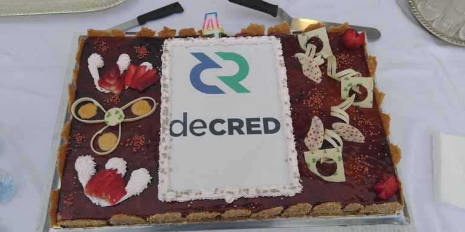

# Decred Journal – Luty 2020

_Obraz: Drugi w historii tort Decred zaobserwowany w Maroko, aut. @arij_

- 8 lutego miała miejsce czwarta rocznica wydobycia bloku genesis projektu Decred i świętowano ją na całym świecie, ponieważ społeczność w co najmniej 11 miastach wzięła udział w pierwszym #DecredGlobalMeetup!
- @Dustorf opublikował raport na temat działań marketingowych projektu w 2019 roku, w którym szczegółowo opisał, co zostało zrobione, jak wydano DCR, co poszło dobrze, a co nie - wraz z przemyśleniami na temat wniosków wyciągniętych na rok 2020.
- Solidny postęp we wszystkich głównych repozytoriach oprogramowania, z optymalizacjami w dcrd, ukończeniem dużej partii komponentów DEX oraz aplikacjami mobilnymi gotowymi do korzystania z nowych zasad konsensusu i bardziej wydajnym SPV.
- Nowa strona decred.org uruchomiona została na początku marca, skupiając się na kluczowym przekazie określonym przez społeczność w 2019 roku i prezentując go w sposób dostępny i estetyczny.

## Przypomnienie o aktualizacji

Głosowanie konsensusowe uruchamiające zmiany zawarte DCP-0005 przeszły pomyślnie i [oczekuje się](https://voting.decred.org/), że zmiany wejdą w życie około 13 marca. Prosimy, aby poświęcić chwilkę czasu na [zaktualizowanie](https://decred.org/wallets/) swojego oprogramowania, aby nie stracić połączenia z siecią.

## Rozwój

[dcrd](https://github.com/decred/dcrd): Dużo pracy w lutym skupiało się na przeróbce pakietu secp256k1 w celu wprowadzenia specjalistycznych optymalizacji:

- [przerobiono](https://github.com/decred/dcrd/pull/2056) zawartość pakietu secp256k1 tak, aby był niezależny od standardowych krypto API biblioteki Go, aby usunąć wiele niepotrzebnych, kosztownych konwersji i pozwolić na więcej optymalizacji w przyszłości
- [zaimplementowano](https://github.com/decred/dcrd/pull/2058) weryfikację podpisu bezpośrednio, zamiast polegać na standardowej bibliotece, która pozwoli na optymalizacje skrojone konkretnie pod krzywą secp256k1
- wprowadzono specjalistyczny kod dla [stałoprecyzyjnej](https://github.com/decred/dcrd/pull/2060) arytmetyki pól, który jest znacznie szybszy niż arbitralnie precyzyjne duże liczby całkowite ze standardowej biblioteki, a także wykonywany jest w stałym czasie
- dodano zoptymalizowane obliczanie pola [pierwiastka kwadratowego](https://github.com/decred/dcrd/pull/2088), które jest mniej więcej dwa razy szybsze niż w przypadku dużych liczb całkowitych

Ponieważ niektóre optymalizacje są trudniejsze do zrecenzowania, dołożono wszelkich starań, aby stopniowo wprowadzać je w życie i dokładnie dokumentować wszystkie stosowane techniki. Jeśli uwielbiasz, gdy matematyka i szybkie obliczenia na poziomie bitowym łączą się w jedną całość, to powinna to być wspaniała lektura.

W szerszym ujęciu, główne korzyści z przebudowy secp256k1 to polepszone szybkość i wykorzystanie pamięci, które odgrywają dużą rolę w ogólnej wydajności oprogramowania, ponieważ weryfikacja podpisów jest tu główną dominującą operacją. Inną ważną korzyścią jest to, że po zakończeniu tego procesu, operacje secp256k1 będą wykonywane w stałym czasie, co zwiększa odporność na atak kanałami pobocznymi. Jest to ważna właściwość dla protokołów współdzielonych, które wykonują wiele podpisów, czego przykładem są protokoły Schnorr multisig.

Inne ulepszenia:

- kod konsensusowy [został przerobiony](https://github.com/decred/dcrd/pull/2031) na nieco bardziej solidny, dzięki wyraźnemu określeniu wymaganych formularzy skryptowych, zamiast [poleganiu](https://github.com/decred/dcrd/pull/2036#issuecomment-583782693) na kodeksie standardowym (np. co może wejść do mempoola i być dalej przekazywane po sieci), który może ulec zmianie bez głosowania konsensusowego
- dozwolony zakres głosów został [zaostrzony](https://github.com/decred/dcrd/pull/2047) dla sieci głównej, aby zapobiec mało prawdopodobnemu wektorowi DoS
- bilety z niezatwierdzonymi danymi wejściowymi są obecnie śledzone [oddzielnie](https://github.com/decred/dcrd/pull/1852), aby usprawnić generowanie szablonów bloków i szacowanie opłat.
- dodano parametry przekroczenia czasu połączenia dla [połączeń TCP](https://github.com/decred/dcrd/pull/2068) i [nieaktywności połączeń typu peer](https://github.com/decred/dcrd/pull/2067)
- rpcserver od teraz [wyraźnie określa](https://github.com/decred/dcrd/pull/2066) jednostki, które akceptuje (atomy vs monety) w kodzie, komunikatach pomocy i dokumentacji API
- zdefiniowano [typy błędów przewodowych](https://github.com/decred/dcrd/pull/2055), trwają prace w kierunku [blokowania połączeń równorzędnych](https://github.com/decred/dcrd/issues/350) pracujących niezgodnie z protokołem przewodowym

[dcrwallet](https://github.com/decred/dcrwallet):

- dodano polecenie utworzenia [niepodpisanych biletów](https://github.com/decred/dcrwallet/pull/1281) w celu ułatwienia stakingu w trybie offline i wsparcia go w portfelach sprzętowych Trezor w przyszłości (firmware Trezora wymaga jeszcze modyfikacji w celu wsparcia stakingu w Decred)
- dodano polecenie [tworzenia podpisów](https://github.com/decred/dcrwallet/pull/1611) dla skryptu wprowadzania transakcji
- dodano polecenie [discoverusage](https://github.com/decred/dcrwallet/pull/1643), aby ręcznie uruchomić wyszukiwanie adresu i/lub wykorzystania konta bez ponownego uruchamiania portfela
- dodano RPC, aby uruchomić [usługę mieszania](https://github.com/decred/dcrwallet/pull/1635) dla poszczególnych kont, która będzie wykorzystywana przez Decrediton
- struktura modułów repozytorium została [uproszczona](https://github.com/decred/dcrwallet/pull/1642) w celu zmniejszenia obciążeń związanych z utrzymaniem
- dodano [pakiet](https://github.com/decred/dcrwallet/pull/1664) do generowania jednolitych, bezpiecznych kryptograficznie liczb pseudolosowych
- zmieniono peer seeding na korzystający z [HTTPS API](https://github.com/decred/dcrwallet/pull/1661)
- przeprowadzono oczyszczenie kodu na szeroką skalę

[Decrediton](https://github.com/decred/decrediton):

- dodano generowanie linków [BIP-0021](https://github.com/decred/decrediton/pull/2418) dla płatności DCR
- dodano [ostrzeżenie](https://github.com/decred/decrediton/pull/2413), o tym, aby tworzyć kopie zapasowe skryptów wykupu (redeem scripts)
- baza kodowa zaktualizowana do [Electron 8](https://github.com/decred/decrediton/pull/2208)
- wprowadzono poprawki błędów i modyfikacje UI
- duża refaktoryzacja logiki uruchamiania została [scalona](https://github.com/decred/decrediton/pull/2425) po wielu miesiącach pracy

[Politeia](https://github.com/decred/politeia):

Zmiany na backendzie:

- sesje zostały [przeniesione](https://github.com/decred/politeia/pull/1113) do userdb, aby umożliwić ręczne unieważnienie sesji, a także jako krok do uruchamiania wielu instancji politeiawww (dla skalowalności i tolerancji błędu)
- [metadane propozycji](https://github.com/decred/politeia/pull/1110) niezbędne dla wniosków dotyczących zapytań ofertowych (RFP) zostały dodane do pamięci podręcznej
- StartVote v2 został [scalony](https://github.com/decred/politeia/pull/1088) (opisany w wydaniu z [grudnia](201912.md#development))
- dodano backendową trasę do pobierania propozycji przez [krótki token](https://github.com/decred/politeia/pull/1116) (pozwoli to na skrócenie adresów URL w GUI)
- CMS otrzymał wstępne wsparcie dla [wykonawców tymczasowych](https://github.com/decred/politeia/pull/1132) oraz kilka mniejszych poprawek

Zmiany na frontendzie:

- dodano tryb [płaskiego wyświetlania](https://github.com/decred/politeiagui/pull/1781) dla komentarzy, aby zwiększyć zauważalność nowych komentarzy bez polowania na nie w całym drzewie dyskusyjnym
- dostosowanie interfejsu użytkownika i optymalizacja wydajności

[dcrpool](https://github.com/decred/dcrpool):

- większość [nowego projektu interfejsu użytkownika](https://github.com/decred/dcrpool/pull/149) została wdrożona. Pierwsza wersja była nieoszlifowanym jeszcze podejściem wykonanym przez programistów, aby wprawić sprawy w ruch, podczas gdy nowa wersja została wykonana poprawnie pod okiem projektantów, aby dopasować się do reszty brandingu Decred
- wprowadzono przyjazne dla człowieka [jednostki czasu](https://github.com/decred/dcrpool/pull/151) w konfiguracji
- poprawki błędów i modyfikacje interfejsu użytkownika

[dcrlnd](https://github.com/decred/dcrlnd): Ogrom pracy związanej z [portowaniem](https://github.com/decred/dcrlnd/pull/74) zmian z głównego repozytorium aż do wydania wersji [v0.9.0-beta](https://github.com/lightningnetwork/lnd/releases/tag/v0.9.0-beta) został ukończony.

[cspp](https://github.com/decred/cspp): Poprawki i ulepszona obsługa błędów

[dcrdex](https://github.com/decred/dcrdex): Najważniejsze osiągnięcia:

- kliencki [serwer RPC](https://github.com/decred/dcrdex/pull/133) dla wiersza polecenia i skryptowego sterowania klientem
- oparta na haśle paczka [szyfrowania kluczy](https://github.com/decred/dcrdex/pull/155) do tajnego przechowywania
- [kolejka zamówień epokowych](https://github.com/decred/dcrdex/pull/143) i walidacja mieszania/tasowania po stronie klienta
- funkcje [logowania się](https://github.com/decred/dcrdex/pull/153) i łączenia dla klienta z użyciem hasła dla całej aplikacji
- [zaimplementowano](https://github.com/decred/dcrdex/pull/145) mniej podatny na przekręty [algorytm](https://github.com/decred/dcrdex/issues/67) deterministycznego dopasowania zamówień, gdzie kolejka epok jest przemieszana w oparciu o kryptograficzne zobowiązania klienta, z preimage'ami ujawnionymi silnikowi dopasowującemu przy zamknięciu epoki (zmiany w specyfikacji są [tutaj](https://github.com/decred/dcrdex/pull/83))
- dodano stronę [portfeli](https://github.com/decred/dcrdex/pull/176) w przeglądarkowym graficznym interfejsie klienta pozwalającym na tworzenie i kontrolowanie portfeli giełdowych
- kopia zapasowa [bazy danych klientów](https://github.com/decred/dcrdex/pull/183)
- przechowywanie wszystkie dane match/swap w [bazie danych](https://github.com/decred/dcrdex/pull/177) serwera, aby umożliwić serwerowi potwierdzenie otrzymania wiadomości związanych z wymianą od klientów
- aktualizacja [instrukcji](https://github.com/decred/dcrdex/pull/175) builda i dokonywania wkładu do projektu

Łącznie scalono 25 pull requestów pochodzących od 7 autorów dodających 12K i usuwających 3K linijek kodu (podsumowanie commitów dostępne jest [tutaj](https://github.com/decred/dcrdex/compare/15d3021da853110baa02b24311b03e457b61be4a...94310f66c06fdf5ca31eeb80c9f6af7aecf4c31d)).

[dcrandroid](https://github.com/decred/dcrandroid): Wersja 1.0.1 wydana na Google Play naprawia kilka błędów i zawiera moduły v1.5 do obsługi nowych zasad konsensusu.

W trakcie prac: wdrożono migrację do formatu [multi-wallet](https://github.com/decred/dcrandroid/pull/426).

[dcrios](https://github.com/raedahgroup/dcrios): Wersja 1.0.1 wydana w App Store naprawia błąd i zawiera moduły v1.5 do obsługi nowych zasad konsensusu.

W trakcie prac:

- nowy UI wdrożony dla widoków [portfeli](https://github.com/raedahgroup/dcrios/pull/567), [transakcji](https://github.com/raedahgroup/dcrios/pull/569) i [otrzymywania transakcji](https://github.com/raedahgroup/dcrios/pull/583)
- wyświetlanie postępu synchronizacji dla [wielu portfeli](https://github.com/raedahgroup/dcrios/pull/579)
- funkcja odblokowywania, aby wznowić [odtworzenie](https://github.com/raedahgroup/dcrios/pull/577) portfela

[dcrdata](https://github.com/decred/dcrdata):

- scalono wreszcie [stronę szacowania kosztu ataku](https://github.com/decred/dcrdata/pull/1664). Prace nad nią rozpoczęły się 6 miesięcy temu dzięki Raedah Group z wkładem głównie od @ademuanthony i @dmigwi przy użyciu [badania](https://medium.com/decred/decreds-hybrid-protocol-a-superior-deterrent-to-majority-attacks-9421bf486292) aut. @zubair (które jest oparte na modelu z artykułu Proof-of-Activity, skorygowanym przez @jy-p, a także pokrywa się z [artykułem](https://github.com/buck54321/dcr-research/blob/master/paper/Attack-cost%20estimation.pdf) aut. @buck54321). Strona ta jest dostępna do testów publicznych [tutaj](https://alpha.dcrdata.org/attack-cost).
- uruchomiono nowe [wykresy](https://github.com/decred/dcrdata/pull/1640) dla [wymieszanych monet](https://alpha.dcrdata.org/charts?chart=coin-supply&bin=day&axis=time&visibility=true%2Ctrue%2Ctrue) oraz [uczestnictwa w ochronie prywatności](https://alpha.dcrdata.org/charts?chart=privacy-participation)
- wprowadzono [tryb płynny](https://github.com/decred/dcrdata/pull/1678) dla wykresów biletów
- poprawki błędów i modyfikacje UI

[tinydecred](https://github.com/decred/tinydecred):

- udoskonalono kod testowy i pokrycie testami
- ukończono [klienta RPC](https://github.com/decred/tinydecred/pull/73)
- ulepszono [obsługę błędów](https://github.com/decred/tinydecred/pull/81)

[docs](https://github.com/decred/dcrdocs):

- [nowe](https://github.com/decred/dcrdocs/pull/1040) strony [przeglądu](https://docs.decred.org/privacy/cspp/overview/) i [poradnika po używaniu](https://docs.decred.org/privacy/cspp/how-to-cspp/) dla CoinShuffle++
- dodano [porady](https://github.com/decred/dcrdocs/pull/1068) odnośnie uruchamiania dcrd i dcrwallet jako usług systemowych
- [ulepszono](https://github.com/decred/dcrdocs/pull/1064) dokumentację LN

[decred.org](https://github.com/decred/dcrweb): Usunięto [wzmianki o Slacku](https://github.com/decred/dcrweb/pull/780), duża aktualizacja projektu i zawartości (patrz sekcja nawiązywania kontaktów poniżej).

Pozostałe:

- Program Bug Bounty opublikował [aktualizację](https://bounty.decred.org/2020/02/status-update/): do tej pory przetworzono 97 zgłoszeń (+14 od aktualizacji październikowej), z czego 11 kwalifikuje się do wypłaty (+1).
- Deweloperzy, którzy zastanawiają się nad tym, jak zacząć wnosić swój wkład do projektu, mogą zacząć śledzić konto [@dcrgoodfirst](https://twitter.com/dcrgoodfirst) na Twitterze.

Statystyki aktywności deweloperskiej za luty: 309 aktywnych PR-ów, 274 commity do gałęzi master, 52K dodanych i 28K usuniętych linijek kodu spośród 20 repozytoriów. Wkład pochodził od 2-6 deweloperów na każde repozytorium.

## Ludzie

Witamy nowych, początkujących współpracowników, których kod scalono z głównymi gałęziami repozytoriów Decred na GitHubie: @mkingori ([dcrdata](https://github.com/decred/dcrdata/commits?author=mkingori)).

Gratulacje dla nowych współpracowników, którym przyznano licencje wykonawców Decred (DCC) przez nowy proces CMS: [@dezryth](https://scottrchristian.com/) (marketing), [@guisso](https://github.com/fguisso) (rozwój).

Gratulujemy nowym [wykonawcom](https://decred.org/contributors/) umieszczonym na stronie decred.org: Mike Winslow (@Exitus, produkcja materiałów medialnych).

Statystyki społeczności:

- Obserwujący na Twitterze: 40 901 (+41)
- Subskrybenci na Reddit: 9738 (+15)
- Użytkownicy na Matrixie: 565 (+32)
- Użytkownicy na Discordzie: 1087 (-1583), zweryfikowani z możliwością pisania postów: 450 (+17) (więcej o tej czystce w sekcji dyskusji społeczności)
- Użytkownicy na Telegramie: 2678 (-50)
- Subskrybenci na YouTube: 3990 (+40)
- Obserwujący na Facebooku: 3580 (+17), polubień: 3249 (+15)
- Obserwujący na LinkedIn: 719 (+30)
- GitHub: 535 gwiazdek (+2) i 1496 forków repozytorium dcrd (+20)

## Zarządzanie

W lutym [Skarbiec](https://explorer.dcrdata.org/address/Dcur2mcGjmENx4DhNqDctW5wJCVyT3Qeqkx) otrzymał 13 018 DCR i wydał 12 622 DCR. Stosując średni dzienny kurs DCR/USD z lutego w wysokości 20,48 USD, do Skarbca wpłynęło 267 tys. dolarów, a wydano z niego 258 tys. dolarów. Przy średnim dziennym kursie grudniowym wynoszącym 18,00 USD, kwota dolarowa naliczona za prace wykonane w tym miesiącu wynosi 227 tys. dolarów. Na dzień 2 marca saldo Skarbca wynosi 643 179 DCR (11,6 mln USD po kursie 18,00 USD).

Wydanie 6. biuletynu [Our Network](https://ournetwork.substack.com/p/our-network-issue-6) zawiera przydatny wykres wpływów do i wydatków ze Skarbca. Na dzień 30. stycznia, Skarbiec otrzymał w sumie 930 tys. DCR, z czego wydał 299 tys.

W lutym pojawiły się 4 nowe [propozycje](https://dcrdata.decred.org/proposals), a nad pięcioma rozpoczęło się głosowanie.

- Propozycja produkcji materiałów wideo aut. @Exitus, która zakładała miesięczny budżet do $2400, została zatwierdzona przy 92,5% akceptacji i frekwencji wynoszącej 24,8%.
- Druga propozycja badań aut. @Checkmate została zatwierdzona stosunkiem 81% głosów poparcia przy frekwencji 21,5%. @Checkmate poprosił o budżet w wysokości $17 500 na kontynuację badań i innych działań, włączając w to pomoc w umieszczeniu kilku wykresów z pracy swojej oraz @permabullnino na dcrdata.
- Propozycja dotycząca marketingu i eventów w Europie aut. @Haon i wspierana przez @jholdstock, @kozel, @jazzah, @mm i @karamble początkowo prosiła o budżet w wysokości 75 000 $, ale zredukowała go do 49 000 $ i usunęła z zakresu propozycji wydarzenie Web Summit w odpowiedzi na opinie i informacje zwrotne. Propozycja została odrzucona 3 marca, uzyskując tylko 38% poparcia, przy udziale wyborców na poziomie 25%.
- Propozycja produkcji materiałów wideo w jęz. rosyjskim została odrzucona przy 21% poparciu i 20% frekwencji.
- Propozycja Decred Creative Economy, przedstawiona przez oscargamboae, została odrzucona przy 3% poparciu i stała się pierwszą propozycją, która nie spełniła wymogu 20% kworum, przy frekwencji jedynie 15% uprawnionych do głosowania biletów.

Aby uzyskać więcej informacji na temat działalności na platformie Politeia z lutego zajrzyjcie do [wydania 27](https://blockcommons.red/politeia-digest/issue027/) oraz [wydania 28](https://blockcommons.red/politeia-digest/issue028/) Politeia Digest.

## Sieć

Hashrate: lutowy hashrate na początku miesiąca wyniósł ~427 Ph/s, a zamknął miesiąc w ok. 356 Ph/s, zaliczając niż w ok. 263 Ph/s oraz szczyt w wys. 578 Ph/s w ciągu miesiąca. Dystrybucja mocy obliczeniowej na 1 marca wyglądała następująco: Poolin 32%, UUPool 27%, lab.antpool.com 12%, BTC.com 1,7%, F2Pool 1,5%, Luxor 1,3%, BeePool 0,1%, CoinMine 0,02% i pozostałe ok. 24% za danymi z [dcrstats.com](https://dcrstats.com/pow). Są to liczby jedynie szacunkowe i nie można ich dokładnie określić.

Staking: średnia cena biletu z okresu 30 dni wynosiła 132,1 DCR (-6,2) za danymi z dcrstats.com na dzień 5 marca. Cena wahała się między 119,8-157,9 DCR. Zablokowana kwota wynosiła 5,40-5,65 mln DCR, co odpowiadało 48,49-51,19% dostępnej podaży.

Od końcówki stycznia ilość [DCR w stakingu](https://explorer.dcrdata.org/charts?chart=ticket-pool-value&zoom=k38z10xk-k7kaa0dk&bin=block&axis=time) doświadczyła miesięcznego spadku z ok. 5,65M do 5,40M, lub 51,5% do 48,5% (-3%) podaży w dostępnej w obiegu, po czym odbiła do poziomu ok. 50%. Cena biletów spadła do poziomu 119,8, po czym błyskawicznie wybiła do poziomu niewidzianego od lat.

Węzły: Przez [luty](https://charts.dcr.farm/d/000000014/nodes?orgId=1&from=1580515200000&to=1583020800000) było około 165 węzłów nasłuchujących i 341 w sumie za danymi z dcr.farm. Średnia dystrybucja wersji na luty wygląda następująco: 40,8% korzysta z dcrd v1.4, 18,2% używa dcrd v1.5, 9,1% korzysta z dcrd v1.5 w wersji deweloperskiej i buildów RC, 12,3% używa dcrd v1.5.1, 4,1% korzysta z dcrd v1.6 w wersji deweloperskiej, 4,7% używa dcrwallet v1.4, 2,6% korzysta z dcrwallet v1.5, a 2,1% to dcrwallet v1.5.1.

Ilość monet wymieszanych (zestaw anonimowości) osiągnęła 20% podaży DCR w obiegu. Decredowe transakcje CoinJoin mieszają między 50-100K DCR dziennie, a 22 lutego osiągnęły nowy szczyt wszechczasów [w wys. 154K DCR](https://twitter.com/_Checkmatey_/status/1232746951294308356), co stanowi równowartość ponad 3 milionów dolarów. Te i inne wskaźniki zostały opublikowane przez @Checkmate w [numerze 10](https://ournetwork.substack.com/p/our-network-issue-10) ([tweet](https://twitter.com/spencernoon/status/1233450761566244865)) biuletynu Our Network. Dla aktualnych liczb wersja alpha dcrdata uruchomiła wykresy [procentowe](https://alpha.dcrdata.org/charts?chart=coin-supply&bin=day&axis=time&visibility=true%2Ctrue%2Ctrue) monet mieszanych oraz [ilość przemieszanych DCR](https://alpha.dcrdata.org/charts?chart=privacy-participation) według dni i bloków.

[Kalkulator kosztu ataku](https://alpha.dcrdata.org/attack-cost) to nowe narzędzie internetowe pozwalające na oszacowanie kosztów ataku na sieć w oparciu o szereg zmiennych, dostępne obecnie wersji alpha serwisu dcrdata.

## Integracje

Pojawił się [raport](https://matrix.to/#/!MgQoetFiyjrHAywokv:decred.org/$158343614832392oTHUs:decred.org) autorstwa posiadacza DCR, który został okradziony przez rozszerzenie Chrome dla portfela Ledger, które poprosiło o ziarno portfela. Z komentarzy wygląda na to, że Google usunął rozszerzenie ze sklepu, ale dopiero po tym, jak kilka osób zdążyło ucierpieć. Zwróćcie szczególną uwagę na to, jakiemu oprogramowaniu powierzacie swoje ziarna!

OKCoin zdecydowało się [zawiesić](https://blog.okcoin.com/scheduled-token-suspensions/) handel DCR ze względu na niski wolumen obrotu, pomimo początkowego entuzjazmu dla Decred, a nawet zorganizowania kilku wspólnych wydarzeń.

KuCoin [ogłosił](https://www.kucoin.com/news/en-decred-soft-staking-official-rules) 17 lutego, że dwa dni później, 19 lutego, rozpocznie usługę stakingu DCR dla swoich deponentów. Użytkownicy KuCoin, którzy posiadają DCR na giełdzie, zostali poinformowani, że są automatycznie włączani do systemu i poinstruowani, aby natychmiast wycofać swoje środki, jeśli chcą z usługi zrezygnować.

> KuCoin będzie dostosowywać proporcje Decred w stakingu w każdym dniu kalendarzowym i obliczać dzienne przychody użytkowników (...) Użytkownicy muszą wziąć pod uwagę, że w związku z uczestnictwem w Programie istnieje potencjalne ryzyko, że Użytkownik może nie być w stanie wycofać wyznaczonej ilości Decred w odpowiednim czasie lub zgodnie z oczekiwaniami, chociaż KuCoin dołoży wszelkich starań, aby uniknąć takiego nieuchronnego opóźnienia.

Ponieważ DCR będą czasowo zablokowane, zdolność KuCoin do dostarczenia ich swoim deponentom będzie zależała od wystarczającej ilości biletów, które muszą oddać głos, aby uwolnić zdeponowane DCR, tak aby giełda mogła przetworzyć wypłaty deponentów.

> Oddzielny projekt: Usługa świadczona przez KuCoin będzie miała wpływ jedynie na wypłatę Decred i nie będzie miała bezpośredniego ani pośredniego wpływu na: (1) handel aktywami Decred na naszej platformie; oraz (2) handel lub wycofanie wszelkich innych cyfrowych aktywów na naszej platformie. W związku z tym, w przypadku, gdy użytkownik nie jest skłonny do przestrzegania kolejności wypłat, ale znajduje się już w kolejce wypłat, może zdecydować się na wymianę Decred na inne żetony i natychmiast je wypłacić.

Wskazuje to, że w scenariuszu, w którym staking DCR KuCoin osiągnie zbyt wysoką proporcję, aby zaspokoić popyt na wypłaty, użytkownicy nadal będą mogli handlować rzeczonymi DCR na rynku, np. w zamian za BTC. Każde przedłużające się opóźnienie w przetwarzaniu wypłat prawdopodobnie obniży cenę DCR na KuCoin, jeśli będzie powszechnie wiadomo, że nie są oni w stanie terminowo spełnić żądania wypłaty.

W ogłoszeniu nie określono żadnej opłaty, jaką KuCoin pobierze za świadczenie tej usługi. Nie wiadomo, czy oznacza to, że nie pobierają oni prowizji, czy też po prostu nie podano jej wartości procentowej.

Uwaga: autorzy Decred Journal nie są w stanie ocenić wiarygodności żadnego z powyższych podmiotów czy ich usług. Uprasza się o dołożenie należnych starań i własnoręczną weryfikację informacji przed powierzeniem jakichkolwiek środków innym stronom.

## Nawiązywanie kontaktów

8 lutego Decred skończył cztery lata, co społeczność świętowała wydarzeniem [#DecredGlobalMeetup](https://twitter.com/hashtag/DecredGlobalMeetup). Wydarzenia odbył się w co najmniej kilkunastu miastach na całym świecie, aby uczcić społeczność projektu i technologię, którą zbudował Decred. @Dustorf opublikował [wpis na blogu](https://medium.com/@dlefebvr/on-saturday-february-8th-the-decred-blockchain-will-have-been-adding-blocks-for-4-years-17fe3038f3bf) oraz [wątek twitterowy](https://twitter.com/lefebvre_dustin/status/1225462426503696384) podsumowujący dotychczasowe postępy Decred.

Opublikowany przez @Dustorf [raport marketingowy](https://blog.decred.org/2020/02/26/Decred-2019-Marketing-Report/) wyszczególnia wszystkie wydatki związane z marketingiem projektu w 2019 roku. Raport zawiera analizę tego, co zadziałało dobrze, a co nie, a także sugestie i wnioski na następny rok. Trzy generalne zalecenia obejmują: wyobrażenie sobie tego, co można osiągnąć społecznie za pomocą stosu technologii Decred, przełamanie bańki, aby rozwinąć Decred poza środowisko krypto, oraz wykorzystanie potencjału każdej jednostki w społeczności. Raport wzywa do decentralizacji działań marketingowych według kryterium geograficznego. W tym celu Ameryka Łacińska z sukcesem przedstawiła już pewną propozycję. Propozycja europejska została złożona, ale nie została zatwierdzona. Oczekuje się, że propozycje dotyczące Brazylii, Stanów Zjednoczonych, Kanady i Australii zostaną przedstawione w marcu. Ponieważ marketing projektu Decred zawsze był przedmiotem dyskysji i debat, każdy, kto jest zainteresowany tą dziedziną, może zapoznać się z raportem i podzielić się swoimi pomysłami w odpowiednim [wątku na Reddicie](https://www.reddit.com/r/decred/comments/fa70c3/decred_2019_marketing_report/).

Na początku marca wprowadzono zmiany na stronie [decred.org](https://decred.org/), które obejmują nową estetyką wizualną, nowy film wprowadzający w projekt i nowe podstrony, które przedstawiają historię Decred i jego trzy założenia: bezpieczeństwo, adaptacyjność, oraz samofinansowanie się. Strona odzwierciedla uzgodniony przekaz, który pozycjonuje Decred jako nadrzędny środek przechowania wartości w oparciu o te trzy założenia.

Decred in Depth wydał w lutym dwa odcinki, [Decred, czyli ekonomiczny przełom](https://decredindepth.libsyn.com/ammar-nasier-decred-an-economic-breakthrough) z udziałem @ammarooni i [DCR w Ameryce Łacińskiej](https://decredindepth.libsyn.com/elian-huesca-dcr-in-latam), goszczący @elian. Ponadto, @mr.black współpracował z @Checkmate i @permabullnino, aby wydać nowy, skupiony na tradingu podcast zatytułowany [Rough Consensus](https://roughconsensus.libsyn.com/rough-consensus-1-rough-start).

DCR Comic uruchomił stronę internetową [dcrcomic.org](https://dcrcomic.org/) zawierającą wszystkie dzieła wykonane przez zespół, z których najnowszy komiks wyjaśnia [Lightning Network](https://twitter.com/DCRComic/status/1229792848188444672).

@Checkmate opublikował niezwykle ciekawy artykuł o [debacie ProgPoW](https://medium.com/@_Checkmatey_/observing-ethereum-governance-during-the-progpow-debate-9bf1aec724ad) w Ethereum, opisujący wady jego systemu zarządzania oraz sposoby wykorzystania narzędzi i metodologii Decred do ich rozwiązania. Jest to doskonały przykład wprowadzenia elementów wyróżniających Decred do szerszych rozmów. Sam post został dobrze przyjęty przez wielu w społeczności Ethereum, w tym przez [Davida Hoffmana](https://twitter.com/TrustlessState/status/1234653059424358400), współgospodarza podcastu POV Crypto.

@dezryth zamieścił pierwszą [aktualizację](https://scottrchristian.com/2020/02/15/dezryth-proposal-updates/) dla swojej propozycji związanej z promocją Decred podczas eventów i w mediach społecznościowych za styczeń.

Monde PR dołączyło do ekipy DCR i szybko [ustanowiło](https://github.com/decredcommunity/pr/pull/7) projekt celów działań public relations, docelowych odbiorców, kluczowego przekazu, punktów oceny wiarygodności, udokumentowało kluczowe tematy, przeprowadziło [analizę konkurencji](https://github.com/decredcommunity/pr/blob/release/competitor-analysis.csv), sporządziło spis wszystkich przedstawicieli Decred, stworzyło kluczowe historie do rozgłosu i promowania, a nawet zaczęło docierać do odbiorców, co zaowocowało pojawieniem się Decred w cennych miejscach:

- [Artykuł](https://cointelegraph.com/news/the-state-of-blockchain-experts-weigh-in-on-adoption-around-the-world) w Cointelegraph z komentarzem od @elian i @akinsawyerr na temat przyjęcia technologii blockchain na całym świecie.
- [Artykuł](https://www.financemagnates.com/cryptocurrency/news/does-china-control-bitcoin-and-ethereum/) w Finance Magnates z komentarzem @jy-p odnośnie centralizacji wydobycia Bitcoina oraz modeli konsensusu.
- [Artykuł](https://eng.ambcrypto.com/bitcoin-building-a-nation-on-the-foundation-of-maximalism/) w AMB Crypto zawierający komentarz od @richardred na temat budowania państwa przez Bitcoin.

## Eventy

_Obraz: #DecredGlobalMeetup w Meksyku_

Na których byliśmy:

- 4-6 lutego - [Africa Tech Summit](https://www.africatechsummit.com/kigali/) - Kigali, Rwanda. @akinsawyer i @beansgum uczestniczyli w tym ponad 600-osobowym wydarzeniu, na którym Akin podzielił się swoimi doświadczeniami związanymi z nawiązywaniem kontaktów z ustawodawcami, startupami i firmami typu venture capital, o czym można przeczytać w [pełnym raporcie](https://github.com/decredcommunity/events/blob/master/reports/20200204-africa-tech-summit-kigali-rwanda.md) z wydarzenia. „Kiedy Decred będzie gotowy do aktywnego wdrażania możliwych zastosowań, które opierają się na naszym stosie technologicznym, będzie wiele otwartych i zdolnych rąk do pracy".
- 6 lutego - [Decred Global Meetup](https://www.meetup.com/Chicago-Decred-Meetup/events/267784883/) - Chicago, USA. ([uwagi](https://matrix.to/#/!aNPTuiryMFmdMQWUzb:decred.org/$158109310014665NneQF:decred.org))
- 6 lutego - [Decred Global Meetup](https://www.meetup.com/DecredBrasil/events/268457863/) - Belo Horizonte - Brazylia. ([zdjęcie](https://twitter.com/Jackson_Duarte/status/1225722800972890112))
- 6 lutego - [Decred Global Meetup](https://www.eventbrite.com/e/decredglobalmeetup-en-buenos-aires-tickets-90817259869) - Buenos Aires, Argentyna. Prowadzone przez @EspacioBitcoin. ([zdjęcia](https://twitter.com/cryptorc_tech/status/1225879454158901248))
- 6 lutego - [Decred Global Meetup](https://www.eventbrite.com/e/decredglobalmeetup-ciudad-de-mexico-en-bitcoin-embassy-bar-tickets-90619377999) - Mexico City, Mexico. Prowadzone przez Bitcoin Embassy Bar. ([zdjęcia](https://twitter.com/bitcoinemb/status/1228091984906113025), [video](https://twitter.com/Decred_ES/status/1225656932431626241))
- 6 lutego - [Decred Global Meetup](https://www.meetup.com/DecredBrasil/events/268449660/) - Natal, Brazylia. @guisso: "Zabawną częścią koszulki jest to, że na początku były eksponowane na stole wejściowym i nikt się nimi nie interesował, ale pod koniec imprezy, kiedy poznali projekt, wszyscy chcieli wziąć udział w ich losowaniu". ([zdjęcie](https://twitter.com/_fguisso/status/1225620169654927360))
- 6 lutego - [Decred Global Meetup](https://www.meetup.com/DecredBrasil/events/268455983/) - Rio de Janeiro, Brazylia. Nie zabrakło piwa. ([zdjęcie](https://matrix.to/#/!MgQoetFiyjrHAywokv:decred.org/$158119750815292FWqOn:decred.org))
- 6 lutego - [Decred Global Meetup](https://www.meetup.com/DecredBrasil/events/268456316/) - São Paulo, Brazylia. ([zdjęcie](https://twitter.com/Decred_ES/status/1225574822928928768))
- 6 lutego - [Odkryj Decred](https://www.meetup.com/DecredCanada/events/268147731/) - Toronto, Kanada. ([zdjęcie](https://matrix.to/#/!aNPTuiryMFmdMQWUzb:decred.org/$158104000314467WqrCH:decred.org))
- 8 lutego - [Decred Global Meetup](https://www.meetup.com/DecredBrasil/events/268496816/) - Salvador, Brazylia. ([zdjęcia](https://matrix.to/#/!MgQoetFiyjrHAywokv:decred.org/$158119740315283cQkoQ:decred.org))
- 8 lutego - [Blockchain i AI](https://www.eventbrite.com/e/blockchain-and-ai-best-tools-for-the-development-of-nations-tickets-91389994935) - Casablanca, Maroko. Na tym wydarzeniu pojawił się drugi publicznie zaobserwowany tort Decred. (zdjęcia: [twitter](https://twitter.com/DecredArabia/status/1226266689492410368), [matrix](https://matrix.to/#/!aNPTuiryMFmdMQWUzb:decred.org/$158119875815325RomyP:decred.org))
- 8 lutego - [Decred Crypto Hangout](https://www.eventbrite.com/e/decred-crypto-hangout-learn-about-career-opportunities-in-the-industry-tickets-91830803405) - Lagos, Nigeria. Pięciu współtwórców Decred dzieliło się wiedzą na temat różnych aspektów projektu. W wydarzeniu uczestniczyło ponad 25 osób oraz przedstawiciele @yellowcardio, @HuobiAfrica i @Telos4africa. ([raport](https://github.com/decredcommunity/events/blob/master/reports/20200208-decred-crypto-hangout-lagos-nigeria.md))
- 27 lutego - [3er After UX Crypto](https://www.eventbrite.com.ar/e/3er-after-ux-crypto-sponsor-decred-tickets-95737271757) - Santa Fe, Argentyna. Decred był sponsorem. ([zdjęcia](https://twitter.com/Decred_ES/status/1233159907194605572))
- 27 lutego - Meetup Decred i Stamping.io - Lima, Peru. @victorarubin przedstawił Decred społeczności Stamping.io i Life Leadership w Limie; w spotkaniu wzięło udział około 60 osób. ([wideo](https://matrix.to/#/!aNPTuiryMFmdMQWUzb:decred.org/$1582953585375340iScnJ:matrix.org))

Na których będziemy:

- 12 marca - Kobiety w Blockchain - Mexico City, Meksyk. Prowadzone przez Bitcoin Embassy Bar.
- 12 marca - Meetup Decred - Montevideo, Urugwaj.
- 12-13 marca - [Blockchain Summit Latam](https://www.blockchainsummit.la) - Panama City, Panama. Decred będzie srebrnym sponsorem.
- 17 marca - Meetup Decred - Bilbao, Hiszpania.
- 18 marca - Meetup Decred - Barcelona, Hiszpania.
- 18 marca - [Campus Party Amazonia](https://brasil.campus-party.org/campus-party-amazonia-2020/) - Manaus, Brazylia. Decred będzie miał 2 prezentacje i kilka innych zajęć.
- 20 marca - [BlockchainUA](https://blockchainua.com/en/) - Kijów, Ukraina. Prelegenci mają reprezentować Decred na największej imprezie w Europie Wschodniej. Kontaktujcie się z @cryptotexty w pokoju [#events](https://matrix.to/#/!aNPTuiryMFmdMQWUzb:decred.org) w celu uzyskania szczegółów.
- 20-21 marca - [CIBTC Blockchain Summit](http://cibtc.es/) - Motril, Hiszpania. Decred będzie złotym sponsorem.
- 24 marca - Meetup Decred - Santiago, Chile.
- 24 marca - Meetup Decred - Madryt, Hiszpania.
- 26 marca - Meetup Decred - Vigo, Hiszpania.
- 27 marca - Meetup Decred - Valencia, Hiszpania.
- 28 marca - [DevOpsDays](https://devopsdays.org/events/2020-natal/welcome/) - Natal, Brazylia. @guisso zaprezentuje, co było potrzebne do wdrożenia środowiska testowego dla dcrlnd z wykorzystaniem docker-compose.
- 5 kwietnia - [Toronto Blockchain Week](https://www.eventbrite.ca/e/discover-decred-an-autonomous-digital-currency-toronto-blockchain-week-tickets-91562362491) - Toronto, Kanada. @ammarooni, @michae2xl i prawdopodobnie również @zubair wziąć udział.
- 9 kwietnia - Bitcoin Road Trip - Buenos Aires, Argentyna.
- 13-17 kwietnia - [Jalisco Talent Land](https://www.talent-land.mx/en/home/) - Guadalajara, Meksyk. Decred jest brązowym sponsorem.
- 24 kwietnia - Meetup Decred - La Paz, Boliwia.
- 6 maja - [Bitcoinference](https://www.eventbrite.com/e/bitcoinference-where-the-blockchain-meets-you-tickets-94598812595) - Cancún, Meksyk.
- 30-31 maja - [Bitconf](https://www.bitconf.com.br/portal/) - São Paulo, Brazylia. Decred przeprowadzi wiele prezentacji na różne tematy.

## Media

Wybrane artykuły:

- Raport marketingowy Decred za rok 2019, aut. @Dustorf przedstawia działania marketingowe w 2019 r., na które wydano 785 tys. USD (podobnie jak w roku poprzednim). Raport zawiera również przemyślenia na temat tego, jak rozwijać i decentralizować działania marketingowe projektu. ([blog.decred.org](https://blog.decred.org/2020/02/26/Decred-2019-Marketing-Report/))
- Decred On-Chain: Wskaźniki finansowe biletów, aut. @permabullnino ([medium](https://medium.com/@permabullnino/decred-on-chain-ticket-funding-rates-4e7233c7b64f))
- Decred On-Chain: Perspektywa Makro + Mikro, aut. @permabullnino ([medium](https://medium.com/@permabullnino/decred-on-chain-macro-microlook-12a26930623e))
- Decred - Nieprzenikniona twierdza, aut. @Checkmate, artykuł zamykający serię 3 części, spoglądający na Bitcoina i Decred pod kątem odporności, psychologii agregacji i adopcji przez użytkowników ([medium](https://medium.com/decred/decred-the-resilient-stronghold-4038dc64dd2a)).
- Nowe wydania [Decred Drive](https://medium.com/@decreddrive) dalej ukazywały się w każdy czwartek dzięki uprzejmości @DecredDragon - zespół DJ dziękuje również za miłe słowa o Dzienniku.
- CryptoEQ przyznało Decred brązowy rating, powołując się na obawy związane z wysokim kosztem zakupu biletu w USD, stosunkowo wysoką inflacją w porównaniu z innymi monetami SoV, oraz tym, że koszt biletu staje się coraz bardziej zmienny ([cryptoeq.io](https://cryptoeq.io/coreReports/decred-abridged)).
- Stan technologii Blockchain: Eksperci wypowiadają się na temat adopcji dookoła świata, aut. Josepha Bircha - z @elian w temacie Ameryki Łacińskiej i @akinsawyerr o Afryce ([cointelegraph.com](https://cointelegraph.com/news/the-state-of-blockchain-experts-weigh-in-on-adoption-around-the-world))
- 4 lata później, czy Decred jest już lepszy od Bitcoina?, aut. Liam Kelly ([cryptobriefing.com](https://cryptobriefing.com/after-four-years-is-decred-better-bitcoin-yet/))

Tłumaczenia:

- Wydanie Decred Journal ze stycznia 2020 przetłumaczone zostało na jęz. arabski (@arij), jęz. chiński (@Dominic) oraz jęz. hiszpański (@francov\_). Dziękujemy Wam wszystkim za głoszenie dobrej nowiny!

Wideo:

- "Dlaczego zdecentralizowana giełda (DEX)", mówiąc prościej, ilustrowany cytat od @moo31337 o odmiennych motywacjach bankierów i programistów FOSS, wyprodukowany przez @Exitus ([youtube](https://www.youtube.com/watch?v=TNcmLrSPMRc))
- Dwutygodniowy update wiadomości Decred - 25 lutego 2020, aut. @Exitus, jest to pierwsza dwutygodniowa aktualizacja dostarczana w ramach zatwierdzonej propozycji ([youtube](https://www.youtube.com/watch?v=RMqrIZcR-Iw)).
- @ivandecredfan kontynuował realizację filmów edukacyjnych Decred w języku rosyjskim nawet po tym, jak jego propozycja nie powiodła się ([youtube](https://www.youtube.com/channel/UCFjXbEDeyhhj2bH2t_eGKGA)).

Audio:

- Decred in Depth, odc. 18. @elian opowiada o życiu w trasie podczas reprezentowania Decred w całej Ameryce Łacińskiej, różnych przypadkach wykorzystania krypto w różnych miejscach oraz strategii akcentowania tropikalnego kontyngentu globalnej społeczności Decred. ([libsyn](https://decredindepth.libsyn.com/elian-huesca-dcr-in-latam), [soundcloud](https://soundcloud.com/decredindepth/elian-huesca-dcr-in-latam))
- Rough Consensus, odc. 1. @Checkmate i @permabullnino otwierają nowy program, opowiadając o instrumentach pochodnych, sezonie na alty i dynamice blockchainów ([libsyn](https://roughconsensus.libsyn.com/rough-consensus-1-rough-start)).
- Decred in Depth: Podsumowanie, odc. 1 (lub odc. 20 Decred in Depth). Dołącz do @Checkmate, @permabullnino i @mr.black, którzy rozmawiają o finansowaniu i bezpieczeństwie blockchainów, atakach 51% i ich najnowszych projektach. ([soundcloud](https://soundcloud.com/decredindepth/dcr-round-up-with-checkmate))

## Dyskusje społeczności

Wiadomości z platform komunikacyjnych:

- Most ze Slacka do Matrixa i Discorda został zlikwidowany 28 lutego, a większość kanałów została zamknięta. Kwestie, które doprowadziły do tej decyzji to m.in. przerwanie automatycznych zaproszeń w 2018 roku, znikające po ok. tygodniu wiadomości prywatne DM oraz historie rozmów, a także migracja najbardziej aktywnych moderatorów do Matrixa. Ci, którzy chcieli dalej śledzić i uczestniczyć w dyskusjach, przenieśli się na Matrixa i Discorda, a z resztą pozostaje się nam jedynie czule pożegnać.
- @Exitus oczyścił nieaktywne konta z Discord, cementując swój żelazny uścisk na mocy wśród mieszkańców decredowego Discorda. Czystka ta usunęła konta, które nie zostały zweryfikowane i nie logowały się w ciągu 30 dni. Każde usunięte konto może zostać ponownie włączone i przejść przez proces weryfikacji.
- Zespół DCRComic dodał pakiet naklejek na Telegrama, które można dodać klikając na ten [link](https://t.me/addstickers/DCRComic) lub klikając na naklejkę umieszczoną przez kogoś innego na czacie. Użytkownicy Telegrama mają teraz do wyboru dwa pakiety naklejek tematycznych ze Stakey'em! Nowy zestaw stanowi uzupełnienie [istniejącego zestawu](https://t.me/addstickers/dcrstakey) naklejek Stakey'go wyprodukowanych przez @lustosa. Wygląda na to, że niewydawanie $1400 na dodatkowy zestaw naklejek telegramowych z tej [propozycji](https://proposals.decred.org/proposals/4acb95564d36488a7ee64683a84dd7954982b2f4743e2f7a15477231f863442f) 2 miesiące temu było dobrym posunięciem!

Wybrane wątki z Reddita:

- @Checkmate podzielił się swoją decredową [listą życzeń](https://www.reddit.com/r/decred/comments/f4i870/decred_wishlist/), na co inni odpowiedzieli swoimi przemyśleniami na jego sugestie, a także kilkoma własnymi pomysłami.
- Raport marketingowy Decred doczekał się [15 komentarzy](https://www.reddit.com/r/decred/comments/fa70c3/decred_2019_marketing_report/); niektóre go chwaliły, a inne nie zgadzały się z jego wnioskami i aspektami.

Wybrane dyskusje z Twittera:

- @Exitus znalazł i wyciągnął [klip](https://twitter.com/coveryfire7777/status/1229517588138528768) z wystąpienia Ark Invest, w którym Cathie Wood mówi, że Decred wygląd „obiecująco".
- @degeri [podzielił się](https://twitter.com/degeri_crypto/status/1233658256737918976) zrzutem ekranu z 5. odcinka 2. sezonu serialu Altered Carbon, gdzie na ekranie widać ceny zdenominowane w wielu kryptowalutach, w tym w Decred. DCR jest jedyną walutą wyświetlaną z dwiema liczbami, budząc spekulacje na temat tego, co to oznacza dla interpretacji prognozy cen na 2400 rok dla DCR.
- @jy-p wrócił na Twittera po długiej przerwie, [zastanawiając się](https://twitter.com/behindtext/status/1232381271252271104) co robią ludzie, którzy pracują nad projektami kryptowalutowymi i nie starają się wyeliminować z systemu „wyroczni”
- [wątek](https://twitter.com/RichardRed0x/status/1231223498787508224) aut. @richardred o Decred DAO, zainicjowany przez [odpowiedź](https://medium.com/@rzs/im-continally-amazed-at-the-lack-of-attention-decred-gets-4a40679246ba) aut. @rzs pytającego na Medium o to, dlaczego Decred nie pojawił się w [aktualizacji](https://medium.com/@rebeccarachmany/dao-falloff-and-revival-2cf74f3c18c1) DAO.
- [DCR Time](https://twitter.com/DCRComic/status/1232714622819602432) praca autorstwa DCR Comic.
- Chris Burniske z trafnym [cytatem](https://twitter.com/cburniske/status/1227617853211336704) z artykułu pt. "Samostanowiące się kryptosieci (Sovereign Cryptonetworks)" aut. Joela Monegro, o tym, że Decred nastawiony i zaprojektowany jest do długoterminowej suwerenności dzięki swoim zdecentralizowanym zasadom zarządzania.
- @Checkmate podsumowuje [Skarbiec](https://twitter.com/_Checkmatey_/status/1224764330878603266) Decred jako bijące serce projektu.

## Rynki

W lutym kurs wymiany Decred wahał się pomiędzy 16,71-24,75 USD / BTC 0,0019-0,0024. Średni dzienny kurs wynosił 20,48 USD.

## Ważne kwestie i wiadomości poboczne

Debata nad algorytmem ProgPoW w Ethereum ponownie rozgorzała, kiedy to zatwierdzono, że należy pójść w stronę hard forka za namową deweloperów, co spowodowało zaskoczenie wśród szerszej społeczności Ethereum, gdzie ProgPoW nie cieszy się jednogłośnym poparciem. Ten [post](https://hudsonjameson.com/2020-03-02-progpow-the-ethereum-community-speaks/) od Hudsona Jamesona opowiada o historii ProgPoW i dochodzi do wniosku, że choć zmiana jest prawdopodobnie dobra, to zagrożenia związane z utrzymaniem spornego hard forka muszą być traktowane poważnie i nie są warte podziału sieci. Społeczność Ethereum wykorzystuje różne mechanizmy sygnalizacyjne, w tym [sondy](https://twitter.com/crypt0snews/status/1231288498474209280) twitterowe i [listy otwarte](https://github.com/MidnightOnMars/EIPs/blob/master/EIPS/eip-2538.md) EIP z kampaniami hashtagowymi. Zgodnie ze szczegółami postu Hudsona, podjęto już szeroko zakrojone wysiłki w celu zmierzenia nastrojów społeczności Ethereum na temat ProgPoW, a zarówno głosowanie monetowe, jak i głosy górników zdecydowanie opowiadały się za ProgPoW. Wykorzystano też wiele innych metod do zebrania sygnałów od społeczności, w tym [Kialo](https://www.kialo.com/ethereum-and-programmatic-proof-of-work-progpow-30878) i prawdopodobnie kilka postów na Reddit. @Checkmate dołączył do debaty z kilkoma [obserwacjami](https://medium.com/@_Checkmatey_/observing-ethereum-governance-during-the-progpow-debate-9bf1aec724ad) na temat tego, jak społeczność ETH postępuje z problemem, opierając się na jego doświadczeniu z podejściem Decred. Problem z nieformalnym sprawowaniem rządów polega na tym, że bez względu na ilość zbieranych sygnałów i to, czy każdy ma szansę zabrać głos, to koniec końców jest tylko parę osób, które faktycznie mają w tej sprawie moc sprawczą, które muszą wyrobić sobie o temacie zdanie i ostatecznie podjąć w nim decyzję. Jest to dość chaotyczny proces, którego końcowy efekt zadowoli jedynie garstkę osób.

Pojawiają się oznaki znacznych [konfliktów](https://decrypt.co/19769/zaki-manian-cosmos-number-two-resigns) w Tendermint, firmie stojącej za blockchainem Cosmos - z której osoba numer dwa, Zaki Manian, odchodzi, aby utworzyć własną firmę skoncentrowaną na projekcie Cosmos, mówiąc, że dyrektor wykonawczy (Jae Kwon) utrudnia progres poprzez niewystarczającą alokację zasobów i skupienie się na nowym projekcie (Virgo) i twitterowej personie (@jaesustein). Ta [aktualizacja](https://gist.github.com/jaekwon/8861452eea20def46b89dfcc79c9212e#file-zaki_and_ref_god-md) od Jae ilustruje, w jak nietypowy sposób koncepcja boskości weszła w grę w całej sprawie. Cosmos zebrał 17 milionów dolarów w przeprowadzonym w 2017 r. ICO, warte około 1 miliarda dolarów kilka miesięcy później. W marcu 2019 roku projekt zebrał kolejne 9 milionów dolarów, gdy uruchomiono pierwszą iterację sieci, ale teraz widać, że postęp w kierunku działającego huba blockchainowego od tego czasu jest bardzo ograniczony.

Dyrektor wykonawczy Block.one Brendan Blumer [ocknął się, stwierdziwszy](https://twitter.com/BrendanBlumer/status/1232318319061061632), że zasady działania sieci EOS zostały zmienione z dnia na dzień, gdy 15 producentów bloków zaproponowało i przepchnęło zmianę w celu zmniejszenia emisji z 5% do 1%. To, że tak się stało, nie jest zaskoczeniem, ponieważ w żadnym momencie nie włożono znaczącego wysiłku w rozwój planowanego „systemu propozycji pracowniczych” opisanego w białej księdze. Niewykorzystane 4% gromadzi się w niewykorzystanym adresie, a skumulowane EOS zostały już raz spalone. Dlaczego fundusz WPF został ostatecznie zamknięty w tę konkretną noc 18 miesięcy później, jest tajemnicą, na którą odpowiedź zna tylko 15 zainteresowanych producentów bloków EOS. Nikt nawet nie uprzedził o tym Brendana! Jednak nie wydaje mu się to przeszkadzać, bo zmiana zasad z dnia na dzień to chleb powszedni w sytuacji, gdzie za zarządzanie odpowiada jedynie 15 podmiotów.

Deweloperzy Bitcoin ABC [opublikowali](https://www.bitcoinabc.org/2020-02-15-miner-fund/) szczegóły dotyczące ich planu wdrożenia wariantu finansowania w postaci nagród blokowych zaproponowanego przez Jiang Zhuoer z BTC.TOP. Wdrożenie to zmieni następujące szczegóły planu: kwota zredukowana do 5%, środki mogą być przekazane na dowolny projekt z białej listy projektów zatwierdzonych, a plan wejdzie w życie tylko wtedy, gdy zostanie uruchomiony przez górników za pośrednictwem BIP9. Wobec pomysłu jakiegokolwiek finansowania prac rozwojowych z nagrody blokowej BCH wciąż pozostaje znaczny [sprzeciw](https://twitter.com/PeterRizun/status/1228787028734574592).

Binance uwikłany został w [spór](https://cointelegraph.com/news/binance-returns-frozen-btc-after-user-promises-not-to-use-coinjoin) z jednym ze swoich użytkowników, który użył portfela Wasabi do mieszania swoich transakcji przez CoinJoin, aby zwiększyć ich prywatność. Czynność mieszania podwyższyła profil ryzyka użytkownika, a jego fundusze zostały zamrożone podczas na czas przeprowadzenia dochodzenia w tej sprawie przez Binance. Ostatecznie użytkownik zgodził się wycofać swoje fundusze, które nie były przez Binance mile widziane, które powołało się na zgodność z prawem singapurskim, aby usprawiedliwić swoje działania. Użytkownik musiał obiecać, że nie będzie już mieszał swoich monet, zanim Binance je zwróci! Jak dotąd nie było żadnych doniesień o tym, że miksery DCR są oznakowane w ten sposób.

Implikacje dotyczące prywatności domen Ethereum Name Service (.ens) zostały rozważone przez Tima Copelanda w [artykule](https://decrypt.co/19423/we-tracked-133000-ethereum-names-and-exposed-their-secrets) na portalu Decrypt. Chociaż wielu użytkowników było świadomych, że mogą naruszyć swoją prywatność, łącząc swój adres domeny z innymi adresami, transakcja, którą zapłacili za swoją domenę .ens, mogła być również wykorzystana do powiązania ich z ich funduszami.

Blockstream wchodzi do bankowości, jako strategiczny partner technologiczny Avanti Financial Group, [nowego](https://avantibank.com/) amerykańskiego banku zajmującego się aktywami cyfrowymi - co zostało [opisane](https://coinspice.io/news/blockstream-bank-to-service-institutional-customers-plans-early-2021-opening/) przez CoinSpice (z pikantnymi ilustracjami). Warunki nie zostały ujawnione.

Casa likwiduje swój produkt [sprzętowego węzła](https://www.coindesk.com/bitcoin-startup-casa-names-new-ceo-as-node-service-goes-open-source), który sprzedał się w ilości ok. 2000 sztuk, a także przekazuje swój kod w domenę [open source](https://blog.keys.casa/open-sourcing-the-casa-node/). Casa skupi się  na swojej usłudze zarządzania kluczami za miesięczną subskrypcję w wys. 10 USD.

Justin Sun z Tron miał pracowity miesiąc, [kupując](https://news.bitcoin.com/steemit-for-sale-tron/) witrynę steemit.com, która jest zbudowana na blockchainie Steem (i jest jego głównym zastosowaniem) i natychmiast ogłaszając, że steemit.com przeniesie się na blockchain Tron. Doprowadziło to świadków Steem (producentów bloków) do uchwalenia [soft forka](https://www.coindesk.com/justin-sun-bought-steemit-steem-moved-to-limit-his-power), który zamroziłby „potajemnie wydobyte udziały Steemit Inc”, nieznane, duże ilości STEEM przechowywane na wielu rachunkach firmy. W dniu 1 marca Justin [uderzył](https://www.coindesk.com/steem-community-mobilizes-popular-vote-in-battle-with-justin-sun) ponownie zaprzęgając giełdy (Binance i Huobi) do głosowania na grupę świadków będących pod jego kontrolą, którzy odwróciliby owego soft forka i uwolnili STEEM posiadane przez Steemit. Po krytyce ze strony użytkowników okazało się, że zarówno [Binance](https://twitter.com/cz_binance/status/1234676941111742467), jak i [Huobi](https://medium.com/huobi-global/community-counts-a-letter-to-the-steem-community-340881448ea7), zamierzają wyciągnąć ze stakingu swoje STEEM i wycofać się z jakiegokolwiek porozumienia zawartego z Sunem.

Pojawiły się również pewne [domysły](https://bitcoinexchangeguide.com/did-justin-sun-rig-super-rep-election-two-tron-dapps-received-votes-from-zion-account/), że Justin Sun wykorzystał głosy z konta „Zion”, aby zakłócić głosowanie społeczności na aplikacje Tron, które sam Sun [wydał się potwierdzić](https://twitter.com/justinsuntron/status/1230215220884201472) stwierdzając, że było to rozwiązanie jedynie tymczasowe, do czasu, aż 3 super przedstawicieli zaktualizuje swoje oprogramowanie, aby „nie doprowadzić do szkód w sieci".

Koordynator IOTA został wyłączony, [wstrzymując](https://bitcoinist.com/iota-trinity-wallet-vulnerability-1-6-million-stolen/) sieć 13 lutego, aby zbadać roszczenia dotyczące kradzieży z portfela Trinity na łączną kwotę 1,6 miliona dolarów. IOTA weszła w podwyższony stan, gdy po kilku dniach przestoju z wyłączonym koordynatorem, [ujawniono](https://blog.iota.org/trinity-attack-incident-part-1-summary-and-next-steps-8c7ccc4d81e8), że wszystkie klucze prywatne użytkowników korzystających ze stacjonarnego klienta Trinity (prowadzonego przez Fundację IOTA) zostały naruszone. Skradziono 8,55 Ti z IOTA, które w tym czasie były warte ok. 2,3 mln dolarów. Trinity zostało narażone na szwank przez złośliwy kod wprowadzony  w zewnętrznej zależności usługi MoonPay, która umożliwiała użytkownikom kupowanie tokenów IOTA bezpośrednio przez Trinity. [Najnowszy stan rzeczy](https://cointelegraph.com/news/iota-prepares-to-relaunch-network-in-one-week) donosi, że istnieje naprawiona wersja Trinity oraz narzędzie do migracji ziaren, a posiadacze IOTA mają 7 dni na przeprowadzenie procedury transferu, zanim fundacja ponownie uruchomi sieć pomiędzy 7 a 10 marca. IOTA straciła 30% swojej wartości w USD w momencie pisania (5 marca), ale użytkownicy, którzy posiadają własne IOTA ,nie mogli ich przenieść od momentu wstrzymania sieci.

Sąd Aragon został [uruchomiony](https://blog.aragon.org/launching-aragon-court/), a jego celem jest zapewnienie cyfrowej jurysdykcji dla DAO, w której będą działać. W Sądzie Aragon spory są rozstrzygane przez jurorów, którzy stakują żetony ANJ i próbują zgadnąć decyzję, którą wybierze większość jurorów. 247 jurorów podpisało się pod uruchomieniem, stawiając łącznie 1 milion ANT (o wartości ~1,3 miliona dolarów). Na początek jurorzy przechodzą "[kampanię precedencji](https://blog.aragon.org/precedence-campaign-primer/)" (ćwiczenie szkoleniowe dla jurorów) z [testowymi](https://twitter.com/Yazanator/status/1228752714873462784) sporami.

Publiczna wersja beta Colony została [otwarta](https://blog.colony.io/the-colony-public-beta-is-live/). Colony to platforma do tworzenia DAO na Ethereum. Poszczególne kolonie nie są publicznie wymienione, więc nie jest jasne, ile ich jest do tej pory lub do czego są wykorzystywane. Colony planuje stać się samowystarczalnym przedsiębiorstwem użyteczności publicznej, zarządzanym przez „Metakolonię”, która w przyszłości będzie miała swoje własne żetony CLNY. Jako prekursor tego przedsięwzięcia, w tym miesiącu [uruchomiona](https://blog.colony.io/introducing-the-betacolony/) została [Betacolony](https://colony.io/colony/beta), sfinansowano przez 10 000 DAI - darczyńcy mogą zarabiać żetony DAI i BLNY wykonując zadania, od naprawiania wsparcia dla portfela sprzętowego po prowadzenie bloga lub tweetowanie o Colony. W Betacolony nie ma żadnych narzędzi decyzyjnych; zamiast tego administratorzy mogą tworzyć zadania, które są następnie wypełniane przez członków i zatwierdzane przez administratorów, którzy przetwarzają wypłatę nagród.

W tym miesiącu projekt DeFi bZx znalazł się w centrum wielu [opowieści](https://www.coindesk.com/everything-you-ever-wanted-to-know-about-the-defi-flash-loan-attack) o exploitach i lukach bezpieczeństwa, gdyż jego nowa funkcja „błyskawicznej pożyczki (flash loan)” została wykorzystana w kreatywny sposób do stworzenia serii transakcji, które manipulowały wyroczniami cenowymi, natychmiast na tym zarabiając. Nowatorskim aspektem tych exploitów jest to, że wszystkie transakcje są przetwarzane w tym samym bloku, co albo generuje zysk dla napastnika, albo transakcja jest nieważna - co sprawia, że jest obciążona bardzo niskim ryzykiem dla napastnika, ponieważ nie jest on zobowiązany do zastawienia transakcji w żaden sposób. Po wykorzystaniu exploita, klucz główny został użyty do edycji smart kontraktów w taki sposób, aby nie mogły być one dłużej wykorzystywane w taki sposób.

Inna grupa publicznie [zgłosiła się](https://medium.com/@1inch.exchange/yes-we-hacked-bzx-fulcrum-but-one-month-ago-3f7e5c437ee3), aby powiedzieć, że miesiąc wcześniej ostrzegła bZx o innej podatności na atak i nie była pod wrażeniem ich reakcji, w tym odmowy wypłacenia rozsądnej nagrody za zgłoszenie w oparciu o pewien techniczny szczegół.

12 giełd wymian zostało zhakowanych w 2019 r. na łączne szkody wynoszące prawie 300 milionów dolarów i 510 000 loginów użytkowników, według styczniowego [raportu](https://cointelegraph.com/news/most-significant-hacks-of-2019-new-record-of-twelve-in-one-year) autorstwa Cointelegraph. Służy to jako przypomnienie, aby zachować ostrożność przy wyborze giełdy, do której mają być wysyłane monety lub poufne dokumenty.

## O tym wydaniu

To 23. wydanie Decred Journal. Spis wszystkich wydań, mirrorów i tłumaczeń dostępny jest [tutaj](https://xaur.github.io/decred-news/).

Większość informacji od stron trzecich jest przekazywana bezpośrednio ze źródła po minimalnym sprawdzeniu poprawności. Autorzy Decred Journal nie mają możliwości zweryfikowania wszystkich publikowanych stwierdzeń. Proszę uważać na oszustwa i przeprowadzać własny research.

Wasze [komentarze](https://github.com/xaur/decred-news/blob/docs/contributing.md#feedback) oraz [wkład](https://github.com/xaur/decred-news/blob/docs/contributing.md) są zawsze mile widziane.

Zasługi (kolejność alfabetyczna):

- redakcja treści: bee, degeri, Dustorf, francov\_, guisso, l1ndseymm, richardred
- recenzje i komentarze: ay-p, chappjc, davecgh, dnldd, emiliomann, jholdstock, lukebp, matheusd, raedah
