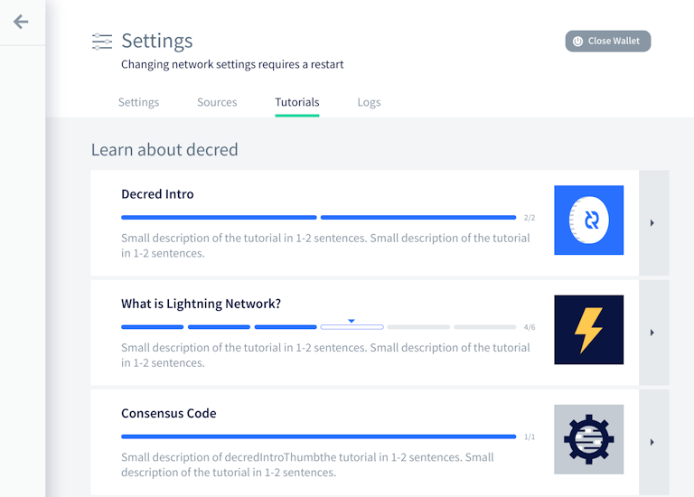
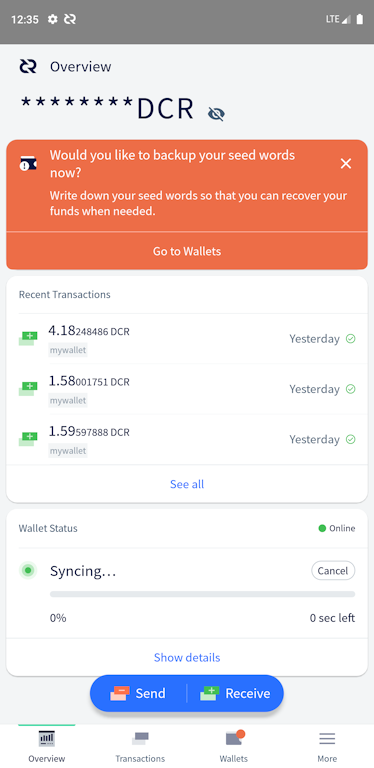

# Decred Journal – Kwiecień 2022

_Obraz: Obiektywne konstrukty aut. @saender_

DJ powraca! W tym numerze przedstawiamy wiadomości z kwietnia, z kilkoma wyjątkami.

Najważniejsze wydarzenia z ostatnich dni:

- Cztery zmiany konsensusu DCP0007-DCP0010 zostały zatwierdzone w kwietniowym głosowaniu interesariuszy z niemal jednogłośnym poparciem (~99,7%) i wszystkie weszły w życie 8 maja, w związku z czym wszystkie węzły korzystające ze starych wersji oprogramowania zostaną odcięte od sieci.
- W marcu większość środków przechowywanych w starym Skarbcu, ponad 610 000 DCR, zostało przeniesione do nowego Skarbca, z którego wydawanie środków wymaga zgody interesariuszy.
- Wersja 1.7.2 oprogramowania węzła Decred i oprogramowania portfela została wydana 11 maja, poprawiono w niej kilka błędów i dodano funkcję głosowania ws. wydatków ze Skarbca dla użytkowników portfela Decrediton.
- Do tej pory w 2022 r. opublikowano cztery propozycje na platformie Politeia, wszystkie zostały zatwierdzone z poparciem 96%+ - przedłużono finansowanie na rozwój Politei i DCRDEX, a także produkcję wideo i twitterowego bota @StakeShuffle\_.

Spis treści:

- [Rozwój](#development)
- [Ludzie](#people)
- [Zarządzanie](#governance)
- [Sieć](#network)
- [Ekosystem](#ecosystem)
- [Nawiązywanie kontaktów](#outreach)
- [Eventy](#events)
- [Media](#media)
- [Dyskusje społeczności](#discussions)
- [Rynki](#markets)
- [Ważne kwestie i wiadomości poboczne](#relevant-external)

## Rozwój

O ile nie zaznaczono inaczej, prace zgłaszane poniżej mają status „scalonych z repozytorium głównym (master)”. Oznacza to, że prace są ukończone, zrecenzowane i zintegrowane z kodem źródłowym, który zaawansowani użytkownicy mogą [kompilować i uruchamiać](https://medium.com/@artikozel/the-decred-node-back-to-the-source-part-one-27d4576e7e1c), ale ich efekty nie są jeszcze dostępne w wersji plików binarnych dla zwykłych użytkowników.

<a id="dcrd" />

**[dcrd](https://github.com/decred/dcrd)**

_dcrd jest pełną implementacją węzła, który obsługuje sieć peer-to-peer Decred na całym świecie._

- Usunięto wszystkie RPC i związany z nimi kod związany z [przegapionymi i wygasłymi biletami](https://github.com/decred/dcrd/pull/2911). Wraz ze zmianą konsensusu dot. [automatycznego anulowania](https://github.com/decred/dcps/blob/master/dcp-0009/dcp-0009.mediawiki), portfele nie będą już ich potrzebowały. Oprócz obniżenia kosztów utrzymania, usunięcie tych funkcji otwiera możliwość optymalizacji wydajności bazy danych biletów.
- Zoptymalizowano sprawdzanie aktualizacji wersji [starych bloków](https://github.com/decred/dcrd/pull/2912).
- Dodano dokumentację dotyczącą tego, czego oczekuje się od [backportowanych pull requestów](https://github.com/decred/dcrd/pull/2934).
- Naprawiono jeden [hazard](https://github.com/decred/dcrd/pull/2932) i przeniesiono poprawkę do wydania poprawkowego v1.7.2.
- Różne optymalizacje kodu, czyszczenie i inne ulepszenia, szczególnie dla dużej zmiany dotyczącej [podziału dotacji z nagrody blokowej](https://proposals.decred.org/record/427e1d4).

Poczyniono większe postępy w pracach nad modułem [prymitywów](https://github.com/decred/dcrd/issues/2786):

- Zaimplementowano [cache dla dotacji](https://github.com/decred/dcrd/pull/2920) z funkcjami do obliczania dotacji dla proof of work, stake, oraz Skarbca. Zawiera on także pełen zestaw testów i benchmarków.

<a id="decrediton" />

**[Decrediton](https://github.com/decred/decrediton)**

_Decrediton to w pełni funkcjonalny desktopowy portfel ze zintegrowaną funkcją głosowania, mieszania StakeShuffle, Lightning Network, handlem na DEX i nie tylko. Działa z lub bez dostępu do pełnego łańcucha (tryb SPV)._

Decredition v1.7.2 został wydany 11 maja po ponad dwóch miesiącach ulepszeń i poprawek (w tym wszystko, co opisano poniżej). Zachęcamy użytkowników do [aktualizacji swojego portfela](https://decred.org/wallets/). Informacje o tym wydaniu sprawdzicie [tutaj](https://github.com/decred/decred-binaries/blob/master/release-notes.md#decrediton-v172). Jak zawsze, przed instalacją należy [zweryfikować pobrane pliki](https://docs.decred.org/advanced/verifying-binaries/).

Integracja z DCRDEX:

- Tryb SPV w DCRDEX [nie jest już eksperymentalny](https://github.com/decred/decrediton/pull/3739). Użytkownicy mogą uzyskać dostęp do zakładki DEX podczas uruchamiania Decredition w trybie SPV.
- Logowanie do DEX [zostanie pominięte](https://github.com/decred/decrediton/pull/3749) po pierwszym uruchomieniu DEX. Powinno to przyspieszyć jego ładowanie i poprawić płynność.
- Moduł DCRDEX został zaktualizowany do wersji [v0.4.3](https://github.com/decred/decrediton/pull/3748) z kilkoma nowymi funkcjami i ważnymi poprawkami błędów. Więcej w sekcji [DEX](#dcrdex).

Usprawnienia nadzoru nad VSP:

- Ulepszono stronę 'Szczegóły głosowania', aby wyświetlała [ostrzeżenie](https://github.com/decred/decrediton/pull/3732), jeśli wybory w głosowaniu nad zasadami konsensusu oddane przez VSP różnią się od tych ustawionych w portfelu użytkownika. Strona będzie również pokazywać VSP, który zarządzał biletem, oraz transakcję, która go wydała (w któej zagłosował).
- Do strony 'Głosowanie' dodano informacje o [głosowaniu blokowym](https://github.com/decred/decrediton/pull/3733) (ostatnia ważność bloku, wersja głosowania, bity głosowania).
- Na karcie 'Zarządzanie' wprowadzono [alert](https://github.com/decred/decrediton/pull/3736) w przypadku używania niezaktualizowanego VSP. VSP, na którym działa starsze oprogramowanie, może nie być w stanie wykorzystać wszystkich preferencji głosowania podczas głosowania biletów użytkowników.

Inne zmiany:

- Wprowadzono zakładkę [wydatki ze Skarbca](https://github.com/decred/decrediton/pull/3718). To tutaj użytkownicy będą głosować nad wydatkami ze wspólnego Skarbca.
- Dodano przeprojektowane widoki [samouczka](https://github.com/decred/decrediton/pull/3669) w zakładce 'Ustawienia', obejmujące wiele aspektów Decred.
- Zakładka 'Staking' zawiera teraz [infografikę](https://github.com/decred/decrediton/pull/3740) dla kupujących bilety po raz pierwszy, przypominającą użytkownikom podstawy systemu głosowania w Decred opartego na czasowym zamykaniu swoich środków w biletach.
- Poprawiono wydajność w zakładce [historia transakcji](https://github.com/decred/decrediton/pull/3745). W szczególności wiersze są teraz ładowane stopniowo przy użyciu nieskończonego przewijania, co zmniejszy przestoje i spowolnienia. Dodano podświetlanie ostatnio klikniętego wiersza, aby śledzić pozycję użytkownika na liście.
- Szyfrowanie dla poszczególnych kont jest teraz automatyczne dla [przywróconych portfeli](https://github.com/decred/decrediton/pull/3746).
- Zwiększono zakres zautomatyzowanych testów interfejsu użytkownika.
- Wprowadzono ~5 poprawek błędów.

_Głosowanie nad wydatkami Skarbca jest już dostępne w Decrediton!_

_RTFM bez opuszczania Decreditona!_

<a id="politeia" />

**[Politeia](https://github.com/decred/politeia)**

_Politeia to system składania propozycji w ekosystemie Decred, który służy do wnioskowania o środki ze Skarbca._

Na backendzie, scalono:

- Naprawiono [dwa](https://github.com/decred/politeia/pull/1633) [błędy](https://github.com/decred/politeia/pull/1635) w kodzie migracji (nie miały wpływu na normalne działanie Politei).

Na backendzie, w toku:

- [Importowanie starszych propozycji](https://github.com/decred/politeia/issues/1425) do nowej bazy danych Politei. Nowe narzędzie do [konwersji](https://github.com/decred/politeia/pull/1631) starszych danych do nowego formatu zostało ukończone. Następne w kolejności jest narzędzie  [importowania](https://github.com/decred/politeia/pull/1632) do ładowania przekonwertowanych danych do bazy danych Politeia na produkcji.

Zmiany w interfejsie użytkownika:

- Dodano nowy komponent do edycji, renderowania i diffowania [Markdown](https://github.com/decred/politeiagui/pull/2741), który zastąpi przestarzały pakiet `react-mde`. Powinno to poprawić UX przy edytowaniu i usprawnić sprawdzanie różnic pomiędzy linijkami danych.
- Dodano [nieskończone przewijanie](https://github.com/decred/politeiagui/pull/2750) do listy propozycji.
- Poprawiono [ładowanie wypełniaczy](https://github.com/decred/politeiagui/pull/2755) dla propozycji.
- Ponownie zaimplementowano stronę [Szczegóły propozycji](https://github.com/decred/politeiagui/pull/2723) używając najnowszych komponentów.
- Wykorzystano nowy sposób renderowania Markdown i obsługi błędów w [pluginie komentarzy](https://github.com/decred/politeiagui/pull/2758).

Zmiany w interfejsie programisty:

- Zaimplementowano nowy [system układów](https://github.com/decred/politeiagui/pull/2748) na stronie głównej. Prymitywy układu, takie jak Column i Row, są teraz ponownie wykorzystywane z biblioteki pi-ui.
- Dodano wspólny [komponent modalny](https://github.com/decred/politeiagui/pull/2749).
- Dodano [flagę do konfigurowania wtyczek](https://github.com/decred/politeiagui/pull/2754) podczas generowania politeiopodobnych aplikacji za pomocą narzędzia CLI `newapp`.
- Nowe funkcje i poprawki we wspólnej [bibliotece pi-ui](https://github.com/decred/pi-ui) (domyślne motywy, etykiety przycisków, prymitywy układu itp.)

<a id="cspp" />

**[cspp](https://github.com/decred/cspp)**

_cspp to serwer do koordynowania mieszania monet za pośrednictwem protokołu CoinShuffle++. Nie jest powierniczy, tzn. nie przejmuje kontroli nad środkami._

Ogłoszono rozpoczęcie prac nad zastąpieniem pojedynczego serwera CoinShuffle++ modelem korzystającym z rozwiązania peer-to-peer:

> wkrótce rozpoczniemy symulacje (p2p cspp vs pojedynczy serwer).
>
> oczekujemy, że najwięcej problemów będzie z rejestracją i timeoutami, ale powinno to być możliwe. o ile wiem, głównym modelem zagrożenia są ataki partycyjne, czy zewnętrzne, czy też wewnętrzne. \[[@behindtext](https://twitter.com/behindtext/status/1506941924585967619), 2022-03-24\]

<a id="dcrdex" />

**[DCRDEX](https://github.com/decred/dcrdex)**

_DCRDEX to niepowiernicza giełda, umożliwiająca handel bez konieczności zaufania, działająca dzięki technologii atomic swaps._

Rozwój DCRDEX idzie jak burza. Z trybu SPV można już korzystać w portfelu Decredition. Dodany został Dogecoin. Zcash i Ethereum czynią stałe postępy w sieci testowej. Obsługa ukrytej usługi Tor jest już gotowa. Interfejs rejestracji, który dla niektórych był nieco mylący, został uproszczony.

Obsługa aktywów:

- Kod Litecoin wykorzystuje teraz i [wymaga SegWit](https://github.com/decred/dcrdex/pull/1554).
- Dodano wsparcie dla [Dogecoin](https://github.com/decred/dcrdex/pull/1558) (w tym niestandardowy [deseralizer bloków](https://github.com/decred/dcrdex/pull/1596) do obsługi połączonych bloków wydobywczych).
- Transakcje Ethereum zawierają teraz [link do etherscan](https://github.com/decred/dcrdex/pull/1572) na stronie zamówień.
- Przygotowania do obsługi [tokenów](https://github.com/decred/dcrdex/pull/1399) opartych na Ethereum.

Inne zmiany:

- Dodano obsługę [ukrytej usługi](https://github.com/decred/dcrdex/pull/1575) Tor. Wprowadza to specjalną obsługę hostów DEX z nazwami .onion.
- Zaktualizowano [UI rejestracji DEX](https://github.com/decred/dcrdex/pull/1589), aby uwzględnić adresy .onion v3. W interfejsie użytkownika wyjaśniono także proces opłat rejestracyjnych.
- Wprowadzono [usprawnienia w zakresie ochrony prywatności](https://github.com/decred/dcrdex/pull/1584) chroniące przed atakami polegającymi na skrobaniu pamięci, których celem są hasła i ziarna użytkowników.
- Lepsza obsługa skrajnych przypadków wygaśnięcia kontraktu na [serwerze](https://github.com/decred/dcrdex/pull/1541) i na [kliencie](https://github.com/decred/dcrdex/pull/1548).
- Różne poprawki błędów, optymalizacje i inne ulepszenia.

> v0.5 nabiera kształtu dzięki wielu dużym zmianom. Wiele z nich jest [już scalone](https://github.com/decred/dcrdex/milestone/16?closed=1), ale obecnie w trakcie przeglądu są przyspieszenie swapu dzięki [transakcjom CPFP](https://github.com/decred/dcrdex/pull/1555), obsługa [kont mieszanych DCR](https://github.com/decred/dcrdex/pull/1498), obsługa MWEB dla LTC, obsługa portfela [Zcash](https://github.com/decred/dcrdex/pull/1570), obsługa portfela [Electrum](https://github.com/decred/dcrdex/pull/1607) (SPV dla wielu aktywów z istniejącymi/zewnętrznymi portfelami) i oczywiście ETH na mainnecie, którą wstrzymywaliśmy przed przejęciem całej uwagi na scenie \[[@chappjc](https://matrix.to/#/!zefvTnlxYHPKvJMThI:decred.org/$sH4VqshHQ7s-yUkldhYG7SGlVpPlyCjExbiLkCoX9Y0), 2022-05-13}]

_Dużo portfeli!_

<a id="dcrandroid" />

**[Decred Wallet (Android)](https://github.com/planetdecred/dcrandroid)**

- [Usunięto logo DCR](https://github.com/planetdecred/dcrandroid/pull/623) z kodów QR.
- Dodano ikonę informacyjną wyjaśniającą, w jaki sposób określany jest [rozmiar transakcji w bajtach](https://github.com/planetdecred/dcrandroid/pull/606) i jaki ma to wpływ na opłaty.
- Użytkownik jest informowany o niskim poziomie [dostępnego miejsca na dysku](https://github.com/planetdecred/dcrandroid/pull/607).
- Dodano ikonę do [ukrywania i pokazywania](https://github.com/planetdecred/dcrandroid/pull/601) stanu portfela na stronie Przegląd.
- [Strona wysyłania transakcji](https://github.com/planetdecred/dcrandroid/pull/624) została przerobiona, aby w jeszcze lepszy sposób informować użytkownika o udanej transakcji.
- Informacje o typie bazy danych zostały dodane do strony [Ustawienia portfela](https://github.com/planetdecred/dcrandroid/pull/626).
- Uniemożliwiono użytkownikom przywracanie zduplikowanych portfeli z [tego samego ziarna](https://github.com/planetdecred/dcrandroid/pull/629), a także importowanie zduplikowanych portfeli tylko do obserwacji przy użyciu tego samego klucza xpub.
- Strona wprowadzania ziarna do przywracania portfela jest teraz bardziej [chroniona przed zrzutami ekranu](https://github.com/planetdecred/dcrandroid/pull/614). Ponadto, podgląd okna aplikacji nie jest już pokazywany w przełączniku zadań.
- Zaktualizowano tłumaczenie [na jęz. francuski](https://github.com/planetdecred/dcrandroid/pull/605).
- ~4 poprawki błędów oraz inne poprawki i optymalizacje.

_Zachowaj informacje o swoim saldzie DCR tylko dla siebie!_

<a id="dcrios" />

**[Decred Wallet (iOS)](https://github.com/planetdecred/dcrios)**

- Użytkownicy mogą używać [danych biometrycznych](https://github.com/planetdecred/dcrios/pull/883), takich jak Touch ID/Face ID, jako hasła i numeru PIN.
- Dodano ikonę informacyjną w celu wyjaśnienia [rozmiaru transakcji w bajtach](https://github.com/planetdecred/dcrios/pull/876) i opłat.
- Okno dialogowe [udanego wysyłania środków](https://github.com/planetdecred/dcrios/pull/902) zostało przerobione.
- Usunięto logo DCR [kodu QR](https://github.com/planetdecred/dcrios/pull/903) do otrzymywania środków.
- Zoptymalizowano przebieg zakładania [konta prywatnego](https://github.com/planetdecred/dcrios/pull/906).
- Wprowadzono zapobieganie przywracaniu [zduplikowanych portfeli](https://github.com/planetdecred/dcrios/pull/905) z tego samego ziarna.
- Różne zmiany, poprawki błędów i inne optymalizacje.

<a id="godcr" />

**[GoDCR](https://github.com/planetdecred/godcr)**

_GoDCR to lekka aplikacja portfela na systemy desktopowe ze zintegrowanym stakingiem, prywatnością i przeglądaniem platformy Politeia._

GoDCR v1.7.0 zostało wydane 11 maja! Jest to pierwsze wydanie mainnet po prawie 8 miesiącach rozwoju i polerowania kodu od wydania v0.9.0 testnet. Rzuć okiem na [uwagi do wydania](https://github.com/planetdecred/godcr/releases/tag/v1.7.0) i sprawdź, czy wydanie rzeczywiście zostało podpisane przez `release@planetdecred.org` (klucz o końcówce `A3C9EB3218CCC3E8`).

Scalone w kwietniu:

- Wizualizacja [dostępnego/zablokowane](https://github.com/planetdecred/godcr/pull/826) salda na stronie Staking.
- Dodano pole wyboru dla [przeniesienia środków](https://github.com/planetdecred/godcr/pull/890) podczas ustawiania usługi mieszania.
- Zapobieganie przywracaniu [zduplikowanych portfeli](https://github.com/planetdecred/godcr/pull/891) z tego samego ziarna lub klucza xpub.
- [Wykorzystanie modalu zamiast tooltipa](https://github.com/planetdecred/godcr/pull/901) do wyświetlania szczegółów propozycji.
- Zapobieganie używaniu konta domyślnego w [StakeShuffle](https://github.com/planetdecred/godcr/pull/904).
- Załatwiono problem istniejącej możliwości [ponownego użycia adresu](https://github.com/planetdecred/godcr/pull/899) na stronie odbioru. Ponadto, dostęp do stron wysyłania i odbierania będzie zablokowany do czasu zakończenia synchronizacji.
- ~14 poprawek błędów, ~10 poprawek UX, refaktoryzacja kodu.
- Bazowa biblioteka [dcrlibwallet](https://github.com/planetdecred/dcrlibwallet) została zaktualizowana, aby wprowadzić nowe funkcje i poprawki do portfeli Android, iOS i GoDCR.

W trakcie realizacji:

- Wstępna [integracja z DEX](https://github.com/planetdecred/godcr/issues/619), w szczególności [konfiguracja portfela](https://github.com/planetdecred/godcr/pull/798) i [rejestracja DEX](https://github.com/planetdecred/godcr/pull/900).

_Przegląd salda w GoDCR. Nie patrz tylko, a naciśnij przycisk!_.

**Pozostałe**

- Aktualizacje dla [Go 1.18](https://github.com/decred/dcrctl/pull/45) w wielu repozytoriach kodu.
- Zaktualizowano program [Decred Bug Bounty](https://bounty.decred.org/). W sumie przetworzono 228 zgłoszeń, z których 21 kwalifikowały się do wypłaty nagrody. Szczegóły trzech luk bezpieczeństwa mogą teraz zostać wyjawione na światło dzienne. Gratulujemy @Al1ex oraz @aditi\_singghh, którzy wpisani zostali do Hali Sław! Dzięki należą się [@degeri](https://twitter.com/degeri_crypto) za opiekę nad i obsługę programu.

## Ludzie

Witamy nowych, początkujących współpracowników, których kod scalono z głównymi gałęziami repozytoriów Decred na GitHubie:  @Juneezee ([dcrdex](https://github.com/decred/dcrdex/commits?author=Juneezee)) oraz @yaroyazeed ([dcrandroid](https://github.com/planetdecred/dcrandroid/commits?author=yaroyazeed))!

Wiadomości Decred cieszą się nową twarzą. [@Dajana_DCR](https://twitter.com/DajanaDcr) od teraz pomaga @Exitus jako nowa prowadząca, wprowadzając nieco pozytywnego zamieszania! Jej [debiut](https://www.youtube.com/watch?v=BSHywc5qRzU&t=38s) otrzymał ponad 1000 wyświetleń oraz 101 polubień.

Statystyki społeczności na dzień 2. maja (w porównaniu do statystyk z wydania [Dziennika](202112.md) z grudnia 2021):

- Obserwujący na [Twitterze](https://twitter.com/decredproject): 54862 (+3946, +987/mc)
- Subskrybenci na [Reddit](https://www.reddit.com/r/decred/): 12621 (+133, +33/mc)
- Użytkownicy na [Matrix](https://chat.decred.org/) w pokoju #general: 662 (+63, +16/mc)
- Użytkownicy na [Discordzie](https://discord.gg/GJ2GXfz): 2293 (+118, +30/mc)
- Użytkownicy na [Telegramie](https://t.me/Decred): 2828 (-332, -83/mc)
- Subskrybenci na [YouTube](https://www.youtube.com/decredchannel): 4639 (-1), wyświetleń: 207K (+7K, +1.8K/mc) \*

_* poprawiono z "214K (+14K, +3.4K/mc)" dn. 2022-05-21_

## Zarządzanie

W kwietniu nowy [Skarbiec](https://dcrdata.decred.org/treasury) otrzymał 9481 DCR o wartości 575 tys. USD. 1152 DCR zostało wydane z dotychczasowego adresu Skarbca, aby zapłacić kontrahentom, co stanowiło wartość $70K po kwietniowym kursie, lub $66K po marcowym kursie rozliczeniowym $57,22.

W lutym i marcu około 617 tys. DCR zostało przeniesione z dotychczasowego adresu Skarbca na nowy nowe konto, z którego wydatkowanie wymaga zgody interesariuszy.

Na dzień 10 maja, łączne saldo [starego](https://dcrdata.decred.org/address/Dcur2mcGjmENx4DhNqDctW5wJCVyT3Qeqkx) i [nowego Skarbca](https://dcrdata.decred.org/treasury) wynosi 788247 DCR (32,7 mln USD po kursie 41,52 USD). W dotychczasowym Skarbcu pozostaje około 46K DCR lub ~6% całości.

Od ostatniego wydania Decred Journal ([grudzień 2021](202112.md)), na platformie Politeia opublikowano cztery propozycje, z których wszystkie zostały zatwierdzone.

[Propozycja](https://proposals.decred.org/record/4475472) dalszego rozwój Politei na kwotę 138600 USD została zatwierdzona w marcu z 97% poparciem i frekwencją 55%. Dzięki temu rozwój Politei będzie finansowany do lipca 2022 roku.

[Propozycja](https://proposals.decred.org/record/6e9b633) autorstwa @Exitus o sfinansowanie produkcji treści wideo na kwotę 32000 USD, obejmująca pozostałą część 2022 roku, została zatwierdzona w marcu przy 98% poparciu i frekwencji 55%.

[Propozycja](https://proposals.decred.org/record/1a290d8) kontynuowania promocji Decred za pomocą twitterowego bota @StakeShuffle_ na kwotę 1684 USD zostałą przyjęta z poparciem 96% i frekwencją 55%.

[Propozycja](https://proposals.decred.org/record/3326c82) kontynuowania fazy 3 rozwoju DCRDEX na kwotę 370 tys. USD została zatwierdzona w styczniu z 97% poparciem i frekwencją 57%.

Wszystkie zmiany konsensusu wdrożone jako część wydania v1.7 zostały zatwierdzone przez głosujących z bardzo podobnymi wynikami: 99,9% aprobaty z puli 60% biletów biorących udział w głosowaniu (w przeciwieństwie do głosów wstrzymujących się, które stanowiły ~40%), było tylko 61 głosów przeciwko [zmianie podziału dotacji](https://proposals.decred.org/record/427e1d4) (vs 23664 głosów na "tak"). Biorąc pod uwagę sprzeciw wobec propozycji zmiany podziału dotacji, który był wyrażany w niektórych kręgach, wynik sugeruje, że przeciwnicy tej propozycji albo nie dysponowali żadna (znaczną) ilością biletów, albo z jakiegoś powodu nie zdecydowali się głosować z nimi na "nie".

Zmiany zostały aktywowane 8 maja, więc wraz z nowym podziałem dotacji ([DCP-10](https://github.com/decred/dcps/blob/master/dcp-0010/dcp-0010.mediawiki)) w życie weszły nowe zasady wydawania pieniędzy ze Skarbca ([DCP-7](https://github.com/decred/dcps/blob/master/dcp-0007/dcp-0007.mediawiki)), wyraźne aktualizacje wersji ([DCP-8](https://github.com/decred/dcps/blob/master/dcp-0008/dcp-0008.mediawiki)) i automatyczne odwoływanie biletów ([DCP-9](https://github.com/decred/dcps/blob/master/dcp-0009/dcp-0009.mediawiki)).

## Sieć

**Hashrate**: kwietniowy [hashrate](https://dcrdata.decred.org/charts?chart=hashrate&zoom=l1ezonii-l2odxr6y&bin=day&axis=time) na początku miesiąca wyniósł ~261 Ph/s, a zamknął go na poziomie ~331 Ph/s, zaliczając niż w ok. 212 Ph/s oraz szczyt w wys. 370 Ph/s w ciągu miesiąca.

Dystrybucja mocy obliczeniowej [zadeklarowana](https://miningpoolstats.stream/decred) przez pule wydobywcze na dzień 10. maja: Poolin 52%, ViaBTC 24%, F2Pool 8%, AntPool 6%, Luxor 5%, BTC.com 3%, CoinMine oraz OKx mniej niż 1%.

Podział 1000 bloków [wydobytych](https://miningpoolstats.stream/decred) przed 10 maja: Poolin 51%, ViaBTC 16%, DsV1GF7 9%, Luxor 4%, BTC.com 4%, F2Pool 3.6%, CoinMine 0.4%, DsX51bV 0.1%, nieznane 12%.

**Staking**: [Cena biletów](https://dcrdata.decred.org/charts?chart=ticket-price&zoom=l1ezonii-l2odxr6y&bin=window&axis=time&visibility=true-true&mode=stepped) wahała się między 195 a 228 DCR, a jej 30-dniowa [średnia](https://dcrstats.com/) wyniosła 214,2 DCR.

[Zablokowana suma](https://dcrdata.decred.org/charts?chart=ticket-pool-value&zoom=l1ezonii-l2odxr6y&bin=block&axis=time) to pomiędzy 8,58-8,89 miliona DCR, co oznacza, że 61,4%-63,0% podaży dostępnej w obiegu [wzięło udział](https://dcrdata.decred.org/charts?chart=stake-participation&zoom=l1ezonii-l2odxr6y&bin=block&axis=time) w elemencie Proof of Stake.

63,03% podaży w stakingu oznacza, że to **nowy szczyt!**

_My tu tylko stakujemy. No, może troszkę więcej, niż zwykle. Nic ciekawego!_

**VSP**: 10 maja ~6780 biletów w puli było zarządzanych przez 15 [oficjalnych](https://decred.org/vsp/) serwerów vspd, co stanowiło ok. 16,6% z całej puli biletów. Jest to niewielki wzrost o ~230 biletów lub +0,4% puli biletów, w porównaniu z naszym ostatnim snapshotem z 2 stycznia.

Bilety legacy (ze starej infrastruktury VSP - dcrstakepool) nie mogą być już głosowane od 8 maja, kiedy to łańcuch przeszedł na nowe zasady konsensusu. 10 maja 7 oficjalnych i 1 nieoficjalny VSP zgłosiło łącznie kontrolę nad 125 biletami, ale ta liczba jest nieaktualna. 5 z tych VSP przestało głosować między majem 2021 a lutym 2022. 3 pozostałe VSP, które działały do samego końca, 8 maja miały 27 biletów. coinmine.pl, decredbrasil.com i stakey.net okazały się najbardziej hardcorowe.

**Węzły**: Przez cały kwiecień w sieci było około 175 dostępnych węzłów według [PD Analytics](https://analytics.planetdecred.org/nodes).

[Migawka](https://nodes.jholdstock.uk/user_agents) wersji węzłów na dzień 10 maja (187 ogółem, tylko dcrd): v1.7.1 - 49%, v1.7.0 - 17%, v1.7.0 dev build - 9%, v1.6.2 - 5%, v1.8.0 dev build - 4%, v1.6.0 - 2%, v1.7.2 - 2%, v1.5.2 - 2%, inne - 7%.

Ilość [monet mieszanych](https://dcrdata.decred.org/charts?chart=coin-supply&zoom=jz3q237o-la8vk000&scale=linear&bin=day&axis=time&visibility=true-true-true) wahała się w granicach 57,9%-59,3% monet dostępnych w obiegu. Dzienna [kwota mieszana](https://dcrdata.decred.org/charts?chart=privacy-participation&zoom=jzuht6o0-l33oao00&bin=day&axis=time) oscylowała w granicach 290-450K DCR.

Na 10 maja sieć [Lightning Network](https://ln-map.jholdstock.uk/) w Decred ma 45 węzłów, 78 kanałów o łącznej pojemności 41,5 DCR - jest to niezły skok od styczniowych 36 węzłów, 66 kanałów i 25,5 DCR pojemności.

## Ekosystem

Nowe VSP o nazwie [big.decred.energy](https://github.com/decred/dcrwebapi/pull/161) zarządzane przez [@DCR_uncle](https://twitter.com/DCR_Uncle) przechodzi właśnie przez proces wpisywania na oficjalną listę VSP sieci Decred.

Uwaga: autorzy Decred Journal nie są w stanie ocenić wiarygodności żadnego z powyższych podmiotów czy ich usług. Uprasza się o dołożenie należnych starań i własnoręczną weryfikację informacji przed powierzeniem jakichkolwiek środków innym stronom.

## Nawiązywanie kontaktów

Osiągnięcia Monde PR:

- Podrzucono wzmianki o Decred do 8 felietonów o tematyce finansowej i krypto.
- Odpowiedziano na 1 prośbę o komentarz.

Obecność w mediach dzięki Monde PR:

- @jy-p wystąpił w filmie dokumentalnym ARTE-TV zatytułowanym "Czy kryptowaluty są lepszym pieniądzem?". Dokument był wyemitowany w telewizji ARTE w języku [francuskim](https://www.arte.tv/fr/videos/101938-007-A/42-la-reponse-a-presque-tout/) i [niemieckim](https://www.arte.tv/de/videos/101938-007-A/sind-kryptowaehrungen-das-bessere-geld/), a także pojawił się online. Oto wersja z [angielskimi napisami](https://vimeo.com/694783460) (hasło Db9p6ki).
- @jy-p udzielił wywiadu dla [Coin Rivet](https://coinrivet.com/decred-founder-reveals-how-it-bounced-back-from-miner-manipulation/) mówiąc o postępach Decred od 2018 roku i zmianie podziału dotacji. Artykuł został powielony w [Yahoo! Finance](https://finance.yahoo.com/news/decred-founder-reveals-bounced-back-135936130.html).
- Artykuł w [Cryptopolitan](https://www.cryptopolitan.com/20-quotes-about-bitcoin-predictions/#8_Jake_Yocom-Piatt) zawierający komentarz @jy-p na temat Bitcoina.
- Artykuł w [Finder](https://www.finder.com/litecoin-ltc-price-prediction) zawierający komentarz @jz na temat Litecoina.

## Eventy

**Na których byliśmy:**

- @Exitus wziął udział w [meetupie krypto](https://twitter.com/exitusdcr/status/1506118577035825157) w Hashhouse w kolumbijskim Medellin, gdzie opowiadał uczestnikom o Decred i jego unikalnych cechach.
- [Insaf Nori](https://twitter.com/in_insaf/status/1506976446044114944) (@arij) została zaproszona, aby opowiedzieć o [technologii blockchain](https://decredcommunity.github.io/events/index/20220326.1) oraz technologii u podstaw Decred podczas warsztatów organizowanych przez członków AEFDS Deroua w Maroku.

## Media

[@Applesaucesome](https://twitter.com/applesaucesome1/status/1517024462222336000) napisał tutorial korzystania z [pełnego węzła](https://medium.com/@applesaucesome.dcr/decred-full-node-on-digital-ocean-92b904922291) z wykorzystaniem technologii cloud na przykładzie Digital Ocean.

> **Zapytacie "po co operować pełnym węzłem"?**
>
> *Pełne węzły to kręgosłup sieci Decred. Uwierzytelniając i przesyłając dalej transakcje bez polegania na trzecich stronach pomagają one utrzymać sieci swój zdecentralizowany charakter. Każdy nowy pełen węzeł dodany do sieci poprawia jej bezpieczeństwo i odporność.*

Dostępne są też poradniki dla urządzeń [Raspberry Pi](https://www.youtube.com/watch?v=B-5O_GBcbV0).

Poznajcie [decredsociety.com](https://www.decredsociety.com/) - nową stronę poświęconą pomysłom, wiadomościom, i innym aspektom związanym z Decred autorstwa @phoenixgreen. Udzielać się tam też będzie @Applesaucesome, dzieląc się ze społecznością informacjami technicznymi i innymi związanymi z rynkami Decred.

**Wybrane artykuły:**

- [Top 10 monet prywatnościowych i jak je kupić](https://www.binance.com/en/blog/fiat/top-10-privacy-coins--how-to-buy-them-421499824684903655), aut. Binance (Decred #4)
- [Cena Decred szybuje w górę o 45% w jeden dzień na 3 tygodnie przed dużym hard forkiem](https://cointelegraph.com/news/decred-price-soars-45-in-one-day-three-weeks-before-a-major-hard-fork), aut. Yashu Gola z Cointelegraph
- [Szerzące się sankcje robią z monet prywatnościowych łakomy kąsek](https://www.coindesk.com/markets/2022/04/13/spread-of-sanctions-makes-privacy-tokens-the-hot-bet-in-crypto-markets/), aut. Lyllah Ledesma z CoinDesk
- [Przepowiednia cenowa Decred: oto dlaczego DCR leci prosto do góry](https://www.investingcube.com/decred-price-prediction-heres-why-dcr-is-going-vertical-cryptocurrencies/), aut. Crispus Nyaga z InvestingCube

**Wideo:**

- [Wiadomości Decred - głosowanie on-chain w toku, dcrd 1.7.1, aktualizacje LN, zmiana dotacji + nowa prowadząca!](https://www.youtube.com/watch?v=BSHywc5qRzU), aut. @Exitus
- [Tutorial dla Decred DEX: handel peer-to-peer za pomocą technologii atomic swap](https://www.youtube.com/watch?v=XaE_xzGKjeQ), aut. @Exitus
- [Eksplorator bloków Decred - seria DCRDATA, cz. 1](https://www.youtube.com/watch?v=o4Cye1CRThs), aut. @phoenixgreen
- [Hard fork vs soft fork - podstawy Decred](https://www.youtube.com/watch?v=DmkQrk3OInU), aut. @phoenixgreen
- [Sześć lat Decred - część 1](https://www.youtube.com/watch?v=0Z50aW-RZtw), aut. @phoenixgreen
- [Sześć lat Decred - część 2](https://www.youtube.com/watch?v=CI4yFLfHnqc), aut. @phoenixgreen
- [Czym jest kryptowaluta Decred i jak sobie radzi](https://www.youtube.com/watch?v=30waU59s4Jk), aut. Kalkine Media

Nowa comiesięczna inicjatywa LiveStream o nazwie "Decred i stan rynku" została rozpoczęta przez @phoenixgreen i @Exitus. Każdy chętny członek społeczności jest mile widziany!

- [Sankcje, konfiskaty i regulacje](https://www.youtube.com/watch?v=t3KQ4UhNNOI), aut. @Exitus i @phoenixgreen
- [Stablecoiny i DAO](https://www.youtube.com/watch?v=a5W_90nuJQ8), aut. @Exitus i @phoenixgreen

**Wideo na TikToku:**

- [O tym, jak ważna jest rola Skarbca w DCR](https://www.tiktok.com/@decred_crypto/video/7081478628759833861), aut. @Exitus and @DCR\_Dajana
- [O tym, jak Cathie Wood wspomniała o Decred](https://twitter.com/DajanaDcr/status/1511162514779914241), aut. @Exitus i @DCR\_Dajana

**Coś dla oka i serca:**

- [Decred jako narzędzie do wszystkiego](https://twitter.com/exitusdcr/status/1513394638446542849), aut. @Exitus
- [DCRDEX atomic-swap](https://twitter.com/exitusdcr/status/1518466782037745666), aut. @Exitus
- [Decred Ramadan](https://twitter.com/DecredArabia/status/1509991552382349312), aut. @DecredArabia

Zachęcamy do dzielenia się memami na kanale `#DCR Memes` na Discordzie i Matrixie!

**Treści nieaglojęzyczne**:

- Konto twitterowe [Decred Brazil](https://twitter.com/Decred_BR) aktywnie wrzuca tweety o aktualizacjach, nowościach, itd.

## Dyskusje społeczności

Wybrane posty z Reddita:

- Główny deweloper dcrd @davecgh [odpowiada na krytykę odn. propozycji zmiany podziału nagrody blokowej na 10/80](https://www.reddit.com/r/decred/comments/ueaqrt/when_is_the_108010_system_is_gonna_take_place/i6zx6v6/?context=3) wniesioną przez górników DCR

Wybrane dyskusje z Twittera:

- [Śledzenie podaży i popytu DCR](https://twitter.com/PermabullNino/status/1516441186763952140), aut. @PermaBullNino
- [Decred, zdecentralizowany](https://twitter.com/behindtext/status/1520039910350237698), aut. @jy-p
- [Poznając tajniki Decred](https://twitter.com/DCR_Uncle/status/1515224110682415106), aut. @DCR\_Uncle
- [Porównanie PoW vs PoS](https://twitter.com/behindtext/status/1514626081902505985), aut. @jy-p

## Rynki

W kwietniu kurs wymiany DCR mieścił się w przedziale $52,40-$86,20 / BTC 0,00129-0,00216. Średni dzienny kurs wynosił $57,22.

DCR poszybowało w górę aż o 45% do ponad $86 w jeden tylko dzień, 18. kwietnia, odnotowawszy tym samym najwyższy kurs w ostatnich czterech miesiącach. Niestety, wzrost ten był bardzo krótkotrwały.

_Kwietniowo-majowy wolumen na DEX, w DCR_

_Miesięczny wolumen DEX, w DCR_

## Ważne kwestie i wiadomości poboczne

Ostatnia duża porcja wiadomości, która wydają się wpływać na rynki kryptowalut, jest związana z upadkiem LUNA i de-peggingiem jego powiązanego stablecoina (UST) - i istnieją opinie, że zjawisko to było napędzane przez jednego gracza, który zszortował kurs tokenów, aby zyskać na tej ewentualności. W chwili pisania tego tekstu (12 maja) najnowsze informacje mówią, że blockchain Terra został [zatrzymany](https://www.coindesk.com/business/2022/05/12/luna-issuer-terra-halts-blockchain-after-week-of-losses/), aby zapobiec atakom na zarządzanie, ponieważ wartość LUNA spadła zbyt nisko i cały blockchain stał się podatny na ataki, a osoby zatwierdzające będą koordynować ponowne uruchomienie łańcucha. Jest to najbardziej znacząca porażka "stablecoina" w utrzymaniu swojej wartości do tej pory, ponieważ LUNA osiągnęła wycenę 41 miliardów USD, co umieściło ją w pierwszej 10 kapitalizacji rynku kryptowalut, ale szybko straciła 97,5% tej wartości, ponieważ UST stracił swój peg do dolara i [wyszło na jaw](https://thedefiant.io/do-kwon-terra-luna-spiral-humility/), że założyciel, Do Kwon, pod pseudonimem stał za kilkoma innymi nieudanymi stablecoinami. Ta katastrofa wciąż się rozwija, ale wydaje się, że spowoduje duże straty dla osób, które zainwestowały w ekosystem Terra i zaufały jego koncepcji stablecoinów - a już teraz przyciąga również zwiększoną uwagę organów regulacyjnych [https://thedefiant.io/ust-meltdown-regulation-yellen/] na przestrzeń stablecoinów i DeFi.

W kwietniu społeczność JUNO zagłosowała za [konfiskatą](https://www.coindesk.com/layer2/2022/04/29/juno-blockchain-community-officially-votes-to-revoke-whales-tokens/) milionów dolarów tokenów z portfela użytkownika, który został oskarżony o oszustwo w trakcie airdropu, aby otrzymać 10% wszystkich zrzuconych tokenów. Po początkowej sondzie nastrojów w marcu, która opowiedziała się za odebraniem tokenów wielorybowi, posiadacz zgłosił się i twierdził, że tokeny należą do jego klientów. Chociaż głosowanie nad zablokowaniem dostępu do wszystkich tokenów użytkownika przeszło z 74% aprobatą, powiedział on, że rozważa podjęcie działań prawnych, jeśli tokeny nie zostaną zwrócone klientom, którzy są ich prawowitymi właścicielami.

Most Ronin, związany z grą play to earn od Axie Infinity, w marcu został [zhakowany](https://cointelegraph.com/news/the-aftermath-of-axie-infinity-s-650m-ronin-bridge-hack) na $600M, kiedy to atakujący uzyskał dostęp do kluczy prywatnych 4 walidatorów prowadzonych przez Sky Mavis (twórców gry) i jednego przez "Axie DAO", co to wystarczyło mu do przejęcia kontroli i kradzieży środków. [Wydaje się również](https://twitter.com/ericgoldenx/status/1508844665881116674), że atakujący próbowali wykorzystać atak, aby zyskać finansowo na spadku kursów przez zszortowanie tokenów RON i AXS, ale ponieważ nikt nie zauważył brakujących środków przez tydzień od ataku, krótka pozycja atakującego została zlikwidowana zanim świat dowiedział się o ataku. W kwietniu Grupa Lazarus w Korei Północnej została [ujawniona](https://twitter.com/chainalysis/status/1514645221027594245) przez Chainalysis jako beneficjent włamania.

Yuga Labs nie próżnowali w 2022 roku - w samym tylko kwietniu [nabyli](https://techcrunch.com/2022/03/11/bored-apes-maker-yuga-labs-acquires-cryptopunks-nft-collection/) prawa do Cryptopunks NFT i dostosowując je do warunków użytkowania BAYC oraz [wprowadzili](https://nftnow.com/news/bayc-official-apecoin-token-launch/) token APE służący jako waluta dla ich ekosystemu w marcu, a następnie [wyemitowali](https://www.coindesk.com/business/2022/05/01/bayc-team-raises-285m-with-otherside-nfts-clogs-ethereum/) akty własności do ziemi w metaversie BAYC (Otherside). Wprowadzenie aktów własności w Otherside zakończyło się sukcesem w postaci pozyskania 285M$ dla Yuga Labs, ale zostało szeroko [skrytykowane](https://decrypt.co/99256/bored-ape-creators-slammed-nightmare-ethereum-nft-land-drop) za kiepski tryb uruchomienia i wdrożenia, w którym użytkownicy wydali 180M$ w opłatach ETH w aukcji cen gazu na słabo zoptymalizowanych inteligentnych kontraktach.

Kryptowaluty pojawiły się na wiele sposobów w konflikcie między Rosją a Ukrainą, przy czym Ukraina [już](https://fortune.com/2022/01/31/ukraine-crypto-superpower-russia-crisis-investors-bitcoin/) miała dość rozwiniętą politykę kryptowalutową i stanowisko wobec nich przed inwazją Rosji. We wczesnych dniach wojny rząd ukraiński [wezwał do](https://www.ft.com/content/f3778d00-4c9b-40bb-b91c-84b60dd09698) i otrzymał darowizny w kryptowalutach, i w ciągu jednego miesiąca otrzymał w ten sposób ponad $100M w darowiznach. Jednak do kwietnia ton rządu ukraińskiego wobec kryptowalut uległ [zmianie](https://fortune.com/2022/04/22/ukraine-government-banning-crypto-purchases-with-national-currency/), a perspektywa odpływu kapitału osłabiającego walutę krajową doprowadziła rząd do zakazu zakupu kryptowalut za lokalną walutę i ograniczenia zakupów za waluty obce do $3300/miesiąc.

Perspektywa, że Rosja może wykorzystywać kryptowaluty do unikania sankcji finansowych otrzymała dużo [uwagi](https://www.whitecase.com/publications/alert/us-regulators-seek-prevent-use-crypto-circumvent-russia-sanctions), ale [wydaje się](https://theconversation.com/are-russias-elite-really-using-cryptocurrency-to-evade-sanctions-179559), że niewiele wskazuje na to, że Rosjanie w wymiarze państwowym wykorzystują kryptowaluty, chociaż liczba mniejszych transakcji na poziomie detalicznym znacznie wzrosła od początku 2022 r.

To wszystko na kwiecień. Podzielcie się swoimi aktualizacjami do następnego numeru na naszym kanale [#journal](https://chat.decred.org/#/room/#journal:decred.org).

## O tym wydaniu

To 46. wydanie Decred Journal. Spis wszystkich wydań, mirrorów i tłumaczeń dostępny jest [tutaj](https://xaur.github.io/decred-news/).

Większość informacji od stron trzecich jest przekazywana bezpośrednio ze źródła po minimalnym sprawdzeniu poprawności. Autorzy Decred Journal nie mają możliwości zweryfikowania wszystkich publikowanych stwierdzeń. Proszę uważać na oszustwa i przeprowadzać własny research.

Wasze [komentarze](https://github.com/xaur/decred-news/blob/docs/contributing.md#feedback) oraz [wkład](https://github.com/xaur/decred-news/blob/docs/contributing.md) są zawsze mile widziane.

Zasługi (kolejność alfabetyczna):

- redakcja treści: bee, bochinchero, Exitus, l1ndseymm, richardred
- recenzje i komentarze: chappjc, davecgh
- ilustracja tytułowa: saender
- finansowanie: interesariusze Decred
