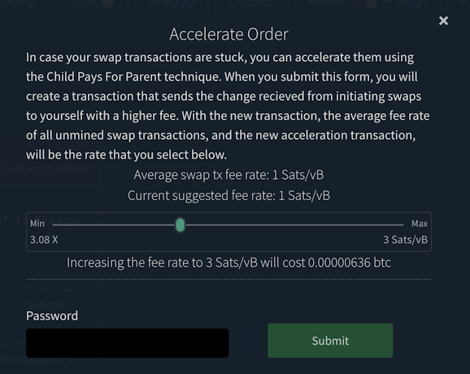
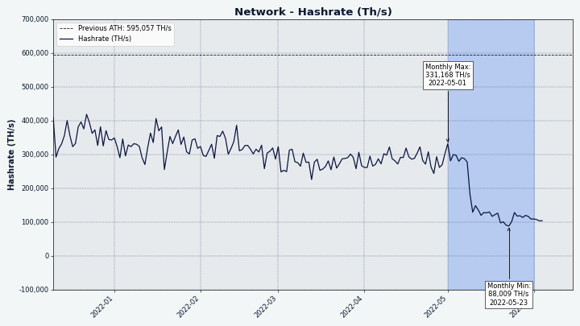
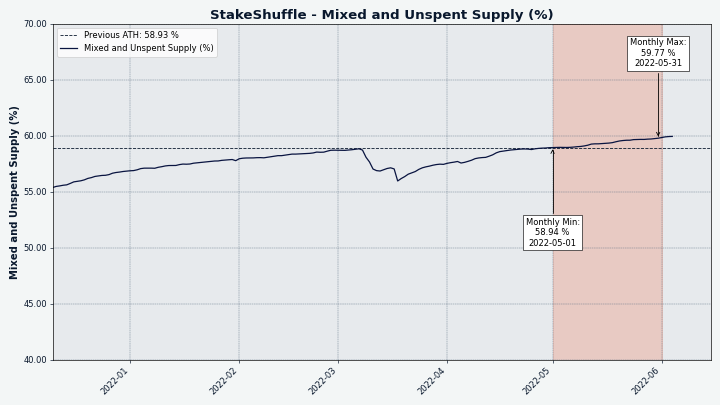

# Decred Journal – Maj 2022

_Obraz: Point Integral, aut. @saender_

Maj był całkiem epickim miesiącem dla projektu Decred:

- Na sieci mainnet życie weszły cztery ostatnio przegłosowane zmiany w zasadach konsensusu (DCP0007-10).
- Pojawiły się dwa przejściowe wydania poprawek błędów w głównym oprogramowaniu, v1.7.2 i v1.7.3.
- Wydania doczekało się GoDCR v1.7.0, jest to pierwsza wersja przeznaczona do użytku na mainnecie. Została też opublikowana nowa propozycja finansowania projektu.
- Wystartował Decred Magazine; jest to nowa platforma do hostowania i dzielenia się wiadomościami o Decred i innymi treściami, której przewodzi @phoenixgreen.
- Wszystkie stare przegapione bilety, które nie zostały wycofane przez ich właścicieli, zostały teraz wycofane dzięki aktywacji DCP-0009.
- Cztery nowe propozycje zostały opublikowane na Politei.

Spis treści:

- [Aktywacja czterech nowych zmian w zasadach konsensusu](#four-consensus-changes-activated)
- [Publikacja wersji v1.7.2 and v1.7.3 głównego oprogramowania](#core-software-v172-and-v173-released)
- [Wydanie GoDCR v1.7.0](#godcr-v170-released)
- [Wydanie portfeli dla systemów Android i iOS v1.7.0](#android-and-ios-wallets-v170-released)
- [Rozwój](#development)
- [Ludzie](#people)
- [Zarządzanie](#governance)
- [Sieć](#network)
- [Ekosystem](#ecosystem)
- [Nawiązywanie kontaktów](#outreach)
- [Eventy](#events)
- [Media](#media)
- [Dyskusje społeczności](#discussions)
- [Rynki](#markets)
- [Ważne kwestie i wiadomości poboczne](#relevant-external)

## Aktywacja czterech nowych zmian w zasadach konsensusu

Wszystkie cztery [aktualizacje zasad konsensusu](https://docs.decred.org/governance/consensus-rule-voting/consensus-vote-archive/) dodane w v1.7 i zatwierdzone przez interesariuszy zostały aktywowane 8. maja w [bloku 657280](https://dcrdata.decred.org/block/657280):

- [DCP-0007](https://github.com/decred/dcps/blob/master/dcp-0007/dcp-0007.mediawiki) - poprawiono algorytm określający maksymalny miesięczny wydatek z nowego Skarbca, który nie powinien już przeszkadzać w dokonywaniu miesięcznych płatności dla kontrahentów.

- [DCP-0008](https://github.com/decred/dcps/blob/master/dcp-0008/dcp-0008.mediawiki) - węzły odrzucają teraz nowsze wersje transakcji, których nie są w stanie obsłużyć, a jawne aktualizacje konsensusu są teraz wymagane do zdefiniowania i dopuszczenia nowszych wersji, dzięki czemu integracja z przyszłymi zmianami w zasadach konsensusu będzie łatwiejsza i mniej podatna na błędy dla wszystkich uczestników w ekosystemie Decred. Niektórzy inżynierowie powiedzieliby nawet, że _pełne węzły_ odrzucające dane, których nie mogą _w pełni walidować_ to jedyny rozsądny sposób działania. Z tą aktualizacją, Decred jeszcze bardziej stawia na hard forki jako najbardziej bezpieczny i niezawodny sposób aktualizacji zasad konsensusu, "ponieważ możemy".

- [DCP-0009](https://github.com/decred/dcps/blob/master/dcp-0009/dcp-0009.mediawiki) - od teraz górnicy automatycznie cofają przegapione i wygasłe bilety, co usuwa konieczność robienia tego ręcznie przez użytkowników i związany z tym wysiłek (zwłaszcza, przy zgubionych skryptach wykupienia). Kod portfela i GUI stają się prostsze, a staking staje się łatwiejszy.

- [DCP-0010](https://github.com/decred/dcps/blob/master/dcp-0010/dcp-0010.mediawiki) - 50% nagrody za wydobycie bloku jest przekierowane od górników PoW do głosujących PoS, zmieniając podział z 60/30/10 na 10/80/10 dla, odpowiednio, PoW/PoS/Skarbca. Mamy nadzieję, że to przywróci równowagę między podażą a popytem DCR i zmniejszy zdolność złośliwych aktorów do manipulowania rynkami. Jako produkt uboczny, wyższe nagrody za PoS uczynią staking DCR bardziej atrakcyjnym. To była [najgoręcej omawiana propozycja](https://proposals.decred.org/record/427e1d4) do tej pory, ale interesariusze powiedzieli "tak" i po około 6 miesiącach weszła ona w życie.

Jest to prawdopodobnie największa aktualizacja konsensusu w historii Decred.

## Publikacja wersji v1.7.2 and v1.7.3 głównego oprogramowania

dcrd i dcrwallet v1.7.2 zostały [wydane](https://twitter.com/decredproject/status/1524430609543831553) 11. maja - jest to najnowsza wersja do momentu pisania tego tekstu. dcrd otrzymał poprawkę rzadkiego i trudnego do trafienia przypadku, gdy włączone jest opcjonalne indeksowanie. dcrwallet otrzymał poprawkę do `verifymessage`, umożliwił zmianę hasła publicznego portfela i kilka wewnętrznych/deweloperskich zmian. [Uwagi do wydania](https://github.com/decred/decred-binaries/releases/tag/v1.7.2).

[Decrediton v1.7.2](https://github.com/decred/decred-binaries/releases/tag/v1.7.2#decrediton-v172) dodał wsparcie dla głosowania na wydatki ze Skarbca, więcej informacji na temat stakingu z wykorzystaniem VSP, zaktualizowany moduł DEX, oraz kilka poprawek błędów. v1.7.3 została [wydana](https://twitter.com/decredproject/status/1528430113355878401) 18 maja z poprawkami dla macOS 10.15 i ustawianiem wyborów w głosowaniu na wydatki ze Skarbca. [Uwagi do wydania](https://github.com/decred/decred-binaries/releases/tag/v1.7.3).

[Zweryfikuj pliki do pobrania](https://docs.decred.org/advanced/verifying-binaries/), aby upewnić się, że nie zostały zmodyfikowane. Pliki są podpisane podkluczem Decred Release kończącym się na `6D897EDF518A031D` (klucz główny ma końcówkę `6DF634AA7608AF04`).

## Wydanie GoDCR v1.7.0

Debiutowe wydanie GoDCR na sieci mainnet [ogłoszono](https://www.reddit.com/r/decred/comments/uwa6w2/godcr_desktop_wallet_for_decred_written_purely_in/) 23. maja po prawie 8 miesiącach rozwoju od wersji v0.9.0 na sieci testnet.

Wspierane są poniższe funkcje:

- Podstawowe funkcje portfela z wysyłaniem i odbieraniem środków
- Staking (z automatycznym zakupem biletów)
- Prywatnosć poprzez StakeShuffle
- Głosowanie nad propozycjami
- Głosowanie nad zmianami w zasadach konsensusu
- Podpisywanie wiadomości
- Odtwarzanie portfeli
- Kompatybilność z systemami Linux, macOS, Windows i FreeBSD

[Pobierz go tutaj](https://github.com/planetdecred/godcr/releases/tag/v1.7.0) i zweryfkuj podpis od `release@planetdecred.org` (klucz o końcówce `A3C9EB3218CCC3E8`).

To dopiero początek dla GoDCR. Następne w kolejce są handel na DEX, wybór monet (coin selection), głosowanie nad wydatkami ze Skarbca oraz ambitny cel zbudowania aplikacji na systemy mobilne, jak i desktopowe z jednej bazy kodowej.  Rzućcie okiem na [propozycję](https://proposals.decred.org/record/0ef42e5) sfinansowania tych wysiłów na okres 2022-2023.

_Obraz: Podgląd GoDCR pokazujący podsumowanie każdego podsystemu._

## Wydanie portfeli dla systemów Android i iOS v1.7.0

Portfele na platformy Android i iOS v1.7.0 zostały [wydane](https://www.reddit.com/r/decred/comments/umye1t/decred_mobile_wallet_v170_has_been_released_for/) 11 maja.

Zmiany od wersji v1.6.1 obejmują:

- Zaktualizowane moduły Decred do v1.7.0
- Zaktualizowany certyfikat serwera mieszającego
- Ulepszenia ręcznej konfiguracji prywatności
- Poprawki błędów i inne drobne usprawnienia

Aplikacja iOS dla sieci mainnet jest dostępna na [App Store](https://apps.apple.com/us/app/decred-wallet/id1462247643), a wersja testowa na [TestFlight](https://testflight.apple.com/join/7KL4VnB2).

Aplikacja na Androida jest dostępna w Google [Play Store](https://play.google.com/store/apps/details?id=com.decred.dcrandroid.mainnet). Dla zaawansowanych użytkowników dostępny jest nowy [APK download](https://github.com/planetdecred/dcrandroid/releases/tag/v1.7.0) podpisany klucz do wydań Planet Decred.

## Rozwój

O ile nie zaznaczono inaczej, prace zgłaszane poniżej mają status „scalonych z repozytorium głównym (master)”. Oznacza to, że prace są ukończone, zrecenzowane i zintegrowane z kodem źródłowym, który zaawansowani użytkownicy mogą [kompilować i uruchamiać](https://medium.com/@artikozel/the-decred-node-back-to-the-source-part-one-27d4576e7e1c), ale ich efekty nie są jeszcze dostępne w wersji plików binarnych dla zwykłych użytkowników.

<a id="dcrd" />

**[dcrd](https://github.com/decred/dcrd)**

_dcrd jest pełną implementacją węzła, który obsługuje sieć peer-to-peer Decred na całym świecie._

Ogólnym kierunkiem w maju było dalsze wykorzystanie zmian konsensusu, które aktywowały się niedawno, poprzez dodanie optymalizacji i usunięcie niepotrzebnego kodu.

- Zoptymalizowano [przycinanie węzłów stake'owych](https://github.com/decred/dcrd/pull/2943) poprzez użycie nagłówków bloków zamiast punktów kontrolnych (zmniejszając zależność od tych ostatnich). Operacje synchronizacji oparte na nagłówkach są bardziej wydajne i torują drogę do możliwości pobierania bloków od wielu użytkowników.
- Retroaktywnie naprawiono błąd [limitu opłat](https://github.com/decred/dcrd/pull/2948) przy odwoływaniu biletów, który pozwalał jednej stronie zwiększyć opłatę płaconą górnikom za inną stronę w dzielonych transakcjach. Nie zostało to nigdy wykorzystane na `mainnet` i już _nie może_ być wykorzystane od czasu aktywowania agendy automatycznych odwołań.
- Przerobiono logikę [odrzucania starych bloków](https://github.com/decred/dcrd/pull/2945), aby zastąpić użycie punktów kontrolnych blokiem `assumevalid` (w każdym wydaniu zakodowany na sztywno). Semantyka została wyjaśniona, aby odzwierciedlić, że "punkty kontrolne" są teraz używane tylko do obsługi starych forków i nie są już używane do optymalizacji (które teraz polegają na innych metodach). Opcja CLI `--nocheckpoints` została zastąpiona przez `--allowoldforks`. Dzięki tej zmianie rola punktów kontrolnych jest zredukowana do minimum, co jest pożądane, ponieważ są one swego rodzaju obejściem.
- Usunięto przestarzały [address index](https://github.com/decred/dcrd/pull/2930) wraz z powiązanymi flagami CLI (`--addrindex` i `--dropaddrindex`) oraz `searchrawtransactions` JSON-RPC. Indeks adresów był bardzo kosztowny z perspektywy rozwoju, a nie był używany przez nic godnego uwagi i nie zapewniał tego, czego większość ludzi chce od adresów, czyli pełnego salda w przeciwieństwie do wszystkich indywidualnych transakcji. Wszystkie informacje, których dostarczał, a nawet więcej, są dostępne poprzez dcrdata.
- Dodano funkcję do sprawdzania [podstawowej poprawności transakcji](https://github.com/decred/dcrd/pull/2949) do modułu `blockchain/standalone`, co jest miłe dla konsumentów (np. DCRDEX), ponieważ moduł ten ma bardzo mało zależności.
- Zaimplementowano [przechowywanie dowodów nagłówkowych](https://github.com/decred/dcrd/pull/2938) wraz z jednokierunkową aktualizacją bazy danych. Pozwoli to uniknąć ponownego obliczania haszy zobowiązań poprzez przechowywanie/ładowanie ich z dysku. Koncepcja "zobowiązań nagłówka bloku" brzmi przerażająco, ale jest to potężny kawałek technologii, o którym warto się dowiedzieć. Zostało to dobrze opisane w [propozycji](https://proposals.decred.org/proposals/0a1ff84), ale w skrócie, te zobowiązania są maleńkimi odciskami palców danych blockchain, które pozwalają budować szybkie _i_ bezpieczne lekkie aplikacje. Obecnie istnieje tylko jeden rodzaj zobowiązań - "kompaktowe filtry bloków", które pozwalają lekkim portfelom szybko i bezpiecznie znaleźć transakcje użytkowników. W przyszłości może zostać dodanych więcej zobowiązań dla innych przypadków użycia.
- Uczyniono [`blockchain`](https://github.com/decred/dcrd/pull/2952) pakietem wewnętrznym i nieeksportowanym. Jest to część ciągłych wysiłków mających na celu zmniejszenie całkowitej liczby eksportowanych pakietów i modułów, aby zredukować obciążenie związane z utrzymaniem, i w końcu dojść do punktu, w którym będzie możliwe podążanie za [semantycznym wersjonowaniem](https://semver.org/) dla modułu głównego.
- Ciągłe [oczyszczanie kodu](https://github.com/decred/dcrd/pull/2922) [czyszczenia](https://github.com/decred/dcrd/pull/2954) umożliwione przez ostatnie zmiany konsensusu.

<a id="dcrwallet" />

**[dcrwallet](https://github.com/decred/dcrwallet)**

Wydano z łatką v1.7.2:

- [Naprawiono](https://github.com/decred/dcrwallet/pull/2150) weryfikację podpisanych wiadomości.
- [Dodano](https://github.com/decred/dcrwallet/pull/2148) `walletpubpassphrasechange` do metod JSON-RPC. Zezwala to na zmianę publicznego hasła do portfela.
- [Dodano](https://github.com/decred/dcrwallet/pull/2146) hosta VSP do danych zwracanych wraz z biletem, co umożliwia aplikacjom portfelowym na identyfikację VSP, z którego korzysta bilet.
- [Usunięto](https://github.com/decred/dcrwallet/pull/2153) całą funkcjonalność związaną z odwoływaniem biletów. Od teraz transakcje odwołania tworzone są [automatycznie](https://proposals.decred.org/record/e2d7b7d) i portfele nie muszą się już tym zajmować.

Scalono z `master`:

- [Aktualizacja kompatybilności](https://github.com/decred/dcrwallet/pull/2158) do najnowszych zmian w dcrd odnośnie przegapionych oraz wygasłych biletów.
- [Naprawiono](https://github.com/decred/dcrwallet/pull/2164) błąd w komendzie `getstakeinfo` (spowodowany przez zmiany dotyczące wygasłych biletów).

<a id="decrediton" />

**[Decrediton](https://github.com/decred/decrediton)**

_Decrediton to w pełni funkcjonalny desktopowy portfel ze zintegrowaną funkcją głosowania, mieszania StakeShuffle, Lightning Network, handlem na DEX i nie tylko. Działa z lub bez dostępu do pełnego łańcucha (tryb SPV)._

Scalono o i wydano z majowymi łatkami v1.7.2 and v1.7.3:

- Użytkownicy mogą teraz pobrać [hasz transakcji opłaty dla VSP oraz jej status](https://github.com/decred/decrediton/pull/3752) w szczegółach transakcji. Jeśli otrzymana transakcja opłaty pokazuje potwierdzony status dla biletu, który nie oddał głosu, ale dcrwallet uważa, że nie jest to jeszcze potwierdzone, aplikacja przetwarza i aktualizuje status w tle.
- Wprowadzono ulepszenia do [widoków Statusu biletu i Historii biletu](https://github.com/decred/decrediton/pull/3751). Teraz zakładki pamiętają swoje pozycje przewijania po powrocie ze strony szczegółów transakcji. Wiersze są ładowane stopniowo przy użyciu funkcji nieskończonego przewijania.
- [Usunięto funkcjonalność odwoływania](https://github.com/decred/decrediton/pull/3754) biletów. Teraz, gdy odwołania są tworzone [automatycznie](https://proposals.decred.org/record/e2d7b7d), nie ma potrzeby, aby portfele je obsługiwały.
- Electron (framework, na którym zbudowany jest Decredtion) został [podniesiony do wersji 17.4.2](https://github.com/decred/decrediton/pull/3765), aby naprawić problem, który uniemożliwiał uruchomienie dcrwallet/dcrd na macOS 10.15 (Catalina).
- ~7 poprawek błędów

_Obraz: Decrediton pokazujący dodatkowe informacje o VSP dla każdego biletu._

<a id="politeia" />

**[Politeia](https://github.com/decred/politeia)**

_Politeia to system składania propozycji w ekosystemie Decred, który służy do wnioskowania o środki ze Skarbca._

Zmiany na backendzie:

- Klient tlog ma teraz [własny pakiet](https://github.com/decred/politeia/pull/1636) w politeiad (wymagany do [importowania](https://github.com/decred/politeia/pull/1632) starszych propozycji).
- Wersja Trilliana została [zaktualizowana](https://github.com/decred/politeia/pull/1642) do 1.4.1.
- Naprawiono błąd związany z [minimalną datą rozpoczęcia propozycji](https://github.com/decred/politeia/pull/1637).
- Poprawiono [sprawdzanie błędów CSRF](https://github.com/decred/politeia/pull/1638).
- Poprawiono [komunikaty o błędach](https://github.com/decred/politeia/pull/1640) związane z datami rozpoczęcia i zakończenia.
- Przepisano na nowo funkcję fsck [z plugina komentarzy](https://github.com/decred/politeia/pull/1641), aby naprawić kilka błędów. "fsck" to skrót od "file system check" i jest odpowiedzialna za sprawdzanie integralności danych i odbudowę pamięci podręcznej.

Zmiany w GUI:

- Naprawiono [komponent formularza komentarza](https://github.com/decred/politeiagui/pull/2760) zastępując `formik` przez ` react-hook-form`.
- Zaimplementowano ponownie modal [paska bocznego](https://github.com/decred/politeiagui/pull/2764), [Link zewnętrzny](https://github.com/decred/politeiagui/pull/2768) strony głównej oraz [Pasek nawigacyjny](https://github.com/decred/politeiagui/pull/2763) w nowej architekturze [GUI pluginów](https://github.com/decred/politeiagui/tree/master/plugins-structure#politeiagui---plugins-structure).
- Usunięto kilka błędów związanych z [datami rozpoczęcia/zakończenia propozycji](https://github.com/decred/politeiagui/pull/2771).

Zmiany w bibliotece pi-ui(wspólne elementy UI dla Politei i Decreditona):

- Wsparcie dla [nawigacji klawiaturą](https://github.com/decred/pi-ui/pull/446) w widżecie `DatePicker`.
- Dodano [ikonkę informacji](https://github.com/decred/pi-ui/pull/447) z tooltipem do pola wprowadzania danych.

<a id="vspd" />

**[vspd](https://github.com/decred/vspd)**

_vspd to oprogramowanie serwera dla pul udziałów (Voting Service Provider). VSP oddaje głos za swoich użytkowników 24/7 oraz nie wchodzi w posiadanie żadnych środków, a tym samym nie może ich ukraść._

- 12 commitów stanowiących różnorakie optymalizacje kodu i jego refaktoryzację.

<a id="dcrlnlpd" />

**[dcrlnlpd](https://github.com/decred/dcrlnlpd)**

_dcrlnlpd oznacza "DCR LN Liquidity Provider Daemon"._

Poznajcie najnowszy element w ekosystemie LN projektu Decred:

> Usługa ta umożliwia uruchomienie dostawcy płynności dla Lightning Network w sieci Decred.
>
> Ten LP pozwala zdalnym klientom prosić, aby węzeł związany z LP, otworzył kanał LN z powrotem do klienta wnioskującego. Pozwala to klientowi wnioskującemu na pewną przychodzącą płynność, która pozwoli mu otrzymać płatności na LN.
>
> Aby utworzyć kanał, LP pobiera pewną kwotę, określoną jako procent pożądanego rozmiaru kanału. \[[plik README](https://github.com/decred/dcrlnlpd/blob/941743f09e2d01d5bae36b492de38e49c9565510/README.md)\]

<a id="dcrdex" />

**[DCRDEX](https://github.com/decred/dcrdex)**

_DCRDEX to niepowiernicza giełda, umożliwiająca handel bez konieczności zaufania, działająca dzięki technologii atomic swaps._

Zmiany skierowane do użytkowników:

- Dodano wsparcie dla [przyspieszania transakcji BTC](https://github.com/decred/dcrdex/pull/1555) przy użyciu techniki zwiększania opłat [child pays for parent](https://bitcoinops.org/en/topics/cpfp/). Strona zamówień będzie pokazywać przycisk, jeśli zamówienie jest w stanie być przyspieszone. Po kliknięciu przycisku pokazuje się okienko, który pozwala użytkownikowi wybrać wyższą opłatę.
- Do strony Portfele dodano przycisk, aby [odtworzyć portfel BTC SPV](https://github.com/decred/dcrdex/pull/1507), ponieważ nadal istnieje wiele sposobów, w których może zostać [uszkodzony](https://github.com/decred/dcrdex/issues/1438).
- Obsługa aktualizacji [certyfikatu TLS](https://github.com/decred/dcrdex/pull/1602) serwera za pomocą certyfikatu dostarczonego przez użytkownika.

Zmiany wewnętrzne i deweloperskie:

- [Opcja testowania za pomocą uprzęży](https://github.com/decred/dcrdex/pull/1550) na testnecie dla klienta ETH.
- Uogólniono [testy uprzęży na simnecie](https://github.com/decred/dcrdex/pull/1603) do pracy z wszystkimi obecnie obsługiwanymi aktywami.
- Zaimplementowano [etap 3](https://github.com/decred/dcrdex/pull/1530) poprawki dotyczącej obcinania wiadomości w podpisie. Trudno jest naprawić błąd, gdy jest on "wdrażany" na wielu współzależnych serwerach i klientach, ale deweloperzy mają na to sprytny [4-stopniowy plan](https://github.com/decred/dcrdex/pull/1526).
- Przełączono się na [testnet4 dla Bitcoin Cash](https://github.com/decred/dcrdex/pull/1606) teraz, gdy jest to pierwsza klasa w bchd. Dodano również niestandardowy koder dla adresów [CashAddr](https://www.reference.cash/protocol/blockchain/encoding/cashaddr/) BCH.
- Dodano metody [obliczania mediany opłat](https://github.com/decred/dcrdex/pull/1597) z ostatniego bloku(ów) w BTC/DOGE/LTC/BCH. Zaimplementowano cache, aby zapobiec wielokrotnemu skanowaniu pomiędzy blokami, a także fallback, jeśli nie ma wystarczającej ilości danych do oszacowania opłaty.
- Aktualizacje do nowszych modułów z [btcsuite i go-ethereum](https://github.com/decred/dcrdex/pull/1542).
- Aktualizacje zależności, aby budować na [Node.js 18](https://github.com/decred/dcrdex/pull/1617).
- Kodowanie pozwala teraz, aby dane transakcyjne [były dłuższe](https://github.com/decred/dcrdex/pull/1620), niż 65535 bajtów.
- Generyczna funkcja [wait and retry](https://github.com/decred/dcrdex/pull/1623) przerobiona tak, by stopniowo "zwężała się" (zwalniała) po kilku początkowych częstych próbach.
- Różne poprawki błędów, aktualizacje zależności i optymalizacje.

W trakcie prac nad DCRDEX deweloperzy wnieśli [różne zmiany](https://twitter.com/blockchainbuck/status/1532146821300101120) do projektów upstreamowych: [btcd](https://github.com/btcsuite/btcd/commits?author=chappjc), [btcwallet](https://github.com/btcsuite/btcwallet/commits?author=chappjc), [go-ethereum](https://github.com/ethereum/go-ethereum/pull/24533), [neutrino](https://github.com/lightninglabs/neutrino/commits?author=chappjc), [zcash](https://github.com/zcash/zcash/commits?author=buck54321) i innych.

Zespół deweloperów rozpoczął dyskusję na temat [zmiany nazwy DCRDEX](https://www.reddit.com/r/decred/comments/v3gxa8/should_we_rebrand_decred_dex/) i akceptuje pomysły dotyczące nazwy i logo.

> Prawdopodobnie znaleźliśmy firmę, która przeprowadzi audyt naszych kontraktów atomic swaps w Solidity. Co ważne, nasze kontrakty są tak proste, że jesteśmy poniżej ich minimalnej wielkości zamówienia. Tak się dzieje, gdy nie próbujesz wydobyć opłat handlowych i nie ma funkcjonalności administratora. \[[@blockchainbuck](https://twitter.com/blockchainbuck/status/1527105721724190722)\]

_Obraz: DCRDEX pozwala na przyspieszenie wymiany, gdy sieć jest zajęta, ale Wy chcecie handlować tak szybko, jak to możliwe._

<a id="dcrios" />

**[Decred Wallet (iOS)](https://github.com/planetdecred/dcrios)**

- Dodano [workflow do buildów GitHub](https://github.com/planetdecred/dcrios/pull/907), aby upewnić się, że dcrios kompiluje się bez błędów.
- [Zaktualizowano](https://github.com/planetdecred/dcrios/pull/899) automatyczne testy UI.

<a id="godcr" />

**[GoDCR](https://github.com/planetdecred/godcr)**

_GoDCR to lekka aplikacja portfela na systemy desktopowe ze zintegrowanym stakingiem, prywatnością i przeglądaniem platformy Politeia._

- [Konto domyślne](https://github.com/planetdecred/godcr/pull/910) jest teraz odfiltrowane, gdy włączona jest prywatność.
- Wszystkie [podpisane wiadomości](https://github.com/planetdecred/godcr/pull/918) mogą być zweryfikowane, ograniczenie do tylko osobistych adresów portfeli zostało usunięte.
- [Dodano modale przekierowania](https://github.com/planetdecred/godcr/pull/923) do strony debugowania (przekierowuje do docs.decred.org) i strony szczegółów transakcji (odsyła do eksploratora bloków).
- Przerobiono obsługę [kluczowych wydarzeń](https://github.com/planetdecred/godcr/pull/907), aby była mniej podatna na błędy i bardziej wydajna.
- Opcja [importu portfela tylko do obserwacji](https://github.com/planetdecred/godcr/pull/943) została dodana do ekranu startowego.
- Prywatność jest teraz [domyślnie włączona](https://github.com/planetdecred/godcr/pull/936), gdy tworzony jest nowy portfel.
- [Aktualizacja Gio](https://github.com/planetdecred/godcr/pull/934) do najnowszej stabilnej wersji.
- Dolny [pasek nawigacyjny](https://github.com/planetdecred/godcr/pull/948) zastąpił pasek boczny na ekranach o rozmiarach poniżej 479px (urządzenia mobilne).
- [Poprawki](https://github.com/planetdecred/godcr/pull/957) do awarii portfela i tytułów propozycji.
- Naprawiono błąd, w którym [nieprawidłowe zablokowane saldo](https://github.com/planetdecred/godcr/pull/956) było wyświetlane w zakładce Staking.
- Poprawione kompilacje na [Android](https://github.com/planetdecred/godcr/pull/924) i [FreeBSD](https://github.com/planetdecred/godcr/pull/914).
- ~6 innych poprawek błędów i kilka optymalizacji.

Kompilacje GoDCR na Androida i iOS [już działają](https://proposals.decred.org/record/0ef42e5/comments/31) w pewnym zakresie, choć pozostaje jeszcze wiele pracy nad dopracowaniem mobilnego/dotykowego UX.

_Obraz: Pierwsze spojrzenie na GoDCR działające na emulowanym OS urządzenia mobilnego._

<a id="dcrdata" />

**[dcrdata](https://github.com/decred/dcrdata)**

_dcrdata to eksplorator blockchaina Decred oraz danych off-chain, takich jak propozycje na platformie Politeia, rynków i ponadto._

- Zaktualizowano [zależności](https://github.com/decred/dcrdata/pull/1913), aby budowały z wykorzystaniem Node.js 16 oraz 18.

<a id="dcrweb" />

**[decred.org](https://github.com/decred/dcrweb)**

_dcrweb to źródło kodu dla strony decred.org._

- [Zaktualizowano linki](https://github.com/decred/dcrweb/pull/1033) do czatów.
- [Dodano](https://github.com/decred/dcrweb/pull/1035) związane ze zmianą podziału nagrody blokowej PoW/PoS [ogłoszenia prasowe](https://decred.org/press/2022-05-09-decred_shifts_to_majority_pos/).
- [Usunięto przestarzałe informacje](https://github.com/decred/dcrweb/pull/1037) o giełdach wymian.

**Pozostałe**

- dcrseeder: seedowanie na podstawie DNS w końcu zostało [usunięte](https://github.com/decred/dcrseeder/pull/50) oraz wprowadzono małą poprawkę, aby jeszcze agresywniej [usuwała martwe połączenia](https://github.com/decred/dcrseeder/pull/47).

## Ludzie

Witamy nowych, początkujących współpracowników, których kod scalono z głównymi gałęziami repozytoriów Decred na GitHubie na przestrzeni styczeń-marzec:

- arjundashrath ([dcrd](https://github.com/decred/dcrd/commits?author=arjundashrath))
- liukun ([dcrd](https://github.com/decred/dcrd/commits?author=liukun))
- monsa00 ([godcr](https://github.com/planetdecred/godcr/commits?author=monsa00))
- ukane-philemon ([dcrdata](https://github.com/decred/dcrdata/commits?author=ukane-philemon), [dcrdex](https://github.com/decred/dcrdex/commits?author=ukane-philemon), [vspd](https://github.com/decred/vspd/commits?author=ukane-philemon))

W tych miesiącach nie wydawaliśmy Decred Journal, jednak nigdy nie jest za późno, by powitać nowe osoby na pokładzie!

Statystyki społeczności na dzień 1. czerwca (w porównaniu z 2. maja):

- Obserwujący na [Twitterze](https://twitter.com/decredproject): 54474 (-388)
- Subskrybenci na [Reddit](https://www.reddit.com/r/decred/): 12631 (+10)
- Użytkownicy na [Matrix](https://chat.decred.org/) w pokoju #general: 677 (+15)
- Użytkownicy na [Discordzie](https://discord.gg/GJ2GXfz): 2305 (+12)
- Użytkownicy na [Telegramie](https://t.me/Decred): 2858 (+30)
- Subskrybenci na [YouTube](https://www.youtube.com/decredchannel): 4630 (-9), wyświetleń: 209K (+2K)

Rzućcie okiem na [raport z czerwca 2022](https://decredcommunity.github.io/social-media-stats/posts/20220604.1) odnośnie kanałów SM Decred po bardziej dogłębną analizę wyników między lutym a czerwcem.

## Zarządzanie

W maju nowy [Skarbiec](https://dcrdata.decred.org/treasury) otrzymał 9407 DCR o wartości 390 tys. USD po kursie wymiany 41,46 USD z tego miesiąca. 2950 DCR zostało wydane z dotychczasowego adresu Skarbca, aby zapłacić kontrahentom, co stanowiło wartość $122K po majowym kursie, lub $179K po kwietniowym kursie rozliczeniowym $60,62. Wypłaty te poszły na pokrycie kosztów za marzec i kwiecień.

Na dzień 12 czerwca, łączne saldo [starego](https://dcrdata.decred.org/address/Dcur2mcGjmENx4DhNqDctW5wJCVyT3Qeqkx) i [nowego Skarbca](https://dcrdata.decred.org/treasury) wynosi 795673 DCR (23,9 mln USD po kursie 30,09 USD).

Pojawiła się nowa [propozycja](https://proposals.decred.org/record/0ef42e5) złożona przez Raedah Group w celu sfinansowania GoDCR, portfela graficznego zbudowanego w czystym Go, który w miarę rozwoju zastąpi również istniejące portfele mobilne. Ta propozycja wymaga $250K na okres 12 miesięcy finansowania, co jest większą kwotą niż [poprzednia propozycja](https://proposals.decred.org/record/f7d9fc8), która została odrzucona małym stosunkiem głosów w październiku 2021 roku. Dodatkowy budżet wynika z większej liczby pracowników, dłuższego czasu trwania i pokrycia utrzymania istniejących portfeli Android/iOS. Budżet został zmniejszony z początkowych 300K$ w odpowiedzi na niektóre komentarze.

W maju na Politei zostały opublikowane cztery propozycje:

- [Propozycja](https://proposals.decred.org/record/4fdef29) od @Exitus, aby sfinansować produkcję Decred Journal i Politeia Digest do grudnia 2022. DJ był nieaktywny przez 3 miesiące od czasu, gdy [@bee ogłosił jego wstrzymanie](202112.md#the-future-of-decred-journal), aż @Exitus przejął prowadzenie od kwietniowego numeru i ostatecznie pełną nową propozycję. Szczegółowy raport dotyczący wyników i finansów propozycji z 2021 roku został opublikowany [tutaj](https://github.com/decredcommunity/proposals/blob/master/proposals/1d74b88/updates/20220521.md), z kluczowymi statystykami: $24800 wydane z $39000 na wydanie 12 numerów DJ i 10 numerów PD. Nowy budżet jest ograniczony do 33 tys. USD.

- [Propozycja](https://proposals.decred.org/record/7057e0b) od @kozel, aby sfinansować tłumaczenia treści i zasobów Decred przez cały 2022 rok. Raport z fazy 2 poinformował, że wydano tylko 8180$ z 33000$, dlatego faza 3 będzie miała niższy limit budżetu wynoszący 20000$.

- [Propozycja](https://proposals.decred.org/record/da2f32d) sfinansowanie kontynuacji programu Bug Bounty do grudnia 2023 roku. Przez ostatnie 12 miesięcy koszty operacyjne wynosiły ~2100$, a ~1000$ zostało wypłacone jako nagrody. W nowym wniosku czas trwania został wydłużony z 12 do 18 miesięcy, budżet jest podzielony pomiędzy $5000 na koszty operacyjne i do $100000 na wypłaty nagród. Przywództwo zostało przeniesione z @degeri na @jholdstock.

- [Propozycja](https://proposals.decred.org/record/6bdffcb) od @juliana wnioskowała o 3575 dolarów na przeprowadzenie 3 wydarzeń na uniwersytetach w Ugandzie w 2022 roku, przy czym na każdym wydarzeniu spodziewanych jest 30 osób.

Zapraszamy do lektury [wydania 51](https://blockcommons.red/politeia-digest/issue051/) Politeia Digest, aby nadrobić zaległości w aktywności związanej z propozycjami między styczniem a majem.

## Sieć

**Hashrate**: majowy [hashrate](https://dcrdata.decred.org/charts?chart=hashrate&zoom=l2im68kw-l3x1522f&bin=block&axis=time) na początku miesiąca wyniósł ~345 Ph/s a zamknął go na poziomie ~115 Ph/s, zaliczając niż w ok. 74 Ph/s oraz szczyt w wys. 381 Ph/s w ciągu miesiąca.

_Obraz: Spodziewany spadek mocy obliczeniowej po zmniejszeniu nagrody blokowej dla wydobycia PoW._

Dystrybucja mocy obliczeniowej [zadeklarowana](https://miningpoolstats.stream/decred) przez pule wydobywcze na dzień 1. czerwca: Poolin 55%, ViaBTC 21%, F2Pool 7%, AntPool 7%, Luxor 5%, BTC.com 4%, CoinMine 0.3%.

Podział 1000 bloków [wydobytych](https://miningpoolstats.stream/decred) przed 1. czerwca: Poolin 55%, ViaBTC 20%, F2Pool 8%, DsV1GF7 6.5%, BTC.com 6%, Luxor 4%, CoinMin2 0.2%, DsmLNFC 0.1%.

**Staking**: [Cena biletów](https://dcrdata.decred.org/charts?chart=ticket-price&zoom=l2im68kw-l3x1522f&axis=time&visibility=true-true&mode=stepped) wahała się między 217 a 231 DCR, a jej 30-dniowa [średnia](https://dcrstats.com/) wyniosła 223,6 DCR (+9,4).

[Zablokowana suma](https://dcrdata.decred.org/charts?chart=ticket-pool-value&zoom=l2im68kw-l3x1522f&scale=linear&bin=block&axis=time) to pomiędzy 8,78-9,07 miliona DCR, co oznacza, że 62,6-63,9% podaży dostępnej w obiegu [wzięło udział](https://dcrdata.decred.org/charts?chart=stake-participation&zoom=l2im68kw-l3x1522f&scale=linear&bin=block&axis=time) w elemencie Proof of Stake. Zarówno wartość nominalna w DCR, jak i procentowa stanowią dla DCR nowy szczyt.
Wszystkie przegapione, jak i wygasłe bilety [zostały odwołane](https://github.com/decred/dcrd/pull/2861#issuecomment-1144049589), odblokowując tym samym 175957 DCR z 1719 biletów (o średniej cenie 103 DCR za bilet). ~45K DCR z tej sumy już zostało przeniesione, podczas gdy pozostałe ~131K DCR uważa się za utracone ze względu na utracone ziarna i inne powody. Jeden z odwołanych biletów pochodził ze starego bloku o numerze 767, około czasu, gdy pojawiły się pierwsze narzekania [na wysoką cenę biletów](https://forum.decred.org/threads/are-you-still-purchasing-at-current-price-4-55-dcr.840/).

Wszystkie nowe przegapione bilety są odwoływane automatycznie, z czego pierwszy odwołano w bloku [657295](https://dcrdata.decred.org/block/657295).

**VSP**: 1 czerwca, ~6900 (+120) biletów w puli zarządzanych było przez 16 [oficjalnych](https://decred.org/vsp/) serwerów vspd, co stanowiło ok. 16,8% z całej puli biletów (+0,2%).

Stare bilety (bilety *legacy* z dcrstakepool) nie mogą już brać udziału w głosowaniach od 8 maja, kiedy to łańcuch przeszedł na nowe zasady konsensusu. W odróżnieniu od innych zamkniętych lub porzuconych starych VSP, na 1. czerwca coinmine.pl oraz decredbrasil.com raportowały, że wciąż śledzą wysokość bloku i wspólnie mają pod kontrolą 19 biletów. Nie wiemy, w jaki sposób to możliwe, zatem nie bierzemy tych biletów pod uwagę w powyższych wyliczeniach.

**Węzły**: Przez cały maj w sieci było około ~185 dostępnych węzłów według [PD Analytics](https://analytics.planetdecred.org/nodes).

[Migawka](https://nodes.jholdstock.uk/user_agents) wersji węzłów na dzień 1. czerwca (160 ogółem, tylko dcrd): v1.7.1 - 41%, v1.7.2 - 20%, v1.7.0 - 12%, v1.7.0 dev buildy - 9%, v1.8.0 dev buildy - 4%, v1.6.x - 6%, v1.5.x - 4%.

_Obraz: % transakcji mieszanych oraz niewydanych stopniowo rośnie._

## Ekosystem

- VSP [big.decred.energy](https://github.com/decred/dcrwebapi/pull/161) zarządzany przez [@DCR_Uncle](https://twitter.com/DCR_Uncle) jest teraz [dostępny](https://twitter.com/DCR_Uncle/status/1527138204175847424) na oficjalnej liście VSP i pobiera 1% opłaty.

- Odkryto drugą instancję wizualizatora sieci Lightning Network dla Decred pod adresem [decred.lighting](https://decred.lighting/); korzysta ona z tego samego kodu, co [ln-map.jholdstock.uk](https://ln-map.jholdstock.uk/).

Uwaga: autorzy Decred Journal nie są w stanie ocenić wiarygodności żadnego z powyższych podmiotów czy ich usług. Uprasza się o dołożenie należnych starań i własnoręczną weryfikację informacji przed powierzeniem jakichkolwiek środków innym stronom.

## Nawiązywanie kontaktów

Osiągnięcia Monde PR:

- Podrzucono 2 aktualizacje o nowościach do mediów związanych z finansami i krypto.
- Wykorzystano wiadomości ze świata do promocji Decred.
- Odpowiedziano na 3 prośby o komentarz.
- Zdobyto 2 wywiady w mediach.

Umieszczono w mediach poniższe artykuły:

- Przejście na nowy model konsensusu z naciskiem na PoS został opisany przez [Invezz](https://invezz.com/news/2022/05/09/decred-shifts-to-majority-proof-of-stake-consensus-model/), z komentarzem @jy-p. Invezz opublikował tę historię w 9 innych językach, w tym [francuskim](https://invezz.com/fr/actualites/2022/05/09/decred-passe-au-modele-de-consensus-majoritaire-proof-of-stake/) i [włoskim](https://invezz.com/it/notizie/2022/05/10/decred-passa-al-modello-proof-of-stake/). Artykuł został przekazany do 4 publikacji, w tym [Bitcoin Insider](https://www.bitcoininsider.org/article/164786/decred-shifts-majority-proof-stake-consensus-model) i [Crypto News](https://cryptonews.net/news/altcoins/6288659/).
- Wydanie GoDCR zostało opisane przez [CryptoNinjas](https://www.cryptoninjas.net/2022/05/23/decred-blockchain-introduces-new-cross-chain-spv-based-wallet-godcr/) i [E-Crypto News](https://e-cryptonews.com/decred-launches-godcr-wallet-with-enhanced-privacy-features/). Artykuł CryptoNinjas został przekazany do 3 publikacji, w tym [BitcoinEthereumNews](https://bitcoinethereumnews.com/blockchain/decred-blockchain-introduces-new-cross-chain-spv-based-wallet-godcr-cryptoninjas/) i [Global Online Money](https://globalonlinemony.com/decred-blockchain-introduces-new-cross-chain-spv-based-wallet-godcr-cryptoninjas/).

## Eventy

**Na których byliśmy:**

- @arij i @khalidesi byli gospodarzami stoiska Decred podczas dwudniowych [EMEC EXPO](https://twitter.com/in_insaf/status/1526979202951655425) (Międzynarodowych Targów Przemiany Cyfrowej) w Casablance w Maroku, gdzie odpowiedzieli na wiele pytań o Decred i to, jakie problemy Decred rozwiązuje.

- Edson Neto [opowiedział o Decred](https://twitter.com/Decred_BR/status/1529089788199976960) podczas [Bitconf](https://www.instagram.com/p/Cd6sL2wLHU7/) w Sao Paulo w Brazylii.

**Na których będziemy:**

- 30 czerwca - [Społeczny meetup Decred](https://www.meetup.com/chicago-decred-meetup/events/286491971/) w Chicago, USA. Źródła podają, że obecna będzie przynajmniej jedna kurtka Decred.

_Obraz: Edson Neto w roli prelegenta na Bitconf._

## Media

[Uruchomiono](https://twitter.com/DecredSociety/status/1530562659006939136) stronę [Decred Magazine](https://www.decredmagazine.com/) pod redakcją @phoenixgreen, która zajmie się zbieraniem treści nt. Decred pod jednym dachem, da dom twórcom treści o tematyce Decred oraz archiwizować będzie istniejące już treści (w tym [Decred Journal](https://www.decredmagazine.com/tag/decred-journal/)). Jest to szczególnie ważne, ponieważ strony internetowe, jak i blogi często "gubią" gdzieś po drodze swoje treści, przez co stają się one po jakimś czasie zupełnie niedostępne i niemożliwe do odnalezienia. Na chwilę obecną do serwisu zaimportowano około 300 postów i 8 autorów wyraziło chęć dodawania do niego produkowanych przez siebie treści. Decred Magazine ma zastąpić portal [decredsociety.com](https://www.decredsociety.com/) uruchomiony wcześniej jako projekt pilotażowy.

**Wybrane artykuły:**

- [Przewodnik konfiguracji węzła Lightning Node dla Decred](https://gist.github.com/dcr-uncle/11b30f44e73b55cc31fb75881f9b4643), aut. @DCR\_Uncle
- [Rozpoczyna się głosowanie w sprawie największej zmiany w zasadach konsensusu!](https://www.decredmagazine.com/the-bigest-blockchain-consensus-vote-in-history-goes-live/), aut. @phoenixgreen
- [Bunt PoW](https://www.decredmagazine.com/the-pow-rebellion/), aut. @phoenixgreen

**Wideo:**

- [Giełda wymian peer-to-peer - Decred i stan rynków](https://www.youtube.com/watch?v=vqzaEdtmCsI), aut. @phoenixgreen i @Exitus
- [Miesięczne podsumowanie Decred - 2.66x wzrost w nagrodach za staking, wiadomości nt. rozwoju, nadchodzący wielki hard fork!](https://www.youtube.com/watch?v=uOHiDTj9Prs), aut. @Exitus i @DajanaDcr
- [DCRDATA - przyglądając się blokowi - fundamenty Decred](https://www.youtube.com/watch?v=nsMrdK45cK8), aut. @phoenixgreen - również jako [post na blogu](https://www.decredmagazine.com/dcrdata-looking-into-a-block/)
- [DCRDATA wykresy Proof of Work - fundamenty Decred](https://www.youtube.com/watch?v=t_pcHfJS0uw), aut. @phoenixgreen - również jako [post na blogu](https://www.decredmagazine.com/dcrdata-proof-of-work-charts/)
- [DCRDATA wykresy Proof of Stake - fundamenty Decred](https://www.youtube.com/watch?v=eRtogHA_2_w), aut. @phoenixgreen - również jako [post na blogu](https://www.decredmagazine.com/dcrdata-proof-of-stake-charts/)
- [Ta maszyna jest CICHA, DOCHODOWA i ZEPSUTA? WTF?!](https://www.youtube.com/watch?v=skv8RehpaaU) (DR5 i zmiana nagrody blokowej), aut. @VoskCoin
- [Nagrody za staking Decred właśnie wzrosły 2.6x! Podajcie dalej!](https://twitter.com/DajanaDcr/status/1526306473051045892) (TikTok), aut. @DajanaDcr i @Exitus
- [Zwizualizowana historia kodu Decred](https://twitter.com/karamblez/status/1528173850642505728), aut. @karamble

**Audio**:

- Wideo autorstwa @phoenixgreen (aka Decred Society) są również dostępne w [formacie podcastu](https://anchor.fm/decred-society/) na anchor.fm.

## Dyskusje społeczności

Wybrane posty z Reddita:

- [Tygodniowe pasmo wkładu](https://www.reddit.com/r/decred/comments/v0eus3/weekly_contribution_streaks_tards_unite/) jest nową cotygodniową aktywnością od u/ersfbddfgwe, która ma na celu przełamanie powszechnej bariery mentalnej "Nie mogę nic wnieść, bo nie jestem deweloperem :(". Zasady są proste: po prostu pokaż się i napisz o _czymkolwiek_ co zrobiłeś, dużym lub małym, z opcjonalnym adresem DCR na napiwki. Trwa dyskusja o tym, jak lepiej uszeregować i nagrodzić wkłady.

- W [wątku o kopaniu Decred](https://www.reddit.com/r/decred/comments/unh7nn/decred_mining/) górnicy dzielą się wyzwaniami związanymi z wydobyciem DCR po tym, jak ich udział w nagrodzie blokowej został zmniejszony z 60% do 10%.

Wybrane dyskusje z Twittera:

- Wdrożenie [portfeli SPV do handlu](https://twitter.com/blockchainbuck/status/1531156971759575040) dla DCRDEX. Co to oznacza i dlaczego deweloperzy skupiają się na SPV - aut. @buck54321
- Wdrożenie customowego przepływu pracy dla portfeli [ERC-20 na Ethereum](https://twitter.com/blockchainbuck/status/1527105720285552641). Na jakich tokenach powinniśmy się skupić i dlaczego? - aut. @buck54321

## Rynki

W maju kurs wymiany DCR mieścił się w przedziale USD 30,00-58,68 / BTC 0,00103-0,00190. Średni dzienny kurs wynosił $41,46.

W [Decred Magazine](https://www.decredmagazine.com/author/applesaucesome/) znajdziecie (średnio) cotygodniową dawkę analizy technicznej DCR, innych krypto oraz szerszego rynku autorstwa @Applesaucesome.

W maju, dzięki DCRDEX z rąk do rąk przeszło około [74K DCR](https://github.com/bochinchero/dcrsnapshots/tree/main/2022-05/700), o wartości około 3 milionów USD.

## Ważne kwestie i wiadomości poboczne

Insider trading w przestrzeni kryptowalutowej jest coraz częściej w centrum uwagi. The Wall Street Journal zamieścił [artykuł](https://www.wsj.com/articles/crypto-might-have-an-insider-trading-problem-11653084398) o podejrzeniu insider tradingu wokół notowań giełdowych na Binance, Coinbase i FTX. Analiza została przeprowadzona przez Argus Inc w oparciu o publiczne zapisy na blockchainie.

Były kierownik produktu OpenSea, Nathaniel Chastain, który stracił pracę w związku z czerpaniem zysków z notowań NFT na pierwszej stronie OpenSea we wrześniu, został teraz [aresztowany](https://www.cnbc.com/2022/06/01/former-opensea-employee-charged-in-first-ever-nft-insider-trading-case.html) i oskarżony o insider trading przez prokuratorów w nowojorskim okręgu południowym. Chociaż NFT, o których mowa, nie są zwykłymi papierami wartościowymi, do których stosuje się prawo o insider tradingu, prokuratura twierdzi, że Chastain zaszkodził swojemu pracodawcy (OpenSea) poprzez sprzeniewierzenie informacji.

Aktor Seth Green [stracił](https://www.buzzfeednews.com/article/sarahemerson/seth-green-bored-ape-stolen-tv-show) swoje NFT Bored Ape w wyniku incydentu z phishingiem, co było jeszcze bardziej istotne ze względu na fakt, że małpa miała wystąpić w nowym serialu, nad którym pracował, *White Horse Tavern*. W czerwcu Green zapłacił $260000 [okupu](https://www.businessinsider.com/seth-green-pays-260000-return-stolen-bored-ape-ethereum-nft-2022-6), aby zabezpieczyć zwrot małpy, dzięki czemu program mógł być kontynuowany (bez podnoszenia wielu kwestii związanych z prawami autorskimi, czy skradziony wizerunek małpy może być wykorzystany).

To wszystko na maj. Podzielcie się swoimi aktualizacjami do następnego numeru na naszym kanale [#journal](https://chat.decred.org/#/room/#journal:decred.org).

## O tym wydaniu

To 47. wydanie Decred Journal. Spis wszystkich wydań, mirrorów i tłumaczeń dostępny jest [tutaj](https://xaur.github.io/decred-news/).

Większość informacji od stron trzecich jest przekazywana bezpośrednio ze źródła po minimalnym sprawdzeniu poprawności. Autorzy Decred Journal nie mają możliwości zweryfikowania wszystkich publikowanych stwierdzeń. Proszę uważać na oszustwa i przeprowadzać własny research.

Zasługi (kolejność alfabetyczna):

- redakcja treści: bee, bochinchero, Exitus, l1ndseymm, richardred
- recenzje i komentarze: davecgh, matheusd, phoenixgreen
- ilustracja tytułowa: saender
- finansowanie: interesariusze Decred
