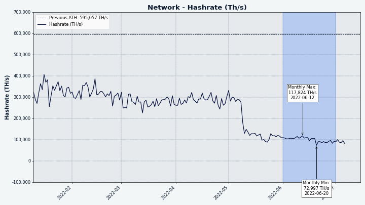
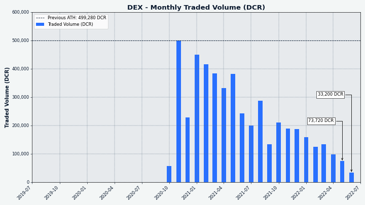

# Decred Journal – Czerwiec 2022

Najważniejsze wydarzenia z czerwca:

- Smart kontrakt Ethereum używany w DCRDEX śpiewająco przeszedł swój pierwszy audyt.
- Dużo się działo na Politei: zatwierdzono 3 propozycje, 1 odrzucono, oraz pod dyskusję weszły 3 kolejne.
- Zatwierdzono pierwszy wydatek ze Skarbca pod nowymi (poprawionymi) już zasadami korzystania z niego (DCP-7).
- DCR pojawiło się na 2 giełdach, Guardarian oraz BitPanda.

Spis treści:

- [Rozwój](#development)
- [Ludzie](#people)
- [Zarządzanie](#governance)
- [Sieć](#network)
- [Ekosystem](#ecosystem)
- [Nawiązywanie kontaktów](#outreach)
- [Eventy](#events)
- [Media](#media)
- [Dyskusje społeczności](#discussions)
- [Rynki](#markets)
- [Ważne kwestie i wiadomości poboczne](#relevant-external)

## Rozwój

O ile nie zaznaczono inaczej, prace zgłaszane poniżej mają status „scalonych z repozytorium głównym (master)”. Oznacza to, że prace są ukończone, zrecenzowane i zintegrowane z kodem źródłowym, który zaawansowani użytkownicy mogą [kompilować i uruchamiać](https://medium.com/@artikozel/the-decred-node-back-to-the-source-part-one-27d4576e7e1c), ale ich efekty nie są jeszcze dostępne w wersji plików binarnych dla zwykłych użytkowników.

### dcrd

_[dcrd](https://github.com/decred/dcrd) jest pełną implementacją węzła, który obsługuje sieć peer-to-peer Decred na całym świecie._

- [Zoptymalizowano](https://github.com/decred/dcrd/pull/2957) obliczanie łącznej ilości pracy przy użyciu nowego bezalokacyjnego pakietu [256-bitowych liczb całkowitych](https://github.com/decred/dcrd/pull/2787). Rezultatem jest średnio o ~100 MiB mniejsze zużycie sterty i o ~5% szybszy czas początkowej synchronizacji blockchaina.
- Wsparcie dla [czystego zamykania](https://github.com/decred/dcrd/pull/2958) w większej ilości wariantów Unixa i w Windows (wyzwalane przez zdarzenia takie jak wylogowanie użytkownika, zamknięcie okna terminala lub zamknięcie systemu).
- [Odwrócono kolejność](https://github.com/decred/dcrd/pull/2956), w której transakcje są dodawane do mempoola podczas reorganizacji, aby poprawić obliczanie statystyk łańcucha transakcji w szczególnych okolicznościach. Zmiana ta pomaga zapewnić górnikom maksymalizację opłat za duże łańcuchy transakcji podczas reorgów. Do tej pory nie było problemów ze starym kodem, ponieważ bloki nie są pełne, a reorgi zdarzają się rzadko.
- [Usunięto](https://github.com/decred/dcrd/pull/2961) kod przycinający dziennik wydatków, który stał się niepotrzebny wraz z usunięciem indeksu adresowego.
- Wyraźne [odrzucenie](https://github.com/decred/dcrd/pull/2963) samodzielnych transakcje `treasurybase`. Od momentu aktywacji [DCP-6](https://github.com/decred/dcps/blob/master/dcp-0006/dcp-0006.mediawiki) każdy blok musi posiadać transakcję `treasurybase`, która płaci wymaganą dotację do Skarbca. "Samodzielne" to niepotwierdzone transakcje, które nie są częścią bloku. Transakcje `treasurybase` nie mają sensu jako samodzielne transakcje, ponieważ są ważne tylko wtedy, gdy są częścią procesu generowania bloku. Były one już odrzucone domyślnie, a ta zmiana jedynie czyni je bardziej wyraźnymi jako forma kodowania obronnego na wypadek, gdyby przyszłe zmiany naruszały te domniemane założenia.
- [Usunięto](https://github.com/decred/dcrd/pull/2964) zasadę, która pozwalała na przekazywanie i wydobywanie tanich/bezpłatnych transakcji. Spełniała ona swój cel w przeszłości kosztem pewnych minusów. Teraz jest niepotrzebna i użytkownicy mogą podnieść priorytet "zatrzymanych" transakcji używając dodatkowych transakcji (znanych też jako Child Pays For Parent - CPFP). Powiązane flagi CLI `--norelaypriority` i `--limitfreerelay` zostały usunięte.
- ~5 mniejszych PR-ów z generalnymi usprawnieniami.

### dcrwallet

_[dcrwallet](https://github.com/decred/dcrwallet) to serwer portfela używany przez wiersz polecenia oraz aplikacje graficzne._

- [Brak wymagania](https://github.com/decred/dcrwallet/pull/2168) wsparcia dla usuniętych kompaktowych filtrów V1 przy wysyłaniu zapytań HTTPS do seedera o węzły.

### Decrediton

_[Decrediton](https://github.com/decred/decrediton) to w pełni funkcjonalny desktopowy portfel ze zintegrowaną funkcją głosowania, mieszania StakeShuffle, Lightning Network, handlem na DEX i nie tylko. Działa z lub bez dostępu do pełnego łańcucha (tryb SPV)._

- Dodano [hasz wycofanego biletu](https://github.com/decred/decrediton/pull/3770) do strony cofnięcia transakcji.
- Naprawiono możliwość wystąpienia [niekończącego się przycisku ładowania](https://github.com/decred/decrediton/pull/3769) na zakładce wydatków ze Skarbca.
- Poprawiono [niedziałające przewijanie](https://github.com/decred/decrediton/pull/3771), gdy animacje UI były wyłączone.
- Rozbudowano testy automatyczne w celu weryfikacji ostatnich poprawek.

### Politeia

_[Politeia](https://github.com/decred/politeia) to system składania propozycji w ekosystemie Decred, który służy do wnioskowania o środki ze Skarbca._

Zmiany na backendzie:

- Zaktualizowano i poprawiono [logikę obsługi sygnałów](https://github.com/decred/politeia/pull/1644) w politeiavoter poprzez obsługę SIGTERM. W Windowsie spowoduje to czyste zamknięcie politeiavoter, jeśli użytkownik wyloguje się lub system zostanie zamknięty.
- Poprawiono [rejestrowanie tożsamości](https://github.com/decred/politeia/pull/1647) w narzędziu dbutil.
- Poprawiono [obsługę błędów](https://github.com/decred/politeia/pull/1650) w implementacji magazynu klucz-wartość MySQL.
- ~2 mniejsze PR-y usprawniające.

Zmiany w GUI:

Migracja GUI do nowej [architektury wtyczek](https://github.com/decred/politeiagui/tree/master/plugins-structure#politeiagui---plugins-structure):

- Zaimplementowano [ogólnych nasłuchiwaczy](https://github.com/decred/politeiagui/pull/2769), którzy mogą subskrybować i reagować na akcje i zmiany stanu w dowolnych wtyczkach.
- [Ulepszenia wizualne](https://github.com/decred/politeiagui/pull/2780) dla propozycji: obsługa cenzurowanych/porzuconych propozycji, obsługa pustych list, uczynienie logo klikalnym.
- Wprowadzono stronę [Nowa propozycja](https://github.com/decred/politeiagui/pull/2751).
- Zaimplementowano [domyślne zachowanie](https://github.com/decred/politeiagui/pull/2775) dla wtyczek, aby poprawić kulturę pracy dla twórców nowych wtyczek i aplikacji podobnych do Politei.
- Zaimplementowano pokazywanie [załączników do propozycji](https://github.com/decred/politeiagui/pull/2792).
- Poprawiono UX i obsługę [różnicowania wersji propozycji](https://github.com/decred/politeiagui/pull/2789).
- Poprawiono nawigację do [linków zewnętrznych](https://github.com/decred/politeiagui/pull/2793).
- Poprawiono link do [Komentarzy](https://github.com/decred/politeiagui/pull/2802) na liście propozycji.
- Poprawiono błąd [niezapisywania się](https://github.com/decred/politeiagui/pull/2801) motywu GUI przy odświeżaniu strony.

### vspd

_[vspd](https://github.com/decred/vspd) to oprogramowanie serwera dla pul udziałów (Voting Service Provider). VSP oddaje głos za swoich użytkowników 24/7 oraz nie wchodzi w posiadanie żadnych środków, a tym samym nie może ich ukraść._

- Więcej refaktoryzacji celem [usunięcia globalnych zmiennych](https://github.com/decred/vspd/issues/339), aby kod był przyjaźniejszy do ponownego wykorzystywania.

### Lightning Network

_[dcrlnd](https://github.com/decred/dcrlnd) to oprogramowanie węzła Lightning Network dla Decred. LN umożliwia przesyłanie natychmiastowych i niskokosztowych transakcji._

- Dodano nową komendę RPC [początkowej synchronizacji łańcucha](https://github.com/decred/dcrlnd/pull/158), która pozwala śledzić postęp procesu początkowej synchronizacji łańcucha i jest przydatna dla klientów, którzy łączą się z instancją dcrlnd, która jest wciąż we wczesnej fazie rozruchu, aby zapewnić im lepszą informację zwrotną.
- Naprawiono błąd [oczekiwanej lokacji](https://github.com/decred/dcrlnd/pull/159) pliku `peers.json` podczas uruchamiania wbudowanej instalacji dcrwallet w trybie SPV.
- 4 commitów z mniejszymi poprawkami.

### DCRDEX

_[DCRDEX](https://github.com/decred/dcrdex) to niepowiernicza giełda, umożliwiająca handel bez konieczności zaufania, działająca dzięki technologii atomic swaps._

Zmiany skierowane do użytkowników:

- Dodano obsługę kont [mieszanych DCR](https://github.com/decred/dcrdex/pull/1498).
- Zamieniono przycisk "anuluj" [na spinnera](https://github.com/decred/dcrdex/pull/1640) i żeby zgłaszał błędy w formularzu.
- Poprawiono [wyświetlanie wieku zamówienia](https://github.com/decred/dcrdex/pull/1667), gdy zegar systemowy serwera jest opóźniony względem zegara klienta.
- Umożliwiono użytkownikom przełączanie się między [różnymi nazwami hostów](https://github.com/decred/dcrdex/pull/1605) tego samego serwera DEX.
- Dodano czynność [Wyślij](https://github.com/decred/dcrdex/pull/1611), która nie odejmuje opłaty od kwoty, w przeciwieństwie do akcji Wypłać.
- Dodano obsługę SPV dla [natywnych (wbudowanych) portfeli DCR](https://github.com/decred/dcrdex/pull/1633).
- [Dodano wsparcie](https://github.com/decred/dcrdex/pull/1659) dla [portfeli deskryptorowych](https://outputdescriptors.org/), które stały się domyślne w [Bitcoin Core v23](https://bitcoincore.org/en/releases/23.0/).

Postęp we wsparciu innych aktywów:

- Dodano [wyniki](https://twitter.com/blockchainbuck/status/1532546291783319552) pierwszego audytu [smart kontraktu ETH](https://github.com/decred/dcrdex/pull/1643) przeprowadzonego przez InterFi Network (odzwierciedlonego w [ich repo](https://github.com/interfinetwork/smart-contract-audits/blob/audit-updates/DecredDEX_AuditReport_InterFi.pdf)). W wyniku audytu stwierdzono, że kod Solidity ma "niską wagę ryzyka", a "ryzyko centralizacji Decred DEX skorelowane z aktywnym właścicielem jest ZEROWE".
- Aktualizacja do najnowszego [kompilatora Solidity](https://github.com/decred/dcrdex/pull/1679).
- Dodano wsparcie dla [Zcash](https://github.com/decred/dcrdex/pull/1570) (dekodowanie bloków i transakcji, podpisywanie wejść, testy).
- Aktualizacja do [Litecoin v0.21.2](https://github.com/decred/dcrdex/pull/1536). Dodano niestandardowe dekodowanie danych bloków i transakcji, aby wspierać nowe [rozszerzone bloki](https://github.com/litecoin-project/lips/blob/master/lip-0002.mediawiki) oraz [poboczny łańcuch MimbleWimble](https://github.com/litecoin-project/lips/blob/master/lip-0003.mediawiki).
- [Uogólniono](https://github.com/decred/dcrdex/pull/1656) testowanie obciążenia w celu wsparcia wszystkich rynków.

Zmiany wewnętrzne, deweloperskie i inne:

- Poprawiono matematykę [odblokowania funduszy](https://github.com/decred/dcrdex/pull/1642) dla mniejszych rozmiarów transzy.
- Przeprojektowano [zarządzanie połączeniami](https://github.com/decred/dcrdex/pull/1474), aby było bardziej solidne i miało ładniejsze API.
- Lepsze wyświetlanie informacje o [wersji i kompatybilności](https://github.com/decred/dcrdex/pull/1645) w informacji wyjściowej dla dexcctl.
- Dodano narzędzie do uruchamiania różnych kombinacji [uprzęży testowej](https://github.com/decred/dcrdex/pull/1632) dla klienta na simnecie.
- Dodano [odmierzanie](https://github.com/decred/dcrdex/pull/1629), gdzie przetwarzanie nowych bloków nie będzie wyzwalane częściej niż co 10 sekund, np. w Ethereum czasami kilka bloków jest generowanych w ciągu jednej sekundy.
- Zmniejszono [spór blokowania środków](https://github.com/decred/dcrdex/pull/1563) i naprawiono wyciek pamięci w kodzie swap.
- ~7 mniejszych poprawek i ulepszeń.
- ~9 poprawek błędów.

### GoDCR

_[GoDCR](https://github.com/planetdecred/godcr) to lekka aplikacja portfela na systemy desktopowe ze zintegrowanym stakingiem, prywatnością i przeglądaniem platformy Politeia._

Rozwój funkcji:

- Umożliwienie przywrócenia portfeli z [hexa klucza prywatnego](https://github.com/planetdecred/godcr/pull/950). Pokazuje również kod heks klucza prywatnego na stronie kopii zapasowej portfela.
- Kiedy opcja prywatności została włączona, opcja automatycznego kupowania biletów pozwoli tylko [wybrać konto mieszane](https://github.com/planetdecred/godcr/pull/958) do finansowania zakupów biletów. To również resetuje zapisaną wcześniej konfigurację, aby zapobiec przypadkowemu użyciu niemieszanych środków.
- Dodano selektor środków na opłaty do przepływu procesu [rejestracja na DEX](https://github.com/planetdecred/godcr/pull/900).

Optymalizacja na urządzenia mobilne:

- ~11 poprawek i zmian, aby poprawić używalność na [layoutach urządzeń mobilnych](https://github.com/planetdecred/godcr/pull/963).
- Kolejne ~11 [poprawek layoutu](https://github.com/planetdecred/godcr/pull/971) dla urządzeń mobilnych.

Aktualizacja designu UI:

- Rozpoczęto aktualizacja do [designu 'V2'](https://github.com/planetdecred/godcr/pull/969). To dodaje stronę głównej nawigacji po aplikacji i wdraża stronę wyboru portfela.
- Zaktualizowano [widoki wdrożeniowej](https://github.com/planetdecred/godcr/pull/996) dla portfeli do obsługi wielu aktywów. Po pełnym wdrożeniu użytkownicy mogą wybrać utworzenie portfela Decred lub Bitcoin, a to uzupełni integrację handlu na DEX.
- Nowy [układ V2](https://github.com/planetdecred/godcr/pull/1002) i stylizacja dla zakładki Więcej.
- Zaktualizowano stronę [Narzędzia bezpieczeństwa](https://github.com/planetdecred/godcr/pull/998) do wyglądu V2.

Zmiany wewnętrzne:

- [Zlokalizowano](https://github.com/planetdecred/godcr/pull/906) nowe zmienne dla stringów aplikacji, aby ułatwić tłumaczenie na inne języki.
- Zaktualizowano [wersję gioui](https://github.com/planetdecred/godcr/pull/964).
- Zrefaktoryzowano [nawigację](https://github.com/planetdecred/godcr/pull/972) stron i modali, aby usunąć duplikację i rozdzielić problemy.
- Dodano [testy jednostkowe](https://github.com/planetdecred/godcr/pull/980) dla pakietu `app`. Dodano uruchamianie testów do przepływu pracy na GitHubie.

Poprawki błędów:

- Naprawiono [brak dostępu](https://github.com/planetdecred/godcr/pull/970) do menu ustawień portfela tylko do obserwacji.
- Naprawiono [awarię](https://github.com/planetdecred/godcr/pull/954) podczas usuwania portfela tylko do obserwacji.
- Naprawiono [awarię](https://github.com/planetdecred/godcr/pull/979) podczas otwierania strony Zarządzania.
- Naprawiono niezamierzone pojawianie się okna [wiersza poleceń](https://github.com/planetdecred/godcr/pull/973) w systemie Windows.
- Naprawiono [niedziałające przyciski](https://github.com/planetdecred/godcr/pull/1000) na karcie Zarządzanie. Naprawiono awarię aplikacji spowodowaną dzieleniem przez zero.
- Naprawiono [obsługę zdarzeń kluczowych](https://github.com/planetdecred/godcr/pull/974) dla zaktualizowanego pakietu gioui.

_Obraz: Ulepszony układ strony GoDCR dla urządzeń mobilnych._

### dcrdata

_[dcrdata](https://github.com/decred/dcrdata) to eksplorator blockchaina Decred oraz danych off-chain, takich jak propozycje na platformie Politeia, rynków i ponadto._

- Wykorzystanie [Clipboard API](https://github.com/decred/dcrdata/pull/1917) w interfejsie użytkownika.
- Usunięto wsparcie dla eksperymentalnej bazy danych [CockroachDB](https://github.com/decred/dcrdata/pull/1902)
- Naprawiono błędne wyświetlanie [statusu głosowania](https://github.com/decred/dcrdata/pull/1919).
- Rozpoczęto cykl deweloperski dla [dcrdata app v6.2](https://github.com/decred/dcrdata/pull/1922), który celować będzie w wersję Decred/dcrd v1.8. Zaktualizowano moduł `dcrdata` do wersji v8 oraz poczyniono pierwsze wychodzące poza kompatybilność zmiany i refaktoryzację kodu.

### TinyDecred

_[TinyDecred](https://github.com/decred/tinydecred) to pythonowski toolkit do integracji Decred. Zawiera eksperymentalny lekki portfel GUI oparty na PyQt5._

@buck54321 uchylił rąbka tajemnicy odnośnie [aktualizacji](https://matrix.to/#/!pzavcGbNMqkWfglXQD:decred.org/$ci88l_0Qa7W_uNgz12KXXs5fV49FmFjmuANJMAWevcg) drugiej wersji TinyDecred nad którą pracuje od 2021 r.:

- Istnieją działające portfele SPV dla Bitcoina i Decred, które mogą być importowane i używane w Pythonie (lub innym języku z [FFI](https://en.wikipedia.org/wiki/Foreign_function_interface) kompatybilnym z C).
- Duża część TinyWallet 2 jest napisana w Go, łącząc dcrwallet, btcwallet i dcrlnd pod jednym wspólnym interfejsem C.
- Odkąd część kodu portfela przeniósła się do Go, jest teraz możliwe (z niewielkimi modyfikacjami dcrlnd) przez bezpośrednie wykorzystanie dcrwallet, aby korzystać z TinyWallet 2 na Lightning Network.
- TinyWallet 2 został zaprojektowany tak, aby był dostępny za pośrednictwem dowolnej platformy, która obsługuje aplikacje webowe. Obejmuje to wszystkie główne platformy desktopowe i mobilne oraz rozszerzenia przeglądarki.
- Aby zademonstrować technologię, TinyWallet stworzył prototyp w portfelu prywatny czat za pośrednictwem Lightning, oraz stronę internetową, z którą portfel może współdziałać oraz za pośrednictwem której użytkownik może otworzyć kanał Lightning, a nawet znaleźć inne kanały, aby dodać je do swojej książki adresowej.
- TinyWallet 2 będzie zawierał integrację z DEX do handlu DCR / BTC bezpośrednio w portfelu.

Wiele z tego jest jeszcze pracą w toku, ale jest już dość ekscytujące. Przeczytaj [pełnego posta](https://matrix.to/#/!pzavcGbNMqkWfglXQD:decred.org/$ci88l_0Qa7W_uNgz12KXXs5fV49FmFjmuANJMAWevcg) na Matrixie i dołącz do czatu [#tinydecred](https://matrix.to/#/#tinydecred:decred.org/), aby śledzić rozwój projektu.

### Dokumentacja

_[dcrdocs](https://github.com/decred/dcrdocs) to repozytorium źródłowe [dokumentacji użytkownika](https://docs.decred.org/) dla Decred._

- Dodano [głosowanie konsensusowe z wersji 1.7](https://github.com/decred/dcrdocs/pull/1197) do archiwum głosowań nad zmianami w zasadach konsensusu. Dodano również wersje i daty wydania oprogramowania Decred, które zaimplementowały te zmiany konsensusu.
- Aktualizacje dla [DCP-10](https://github.com/decred/dcps/blob/master/dcp-0010/dcp-0010.mediawiki): [Nowe liczby i wykresy](https://github.com/decred/dcrdocs/pull/1198) dla [strony emisji](https://docs.decred.org/advanced/issuance/), zaktualizowane [wartości nagród blokowych](https://github.com/decred/dcrdocs/pull/1202) na stronie głównej dokumentacji.
- Poprawki dla obrazów [tylko w trybie ciemnym](https://github.com/decred/dcrdocs/pull/1199).
- Wykresy na stronie emisji [zmieniono na SVG](https://github.com/decred/dcrdocs/pull/1200), ponieważ lepiej się skalują i są łatwiejsze do modyfikacji w przyszłości.
- Zaktualizowano nazwę serwera [CoinShuffle++](https://github.com/decred/dcrdocs/pull/1204) do [mix.decred.org](https://mix.decred.org/). Warto zauważyć, że używa on również nowego certyfikatu.

_Obraz: Zaktualizowana projekcja emicji DCR._

### decred.org

_[dcrweb](https://github.com/decred/dcrweb) to źródło kodu dla strony decred.org._

- Dodano [sprostowanie do strony Giełdy wymian](https://github.com/decred/dcrweb/pull/1043) informujące użytkowników, że tylko DCRDEX jest giełdą, która nie przejmuje kontroli nad środkami i nie będzie prosiła o dodatkowe informacje.
- Usunięto [stronę Współtwórców](https://github.com/decred/dcrweb/pull/1047) po wielu dyskusjach, w których osiągnięto ogólny konsensus, że źle odzwierciedlała ona rzeczywistość.
- [Zaktualizowano](https://github.com/decred/dcrweb/pull/1048) Hugo, nginx i Lottie webplayer.
- Usunięto przestarzałą stronę [wydania 1.6](https://github.com/decred/dcrweb/pull/1049).
- [Dodano](https://github.com/decred/dcrweb/pull/1044) GoDCR do strony [Portfele](https://decred.org/wallets/).

### Pozostałe

- @degeri podzielił się [ostatnią aktualizacją](https://github.com/decred/dcrbounty/pull/88) programu Bug Bounty. Ujawniono jedną podatność - portfele Android i iOS nie miały ochrony przed zrzutami ekranu, co zostało naprawione. Gratulacje dla @trapp3rhat za dołączenie do Hali Sław!

## Ludzie

Statystyki społeczności na dzień 1. lipca (w porównaniu z 1. czerwca):

- Obserwujący na [Twitterze](https://twitter.com/decredproject): 54380 (-94)
- Subskrybenci na [Reddit](https://www.reddit.com/r/decred/): 12636 (+5)
- Użytkownicy na [Matrix](https://chat.decred.org/) w pokoju #general: 689 (+12)
- Użytkownicy na [Discordzie](https://discord.gg/GJ2GXfz): 2326 (+21)
- Użytkownicy na [Telegramie](https://t.me/Decred): 2810 (-48)
- Subskrybenci na [YouTube](https://www.youtube.com/decredchannel): 4630 (+0), wyświetleń: 210K (+1K)

## Zarządzanie

W czerwcu nowy [Skarbiec](https://dcrdata.decred.org/treasury) otrzymał 9134 DCR o wartości 256 tys. USD po kursie wymiany 28,06 USD z tego miesiąca. 2426 DCR zostało wydane, aby zapłacić kontrahentom, co stanowiło wartość $68K po czerwcowym kursie, lub $100K po majowym kursie rozliczeniowym $41,46.

Wraz z aktywacją DCP-0007 ponownie możliwe stało się płacenie kontrahentom z nowego Skarbca przy użyciu odpowiedniej, zatwierdzonej przez interesariuszy metody. Ta [transakcja](https://explorer.dcrdata.org/tx/18cede674d4d47919e7fcdb48fef0f56162a1a2f9536d5f08ac70e093a14e4f5) osiągnęła wymagany próg głosowania (4822 głosów na tak i 0 głosów na nie) 27 czerwca, co oznacza, że głosowanie zakończyło się w ciągu 10 dni, a nie w ciągu pełnych możliwych 12 dni, ponieważ zagwarantowane jest, że przejdzie niezależnie od pozostałych głosów, a więc frekwencja wśród ~14400 biletów, które miały szansę na głosowanie wyniosła ~33% (powyżej kworum 20%). Wyjść było 23, co sugeruje, że mniej więcej taka liczba wykonawców/pośredników została w miesiącu opłacona, kwoty wahały się od 2,87 DCR do 767 DCR. Podsumowanie działania nowego Skarbca można sprawdzić w [numerze z maja 2021](202105.md#new-treasury-activated).

Na dzień 3. lipca, łączne saldo [starego](https://dcrdata.decred.org/address/Dcur2mcGjmENx4DhNqDctW5wJCVyT3Qeqkx) i [nowego Skarbca](https://dcrdata.decred.org/treasury) wynosi 799639 DCR (17,9 miliona USD po kursie $22,39).

W czerwcu zgłoszono 3 nowe propozycje:

- Propozycja [Decred Brazil](https://proposals.decred.org/record/7f1d013) prowadzona przez @victorguedes wnioskuje o budżet w wysokości 22000 dolarów na produkcję treści w mediach społecznościowych i wydarzenia w Brazylii.

- [Propozycja GoDCR](https://proposals.decred.org/record/0ef42e5) wnioskuje o 250000 dolarów, zmniejszone z początkowych 300000 dolarów, aby kontynuować rozwój GoDCR przez jeden rok. GoDCR był [początkowo](https://proposals-archive.decred.org/proposals/e5c8051) sfinansowany przez Skarbiec, ale druga [propozycja](https://proposals.decred.org/record/f7d9fc8) o finansowanie w wysokości 200000 dolarów została odrzucona w październiku 2021 roku przez interesariuszy przy 49% głosów na tak i 73% frekwencji.

- [Decred Magazine](https://proposals.decred.org/record/3bb2c7e) poprosił o 34000 dolarów na rok produkcji i agregacji treści na nowej stronie [DecredMagazine.com](https://www.decredmagazine.com/), prowadzonej przez @phoenixgreen.

Przeprowadzono głosowanie nad czterema propozycjami, z których trzy zatwierdzono, a jedna nie osiągnęła wymaganego kworum::

- [Propozycja](https://proposals.decred.org/record/4fdef29) finansowania Decred Journal oraz Politeia Digest została zatwierdzona przy poparciu 99% głosów na "tak" oraz frekwencji 56%.

- [Propozycja](https://proposals.decred.org/record/7057e0b) finansowania tłumaczenia treści i zasobów Decred została zatwierdzona przy poparciu 99% głosów na "tak" oraz frekwencji 56%.

- [Propozycja](https://proposals.decred.org/record/da2f32d) sfinansowania kontynuacji programu  Bug Bounty została zatwierdzona przy poparciu 99% głosów na "tak" oraz frekwencji 56%.

- [Propozycja](https://proposals.decred.org/record/6bdffcb) sfinansowania spotkań na uniwersytetach w Ugandzie została odrzucona przy poparciu 47% głosów na "tak" oraz frekwencji 6%.

Zapraszamy do lektury [majowego wydania](202205.md#governance) odnośnie odbytych głosowań oraz [wydania 52](https://blockcommons.red/politeia-digest/issue052/) Politeia Digest po więcej informacji na temat zgłoszonych w czerwcu propozycji.

## Sieć

**Hashrate**: czerwcowy [hashrate](https://dcrdata.decred.org/charts?chart=hashrate&zoom=l3n3qjwe-l5batou0&bin=block&axis=time&visibility=true-false) na początku miesiąca wyniósł ~117 Ph/s, a zamknął go na poziomie ~85 Ph/s, zaliczając niż w ok. 68 Ph/s oraz szczyt w wys. 132 Ph/s w ciągu miesiąca.

_Obraz: Moc obliczeniowa sieci niejako ustabilizowała się w okolicach 100 Ph/s._

Dystrybucja mocy obliczeniowej [zadeklarowana](https://miningpoolstats.stream/decred) przez pule wydobywcze na dzień 1. lipca: Poolin 51%, ViaBTC 20%, F2Pool, 17%, AntPool 7%, BTC.com 4%, LuxorTech 1,2%, CoinMine 0,5%.

Podział 1000 bloków [wydobytych](https://miningpoolstats.stream/decred) przed 1. lipca: Poolin 50%, ViaBTC 20%, BTC.com 5%, LuxorTech 1,3%, CoinMine 0,3%, nieznane 24,1%.

**Staking**: [Cena biletów](https://dcrdata.decred.org/charts?chart=ticket-price&zoom=l3n3qjwe-l5batou0&axis=time&visibility=true-true&mode=stepped) wahała się między 216 a 235 DCR, a jej 30-dniowa [średnia](https://dcrstats.com/) wyniosła 223,7 DCR (+0,1).

[Zablokowana suma](https://dcrdata.decred.org/charts?chart=ticket-pool-value&zoom=l3n3qjwe-l5batou0&scale=linear&bin=block&axis=time) to pomiędzy 8,97-9,17 miliona DCR, co oznacza, że 62,9-**64,2%** podaży dostępnej w obiegu [wzięło udział](https://dcrdata.decred.org/charts?chart=stake-participation&zoom=l3n3qjwe-l5batou0&scale=linear&bin=block&axis=time) w elemencie Proof of Stake.

_Obraz: Uczestnictwo w stakingu stopniowo rośnie._

**VSP**: Na 1. lipca, ~7150 (+250) biletów w puli zarządzanych było przez [oficjalne](https://decred.org/vsp/) serwery vspd. Wspólnie, 16 serwerów miało pod sobą 17,3% puli biletów (+0,5%).

Najwięcej biletów zyskały: stakey.com (+408, +19%), ultravsp.uk (+295, +101%), oraz stakeminer.com (+127, +23%).

**Węzły**: Przez cały czerwiec w sieci było około ~18 dostępnych węzłów według [PD Analytics](https://analytics.planetdecred.org/nodes).

[Migawka](https://nodes.jholdstock.uk/user_agents) wersji węzłów na dzień 1. lipca (118 ogółem, tylko dcrd): v1.7.1 - 41%, v1.7.2 - 26%, v1.7.0 - 12%, v1.7.0 dev buildy - 8%, v1.8.0 dev buildy - 3,4%, wersje v1.6 - 6,8%, wersje v1.5- 0,9%, wersje v1.4- 2,5%.

Ilość [monet mieszanych](https://dcrdata.decred.org/charts?chart=coin-supply&zoom=jz3q237o-la8vk000&scale=linear&bin=day&axis=time&visibility=true-true-true) wahała się w granicach 59,8-**60,2%**. Dzienna [kwota mieszana](https://dcrdata.decred.org/charts?chart=privacy-participation&zoom=l3n3qjwe-l5batou0&bin=day&axis=time) oscylowała w granicach 160-455K DCR.

Na dzień 1. lipca sieć [Lightning Network](https://ln-map.jholdstock.uk/) projektu Decred odnotowała 44 węzły (-1), 72 kanały (-6) oraz całkowitą pojemność 36,7 DCR (-4,8) (w porównaniu z 1. czerwca).

## Ekosystem

[Guardarian](https://guardarian.com/) [ogłosił](https://www.reddit.com/r/decred/comments/v7mske/more_ways_to_buy_decred/) możliwość kupna i sprzedaży DCR za fiat na ich platformie. Obsługiwane waluty fiat to EUR, USD i GBP, i mogą być wysyłane przez procesory płatnicze takie jak MasterCard, Visa, SWIFT, SEPA i Faster Payments. Wypłaty fiatów trafiają bezpośrednio na konto bankowe użytkownika, podczas gdy zakupione monety trafiają bezpośrednio do portfela użytkownika. Istnieje minimalna kwota do zakupu (30 EUR), a do wymian dodawana jest opłata za usługę (2,49 EUR). Guardarian jest licencjonowany w Estonii.

[Bitpanda](https://www.bitpanda.com/en) ogłosiła, że [umieściła DCR](https://twitter.com/bitpanda/status/1537047267647037442) na ich giełdzie i uznała jego otwarte zarządzanie i zrównoważone finansowanie. Bitpanda ma [siedzibę](https://en.wikipedia.org/wiki/Bitpanda) w Wiedniu, w Austrii.

BisonPool [ujawnił](https://twitter.com/BisonPool/status/1540362478588203011), że będzie to usługa stakingu depozytowego pozwalająca użytkownikom na staking sum mniejszych niż pełny bilet (ostatnio około 220 DCR). Ujawnienie nastąpiło po [tweecie](https://twitter.com/BisonPool/status/1537812247283744769) demonstrującym bilet zakupiony z 3 części po około 80 DCR każda. Ogłoszenie spotkało się z [pewną krytyką](https://matrix.to/#/!ggjLwhBHTjsMROezFf:decred.org/$Ixlkkg5b0Pf7p6WMsz8X7etigqAg9p6XSCkp8EyN-9c) w pokoju #media na Matrixie za powierniczą naturę serwisu. BisonPool zjawił się na Matrixie, aby [odpowiedzieć](https://matrix.to/#/!ggjLwhBHTjsMROezFf:decred.org/$Pn_E4JWbdTKheQ8NfwKFDm5auZLIhPSUv2ruCmFs-cs) i wyjaśnić swoją wizję i strategię.

[JobsOnBlocks](https://jobsonblocks.com) to nowy serwis ogłoszeń o pracę, na którym można oferować/zapraszać do pracy, aby otrzymać wynagrodzenie w kryptowalutach. Beta strony została [uruchomiona w czerwcu](https://twitter.com/Toussaint_dev/status/1537512603345293312) i w chwili pisania obsługuje 5 monet i ma 3 oferty pracy. Założyciel rzucił ogłoszenie w naszym czacie #trading, mówiąc, że DCR jest obsługiwany od momentu uruchomienia:

> można zamieścić pracę i wybrać dcr jako środek płatniczy, dodałem to tylko dla ekipy bizona 😉 \[[@Toussaint](https://matrix.to/#/!lDZCzVQjFoJsXMPkvr:decred.org/$uxS2SUWZRUVbKH9DMiok_uuiomuZmq82q7bI61wDuW0)\]

@jz [zamieścił skrypt](https://twitter.com/jz_bz/status/1535350896091189249) do uruchomienia pełnego węzła Decred na popularnych dystrybucjach Linuksa opartych na systemd za pomocą prostego polecenia `curl -L node.dcr.pw | bash`. Dobrą praktyką jest nieuruchamianie na ślepo kodu z Internetu i przeczytanie go przed wykonaniem (skrypt ma tylko 40 linijek).

Użytkownikom VSP przydadzą się te dwie tabele przy podejmowaniu decyzji o wyborze dostawcy: jedna podsumowuje, jak stare VSP [zostały wyłączone](https://github.com/decred/vspd/issues/231#issuecomment-774877129), a druga pokazuje, jak operatorzy VSP [modernizują](https://github.com/decred/vspd/issues/231#issuecomment-1046703692) swoje serwery (im wcześniej, tym lepiej).

Decyzja Luxor o zamknięciu puli wydobywczej dla Decred stała się [przedmiotem plotek na Reddicie](https://www.reddit.com/r/decred/comments/v6d0lw/luxor_shutdown_their_dcr_mining_pool/) po tym, jak jeden z użytkowników otrzymał e-mail z prośbą o wycofanie wszystkich środków do 10 czerwca. Screenshot maila zawierał godny uwagi błąd merytoryczny "DCR przechodzi na PoS". Podczas gdy Decred [zmniejszył](https://github.com/decred/dcps/blob/master/dcp-0010/dcp-0010.mediawiki) udział w nagrodach blokowych górników PoW z 60% do 10%, nie ma zamiaru ani nawet dyskusji o przejściu na czysty PoS. Na dzień 9. lipca nie ma oficjalnego komentarza od [@LuxorTechTeam](https://twitter.com/LuxorTechTeam), a ich API wciąż zgłasza hashrate w wys. 1,5 Ph/s (1,5% z 95 Ph/s całej sieci) i 107 górników.

Uwaga: autorzy Decred Journal nie są w stanie ocenić wiarygodności żadnego z powyższych podmiotów czy ich usług. Uprasza się o dołożenie należnych starań i własnoręczną weryfikację informacji przed powierzeniem jakichkolwiek środków innym stronom.

Dołączcie do naszego kanału [#ecosystem](https://chat.decred.org/#/room/#ecosystem:decred.org), aby śledzić wszelkie nowości związane z ekosystemem Decred.

## Nawiązywanie kontaktów

Osiągnięcia Monde PR:

- Zaproponowano Decred do 5 publikacji.
- Odpowiedziano na 1 prośbę o komentarz.
- Zdobyto 1 wywiad w mediach.

Umieszczono w mediach poniższe artykuły:

- Wywiad z @jy-p dla [Invezz](https://invezz.com/news/2022/06/01/co-founder-jake-yocom-piatt-discusses-alternate-stores-of-value-to-bitcoin/) mówiący o modelu zarządzania Decred, hybrydowym modelu PoW/PoS, Skarbcu projektu, prywatności, perspektywach na przyszłość i o tym, jak porównujemy się do Bitcoina.
- Invezz opublikował tę historię w 10 innych językach, w tym [holenderskim](https://invezz.com/nl/nieuws/2022/06/01/mede-oprichter-jake-yocom-piatt-bespreekt-alternatief-oppotmidd-voor-bitcoin/) i [szwedzkim](https://invezz.com/sv/nyheter/2022/06/01/medgrundaren-jake-yocom-piatt-diskuterar-alternativa-vardebutiker-till-bitcoin/).
- Historia została również zsyndykowana do trzech publikacji, w tym [Bitcoin Insider](https://www.bitcoininsider.org/article/168719/co-founder-jake-yocom-piatt-discusses-alternate-stores-value-bitcoin) i [Crypto News BTC](https://cryptonewsbtc.org/2022/06/01/co-founder-jake-yocom-piatt-discusses-alternate-stores-of-value-to-bitcoin/).
- @jy-p pojawił się w podcaście [CoinJournal](https://coinjournal.net/news/interview-with-decred-project-lead-jake-yocom-piatt/) mówiąc o szeregu tematów, w tym niezależnym pieniądzu, prawdziwej decentralizacji, DEX-ach i prywatności.
- CoinJournal opublikował wywiad na swojej [norweskiej](https://coinjournal.net/no/nyheter/intervju-med-decred-prosjektleder-jake-yocom-piatt/) i [fińskiej](https://coinjournal.net/fi/uutiset/haastattelussa-decred-projektin-johtaja-jake-yocom-piatt/) stronie.
- Wywiad został również przesłany do [Bitcoin Insider](https://www.bitcoininsider.org/article/172467/interview-decred-project-lead-jake-yocom-piatt).

## Eventy

**Na których byliśmy:**

- @arij [podpisała umowę partnerską](https://decredcommunity.github.io/events/index/20220601.1) z marokańskim JCI, które jest pierwszym oddziałem światowego [Junior Chamber International](https://en.wikipedia.org/wiki/Junior_Chamber_International), NGO w Afryce oraz w krajach arabskich. Umowa partnerska obejmuje prowadzenie warsztatów dla członków tej organizacji oraz innych firm odnośnie technologii blockchain oraz Decred.

**Na których będziemy:**

- 6-7 października Decred weźmie udział w [Crypto Forum](https://twitter.com/Decred_BR/status/1540102065128603649) w Sao Paulo w Brazylii.

## Media

[Decred Magazine](https://www.decredmagazine.com/) w czerwcu rozrósł się o 12 postów i nadal służy jako mirror dla [Decred Journal](https://www.decredmagazine.com/tag/decred-journal/) i [Politeia Digest](https://www.decredmagazine.com/tag/politeia-digest/) z miłymi funkcjami, takimi jak lekkie strony i brak konieczności używania JavaScript. @phoenixgreen zrobił 3 filmy o Decred Magazine:

- [Przegląd Decred Magazine](https://www.youtube.com/watch?v=OQ9adrXDJNo)
- [Zostanie współtwórcą](https://www.youtube.com/watch?v=g2BE1GoNE98)
- [Prywatność, tłumaczenia i kopie zapasowe](https://www.youtube.com/watch?v=RJy8Ky7Ovhc)

Szukamy autorów! Skontaktuj się z @phoenixgreen na kanale [#writers](https://chat.decred.org/#/room/#writers:decred.org) na Matrixie lub [@DecredSociety](https://twitter.com/DecredSociety) na Twitterze.

**Wideo:**

- [Wywiad z Decred: Współzałożyciel Jake Yocom-Piatt omawia alternatywne środki przechowania wartości do Bitcoina](https://www.youtube.com/watch?v=_QsWw4EDPyg), aut. Dan Ashmore dla Invezz
- [Zmiana zasad - Decred i stan rynku z Dave'em Collinsem - głównym deweloperem](https://www.youtube.com/watch?v=9rzyYxS3T74), aut. @Exitus i @phoenixgreen
- [DCRDATA - wykresy wzrostu i adopcji](https://www.youtube.com/watch?v=KXfqaYyCUmE), aut. @phoenixgreen - również jako [post na blogu](https://www.decredmagazine.com/dcrdata-growth-and-adoption-charts/)
- [GoDCR: Nowy lekki portfel SPV dla Decred - Szybki przegląd](https://www.youtube.com/watch?v=IDilYl3GhKw), aut. @Exitus
- [DCRDATA - Porównanie danych on-chain](https://www.youtube.com/watch?v=BDKgjgHN83A), aut. @phoenixgreen - również jako [blog post](https://www.decredmagazine.com/dcrdata-comparing-on-chain-data/)
- [Wywiad z Jake'iem Yocom-Piattem: niezależność, prywatność i Decred do tej pory](https://www.youtube.com/watch?v=EAiIAbKQAjI), aut. Joe K.B. i Dan Ashmore dla CoinJournal - również [na Spotify](https://open.spotify.com/episode/7fB2BUmg8zFoIt1F7wZU4l)

**Coś dla oka i serca:**

- u/ersfbddfgwe stworzył [utwór muzyczny](https://soundcloud.com/openbeats/ob1) w ramach idei Open Beats, której celem jest dostarczenie muzyki tworzonej przez społeczność, która może być swobodnie wykorzystywana do wszelkich treści związanych z Decred

**Tłumaczenia:**

- Wydanie Decred Journal z kwietnia 2022 [przetłumaczono](https://xaur.github.io/decred-news/) na jęz. arabski (@arij) oraz jęz. chiński (@Dominic). Wydanie z maja 2022 również zostało przetłumaczone na jęz. chiński (@Dominic). Dziękujemy!

## Dyskusje społeczności

Wybrane posty z Reddita:

- [Czy powinniśmy zrobić rebranding Decred DEX?](https://www.reddit.com/r/decred/comments/v3gxa8/should_we_rebrand_decred_dex/), aut. @buck54321. @bee zebrał 12 dotychczasowych pomysłów na nazwy [w jednej tabeli](https://gist.github.com/xaur/5527e5ed280a448e56a62751ab636f14). "[QuackDEX](https://www.reddit.com/r/decred/comments/v3gxa8/should_we_rebrand_decred_dex/ib4o30g/)" ma szansę.
- Inicjatywa cotygodniowego wkładu ujrzała podsumowanie [tygodnia 1](https://www.reddit.com/r/decred/comments/v5ipch/weekly_contributions_week_1/), [tygodnia 2](https://www.reddit.com/r/decred/comments/vav9h6/weekly_contributions_week_2/) i [tygodnia 3](https://www.reddit.com/r/decred/comments/vg6rpn/weekly_contributions_week_3/) z kilkoma starymi wyjadaczami próbującymi ją rozruszać swoimi zgłoszeniami. Liczy się wszystko, od uruchomienia pełnego węzła po stworzenie fajnego wątku na Twitterze lub mema, więc nie wahajcie się wziąć udziału!

Wybrane dyskusje z Twittera:

- @jy-p skomentował, że banki centralne zapędzają się w kozi róg z FRS-em, który musi wybrać między [dopuszczeniem do inflacji lub spowodowaniem recesji](https://twitter.com/behindtext/status/1537151269357375490), co stanowi ogromną [szansę dla kryptowalut](https://twitter.com/behindtext/status/1537587436905439232), chociaż nie oczekuje się, że będzie to przejażdżka bez wybojów.
- Vitalik Buterin [potajemnie promuje](https://twitter.com/VitalikButerin/status/1540233065368354817) "design rodem z 2013-15, gdzie PoW i PoS jednocześnie przeplatało się w blokach " w odpowiedzi do ankiety Dana Robinsona na temat zmian w Bitcoinie, jednak wstrzymał się od odniesienia do [żadnego konkretnego projektu](https://cointelegraph.com/news/decred-an-innovative-cryptocurrency-or-a-well-arranged-scam), który wdrożyłby taki design, prawdopodobnie po to, aby budować napięcie i sprowokować wśród publiczności rozmowę.

## Rynki

W czerwcu kurs wymiany DCR mieścił sie w przedziale USD 20,00-41,19 / BTC 0,00102-0,00141. Średni dzienny kurs wynosił $28,06.

@Applesaucesome wrzucił swoje codwutygodniowe [przeglądy](https://www.decredmagazine.com/bear-market-blues/) [rynków](https://www.decredmagazine.com/bottom-calling/) razem z wykresami i komentarzem odnośnie krypto oraz szerszego rynku.

> Jeśli włączymy oba wskaźniki, możemy stwierdzić, że istnieje między nimi silna zbieżność. Jeśli sparujemy strefy kupna na mnożniku 2-letniej średniej kroczącej z akcją cenową w obrębie dolnego pasma mnożnika Mayera, okaże się, że można było po prostu mocno zaopatrzyć się w tych obszarach, a następnie przeczekać rynek niedźwiedzia. Czy tak samo będzie w tym przypadku? Tylko czas pokaże. Poza tym, nie bądźcie nieodpowiedzialni ze swoimi pieniędzmi.

_Obraz: Połączony mnożnik dwuletniej średniej kroczącej może sygnalizować strefy zakupu. Albo wcale nie. Handlujcie z głową._

_Obraz: Miesięczny wolumen DCRDEX, w DCR._

## Ważne kwestie i wiadomości poboczne

Rynki kryptowalutowe odnotowały znaczny spadek w czerwcu i chociaż było to równoległe do wyprzedaży rynków niekryptowalutowych w szerszym zakresie, przestrzeń kryptowalutowa odczuła swoje własne problemy związane z niewypłacalnością scentralizowanych podmiotów i obawami przed zaraźliwym długiem, który może zniszczyć wpływowych graczy na rynkach krypto. Jeden z głównych graczy, o których mowa to Three Arrows Capital (3AC), fundusz hedgingowy, który mocno odczuł upadek LUNY, a następnie zaczął [zmagać się](https://www.wsj.com/articles/battered-crypto-hedge-fund-three-arrows-capital-considers-asset-sales-bailout-11655469932) z wezwaniami do uzupełnienia depozytu zabezpieczającego, gdy ceny aktywów kryptowalutowych zaczęly pikować w dół - co było częściowo zainicjowane przez sprzedaż rezerwy BTC Terra Foundation, aby spróbować wesprzeć załamującą się cenę TerraUSD. Nieprzejrzystość transakcji między tymi scentralizowanymi podmiotami została podkreślona przez zachowanie założycieli 3AC, dawniej bardzo aktywnych użytkowników mediów społecznościowych, którzy podobno przez dłuższy czas unikali wszystkich, którym ich fundusz był winien pieniądze. W ciągu czerwca powoli [ujawniano](https://www.coindesk.com/business/2022/06/29/genesis-faces-hundreds-of-millions-in-losses-as-3ac-exposure-swamps-crypto-lenders-sources/), że wielu dużych graczy z branży ulokowało pieniądze w 3AC (który z kolei ulokował znaczne kwoty w protokole Anchor za 20% stopę zwrotu z TerraUSD) i teraz nie spodziewa się, że wiele z tego odzyska. Szokujące jest to, że tak znaczące wydarzenia dla rynków kryptowalutowych w większości nie były tajemnicą dzięki dochodzeniom on-chain zainteresowanych stron, które dzieliły się swoimi odkryciami na Twitterze - i że podmioty on-chain, z którymi te strony dokonywały transakcji, utrzymywały się stosunkowo dobrze w trakcie turbulencji rynkowych, zachowując się zgodnie z oczekiwaniami i prognozami obserwatorów.

Badania on-chain ujawniły również rzeczy, które uczestnicy rynku woleliby zachować w tajemnicy, takie jak cena, po której ich lewarowane pozycje zostaną zlikwidowane. To właśnie pozornie wymuszona sprzedaż aktywów w celu spełnienia wezwań do uzupełnienia depozytu zabezpieczającego na platformach DeFi powiadomiła obserwatorów o problemach 3AC. W przypadku serwisu Solend, usługi pożyczkowej na Solanie, cena likwidacji jednego konkretnego wieloryba i skala jego pozycji (>95% depozytów puli) była na tyle niepokojąca, że przeprowadzono głosowanie, aby [ustalić](https://www.coindesk.com/tech/2022/06/19/solana-defi-platform-votes-to-control-whale-account-in-bid-to-avoid-liquidation-chaos/), czy Solend Labs powinno otrzymać "uprawnienia awaryjne", aby przejąć kontrolę nad funduszami tego wieloryba i zlikwidować ich pozycję OTC w sposób, który nie spowodowałby chaosu dla użytkowników Solend.

W przestrzeni "play to earn" miał miejsce pewien [konflikt DAO vs DAO](https://www.coindesk.com/business/2022/06/14/gaming-dao-merit-circle-ygg-terminate-relationship/), w którym Merit Circle wcześniej głosowało za "zwrotem" inwestycji Yield Guild Games (YGG) w ich tokenach - po cenie znacznie niższej niż obecna cena rynkowa. Wywołało to wiele pytań dotyczących tego, czy członkowie DAO mogą jednostronnie głosować nad zmianą warunków umowy, którą DAO zawarło - co znacznie skomplikowała [poufność](https://twitter.com/Crypt0_lawyer/status/1536826577945862144) umowy między firmami/DAO. Wydaje się, że niektórzy członkowie "DAO" wypracowali [porozumienie](https://www.coindesk.com/business/2022/06/14/gaming-dao-merit-circle-ygg-terminate-relationship/), aby doprowadzić tę sprawę do końca bez potencjalnie skomplikowanej i kosztownej interwencji prawnej.

Od kilku miesięcy w społeczności Ethereum narastają [obawy](https://www.coindesk.com/layer2/2022/04/20/is-ethereum-staking-pool-lidos-growth-an-omen-of-centralization/) dotyczące poziomu stakingu ETH 2.0, za który odpowiada Lido Finance (30% w kwietniu) - oraz poziomu kontroli nad tym mechanizmem, jaką mogą sprawować posiadacze tokena LDO. W czerwcu wprowadzono nową propozycję [zarządzającą](https://research.lido.fi/t/ldo-steth-dual-governance/2382) dla LDO, która dawałaby posiadaczom stETH prawo weta w niektórych aspektach podejmowania decyzji dotyczących protokołu.

Aby korzystać z Lido, należy zdeponować ETH i otrzymać stETH, które będą wymienialne na ETH na nowym łańcuchu kilka miesięcy po "połączeniu" - tak więc stakowane ETH jest niepłynne, ale można sprzedać stETH. Utrata parytetu między ETH i stETH była szczególnym stresorem dla sieci [Celsius](https://decrypt.co/102812/celsius-liquidity-crunch-lido-staked-ethereum-steth), która była zależna od parytetu między ETH/stETH, aby oferowane przez nich produkty działały zgodnie z założeniem. Celsius był jedną z firm, które zostały uwikłane w zaraźliwą sytuację złych długów, będąc winną znacznych sum swoim deponentom i [zamrażając wypłaty](https://www.cnbc.com/2022/06/20/celsius-asks-users-for-more-time-to-fix-issues-after-withdrawal-freeze.html) z powodu niemożności zaspokojenia popytu.

Unia Europejska zbliżyła się do [finalizacji](https://www.coindesk.com/policy/2022/06/29/eu-finalizes-crypto-money-laundering-rules/) swojego regulacyjnego traktowania wielu aspektów transakcji kryptowalutowych. Wiele aspektów regulacji było znanych od jakiegoś czasu, jednak negocjacje ostatniej chwili musiały określić progi, kiedy przelew między portfelem CASP (Crypto Asset Service Providers) a portfelem "niehostowanym" będzie musiał zweryfikować tożsamość odbiorcy. W przypadku przelewów między CASP muszą one wzajemnie zweryfikować kontrolę nad adresami. Gdy klient żąda wypłaty na adres niehostowany, musi podać swoją tożsamość, a gdy wypłata następuje na własny portfel, musi zweryfikować kontrolę nad adresem, gdy wartość przelewu przekracza 1000 euro. Transakcje peer to peer nie mają wymagań dotyczących raportowania. [Dawno ustalone](https://twitter.com/paddi_hansen/status/1540640287923380225) aspekty regulacji stanowić będą istotne bariery dla emisji stablecoinów, w tym stablecoinów "algorytmicznych".

Założyciel Maker DAO (MKR), Rune, [powrócił](https://thedefiant.io/makerdao-radical-makeover-plan/) na forum zarządzania w tym miesiącu, przynosząc ze sobą radykalne plany, które mają wstrząsnąć zarządzaniem Makera, w formie "[planu gry końcowej](https://thedefiant.io/makerdao-radical-makeover-plan/)". Rune był nieobecny na scenie od czasu rozwiązania Fundacji, a powrócił w momencie, gdy ludzie, którzy na różne sposoby wypełnili puste miejsca, które pozostawił w zarządzaniu Makerem, przedstawiali interesariuszom Makera swoje własne propozycje dotyczące tego, jak sprawy powinny funkcjonować. Trzy propozycje, które były omawiane od jakiegoś czasu, spotkały się z oporem w formalnych głosowaniach, jako że wskaźniki uczestnictwa w głosowaniu MKR [ustanowiły nowy rekord wszechczasów](https://thedefiant.io/makerdao-governance-proposals/), z maksymalnie 33% głosujących na propozycję LOVE-001 - propozycję, która wprowadziłaby "nadrzędną jednostkę nadzoru", i została odrzucona stosunkiem głosów 60% głosów przeciw. Trzy duże propozycje zmiany sposobu funkcjonowania Maker DAO zostały odrzucone, przy znacznym spadku głosów w późnej fazie [redelegacji](https://dirtroads.substack.com/p/-42-valkyrie-makerdao-and-our-side) i ponownym pojawieniu się innego współzałożyciela, który rozstał się z projektem dawno temu, ale zachował duży udział w głosowaniu i powrócił, by głosować na "nie" we wszystkich sprawach, wygłaszając [pełną niecenzuralnych wyrażeń tyradę](https://forum.makerdao.com/t/a-few-thoughts-before-i-finish-voting/16078) przeciwko decyzji społeczności o wyłączeniu mechanizmu buy-back and burn.

To wszystko na czerwiec. Podzielcie się swoimi aktualizacjami do następnego numeru na naszym kanale [#journal](https://chat.decred.org/#/room/#journal:decred.org).

## O tym wydaniu

To 48. wydanie Decred Journal. Spis wszystkich wydań, mirrorów i tłumaczeń dostępny jest [tutaj](https://xaur.github.io/decred-news/).

Większość informacji od stron trzecich jest przekazywana bezpośrednio ze źródła po minimalnym sprawdzeniu poprawności. Autorzy Decred Journal nie mają możliwości zweryfikowania wszystkich publikowanych stwierdzeń. Proszę uważać na oszustwa i przeprowadzać własny research.

Zasługi (kolejność alfabetyczna):

- redakcja treści: bee, bochinchero, Exitus, l1ndseymm, richardred
- recenzje i komentarze: davecgh, buck54321
- finansowanie: interesariusze Decred
