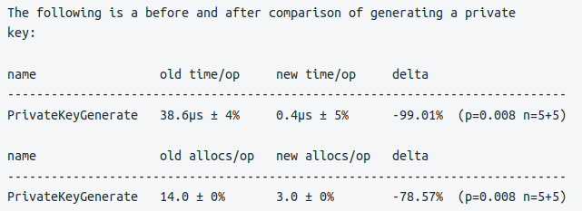

# Decred Journal – Lipiec 2022

_Obraz: Wiadomości, aut. @OfficialCryptos._

Najważniejsze wydarzenia z lipca:

- DCRDEX dodało wsparcie dla nowego typu portfela Bitcoin oraz portfela Electrum SPV

- Politeia zbliża się do nowego wydania z zaimportowanymi starszymi propozycjami i nową architekturą wtyczki GUI

- Po odrzuceniu wniosku o dalsze finansowanie GoDCR zespół odpowiedzialny za projekt ogłosił, że wstrzymuje nad nim prace

- @jy-p wspomniał w wywiadzie o czymś, nad czym pracuje w oparciu o Lightning Network, o nowatorskim sposobie wykorzystania LN, który jest już skończony i powinien zadebiutować publicznie w ciągu najbliższych dwóch miesięcy

Spis treści:

- [Rozwój](#development)
- [Ludzie](#people)
- [Zarządzanie](#governance)
- [Sieć](#network)
- [Ekosystem](#ecosystem)
- [Nawiązywanie kontaktów](#outreach)
- [Media](#media)
- [Dyskusje społeczności](#discussions)
- [Rynki](#markets)
- [Ważne kwestie i wiadomości poboczne](#relevant-external)

## Rozwój

O ile nie zaznaczono inaczej, prace zgłaszane poniżej mają status „scalonych z repozytorium głównym (master)”. Oznacza to, że prace są ukończone, zrecenzowane i zintegrowane z kodem źródłowym, który zaawansowani użytkownicy mogą [kompilować i uruchamiać](https://medium.com/@artikozel/the-decred-node-back-to-the-source-part-one-27d4576e7e1c), ale ich efekty nie są jeszcze dostępne w wersji plików binarnych dla zwykłych użytkowników.

### dcrd

_[dcrd](https://github.com/decred/dcrd) jest pełną implementacją węzła, który obsługuje sieć peer-to-peer Decred na całym świecie._

Optymalizacje:

-  Bezpośrednio zaimplementowano [generowanie kluczy prywatnych](https://github.com/decred/dcrd/pull/2971) dla krzywej secp256k1 w celu zastąpienia wersji generycznej z biblioteki standardowej wraz z wymaganym przez nią kodem adaptacyjnym. Ta implementacja jest nie tylko znacznie bardziej wydajna, zarówno pod względem szybkości wykonania operacji, jak i alokacji pamięci, ale także teoretycznie bardziej bezpieczna, ponieważ nie posiada odchylenia modulo, które posiada implementacja w standardowej bibliotece.
- Znacząco [zoptymalizowano kod dla wydobycia za pomocą CPU](https://github.com/decred/dcrd/pull/2977), który jest przydatny do wydobywania na testnecie. Kod śledzący statystyki prędkości został przerobiony w celu poprawy dokładności i wydajności. Przed tą zmianą hashrate wynosił ~0.5 Mh/s i można było efektywnie wykorzystać do 2 rdzeni. Zoptymalizowany kod haszuje z prędkością 1,2 Mh/s na jednym rdzeniu i ponad 10 Mh/s przy 10 rdzeniach.

Pozostałe:

- Usunięto [seedery planetdecred.org](https://github.com/decred/dcrd/pull/2974) zarówno dla mainnetu, jak i testnetu zgodnie z prośbą ich opiekuna.
- Przeformatowano [komentarze dokumentacyjne](https://github.com/decred/dcrd/pull/2976) w całym repozytorium za pomocą `gofmt` w nowym Go 1.19. Robienie tego wszystkiego na raz w jednym commicie oszczędza przyszłym commitom dodatkowego zagracania diffu.
- Naprawiono [nadawanie zwycięskich biletów](https://github.com/decred/dcrd/pull/2968), gdy istnieje wielu kandydatów do następnego bloku ("końcówki łańcucha") i niektórzy z nich nie mają jeszcze dostępnych danych swojego bloku. Portfele głosujące podłączone do dcrd w takim stanie nie były w stanie ponownie rozpocząć głosowania na bloki z powodu błędu.
- Mniejsze usprawnienia.

_Obraz: Kolejny dzień w rozwoju dcrd._

### dcrwallet

_[dcrwallet](https://github.com/decred/dcrwallet) to serwer portfela używany przez wiersz polecenia oraz aplikacje graficzne._

Automatyczny zakup biletów (ticketbuyer):

- Ticketbuyer nie będzie próbował [mieszać reszty](https://github.com/decred/dcrwallet/pull/2171), jeśli serwer CoinShuffle++ nie został ustawiony.

Korzystanie z JSON-RPC oraz wiersza polecenia przez `dcrctl`:

- Naprawiono komendę `signrawtransasction`, która nie widziała podanych [kluczy prywatnych](https://github.com/decred/dcrwallet/pull/2173) do podpisu wejść typu P2PKH.

W toku:

- Dodanie zapytań, aby zezwolić portfelowi Decrediton na pobieranie i aktualizację [polityki głosowania w sprawie oczekujących głosów TSpend](https://github.com/decred/dcrwallet/pull/2172).

### Decrediton

_[Decrediton](https://github.com/decred/decrediton) to w pełni funkcjonalny desktopowy portfel ze zintegrowaną funkcją głosowania, mieszania StakeShuffle, Lightning Network, handlem na DEX i nie tylko. Działa z lub bez dostępu do pełnego łańcucha (tryb SPV)._

W toku - [głosowanie nad poszczególnymi transakcjami TSpend](https://github.com/decred/decrediton/pull/3787) jest na etapie dodawania do portfela Decrediton:

- Zakładka wydatków ze Skarbca wyświetlać będzie oczekujące transakcje TSpend i możliwość oddania na nie głosów.
- W widoku głównym użytkownicy powiadamiani będą o nowych transakcjach TSpend, na które nie oddali jeszcze głosów.
- Strona szczegółów biletów wyświetli klucz Skarbca oraz decyzje ws. głosowania nad transakcjami TSpend ustawionymi na VSP.

### Politeia

_[Politeia](https://github.com/decred/politeia) to system składania propozycji w ekosystemie Decred, który służy do wnioskowania o środki ze Skarbca._

Zmiany na backendzie - tstore:

- Usunięto możliwość [używania LevelDB](https://github.com/decred/politeia/pull/1651) jako magazynu danych klucz-wartość dla tstore, który teraz jest domyślnie MySQL. Ponieważ MySQL jest i tak wymagany przez Trilliana, usunięcie alternatywnego magazynu danych upraszcza konfigurację politeiad i czyni kod łatwiejszym do utrzymania.
- Zaktualizowano backend tstore, aby umożliwić [nadpisywanie](https://github.com/decred/politeia/pull/1652) istniejących wpisów. tstore zapisuje dane w dwóch krokach: zapisuje dane w magazynie danych klucz-wartość, a następnie dołącza ich hash do drzewa Trilliana. Nadpisywanie istniejących wpisów naprawia niemożność ponownego przesłania niezmienionych danych, jeśli drugi krok się nie powiódł.

Zmiany na backendzie - wtyczka `ticketvote`:

- Dodano [timestamp](https://github.com/decred/politeia/pull/1653) ostatniej zmiany statusu głosowania do struktury podsumowania głosowania. Pozwala to na wyciągnięcie mniejszej ilości danych podczas przebudowy spisu głosów.
- Przeprojektowano [cache inwentarza](https://github.com/decred/politeia/pull/1649) `ticketvote` z ulepszonym API, lepszą dokumentacją i zapisywaniem danych w bazie tstore zamiast w systemie plików. Podobnie, [cache podsumowań głosów](https://github.com/decred/politeia/pull/1657) i [cache zgłoszeń runoff](https://github.com/decred/politeia/pull/1658) zostały przeniesione z systemu plików do cache'a wtyczek tstore.
- Zaimplementowano funkcję [fsck](https://github.com/decred/politeia/pull/1659) wtyczki `ticketvote`, która odbudowuje wszystkie jej pamięci podręczne.

Zmiany na backendzie - stare propozycje:

- Dodano [polecenie `import`](https://github.com/decred/politeia/pull/1632) do narzędzia `legacypoliteia`. Importuje ono do backendu tstore dane JSON, które zostały wygenerowane podczas wykonywania polecenia `convert`. Te dwa polecenia (`convert` i `import`) pozwalają na migrację większości danych z poprzedniej wersji Politei do wersji bieżącej. Podpisy klientów i serwerów nie są importowane, ponieważ nie pasują do przekonwertowanych danych. Niektóre dziwactwa związane z Trillianem trzeba było zbadać i obejść przy pomocy obszernych testów i innych rozwiązań.

Zmiany na backendzie - pozostałe:

- Naprawiono błąd, w którym akceptowane były [puste komentarze](https://github.com/decred/politeia/pull/1655).
- Usunięto [starszy kod websockets](https://github.com/decred/politeia/pull/1660), który nigdy nie był do niczego używany.
- Czyszczenie kodu i pakowanie.
- Różne ulepszenia, poprawki itp.

Aplikacja wiersza polecenia`politeaivoter`:

- Skonsolidowano [obsługę błędu konfiguracji](https://github.com/decred/politeia/pull/1648), aby spójniej pokrywała więcej przypadków.

Interfejs graficzny Politei:

- Usunięto wgrane na sztywno [stare propozycje](https://github.com/decred/politeiagui/pull/2762) i obsługujący je kod, gdyż zostały one zmigrowane do obecnej wersji bazy danych Politei.
- Różne usprawnienia, zmiany i ok. 8 poprawek.

Postęp interfejsu graficznego Politei w kierunku [architektury wykorzystującej wtyczki](https://github.com/decred/politeiagui/tree/master/plugins-structure#politeiagui---plugins-structure):

- Wyświetlanie modala ostrzegawczego dla [zewnętrznych linków](https://github.com/decred/politeiagui/pull/2804).
- Każdy plugin może teraz [eksportować "efekty"](https://github.com/decred/politeiagui/pull/2800), które deweloperzy mogą ponownie wykorzystać i wkomponować w swoje aplikacje oparte na kodzie Politei. Na przykład, gdy użytkownik przewija listę do końca, kod do pobrania następnej partii propozycji/komentarzy/podsumowań głosowania może być wywołany ze wtyczek odpowiedzialnych za te funkcje.
- Dodano [pakiet CLI](https://github.com/decred/politeiagui/pull/2827) `politeiagui-scripts`. Deduplikuje on wspólną konfigurację i dostarcza 7 poleceń do tworzenia i testowania wtyczek i aplikacji.

### cspp

_[cspp](https://github.com/decred/cspp) to serwer do koordynowania mieszania monet za pośrednictwem protokołu CoinShuffle++. Nie jest powierniczy, tzn. nie przejmuje kontroli nad środkami._

- [@jy-p mówi, że wraz z @jrick poczynił spore postępy](https://www.youtube.com/watch?v=1RBBNnrPqc0&t=123) nad mieszaniem peer-to-peer dla funkcji prywatności StakeShuffle ekosystemu Decred. Obecnie StakeShuffle polega na centralnym serwerze [mix.decred.org](https://mix.decred.org/).

### DCRDEX

_[DCRDEX](https://github.com/decred/dcrdex) to niepowiernicza giełda, umożliwiająca handel bez konieczności zaufania, działająca dzięki technologii atomic swaps._

Generalne zmiany skierowane do użytkowników:

- Wyświetlanie [ekwiwalentów fiatów](https://github.com/decred/dcrdex/pull/1600) w różnych miejscach UI.
- Dodano ogólne wsparcie dla [rekonfiguracji portfela na żywo](https://github.com/decred/dcrdex/pull/1686) i zaimplementowano je dla BTC. Pozwala to na przywrócenie zablokowanych monet po zmianie konfiguracji portfela. Przed tą zmianą, rekonfiguracja portfela ze zleceniami na żywo odblokowywała środki, ale próba ich użycia powodowała błąd.
- Wdrożono [buforowanie i wygasanie stawek](https://github.com/decred/dcrdex/pull/1721), aby rozwiązać długotrwały problem używania nieaktualnych stawek. Zoptymalizowano również częstotliwość pobierania stawek z różnych źródeł (portfel, księga zamówień, zewnętrzne API).
- Wyjaśniono komunikat o [wyłączeniu serwera DEX](https://github.com/decred/dcrdex/pull/1634). Dzięki ostatnim funkcjom odkrywania kont serwer może być wyłączony i ponownie włączony w razie potrzeby bez konieczności ponownego uiszczania opłaty rejestracyjnej.
- Zoptymalizowano [wysokie zużycie zasobów](https://github.com/decred/dcrdex/pull/1684) podczas wpisywania ceny.
- Poprawiono wyświetlanie [procentu wypełnienia](https://github.com/decred/dcrdex/pull/1711) dla zakupów rynkowych.
- Naprawiono otrzymywanie przez użytkowników [potwierdzenia ukończenia zamówienia](https://github.com/decred/dcrdex/pull/1707) dla wycofanych zamówień w rzadkich okolicznościach.

Generalne zmiany wewnętrzne i pozostałe:

- Wymuszenie sprawdzenia [formatowania kodu](https://github.com/decred/dcrdex/pull/1699) podczas tworzenia buildów CI celem lepszej spójności.
- Inne poprawki infrastrukturalne, refaktoryzacja kodu i ~5 poprawek.

Wsparcie dla Decred:

- Wsparcie dla [zewnętrznych źródeł](https://github.com/decred/dcrdex/pull/1654) szacunkowej wysokości opłat transakcyjnych dla portfeli DCR (Insight API z dcrdata), jako opcji zapasowej na wypadek braku możliwości lokalnego oszacowania opłaty transakcyjnej.
- Naprawiono monitorowanie bloków dla portfeli DCR SPV oraz ulepszono [komunikaty błędów połączenia](https://github.com/decred/dcrdex/pull/1701).

Wsparcie dla Bitcoina i zasobów do niego podobnych:

- Dodano wsparcie dla popularnych portfeli [Electrum SPV](https://github.com/decred/dcrdex/pull/1607) (BTC, LTC, BCH). Klient DEX może komunikować się z lokalnym portfelem Electrum (min. wersja 4.2) i używać jego środków do handlu.
- Dodano krótkie opóźnienie dla [wysyłania ZEC](https://github.com/zcash/zcash/issues/6045) po wydobyciu bloku w testach obciążeniowych, aby obejść problem z [wyborem wyjścia](https://github.com/zcash/zcash/issues/6045) w Zcash.
- Podniesiono minimalną wymaganą [wersję Bitcoin Core](https://github.com/decred/dcrdex/pull/1735) do v0.21 (i v22 w przypadku korzystania z portfeli deskryptorowych).
- Naprawiono awarię natywnego portfela BTC SPV po [wysyłaniu zbyt małej](https://github.com/decred/dcrdex/pull/1705) kwoty ("dust"), co nie powinno być dozwolone.
- Naprawiono tworzenie natywnego portfela BTC z [zbyt małą opłatą](https://github.com/decred/dcrdex/pull/1657).

Wsparcie dla Ethereum:

- Zwiększono [limit opłaty za gaz](https://github.com/decred/dcrdex/pull/1692) ETH dla wykupów, gdy opłata bazowa jest zbyt wysoka.
- Dodano możliwość [eksportu portfela ETH](https://github.com/decred/dcrdex/pull/1648) do Metamask.
- Zmieniono sposób, w jaki [klucz prywatny portfela ETH](https://github.com/decred/dcrdex/pull/1702) jest wyprowadzany, aby mieć dodatkowy krok, w którym generowana jest fraza mnemoniczna Ethereum BIP-39, z którego następnie wyprowadzany jest klucz prywatny. Pozostawia to otwarte drzwi do eksportu zarówno słów ziarna, jak i klucza prywatnego konta w przyszłości.
- Dodano test dla [przepełnienia arytmetyki](https://github.com/decred/dcrdex/pull/1722) w kontrakcie Solidity na Ethereum. Począwszy od Solidity v0.8.0 transakcja _powinna_ być cofana automatycznie w przypadku wystąpienia przepełnienia. Test został dodany na wypadek, gdyby wersja Solidity używana w DCRDEX została w jakiś sposób obniżona poniżej v0.8.0, lub gdyby przyszłe wersje Solidity usunęły to zabezpieczenie. Jakkolwiek mało to prawdopodobne, to strzeżonego pan Bóg strzeże.

_Obraz: DCRDEX wyświetla równowartość fiat celem ułatwienia przejścia z tradycyjnego systemu finansowego._

### GoDCR

_[GoDCR](https://github.com/planetdecred/godcr) to lekka aplikacja portfela na systemy desktopowe ze zintegrowanym stakingiem, prywatnością i przeglądaniem platformy Politeia._

Po odrzuceniu [propozycji](https://proposals.decred.org/record/0ef42e5) sfinansowania przyszłego rozwoju GoDCR, zespół @raedah [ogłosił](https://matrix.to/#/!gruHpujXftcsHcghjx:planetdecred.org/$tSIfmIcwrrtslpOU04O5m8y8cJzumZvds5ipv9coB30?via=planetdecred.org&via=decred.org&via=matrix.org), że projekt nie będzie już przez nich aktywnie rozwijany.

Scalone:

- Zaktualizowano [stronę transakcji](https://github.com/planetdecred/godcr/pull/893) (poprawiono wyświetlanie wierszy z transakcjami, liczenie każdego typu tx w rozwijanym filtrze, itp.)
- Wdrożono nowy wygląd [strony Przegląd](https://github.com/planetdecred/godcr/pull/1008).
- Zaktualizowano stronę ustawień portfela do [najnowszego UI](https://github.com/planetdecred/godcr/pull/1007).
- Dodano [selektor serwera](https://github.com/planetdecred/godcr/pull/1011) DEX, możliwość korzystania z niestandardowego serwera oraz uiszczania opłaty rejestracyjnej.
- Poprawiono [obsługę](https://github.com/planetdecred/godcr/pull/1023) usuwania portfela.
- Wdrożono nowy wygląd [zakładki Staking](https://github.com/planetdecred/godcr/pull/1016).
- Liczne poprawki błędów i ulepszenia UI.
- Aktualizacje tłumaczeń.

W toku:

- Uproszczono API w dcrlibwallet dla [ściągania danych](https://github.com/planetdecred/dcrlibwallet/pull/255) z eksploratora bloków dcrdata oraz giełd wymian.
- Nowy layout strony [StakeShuffle](https://github.com/planetdecred/godcr/pull/1024).
- Nowy design strony [transakcji](https://github.com/planetdecred/godcr/issues/1025).
- Funkcja [wyszukiwania propozycji](https://github.com/planetdecred/godcr/pull/1027).

_Obraz: Nowy design stakingu w GoDCR._

### dcrdata

_[dcrdata](https://github.com/decred/dcrdata) to eksplorator blockchaina Decred oraz danych off-chain, takich jak propozycje na platformie Politeia, rynków i ponadto._

- Dodano stronę [weryfikacji podpisu wiadomości](https://github.com/decred/dcrdata/pull/1911) oraz dwa nowe punkty końcowe HTTP API do wykorzystania w skryptach i aplikacjach. Dodano również [ogranicznik body zapytania](https://github.com/decred/dcrdata/commit/c9d07773f51cc93186d6c4d1c1f74f8c170f297d) z domyślną wartością 2 MiB, w porównaniu do domyślnych 10 MiB.

W toku:

- Wyświetlanie większej ilości [mechaniki Skarbca](https://github.com/decred/dcrdata/pull/1918) jak postęp w osiągnięciu kworum, przybliżona data rozpoczęcia/zakończenia głosowania, użyte klucze Pi i inne.
- Deweloperzy sprawdzają [problemy z paginacją](https://github.com/decred/dcrdata/issues/1925) na stronie Skarbca.

### Dokumentacja

_[dcrdocs](https://github.com/decred/dcrdocs) to repozytorium źródłowe [dokumentacji użytkownika](https://docs.decred.org/) dla Decred._

- Zaktualizowano dokumenty związane z [aplikacjami wiersza poleceń](https://github.com/decred/dcrdocs/pull/1193), aby dopasować je do wydania v1.7.2 i wspomniano o wsparciu dla chipu Apple M1 i systemów BSD.
- [Zaktualizowano i przeorganizowano](https://github.com/decred/dcrdocs/pull/1195) przewodnik [korzystania z eksploratora bloków](https://docs.decred.org/getting-started/using-the-block-explorer/) w celu rozwiązania [zamieszania](https://www.reddit.com/r/decred/comments/uqrdpa/dcr_data_looking_into_a_block_decred_fundamentals/i8su4lb/) powstałego na Reddicie.

### decred.org

_[dcrweb](https://github.com/decred/dcrweb) to źródło kodu dla strony decred.org._

- Linki do [mediów społecznościowych](https://decred.org/community/) zostały [uprzątnięte](https://github.com/decred/dcrweb/pull/1052). Największą zmianą jest usunięcie linków do chińskich social mediów z racji braku kontroli nad nimi i niewystarczającej moderacji.

### Pozostałe

W odpowiedzi na pytanie społeczności "Co chcielibyście, aby Decred rozwijał dalej?" @jy-p [uchylił rąbka tajemnicy](https://www.youtube.com/watch?v=1RBBNnrPqc0&t=2462): "Odpowiedź jest zniuansowana. Już to coś opracowałem i jest prawie gotowe. Wypełnia to lukę, którą mieliśmy przez bardzo długi czas, i związane jest z Lightning Network. Nie będę mówił wiele więcej. Możesz pomyśleć o tym w ten sposób. Wokół nas jest dziś cała masa problemów. Jest jeden z nich, który doprowadza mnie do absolutnego szaleństwa i postaram się nim zająć". Cokolwiek to jest, pozostałe prace związane z integracją i GUI zostały z grubsza oszacowane na "2 miesiące".

## Ludzie

Gratulacje dla nowych współpracowników, którym przyznano licencje wykonawców Decred (DCC) w okresie maj-czerwiec:

- @philemon (GitHub [@ukane-philemon](https://github.com/ukane-philemon), rozwój)
- @zippycorners (GitHub [@matthawkins90](https://github.com/matthawkins90), rozwój)

Deweloperzy [@dreacot (GoDCR)](https://www.decredmagazine.com/introducing-decred-developer-dreacot/) oraz [@VictorGuedes (Politeia)](https://www.decredmagazine.com/introducing-decred-developer-victorguedes/) udzielili wywiadów dla @phoenixgreen na łamach Decred Magazine.

Statystyki społeczności na dzień 1. sierpnia (w porównaniu z 1. lipca):

- Obserwujący na [Twitterze](https://twitter.com/decredproject): 54306 (-74)
- Subskrybenci na [Reddit](https://www.reddit.com/r/decred/): 12633 (-3)
- Użytkownicy na [Matrix](https://chat.decred.org/) w pokoju #general: 707 (+18)
- Użytkownicy na [Discordzie](https://discord.gg/GJ2GXfz): 1765 (-561 - usunięci nieaktywni użytkownicy)
- Użytkownicy na [Telegramie](https://t.me/Decred): 2773 (-37)
- Subskrybenci na [YouTube](https://www.youtube.com/decredchannel): 4630 (+0), wyświetleń: 212K (+2K)

## Zarządzanie

W lipcu nowy [Skarbiec](https://dcrdata.decred.org/treasury) otrzymał 9204 DCR o wartości 220 tys. USD po średnim lipcowym kursie wymiany $23,93. 3205 DCR zostało wydane, aby zapłacić kontrahentom, co stanowiło wartość $77K po lipcowym kursie wymiany, lub $90K po czerwcowym kursie rozliczeniowym $28.06.

Transakcja [wypłaty ze Skarbca](https://explorer.dcrdata.org/tx/453e713358bb3c5662ebc1f58c50c50ceb66a950dae925701d8e25a3c4c72d4e) została wydobyta 24 lipca, zawierała 20 wyjść od 2,8 DCR do 1184 DCR. Transakcja została zatwierdzona 4590 głosami na "tak" i 7 głosami na "nie".

Na dzień 8. sierpnia, łączne saldo [starego](https://dcrdata.decred.org/address/Dcur2mcGjmENx4DhNqDctW5wJCVyT3Qeqkx) i [nowego Skarbca](https://dcrdata.decred.org/treasury) wynosi 807 000 DCR (30,7 mln USD po kursie 38.01$).

W lipcu nie było żadnych nowych propozycji. Propozycja tworzenia [Decred Magazine](https://proposals.decred.org/record/3bb2c7e) została zatwierdzona w lipcu z aprobatą 87% i frekwencją 28%. Dwie inne propozycje zostały odrzucone, dotyczące GoDCR (20% poparcia, 57% frekwencji) i marketingu Decred Brazil (19% poparcia, 57% frekwencji).

Zapraszamy do lektury [numeru 53](https://blockcommons.red/politeia-digest/issue053/) Politeia Digest po więcej informacji na temat zgłoszonych w tym miesiącu propozycji.

## Sieć

**Hashrate**: lipcowy [hashrate](https://dcrdata.decred.org/charts?chart=hashrate&zoom=l4vb70eb-l6cmn0q7&scale=linear&bin=block&axis=time) na początku miesiąca wyniósł ~87 Ph/s, a zamknął go na poziomie ~44 Ph/s, zaliczając niż w ok. 28 Ph/s oraz szczyt w wys. 116 Ph/s w ciągu miesiąca.

_Obraz: Moc obliczeniowa nadal poszukuje nowego poziomu równowagi._

Dystrybucja mocy obliczeniowej [zadeklarowana](https://miningpoolstats.stream/decred) przez pule wydobywcze na dzień 1. sierpnia: Poolin 36%, ViaBTC 36%, F2Pool 13%, BTC.com 9%, AntPool 6%, CoinMine 1%.

Podział 1000 bloków [wydobytych](https://miningpoolstats.stream/decred) przed 1. sierpnia: Poolin 42%, ViaBTC 30%, BTC.com 8%, CoinMine 1%, nieznane 19%.

_Obraz: Dystrybucja mocy obliczeniowej pul wydobywczych._

**Staking**: [Cena biletów](https://dcrdata.decred.org/charts?chart=ticket-price&zoom=l4vb70eb-l6cmn0q7&axis=time&visibility=true-true&mode=stepped) wahała się między 215 a 238 DCR, a jej 30-dniowa [średnia](https://dcrstats.com/) wyniosła 226,8 DCR (+3,1).

[Zablokowana suma](https://dcrdata.decred.org/charts?chart=ticket-pool-value&zoom=l4vb70eb-l6cmn0q7&scale=linear&bin=block&axis=time) to pomiędzy 9,12 a 9,25 miliona DCR, co oznacza, że 63,7-64,5% podaży dostępnej w obiegu [wzięło udział](https://dcrdata.decred.org/charts?chart=stake-participation&zoom=l4vb70eb-l6cmn0q7&scale=linear&bin=block&axis=time) w elemencie Proof of Stake.

_Obraz: Najwyższy poziom uczestnictwa w elemencie Proof of Stake._

**VSP**: Na 1. sierpnia, ~7170 (+20) biletów w puli zarządzanych było przez [oficjalne](https://decred.org/vsp/) serwery vspd. Łącznie 18 serwerów VSP miało pod sobą 17,4% całej puli biletów. (+0,1%).

_Obraz: Dystrybucja biletów zarządzanych przez VSP._

**Węzły**: Wersje węzłów wyłapane przez [Decred Mapper](https://nodes.jholdstock.uk/user_agents) na 9. sierpnia (127 ogółem, tylko dcrd): v1.7.1 - 39%, v1.7.2 - 25%, v1.7.0 - 11%, v1.7.0 dev buildy - 7%, v1.8.0 dev buildy - 4%, wersje v1.6 - 3%, wersje v1.5 - 0,7%, wersje v1.4 - 0,7%.

_Obraz: Dystrybucja wersji dcrd._

Ilość [monet mieszanych](https://dcrdata.decred.org/charts?chart=coin-supply&zoom=jz3q237o-la8vk000&scale=linear&bin=day&axis=time&visibility=true-true-true) wahała się w granicach 60,6-60,8%. Dzienna [kwota mieszana](https://dcrdata.decred.org/charts?chart=privacy-participation&zoom=l4pct44v-l6ik5xc0&bin=day&axis=time&visibility=true-false) oscylowała w granicach 244-509K DCR.

Na dzień 9. sierpnia sieć [Lightning Network](https://ln-map.jholdstock.uk/) projektu Decred odnotowała 45 węzłów (+1), 78 kanałów (+6) oraz całkowitą pojemność 36,9 DCR (+0,2).

## Ekosystem

Na stronie decred.org oraz w portfelu Decrediton znajdziecie dwa nowe VSP: [vspd.bass.cf](https://vspd.bass.cf/) zgłoszone przez [@cryptocoiner69](https://github.com/decred/dcrwebapi/pull/162) (opłata 0,2%) oraz [dcrhive.com](https://dcrhive.com/) zarządzane przez @kozel (opłata 0,7%). @kozel planuje wykorzystać otrzymane opłaty VSP na [zapewnienie płynności](https://www.reddit.com/r/decred/comments/vt0wrt/dcr_hive_a_new_lowish_fee_vsp_coming_to_your/) dla sieci Lightning Network - co stanowi interesującą nową zachętę do wzięcia pod uwagę przy wyborze VSP.

Według doniesień @jz Binance [zmniejszyło liczbę wymaganych potwierdzeń DCR](https://matrix.to/#/!lDZCzVQjFoJsXMPkvr:decred.org/$XSPP3KlRoIcNt3cqBG9ZbgTnwu88Kr6VcwPDTNEGZo4?via=decred.org&via=matrix.org&via=planetdecred.org) przy wpłatach z 20 do 6.

[Luxor](https://luxor.tech/) zamknął swoją pulę wydobywczą Decred około 1 miesiąc po pierwotnym terminie 10 czerwca, który został [zgłoszony przez użytkownika Reddit](https://www.reddit.com/r/decred/comments/v6d0lw/luxor_shutdown_their_dcr_mining_pool/).

[BisonPool](https://bisonpool.org/) został oficjalnie uruchomiony. BisonPool to nowy rodzaj puli proof-of-stake, która umożliwia wszystkim posiadaczom Decred zdobycie nagród PoS, nawet jeśli nie mogą sobie pozwolić na zakup całego biletu na własną rękę. Aby to umożliwić, BisonPool łączy DCR użytkowników, aby kupić bilety. Nagrody za bilety są dzielone pomiędzy uczestników w oparciu o ilość DCR, którą byli w stanie zapewnić. Przeczytaj [ogłoszenie na Reddit](https://www.reddit.com/r/decred/comments/vyydm1/bisonpool_is_now_live/).

Użytkownicy nie mają kontroli nad preferencjami głosowania na ich bilety na BisonPool.

Należy zauważyć, że jest to usługa powiernicza, co oznacza, że BisonPool ma kontrolę nad funduszami użytkownika. Istnieje ryzyko, że Twoje środki mogą zostać skradzione, jeśli zdecydujesz się skorzystać z tej usługi. Tożsamość tego, kto prowadzi BisonPool, jest nieznana społeczności Decred. Pamiętaj, nie Twoje klucze, nie Twoje monety.

Uwaga: autorzy Decred Journal nie są w stanie ocenić wiarygodności żadnego z powyższych podmiotów czy ich usług. Uprasza się o dołożenie należnych starań i własnoręczną weryfikację informacji przed powierzeniem jakichkolwiek środków innym stronom.

Dołączcie do naszego kanału [#ecosystem](https://chat.decred.org/#/room/#ecosystem:decred.org), aby śledzić wszelkie nowości związane z ekosystemem Decred.

## Nawiązywanie kontaktów

Osiągnięcia Monde PR:

- Zaproponowano Decred do 2 publikacji PR.
- Odpowiedziano na 2 prośby o komentarz.
- Zdobyto 1 wywiad w mediach.
- Pozyskano 2 niezależnych dziennikarzy do współpracy z Decred Magazine.

Umieszczono w mediach poniższe artykuły:

- Artykuł w [Finder](https://www.finder.com/id/ethereum-eth-price-prediction) z komentarzem @jz na temat perspektywy Ethereum na 2022 rok.
- Artykuł w [Finder](https://www.finder.com.au/solana-sol-price-prediction) zawierający komentarz @jz na temat perspektywy Solana na 2022 rok.
- Artykuł w [Finder](https://www.finder.com/nz/litecoin-ltc-price-prediction) z komentarzem @jz na temat perspektywy Litecoina na 2022 rok.
- Artykuł w [Finder](https://www.finder.com/id/dogecoin-doge-price-prediction) zawierający komentarz @jz na temat perspektywy Dogecoina na 2022 rok.
- Artykuł w [Cointelegraph](https://cointelegraph.com/news/3ac-a-10b-hedge-fund-gone-bust-with-founders-on-the-run) z komentarzem od @jz na temat tego, co doprowadziło do upadku Three Arrows Capital. Artykuł został zsyndykowany do 44 publikacji, w tym [Crypto News Canada](https://cryptonewscanada.com/3ac-a-10b-hedge-fund-gone-bust-with-founders-on-the-run/), [The Switzerland Times](https://www.theswitzerlandtimes.com/3ac-a-10-billion-hedge-fund-goes-bankrupt-with-founders-on-the-run/) i [Bitcoin Insider](https://www.bitcoininsider.org/article/176949/3ac-10b-hedge-fund-gone-bust-founders-run).

## Media

Aktualizacja od [Decred Magazine](https://www.decredmagazine.com/):

> W lipcu opublikowaliśmy 10 nowych artykułów i dodaliśmy do archiwum całą poprzednią zawartość "Decred Assembly". Mamy nowego oficjalnego współtwórcę - Tivrę.
>
> DM ma teraz 297 postów, 50 subskrybentów newslettera, 6 aktywnych kampanii w mediach społecznościowych. Nie jestem pewien jak pokazać pełne zaangażowanie w mediach społecznościowych, ale według moich statystyk w ciągu ostatnich 30 dni było 48 nowych postów, 309 kliknięć na posty, 375 polubień, 56 retweetów, treść została wysłana do 887 followersów na wszystkich kontach. \@phoenixgreen]

DM ma teraz swojego własnego Twittera, śledźcie [@decredmagazine](https://twitter.com/decredmagazine), aby otrzymywać nowe opowiadania i zapowiedzi.

Szukamy autorów! Skontaktuj się z @phoenixgreen na Matrixie w pokoju [#writers](https://chat.decred.org/#/room/#writers:decred.org) lub [@DecredSociety](https://twitter.com/DecredSociety) na Twitterze.

**Artykuły Decred Magazine:**

- [Przedstawiamy dewelopera Decred, @dreacot](https://www.decredmagazine.com/introducing-decred-developer-dreacot/), aut. @phoenixgreen
- [Kryształowa kulo, czy to już dno?](https://www.decredmagazine.com/magic-8-ball-is-this-the-bottom/), analiza techniczna aut. @Applesaucesome
- [Przedstawiamy dewelopera Decred, VictorGuedes](https://www.decredmagazine.com/introducing-decred-developer-victorguedes/), aut. @phoenixgreen
- [Twardy pieniądz, który zmienia się i ewoluuje](https://www.decredmagazine.com/decred-iterates-where-bitcoin-is-weak-broken/), aut. @RonnieAmato
- [Niezdecydowanie, wątpliwości i comiesięczna dawka hopium](https://www.decredmagazine.com/indecision-doubt-and-a-monthly-dose-of-hopium/), analiza techniczna aut. @Applesaucesome

**Wideo:**

- [Wyjaśniamy Decred - polepszanie decentralizacji i skalowalności z hybrydowym mechanizmem konsensusu](https://www.youtube.com/watch?v=VjbYtYFkYI4), aut. Crypto Sketch 101
- [Wiadomości Decred - Pierwsza wypłata z DAO na nowych zasadach, audyt kontraktu DEX Solidity, ATH w mieszaniu & więcej](https://www.youtube.com/watch?v=QOCC4INo2TM), aut. @Exitus
- [Czym jest Decred? Przewidywanie ceny DCR (wyjaśnione z animacjami)](https://www.youtube.com/watch?v=Gpa-xADhtow), aut. Blockchain Side
- [DCRDATA szczegóły, które definiują projekt - fundamenty Decred](https://www.youtube.com/watch?v=Y6U_iWYQb9A), aut. @phoenixgreen

Livestream:

- [Dwuszczeblowa ekonomia - Decred i stan rynku z Jake'iem Yocom-Piattem](https://www.youtube.com/watch?v=1RBBNnrPqc0) z udziałem @Exitus i @phoenixgreen

**Coś dla oka i serca:**

- [Schody ewolucji Decred](https://www.decredmagazine.com/decred-stairs-to-evolve-and-adapt/), aut. @OfficialCryptos ([tweet](https://twitter.com/decredmagazine/status/1551255007118458883))
- [Mieszanie StakeShuffle Decred](https://twitter.com/karamblez/status/1551637047038853122) animacja statystyczna autorstwa @karamble

**Tłumaczenia:**

- Wydanie Decred Journal z czerwca 2022 [przetłumaczono](https://xaur.github.io/decred-news/) na jęz. chiński (@Dominic). Dziękujemy!

## Dyskusje społeczności

Wybrane posty z Reddita:

- Inicjatywa cotygodniowego wkładu wstrzymała się na miesiąc, ale [powróciła z 4. edycją](https://www.reddit.com/r/decred/comments/w7qg79/weekly_contributions_edition_4_bounty_pool_2_dcr/) z dłuższym czasem trwania i pulą nagród w wysokości 2 DCR (plus 1 DCR obiecany przez uczestnika za drugi najlepszy wkład, jeśli taki istnieje). Jej uruchomienie idzie opornie, ale jest jeszcze więcej pomysłów do wypróbowania, zanim się poddamy.

## Rynki

W lipcu kurs wymiany DCR mieścił się w przedziale USD 20,86-29,10 / BTC 0,00104-0,00134. Średni dzienny kurs wynosił $23.93.

@Applesauceseome opublikował dwie [analizy](https://www.decredmagazine.com/magic-8-ball-is-this-the-bottom/) [rynku](https://www.decredmagazine.com/indecision-doubt-and-a-monthly-dose-of-hopium/) wraz z wykresami i komentarzem na temat krypto i szerszego rynku, oraz hopium "nowego pokolenia" w drugim przytoczonym artykule.

_Obraz: Miesięczny wolumen DCRDEX, w DCR._

## Ważne kwestie i wiadomości poboczne

Grupa osób określających się jako "maksymaliści Bitcoina" ulega fragmentacji i kurczy się, a lipiec przyniósł kilka znaczących [dezercji](https://www.coindesk.com/layer2/2022/07/06/nic-carter-and-the-case-for-bitcoin-mediumism/) i rozłamów. Nic Carter przez wiele lat prezentował w mediach pro-Bitcoinową narrację, zdobywając szacunek wielu osób w społeczności - ale kiedy najnowsza inwestycja jego funduszu Castle Island Ventures została zaatakowana przez bitcoinowych maksymalistów na Twitterze, Nic przeszedł do długiej [ofensywy](https://medium.com/@nic__carter/setting-the-record-straight-b4e1b415e7d9) przeciwko nim, punktując ich potknięcia i porażki oraz dystansując się od nich. Później w miesiącu Samson Mow, uważany przez wielu za architekta pozycji maksymalistycznej, sprzeciwił się [komentarzowi](https://twitter.com/TheBlueMatt/status/1556448996159377414) od długoletniego dewelopera Bitcoina Matta Carralo i zatweetował, że ludzie [powinni pamiętać](https://twitter.com/Excellion/status/1556508492822745089) Matta jako osobę, która wprowadziła błąd inflacji do Bitcoina - kontrowersyjny sentyment, który przyciągnął krytykę wielu innych deweloperów Bitcoina, wskazując, że praca deweloperska przechodzi przez cały zespół ludzi i podnoszenie tego wątku w celu zdyskredytowania Matta za komentarze jest rodzajem toksycznego zachowania, które odpycha ludzi od Bitcoina. Jeden z głównych opiekunów Bitcoin Core [ogłosił](https://coincodecap.com/lead-bitcoin-core-maintainer-to-leave) krótko po tym, że ustępuje z tej roli.

Tesla [sprzedała](https://www.coindesk.com/business/2022/07/20/tesla-sold-936m-worth-of-bitcoin-in-second-quarter/) 75% swoich udziałów w BTC w drugim kwartale 2022 roku, o wartości $936M w momencie sprzedaży. Microstrategy, inna publiczna firma, która zdecydowała się na zakup BTC, zatrzymała swoje Bitcoiny, ale dokonała "odpisu aktualizującego" w wysokości $918M. Michael Saylor, uznany maksymalistyczny [memiarz](https://dailycoin.com/top-10-crazy-things-michael-saylor-said-about-bitcoin/), ustąpił z funkcji CEO, aby "[skupić się na kupowaniu Bitcoina](https://www.coindesk.com/business/2022/08/02/microstrategy-replaces-saylor-as-ceo-with-companys-president-saylor-to-become-executive-chairman/)", ale pozostaje w posiadaniu kontroli nad większością akcji spółki z prawem głosu w roli prezesa zarządu.

Dane 1 miliarda mieszkańców Chin zostały [skradzione](https://www.reuters.com/world/china/hacker-claims-have-stolen-1-bln-records-chinese-citizens-police-2022-07-04/) i udostępnione na forum hakerów dark web. CEO Binance CZ był jednym z pierwszych, którzy [tweetowali](https://twitter.com/cz_binance/status/1543700689611792386) o tym, stwierdzając, że kontrole bezpieczeństwa zagrożeń Binance zostaną zwiększone dla dotkniętego regionu i spekulując, że naruszenie nastąpiło, ponieważ klucze [dewelopera wyciekły](https://twitter.com/cz_binance/status/1543905416748359680) w poście na blogu. Jest to jeszcze jeden dowód na to, że najlepszym sposobem ochrony danych użytkowników jest [niegromadzenie](https://www.youtube.com/watch?v=Q8f3j5DWyE8&t=229) ich w pierwszej kolejności.

Fundacja Solana otwiera "[ambasadę](https://www.coindesk.com/layer2/2022/07/28/is-solana-leading-crypto-into-retail-or-trailing-apple/)" w Nowym Jorku - jednostkę typu Apple store, gdzie ludzie będą mogli obejrzeć NFT na Solanie i sprawdzić nadchodzący telefon Solany.

To wszystko na lipiec. Podzielcie się swoimi aktualizacjami do następnego numeru na naszym kanale [#journal](https://chat.decred.org/#/room/#journal:decred.org).

## O tym wydaniu

To 49. wydanie Decred Journal. Spis wszystkich wydań, mirrorów i tłumaczeń dostępny jest [tutaj](https://xaur.github.io/decred-news/).

Większość informacji od stron trzecich jest przekazywana bezpośrednio ze źródła po minimalnym sprawdzeniu poprawności. Autorzy Decred Journal nie mają możliwości zweryfikowania wszystkich publikowanych stwierdzeń. Proszę uważać na oszustwa i przeprowadzać własny research.

Zasługi (kolejność alfabetyczna):

- redakcja treści: bee, bochinchero, Exitus, jz, l1ndseymm, phoenixgreen, richardred
- recenzje i komentarze: buck54321
- ilustracja tytułowa: OfficialCryptos
- finansowanie: interesariusze Decred
