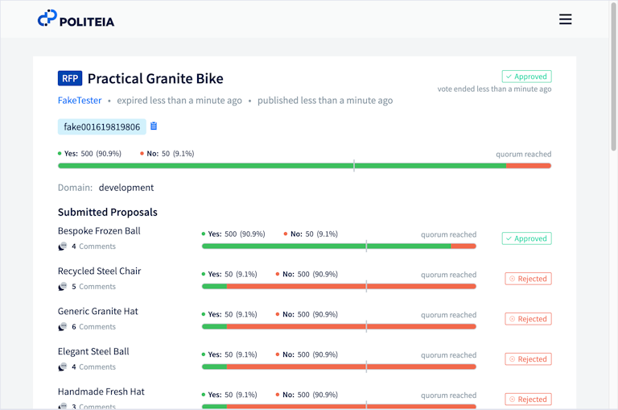

# Decred Journal – Sierpień 2022

_Obraz: "Inspiracja" z nowego dizajnu strony decred.org aut. @saender._

Najważniejsze wydarzenia z sierpnia:

- Zaproponowano, przegłosowano i przeprowadzono przebudowę strony decred.org.
- Wypuszczono wersję v1.4.0 Politei. Nowe funkcje to np. 5-minutowe okno, w trakcie którego można edytować swoje komentarze.
- Wypuszczono DCRDEX v0.5.2 z którego mogą korzystać ci niecierpliwi traderzy, którzy nie chcą czekać na integrację z portfelem Decrediton, nad którą trwają prace.
- Wypuszczono wersję v1.7.4 głównego oprogramowania Decred, jedynie w formie kodu źródłowego, aby naprawić sieć testnet, która została unieruchomiona przez górników ASIC.

Spis treści:

- [Wydanie Politeia v1.4.0](#politeia-v140-released)
- [Rozwój](#development)
- [Ludzie](#people)
- [Zarządzanie](#governance)
- [Sieć](#network)
- [Ekosystem](#ecosystem)
- [Nawiązywanie kontaktów](#outreach)
- [Media](#media)
- [Dyskusje społeczności](#discussions)
- [Rynki](#markets)
- [Ważne kwestie i wiadomości poboczne](#relevant-external)

## Wydanie Politeia v1.4.0

Nowa wersja Politei jest już dostępna po 8 miesiącach rozwoju! Najważniejsze elementy to:

- Największym elementem pracy nad tym wydaniem było importowanie starszych propozycji. Teraz wszystkie propozycje są dostępne na stronie [proposals.decred.org](https://proposals.decred.org/) i nie ma już osobnej strony z archiwum.
- Komentarze mogą być edytowane w ciągu 5 minut zaraz po ich zamieszczeniu.
- Dla ocenzurowanych propozycji wyświetlanie są teraz powód cenzury i moderator.
- Ulepszono UX wersji roboczych propozycji.
- Wstępne prace nad nową architekturą do budowania aplikacji podobnych do Politei.

Pełne informacje o wydaniu dostępne są w repozytoriach [politeia](https://github.com/decred/politeia/releases/tag/v1.4.0) i [politeiagui](https://github.com/decred/politeiagui/releases/tag/v1.4.0).

## Rozwój

O ile nie zaznaczono inaczej, prace zgłaszane poniżej mają status „scalonych z repozytorium głównym (master)”. Oznacza to, że prace są ukończone, zrecenzowane i zintegrowane z kodem źródłowym, który zaawansowani użytkownicy mogą [kompilować i uruchamiać](https://medium.com/@artikozel/the-decred-node-back-to-the-source-part-one-27d4576e7e1c), ale ich efekty nie są jeszcze dostępne w wersji plików binarnych dla zwykłych użytkowników.

### dcrd

_[dcrd](https://github.com/decred/dcrd) jest pełną implementacją węzła, który obsługuje sieć peer-to-peer Decred na całym świecie._

Wydano dcrd v1.7.4 celem naprawienia algorytmu wydobycia w sieci testnet, co szczegółowo opisane jest poniżej. Było to wydanie jedynie w wersji kodu źródłowego, ponieważ skierowane jest głównie do deweloperów.

Scalono z gałęzią `master` oraz zbackportowano do wydania v1.7.4:

- Wymuszono [dławienie trudności wydobycia](https://github.com/decred/dcrd/pull/2978) w sieci testowej. Zwykle nie spodziewa się jednostek ASIC na testnecie, a bloki są wydobywane za pomocą "powolnego" wydobywania przez CPU, ponieważ wymaganie sprzętu o dużej mocy nie jest rozsądne, jeśli ktoś chce dołączyć do sieci testnet. Nie ma też ku temu żadnej zachęty finansowej, ponieważ monety testnetu nie mają żadnej wartości, a górnicy ASIC zwykle wolą kopać na sieci mainnet dla zysku. Pomimo tego, niespodziewany hashrate ~78 Th/s (odpowiednik 2 jednostek Antminer DR5) dołączył do testnetu Decred i wydobywał przez ~5 godzin, co podniosło poziom trudności i skutecznie zastopowało sieć. Aby ograniczyć rodzaj gierek, w które mogą pogrywać górnicy ASIC w sieci testowej, wprowadzono dwie nowe zasady: limit maksymalnej dozwolonej trudności i limit szybkości produkcji bloków po osiągnięciu maksymalnej trudności. Powinno to sprawić, że wydobycie na CPU będzie wykonalne nawet w obecności GPU i ASIC. Należy zauważyć, że to rozwiązanie jest odpowiednie tylko w sieci testowej, w której nie ma prawdziwej wartości pieniężnej, a zatem typowa mechanika teorii gier nie ma zastosowania.

- Zoptymalizowano obsługę bloków ze zbyt małą liczbą głosów tak, aby oprócz transakcji stakingowych również [kopiowała zwykłe transakcje](https://github.com/decred/dcrd/pull/2978/commits/659b7fed1f225861b8b689ead1a0466099992479) do alternatywnego szablonu bloku. To sprawi, że tworzenie szablonów będzie bardziej odporne w przypadku zduplikowanych wydatków i pomoże zapewnić, że wszystkie transakcje w unieważnionym (niedogłosowanym) bloku są dodawane do alternatywnych szablonów bloków. Poprzednio wszystkie transakcje były również kopiowane, ale dopiero w następnym bloku, więc ta zmiana usuwa niepotrzebne opóźnienie.

Scalono z gałęzią `master` do wydania v1.8:

- Sprawiono, że dłużej działające testy `blockchain` [wykonywane są równolegle](https://github.com/decred/dcrd/pull/2988), aby zredukować całkowity czas testowania mniej więcej o połowę.
- Usunięto cały kod związany z [poprzednimi zrzutami skryptów](https://github.com/decred/dcrd/pull/2989) teraz, gdy indeks adresów został usunięty i nie ma innych indekserów, które wymagają dostępu do poprzednich skryptów.
- Utrzymanie kodu i mniejsze poprawki.

### dcrwallet

_[dcrwallet](https://github.com/decred/dcrwallet) to serwer portfela używany przez wiersz polecenia oraz aplikacje graficzne._

Scalono z gałęzią `master` oraz zbackportowano do kodu źródłowego wydania v1.7.4:

- Zaimplementowano metodę importowania arbitralnych [kluczy publicznych](https://github.com/decred/dcrwallet/pull/2177) i ich adresów pochodnych. Jest ona obsługiwana tylko dla portfeli typu watch-only.
- Dodano punkty kontrolne do [hard-forkowego testnet3](https://github.com/decred/dcrwallet/pull/2178) do nowych zasad zaimplementowanych w dcrd. Punkty kontrolne są używane do wypchnięcia portfela na zamierzony, łańcuch bez głosów ze względu na to, że ma znacznie mniejszą całkowitą pracę niż łańcuch, który jest reorganizowany.

Scalono z gałęzią `master`:

- Zaktualizowano [punkty kontrolne trudności](https://github.com/decred/dcrwallet/pull/2181) dla nowych zasad dławienia w sieci testnet3.

### dcrctl

_[dcrctl](https://github.com/decred/dcrctl) to klient wiersza polecenia dla dcrd i dcrwallet._

- Zaktualizowano klienta do najnowszej wersji [modułów Go](https://github.com/decred/dcrctl/pull/49) and [GitHub action](https://github.com/decred/dcrctl/pull/48).

### Decrediton

_[Decrediton](https://github.com/decred/decrediton) to w pełni funkcjonalny desktopowy portfel ze zintegrowaną funkcją głosowania, mieszania StakeShuffle, Lightning Network, handlem na DEX i nie tylko. Działa z lub bez dostępu do pełnego łańcucha (tryb SPV)._

- Dodano możliwość [odświeżania](https://github.com/decred/decrediton/pull/3785) okna DEX za pomocą klawisza F5.
- Strona wydatków ze Skarbca używa teraz [testnetowych kluczy Pi](https://github.com/decred/decrediton/pull/3776) na testnecie i ma odpowiednie linki do ich weryfikacji w kodzie źródłowym dcrd.
- Poprawiono "Stakeshuffle++" na "StakeShuffle" w [zakładce Prywatność](https://github.com/decred/decrediton/pull/3779).
- ~4 poprawki i inne wewnętrzne aktualizacje.

### Politeia

_[Politeia](https://github.com/decred/politeia) to system składania propozycji w ekosystemie Decred, który służy do wnioskowania o środki ze Skarbca._

Zmiany na backendzie:

- Zoptymalizowano i poprawiono walidację w poleceniu [`dbutil -migrate`](https://github.com/decred/politeia/pull/1667) (używanym do migracji z jednej bazy danych użytkownika do innej).
- [Wersja aplikacji](https://github.com/decred/politeia/pull/1671) przechowywana jest od teraz jako pojedynczy ciąg znaków, aby uprościć proces wydawania.
- Różne [aktualizacje](https://github.com/decred/politeia/pull/1672) dla Go 1.19 (konfiguracja CI, GitHub Actions, linter i [formatowanie kodu](https://github.com/decred/politeia/pull/1673)).
- Usuwanie [wygasłych sesji użytkowników](https://github.com/decred/politeia/pull/1669) przy starcie. Testy dla bazy danych sesji zostały [przepisane](https://github.com/decred/politeia/pull/1674), aby naprawić liczne problemy.
- Zaktualizowano polecenie [`dbutil -dump`](https://github.com/decred/politeia/pull/1676), aby działało ze wszystkimi implementacjami baz danych użytkowników.
- Zamrożenie [drzew Trilliana](https://github.com/decred/politeia/pull/1670) odpowiadających rekordom Politei, które nie pozwalają już na aktualizacje (takie jak Censored czy Archived). Używanie Trilliana przez Politeię jest zupełnie inne niż zamierzone i powoduje duże obciążenie procesora. Zamrożenie niektórych drzew powinno je zmniejszyć.

Obecne GUI:

- Zachowano [etykietę kworum](https://github.com/decred/politeiagui/pull/2836) dla zatwierdzonych i odrzuconych propozycji.
- Naprawiono częsty błąd [nieważnego podpisu](https://github.com/decred/politeiagui/pull/2842) dla nowych kluczy, które były używane przed zarejestrowaniem się na serwerze.
- Naprawiono 2 błędy w starszych [propozycjach RFP](https://github.com/decred/politeiagui/pull/2845) i ~6 błędów w starszych [komentarzach](https://github.com/decred/politeiagui/pull/2852).

Przeprojektowane GUI na bazie nowej [architektury wtyczek](https://github.com/decred/politeiagui/tree/master/plugins-structure#politeiagui---plugins-structure):

- Deduplikacja wspólnej konfiguracji [Babel i Jest](https://github.com/decred/politeiagui/pull/2838).
- Dodano różne informacje do wtyczki `pi`: status propozycji, czas trwania głosowania, kworum, zmiany statusu rozliczeń i komunikaty o błędach.
- Dodano [testy end-to-end](https://github.com/decred/politeiagui/pull/2803) oparte na Cypress.
- Zaimplementowano zapytania ofertowe dla [propozycji i zgłoszeń](https://github.com/decred/politeiagui/pull/2848).
- Ponowne użycie [punktów przerywania widoku](https://github.com/decred/politeiagui/pull/2849) z pi-ui. Punkty przerwania kontrolują, który układ jest używany, aby dopasować się do rozmiaru ekranu użytkownika.
- ~5 poprawek
- Refaktoryzacja i czyszczenie kodu

Współdzielona biblioteka pi-ui:

- [Customowe punkty przerywania](https://github.com/decred/pi-ui/pull/459) mogą być od teraz wykorzystywane wewnętrznie i przez aplikacje korzystające z `pi-ui`. Zaprzęgnięto [PostCSS](https://postcss.org/) do przetwarzania CSS.

_Obraz: Zaktualizowany widok propozycji z zapytaniem ofertowym w Politei._

### Lightning Network

_[dcrlnd](https://github.com/decred/dcrlnd) to oprogramowanie węzła Lightning Network dla Decred. LN umożliwia przesyłanie natychmiastowych i niskokosztowych transakcji._

Daemon LN:

- Dodano [wywołanie RPC](https://github.com/decred/dcrlnd/pull/163) `EnforcePing`. Pozwala to wywołującym na skierowanie dcrlnd do pingowania określonego peera i czekania na odpowiedź. Jeśli odpowiedź nie zostanie odebrana, wtedy peer jest rozłączany.
- Dodano [wykrywanie zawieszeń i rozłączanie](https://github.com/decred/dcrlnd/pull/162) dla peerów. Jest to potrzebne do obsługi sytuacji, w których komputer z uruchomionym dcrlnd jest zawieszony, a następnie wznawia pracę po upływie czasu wystarczającego do rozłączenia się zdalnego peera.
- Zmniejszono [timeout dla bezczynnych peerów](https://github.com/decred/dcrlnd/commit/02793bc8d7e2fb1b0775f24b87bad4c892e62ba9) do 1 minuty i 30 sekund, z 5 minut. Czas bezczynności wynoszący 5 minut jest zbyt długi i uniemożliwia wczesne wykrywanie zawieszonych peerów.

[Daemon usługi płynności (liquidity provider)](https://github.com/decred/dcrlnlpd):

- Skonfigurowano [GitHub Actions](https://github.com/decred/dcrlnlpd/pull/5) dla automatycznych buildów.
- Udokumentowano jak oprogramowanie [przejmuje kontrolę](https://github.com/decred/dcrlnlpd/pull/4) nad kanałami wychodzącymi.
- Dodano obsługę [szyfrowania TLS](https://github.com/decred/dcrlnlpd/pull/6).

### DCRDEX

_[DCRDEX](https://github.com/decred/dcrdex) to niepowiernicza giełda, umożliwiająca handel bez konieczności zaufania, działająca dzięki technologii atomic swaps._

Wydano DCRDEX v0.5.2! Sprawdź najpierw opis [wydania v0.5.0](https://github.com/decred/dcrdex/releases/tag/v0.5.0), aby zapoznać się z długą listą funkcji, poprawek i instrukcji aktualizacji z v0.4. Począwszy od wersji [v0.5.2](https://github.com/decred/dcrdex/releases/tag/v0.5.2) DCRDEX publikuje teraz swoje własne binarki. Jak zawsze, [ich weryfikacja](https://docs.decred.org/advanced/verifying-binaries) jest mocno zalecana.

Proszę zauważyć, że nie było w tej sprawie jeszcze żadnego ogłoszenia, ponieważ DCRDEX koordynuje prace z innymi komponentami ekosystemu (takimi jak Decrediton).

Sierpniowe zmiany zawarte w wydaniu v0.5:

- Przeniesiono [zawartość wiki](https://github.com/decred/dcrdex/pull/1714) do [docs/wiki](https://github.com/decred/dcrdex/tree/master/docs/wiki) w głównym repozytorium. Teraz wszystkie dokumenty znajdują się w jednym miejscu i mogą być aktualizowane i przeglądane przez większą liczbę współpracowników poprzez system pull request.
- Przepisano dużą część [README](https://github.com/decred/dcrdex/pull/1747) dla wydania v0.5.
- Aktualizacja celem korzystania z nowych [zasad testnet3](https://github.com/decred/dcrdex/pull/1773) i przełączenie eksploratora bloków LTC z bitaps.com na sochain.com.
- Osadzono zasoby strony używając [`go:embed`](https://github.com/decred/dcrdex/pull/1710).
- Zaktualizowane tłumaczenie [na jęz. niemiecki](https://github.com/decred/dcrdex/pull/1815).
- Konserwacja kodu.

Sierpniowe poprawki zawarte w wydaniu v0.5:

- Naprawiono kilka problemów z [zawieszaniem się](https://github.com/decred/dcrdex/pull/1732) portfela klienta.
- Naprawiono [deadlock](https://github.com/decred/dcrdex/pull/1756) w portfelu BTC SPV.
- Naprawiono [przełączanie typu portfela](https://github.com/decred/dcrdex/pull/1759) na SPV.
- Naprawiono kilka problemów z [klinowaniem się](https://github.com/decred/dcrdex/pull/1739) silnika handlu.
- Naprawiono konieczność [odświeżania strony portfeli](https://github.com/decred/dcrdex/pull/1757) ręcznie po utworzeniu portfela.
- Naprawiono wyświetlanie [statusu spasowanych zleceń](https://github.com/decred/dcrdex/pull/1772) dla odwołanych spasowań.
- ~10 innych poprawek dla klientów i ~2 poprawki dla backendu/wewnętrzne.

Zmiany skierowane ku użytkownikom do nadchodzącego wydania v0.6:

- Dokumentacja użytkownika końcowego (tradera) została [przeniesiona](https://github.com/decred/dcrdex/pull/1715) do [własnego dokumentu](https://github.com/decred/dcrdex/blob/master/docs/wiki/Client-Installation-and-Configuration.md).
- Poprawiono dokładność wykresu świecowego poprzez użycie pierwszej i ostatniej epoki [cena spasowania](https://github.com/decred/dcrdex/pull/1781) dla wskaźnika początku i końca świecy.
- Przebudowano stronę [Portfele](https://github.com/decred/dcrdex/pull/1700). Nowy styl jest responsywny i dostosowuje się do rozmiarów ekranu komputera stacjonarnego, tabletu i telefonu komórkowego.
- Dostosowano politykę [anulowania zamówienia](https://github.com/decred/dcrdex/pull/1682), aby karać zbyt szybkie anulowanie. Jeżeli zlecenie będzie leżało przez co najmniej jedną pełną epokę, nadal może być anulowane "za darmo" (bez szkody dla reputacji użytkownika). To powinno poprawić doświadczenie handlu [dla ludzi](https://github.com/decred/dcrdex/pull/1682#issuecomment-1165059876).
- Wdrożono [rekonfigurację portfela na żywo](https://github.com/decred/dcrdex/pull/1786) dla DCR i ETH. Pozwala to na prawidłowe śledzenie zablokowanych monet podczas zmian w konfiguracji portfela.

Zmiany na backendzie i dla deweloperów do nadchodzącego wydania v0.6:

- Instrukcja instalacji serwera została [przeniesiona](https://github.com/decred/dcrdex/pull/1793) do [własnego dokumentu](https://github.com/decred/dcrdex/blob/master/docs/wiki/Server-Installation.md).
- Zaktualizowano [zależności](https://github.com/decred/dcrdex/pull/1785) do najnowszych btcsuite, go-ethereum, go-bip39 i minimum Go 1.18.
- Dodano przewodnik jak zacząć [pisanie testów fuzzingowych](https://github.com/decred/dcrdex/pull/1766).
- Zautomatyzowano [linting Markdown](https://github.com/decred/dcrdex/pull/1796), aby zapewnić spójne formatowanie.
- Czas oczekiwania na transakcję stał się [konfigurowalny](https://github.com/decred/dcrdex/pull/1789) przez operatora serwera. Jest to maksymalny czas, przez jaki serwer będzie szukał transakcji zgłoszonych przez klienta, zanim wypluje błąd.
- Zaktualizowano [zależności](https://github.com/decred/dcrdex/pull/1792) Node.js dla cyklu rozwoju v0.6.
- Przetłumaczone szablony stron są teraz generowane [przy uruchomieniu](https://github.com/decred/dcrdex/pull/1826). Usuwa to potrzebę ponownego generowania ich ręcznie i upraszcza aktualizację tłumaczeń lub dodawanie nowych języków.
- Wsparcie dla wersji v1.7 i rozwijanej v1.8 [wersji dcrd i dcrwallet](https://github.com/decred/dcrdex/pull/1822).
- Utrzymanie kodu.
- ~11 poprawek dla klientów i ~2 poprawki dla backendu/wewnętrzne.

Wsparcie Ethereum:

- Włączono [handel tokenami](https://github.com/decred/dcrdex/pull/1622) w UI z nowym przepływem tworzenia portfela dla portfeli tokenowych, który zawiera krok do synchronizacji łańcucha macierzystego (takiego jak Ethereum).

_Obraz: Układ strony DCRDEX dla urządzeń tabletopodobnych._

### GoDCR

_[GoDCR](https://github.com/planetdecred/godcr) to lekka aplikacja portfela na systemy desktopowe ze zintegrowanym stakingiem, prywatnością i przeglądaniem platformy Politeia._

- Wyłączono strony Odbieranie, Wysyłanie i Mieszanie dla [portfeli typu watch-only](https://github.com/planetdecred/godcr/pull/1051).
- Zaktualizowano [stronę ustawień portfela](https://github.com/planetdecred/godcr/pull/1036) do wersji v2 UI.
- Zaktualizowano [stronę ustawień najwyższego poziomu](https://github.com/planetdecred/godcr/pull/1035) do wersji v2 UI.
- Zaimplementowano [układ dla wydatków ze Skarbca](https://github.com/planetdecred/godcr/pull/975).
- Zaktualizowano [kolor i ikonę](https://github.com/planetdecred/godcr/pull/1028) na górnym pasku.
- Poprawiono błąd w [szczegółach propozycji](https://github.com/planetdecred/godcr/pull/1045) przy przetwarzaniu określonego fragmentu Markdown.
- Poprawiono błąd [aplikacji](https://github.com/planetdecred/godcr/pull/1048) po zakończeniu przywracania portfela.
- Poprawiono kolor tekstu na górnym pasku w [trybie ciemnym](https://github.com/planetdecred/godcr/pull/1049).

Współdzielona biblioteka dcrlibwallet:

- Dodano funkcję zapisywania [polityki wydatków ze Skarbca - TSpend](https://github.com/planetdecred/dcrlibwallet/pull/253) lokalnie i w VSP zarządzających biletami.
- Zaktualizowano zależność [dcrwallet](https://github.com/planetdecred/dcrlibwallet/pull/263).
- Wyodrębniono Politeię do [samodzielnego pakietu](https://github.com/planetdecred/dcrlibwallet/pull/262).
- Zaimplementowano API do pobierania danych z [zewnętrznych usług](https://github.com/planetdecred/dcrlibwallet/pull/255) takich jak eksplorator bloków dcrdata i giełdy.

_Obraz: Nowy dizajn strony Ustawienia w GoDCR._

### dcrdata

_[dcrdata](https://github.com/decred/dcrdata) to eksplorator blockchaina Decred oraz danych off-chain, takich jak propozycje na platformie Politeia, rynków i ponadto._

- [Aktualizacje zależności i toolchaina](https://github.com/decred/dcrdata/pull/1931).
- Poprawiono [paginację](https://github.com/decred/dcrdata/pull/1929) strony wydatków ze Skarbca.
- Naprawiono [nieprawidłowe saldo Skarbca](https://github.com/decred/dcrdata/pull/1930) na stronie głównej.
- ~3 mniejsze poprawki.

### decred.org

_[dcrweb](https://github.com/decred/dcrweb) to źródło kodu dla strony decred.org._

Strona [decred.org](https://decred.org/) została całkowicie przeprojektowana za zgodą interesariuszy na podstawie propozycji [D.R.E.A.M. 2: Dream Harder](https://proposals.decred.org/record/5ef57f7). Nowy przekaz brzmi "Decred - Ewolucja pieniądza".

Podsumowanie [zmian na stronie](https://github.com/decred/dcrweb/pull/1056):

- Kompletna przebudowa motywu i stylu.
- Zaktualizowano komunikaty z użyciem mocnych słów i prostego języka.
- Sekcje Wsparcie i Publikacje dodane do [strony Społeczności](https://decred.org/community/).
- Usunięto podstronę `/chat` (przekierowywała na [chat.decred.org](https://chat.decred.org)).
- Usunięto podstrony `/brief`, `/sustainable`, `/adaptable`, `/security` i `/history`.
- Usunięto wersje legacy stakepooli z [listy VSP](https://decred.org/vsp/).

Szczegóły techniczne:

- Strona jest zaimplementowana w jak największym stopniu bez użycia JavaScript. JS jest używany do: górnego paska nawigacyjnego na urządzeniach mobilnych, ładowania tabeli VSP, linków do pobrania konkretnych dla danego systemu operacyjnego na stronie głównej.
- Poprzednia strona była zbudowana w oparciu o edytor drag-and-drop Webflow. CSS Webflow został zastąpiony Bootstrapem.
- Cały CSS strony (w tym Bootstrap) jest skompilowany ze źródła SCSS.
- Nowa strona nie zawiera żadnych filmów ani animacji Lottie, więc wszystkie CSS/JS dla nich zostały usunięte.
- Pliki danych (`apps.yml`, `current_release.yml` i `links.yml`) zostały skonsolidowane w celu usunięcia duplikatów. Wszystkie linki i wersje portfeli znajdują się teraz w jednym pliku [`wallets.yml`](https://github.com/decred/dcrweb/blob/master/src/data/wallets/wallets.yml).
- Krój czcionki SourceSansPro zastąpiono mieszanką Poppins i Inter. SourceCodePro pozostaje czcionką monospace.

Pozostałe zmiany na stronie:

- Zaktualizowano link [wsparcia na Matrixie](https://github.com/decred/dcrweb/pull/1060). Od teraz [decred.org/matrix-support](https://decred.org/matrix-support/) przekierowuje do czatu #support na hostowanym przez nas serwerze Element.
- Usunięto 7 [niedziałających portfeli i giełd wymian](https://github.com/decred/dcrweb/pull/1059) oraz zaktualizowano linki.

_Obraz: Nowy dizajn strony decred.org._

### Pozostałe

- Zaktualizowano do [Go 1.19](https://tip.golang.org/doc/go1.19) i porzucono wsparcie dla 1.17 w różnych repozytoriach.
- Portfele mobilne Android i iOS zostały [usunięte](https://bounty.decred.org/2022/08/mobile-wallets-no-longer-in-scope/) z zakresu programu Bug Bounty z powodu braku wspierających deweloperów.

## Ludzie

Witamy nowych, początkujących współpracowników, których kod scalono z głównymi gałęziami repozytoriów Decred na GitHubie:

- Abirdcfly ([dcrd](https://github.com/decred/dcrd/commits?author=Abirdcfly))
- herculesbrito ([Decrediton](https://github.com/decred/decrediton/commits?author=herculesbrito))
- norwnd ([dcrd](https://github.com/decred/dcrd/commits?author=norwnd))

Członkowie społeczności Decred [João Paulo Sant'Anna](https://www.decredmagazine.com/introducing-decred-community-member-joao-paulo-santanna/) (kurator [@DecredBR](https://twitter.com/Decred_BR)) oraz [Philemon](https://www.decredmagazine.com/introducing-decred-developer-philemon/) (deweloper DCRDEX, dcrdata, oraz innych projektów) udzielili wywiadu @phoenixgreen dla Decred Magazine.

Statystyki społeczności na dzień 1. września (w porównaniu z 1. sierpnia):

- Obserwujący na [Twitterze](https://twitter.com/decredproject): 54751 (+445)
- Subskrybenci na [Reddit](https://www.reddit.com/r/decred/): 12647 (+14)
- Użytkownicy na [Matrix](https://chat.decred.org/) w pokoju #general: 714 (+7)
- Użytkownicy na [Discordzie](https://discord.gg/GJ2GXfz): 1796 (+31)
- Użytkownicy na [Telegramie](https://t.me/Decred): 2884 (+111)
- Subskrybenci na [YouTube](https://www.youtube.com/decredchannel): 4640 (+10), wyświetleń: 214K (+2K)

## Zarządzanie

W sierpniu nowy [Skarbiec](https://dcrdata.decred.org/treasury) otrzymał 9219 DCR o wartości 294 tys. USD po średnim sierpniowym kursie wymiany $31,93. 3788 DCR zostało wydane, aby zapłacić kontrahentom, co stanowiło wartość $121K po sierpniowym kursie wymiany, lub $91K po lipcowym kursie rozliczeniowym $23,93.

Transakcja [wypłaty ze Skarbca](https://explorer.dcrdata.org/tx/c3f990e6c43babdfb782be90ca58ca6f6f8b6bcd3da96a622aba098d4e88c012) została wydobyta 27 sierpnia, zawierała 23 wyjścia od 0,7 DCR do 1168 DCR. Transakcja została zatwierdzona 6795 głosami na "tak" i 0 głosami na "nie".

Na dzień 3. września, łączne saldo [starego](https://dcrdata.decred.org/address/Dcur2mcGjmENx4DhNqDctW5wJCVyT3Qeqkx) i [nowego Skarbca](https://dcrdata.decred.org/treasury) wynosi 810 984 DCR (24,3 mln USD po kursie $29,95).

W sierpniu opublikowano i zatwierdzono jedną propozycję. Propozycja [D.R.E.A.M. 2: Dream Harder](https://proposals.decred.org/record/5ef57f7) została złożona przez @jy-p przy współpracy z @jholdstock, @jz, i @saender, aby wyprodukować poprawioną prototypową stronę decred.org po myśli określonej w [propozycji D.R.E.A.M.](https://proposals.decred.org/record/b243fa7), która osiągnęła najlepszy wynik w głosowaniu (48% poparcia), ale nie została zatwierdzona w procesie [zapytania ofertowego dot. przekazu](https://proposals.decred.org/record/0917c1d) decred.org, który został rozstrzygnięty we wrześniu 2020 roku. Obecna propozycja wdrożenia nowego projektu/przekazu kosztem $7660 (z czego $3K zarezerwowane jest na tłumaczenia) została zatwierdzona przy stosunku głosów 97% na "tak", oraz frekwencji wynoszącej 59%.

Zapraszamy do lektury [wydania nr 53](https://blockcommons.red/politeia-digest/issue053/) Politeia Digest po więcej informacji na temat zgłoszonych w tym miesiącu propozycji.

## Sieć

**Hashrate**: sierpniowy [hashrate](https://dcrdata.decred.org/charts?chart=hashrate&zoom=l5vqeg6f-l7pjl52i&scale=linear&bin=block&axis=time) na początku miesiąca wyniósł ~44 Ph/s, a zamknął go na poziomie ~70 Ph/s, zaliczając niż w ok. 38 Ph/s oraz szczyt w wys. 84 Ph/s w ciągu miesiąca.

_Obraz: Moc obliczeniowa odbija się od niskich pułapów._

Dystrybucja mocy obliczeniowej w wys. 75 Ph/s [zadeklarowana](https://miningpoolstats.stream/decred) przez pule wydobywcze na dzień 1. września: Poolin 65%, F2Pool 26%, BTC.com 5,5%, AntPool 3,5%, CoinMine 0,6%.

Podział 1000 bloków [wydobytych](https://miningpoolstats.stream/decred) przed 1. września: Poolin 61%, BTC.com 5%, CoinMine 0,7%, nieznane 33%.

_Obraz: Dystrybucja mocy obliczeniowej pul wydobywczych._

**Staking**: [Cena biletów](https://dcrdata.decred.org/charts?chart=ticket-price&zoom=l5vqeg6f-l7pjl52i&axis=time&visibility=true-true&mode=stepped) wahała się między 220 a 239 DCR, a jej 30-dniowa [średnia](https://dcrstats.com/) wyniosła 230,2 DCR (+3,4).

[Zablokowana suma](https://dcrdata.decred.org/charts?chart=ticket-pool-value&zoom=l5vqeg6f-l7pjl52i&scale=linear&bin=block&axis=time) to pomiędzy 9,22 a 9,39 miliona DCR, co oznacza, że 63,9-65% podaży dostępnej w obiegu [wzięło udział](https://dcrdata.decred.org/charts?chart=stake-participation&zoom=l5vqeg6f-l7pjl52i&scale=linear&bin=block&axis=time) w elemencie Proof of Stake. Oznacza to również kolejny szczyt wszechczasów zarówno uczestnictwa w stakingu, jak i ogólnej wartości puli biletowej.

**VSP**: Na 1. września, ~7050 (-120) biletów w puli zarządzanych było przez [oficjalne](https://decred.org/vsp/) serwery vspd. Łącznie 18 serwerów VSP miało pod sobą 17,3% całej puli biletów. (-0,1%).

_Obraz: Dystrybucja biletów zarządzanych przez VSP._

**Węzły**: Wersje węzłów wyłapane przez [Decred Mapper](https://nodes.jholdstock.uk/user_agents) na 1. września (176 ogółem, tylko dcrd): v1.7.1 - 31%, v1.7.2 - 29%, v1.7.4 - 18%, v1.7.0 - 8,5%, v1.8.0 dev buildy - 3%, v1.7.0 dev buildy - 1%, pozostałe - 10%.

_Obraz: Dystrybucja wersji dcrd._

Ilość [monet mieszanych](https://dcrdata.decred.org/charts?chart=coin-supply&zoom=jz3q237o-la8vk000&scale=linear&bin=day&axis=time&visibility=true-true-true) wahała się w granicach 60,8-60,9%. Dzienna [kwota mieszana](https://dcrdata.decred.org/charts?chart=privacy-participation&zoom=l5vqeg6f-l7pjl52i&bin=day&axis=time) oscylowała w granicach 233-564K DCR.

Na dzień 1. września sieć [Lightning Network](https://ln-map.jholdstock.uk/) projektu Decred odnotowała 42 węzły (-3), 68 kanałów (-10) oraz całkowitą pojemność 35,4 DCR (-1,5).

## Ekosystem

VSP [synergy-crypto.net](https://vspd.synergy-crypto.net/) ogłosił na swojej stronie, że zamyka działalność i nie przyjmuje nowych biletów. Bilety już opłacone będą głosowane jak zwykle (180 biletów na 1 września).

5 sierpnia ViaBTC [ogłosiło](https://support.viabtc.com/hc/en-us/articles/9197412971417-Announcement-on-Putting-Offline-DCR-Mining-Pool), że z dniem 10 sierpnia zamknie swój swoją pulę wydobywczą DCR. Użytkownicy zostali poproszeni o wypłacenie lub konwersję DCR do 17 sierpnia, a wszelkie DCR pozostające po tym terminie zostaną automatycznie zamienione na USDT.

W sumie 7 nieistniejących serwisów zostało [usuniętych](https://github.com/decred/dcrweb/pull/1059) z podstrony [giełd](https://decred.org/exchanges/) na decred.org ([CoinSwitch](https://coinswitch.co/), [Sequoir](https://www.sequoir.com/) (była Vertbase), [Evercoin](https://evercoin.com/home), [Bitcoin.com](https://exchange.bitcoin.com/)) oraz [portfeli](https://decred.org/wallets/) ([Ownbit](https://ownbit.io/), [AnyBit](https://www.anybit.io/), [Atomic Wallet](https://atomicwallet.io/), [Evercoin](https://evercoin.com/)). Na dzień 12 września na liście pozostały 22 giełdy i 6 portfeli zewnętrznych.

Uwaga: autorzy Decred Journal nie są w stanie ocenić wiarygodności żadnego z powyższych podmiotów czy ich usług. Uprasza się o dołożenie należnych starań i własnoręczną weryfikację informacji przed powierzeniem jakichkolwiek środków innym stronom.

Dołączcie do naszego kanału [#ecosystem](https://chat.decred.org/#/room/#ecosystem:decred.org), aby śledzić wszelkie nowości związane z ekosystemem Decred.

## Nawiązywanie kontaktów

Osiągnięcia Monde PR:

- Zaproponowano Decred do 2 publikacji PR.
- Odpowiedziano na 3 prośby o komentarz.

Umieszczono w mediach poniższe artykuły:

- Artykuł w [Forbes Advisor](https://www.forbes.com/advisor/investing/cryptocurrency/what-are-meme-coins-are-they-worth-investing-in/) zawierający komentarz @jz na temat zalet meme coinów. Artykuł został przekazany do 3 publikacji, w tym do [Nasdaq](https://www.nasdaq.com/articles/what-are-meme-coins-are-they-worth-investing-in).
- Artykuł w [Cointelegraph](https://cointelegraph.com/news/bitcoin-lightning-network-vs-visa-and-mastercard-how-do-they-stack-up) zawierający komentarz @jy-p na temat tego, jak bitcoinowa Lightning Network wypada w porównaniu do Solany i Visy. Artykuł został przekazany do 30 publikacji, w tym [Bitcoin Insider](https://www.bitcoininsider.org/article/181590/bitcoin-lightning-network-vs-visa-and-mastercard-how-do-they-stack) i [Crypto News Canada](https://cryptonewscanada.com/bitcoin-lightning-network-vs-visa-and-mastercard-how-do-they-stack-up/).
- Artykuł Cointelegraph pojawił się również w języku portugalskim na [Cointelegraph Brazil](https://cointelegraph.com.br/news/bitcoin-lightning-network-vs-visa-and-mastercard-how-do-they-stack-up).

## Media

Statystyki aktywności Decred Magazine za sierpień:

- Całkowita liczba artykułów na DM: 305
- Subskrybentów newslettera: 55
- Opublikowane nowe posty i newslettery: 13
- Aktywne kampanie w mediach społecznościowych: 5
- Posty w mediach społecznościowych: 75
- Kliknięć w posty: 224
- Polubienia: 412
- Retweety: 73
- Liczba obserwujących na wszystkich kontach i platformach mediów społecznościowych: 927

Gorąco zachęcamy użytkowników Twittera do wspierania [@Decredmagazine](https://twitter.com/decredmagazine) przez obserwowanie, polubienia, oraz retweety, aby pomóc w zdobywaniu zasięgów.

**Wybrane artykuły:**

- Przedstawiamy członka społeczności Decred, [João Paulo Sant'Anna](https://www.decredmagazine.com/introducing-decred-community-member-joao-paulo-santanna/), aut. @phoenixgreen
- Przedstawiamy Philemona, [dewelopera Decred](https://www.decredmagazine.com/introducing-decred-developer-philemon/), aut. @phoenixgreen
- [Jak Decred przyczynił się do bardziej przejrzystych wyborów w Brazylii](https://www.decredmagazine.com/how-decred-how-decred-contributed-to-a-more-transparent-election-in-brazil/), aut. @João
- [Elektroniczna korporacja peer-to-peer](https://www.decredmagazine.com/peer-to-peer-electronic-corporation/), aut. @Tivra
- [Punkty zwrotne](https://www.decredmagazine.com/inflection-points/) analiza techniczna aut. @Applesaucesome

**Wideo:**

- [Wydatkowanie środków ze Skarbca Decred - fundamenty Decred](https://www.youtube.com/watch?v=A0NR5ySIqoI), aut. @phoenixgreen
- [DCRDATA Skarbiec Decred - fundamenty Decred](https://www.youtube.com/watch?v=lQebfO6qIoo), aut. @phoenixgreen
- [Dlaczego Decred eksploduje! Predykcja cenowa $DCR!](https://www.youtube.com/watch?v=0PerKqUmmfU), aut. Minted Max - lepsze niż typowy filmik z gadką na temat ceny
- [Decred i przyszłość web3 - stan rynku z BlockchainBuck](https://www.youtube.com/watch?v=n3welZEDchU), aut. @phoenixgreen i @Exitus
- [Wiadomości Decred - Prace rozwojowe na wielu repozytoriach - LN, DCRDEX, Politeia, DAO i nie tylko](https://www.youtube.com/watch?v=EPcUkmaaJlQ), aut. @Exitus

**Coś dla oka i serca:**

- [TikTok o nowej stronie głównej projektu](https://twitter.com/exitusdcr/status/1565090356651237379), aut. @DCRDajana
- [Puls Decred](https://www.decredmagazine.com/decred-heartbeat/), aut. @OfficialCryptos

**Tłumaczenia:**

- Wydania Decred Journal z okresu kwiecień - lipiec 2022 doczekały się 6 nowych [tłumaczeń](https://xaur.github.io/decred-news/). Dziękujemy @arij (jęz. arabski), @Dominic (jęz. chiński), oraz @kozel (jęz. polski)!

**Treści nieanglojęzyczne:**

- [Czym jest projekt tokena cyfrowego Decred?](https://www.youtube.com/watch?v=B8Y3-z9Bs9A), aut. Be Coin (jęz. arabski)
- [DCR Decred Explose j'achete ou pas?](https://www.youtube.com/watch?v=6cWhwYQ9tbE), aut. Crypto for EveryOne (jęz. francuski, "Decred eksploduje, kupić czy nie?").

## Dyskusje społeczności

Wybrane posty z Reddita:

- [Czy coś podobnego do zbanowania Tornado Cash może stać się w Decred?](https://www.reddit.com/r/decred/comments/x2c7u5/can_something_like_tornado_cash_ban_happen_to/)

Wybrane dyskusje z Twittera:

- @elima\_iii ma projekt swojej pracy badawczej, która skupia się na [Decred i proponowanej ustawie o odpowiedzialnej innowacji finansowej](https://twitter.com/elima_iii/status/1563655328209723404).
- @phoenixgreen opublikował [wątek o swoich doświadczeniach z korzystaniem z DCRDEX](https://twitter.com/DecredSociety/status/1564625492795441153) do sprzedaży DCR za BTC przy użyciu wykorzystywanej przez platformę technologii atomic swap.

## Rynki

W sierpniu kurs wymiany DCR mieścił się w przedziale USD 25,60-70,40 / BTC 0,00114-0,00306. Średni dzienny kurs wynosił $31,93.

Kolejny [przegląd](https://www.decredmagazine.com/inflection-points/) rynków krypto oraz akcji aut. @Applesaucesome porusza temat nietypowych liczb pojawiających się w sierpniowej pompie DCR:

> Objętość tej świecy była ogromna. I mam na myśli MASYWNA. Tylko na parze DCR/USDT było prawie 2 miliony DCR w obrocie tam i z powrotem. To 14% całej podaży. Uwaga: To nie oznacza, że tyle zostało kupione lub sprzedane, ale łączna ilość kupiona + sprzedana.

*Poniższy cytat nie jest poradą finansową:*

> Podsumowując, rynki prawdopodobnie będą się cofać, ale jeśli jesteś bykiem, to może to być ostatnia solidna okazja do kupna. Jeśli jesteś niedźwiedziem, to byłby to czas, aby sprzedać więcej. Krypto nadal wygląda teraz okropnie, ale ja nie sprzedaję.

_Obraz: Miesięczny wolumen DCRDEX, w USD._

## Ważne kwestie i wiadomości poboczne

Tornado Cash, usługa mieszania Ethereum, została dodana do listy sankcji OFAC przez [amerykańskie Ministerstwo Skarbu](https://home.treasury.gov/news/press-releases/jy0916), ze względu na jej rolę w ułatwianiu prania dochodów z hacków dokonanych przez Koreę Północną. Sankcje obejmują zestaw adresów Ethereum powiązanych z mikserem, a w bezpośrednim następstwie ujawnienia sankcji niektóre trolle [wysłały](https://www.coindesk.com/policy/2022/08/09/someone-is-trolling-celebs-by-sending-eth-from-tornado-cash/) małe ilości zmieszanych ETH z Tornado do portfeli celebrytów, aby skazić ich fundusze. Circle szybko [wpisało na czarną listę](https://twitter.com/bantg/status/1556712790894706688) $75K USDC należących do użytkowników Tornado. GitHub [usunął](https://www.theregister.com/2022/08/10/github_tornado_cookies/) repozytoria dla Tornado Cash, a także konta co najmniej 3 deweloperów, którzy nad nim pracowali.

Dwa dni później deweloper, który pracował nad Tornado Cash, Alexey Pertsev, został [aresztowany](https://www.fiod.nl/arrest-of-suspected-developer-of-tornado-cash/) w Amsterdamie przez holenderską Służbę Informacji i Dochodzeń Skarbowych, pod zarzutem pomocy w ułatwianiu prania pieniędzy. Władze holenderskie zatrzymały Pertseva na 3 miesiące, dopóki nie będzie można zorganizować procesu, ale jak dotąd nie został on oskarżony o konkretne przestępstwo, a jego żona [zaprzeczyła powiązaniom](https://www.coindesk.com/policy/2022/08/26/wife-of-pertsev-arrested-tornado-cash-developer-denies-russia-secret-service-links/) z rosyjskim szpiegostwem.

Jeden kompletny ekosystem DeFi na Solanie (protokół Saber) został [ujawniony](https://www.coindesk.com/layer2/2022/08/04/master-of-anons-how-a-crypto-developer-faked-a-defi-ecosystem/) jako dzieło dwóch braci, wielu fałszywych kont deweloperów i niektórych technik podwójnego lub potrójnego liczenia aktywów zamkniętych w protokole.

Maker DAO wspiera stablecoina DAI od momentu uruchomienia w 2019 roku, a jego zarządzanie służy do określenia, jak rozwija się ekosystem MKR. Większość uczestników zarządzania Maker DAO wydaje się zgadzać, że sprawy nie idą dobrze i coś musi się zmienić, ale nie ma zgody co do tego, co i jak. W niedawnej [debacie podcastowej](ttps://www.youtube.com/watch?v=UJ_kfHdCLUk) założyciel MKR Rune Christensen przedstawił argument, że ludzie pracujący dla DAO stali się zbyt wygodni i próbowali rozbudować organizację w sposób, który odpowiadał jedynie im. Hasu (pseudonimowy badacz kryptowalut, delegat ds. zarządzania MKR) reprezentował stronę współtwórców DAO, którzy mogli zauważyć, że posiadaczom MKR przedstawiano nieoptymalne decyzje dotyczące propozycji, na które nie zawsze byli dobrze przygotowani, aby podjąć odpowiednią decyzję - ale kilka propozycji utworzenia nowych grup podstawowych, które zapewniłyby posiadaczom tokenów pewien rodzaj wglądu w to, co dzieje się w projekcie, zostało ostatnio odrzuconych. Jeden [wątek na Twitterze](https://twitter.com/g_dip/status/1564716178819653632) na ten temat dodaje trzecią frakcję, maksymalistów decentralizacji, którzy chcą, aby smart kontrakty zostały zablokowane lub poddane "skostnieniu", aby nie można było ich zmienić w odpowiedzi na zmieniające się regulacje. Rune jest jednak główną postacią, której powrót z pół-emerytury zwiastował zmianę kierunku, z dala od tego, co planowali współtwórcy DAO, a w niektórych przypadkach także partnerzy VC. Rune przedstawił epicki plan "End Game", ale jest on niezwykle długi i złożony, podzielony na kilka długich postów na forum, więc nie wiadomo, poparciem ilu osób się cieszy.

W obiegu pojawiły się [wyciekłe filmy](https://cryptoleaks.info/case-no-3), na których prawnik Kyle Roche chwali się swoją współpracą z Ava Labs (z sieci Avalanche), która obejmowała wiązanie innych konkurencyjnych projektów frywolnymi pozwami. Ava Labs [zaprzeczyło](https://www.coindesk.com/business/2022/08/29/obvious-nonsense-prominent-blockchains-founder-dismisses-smear-campaign-allegation/) sensacyjnym relacjom o ich układach z firmą, które opublikowało Crypto Leaks, a Kyle Roche [wycofał się](https://www.coindesk.com/business/2022/08/31/crypto-lawyer-kyle-roche-withdraws-from-tether-bitfinex-tron-and-bitmex-lawsuits-after-cryptoleaks-scandal/) z wielu wspomnianych pozwów zbiorowych.

To wszystko na sierpień. Podzielcie się swoimi aktualizacjami do następnego numeru na naszym kanale [#journal](https://chat.decred.org/#/room/#journal:decred.org).

## O tym wydaniu

To 50. wydanie Decred Journal. Spis wszystkich wydań, mirrorów i tłumaczeń dostępny jest [tutaj](https://xaur.github.io/decred-news/).

Większość informacji od stron trzecich jest przekazywana bezpośrednio ze źródła po minimalnym sprawdzeniu poprawności. Autorzy Decred Journal nie mają możliwości zweryfikowania wszystkich publikowanych stwierdzeń. Proszę uważać na oszustwa i przeprowadzać własny research.

Zasługi (kolejność alfabetyczna):

- redakcja treści: bee, bochinchero, Exitus, jz, l1ndseymm, phoenixgreen, richardred
- recenzje i komentarze: davecgh
- finansowanie: interesariusze Decred
