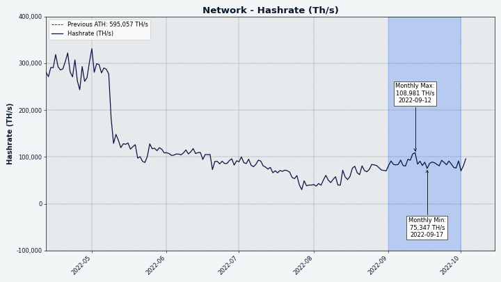

# Decred Journal – Wrzesień 2022

_Obraz: Ilustracja aut. @OfficialCryptos_

Najważniejsze wydarzenia z września:

- Dzięki wydaniu DCRDEX v0.5 otwarty handel bez powierzania kontroli nad środkami stronom trzecim stał się bardziej dostępny dzięki licznym ulepszeniom, w tym większej liczbie opcji portfela, które nie wymagają pobierania pełnego blockchaina.

- Na dex.decred.org uruchomione zostały pary handlowe LTC.

- Strona decred.org otrzymała kolejną porcję aktualizacji, w tym 4 zaktualizowane tłumaczenia.

- Liczba i pojemność węzłów Lightning Network w sieci Decred wzrasta.

Spis treści:

- [Wydanie DCRDEX v0.5](#dcrdex-v05-released)
- [Pary handlowe LTC już dostępne na dex.decred.org](#ltc-trading-enabled-at-dexdecredorg)
- [Rozwój](#development)
- [Ludzie](#people)
- [Zarządzanie](#governance)
- [Sieć](#network)
- [Ekosystem](#ecosystem)
- [Nawiązywanie kontaktów](#outreach)
- [Wydarzenia](#events)
- [Media](#media)
- [Dyskusje społeczności](#discussions)
- [Rynki](#markets)
- [Ważne kwestie i wiadomości poboczne](#relevant-external)

## Wydanie DCRDEX v0.5

DCRDEX v0.5.3 jest pierwszym [publicznie ogłoszonym](https://twitter.com/decredproject/status/1575900485864853504) wydaniem z serii v0.5. Dzięki zmianom w wersji v0.5 handel jest bardziej dostępny, stabilny i wygodny. Główne zmiany od czasu wydania wersji v0.4:

- Wbudowany lekki portfel DCR. Korzystanie z dcrwallet lub Decrediton w trybie SPV (a nie pełnego węzła) było wspierane już wcześniej, ale teraz żadne zewnętrzne oprogramowanie portfela nie jest nawet wymagane do handlu DCR. Mimo wszystko zaleca się, aby użytkownicy dalej korzystali z istniejącego oprogramowania portfela Decred, które posiada wszystkie funkcje zarządzania wyróżniające Decred w przestrzeni krypto.

- Korzystanie z portfeli Electrum do handlu BTC i LTC. Portfele Electrum mają słabą prywatność, ale są bardzo popularne i łatwe w użyciu, dzięki czemu potencjalnie więcej osób może teraz handlować na DCRDEX.

- DCRDEX działa teraz z mieszanymi konfiguracjami kont, gdy korzysta z dcrwallet lub Decreditona jako zewnętrznego portfela DCR, pozwalając na automatyczne korzystanie z funkcji prywatności Decred podczas handlu.

- Opcje swap mogą być ustawiane w czasie składania poszczególnych zamówień, a nie w ustawieniach portfela. Obejmuje to dostosowywanie UTXO (wyjść) pod kątem rozmiaru, aby uniknąć nadmiernego blokowania funduszy i określanie wyższych stawek opłat sieciowych.

- Ulepszona kontrola wysyłania/wypłacania, pozwalająca na całkowite przeczesanie portfela minus opłaty transakcyjne lub wysłanie dokładnej kwoty, jak w przypadku większości portfeli.

- Wyświetlanie kodu QR dla adresów odbiorczych portfela.

- Przyspieszenie wymiany BTC za pomocą transakcji CPFP w celu zwiększenia stawki opłaty za wymianę w przypadku gwałtownego wzrostu opłaty sieciowej. Na tę opcję nie było ostatnio szczególnego popytu, ale gwałtowne wzrosty stawek opłat Bitcoin zdarzały się już w przeszłości, więc funkcja ta gotowa jest na taki właśnie scenariusz.

- Wyświetlanie wartości w walucie fiat. Po włączeniu opcji aktualne kursy wymiany USD dla wszystkich aktywów będą używane do wyświetlania równoważnych wartości fiat w interfejsie użytkownika.

- Działą już wsparcie dla portfeli "deskryptorowych" Bitcoin. Dotyczy to tylko użytkowników oprogramowania Bitcoin Core (a nie wbudowanego portfela BTC), którzy również wybierają tworzenie tego typu portfela, który staje się domyślny w przyszłych wersjach Bitcoin Core.

- Funkcja ponownego skanowania i odzyskiwania dla wbudowanego portfela BTC SPV. Możesz także teraz przekonfigurować "urodziny" wbudowanego portfela BTC, aby zmienić zakres ponownego skanowania (skanowanie młodszych portfeli jest szybsze).

- Eksperymentalny build na platformę Windows, który uruchamia klienta DEX bez terminala oraz z ikoną w zasobniku systemowym. Powinno to być bardziej naturalne dla użytkowników Windows.

- Wsparcie dla najnowszego oprogramowania Litecoin Core (v0.21), które wprowadziło MWEB (adresy prywatne). Uwaga: do handlu używane są tylko adresy zwykłe.

- Wstępna obsługa Zcash (ZEC) przy użyciu zcashd i nieekranowanych adresów do handlu. Uwaga: Pary handlowe ZEC nie są jeszcze dostępne na dex.decred.org.

Chociaż DCRDEX jest bardziej złożony w porównaniu do tradycyjnych giełd, warto zauważyć, jak bardzo jest dostępny jako aplikacja desktopowa. Klient DEX to pojedynczy plik, który nie wymaga instalacji. Interfejs użytkownika szybko ładuje się z plików lokalnych. Dostępne są kompilacje dla Windows, macOS, Linux (x64, procesory ARM i RISC-V), a nawet FreeBSD i OpenBSD.

Sprawdź [pełne informacje o wydaniu](https://github.com/decred/dcrdex/releases), aby poznać pełną listę nowych funkcji, poprawek i instrukcji aktualizacji. W chwili pisania tego tekstu, najnowsze wydanie to v0.5.4 i zawiera ono samodzielne binarki, które mogą być używane niezależnie od portfela Decrediton. Jak zawsze, zalecamy [sprawdzenie plików](https://docs.decred.org/advanced/verifying-binaries) przed uruchomieniem.

## Pary handlowe LTC już dostępne na dex.decred.org

_Obraz: Pary LTC są już dostępne na dex.decred.org!_

Zrozumiałe jest, że niektórzy użytkownicy mogą być nieco [zagubieni](https://twitter.com/SoapboxBueller/status/1575909321136754688) w kwestii dwupoziomowego wsparcia dla aktywów na DCRDEX:

1. Nowe aktywo jest najpierw dodawane do "kodu". Nie powoduje to automatycznego dodania nowych par handlowych na oficjalnym serwerze (dex.decred.org) i ten etap nie jest widoczny dla jego użytkowników końcowych. Integracja kodu jest jednak nadal ogłaszana, ponieważ jest to ważny kamień milowy dla osób śledzących projekt, a także coś, z czym mogą eksperymentować prywatne serwery DCRDEX.

2. Po wystarczających testach i przygotowaniach nowe pary wchodzą na oficjalny serwer.

Na dzień dzisiejszy [dex.decred.org](https://dex.decred.org) obsługuje handel DCR, BTC i LTC. Operatorzy serwerów prywatnych mogą włączyć dodatkowe eksperymentalne aktywa. Obecnie obsługiwane są: BCH, DOGE, ZEC i ETH.

## Rozwój

O ile nie zaznaczono inaczej, prace zgłaszane poniżej mają status „scalonych z repozytorium głównym (master)”. Oznacza to, że prace są ukończone, zrecenzowane i zintegrowane z kodem źródłowym, który zaawansowani użytkownicy mogą [kompilować i uruchamiać](https://medium.com/@artikozel/the-decred-node-back-to-the-source-part-one-27d4576e7e1c), ale ich efekty nie są jeszcze dostępne w wersji plików binarnych dla zwykłych użytkowników.

### dcrd

_[dcrd](https://github.com/decred/dcrd) jest pełną implementacją węzła, który obsługuje sieć peer-to-peer Decred na całym świecie._

Wrzesień stał pod znakiem głównie optymalizacji i oczyszczania kodu:

- Zoptymalizowano generowanie szablonu bloku tak, aby nie pobierał [danych wejściowych dla transakcji coinbase](https://github.com/decred/dcrd/pull/2994) (takiej, która tworzy nowe monety), ponieważ nie może mieć danych wejściowych.
- [Zoptymalizowano pamięć](https://github.com/decred/dcrd/pull/2993) używaną przez kopiowanie skryptu transakcji.
- Zdeprecjonowano opcję [`--blockminsize`](https://github.com/decred/dcrd/pull/3002) w wierszu polecenia. Pozwalała ona na dodawanie do bloku niskoopłatowych lub darmowych transakcji, gdy blok był poniżej określonego minimalnego rozmiaru. Polityka pozwalająca na przekazywanie takich niskoopłatowych/darmowych transakcji została [usunięta](https://github.com/decred/dcrd/pull/2964) (i zastąpiona techniką Child Pays For Parent), więc ta opcja nie jest już potrzebna.
- Przerobiono [cache UTXO](https://github.com/decred/dcrd/pull/2995), aby poprawić jego solidność, zoptymalizować i poprawić niektóre trudne do trafienia przypadki krańcowe. Ten cache zapewnia szybki dostęp do monet w obiegu (znanych jako Unspent Transaction Outputs - UTXO) i jest niezbędny dla wydajności, ponieważ każdy blok w zasadzie wydaje istniejące monety i tworzy nowe. Ponieważ jest to kod krytyczny dla konsensusu, przeróbka została podzielona na 19 niezależnych zmian, aby ułatwić jej przegląd.
- Dodano migrację bazy danych, aby [usunąć UTXO, które nie mogą być wydane](https://github.com/decred/dcrd/pull/2996). Konkretnie, monety utworzone przez transakcję `treasurybase` (część 10% nagrody za blok, która idzie do Skarbca), które nigdy nie są bezpośrednio wydawane i dlatego nie powinny zajmować miejsca w bazie danych UTXO.
- Usunięto mempool i kod górniczy zajmujący się [polityką przekazywania niskoopłatowych i darmowych transakcji](https://github.com/decred/dcrd/pull/3003). Powiązane opcje `--blockprioritysize` i pola w odpowiedzi `getrawmempool` zostały zdeprecjonowane.
- ~6 innych PR-ów konserwacyjnych (refaktoryzacja, aktualizacja, czyszczenie).

### dcrwallet

_[dcrwallet](https://github.com/decred/dcrwallet) to serwer portfela używany przez wiersz polecenia oraz aplikacje graficzne._

- Korzystanie z [konfiguracji ustawień proxy](https://github.com/decred/dcrwallet/pull/2184) dla połączeń seedera przy korzystaniu z SPV oraz P2P.

### Decrediton

_[Decrediton](https://github.com/decred/decrediton) to w pełni funkcjonalny desktopowy portfel ze zintegrowaną funkcją głosowania, mieszania StakeShuffle, Lightning Network, handlem na DEX i nie tylko. Działa z lub bez dostępu do pełnego łańcucha (tryb SPV)._

- Zaktualizowano [moduł dcrdex](https://github.com/decred/decrediton/pull/3791) do wersji v0.5.2.
- Zaktualizowano [tłumaczenie na jęz. niemiecki](https://github.com/decred/decrediton/pull/3798).
- Ponownie użyto [punktów przerywania widoku](https://github.com/decred/decrediton/pull/3799) z biblioteki [pi-ui](https://github.com/decred/pi-ui/pull/459). Usuwa to zduplikowane definicje rozmiaru ekranu z 154 plików i czyni je spójnymi z GUI Politei.

### Politeia

_[Politeia](https://github.com/decred/politeia) to system składania propozycji w ekosystemie Decred, który służy do wnioskowania o środki ze Skarbca._

Zmiany na backendzie:

- Poprawiono kolejność [aktualizacji nanoszonych przez autora propozycji](https://github.com/decred/politeia/pull/1679).

Remake GUI na nową [architekturę wtyczek](https://github.com/decred/politeiagui/tree/master/plugins-structure#politeiagui---plugins-structure):

- 4+ usprawnienia dla [widoku mobilnego](https://github.com/decred/politeiagui/pull/2857) odnośnie komentarzy, przycisków markdown, strony propozycji itp.
- Dodano [testy jednostkowe](https://github.com/decred/politeiagui/pull/2840) dla inicjalizacji aplikacji.
- Poprawiono [błędy](https://github.com/decred/politeiagui/pull/2856) odkryte dzięki nowym testom.

Biblioteka pi-ui (współdzielona z Politeią i Decreditonem):

- Poprawiono rozmiary w [widoku mobilnym](https://github.com/decred/pi-ui/pull/462).
- Naprawiono [podwójne renderowanie](https://github.com/decred/pi-ui/pull/463) modali.

### vspd

_[vspd](https://github.com/decred/vspd) to oprogramowanie serwera dla pul udziałów (Voting Service Provider). VSP oddaje głos za swoich użytkowników 24/7 oraz nie wchodzi w posiadanie żadnych środków, a tym samym nie może ich ukraść._

- Przeniesiono kod vspd do [katalogu `cmd`](https://github.com/decred/vspd/pull/352). Jest to ostatni krok [usuwania zmiennych globalnych](https://github.com/decred/vspd/issues/339) i pozwala na budowanie wielu programów wykonywalnych z jednego repozytorium.
- Od teraz tworzenie kopii bazy danych [jest opcjonalne](https://github.com/decred/vspd/pull/353). Kopie zapasowe są wymagane tylko przez vspd, ale nie przez kod testowy lub przyszłe narzędzia (takie jak [weryfikator głosowania](https://github.com/decred/vspd/pull/335)).

### Lightning Network

_[dcrlnd](https://github.com/decred/dcrlnd) to oprogramowanie węzła Lightning Network dla Decred. LN umożliwia przesyłanie natychmiastowych i niskokosztowych transakcji._

[Daemon usługi płynności (liquidity provider)](https://github.com/decred/dcrlnlpd):

- Zmieniono [politykę zamykania kanałów](https://github.com/decred/dcrlnlpd/pull/7) z polityki absolutnej (zamknij wszystkie kanały, które nie spełniają warunków polityki) na politykę względną (opartą na punktacji aktywności dla każdego kanału). Polityka ta zaczyna działać dopiero wtedy, gdy stan portfela on-chain spadnie poniżej nowego parametru konfiguracyjnego. Zamierzonym rezultatem jest to, że kanały nie będą zamykane, chyba że dostawca płynności wymaga monet do finansowania nowych kanałów, preferując zamykanie kanałów z kombinacją niskiej aktywności w czasie jego życia. Przy obecnym stanie sieci Lightning Network projektu Decred jest to bardziej przydatna polityka ze względu na niskie wskaźniki wykorzystania.

### DCRDEX

_[DCRDEX](https://github.com/decred/dcrdex) to niepowiernicza giełda, umożliwiająca handel bez konieczności zaufania, działająca dzięki technologii atomic swaps._

Scalono w wydaniu v0.5.3:

- Dodano [awaryjne API dla uzyskania informacji o opłatach](https://github.com/decred/dcrdex/pull/1695) z zewnętrznych źródeł. W przypadku portfeli Bitcoin RPC (jak lokalny portfel Bitcoin Core) użyje on API [mempool.space](https://mempool.space/).
- Naprawiono [informację o opłatach zamiany i wykupu](https://github.com/decred/dcrdex/pull/1827) i dodano kolumny dla bazowych i kwotowych aktywów opłat do eksportu CSV.
- Naprawiono 4 [przypadki brzegowe](https://github.com/decred/dcrdex/pull/1849) z rozłączeniem podczas transakcji i nieważnymi odpowiedziami z serwera.
- Naprawiono błąd związany z [delta overflow](https://github.com/decred/dcrdex/pull/1872) dla wykresów świecowych.
- Usunięto [domyślny port](https://github.com/decred/dcrdex/commit/e9ca06d353c7aa1f66a120ac8b9b8a6cc021983e) dla Electrum.
- Zbackportowano kilka [innych poprawek](https://github.com/decred/dcrdex/pull/1850) z gałęzi `master`.

Zmiany skierowane ku użytkownikom scalone z gałęzią `master`:

- Wyświetlanie [szacowanych opłat](https://github.com/decred/dcrdex/pull/1688) przy wypłacaniu środków.
- Poprawiono powiadomienia dla [złożonych zamówień](https://github.com/decred/dcrdex/pull/1803).
- Dodano przycisk do [wyłączenia portfela](https://github.com/decred/dcrdex/pull/1804).
- Dodano wbudowany [portfel SPV dla Bitcoin Cash](https://github.com/decred/dcrdex/pull/1635). "Wbudowany" oznacza, że portfel jest w pełni zarządzany przez DEX bez konieczności pobierania/instalowania/konfigurowania zewnętrznego oprogramowania (portfela BCH), natomiast "SPV" oznacza, że działa bez pobierania blockchaina BCH. Obecnie opiera się to na [tymczasowym forku](https://github.com/buck54321/neutrino-bch) [gcash/neutrino](https://github.com/gcash/neutrino) z dodatkowymi zmianami potrzebnymi dla DCRDEX, do czasu, gdy zmiany te zostaną scalone przez projekt gcash w repozytorium projektu.
- Dodano wbudowany [portfel SPV dla Litecoin](https://github.com/decred/dcrdex/pull/1750), podobny do tego dla BCH.
- Wyświetlanie [ostatnio sparowanych zleceń](https://github.com/decred/dcrdex/pull/1663).
- Wyświetlanie [ikony w zasobniku systemowym](https://github.com/decred/dcrdex/pull/1828) w systemach Windows, macOS i Linux.
- Poprawiono nieprawidłowy [wolumen rynku](https://github.com/decred/dcrdex/pull/1837) na stronie Portfele.
- Poprawiono mylącą [kolejność kroków transakcji](https://github.com/decred/dcrdex/pull/1830) na stronie Zlecenia i dodano wyświetlanie przyszłych kroków, których należy się spodziewać.
- ~5 innych poprawek.

Wewnętrzne zmiany scalone z gałęzią `master`:

- Zastąpiono użycie metody `settxfee` solidniejszym [argumentem `fee_rate`](https://github.com/decred/dcrdex/issues/1706) do polecenia `sendtoaddress`. Tyczy się tylko ostatnich wersji Bitcoin Core i jego klonów. Portfele oparte na starszych wersjach Bitcoin Core będą nadal używać `settxfee` (BCH, DOGE, ZEC).
- Dodano narzędzie do wyszukiwania brakujących [tłumaczeń](https://github.com/decred/dcrdex/pull/1835) powiadomień. Ponadto, powiadomienia wrócą do jęz. angielskiego, jeśli zabraknie tłumaczenia danego ciągu znaków.
- Klienty nie będą już akceptować podpisów [okrojonych wiadomości](https://github.com/decred/dcrdex/pull/1526) - błąd polegający na tym, że w niektórych miejscach dane wiadomości nie były haszowane przed podpisaniem lub weryfikacją. PR wyjaśnia, dlaczego ten błąd był trudny do wykorzystania, ale też dość podstępny do naprawienia. Ta zmiana jest ostatnim krokiem 4-stopniowego planu, aby wprowadzić poprawkę z minimalnym zakłóceniem dla starszych klientów.
- ~6 innych poprawek.
- ~8 zmian dla utrzymania kodu, testowania i dokumentacji.

Wsparcie dla Ethereum:

- [Szczegółowa opieka](https://github.com/decred/dcrdex/pull/1638) nad transakcjami refundacji i wykupienia. W przeciwieństwie do projektów typu UTXO zdolność Ethereum do zastąpienia jednej transakcji inną z tym samym nonce wymaga bardziej zaangażowanego śledzenia.
- [Aktualizacja wniesionych opłat](https://github.com/decred/dcrdex/pull/1752) po wydobyciu transakcji. W przypadku aktywów opartych na Ethereum nie można z góry znać dokładnej wysokości wniesionej opłaty.

Strona [dex.decred.org](https://dex.decred.org/):

- Przerobiono tekst o tym, [jak rozpocząć korzystanie z DCRDEX](https://github.com/decred/dexweb/pull/26).
- Dodano [ładne ikony](https://github.com/decred/dexweb/pull/27) dla wszystkich 6 obsługiwanych aktywów.

DCRDEX ma na celu wspieranie handlu za pomocą lekkich portfeli, co w ogromny sposób poprawia doświadczenia użytkownika w porównaniu do konieczności pobierania pełnych blockchainów. Dla Decred wykorzystuje natywny protokół SPV, a dla Bitcoina polega na portfelu [Neutrino](https://github.com/lightninglabs/neutrino) z Lightning Labs (który sam jest oparty na btcsuite - rodzicu Decred). Forki Neutrino dla Litecoin i Bitcoin Cash nie są jednak [tak dobrze utrzymywane](https://github.com/decred/dcrdex/pull/1750#issuecomment-1201859406), więc zespół stworzył forki [neutrino-bch](https://github.com/dcrlabs/neutrino-bch) i [neutrino-ltc](https://github.com/dcrlabs/neutrino-ltc), gdzie zmiany potrzebne DCRDEX mogą być szybko scalone. W chwili pisania tego tekstu, w ich repozytoriach upstream brakuje poprawek dla LTC i BCH.

_Obraz: Szacowane opłaty przy wypłacie środkó z DCRDEX._

_Obraz: Ikonka w zasobniku systemowym wskazująca, że klient DCRDEX jest uruchomiony._

_Obraz: Ikonki dla aktywów wspieranych na dex.decred.org._

### Dokumentacja

_[dcrdocs](https://github.com/decred/dcrdocs) to repozytorium źródłowe [dokumentacji użytkownika](https://docs.decred.org/) dla Decred._

- Strony [Business Brief](https://docs.decred.org/getting-started/business-brief/) i [historia projektu](https://docs.decred.org/getting-started/project-history/) zostały [przeniesione](https://github.com/decred/dcrdocs/pull/1206) ze starej strony Decred do sekcji Jak rozpocząć w [docs.decred.org](https://docs.decred.org/).

### decred.org

_[dcrweb](https://github.com/decred/dcrweb) to źródło kodu dla strony decred.org._

Tłumaczenia:

- Infrastruktura tłumaczeń została oczyszczona i otrzymała [narzędzie GUI](https://github.com/decred/dcrweb/pull/1058) do aktualizacji tłumaczeń ([zapoczątkowane](https://github.com/decred/decrediton/pull/3569) w Decrediton), wraz z [instrukcjami](https://github.com/decred/dcrweb/pull/1073).
- Dodano/aktualizowano tłumaczenia [chińskie](https://github.com/decred/dcrweb/pull/1067), [arabskie](https://github.com/decred/dcrweb/pull/1068), [niemieckie](https://github.com/decred/dcrweb/pull/1069) i [polskie](https://github.com/decred/dcrweb/pull/1070).

[Przekierowania](https://github.com/decred/dcrweb/pull/1061) dla przeniesionych/usuniętych stron:

- Podstrony `/brief` i `/history` przekierowane są do swoich nowych lokacji na [docs.decred.org](https://docs.decred.org/).
- Podstrona `/contributors` przekierowuje do strony [członków organizacji na GitHub](https://github.com/orgs/decred/people).
- Usunięto podstrony Secure, Sustainable, oraz Adaptable, które wyświetlą komunikat o nieznalezionej stronie oraz link do strony domowej.

Pozostałe:

- Dodano [Analizę blockchainów, cz. 2](https://blockcommons.red/post/dcr-on-chain-2/) aut. @richardred do zakładki [Prasa](https://github.com/decred/dcrweb/pull/1066).
- ~2 inne poprawki.

### Pozostałe

[dcrwebapi](https://github.com/decred/dcrwebapi) (głównie używane jako lista VSP dla portfela Decrediton oraz strony decred.org):

- Dodano [wysokość bloku](https://github.com/decred/dcrwebapi/pull/167) i szacowany udział sieci w odpowiedzi VSP. W przeciwieństwie do ostatnio zaktualizowanego znacznika czasu (obecnie pokazywanego na [liście VSP](https://decred.org/vsp/)), wysokość bloku pozwala dokładniej określić, czy VSP utknął w martwym punkcie.
- Usunięto [nieużywane endpointy](https://github.com/decred/dcrwebapi/pull/170). Ten, który pozwala uzyskać podaż monet (`gcs`) został zastąpiony przez lepiej utrzymany endpoint `/supply` [dcrdata API](https://github.com/decred/dcrdata#apis), podczas gdy liczba pobrań (`dc`) była tylko bardzo zgrubnym oszacowaniem opartym na dość podstawowej heurystyce. Jeśli wiesz, że ktoś używa tych punktów końcowych, proszę zgłoś to w [issue 169](https://github.com/decred/dcrwebapi/issues/169).

Tłumaczenia oprogramowania:

- Utworzono [nową stronę statusową](https://decredcommunity.github.io/translations/status), dzięki której można śledzić stan aktualizacji tłumaczeń oprogramowania Decred, orazprzy których tłumaczeniach przydałaby się pomoc. Obecnie strona śledzi postęp w tłumaczeniu projektów Decrediton, DCRDEX oraz strony decred.org.

## Ludzie

Witamy nowych, debiutujących autorów w Decred Magazine: [Joao Paulo Sant'Anna da Silva](https://www.decredmagazine.com/author/joao/) i [Wahid Pessarlay](https://www.decredmagazine.com/author/wahid/) (który pisał również dla [Cointelegraph](https://cointelegraph.com/authors/wahid-pessarlay)).

Nowe osobiste historie i przemyślenia, którymi podzielili się członkowie społeczności Decred: [Brian Stafford](https://medium.com/authority-magazine/brian-buck-stafford-of-decred-on-the-future-of-money-and-banking-45f25305b409) (@buck54321) w Authority Magazine, [Ronnie Amato](https://www.decredmagazine.com/introducing-decred-community-member-ronnie-amato/) (@MadScrilla1) w Decred Magazine, oraz [@h3la1 i @Tivra](https://www.youtube.com/watch?v=jz6lX9TMvdY&t=1m20s) w livestreamie Community Roundtable.

> Podzielisz się z nami ulubionym cytatem - lekcją życia?
>
> Oddychaj. \[@buck54321\]

> Czy jest coś, co mogą zrobić członkowie społeczności, co pomogłoby Ci w pracy?
>
> Niech patrzą mi na ręce. Niech podważają moje założenia i moją krytykę. Grajcie adwokata diabła i kontaktujcie się w każdej sprawie, zwłaszcza, jeśli jesteście zainteresowani organizacją meetupów. Jestem otwarty w kwestii podróży i organizacji. \[@MadScrilla1\]

Statystyki społeczności na dzień 1. października (w porównaniu z 1. września):

- Obserwujący na [Twitterze](https://twitter.com/decredproject): 54019 (-732)
- Subskrybenci na [Reddit](https://www.reddit.com/r/decred/): 12637 (-10)
- Użytkownicy na [Matrixie](https://chat.decred.org/) w pokoju #general: 720 (+6)
- Użytkownicy na [Discordzie](https://discord.gg/GJ2GXfz): 1821 (+25)
- Użytkownicy na [Telegramie](https://t.me/Decred): 2891 (+7)
- Subskrybenci na [YouTube](https://www.youtube.com/decredchannel): 4650 (+10), wyświetleń: 215 726 (+1444)

## Zarządzanie

We wrześniu nowy [Skarbiec](https://dcrdata.decred.org/treasury) otrzymał 8848 DCR o wartości 241 tys. USD po średnim sierpniowym kursie wymiany $27,19. 3089 DCR zostało wydane, aby zapłacić kontrahentom, co stanowiło wartość $84K po wrześniowym kursie wymiany, lub $99K po sierpniowym kursie rozliczeniowym $31,93.

Transakcja [wypłaty ze Skarbca](https://dcrdata.decred.org/tx/c8a4d7fae86645449561a3b414ac7df0ea33b5de03e58ded345ad71c485c9c6b) została wydobyta 24 września, zawierała 28 wyjść od 1 DCR do 961 DCR. Transakcja została zatwierdzona 6856 głosami na "tak" i 0 głosami na "nie".

Na dzień 10. października, łączne saldo [starego](https://dcrdata.decred.org/address/Dcur2mcGjmENx4DhNqDctW5wJCVyT3Qeqkx) i [nowego Skarbca](https://dcrdata.decred.org/treasury) wynosi 817 745 DCR (20,9 mln USD po kursie $25,51).

We wrześniu nie opublikowano żadnych propozycji na Politei, ale już 1. października pojawiła się nowa [propozycja świadczenia usług PR](https://proposals.decred.org/record/d5221a9) aut. @lindseymmc.

Na Reddit opublikowano [pomysł propozycji](https://www.reddit.com/r/decred/comments/xd2ixd/partnership_between_fio_protocol_and_decred/) sugerujący zawarcie partnerstwa między FIO Protocol i Decred. W propozycji nie pada prośba o finansowanie, ale zamiast tego autor oferuje zapłacić grant integracyjny temu, kto wykona prace integracyjne, aby zintegrować FIO w ramach oprogramowania Decred. FIO jest inicjatywą Interwallet Operability z własnym tokenem.

W sierpniu dodano [aktualizację](https://proposals.decred.org/record/4475472) propozycji Politeia (niestety przegapionej w tym miesiącu) ogłaszającą, że strona została zaktualizowana do wersji v1.4.0, z większością pracy przeznaczonej na import starszych propozycji z backendu Git do Trillian, wraz z kilkoma nowymi funkcjami, takimi jak umożliwienie edycji komentarzy w ciągu 5 minut od ich umieszczenia.

## Sieć

**Hashrate**: wrześniowy [hashrate](https://dcrdata.decred.org/charts?chart=hashrate&zoom=l796eq4a-l8vp7dzk&scale=linear&bin=day&axis=time) na początku miesiąca wyniósł ~82 Ph/s, a zamknął go na poziomie ~91 Ph/s, zaliczając niż w ok. 75 Ph/s oraz szczyt w wys. 109 Ph/s w ciągu miesiąca.

_Obraz: Moc obliczeniowa projektu Decred._

Dystrybucja mocy obliczeniowej w wys. 71 Ph/s [zadeklarowana](https://miningpoolstats.stream/decred) przez pule wydobywcze na dzień 1. października: F2Pool 54%, Poolin 36%, BTC.com 6%, AntPool 3,6%, CoinMine 0,7%, nieznane 0,3%.

Podział 1000 bloków [wydobytych](https://miningpoolstats.stream/decred) przed 1. października: F2Pool 49%, Poolin 44%, BTC.com 4%, (prawdopodobnie) AntPool 3%, CoinMine 0,3%.

_Obraz: Dystrybucja mocy obliczeniowej pul wydobywczych._

**Staking**: [Cena biletów](https://dcrdata.decred.org/charts?chart=ticket-price&zoom=l796eq4a-l8vp7dzk&axis=time&visibility=true-true&mode=stepped) wahała się między 221 a 239 DCR, a jej 30-dniowa [średnia](https://dcrstats.com/) wyniosła 229,1 DCR (-1,1).

[Zablokowana suma](https://dcrdata.decred.org/charts?chart=ticket-pool-value&zoom=l796eq4a-l8vp7dzk&scale=linear&bin=day&axis=time) to pomiędzy 9,28 a 9,43 miliona DCR, co oznacza, że 64,1-64,9% podaży dostępnej w obiegu [wzięło udział](https://dcrdata.decred.org/charts?chart=stake-participation&zoom=l796eq4a-l8vp7dzk&scale=linear&bin=day&axis=time) w elemencie Proof of Stake.

**VSP**: Na 1. października, ~7820 (+770) biletów w puli zarządzanych było przez [18 oficjalnych VSP](https://decred.org/vsp/) serwery vspd. Łącznie VSP miały pod sobą 19,1% całej puli biletów (+1,8%).

We wrześniu największy wzrosty odnotowały vspd.bass.cf (+726) oraz vspd.stakey.com (+443). Nadmienić należy, że ten drugi zmagał się z [problemami z API](https://github.com/decred/dcrwebapi/pull/171) od 20 września i raportowany przez niego stan biletów nie był aktualny.

_Obraz: Dystrybucja biletów zarządzanych przez VSP._

_Obraz: Dystrybucja biletów solo vs zarządzanych przez VSP._

_Obraz: Miesięczne zestawienie przegapionych biletów od r. 2016._

**Węzły**: Wersje węzłów wyłapane przez [Decred Mapper](https://nodes.jholdstock.uk/user_agents) na 1. października (ogółem 118, tylko dcrd): v1.7.1 - 38%, v1.7.2 - 29%, v1.7.4 - 14%, v1.7.0 - 10%, pozostałe - 9%.

Ważne: wydanie [dcrd v1.7.4](https://github.com/decred/dcrd/releases/tag/release-v1.7.4) było jedynie wydaniem kodu źródłowego dla deweloperów, którego celem było naprawienie [unieruchomionej sieci testnet](202208.md#dcrd).

_Obraz: Dystrybucja wersji dcrd._

Ilość [monet mieszanych](https://dcrdata.decred.org/charts?chart=coin-supply&zoom=jz3q237o-la8vk000&scale=linear&bin=day&axis=time&visibility=true-true-true) wahała się w granicach 60,8-60,9%. Dzienna [kwota mieszana](https://dcrdata.decred.org/charts?chart=privacy-participation&bin=day&axis=time) oscylowała w granicach 290-493K DCR.

Na dzień 1. października sieć [Lightning Network](https://ln-map.jholdstock.uk/) projektu Decred odnotowała 70 węzłów (+28), 105 kanałów (+37) oraz całkowitą pojemność 42,5 DCR (+7,1).

Dziękujemy @bochinchero za urozmaicanie lektury Decred Journal swoimi wykresami. Wykresy, które prezentujemy na łamach tej publikacji oraz wiele innych znajdziecie w repozytorium [dcrsnapshots](https://github.com/bochinchero/dcrsnapshots).

## Ekosystem

Giełda KuCoin została [usunięta](https://github.com/decred/dcrweb/pull/1064) z [listy giełd](https://decred.org/exchanges/) po doniesieniu, że nie akceptuje depozytów DCR. Dwa tygodnie później [ogłosili](https://www.kucoin.com/news/en-kucoin-opens-mainnet-dcr-tokens-deposit-and-withdrawal-services-20220924), że depozyty i wypłaty DCR zostały ponownie uruchomione.

Huobi ogłosiło, że usunie z listy obsługiwanych projektów [7 monet prywatności, w tym DCR](https://www.huobi.com/support/en-us/detail/104917015223952), aby "chronić aktywa naszych użytkowników", i zostało [usunięte](https://github.com/decred/dcrweb/pull/1081) również z listy giełd i kantorów.

Cryptohunt dodało [stronę dla Decred](https://www.cryptohunt.it/projects/decred). Serwis ma na celu uczynienie kryptowalut [bardziej dostępnymi](https://medium.com/@cryptohunt/about-cryptohunt-9668aa77412f) dla nowicjuszy poprzez zapewnienie prostych stron informacyjnych dla popularnych projektów kryptowalutowych.

Uwaga: autorzy Decred Journal nie są w stanie ocenić wiarygodności żadnego z powyższych podmiotów czy ich usług. Uprasza się o dołożenie należnych starań i własnoręczną weryfikację informacji przed powierzeniem jakichkolwiek środków innym stronom.

Dołączcie do naszego kanału [#ecosystem](https://chat.decred.org/#/room/#ecosystem:decred.org), aby śledzić wszelkie nowości związane z ekosystemem Decred.

## Nawiązywanie kontaktów

Osiągnięcia Monde PR:

- Zaproponowano informację o nowościach w projekcie.
- Zdobyto 1 wywiad w mediach.
- Odpowiedziano na 3 prośby o komentarz.

Umieszczono w mediach poniższe artykuły:

- @buck54321 pojawił się w serii Authority Magazine na temat [przyszłości pieniędzy i bankowości](https://medium.com/authority-magazine/brian-buck-stafford-of-decred-on-the-future-of-money-and-banking-45f25305b409). Artykuł zawiera głęboką analizę DCRDEX i korzyści płynących z P2P, a także odniesienia dotyczące Lightning Network, znaczenia samodzielnego przechowywania środków i decentralizacji.
- @jz został zacytowany w [Axios](https://www.axios.com/2022/09/15/privacy-coins-test-crypto-exchanges-comfort-with-compliance), odnośnie tego, w jaki sposób przyszłość kryptowalut obejmuje silne gwarancje prywatności, w odpowiedzi na wycofanie DCR przez Huobi Global i sześciu innych monet prywatności.

## Eventy

**Na których byliśmy:**

Paul Rosenberg wspomniał o Decred na Hackers Congress Paralelni Polis (Praga, Czechy). Było to małe wystąpienie na [jednym slajdzie](https://twitter.com/cryptotnetennba/status/1575969203835715584), ale z ważną ideą:

> BTC, BCH, Decred, Scrit, cokolwiek.. **Używajcie** tego.  
> Zacznijcie publikować ceny w satach; niech ludzie nauczą się przeliczania na nie.
> Jeśli chcecie, zorganizujcie pośredników.
> Niech okres przejściowy potrwa nawet i rok, ale musimy zacząć używać naszych pieniędzy.

## Media

Statystyki aktywności [Decred Magazine](https://www.decredmagazine.com/) za wrzesień:

- Całkowita liczba artykułów na DM: 318
- Subskrybentów newslettera: 66
- Opublikowane nowe posty i newslettery: 13
- Aktywne kampanie w mediach społecznościowych: 12
- Posty w mediach społecznościowych: 151
- Polubienia: 662
- Retweety: 114
- Liczba obserwujących na wszystkich kontach i platformach mediów społecznościowych: 973

Gorąco zachęcamy użytkowników Twittera do wspierania [@Decredmagazine](https://twitter.com/decredmagazine) przez obserwowanie, polubienia, oraz retweety, aby pomóc w zdobywaniu zasięgów.

DM wpada również na Instagrama - śledżcie [@decredmagazine](https://www.instagram.com/decredmagazine/).

**Wybrane artykuły:**

- [Stablecoiny na Decred](https://www.decredmagazine.com/stablecoins-on-decred/), aut. Anon - artykuł koncepcyjny z forum z roku 2018, recyrkulowany na DM
- [Brian 'Buck' Stafford z projektu Decred na temat przyszłości pieniądza i bankowości](https://medium.com/authority-magazine/brian-buck-stafford-of-decred-on-the-future-of-money-and-banking-45f25305b409), aut. Jason Hartman dla Authority Magazine
- [Światełko na końcu tunelu](https://www.decredmagazine.com/decred-light-at-the-end-of-the-tunnel/) - analiza techniczna DCR aut. @Applesaucesome
- [Monde PR Sierpień 2022](https://www.decredmagazine.com/mondepr-august-2022/), aut. @phoenixgreen
- [Przedstawiamy członka społeczności Decred Ronnie Amato](https://www.decredmagazine.com/introducing-decred-community-member-ronnie-amato/), aut. @phoenixgreen
- [Ten, w którym wszystko wygląda źle, ale wrzucam dawkę hopium](https://www.decredmagazine.com/the-one-where-i-post-lots-of-hopium/) - analiza techniczna DCR aut. @Applesaucesome
- [Rio de Janeiro zamierza zostać stolicą krypto](https://www.decredmagazine.com/rio-de-janeiro-aims-to-be-a-crypto-capital/), aut. @João
- [Decred wypuszcza DCRDEX v0.5 czyniąc bezpieczną wymianę za pomocą narzędzi atomic swaps jeszcze bardziej dostępną](https://decred.org/news/2022-09-28_decred_releases_dcrdex_0.5/) - ogłoszenie prasowe na decred.org
- [Decred forsuje bardzo wygodną wymianę środków przez atomic swapy P2P dzięki DCRDEX v0.5](https://www.decredmagazine.com/decred-pushes-for-highly-convenient-p2p-atomic-swaps-with-dcrdex-v0-5/), aut. Wahid Pessarlay

**Wideo:**

- [Okrągły Stół społeczności Decred - DAO, zarządzanie, marketing, DEX & więcej](https://www.youtube.com/watch?v=jz6lX9TMvdY), aut. @Exitus i @phoenixgreen, z uczestnictwem @WasPraxis, @h3la1 i @MadScrilla1
- [Miesięczne podsumowanie Decred - nowa strona, aktualizacje deweloperskie, Politeia 1.4.0, artykuły, wywiady i więcej!](https://www.youtube.com/watch?v=7IPj3rWmNY8), aut. @Exitus
- [Fundamenty Decred - strona rynków na DCRDATA](https://www.youtube.com/watch?v=6YW9JiMT2w8), aut. @phoenixgreen - również jako [post](https://www.decredmagazine.com/dcrdata-making-markets-decred-fundamentals/)
- [DCRDEX dodaje Litecoin na zdecentralizowaną giełdę](https://twitter.com/karamblez/status/1573453810005348353) - animacja aut. @karamble
- [Dlaczego Decred ma swoją własną giełdę? - seria o DCRDEX](https://www.youtube.com/watch?v=7mx3TCPS5rU), aut. @phoenixgreen - również jako [post](https://www.decredmagazine.com/why-does-decred-have-its-own-exchange/)

**Coś dla oka i serca:**

- @fjsixfjdksfi skomponował [drugi utwór](https://soundcloud.com/openbeats/ob2) (+ [jego zapętloną wersję](https://soundcloud.com/openbeats/ob2_looped)) z serii Open Beats, dostępny za darmo do wykorzystania w treściach związanych z Decred (przegapione w czerwcu)
- [Decred - pancerna jaszczurka](https://www.decredmagazine.com/decred-the-armoured-lizard/), aut. @OfficialCryptos
- @richardred stworzył najbardziej zrozumiałe [1-minutowe wideo o tym, jak działa DCRDEX](https://www.youtube.com/watch?v=_0kInW0_QuA) wykorzystując do tego DEX Flow aut. @GhostWridah - również na [Twitterze](https://twitter.com/RichardRed0x/status/1576014662537138176)

**Tłumaczenia:**

- Wydania lipiec - sierpień 2022 Decred Journal doczekały się 4 nowych [tłumaczeń](https://xaur.github.io/decred-news/). Dziękujemy @arij (jęz. arabski), @Dominic (jęz. chiński), oraz @kozel (jęz. polski)!

**Treści nieanglojęzyczne:**

- [Coin des tages: Decred (DCR)](https://www.youtube.com/shorts/6PfekNUZq_k), aut. KryptoZenny ("Moneta dnia: Decred (DCR)")
- [Decred Deepdive: Was steckt hinter der crypto?](https://www.youtube.com/watch?v=SssaKluRSJI) aut. TaiikN Crypto ("Głęboka analiza Decred: Co się kryje za kulisami?")

## Dyskusje społeczności

Pięciu członków społeczności omawiało zarządzanie, marketing, DEX, oraz inne tematy podczas nowego [odcinka Okrągłego Stołu](https://www.youtube.com/watch?v=jz6lX9TMvdY) społeczności Decred na kanale YouTube projektu.

Wybrane posty z Reddita:

- [Partnerstwo między protokołem FIO a Decred](https://www.reddit.com/r/decred/comments/xd2ixd/partnership_between_fio_protocol_and_decred/) - propozycja została repostowana, bo nie spełniała kryteriów Politei, czyli posiadania zespołu, który wykona pracę. @sirashtvm odpowiedział na pytania, jak działa protokół FIO na Reddicie, a także [na Matrixie](https://matrix.to/#/!qYpAAClAYrHaUIGkLs:decred.org/$MhR2C154GfT_UzqZVAzmHPe3TrGl_OJp7diBmlS2JcU).
- [Notowanie Decred na giełdzie Phemex](https://www.reddit.com/r/decred/comments/xqeqg8/listing_of_decred_token_on_phemex_exchange/) - kolejny pomysł partnerski @sirashtvm, gdzie DCR zostałby notowany na singapurskiej giełdzie Phemex, również omawiany [na Matrixie](https://matrix. to/#/!qYpAAClAYrHaUIGkLs:decred.org/$BPzC-9nhy3gfgCNNXTXw8QTfV31DVrLVdERfGYqHPTk?via=decred.org&via=matrix.org&via=planetdecred.org). Głównym punktem spornym była "opłata marketingowa" w wysokości $30K wymagana przez Phemex w celu sfinansowania konkursów tradingowych ($20K) oraz "kampanii influencerskiej + AMA" ($10K). Pomysł [ugrzązł](https://www.reddit.com/r/decred/comments/xqeqg8/listing_of_decred_token_on_phemex_exchange/ir0m9nz/) w momencie, gdy okazało się, że przedstawiciel Phemex nie jest zainteresowany dalszą dyskusją.
- [Cotygodniowy wkład - wydanie specjalne](https://www.reddit.com/r/decred/comments/xsacjg/weekly_contributions_special_edition_bounty_pool/) - pula nagród wzrosła do 4 DCR, a @fjsixfjdksfi kontynuuje iterację nad formatem i zasadami. Ta edycja skupiała się na (ale nie tylko) promowaniu nowych par Litecoin na DCRDEX.

Wybrane dyskusje z Twittera:

- [DCRDEX v0.5.3 has landed with Litecoin support](https://twitter.com/decredproject/status/1575900485864853504)

## Rynki

We wrześniu kurs wymiany DCR mieścił się w przedziale USD 23,30-34,70 / BTC 0,00124-0,00175. Średni dzienny kurs wynosił $27,19.

*Poniższy fragment nie jest poradą finansową:*

Nowe analizy rynku aut. @Applesaucesome: [Światełko na końcu tunelu](https://www.decredmagazine.com/decred-light-at-the-end-of-the-tunnel/) oraz [Ten, w którym wszystko wygląda źle, ale wrzucam dawkę hopium](https://www.decredmagazine.com/the-one-where-i-post-lots-of-hopium/)(https://www.decredmagazine.com/the-one-where-i-post-lots-of-hopium/).

> Nie będę owijał w bawełnę, ale wszystko wygląda naprawdę źle. Akcje, krypto, no wszystko. Cały pęd z paru zeszłych tygodni wrócił do punktu wyjścia. Ale, jak dobrze wiemy, to właśnie tutaj słabe ręce opuszczają pokład...albo czeka nas kapitulacja po raz Nty. 🙃 \[2022-09-25\]

_Obraz: "Parę DCR-BTC bardzo ciekawie się ogląda, gdy patrzy się na nią w szerokim horyzoncie czasowym." - @Applesaucesome_

Na YouTube można natknąć się na analizę techniczną DCR autorstwa [More Crypto Online](https://www.youtube.com/watch?v=oP1-Ie5jFzo) ("to jeden z najlepszych wykresów altcoinów na rynku, ale gwarancji sukcesu nie ma"), [Jacob Crypto Bury](https://www.youtube.com/watch?v=FopCO-7UiaA), oraz [Schulz & Team Analytik](https://www.youtube.com/watch?v=begoqsTKdOI&t=586s) (w jęz. niemieckim).

_Obraz: Miesięczny wolumen DCRDEX, w USD._

## Ważne kwestie i wiadomości poboczne

OFAC [wyjaśniło](https://home.treasury.gov/taxonomy/term/1546) jak mają działać sankcje wobec adresów Tornado Cash. Osoby, które otrzymały nieproszone nominalne kwoty od Tornado Cash (ktoś trollował), technicznie naruszają sankcje, ale mogą wypełnić formularz zablokowanej własności, aby uniknąć ścigania.

Coinbase [ściga](https://blockworks.co/coinbase-users-across-georgia-milk-price-bug-for-100x-profit/) Gruzinów, którzy wykorzystali błąd, przez który gruzińskie Lari było błędnie wycenione przez 7 godzin i traderów otrzymujących 100 razy więcej Lari za swoje kryptowaluty. Coinbase skontaktowało się z ich bankami i kazało zablokować ich konta w oczekiwaniu na odzyskanie wycofanych środków.

Ethereum [zakończyło](https://www.coindesk.com/tech/2022/09/15/the-ethereum-merge-is-done-did-it-work/) "scalenie", aby przejść z konsensusu PoW na PoS, zmniejszając swoje zużycie energii o [szacunkowo](https://blog.ethereum.org/2021/05/18/country-power-no-more) 99,95% i zmniejszając przy tym wskaźnik emisji nowych ETH.

Commodity Futures Trading Commission (CFTC) złożyła [skargę](https://www.cftc.gov/PressRoom/PressReleases/8590-22) przeciwko Ooki DAO za naruszenie ustawy o handlu towarami. Kara w wysokości 250 000 USD została nałożona na bZeroX LLC, która próbowała obejść egzekwowanie przepisów poprzez decentralizację kontroli nad protokołem do Ooki DAO. Teraz CFTC wskazała, że przyjdzie po każdego, kto jest zaangażowany w Ooki DAO, które opisuje jako "Unincorporated Association". [Wydaje się](https://www.coindesk.com/policy/2022/10/11/fear-may-be-keeping-crypto-group-ooki-dao-from-mounting-defense-against-cftc/), że posiadacze tokenów Ooki DAO obawiają się głosować nad propozycjami dotyczącymi sposobu odpowiedzi, aby nie otworzyć się na więcej indywidualnych kłopotów poprzez głosowanie, i istnieje niebezpieczeństwo, że mogą przegrać domyślnie, jeśli DAO nie odpowie do 14 października.

Fuzja pomiędzy dwoma społecznościami DeFi (FEI i RARI) jest [rozwiązywana](https://www.coindesk.com/layer2/2022/09/20/lessons-from-a-defi-dao-divorce/) po zajadłym rozłamie dotyczącym sposobu rekompensaty dla ofiar Fuse, produktu DeFi będącego ich wspólnym przedsięwzięciem, który został zhakowany na 80 milionów dolarów. W następstwie włamania zatwierdzono wstępną propozycję zarządzania, aby w pełni zrekompensować wszystkie ofiary, ale kierownictwo FEI (które posiadało fundusze, aby to zrobić) zdecydowało, że nie jest to właściwa propozycja i nie zastosowało się do niej. Potrzeba było 4 propozycji, aby osiągnąć rozwiązanie, na które wszystkie strony mogły się zgodzić, i obejmowało ono rozwiązanie partnerstwa między projektami i danie posiadaczom tokenów sposobu na opuszczenie pozycji.

To wszystko na wrzesień. Podzielcie się swoimi aktualizacjami do następnego numeru na naszym kanale [#journal](https://chat.decred.org/#/room/#journal:decred.org).

## O tym wydaniu

To 51. wydanie Decred Journal. Spis wszystkich wydań, mirrorów i tłumaczeń dostępny jest [tutaj](https://xaur.github.io/decred-news/).

Większość informacji od stron trzecich jest przekazywana bezpośrednio ze źródła po minimalnym sprawdzeniu poprawności. Autorzy Decred Journal nie mają możliwości zweryfikowania wszystkich publikowanych stwierdzeń. Proszę uważać na oszustwa i przeprowadzać własny research.

Zasługi (kolejność alfabetyczna):

- redakcja treści: bee, bochinchero, Exitus, jz, l1ndseymm, phoenixgreen, richardred
- recenzje i komentarze: davecgh, jholdstock, karamble
- ilustracja tytułowa: OfficialCryptos
- finansowanie: interesariusze Decred
