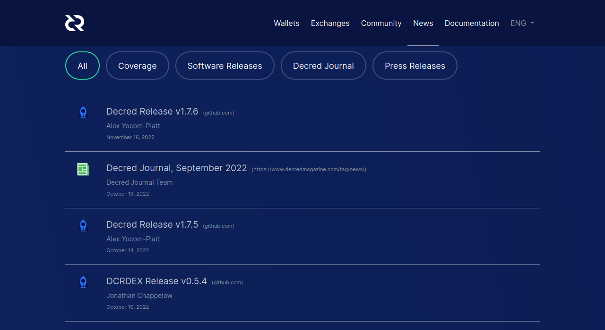

# Decred Journal – Październik 2022

_Obraz: Niezatytułowany, aut. @Exitus_

Najważniejsze wydarzenia z października:

- Wydano wersję v1.7.5 głównego oprogramowania oraz łatkę v0.5.4 dla DCRDEX.
- Usługa znakowania czasowego Decred (timestamp.decred.org) została wykorzystana do oznakowania dokumentów kampanii politycznych na kandydatów na prezydenta w wyborach w Brazylii.
- Strona decred.org otrzymała kolejne aktualizacje oraz stronę Wiadomości, gdzie znajdziecie najnowsze wydania Dziennika.
- Firma Monde PR świadczyć będzie usługi w zakresie PR dla Decred przez kolejny rok po udanym głosowaniu nad ich propozycją, która została zaakceptowana przy 66% poparciu.

Spis treści:

- [Wydano wersję v1.7.5 głównego oprogramowania](#core-software-v175-released)
- [Rozwój](#development)
- [Ludzie](#people)
- [Zarządzanie](#governance)
- [Sieć](#network)
- [Ekosystem](#ecosystem)
- [Nawiązywanie kontaktów](#outreach)
- [Media](#media)
- [Dyskusje społeczności](#discussions)
- [Rynki](#markets)
- [Ważne kwestie i wiadomości poboczne](#relevant-external)

## Wydano wersję v1.7.5 głównego oprogramowania

Najważniejsze elementy [wydania v1.7.5](https://twitter.com/decredproject/status/1581003123287461888):

- **dcrd** otrzymało aktualizacje pamięci podręcznej UTXO, aby poprawić jej solidność, zoptymalizować ją i poprawić niektóre trudne do trafienia przypadki krańcowe, które obejmują mieszankę ręcznego unieważniania bloków, warunkowego oczyszczania i następujących po sobie niepoprawnych zamknięć.

- **dcrwallet** uzyskał metodę importowania kluczy publicznych do portfeli tylko do obserwacji oraz metody gRPC do wydawania poleceń VSP, jak powinny głosować nad wydatkami ze Skarbca. Poprawki obejmują: `signrawtransaction` respektuje teraz przekazane mu klucze prywatne, auto ticket buyer nie próbuje już mieszać reszt z transakcji, jeśli serwer jest nieznany, a lista węzłów odkrytych z seederów nie jest już ograniczona do przestarzałej wersji SPV. Wreszcie, to wydanie wymusza hardfork na testnet3, aby zapobiec zatrzymaniu sieci testowej przez jednostki ASIC.

- **Decrediton** został głównie zaktualizowany z powodu krytycznej poprawki zawartej w DCRDEX v0.5.4. Inne zmiany obejmują poprawkę niekończącego się przycisku ładowania w zakładce wydatków ze Skarbca.

Zapraszamy na stronę [GitHub wydania](https://github.com/decred/decred-binaries/releases), aby zobaczyć pełną listę zmian i pliki do pobrania. Jak zawsze, zalecamy [weryfikację plików](https://docs.decred.org/advanced/verifying-binaries) przed uruchomieniem.

Użytkownicy samodzielnej aplikacji **DCRDEX** powinni zaktualizować ją do najnowszej wersji [dostępnej tutaj](https://github.com/decred/dcrdex/releases), w szczególności, aby uniknąć problemów z niektórymi transakcjami Taproot na Bitcoinie, które zostały naprawione w wersjach v0.5.4 i v0.5.5.

## Rozwój

O ile nie zaznaczono inaczej, prace zgłaszane poniżej mają status „scalonych z repozytorium głównym (master)”. Oznacza to, że prace są ukończone, zrecenzowane i zintegrowane z kodem źródłowym, który zaawansowani użytkownicy mogą [kompilować i uruchamiać](https://medium.com/@artikozel/the-decred-node-back-to-the-source-part-one-27d4576e7e1c), ale ich efekty nie są jeszcze dostępne w wersji plików binarnych dla zwykłych użytkowników.

### dcrd

_[dcrd](https://github.com/decred/dcrd) jest pełną implementacją węzła, który obsługuje sieć peer-to-peer Decred na całym świecie._

- Wykorzystanie [kontekstu serwera](https://github.com/decred/dcrd/pull/3011) podczas łączenia się z peerami, aby uczynić zamykanie bardziej responsywnym.
- Wykorzystanie [kontekstu w testach RPC](https://github.com/decred/dcrd/pull/3012). Pozwala to na dwie rzeczy: testowanie, czy anulowanie i zamykanie działa poprawnie, oraz możliwość przerwania testu, jeśli to konieczne.
- Upewnienie się, że adres peera jest [dodany do menedżera adresów](https://github.com/decred/dcrd/pull/3013). Pomaga to przyspieszyć odkrywanie nowych węzłów w sieci poprzez upewnienie się, że są one dodawane do listy adresów, które muszą być wypróbowane w celu zbudowania reputacji, gdy nie były wcześniej widziane.

### dcrwallet

_[dcrwallet](https://github.com/decred/dcrwallet) to serwer portfela używany przez wiersz polecenia oraz aplikacje graficzne._

- Wiele poprawek [kontekstów użytkowania](https://github.com/decred/dcrwallet/pull/2188). "Konteksty" są używane do sygnalizowania różnym usługom działającym równolegle, że muszą się zatrzymać jako część poprawnego procesu zamykania portfela.

### Decrediton

_[Decrediton](https://github.com/decred/decrediton) to w pełni funkcjonalny desktopowy portfel ze zintegrowaną funkcją głosowania, mieszania StakeShuffle, Lightning Network, handlem na DEX i nie tylko. Działa z lub bez dostępu do pełnego łańcucha (tryb SPV)._

- Zaktualizowano moduł DCRDEX [do v0.5.3](https://github.com/decred/decrediton/pull/3812), a następnie [do v0.5.4](https://github.com/decred/decrediton/pull/3816). Ten ostatni zawiera krytyczną poprawkę do parsowania bloków Bitcoin.
- Zaktualizowano [angielskie ciągi znaków do tłumaczenia](https://github.com/decred/decrediton/pull/3807). Baza kodów jest okresowo skanowana pod kątem tekstu wyświetlanego na UI, a tekst ten jest zbierany w [specjalnym pliku](https://github.com/decred/decrediton/blob/master/app/i18n/translations/original.json), który może być tłumaczony za pomocą internetowego narzędzia asystenta. Innymi słowy, oryginały są świeże i teraz jest dobry czas na [tłumaczenie](https://decredcommunity.github.io/translations/status#decrediton).

### Politeia

_[Politeia](https://github.com/decred/politeia) to system składania propozycji w ekosystemie Decred, który służy do wnioskowania o środki ze Skarbca._

Aplikacja wiersza polecenia `politeiavoter`:

- Skonsolidowano [logikę głosowania](https://github.com/decred/politeia/pull/1682) poprzez wpierw utworzenie niepodpisanych głosów, po czym pozyskanie podpisów z portfela. To podejście jest prostsze i mniej podatne na błędy.

Remake GUI na nową [architekturę wtyczek](https://github.com/decred/politeiagui/tree/master/plugins-structure#politeiagui---plugins-structure):

- Zaimplementowano [wyszukiwanie głosów](https://github.com/decred/politeiagui/pull/2863) dla propozycji.
- Zaimplementowano [aktualizacje propozycji przez autorów](https://github.com/decred/politeiagui/pull/2860), podglądy komentarzy, na które udzielono odpowiedzi w trybie płaskim oraz linki do pojedynczych komentarzy.
- Zaimplementowano [pobieranie głosów dla propozycji](https://github.com/decred/politeiagui/pull/2865).
- Poprawiono [podział kodu i pamięc podręczną](https://github.com/decred/politeiagui/pull/2868) oraz zmniejszono rozmiar wiązki aplikacji z 1.5 MB do 0.7 MB (rozmiar nieskompresowany).
- Poprawki i refaktoryzacja.

Biblioteka pi-ui (współdzielona z Politeią i Decreditonem):

- [Zoptymalizowano budowanie](https://github.com/decred/pi-ui/pull/466) i włączono kompresję, zmniejszając rozmiar wiązki z 740 KB do 430 KB.
- Poprawki dotyczące zależności i testowania.

### Lightning Network

_[dcrlnd](https://github.com/decred/dcrlnd) to oprogramowanie węzła Lightning Network dla Decred. LN umożliwia przesyłanie natychmiastowych i niskokosztowych transakcji._

- Znacznik czasowy [ostatniej otrzymanej wiadomości gossip](https://github.com/decred/dcrlnd/pull/165) jest teraz utrzymywany. Po ponownym uruchomieniu jest on wysyłany do zdalnego peera, aby zażądać wiadomości wysłanych od tego znacznika czasu. Pozwala to węzłom które były offline przez jakiś czas na pobranie nieodebranych wiadomości gossip (w szczególności `ChannelUpdates`), aby poprawnie zaktualizować ich lokalny widok sieci. Przed tą zmianą węzeł, który pozostawał offline wystarczająco długo mógł przegapić wiele `ChannelUpdate`'ów' i błędnie oznaczyć istniejące kanały jako zombie w bazie danych.
- [Utrzymanie](https://github.com/decred/dcrlnd/pull/165): zaktualizowano minimalną wersję Go do 1.18, zaktualizowano do nowego formatowania, wprowadzono poprawki zależności.

### DCRDEX

_[DCRDEX](https://github.com/decred/dcrdex) to niepowiernicza giełda, umożliwiająca handel bez konieczności zaufania, działająca dzięki technologii atomic swaps._

[Wydanie v0.5.4](https://github.com/decred/dcrdex/releases/tag/v0.5.4):

- Zaktualizowano repozytorium upstream btcd, aby naprawić krytyczny [błąd parsowania bloków](https://github.com/decred/dcrdex/pull/1897) Bitcoin. Istnieją obecnie bloki na mainnecie i testnecie sieci Bitcoin, które zawierają większe transakcje Taproot, które nie mogą być deserializowane przez btcd v0.23.1 i starsze wersje. Problem dotyczy takerów, którzy używają portfeli typu full node (RPC) lub SPV.

Zmiany skierowane ku użytkownikom scalone z gałęzią `master`:

- Dynamiczne pokazywanie nowych sparowań [bez konieczności przeładowywania](https://github.com/decred/dcrdex/pull/1864) strony zleceń.
- Przebudowano [stronę Rynki](https://github.com/decred/dcrdex/pull/1825), która od teraz jest responsywna w układach strony dla komputerów stacjonarnych, tabletów i urządzeń mobilnych.
- Odrzucanie [nieprawidłowych adresów](https://github.com/decred/dcrdex/pull/1840) w formularzu Wyślij. Poprawiono również obsługę sytuacji, gdy szacowanie opłat jest nieobsługiwane lub nie powiodło się, tak, aby wysyłanie było możliwe nawet bez szacowania opłat.
- Obsługa [niestandardowej ścieżki portfela](https://github.com/decred/dcrdex/pull/1870) dla portfeli Electrum, oraz wsparcie również dla niezabezpieczonych portfeli Electrum (tych bez hasła).
- Wyświetlanie błędu, jeśli użytkownik próbuje się wylogować, gdy ma [aktywne zlecenia](https://github.com/decred/dcrdex/pull/1904).
- Dodano [formularz](https://github.com/decred/dcrdex/pull/1916) do usuwania zarchiwizowanych rekordów (zleceń i sparowań) z klienta oraz opcję eksportu usuniętych rekordów jako pliki CSV.
- Zaktualizowano [tłumaczenie na język chiński](https://github.com/decred/dcrdex/pull/1871).
- Naprawiono przycisk [Przyspiesz zlecenie](https://github.com/decred/dcrdex/pull/1847), który nie chował się po wydobyciu transakcji wymiany.
- Naprawiono wiele błędów w interfejsie użytkownika na stronie [Rynki](https://github.com/decred/dcrdex/pull/1890).
- Naprawiono przypadek, w którym klienty mogły pozostać nieświadome, że ich [zlecenia zostały wycofane](https://github.com/decred/dcrdex/pull/1865) z powodu nadchodzącego zawieszenia rynku.
- ~2 inne poprawki błędów.

Zmiany wewnętrzne i deweloperskie:

- Liczne poprawki stabilności testów, systemu lokalizacji oraz dokumentacji.
- Wygaszanie [przeterminowanych zapytań](https://github.com/decred/dcrdex/pull/1915), kiedy połączenie WebSocket jest zamykane, aby uniknąć zawieszania się przy zamykaniu.
- Poprawiono odzyskiwanie dla [niepodłączonych portfeli](https://github.com/decred/dcrdex/pull/1891) i dodano wsparcie dla odzyskiwania wyłączonych portfeli.
- Poprawiono obliczanie [zablokowanego salda](https://github.com/decred/dcrdex/pull/1918) dla ZEC. Wymagało to wdrożenia obejścia dla portfela nieodblokowującego automatycznie wydanych monet. Obecnie DOGE i ZEC wymagają tego obejścia.
- Poprawiono i ulepszono [testy na simnecie](https://github.com/decred/dcrdex/pull/1909). Większość testów będzie wykonywana dwa razy, na przemian jako taker i maker pomiędzy klientami. Pomogło to w odkryciu kilku błędów.
- Poprawiono parsowanie szablonu HTML dla kluczy [zawierających myślnik](https://github.com/decred/dcrdex/pull/1923) (witamy w DCRDEX, [@norwnd](https://github.com/decred/dcrdex/commits?author=norwnd)!).
- ~2 inne poprawki błędów.

Wsparcie dla Ethereum:

- Poprawiono zarządzanie połączeniami [portfela ETH](https://github.com/decred/dcrdex/pull/1893).
- Dodano [limity gazu](https://github.com/decred/dcrdex/pull/1894) w portfelach ETH i tokenów ETH tak, że co najwyżej 1/4 limitu gazu w bloku może być wypełniona przez transakcję wymiany lub wykupienia. To powinno zapobiec niektórym ogromnym, [niewymienialnym zleceniom](https://github.com/decred/dcrdex/issues/1771).
- Zaimplementowano [klienta RPC](https://github.com/decred/dcrdex/pull/1832) do komunikacji z węzłem Ethereum poprzez WebSockets, HTTP lub połączenia IPC.

Kaucje (fidelity bonds):

- Wdrożenie fundamentów dla [kaucji](https://github.com/decred/dcrdex/pull/1818) DCR: struktura transakcji kaucji, wspólne interfejsy do tworzenia/przesyłania/refundacji kaucji (dla klienta), parsowanie i walidacja transakcji kaucji (dla serwera). Czasowo blokowane [kaucje](https://en.wikipedia.org/wiki/Fidelity_bond) zastąpią obecny system opłat rejestracyjnych. Kaucje będą mogły być wykupione przez użytkownika, który je umieścił, po upływie określonego czasu, aby stworzyć koszt alternatywny korzystania z DCRDEX zamiast prostego kosztu pieniężnego. Jest to również warunek konieczny do zbudowania [siatki serwerów](https://github.com/decred/dcrdex/issues/1765). Aby ułatwić przejście, klient i serwer zachowują wszystkie dotychczasowe mechanizmy opłat rejestracyjnych, a klienty nadal jeszcze korzystają z dotychczasowego systemu rejestracji.

_Obraz: Przebudowana strona rynków na DCRDEX, dekstopowy układ strony. Wyświetlane dane nie są rzeczywiste (tak na wszelki wypadek)._

### Dokumentacja

_[dcrdocs](https://github.com/decred/dcrdocs) to repozytorium źródłowe [dokumentacji użytkownika](https://docs.decred.org/) dla Decred._

- Zaktualizowano [motyw mkdocs-material](https://github.com/decred/dcrdocs/pull/1210). Jedną z nowych funkcji są automatycznie generowane karty społecznościowe, które są wyświetlane jako podgląd linków np. na Twitterze.
- Przerobione niektóre tytuły stron, aby miały więcej sensu, gdy są wyświetlane samodzielnie (np. "Przegląd" staje się "Przeglądem zarządzania").

### decred.org

_[dcrweb](https://github.com/decred/dcrweb) to źródło kodu dla strony decred.org._

- Przeniesiono zawartość [Internacjonalizacji (tłumaczeń) do podkatalogów](https://github.com/decred/dcrweb/pull/1086). Rozwiązało to problem, w którym przetłumaczone komunikaty prasowe nie były wyświetlane w językach innych niż angielski i pozwoliło na usunięcie ponad 100 pustych plików.
- Dodano link [`/vsp`](https://github.com/decred/dcrweb/pull/1084) do stopki, aby użytkownicy mogli łatwo znaleźć Voting Service Providerów.
- Zmieniono nazwę "Prasa" na "Wiadomości" i [dodano link](https://github.com/decred/dcrweb/pull/1084) do `/news` w pasku nawigacji nagłówka, czyniąc [Wiadomości Decred](https://decred.org/news/) bardziej dostępnym.
- Dodano dużą ilość [newsów](https://github.com/decred/dcrweb/pull/1084) składających się z poprzednich wydań oprogramowania.
- Upewniono się, że wiadomości są zawsze [sortowane](https://github.com/decred/dcrweb/pull/1084) według daty.
- Dodano [filtry kategorii](https://github.com/decred/dcrweb/pull/1090) do `/news`. Dzięki temu czytelnicy mogą łatwo przełączać się pomiędzy wydaniami oprogramowania, Decred Journal, komunikatami prasowymi i mediami zajmującymi się Decred. Każda kategoria ma [bezpośredni link](https://decred.org/news/#software_releases) i działa bez JavaScriptu.
- Dodano tłumaczenie "Wiadomości" dla [polskiego i chińskiego](https://github.com/decred/dcrweb/pull/1084).
- Poprawiono [nakładanie się](https://github.com/decred/dcrweb/pull/1084) tekstu i przycisków na stronie prasowej.

_Obraz: Strona wiadomości na decred.org._

### Pozostałe

[dcrseeder](https://github.com/decred/dcrseeder) - crawler węzłowy, który tworzy listę rzetelnych węzłów Decred i wykorzystywany jest przez nowe węzły, aby nawiązać łączność z siecią:

- Niedodawanie adresów [RFC6598](https://github.com/decred/dcrseeder/pull/54) ([Carrier-Grade NAT](https://en.wikipedia.org/wiki/Carrier-grade_NAT)). Globalny dcrseeder nie powinien zwracać tych adresów do węzłów Decred, ponieważ są one zarezerwowane dla sieci prywatnych i nie można się do nich niezawodnie podłączyć z żadnego węzła w Internecie.
- Konwersja na używanie pakietu [`netip`](https://github.com/decred/dcrseeder/pull/55) do zarządzania adresami sieciowymi.
- Sprawdzanie, czy czas pracy węzła jest [wystarczająco długi](https://github.com/decred/dcrseeder/pull/57), by uznać go za "dobry".

[release](https://github.com/decred/release) - automatyczne narzędzie do tworzenia [reprodukowanych buildów](https://reproducible-builds.org/) oprogramowania Decred:

- [Aktualizacja](https://github.com/decred/release/pull/64), aby zbudować oprogramowanie podstawowe v1.7.5, DCRDEX v0.5.4, Politeia v1.4.0.
- Użycie natywnego systemowego resolwera DNS na [Windows](https://github.com/decred/release/pull/65) oraz na [macOS i OpenBSD](https://github.com/decred/release/pull/66), zamiast resolwera awaryjnego Go.

## Ludzie

Pojawiły się dwa nowe wywiady z członkami społeczności Decred.

[Tiago Alves Dulce](https://www.decredmagazine.com/tiago-alves-dulce-developer-q-a/) (@tiagoalvesdulce) dzieli się swoją historią i przemyśleniami na temat pracy jako deweloper przy projekcie Politeia.

> Victor był pasjonatem kryptowalut i cały czas nam o nich mówił. Fernando i ja wciąż byliśmy do tego sceptycznie nastawieni. Pod koniec 2017 roku Victor zaczął wnosić wkład do Decred, a my postanowiliśmy się temu przyjrzeć. Spodobało nam się to, co zobaczyliśmy. To była dobra okazja, aby przyczynić się do fajnego projektu open-source i zaczęliśmy to robić na początku 2018 roku. W miarę upływu czasu zgłębiałem temat projektu bardziej i całkiem   nieźle się nim zapasjonowałem.

Eduardo Lima (@elima\_iii) pojawił się w odcinku [stanu rynku](https://www.youtube.com/watch?v=COfKWnl7IYs), aby porozmawiać o swojej pracy badawczej w dziedzinie prawa zatytułowanej "kto rządzi w Decred?", jego statusie przy pracy nad projektem Decred, oraz wielu innych rzeczach.

> Uważam, że bohaterami tego wszystkiego, wolności obywatelskich, tak naprawdę, są twórcy oprogramowania. Ludzie, którzy budują technologię. (...) Decred jest już w pewnym sensie przyszłościowy, ale jeśli nie będziemy walczyć o nasze prawo do wymiany peer-to-peer, jeśli nie będziemy walczyć o nasze prawo do prywatności, jeśli nie będziemy walczyć o nasze prawo do niebycia cenzurowanym i niebycia zbanowanym, o prawo do sprawiedliwego procesu, zanim twoje aktywa zostaną po prostu zabrane i zamrożone, jeśli nie będziemy walczyć o te rzeczy, nie zostaną nam one dane. I dlatego dziękuję tym deweloperom.

Statystyki społeczności na dzień 1. listopada (w porównaniu z 1. października):

- Obserwujący na [Twitterze](https://twitter.com/decredproject): 53954 (-65)
- Subskrybenci na [Reddit](https://www.reddit.com/r/decred/): 12632 (-5)
- Użytkownicy na [Matrixie](https://chat.decred.org/) w pokoju #general: 726 (+6)
- Użytkownicy na [Discordzie](https://discord.gg/GJ2GXfz): 1857 (+36)
- Użytkownicy na [Telegramie](https://t.me/Decred): 2862 (-29)
- Subskrybenci na [YouTube](https://www.youtube.com/decredchannel): 4640 (-10), wyświetleń: 218K (+2K)

## Zarządzanie

W październiku nowy [Skarbiec](https://dcrdata.decred.org/treasury) otrzymał 8850 DCR o wartości 232 tys. USD po średnim wrześniowym kursie wymiany $26,27. 2645 DCR zostało wydane, aby zapłacić kontrahentom, co stanowiło wartość $69K po październikowym kursie wymiany, lub $72K po wrześniowym kursie rozliczeniowym $27,19.

Transakcja [wypłaty ze Skarbca](https://dcrdata.decred.org/tx/f79381e591ef46c9ed911d936a9c329d62ac63cd9674d9c2db5855d2e4317358) zawierała 31 wyjść od 2,3 DCR do 1028 DCR.

Na dzień 1. listopada, łączne saldo [starego](https://dcrdata.decred.org/address/Dcur2mcGjmENx4DhNqDctW5wJCVyT3Qeqkx) i [nowego Skarbca](https://dcrdata.decred.org/treasury) wynosi 824 840 DCR (22,5 mln USD po kursie $27,28).

[Propozycja](https://proposals.decred.org/record/d5221a9) kontynuacji usług świadczonych przez  Monde PR na kolejny rok, opiewająca na $48,000 została zatwierdzona przy 66% głosów na "tak" i frekwencji 59%.

[Propozycja](https://proposals.decred.org/record/0848cc9) opłacenia wysiłków włożonych w twitterowego bota [@dcrtimestampbot](https://twitter.com/dcrtimestampbot) w wysokości $1955 została złożona przez @coinshuffle\_bot.

Zapraszamy do lektury [wydania nr 54](https://blockcommons.red/politeia-digest/issue054/) Politeia Digest po więcej informacji na temat zgłoszonych w tym miesiącu propozycji.

## Sieć

**Hashrate**: październikowy [hashrate](https://dcrdata.decred.org/charts?chart=hashrate&scale=linear&bin=day&axis=time) na początku miesiąca wyniósł ~70 Ph/s a zamknął go na poziomie ~97 Ph/s, zaliczając niż w ok. 65 Ph/s oraz szczyt w wys. 97 Ph/s w ciągu miesiąca.

_Obraz: Moc obliczeniowa projektu Decred._

Dystrybucja mocy obliczeniowej w wys. 84 Ph/s [zadeklarowana](https://poolbay.io/crypto/54/decred) przez pule wydobywcze na dzień 1. listopada: F2Pool 59%, Poolin 26%, AntPool 5%, BTC.com 4,6%, CoinMine 0,6%.

Podział 1000 bloków [wydobytych](https://miningpoolstats.stream/decred) przed 1. listopada: F2Pool 57%, Poolin 33%, (prawdopodobnie) AntPool 6%, BTC.com 3.6%, CoinMine 0,9%.

_Obraz: Dystrybucja mocy obliczeniowej pul wydobywczych._

**Staking**: [Cena biletów](https://dcrdata.decred.org/charts?chart=ticket-price&axis=time&visibility=true-true&mode=stepped) wahała się między 224 a 246 DCR, a jej 30-dniowa [średnia](https://dcrstats.com/) wyniosła 233,7 DCR (+4,6).

[Zablokowana suma](https://dcrdata.decred.org/charts?chart=ticket-pool-value&scale=linear&bin=day&axis=time) to pomiędzy 9,33 a 9,51 miliona DCR, co oznacza, że 64,0-65,0% podaży dostępnej w obiegu [wzięło udział](https://dcrdata.decred.org/charts?chart=stake-participation&scale=linear&bin=day&axis=time) w elemencie Proof of Stake.

_Obraz: Ilość DCR w stakingu przekroczyła 9,5 miliona._

**VSP**: Na 1. listopada, ~6800 (-1020) biletów w puli zarządzanych było przez [17 oficjalnych VSP](https://decred.org/vsp/). Łącznie VSP miały pod sobą 16,7% całej puli biletów (-2,4%). Uwaga: dane te nie uwzględniają vspd.stakey.com, który ma [problemy z API](https://github.com/decred/dcrwebapi/pull/171) i podaje przeterminowane dane. Jego ostatni, świeży raport podawał 1332 bilety na dzień 3. października, z których pewna ilość jest dalej gotowa do głosowania.

Największe wzrosty w październiku odnotowały 99split.com (+790), decredcommunity.org (+233), 123.dcr.rocks (+76) oraz big.decred.energy (+71).

**Węzły**: Wersje węzłów wyłapane przez [Decred Mapper](https://nodes.jholdstock.uk/user_agents) na 1. listopada (ogółem 157, tylko dcrd): v1.7.0 - 10%, v1.7.1 - 27%, v1.7.2 - 15%, v1.7.4 - 10%, v1.7.5 - 23%, v1.8.0 dev buildy - 4%, pozostałe 11%.

_Obraz: Wersje wykrywalnych węzłów dcrd ._

Ilość [monet mieszanych](https://dcrdata.decred.org/charts?chart=coin-supply&zoom=jz3q237o-la8vk000&scale=linear&bin=day&axis=time&visibility=true-true-true) wahała się w granicach 60,7-61,0%. Dzienna [kwota mieszana](https://dcrdata.decred.org/charts?chart=privacy-participation&bin=day&axis=time) oscylowała w granicach 293-461K DCR.

Na dzień 1. listopada sieć [Lightning Network](https://ln-map.jholdstock.uk/) projektu Decred odnotowała 69 węzłów (-1), 112 kanałów (+7) oraz całkowitą pojemność 46,9 DCR (+4,4). Dziękujemy @karamble za udostępnienie danych, podczas gdy [mapa LN](https://ln-map.jholdstock.uk/) jest poddawana pracom konserwacyjnym.

## Ekosystem

Największy VSP [stakey.com](http://vspd.stakey.com/) od około 20 września, kiedy to miał 2183 biletów, czyli 28% wszystkich biletów VSP i 5% wszystkich biletów gotowych do głosowania, zmaga się z problemami. Jego [endpoint API](https://vspd.stakey.com/api/v3/vspinfo) nie odpowiada, a dane zwracane przez [API VSP](https://api.decred.org/?c=vsp) decred.org są nieaktualne. Operator serwisu @dema501 [skomentował](https://github.com/decred/dcrwebapi/pull/171#issuecomment-1279775352), że portfele do głosowania działają, ale serwer API jest w zawieszeniu. Wykres [przegapionych głosów](https://dcrdata.decred.org/charts?chart=missed-votes) na dcrdata potwierdza, że nie było żadnych skoków w ich ilości do 14 listopada.

Binance [dodało DCR](https://twitter.com/binance/status/1582933735019663361) do swojego programu [Simple Earn Flexible Products](https://www.binance.com/en/support/announcement/binance-adds-new-assets-to-simple-earn-flexible-products-2022-10-20-87e0f4b74c884d83b09ae4f3c2fd7b82). Usługa pozwala na zdeponowanie DCR na elastyczny okres czasu i otrzymywanie codziennych odsetek (około 2,5% według [jednego raportu](https://matrix.to/#/!teQafvHMYpIbqLIieU:decred.org/$pmPmtx4rOLeKs5NUZl-Dg4YxgUZQwGQwd5hQLkqRT3g?via=decred.org&via=matrix.org&via=t2bot.io)). Simple Earn [zastąpiło](https://www.binance.com/en/support/announcement/introducing-simple-earn-the-evolution-of-binance-savings-binance-staking-b067f764f4f14e5aa46cca1bf2b55ab8) platformy Binance Savings oraz Binance Staking, a [Flexible Products](https://www.binance.com/en/support/faq/get-started-with-binance-simple-earn-flexible-products-3bd1a6eba20a445da1e94bf6cfa52e80) to nowa nazwa dla Flexible Savings.

Aktualizacje decred.org:

- Dodano [ChangeNOW](https://github.com/decred/dcrweb/pull/1093) do [strony giełd](https://decred.org/exchanges/).
- Usunięto [portfele mobilne](https://github.com/decred/dcrweb/pull/1092) Android i iOS ze [strony portfeli](https://decred.org/wallets/), gdyż nie są one już utrzymywane.

Adopcja Decred:

- Plany rządowe kandydata na prezydenta Brazylii Luli da Silvy i kandydata do rządu São Paulo Fernando Haddada zostały oznaczone czasowo na blockchainie Decred w celu zwalczania fake newsów. Można to sprawdzić pobierając pliki PDF z [ogłoszenia](https://haddadoficial.com.br/lula-e-haddad-registram-plano-de-governo-em-blockchain-para-evitar-fake-news/), obliczając ich hasz SHA-256 i porównując hasze na stronie [timestamp.decred.org](https://timestamp.decred.org/). Wcześniej w Brazylii timestamping Decred został wykorzystany w przez Haddada w [kampanii  prezydenckiej w 2018 r.](https://web.archive.org/web/20181106225509/https://www.obrasilfelizdenovo.com/haddad-blockchain-bitcoin-plano-governo/), a w 2020 roku w [wyborach samorządowych](https://www.decredmagazine.com/how-decred-how-decred-contributed-to-a-more-transparent-election-in-brazil/) w São Paulo poprzez platformę [VotoLegal](https://blockchain.votolegal.com.br/).

Uwaga: autorzy Decred Journal nie są w stanie ocenić wiarygodności żadnego z powyższych podmiotów czy ich usług. Uprasza się o dołożenie należnych starań i własnoręczną weryfikację informacji przed powierzeniem jakichkolwiek środków innym stronom.

Dołączcie do naszego kanału [#ecosystem](https://chat.decred.org/#/room/#ecosystem:decred.org), aby śledzić wszelkie nowości związane z ekosystemem Decred.

## Nawiązywanie kontaktów

Osiągnięcia Monde PR:

- Zaproponowano informację o nowościach w projekcie.
- Zdobyto 2 wywiady w mediach.
- Odpowiedziano na 5 próśb o komentarz.

Umieszczono w mediach poniższe artykuły:

- @jy-p udzielił wywiadu dla [Digital Cash Network Podcast](https://www.youtube.com/watch?v=SzUtXnoJBbc) o hybrydowym modelu konsensusu Decred.
- Artykuł Axios zawierający komentarze @jz na temat przyszłości kryptowalut i prywatności został umieszczony na [NYC Crypto](https://nyccrypto.io/?p=96803).
- Artykuł w [BeInCrypto](https://br.beincrypto.com/planos-governo-lula-haddad-registrados-blockchain/) o tym, jak blockchain Decred został wykorzystany w wyborach prezydenckich w Brazylii do zwalczania fake newsów.

## Media

**Wybrane artykuły:**

- Wydanie DCRDEX v0.5 z obsługą Litecoin znalazło się na blogu [Top Weekly FTX Signals](https://blog.blockfolio.com/this-week-in-signal-teams-iota-decred-thorswap-7248bedfe56c)
- [Zrozumieć, dlaczego ludzie nie lubią NFT (i kryptowalut)](https://blockcommons.red/post/nfts/), aut. @richardred (_szacowany czas lektury to "171 minut", więc do zobaczenia jutro!_)
- [Tworzenie treści marketingowych dla rynku kryptowalut](https://www.decredmagazine.com/creation-of-marketing-content-for-the-crypto-market/), aut. @Joao
- [Q&A z deweloperem Tiago Alves Dulce](https://www.decredmagazine.com/tiago-alves-dulce-developer-q-a/), aut. @phoenixgreen
- [Czy monety prywatności są przygotowane na wyzwania przyszłości?](https://www.decredmagazine.com/are-privacy-coins-future-proof/), aut. @MadScrilla1
- [Decred vs Zcash: uczciwe porównanie](https://www.decredmagazine.com/decred-vs-zcash-a-honest-comparison/), aut. @Joao

Statystyki aktywności [Decred Magazine](https://www.decredmagazine.com/) za październik:

- Całkowita liczba artykułów na DM: 334
- Subskrybentów newslettera: 72
- Opublikowane nowe posty i newslettery: 16
- Aktywne kampanie w mediach społecznościowych: 15
- Zakończone kampanie w mediach społecznościowych 17
- Posty w mediach społecznościowych: 120
- Polubienia: 557
- Retweety: 110
- Liczba obserwujących na wszystkich kontach i platformach mediów społecznościowych: 1020

**Wideo:**

- [Kto rządzi w Decred? - Decred i stan rynku z udziałem Eduardo Lima](https://www.youtube.com/watch?v=COfKWnl7IYs), aut. @phoenixgreen oraz @Exitus - dyskusja nad [praca badawczą w dziedzinie prawa](https://twitter.com/elima_iii/status/1567977181682479105) aut. @elima\_iii ([Google Doc](https://docs.google.com/document/d/1xiFYTU5aFthkUs9gIK1elNKJACsaZf4r/edit), [mirror](https://www.decredmagazine.com/whos-in-charge-of-decred-state-of-the-market/))
- [Wymiana peer-to-peer - nadeszła przyszłość - Decred DCRDEX](https://www.youtube.com/watch?v=oBrJgG-x9UY), aut. @phoenixgreen - również jako [post](https://www.decredmagazine.com/peer-to-peer-exchange-the-future-is-here-decred-dcrdex/)
- [Pierwszy rzut oka na DCRDEX - fundamenty DecredDEX](https://www.youtube.com/watch?v=S4fVlYmo2Vk), aut. @phoenixgreen - również jako [post](https://www.decredmagazine.com/dcrdex-first-look-decreddex-fundamentals/)
- [Odkrywając stronę rynków DCRDEX - fundamenty DecredDEX](https://www.youtube.com/watch?v=67cduOxn7JM), aut. @phoenixgreen - również jako [post](https://www.decredmagazine.com/discovering-dcrdex-markets-page/)
- [Wiadomości Decred - przyszły prezydent Brazylii korzysta z timestampingu Decred, rynki LTC na DEX, dcrd v1.7.5](https://www.youtube.com/watch?v=OOWQ7sxr43E), aut. @Exitus
- [Jake Yocom-Piatt w temacie hybrydowego konsensusu PoW/PoS Decred oraz problemów z wrogimi górnikami](https://www.youtube.com/watch?v=SzUtXnoJBbc), aut. Joël Valenzuela z Digital Cash Network - również jako [podcast](https://anchor.fm/digitalcashnetwork/episodes/Jake-Yocom-Piatt-on-Decreds-PoWPoS-Hybrid-And-Hostile-Miner-Troubles-e1q1b0t)

Wiele treści wideo związanych z Decred jest też dostępnych w formacie audio na podcaście [Decred Magazine](https://anchor.fm/decred-magazine) na Anchor oraz innych platformach podcastowych, takich jak Spotify czy Apple. Nazwa została zmieniona z [Decred Society](https://anchor.fm/decred-society) po to, aby podcast nabrał bardziej społecznościowego niż prywatnego charakteru. Jeśli lubicie słuchać w ruchu bądż w trasie, zapraszamy do wypróbowania.

**Coś dla oka i serca:**

- [Decred trzyma wszystkie karty](https://www.decredmagazine.com/decred-holding-all-cards/), aut. @OfficialCryptos - merch z tym dizajnem jest [dostępny na Redbubble](https://www.redbubble.com/people/OfficialCryptos/explore?page=1&sortOrder=recent) (i jest nawet oznakowany czasowo!)
- [Decred to ewolucja pieniądza!](https://www.decredmagazine.com/decred-is-money-evolved/), aut. @OfficialCryptos

**Tłumaczenia:**

- Wydania sierpień - wrzesień 2022 Decred Journal doczekały się 2 nowych [tłumaczeń](https://xaur.github.io/decred-news/). Dziękujemy @arij (jęz. arabski) oraz @Dominic (jęz. chiński)!

**Treści nieanglojęzyczne:**

- [Lula e Haddad registram plano de governo em blockchain para evitar fake news](https://haddadoficial.com.br/lula-e-haddad-registram-plano-de-governo-em-blockchain-para-evitar-fake-news/) (jęz. portugalski) - treść opisana przez [Cointelegraph Brasil](https://cointelegraph.com.br/news/lula-and-haddad-register-government-plan-on-blockchain) oraz [BeInCrypto](https://br.beincrypto.com/planos-governo-lula-haddad-registrados-blockchain/).

_Obraz: merch Decred aut. @OfficialCryptos._

## Dyskusje społeczności

Wybrane posty z Reddita:

- [Wykorzystajmy degenerację](https://www.reddit.com/r/decred/comments/yhaqfe/embrace_degeneracy/) - pomysł aut. u/ersfbddfgwe na podporządkowanie marketingu oraz marki projektu nowoczesnym trendom rynkowym.

## Rynki

W październiku kurs wymiany DCR mieścił się w przedziale USD 23,50-29,90 / BTC 0,00128-0,00152. Średni dzienny kurs wynosił $26,27.

_Obraz: Miesięczny wolumen DCRDEX, w USD._

## Ważne kwestie i wiadomości poboczne

Październik był miesiącem kryptowalutowych hacków i exploitów. Do 13-tego miało [już](https://www.coindesk.com/tech/2022/10/13/october-becomes-worst-month-for-crypto-hacks-with-two-weeks-to-go/) miejsce 11 różnych ataków na DeFi, w których hakerzy ukradli $718 milionów. Jednym z wyróżniających się jest Mango Markets, który został [trafiony](https://www.coindesk.com/markets/2022/10/12/how-market-manipulation-led-to-a-100m-exploit-on-solana-defi-exchange-mango/) exploitem na $100 milionów, gdy trader manipulował niektórymi cenami tak, aby pożyczyć wszystkie aktywa na platformie. Jeden z atakujących [zatweetował](https://twitter.com/avi_eisen/status/1581326197241180160) o "wysoce zyskownej strategii handlowej", w którą się zaangażował, po wynegocjowaniu ugody z platformą, która pozwoliłaby innym deponentom odzyskać dostęp do swoich funduszy. Kolejną ciekawostką tej historii jest to, że atakujący złożyli propozycję rozwiązania sytuacji bez zarzutów karnych, a następnie [zagłosowali](https://twitter.com/alex_valaitis/status/1580017142132805632) na nią za pomocą niektórych tokenów, które uzyskali z exploitu.

Kim Kardashian [poszła na ugodę](https://www.coindesk.com/business/2022/10/03/us-sec-charges-kim-kardashian-for-promoting-ethereummax/) z SEC, zgadzając się zapłacić $1,26M za jej nieujawnione podbijanie ceny EthereumMax w 2021 roku. Szef SEC Gary Gensler [promuje](https://twitter.com/GaryGensler/status/1576897535427448832) to jako wielką wygraną.

Propozycja "Endgame" aut. Rune dla MakerDAO została zatwierdzona i [zauważono](https://twitter.com/SebVentures/status/1584875892555268096), że większość delegowanych MKR głosujących za nią jest kontrolowana przez Rune'a. MakerDAO również [przegłosowało](https://cointelegraph.com/news/makerdao-goes-ahead-with-500m-investment-in-treasuries-and-bonds), aby najpierw zatwierdzić pilotażową transakcję o wartości 1 miliona dolarów w amerykańskich obligacjach skarbowych przechowywanych na Coinbase, a następnie [potwierdzić](https://cointelegraph.com/news/makerdao-goes-ahead-with-500m-investment-in-treasuries-and-bonds), że 1,6 miliarda dolarów zostanie zainwestowane w Coinbase w ten sposób, zarabiając 1,5% zysku, który będzie wspierał rozwój protokołu i inne prace.

To wszystko na październik. Podzielcie się swoimi aktualizacjami do następnego numeru na naszym kanale [#journal](https://chat.decred.org/#/room/#journal:decred.org).

## O tym wydaniu

To 52. wydanie Decred Journal. Spis wszystkich wydań, mirrorów i tłumaczeń dostępny jest [tutaj](https://xaur.github.io/decred-news/).

Większość informacji od stron trzecich jest przekazywana bezpośrednio ze źródła po minimalnym sprawdzeniu poprawności. Autorzy Decred Journal nie mają możliwości zweryfikowania wszystkich publikowanych stwierdzeń. Proszę uważać na oszustwa i przeprowadzać własny research.

Zasługi (kolejność alfabetyczna):

- redakcja treści: bee, bochinchero, Exitus, jz, karamble, l1ndseymm, phoenixgreen, richardred
- recenzje i komentarze: davecgh
- ilustracja tytułowa: Exitus
- finansowanie: interesariusze Decred
