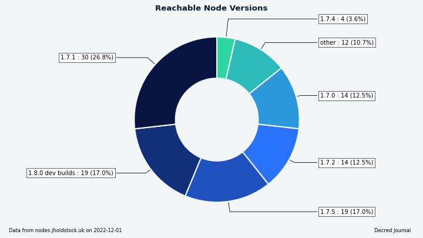

# Decred Journal – Listopad 2022

_Obraz: Niezatytułowany, aut. @Exitus._

Najważniejsze wydarzenia z listopada:

- Pojawiły się nowe wydania portfela Decrediton (v1.7.6) i DCRDEX (v0.5.7) z poprawkami błędów.

- Dużym tematem w branży kryptowalutowej w listopadzie 2022 r. było ujawnienie oszustwa FTX, które doprowadziło do zaprzestania przetwarzania wypłat przez giełdę i zaowocowało falą zarażenia, która dotknęła szeregu dobrze znanych giełd i funduszy. Te wydarzenia powinny sprawić, że zalety DCRDEX w postaci niepowierniczego charakteru i "dowodu rezerw" będą bardziej widoczne.

- @dcrtimestampbot na Twitterze został ponownie aktywowany po pomyślnym zatwierdzeniu propozycji jego finansowania. Zbiegło się to na krótko po głośnym użyciu łańcucha Decred do timestampingu w brazylijskich wyborach krajowych zakończonych w październiku, gdzie Lula i Haddad, były burmistrz São Paulo, zakotwiczyli swoje plany zarządzania na łańcuchu Decred celem walki z fake newsami.

Spis treści:

- [Wydanie Decrediton v1.7.6](#decrediton-v176-release)
- [Wydanie DCRDEX v0.5.7](#dcrdex-v057-release)
- [Rozwój](#development)
- [Ludzie](#people)
- [Zarządzanie](#governance)
- [Sieć](#network)
- [Ekosystem](#ecosystem)
- [Nawiązywanie kontaktów](#outreach)
- [Eventy](#events)
- [Media](#media)
- [Dyskusje społeczności](#discussions)
- [Rynki](#markets)
- [Ważne kwestie i wiadomości poboczne](#relevant-external)

## Wydanie Decrediton v1.7.6

To wydanie naprawia kilka błędów w DEX (moduł zaktualizowano do v0.5.6), oraz zawiera poprawkę dla systemów Windows:

- DEX: Naprawiono przetwarzanie niektórych transakcji Bitcoin Taproot.
- DEX: Naprawiono odblokowanie portfela w niektórych konfiguracjach mieszanych portfeli Decred.
- DEX: Naprawiono mylący status synchronizacji we wbudowanych portfelach Decred.
- Naprawiono rozwiązywanie nazw domen przy użyciu alternatywnych serwerów DNS skonfigurowanych w systemie Windows.

Pobierz [najnowsze wydanie](https://github.com/decred/decred-binaries/releases) na GitHubie. Jak zawsze, zalecamy [weryfikację plików](https://docs.decred.org/advanced/verifying-binaries) przed uruchomieniem.

## Wydanie DCRDEX v0.5.7

Samodzielna aplikacja DEX wyprzedza nieco wersję z portfela Decrediton opisaną powyżej, dodając te zmiany od wersji v0.5.6:

- Naprawiono przypadek, w którym klient mógł nie ukończyć anulowania zamówienia, co powodowało, że zamówienie pozostawało w księdze zamówień na serwerze.
- Dodano automatyczne anulowanie zamówień otrzymanych z serwera, o których klient nie wie, naprawiając kilka przypadków krańcowych.

To wydanie jest podpisane kluczem @chappjc `761D6A0BEB286C9B6A65DD053F857EEA746C64D1`, umożliwiającym [weryfikację](https://docs.decred.org/advanced/verifying-binaries) pobrań DEX, dopóki nie będą one dostępne jako część następnego [wydania oprogramowania podstawowego](https://github.com/decred/decred-binaries/releases).

Najnowszą aplikację DEX można pobrać [tutaj](https://github.com/decred/dcrdex/releases).

## Rozwój

O ile nie zaznaczono inaczej, prace zgłaszane poniżej mają status „scalonych z repozytorium głównym (master)”. Oznacza to, że prace są ukończone, zrecenzowane i zintegrowane z kodem źródłowym, który zaawansowani użytkownicy mogą [kompilować i uruchamiać](https://medium.com/@artikozel/the-decred-node-back-to-the-source-part-one-27d4576e7e1c), ale ich efekty nie są jeszcze dostępne w wersji plików binarnych dla zwykłych użytkowników.

### dcrd

_[dcrd](https://github.com/decred/dcrd) jest pełną implementacją węzła, który obsługuje sieć peer-to-peer Decred na całym świecie._

Scalono z gałęzią `master`:

- Zaktualizowano [próbę znakowania czasowego](https://github.com/decred/dcrd/pull/3014) z peerem przed próbą połączenia się z nim.
- Uproszczono sposób przechowywania surowych transakcji i ich dodatkowych [opisów](https://github.com/decred/dcrd/pull/3015) w mempoolu.
- Dostosowano [zarządzanie pamięcią](https://github.com/decred/dcrd/pull/3016) tak, aby mniej czasu procesora poświęcane było na zbieranie śmieci. Dzięki temu dcrd może wykonać początkową synchronizację łańcucha do 10% szybciej kosztem użycia większej ilości pamięci. Miłą korzyścią uboczną jest to, że zaawansowani administratorzy mogą teraz dostroić to zachowanie za pomocą zmiennej środowiskowej.
- [Włączono](https://github.com/decred/dcrd/pull/3017) i ustawiono [jako domyślne](https://github.com/decred/dcrd/pull/3019) nową wersję protokołu peer-to-peer, która nie używa już wiadomości `reject`. Wiadomość ta została odziedziczona po oryginalnej bazie kodowej btcsuite i była używana do sygnalizowania, że transakcja lub blok jest ["odrzucony"](https://en.bitcoin.it/wiki/Protocol_documentation#reject) przez peera. Używanie tej wiadomości do całkiem sporej ilości rzeczy było zawodne lub niepoprawne i złożono [propozycję](https://github.com/decred/dcrd/issues/2546), aby ją usunąć. Peery negocjujące nową wersję protokołu nie będą już wysyłać wiadomości `reject` i uznają to za naruszenie, jeśli je otrzymają. Wszystkie peery negocjujące do starszej wersji nie będą karane za wysyłanie `reject` i będzie to ignorowane przez nowsze węzły.
- Dodano nowe [zdarzenia IPC](https://github.com/decred/dcrd/pull/3020) do powiadamiania procesu nadrzędnego o adresie i porcie przypisanym do dcrd. W konfiguracjach, w których dcrd jest kontrolowany przez inny proces, taki jak Decrediton lub automatyczny tester, ten proces nadrzędny musi wiedzieć, jakich adresów i portów używa dcrd dla swojego interfejsu P2P (rozmawiającego z siecią publiczną) i interfejsu RPC (lokalnej komunikacji z portfelami i innymi klientami). Ta zmiana zapewnia niezawodny sposób na odkrycie portów dcrd, gdy są one losowo przypisane przez system operacyjny i nie są skonfigurowane przez proces macierzysty.
- Zawsze odpowiadaj na żądania [`getheaders`](https://github.com/decred/dcrd/pull/3030) od peerów. Poprzednia logika nie odpowiadała na `getheaders` jeśli lokalny łańcuch nie był uważany za w pełni zsynchronizowany z siecią. W starym modelu synchronizacji "najpierw bloki" pomogło to uniknąć pewnych niepożądanych przypadków, takich jak niepotrzebne pobieranie bloków. Miało to też swoje minusy, np. węzeł mógł sprawiać wrażenie niereagującego lub zatrzymanego dla innych peerów, podczas gdy był aktywny i po prostu nie miał żadnych interesujących danych do przekazania. W aktualnym modelu synchronizacji "najpierw nagłówki" to ograniczenie nie jest już potrzebne, a serwowanie nagłówków przed tym, jak wiadomo, że peer jest na bieżąco z blokami, nie prowadzi już do niepożądanego zachowania.

Serwer RPC:

- Zoptymalizowano obsługę rozłączania klientów WebSocket i naprawiono błędne wiadomości, gdy klienci WebSocket się rozłączają.
- Zmodyfikowano [cykl życia](https://github.com/decred/dcrd/pull/3025) klientów WebSocket, aby używali kontekstów, co jest bardziej elastyczne dla kodu wywołującego.
- Dodano [obsługę anulowania](https://github.com/decred/dcrd/pull/3027) dla żądania `getwork` i zoptymalizowano obsługę wielu współbieżnych żądań `getwork`. Powinno to przynieść korzyści niektórym konfiguracjom górniczym. Żądanie [`getwork`](https://en.bitcoin.it/wiki/Getwork) jest używane przez oprogramowanie górnicze do ciągłego odpytywania węzła o nową pracę, która jest następnie dystrybuowana do sprzętu górniczego. Jest to bardzo powszechna metoda dla monet, które są wydobywane, jednak górnicy Decred są zachęcani do korzystania z bardziej wydajnej subskrypcji [`notifywork`](https://github.com/decred/dcrd/blob/0e7920ce30257aa1aced00e34ac637423f50965e/docs/json_rpc_api.mediawiki#notifywork).

Framework testowania RPC został przeniesiony do nowego repozytorium o nazwie [`dcrtest`](https://github.com/decred/dcrtest). Framework łączy się z instancją dcrd i steruje nią poprzez interfejs [RPC](https://bitcoin.stackexchange.com/questions/24163/what-does-the-bitcoin-rpc-mean-and-how-is-it-used). Jest on używany do pisania testów na poziomie integracji, które testują cechy i zachowania w pełni skompilowanej binarki dcrd. Żyjąc teraz w osobnym repozytorium, zapewnia on ładniejszą funkcjonalność w zakresie wyboru konkretnej wersji dcrd do testowania, wykorzystując system modułów Go, zamiast zawsze kompilować najnowszą gałąź `master`. Pozwala to konsumentom frameworka testującego, takim jak dcrlnd, na zapewnienie większej jakości poprzez testowanie przeciwko wydanym wersjom dcrd, jak również najnowszej `master`.

### dcrwallet

_[dcrwallet](https://github.com/decred/dcrwallet) to serwer portfela używany przez wiersz polecenia oraz aplikacje graficzne._

- Zaktualizowano [główną wersję](https://github.com/decred/dcrwallet/pull/2189) modułu `decred.org/dcrwallet` do wersji 3, zaktualizowano wszystkie zależności obecnych modułów w toku z dcrd do odpowiadających im głównych wersji, usunięto nieużywany kod.
- Umożliwienie [przekazywanie odpowiedzi](https://github.com/decred/dcrwallet/pull/2191) dla wywołania `--create` tak, aby działało poprawnie nie tylko dla wstępnej tworzenia, jak i potwierdzenia. Pomaga to zautomatyzować tworzenie portfela (np. poprzez przesłanie wszystkich odpowiedzi z pliku tekstowego).
- Heksadecymalne ziarna [przywrócenia portfela](https://github.com/decred/dcrwallet/pull/2192) nie wymagają już dodatkowej nowej linii. To również pomaga [nieinteraktywnym](https://github.com/decred/dcrwallet/issues/2190) (zautomatyzowanym) wdrożeniom dcrwallet.
- Dodano żądania RPC, aby umożliwić Decreditonowi uzyskanie i aktualizację [oczekujących polityk TSpend](https://github.com/decred/dcrwallet/pull/2172).

### Decrediton

_[Decrediton](https://github.com/decred/decrediton) to w pełni funkcjonalny desktopowy portfel ze zintegrowaną funkcją głosowania, mieszania StakeShuffle, Lightning Network, handlem na DEX i nie tylko. Działa z lub bez dostępu do pełnego łańcucha (tryb SPV)._

[Wydanie v1.7.6](https://github.com/decred/decred-binaries/releases/tag/v1.7.6):

- [Zaktualizowano](https://github.com/decred/decrediton/pull/3834) moduł DCRDEX do v0.5.6 (poprawki błędów dla BTC i DCR) oraz dodano ikonę do okna DEX.

W kierunku następnego wydania na `master`, Wallet Launcher został [przeprojektowany](https://github.com/decred/decrediton/pull/3690) w poniższy sposób:

- Dodano tutoriale onboardingowe do launchera.
- Dodano gradienty do kart portfeli. Gradient każdego portfela jest zapisywany w pliku konfiguracyjnym.
- Przesunięto przeprojektowany pasek postępu na dół.
- Usunięto komponent `RescanWallet`. Postęp ponownego skanowania jest teraz zintegrowany z paskiem postępu, a podczas postępu wyświetlana jest lista tutoriali onboardingowych.
- Wprowadzono nowy wskaźnik paska postępu procesu pobierania nagłówków bloków.
- Dodano opcję konfiguracji portfela Trezor.
- Dodano modal automatycznego uruchomienia portfela. Wybór użytkownika jest zapisywany do konfiguracji.

DEX:

- [Usunięto](https://github.com/decred/decrediton/pull/3800) kroki konfiguracji portfela Bitcoin na rzecz wbudowanego portfela BTC dostarczanego przez moduł DEX. Dodano testy dla widoków i czynności DEX.
- Podczas zmiany [hasła portfela](https://github.com/decred/decrediton/pull/3822), użytkownicy mogą wprowadzić swoje hasło do aplikacji DEX, aby DEX dowiedział się o nowym haśle portfela. To naprawia mylące UX zmiany hasła dla tych, którzy korzystają z DEX przez Decrediton.
- Naprawiono problem, w którym okno DEX [nie uruchamiało się](https://github.com/decred/decrediton/pull/3831) po przeładowaniu UI.

Ulepszenia UX:

- [Dodano linki](https://github.com/decred/decrediton/pull/3778) do wydanych biletów i opłaty VSP na stronie szczegółów transakcji. Linki te otwierają się teraz lokalnie w Decreditonie, zamiast wysyłać do dcrdata. Jeśli powiązana transakcja nie jest jeszcze w pamięci (np. jest zbyt stara), zostanie pobrana z dcrwallet w tle.
- Dodano krok startowy do ponownego wysłania preferencji głosowania do [ostatnio zaktualizowanych VSP](https://github.com/decred/decrediton/pull/3738). Wybory głosowania konsensusowego wysłane do VSP korzystającego ze starszego oprogramowania są tracone, ponieważ VSP nie jest świadomy nowych głosów konsensusowych. Jeśli taki VSP zostanie zaktualizowany, może być [konieczne](https://github.com/decred/decrediton/issues/3723) ponowne wysłanie do niego wyborów do głosowania, aby mógł głosować nad najnowszymi agendami konsensusu biletami, którymi zarządza.
- Dodano [linki do dokumentacji](https://github.com/decred/decrediton/pull/3802) pod postacią znaków zapytania w całym portfelu.
- Przeprojektowano [strony Trezora](https://github.com/decred/decrediton/pull/3570).
- Poprawiono przepływ [zakupu jednego biletu mieszanego](https://github.com/decred/decrediton/pull/3819) poprzez zautomatyzowanie kroków: wyłączenie miksera, zakup biletu, ponownie włączenie miksera.
- Preferencje głosowania są teraz [aktualizowane asynchronicznie](https://github.com/decred/decrediton/pull/3801). Deweloper @bgptr donosi, że proces stał się 3 razy szybszy na mainnecie (3 sekundy vs 11 sekund). Poprawiono również obsługę błędów.

Pozostałe zmiany:

- Zmieniono nazwę pakietu `win32ipc` na `dcrwin32ipc`, aby [uniknąć zamieszania](https://github.com/decred/decrediton/pull/3828) z podejrzanym zdalnym pakietem o tej samej nazwie. Ustalono, że nigdy nie było żadnego ryzyka dla oprogramowania Decred ze strony tego innego podejrzanego pakietu, a moduł Decrediton był zawsze ładowany z lokalnie zbudowanych zasobów.
- Zmieniono kod [przetwarzania transakcji](https://github.com/decred/decrediton/pull/3777), aby poprawić wydajność i umożliwić automatyczne testowanie.
- Usunięto cały kod [związany ze starymi wersjami stakepooli](https://github.com/decred/decrediton/pull/3808). Wyczyszczono również strukturę kodu związaną z zakupem biletów i automatycznym ticketbuyerem. Zakładka Prywatność teraz poprawnie pokazuje, że miksy są tworzone co 10 minut, a nie 20.
- Dodano [podstawowe i zaawansowane](https://github.com/decred/decrediton/blob/fabcf6b81d50ac11c9502af0117d654c21e8c3bc/app/i18n/community_translators.md) tłumaczenia dla [greckiego](https://github.com/decred/decrediton/pull/3719).
- Zastosowano [ustawienia proxy](https://github.com/decred/decrediton/pull/3803) do dcrd i dcrwallet, gdy typem proxy jest SOCKS5. Dzięki temu użytkownicy mogą skonfigurować dcrd i dcrwallet do komunikacji przez sieć Tor.
- Zwiększono zakres zautomatyzowanych testów UI.
- Aktualizacja zależności, w tym przejście na [Node 16](https://github.com/decred/decrediton/pull/3837) i [Electron 18](https://github.com/decred/decrediton/pull/3832).

Poprawki:

- Naprawiono niepożądaną [blokadę](https://github.com/decred/decrediton/pull/3804) konta portfela używanego przez automatycznego ticketbuyera.
- Naprawiono [szacowanie czasu](https://github.com/decred/decrediton/pull/3815) pobierania łańcucha podczas synchronizacji.
- Naprawiono brakujące [ponowne zamknięcie](https://github.com/decred/decrediton/pull/3819) po udanym lub nieudanym zakupie biletu, np. przez autobuyera lub uruchomieniu miksera itp. Status blokady konta jest teraz wyświetlany na stronie Konta, aby ułatwić śledzenie.
- Poprawki do [widoku transakcji](https://github.com/decred/decrediton/pull/3789): obcinanie długich adresów i nazw kont, pokazywanie transakcji wydania biletu, poprawione wyświetlanie haszy bloków, poprawione niepoprawne zgłaszanie niektórych biletów jako solo.
- Naprawiono brak możliwości [zamknięcia nieaktywnych kanałów](https://github.com/decred/decrediton/pull/3796) w zakładce Lightning Network.
- Naprawiono problem, w którym [fokus](https://github.com/decred/decrediton/pull/3839) został utracony między słowami nasion podczas przywracania portfela Trezor.

Narzędzia deweloperskie oraz dokumentacja:

- Udokumentowano jak zainstalować i aktualizować [narzędzia Electron](https://github.com/decred/decrediton/pull/3825).
- Dodano skrypty dla analizy [rozmiaru wiązek](https://github.com/decred/decrediton/pull/3826).

_Obraz: Uruchomienie przeprojektowanego Decreditona. Decredukacja w trakcie synchronizacji portfela jeszcze nigdy nie była tak prosta._

_Obraz: Przeprojektowana konfiguracja portfela Trezor w Decreditonie._

### Politeia

_[Politeia](https://github.com/decred/politeia) to system składania propozycji w ekosystemie Decred, który służy do wnioskowania o środki ze Skarbca._

Wszystkie poniższe zmiany służą przeprojektowaniu GUI na nową [architekturę opartą o wtyczki](https://github.com/decred/politeiagui/tree/master/plugins-structure#politeiagui---plugins-structure).

[Usprawniona nawigacja](https://github.com/decred/politeiagui/pull/2866):

- Dodano usługę nawigacji do pakietu `core`. `core` jest podstawowym blokiem konstrukcyjnym, a jego usługi mogą być używane z dowolnego pluginu lub aplikacji podobnej do Politei.
- Dynamiczna aktualizacja tytułu strony zgodnie z nazwą propozycji.
- Dodano komponent linku "Powrót" wielokrotnego użytku oraz naprawiono błędy starszych wersji.

Pozostałe:

- Zbudowano i przetestowano z użyciem [Node 18 i 19](https://github.com/decred/politeiagui).
- Dodano [testy](https://github.com/decred/politeiagui/pull/2876) dla wspólnych komponentów UI.
- Dodano [zestaw narzędzi](https://github.com/decred/politeiagui/pull/2869) w celu uproszczenia konfiguracji i kompozycji wtyczek i ich usług.
- Dodano [workflow GitHub Actions](https://github.com/decred/politeiagui/pull/2873), aby zbudować i przetestować nowy remake GUI oddzielnie od istniejącej aplikacji GUI.
- Wdrożono pierwszy widok [zgłoszonych propozycji](https://github.com/decred/politeiagui/pull/2877) na stronie Konta użytkownika.
- Poprawiono obsługę niektórych [błędów](https://github.com/decred/politeiagui/pull/2872) zwracanych z serwera oraz poprawiono/uaktualniono powiązane testy end-to-end.

### vspd

_[vspd](https://github.com/decred/vspd) to oprogramowanie serwera dla pul udziałów (Voting Service Provider). VSP oddaje głos za swoich użytkowników 24/7 oraz nie wchodzi w posiadanie żadnych środków, a tym samym nie może ich ukraść._

- Dodano narzędzie [`vote-validator`](https://github.com/decred/vspd/pull/335). Pozwala ono administratorom VSP na sprawdzenie, czy ich wdrożenie vspd głosuje poprawnie zgodnie z preferencjami użytkownika.
- Włączenie [commitu Git](https://github.com/decred/vspd/pull/357) do łańcucha wersji aplikacji.
- Dodano [moduł klienta HTTP wielokrotnego użytku](https://github.com/decred/vspd/pull/359) dla konsumentów API vspd. Będzie to przydatne dla dcrwallet, dcrwebapi i narzędzi testowych takich jak v3tool.
- Ulepszenia [systemowe buildów](https://github.com/decred/vspd/pull/362).

### Lightning Network

_[dcrlnd](https://github.com/decred/dcrlnd) to oprogramowanie węzła Lightning Network dla Decred. LN umożliwia przesyłanie natychmiastowych i niskokosztowych transakcji._

- Zaktualizowano [najnowsze](https://github.com/decred/dcrlnd/pull/168) wersje testowe dcrd i dcrwallet. Wymagało to naprawienia minera simnetu, aby uwzględnić błąd wyczerpania biletów, który mógł się zdarzyć podczas wydobywania.
- Dodano [opcję](https://github.com/decred/dcrlnd/pull/170) do przełączania polityki luki podczas generowania nowych adresów na Wrap zamiast domyślnej w dcrwallet. Naprawia to [problem](https://github.com/decred/dcrlnd/issues/169), gdzie próba wygenerowania adresu dla lnwallet do otwarcia lub zamknięcia kanału powodowała błąd.

### DCRDEX

_[DCRDEX](https://github.com/decred/dcrdex) to niepowiernicza giełda, umożliwiająca handel bez konieczności zaufania, działająca dzięki technologii atomic swaps._

[Wydanie v0.5.5](https://github.com/decred/dcrdex/releases/tag/v0.5.5):

- Naprawiono złą rewizję goleveldb pochodzącą z go-ethereum poprzez ręczne [obniżenie wersji](https://github.com/decred/dcrdex/pull/1938).
- Naprawiono kolejny problem z [dużymi transakcjami Taproot](https://github.com/decred/dcrdex/pull/1936) w sieci głównej Bitcoin poprzez ponowną aktualizację btcd.

[Wydanie v0.5.6](https://github.com/decred/dcrdex/releases/tag/v0.5.6):

- Naprawiono błąd powodujący, że [konto niemieszane](https://github.com/decred/dcrdex/pull/1954) nie jest odblokowywane w niektórych konfiguracjach kont mieszanych, aby zapobiec nieudanym zwrotom za wymianę.
- Naprawiono zbyt wczesne zgłaszanie [gotowości](https://github.com/decred/dcrdex/pull/1955) przez wbudowane portfele DCR.

[Wydanie v0.5.7](https://github.com/decred/dcrdex/releases/tag/v0.5.7):

- Anulowanie zleceń, o których klient [nie wie](https://github.com/decred/dcrdex/pull/1889). Naprawia to różne przypadki napotkane w środowisku naturalnym, gdzie klient mógł stracić część swoich zamówień (np. przez użycie uszkodzonego pliku bazy danych, niezapisanie zamówień, itp.)
- Naprawiono błąd, gdzie [zlecenia](https://github.com/decred/dcrdex/pull/1971) mogły być wycofane/nieistniejące na kliencie, ale wciąż zarezerwowane na serwerze. Mogło się to zdarzyć, jeśli klient zainicjował anulowanie zlecenia handlowego, nie odpowiedział na żądanie [preimage](https://github.com/decred/dcrdex/blob/75bb91da9b2f65b52835cb8235bcc1a7fd7b893b/spec/orders.mediawiki#order-commitment) z serwera (np. przez krótkie rozłączenie) i błędnie oznaczył zlecenie handlowe jako [odwołane](https://github.com/decred/dcrdex/pull/1971), podczas gdy w rzeczywistości anulowanie nie powiodło się i zlecenie handlowe było nadal zarezerwowane na serwerze.

Następne są zmiany scalone w `master` w kierunku następnego dużego wydania.

Zmiany klienta skierowane do użytkowników:

- Dodano [bot market-makera](https://github.com/decred/dcrdex/pull/1738). Bot używa pewnych wewnętrznych i (opcjonalnie) zewnętrznych sygnałów do obliczenia idealnej ceny kupna i sprzedaży oraz "rozpiętości progu rentowności", która jest rozpiętością, przy której opłaty za sekwencję kupna-sprzedaży są równe jej zyskowi. Wartości te mogą być wykorzystane jako dane wejściowe do jednej z 5 "strategii luki", które określają docelowy spread. Kod jest skonstruowany tak, aby wspierać więcej procedur handlowych w przyszłości. Dodano UI do tworzenia, konfigurowania i monitorowania istniejących botów market makerów.
- Dodano wsparcie dla "samozarządzających" transakcji, gdy [serwer jest wyłączony](https://github.com/decred/dcrdex/pull/1866). Klienty potrzebują sposobu, aby zakończyć rozpoczęte transakcje, nawet jeśli serwer przestanie działać lub w tajemniczy sposób straci informacje o rynku.
- Ścieżka do [bazy danych](https://github.com/decred/dcrdex/pull/1951) jest teraz rejestrowana przy uruchamianiu systemu.
- Składanie zleceń jest teraz [bardziej responsywne](https://github.com/decred/dcrdex/pull/1887). Formularz zamówienia będzie zamykał się szybciej, a składanie zamówień będzie kontynuowane w tle.
- Domyślne wyświetlanie lub ukrycie [zaawansowanych opcji zamówienia](https://github.com/decred/dcrdex/pull/1885).
- Naprawiono błąd, w którym [kursy walut](https://github.com/decred/dcrdex/pull/1974) nie były wyświetlane. Częstotliwość pobierania kursów fiat została zmniejszona, aby uniknąć uderzenia w limity kursów.
- ~6 mniejszych poprawek i ulepszeń.

Zmiany klienta dotyczące portfela BTC:

- Użytkownicy mogą teraz [zobaczyć i zarządzać peerami](https://github.com/decred/dcrdex/pull/1931), z którymi połączone są portfele BTC SPV, a także dodawać nowe połączenia.

Kaucje (klient oraz serwer):

- Wdrożono kolejne [fundamenty](https://github.com/decred/dcrdex/pull/1819): dodano wiadomości do zarządzania kaucjami, zmieniono zarządzanie kontami na serwerze na system warstwowy, zaktualizowano bazy danych serwera w celu śledzenia kaucji klientów. Nie będzie unieważniania kaucji z powodu złego zachowania, zamiast stopień danego użytkownika jest równowagą pomiędzy "siłą" kaucji a jego wynikiem zachowania. Niewłaściwie zachowujący się użytkownicy mogą liczyć się z potrzebą zablokowania większej ilości środków w dodatkowych kaucjach, aby przywrócić swój poziom i móc ponownie handlować.

Serwer:

- Szybka awaria, jeśli [indeks transakcji](https://github.com/decred/dcrdex/pull/1973) dla bitcoinopodobnych aktywów nie jest uruchomiony. Jest to niezbędne do działania DEX, ponieważ bez indeksu DEX nie będzie w stanie wyszukać transakcji.
- Poprawiono obliczanie [opłat DOGE](https://github.com/decred/dcrdex/pull/1965).

_Obraz: Twój asystent do marketmakingu w DCRDEX._

### dcrdata

_[dcrdata](https://github.com/decred/dcrdata) to eksplorator blockchaina Decred oraz danych off-chain, takich jak propozycje na platformie Politeia, rynków i ponadto._

- Naprawiono złą rewizję [goleveldb](https://github.com/decred/dcrdata/pull/1934), która psuła kod bazy danych dcrd.
- Naprawiono różne błędy we frontendzie, przede wszystkim te związane z [wydatkami i wpływami do Skarbca](https://github.com/decred/dcrdata/pull/1933).

### Rosetta

_[dcrros](https://github.com/decred/dcrros) jest usługą pośrednią, która pozwala na dostęp do sieci Decred za pomocą API Rosetta._

- [Aktualizacja](https://github.com/decred/dcrros/pull/27) do wersji wydania v1.7.5 oprogramowania Decred.
- Przełączono stabilną wersję Dockerfile, aby używała ostatnio oznaczonej wersji [v0.2.0](https://github.com/decred/dcrros/pull/30) `dcrros`.
- Rozpoczęto kolejny [cykl rozwojowy](https://github.com/decred/dcrros/pull/31) dla v0.3: zaktualizowano do najnowszych pakietów dcrd, zaktualizowano konfigurację CI, przełączono się na nowy [dcrtest](https://github.com/decred/dcrtest) do uruchamiania testów integracyjnych.

### Pozostałe

W kwestii badań @matheusd opublikował [OP_PEEL: jednostronnie opuszczalne pule środków](https://matheusd.com/post/op_peel/). `OP_PEEL` usuwa kilka ograniczeń [MRTTREE](https://matheusd.com/post/ln-split-tickets-01-mrttree/), poprzedniej koncepcji budowania wieloużytkownikowych pul Decred na Lightning Network.

> Głównym celem wprowadzenia `OP_PEEL` jest zbudowanie wieloużytkownikowych pul środków, renderowanych jako pojedyncze UTXO on-chain, takich, że każdy indywidualny uczestnik puli może jednostronnie wydobyć z powrotem swoje udziały, nie wymagając pełnych lub nawet częściowych protokołów koordynacji grupowej dla etapu wykupu kontraktu.

Koncepcja `OP_PEEL` może być dobrym sposobem na implementację współdzielonych biletów (aka "ticket splitting"), ale inne aplikacje mogłyby również na niej bazować.

## Ludzie

Witamy nowych, po raz pierwszych udzielających swych umiejętności współtwórców:

- @Xk9eboF6 ([Decrediton](https://github.com/decred/decrediton/commits?author=Xk9eboF6) tłumaczenie na jęz. grecki)
- Blockchain Jew ([Decred Magazine](https://www.decredmagazine.com/author/blockchain/), autor)
- Hassan Maishera ([Decred Magazine](https://www.decredmagazine.com/author/hassan/), autor)

W najnowszej odsłonie Decred Magazine Q&A deweloper @cli\_query opisał swoją ścieżkę od handlu walutami do wsiąknięcia w kryptowaluty i Decred.

> Uczucie było niezwykłe, możliwość wykonywania pracy dla i bycia opłacanym przez zdecentralizowany protokół jest niezwykle potężna. Fakt, że po prostu musisz świadczyć uczciwą pracę i dodać wartość do społeczności, po prostu rozwalił mi mózg.

Statystyki społeczności na dzień 2. grudnia (w porównaniu z 1. listopada):

- Obserwujący na [Twitterze](https://twitter.com/decredproject): 53734 (-220)
- Subskrybenci na [Reddit](https://www.reddit.com/r/decred/): 12634 (+2)
- Użytkownicy na [Matrixie](https://chat.decred.org/) w pokoju #general: 729 (+3)
- Użytkownicy na [Discordzie](https://discord.gg/GJ2GXfz): 1878 (+21), zweryfikowanych z możliwością pisania: 936 (zaczynamy ponownie śledzić)
- Użytkownicy na [Telegramie](https://t.me/Decred): 2894 (+32)
- Subskrybenci na [YouTube](https://www.youtube.com/decredchannel): 4640 (+0), wyświetleń: 219K (+1K)

## Zarządzanie

W listopadzie nowy [Skarbiec](https://dcrdata.decred.org/treasury) otrzymał 8473 DCR o wartości 186 tys. USD po średnim listopadowym kursie wymiany $21,92. 2646 DCR zostało wydane, aby zapłacić kontrahentom, co stanowiło wartość $58K po listopadowym kursie wymiany, lub $70K po październikowym kursie rozliczeniowym $26,27.

Transakcja [wypłaty ze Skarbca](https://dcrdata.decred.org/tx/95ebb23a0846417eb1aa6a59bf6b4ad49d8cd72ff44c869d4af366fd1aef402e) zawierała 25 wyjść dokonujących płatności na rzecz kontrahentów, od 3 DCR do 1108 DCR. Została ona zatwierdzona 5 grudnia jednogłośnie głosami na tak. Było to szybkie zatwierdzenie (zwane również "przyspieszonym" w [specyfikacji](https://github.com/decred/dcps/blob/master/dcp-0006/dcp-0006.mediawiki)) w ciągu 10 dni zamiast maksymalnych 12 dni głosowania. Frekwencja wyborcza wyniosła 49% przy 7037 głosach na "tak" z 14339 uprawnionych, którzy mieli szansę zagłosować w skróconym terminie głosowania. Bardziej szczegółowy widok transakcji wydatków skarbowych można znaleźć w [instancji deweloperskiej](https://tip.dcrdata.org/tx/95ebb23a0846417eb1aa6a59bf6b4ad49d8cd72ff44c869d4af366fd1aef402e) dcrdata, który wkrótce pojawi się w głównej instancji eksploratora bloków.

Na dzień 10. grudnia, łączne saldo [starego](https://dcrdata.decred.org/address/Dcur2mcGjmENx4DhNqDctW5wJCVyT3Qeqkx) i [nowego Skarbca](https://dcrdata.decred.org/treasury) wynosi 830186 DCR (17,8 mln USD po kursie $21,48).

_Obraz: Historyczny wykres salda Skarbca._

_Obraz: Miesięczne wpływy i wypłaty ze Skarbca._

[Propozycja](https://proposals.decred.org/record/0848cc9) sfinansowanie bota [@dcrtimestampbot](https://twitter.com/dcrtimestampbot) na Twitterze kwotą 1950$ została zatwierdzona przy 91,4% głosów na tak i frekwencji 33%. Dzień po zatwierdzeniu @cli\_query [zamieścił aktualizację](https://proposals.decred.org/record/0848cc9/comments/13) na Politei mówiąc, że bot jest aktywny pod nowym właścicielem.

## Sieć

**Hashrate**: listopadowy [hashrate](https://dcrdata.decred.org/charts?chart=hashrate&scale=linear&bin=day&axis=time) na początku miesiąca wyniósł ~87 Ph/s a zamknął go na poziomie ~68 Ph/s, zaliczając niż w ok. 50 Ph/s oraz szczyt w wys. 93 Ph/s w ciągu miesiąca.

_Obraz: Moc obliczeniowa projektu Decred._

Dystrybucja mocy obliczeniowej w wys. 84 Ph/s [zadeklarowana](https://miningpoolstats.stream/decred)  przez pule wydobywcze na dzień 1. grudnia: Poolin 43%, F2Pool 32%, AntPool 19%, BTC.com 5%, CoinMine 0,4%.

Podział 1000 bloków [wydobytych](https://miningpoolstats.stream/decred) przed 1. grudnia: Poolin 51%, F2Pool 32%, (prawdopodobnie) AntPool 10%, BTC.com 6%, CoinMine 0,2%.

_Obraz: Dystrybucja mocy obliczeniowej pul wydobywczych._

_Obraz: Historyczny wykres dystrybucji mocy obliczeniowej pul wydobywczych._

**Staking**: [Cena biletów](https://dcrdata.decred.org/charts?chart=ticket-price&axis=time&visibility=true-true&mode=stepped) wahała się między 226 a 237 DCR, a jej 30-dniowa [średnia](https://dcrstats.com/) wyniosła 231,5 DCR (-2,2).

[Zablokowana suma](https://dcrdata.decred.org/charts?chart=ticket-pool-value&scale=linear&bin=day&axis=time) to pomiędzy 9,44 a 9,55 miliona DCR, co oznacza, że 64,1-65,1% podaży dostępnej w obiegu [wzięło udział](https://dcrdata.decred.org/charts?chart=stake-participation&scale=linear&bin=day&axis=time) w elemencie Proof of Stake.

**VSP**: Na 1. grudnia, ~6930 (+130) biletów w puli zarządzanych było przez [17 oficjalnych VSP](https://decred.org/vsp/), co stanowi 16,8% całej puli biletowej (+0,1%). Uwaga: dane te nie uwzględniają vspd.stakey.com, który ma [problemy z API](https://github.com/decred/dcrwebapi/pull/171) i podaje przeterminowane dane.

Największe wzrosty w listopadzie odnotowały ultravsp.uk (+497) oraz decredvoting.com (+83).

_Obraz: Dystrybucja biletów zarządzanych przez VSP._

**Węzły**: [Decred Mapper](https://nodes.jholdstock.uk/user_agents) odnotował 112 węzły dcrd na dzień 1. grudnia: v1.7.1 - 27%, v1.8.0 dev buildy - 17%, v1.7.5 - 17%, v1.7.2 - 13%, v1.7.0 - 13%, v1.7.4 - 4%, pozostałe - 11%.

_Obraz: Wersje dostępnych węzłów dcrd._

_Obraz: Historyczna dystrybucja wersji węzłów dcrd, dane z nodes.jholdstock.uk._

Ilość [monet mieszanych](https://dcrdata.decred.org/charts?chart=coin-supply&zoom=jz3q237o-la8vk000&scale=linear&bin=day&axis=time&visibility=true-true-true) wahała się w granicach 61,0-61,1%. Dzienna [kwota mieszana](https://dcrdata.decred.org/charts?chart=privacy-participation&bin=day&axis=time) oscylowała w granicach 265-445K DCR.

Na dzień 1. grudnia sieć [Lightning Network](https://ln-map.jholdstock.uk/) projektu Decred odnotowała 67 węzłów (-2), 104 kanały (-8) oraz całkowitą pojemność 40,6 DCR (-6,3). Dziękujemy @karamble za udostępnienie danych, podczas gdy [mapa LN](https://ln-map.jholdstock.uk/) jest poddawana pracom konserwacyjnym.

Dzięki za ulepszenie starych oraz dostarczenie nowych wykresów należą się @bochinchero. Pełen zestaw wykresów gotowy do rozprowadzania dostępny jest [tutaj](https://github.com/bochinchero/dcrsnapshots).

## Ekosystem

Ogłoszenia Decred będą teraz powielane w [Fediverse](https://en.wikipedia.org/wiki/Fediverse) na [@decred](https://dcr.pw/@decred) pod adresem dcr.pw. Jeśli korzystasz z Mastodona lub innej instancji kompatybilnej z ActivityPub, zapraszamy do śledzenia.

Ludziki z Fediverse mają teraz w sumie 3 serwisy Decred: instancję Mastodona pod adresem [citadel.stakey.net](https://citadel.stakey.net) dla networkingu społecznego ([link z zaproszeniem](https://citadel.stakey.net/invite/vhmPf6ua)), instancję PeerTube pod adresem [tube.decredcommunity.org](https://tube.decredcommunity.org/) powielającą filmy z YouTube, oraz najnowszą [@decred](https://dcr.pw/@decred) do śledzenia ogłoszeń o projektach. Ponieważ wszystkie one posługują się protokołem ActivityPub, możliwe jest uzyskanie zarówno zapowiedzi w formacie tekstowym, jak i nowych filmów na osi czasu tego samego konta.

Twitterowy bot do timestampingu jest ponownie dostępny. Wystarczy wspomnieć o [@dcrtimestampbot](https://twitter.com/dcrtimestampbot) w swoim tweecie, a bot zapisze go do IPFS, oznaczy czas na blockchainie Decred i odpowie linkami do obejrzenia dowodu i zapisanej kopii. Obecnie bot jest ograniczony do zapisania jedynie pojedynczych tweetów (tj. nie obsługuje wątków), które bezpośrednio wspomina o bocie. Można to wykorzystać do sporządzenia oświadczenia i zabezpieczenia go przed modyfikacjami. Hakerzy Pythona chcący pomóc w ulepszeniu bota mogą znajdą kod źródłowy [tutaj](https://github.com/JC60522/dcr_timestampbot).

Portfele Decred na Androida i iOS zostały usunięte z lokalizacji [Google Play](https://play.google.com/store/apps/details?id=com.decred.dcrandroid.mainnet) i [Apple Store](https://apps.apple.com/us/app/decred-wallet/id1462247643) zapowiedzianych w [wydaniu v1.7.0](https://www.reddit.com/r/decred/comments/umye1t/decred_mobile_wallet_v170_has_been_released_for/) (maj 2022), jak również z pobrań APK z [wydania na Androida](https://github.com/planetdecred/dcrandroid/releases). Kod [źródłowy](https://github.com/planetdecred) jest nadal dostępny na GitHubie.

Binance [zwiększyło](https://matrix.to/#/!teQafvHMYpIbqLIieU:decred.org/$YgdoiqEwjnnrJIKugu6p6u95Edf9YsRHQpz-HmEoSaU?via=decred.org&via=matrix.org) osobistą kwotę dla oferty [Simple Earn](https://www.binance.com/en/support/announcement/binance-adds-new-assets-to-simple-earn-flexible-products-2022-10-20-87e0f4b74c884d83b09ae4f3c2fd7b82) dla DCR z 15 DCR do 300 DCR na osobę, a także podniosło stopę zwrotu z 2,5% do 3,5%.

[Poloniex](https://poloniex.com) zakończył trwającą 10 miesięcy [konserwację](https://twitter.com/PoloSupport/status/1486355294493888512) portfela DCR, która rozpoczęła się 2 dni po wydaniu [wersji v1.7.0](https://github.com/decred/decred-binaries/releases/tag/v1.7.0). Wpłaty i wypłaty działają ponownie oraz pojawiła się nowa para handlowa DCR/USDT.

Dołączcie do naszego kanału [#ecosystem](https://chat.decred.org/#/room/#ecosystem:decred.org), aby śledzić wszelkie nowości związane z ekosystemem Decred.

Uwaga: autorzy Decred Journal nie są w stanie ocenić wiarygodności żadnego z powyższych podmiotów czy ich usług. Uprasza się o dołożenie należnych starań i własnoręczną weryfikację informacji przed powierzeniem jakichkolwiek środków innym stronom.

## Nawiązywanie kontaktów

Osiągnięcia Monde PR:

- Zaproponowano informację o nowościach w projekcie
- Zdobyto 3 wywiady w mediach
- Odpowiedziano na 13 próśb o komentarz

Umieszczono w mediach poniższe artykuły:

- Artykuł w [Fintech Times](https://thefintechtimes.com/new-use-for-blockchain-setting-the-record-straight-in-political-battles/) o tym, jak blockchain Decred został wykorzystany do zwalczania fake newsów w wyborach prezydenckich w Brazylii z komentarzem @jy-p. Artykuł został przekazany do [UK Economy News](https://ukeconomynews.co.uk/new-use-for-blockchain-setting-the-record-straight-in-political-battles/).
- Artykuł w [Cointelegraph](https://cointelegraph.com/news/ftx-collapse-the-crypto-industry-s-lehman-brothers-moment) zawierający komentarz @jz nazywający sagę FTX "momentem Lehman Brothers w branży krypto". Artykuł został przekazany do 24 publikacji, w tym [The New York Ledger](https://thenyledger.com/markets/crypto/ftx-collapse-the-crypto-industrys-lehman-brothers-moment/) i [Investing.com](https://www.investing.com/news/cryptocurrency-news/ftx-collapse-the-crypto-industrys-lehman-brothers-moment-2942288).
- @jy-p pojawił się w [Invezz Podcast](https://podcast.invezz.com/2000526/11675106) mówiąc o tym, jak blockchain Decred został wykorzystany w wyborach prezydenckich w Brazylii. Invezz opublikował również [artykuł](https://invezz.com/news/2022/11/11/video-blockchain-and-elections-jake-yocom-piatt/) o wywiadzie, który został zsynchronizowany do 2 publikacji i przetłumaczony na 9 języków.
- Artykuł w [The Manual](https://www.themanual.com/culture/what-experts-say-will-happen-next-for-crypto/) zawierający komentarz @jz na temat przyszłości kryptowalut po upadku FTX. Artykuł został przekazany do [Canada Today](https://canadatoday.news/ca/why-experts-say-ftx-failure-is-a-turning-point-not-the-end-for-crypto-155389/).
- Artykuł w [The Fintech Times](https://thefintechtimes.com/sustainable-crypto-alternatives-to-mining-with-decred-sellix-and-omnia-markets/) zawierający komentarz @jy-p na temat ekologicznie zrównoważonych kryptowalutowych alternatyw dla górnictwa. Artykuł został przekazany do 5 publikacji, w tym [UK Economy News](https://ukeconomynews.co.uk/sustainable-crypto-alternatives-to-mining-with-decred-sellix-and-omnia-markets/) i [NYC Crypto](https://nyccrypto.io/?p=106617).
- @jy-p pojawił się w [Cryptonews.com Podcast](https://cryptonews.com/exclusives/jake-yocom-piatt-co-founder-of-decred-on-blockchain-fixing-political-voting-campaign-spending-and-privacy.htm) mówiąc o tym, jak blockchain może zapewnić rozwiązania w zakresie głosowania w polityce, wydatków i prywatności. Wywiad został przekazany do 7 publikacji, w tym [Daily Crypto](https://dailycrypto.us.com/jake-yocom-piatt-co-founder-of-decred-on-blockchain-fixing-political-voting-campaign-spending-and-privacy/) i [Smart Investor](https://smartinvestor.online/jake-yocom-piatt-co-founder-of-decred-on-blockchain-fixing-political-voting-campaign-spending-and-privacy-ep-182/).

## Eventy

**Na których będziemy:**

- @arij została wybrana jako panelistka na 17. edycję Wieczoru Przedsiębiorcy prowadzonego przez JCI Casablanca w Maroku, z tematem "Kobieca przedsiębiorczość", gdzie podzieli się swoim doświadczeniem w pracy z projektem Decred i opowie o tym, jak to jest pracować w domenie blockchain jako kobieta. Wydarzenie zaplanowane jest na 20 grudnia.

## Media

**Wybrane artykuły:**

- [Nowe zastosowanie dla blockchaina: Prostowanie fałszów w bitwach politycznych](https://thefintechtimes.com/new-use-for-blockchain-setting-the-record-straight-in-political-battles/) autorstwa Francisa Bignella dla Fintech Times
- [Stanowisko Decred w sprawie cenzury na blockchainie](https://www.decredmagazine.com/decreds-stand-on-censorship-in-the-blockchain/), aut. @BlockchainJew
- [Nowy prezydent Brazylii wykorzystał blockchain Decred do usprawnienia swojej kampanii](https://www.decredmagazine.com/brazil-new-president-uses-decred-blockchain-to-improve-his-camapign/), aut. @Joao
- [FTX - Zabawa cudzymi pieniędzmi](https://www.decredmagazine.com/ftx-playing-with-other-peoples-money/) - wątek @jy-p na Twitterze przetworzony na artykuł Decred Magazine
- [Przegląd stosu technologicznego Decred](https://www.decredmagazine.com/decreds-technology-stack-overview/), aut. @phoenixgreen
- [Decred rośnie dzięki dobremu zarządzaniu](https://www.decredmagazine.com/decred-grows-with-good-governance/), aut. @OfficialCryptos
- [Recenzja bezpieczeństwa DEX](https://www.decredmagazine.com/reviewing-dex-security/), aut. @BlockchainJew
- [Q&A z deweloperem cli_query](https://www.decredmagazine.com/cli_query-developer-q-a/), aut. @phoenixgreen
- [Decred vs Litecoin: najlepsze alternatywy dla Bitcoina?](https://www.decredmagazine.com/decred-vs-litecoin-best-alternatives-for-bitcoin/), aut. @Joao
- [Upadek FTX wzmaga potrzebę istnienia zdecentralizowanych giełd](https://www.decredmagazine.com/ftxs-collapse-intensifies-the-need-for-decentralized-exchanges/), aut. @HassanMaishera

Statystyki aktywności [Decred Magazine](https://www.decredmagazine.com/) za listopad:

- Całkowita liczba artykułów na DM: 349
- Subskrybentów newslettera: 77
- Opublikowane nowe posty i newslettery: 16
- Aktywne kampanie w mediach społecznościowych: 16
- Zakończone kampanie w mediach społecznościowych 24
- Posty w mediach społecznościowych: 147
- Polubienia: 823
- Retweety: 198
- Liczba obserwujących na wszystkich kontach i platformach mediów społecznościowych: 1040

_Obraz: Przegląd stosu technologicznego Decred._

**Wideo:**

- [Okrągły Stół Społeczności Decred - Decred jako interoperacyjny rynek](https://www.youtube.com/watch?v=EGRtpI9oPHc) aut. @Exitus i @phoenixgreen, z udz. @h3la1, @MadScrilla1, @c12hz, oraz @DCR_Uncle
- [Dokonywanie wymiany P2P na DCRDEX - Fundamenty DCRDEX](https://www.youtube.com/watch?v=xr2Fmg5FMH8), aut. @phoenixgreen
- [Blockchain i wybory, Jake Yocom-Piatt, Decred](https://invezz.com/news/2022/11/11/video-blockchain-and-elections-jake-yocom-piatt/), aut. Dana Ashmore dla Invezz - również na [YouTube](https://www.youtube.com/watch?v=cEQv7YdX2sM) i jako [podcast](https://podcast.invezz.com/2000526/11675106)
- [Scenariusze handlowe - Fundamenty DCRDEX](https://www.youtube.com/watch?v=6c6McCUMhMQ) aut. @phoenixgreen
- [Rampy dostępowe DCRDEX - Fundamenty DCRDEX](https://www.youtube.com/watch?v=PM8HGR_CUv4), aut. @phoenixgreen
- [Jake Yocom-Piatt, współzałożyciel Decred, o blockchainie naprawiającym polityczne głosowanie, wydatki na kampanie i prywatność](https://www.youtube.com/watch?v=xUqRw4mxjW0), aut. Matt Zahab dla podcastu CryptoNews, odc. 182. Dostępne również jako pełny [transkrypt tekstu](https://cryptonews.com/exclusives/jake-yocom-piatt-co-founder-of-decred-on-blockchain-fixing-political-voting-campaign-spending-and-privacy.htm) oraz jako [podcast](https://www.buzzsprout.com/1735660/11757590-182-jake-yocom-piatt-on-on-blockchain-fixing-political-voting-campaign-spending-and-privacy).

Wiele treści wideo związanych z Decred jest też dostępnych w formacie audio na podcaście [Decred Magazine](https://anchor.fm/decred-magazine) na Anchor oraz innych platformach podcastowych, takich jak Spotify czy Apple.

Nasz kanał YouTube ma teraz nowy krótki link [@DecredTV](https://www.youtube.com/@DecredTV). Filmy są również powielane na [Odysee](https://odysee.com/@Decred:c).

**Audio:**

- Pierwszy decredowy meetup na Twitter Spaces odbył się 21 listopada pod tytułem [Otwarta dyskusja Decred - własne przechowywanie krypto jest królem](https://twitter.com/i/spaces/1OdKrzMMXOXKX). [Twitter Spaces](https://help.twitter.com/en/using-twitter/spaces) pozwalają użytkownikom na aktywne prowadzenie rozmów w czasie rzeczywistym, z użytkownikami dołączającymi i odchodzącymi według własnego uznania. Użytkownicy mogą poprosić o możliwość wypowiadania się gospodarzy prowadzących daną przestrzeń. Obecnie czynny udział mogą brać tylko użytkownicy na urządzeniach mobilnych, podczas gdy użytkownicy internetowi mogą tylko słuchać. Wydarzenie odsłuchało 333 użytkowników. Nagranie jest również dostępne na stronie [Anchor](https://anchor.fm/decred-magazine/episodes/Decred-Open-Discussion---Self-Custody-is-King-e1r29tc).

**Tłumaczenia:**

- Wydania wrzesień - październik Decred Journal 2022 zostały [przetłumaczone](https://xaur.github.io/decred-news/) na jęz. arabski (@arij, @abdulrahman4). Dziękujemy za szerzenie dobrej nowiny!

**Treści nieanglojęzyczne:**

- [Krótkie wprowadzenie do Decred](https://www.youtube.com/watch?v=MyPbjxKsp1M), aut. Just Crypto (jęz. arabski)

## Dyskusje społeczności

Wybrane posty z Reddita:

- [Księgi zamówień DCRDEX mają pełne pokrycie przez cały czas](https://www.reddit.com/r/decred/comments/yqqohv/dcrdex_completing_a_p2p_trade_dcrdex_fundamentals/) - u/jet\_user argumentuje, że jest to na tyle rzadkie, że może wymagać tysiąca przypomnień, aby wreszcie dotarło
- [Nowy podcast ze współzałożycielem Decred - Blockchain poprawiający proces głosowania politycznego](https://www.reddit.com/r/decred/comments/z7r6rv/new_podcast_w_cofounder_of_decred_blockchain/) (19 komentarzy)

Wybrane dyskusje z Twittera:

- [Wsparcie dla ETH i jego tokenów na DCRDEX już w następnym wydaniu, za ok. miesiąc, góra dwa](https://twitter.com/chappjc/status/1597372673314934787), aut. @chappjc

> cexy pożyczające aktywa klientów na shorty są możliwe tylko wtedy, gdy to giełda ma pieczę nad tymi aktywami.
>
> Pożyczki te są często sprzeczne z interesami klientów, którzy są właścicielami aktywów, co tworzy mechanizm sprzecznych zachęt.
>
> Jedyną etyczną ścieżką rozwoju to zdecentralizowana gieły (dex), ze względu na to niespasowanie mechanizmów zachęt.
>
> Giełdy nie powinny **nigdy** przejmować opieki nad żadnymi aktywami, a zamiast tego po prostu ułatwiać transakcje poprzez przekazywanie wiadomości między kontrahentami. \[[@behindtext](https://twitter.com/behindtext/status/1591553998653427714)\]

## Rynki

W listopadzie kurs wymiany DCR mieścił się w przedziale USDT 18,30-28,80 / BTC 0,00115-0,00146. Średni dzienny kurs wynosił $21,92.

_Obraz: Miesięczny wolumen DCRDEX, w USD._

## Ważne kwestie i wiadomości poboczne

Amerykańska prokuratura [skonfiskowała](https://www.justice.gov/usao-sdny/pr/us-attorney-announces-historic-336-billion-cryptocurrency-seizure-and-conviction) ponad 50 000 BTC (o wartości 3,36 mld USD), które zostały najwyraźniej uzyskane poprzez "wyrafinowany schemat zaprojektowany w celu kradzieży bitcoinów ze słynnego portalu Silk Road". Wyrafinowany schemat obejmował zdeponowanie BTC, a następnie natychmiastowe (*i.e.* w ciągu tej samej sekundy) żądanie wypłat tej kwoty wielokrotnie, które w tamtym czasie byłyby należycie przetwarzane przez serwer Silk Road. BTC zostało skonfiskowane niejakiemu Jamesowi Zhongowi, wraz z pewną ilością gotówki, akcji i metali szlachetnych. Część BTC była przechowywana "na komputerze jednopłytkowym, który był zanurzony pod kocami w puszce po popcornie przechowywanej w szafie w łazience". Zhong wymienił BCH, które narosło na jego adresach, na więcej BTC na zagranicznej giełdzie kryptowalut, co mogło odegrać rolę w umożliwieniu władzom wyśledzenia go.

Giełda kryptowalut FTX [złożyła](https://www.protocol.com/bulletins/ftx-bankruptcy-sam-bankman-fried) wniosek o ochronę przed bankructwem i wstrzymała wszystkie wypłaty dla swoich międzynarodowych i amerykańskich stron, wpływając na [ponad](https://www.reuters.com/technology/ftx-officials-contact-with-us-regulators-filing-2022-11-15/) 1 milion użytkowników. Upadek FTX rozpoczął się od [reportażu](https://www.coindesk.com/business/2022/11/02/divisions-in-sam-bankman-frieds-crypto-empire-blur-on-his-trading-titan-alamedas-balance-sheet/) na CoinDesk o wycieku bilansu Alameda Research (jednej z firm Sama Bankmana-Frieda) wskazującego, że była ona silnie uzależniona od tokenów FTT (dla giełdy FTX), które księgowała po wyższej niż rynkowej wartości. CZ z Binance podsycił ogień, sugerując, że Binance upłynni swoje znaczne udziały w FTT w świetle tych informacji. Alameda próbowała podtrzymać cenę FTT przez jakiś czas, ale ta spadła znacząco, co spowodowało ich niewypłacalność, w procesie wyzwalającym serię żądań wypłaty od coraz bardziej spanikowanych użytkowników FTX, których ostatecznie FTX nie był w stanie spełnić. SBF potwierdził, że coś jest bardzo nie tak, [tweetując](https://twitter.com/SBF_FTX/status/1590012124864348160), że Binance zamierza wkroczyć i kupić FTX, aby zapewnić wszystkim klientom dostęp do ich funduszy, lecz plan [sypnął się](https://twitter.com/binance/status/1590449161069268992) w ciągu jednego dnia, a w ciągu kilku dni pojawiły się [doniesienia](https://www.reuters.com/markets/currencies/crypto-markets-teeter-with-ftx-after-binance-abandons-bailout-2022-11-10/), że SBF szukał pakietu ratunkowego o wartości 9,4 miliarda dolarów od inwestorów. Po ogłoszeniu bankructwa duży kawałek salda kryptowalut FTX zaczął się poruszać; rzekomo miał być "zhakowany" przez (byłego) insidera. Wyznaczony likwidator [skrytykował](https://www.theguardian.com/technology/2022/nov/17/ftx-enron-crypto-collapse-john-ray-unprecedented) FTX jako jedną z najgorzej zarządzanych firm, jakie kiedykolwiek widział (zarządzał między innymi bankructwem Enronu). SBF z przerwami tweetował i udzielał wywiadów przez cały czas trwania sagi, [wbrew](https://www.coindesk.com/layer2/2022/12/02/sam-bankman-frieds-self-incrimination-tour/) radom swoich prawników (którzy porzucili go jako klienta), a wielu komentatorów krypto [ubolewa](https://www.coindesk.com/layer2/2022/11/30/ftxs-collapse-was-a-crime-not-an-accident/) nad stosunkowo życzliwym traktowaniem, jakie otrzymał w mainstreamowej prasie.

Wiele znanych firm kryptowalutowych zmagało się z [zarażeniem](https://www.coindesk.com/markets/2022/11/23/ftx-contagion-revives-dreaded-2022-crypto-knell-the-withdrawal-halt/) upadkiem FTX/Alamedy i rozpadającymi się "coinami Sama". Giełda Gemini musiała [wstrzymać](https://www.bankingdive.com/news/blockfi-bankruptcy-gemini-genesis-halt-withdrawal-redemption-ftx-lawsuit/636715/) wypłaty, a BlockFi najpierw zawiesiła wypłaty, a następnie złożyła wniosek o [upadłość](https://blockfi.com/November28-ClientUpdate). Należący do Digital Currency Group broker Genesis [zawiesił](https://www.forbes.com/sites/jonathanponciano/2022/11/16/crypto-lender-genesis-suspends-withdrawals-ftx-collapse-created-unprecedented-market-turmoil/) wypłaty, podczas gdy fundusz powierniczy Grayscale, inna firma DCG, handlował udziałami GBTC z 45% zniżką do BTC, ponieważ [nie udało się](https://www.cnbc.com/2022/11/21/grayscale-wont-share-proof-of-reserves-due-to-security-concerns.html) im dostarczyć ostatecznego "dowodu rezerw".

Dowód rezerw (Proof of Reserves - PoR) to sposób na utrzymanie uczciwości giełd poprzez publikację adresów, pod którymi trzymają fundusze klientów, najlepiej wraz z listą zobowiązań. W następstwie upadku FTX PoR spotkało się z ponownym zainteresowaniem i [kilka](https://www.coindesk.com/tech/2022/11/17/proof-of-reserves-emerges-as-a-favored-way-to-prevent-another-ftx/) giełd wdrożyło jego wersje, aby zapewnić klientów, że ich aktywa są bezpiecznie przechowywane. Nic Carter prowadzi [stronę internetową](https://niccarter.info/proof-of-reserves/), która przedstawia koncepcję i śledzi, które giełdy wdrożyły jakiś rodzaj PoR. Pojawiły się [pytania](https://beincrypto.com/crypto-exchanges-gate-io-and-crypto-com-appear-to-be-faking-proof-of-reserves/) dotyczące niektórych działań PoR podejmowanych przez giełdy, w szczególności Crypto.com, które "omyłkowo" wysyłając ponad $400M Ethereum do Gate.io padło ofiarą podejrzeń możliwej próby oszustwa przez jedną lub obie giełdy.

Społeczność Cosmos Hub zagłosowała za [odrzuceniem](https://cryptobriefing.com/why-was-cosmos-hubs-atom-2-0-proposal-rejected/) dużego i kontrowersyjnego dokumentu białej księgi ATOM 2.0, który proponował znaczące zmiany w tokenomice i nowe mechanizmy poziomu konsensusu dla sieci. Głosowanie miało wysoką frekwencję, a wzięło w nim udział 73,4% wszystkich tokenów ATOM, i podczas gdy 47,5% głosowało na Tak, 37,4% zagłosowało "NoWithVeto", a więcej niż 33,4% głosów NoWithVeto oznacza odrzucenie propozycji. Propozycja została [opisana](https://twitter.com/buchmanster/status/1592213474700333056) jako propozycja sygnalizacyjna, pochodziła od różnych postaci w społeczności, w tym współzałożyciela, i prawdopodobnie wiele aspektów długiego dokumentu powróci do konkretnych głosowań nad ich techniczną implementacją po uwzględnieniu informacji zwrotnych od społeczności.

Jeden ze współzałożycieli MakerDAO, Nikolai Mushegian, [zmarł](https://cointelegraph.com/news/makerdao-co-founder-nikolai-mushegian-dies-at-29-in-puerto-rico) po pozornym utonięciu, a jego ciało znaleziono na plaży w Puerto Rico znanej z silnych prądów. Mushegian na krótko przed śmiercią [tweetował](https://twitter.com/delete_shitcoin/status/1585918718088970241) o tym, że CIA i Mossad chcą go wrobić lub torturować.

Sieć treści LBRY, najlepiej znana z aplikacji wideo Odysee, [przegrała](https://www.coindesk.com/policy/2022/11/07/lbry-sold-tokens-as-securities-federal-judge-rules/) swoją długoletnią sprawę przeciwko SEC za sprzedaż tokenów LBRY jako niezarejestrowanego papieru wartościowego. Sędzia wydał wyrok podsumowujący, że tokeny LBRY w oczywisty sposób były papierami wartościowymi, z komentarzami, które rzuciły szeroką sieć, mogłyby pod ten sam parasol wciągnąć większość tokenów krypto.

To wszystko na listopad. Podzielcie się swoimi aktualizacjami do następnego numeru na naszym kanale [#journal](https://chat.decred.org/#/room/#journal:decred.org).

## O tym wydaniu

To 53. wydanie Decred Journal. Spis wszystkich wydań, mirrorów i tłumaczeń dostępny jest [tutaj](https://xaur.github.io/decred-news/).

Większość informacji od stron trzecich jest przekazywana bezpośrednio ze źródła po minimalnym sprawdzeniu poprawności. Autorzy Decred Journal nie mają możliwości zweryfikowania wszystkich publikowanych stwierdzeń. Proszę uważać na oszustwa i przeprowadzać własny research.

Zasługi (kolejność alfabetyczna):

- redakcja treści: bee, bochinchero, Exitus, jz, karamble, l1ndseymm, phoenixgreen, richardred
- recenzje i komentarze: davecgh
- ilustracja tytułowa: Exitus
- finansowanie: interesariusze Decred
