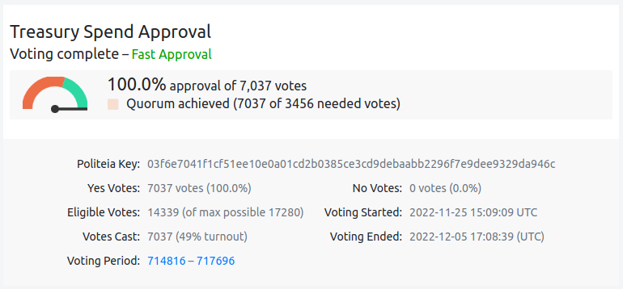
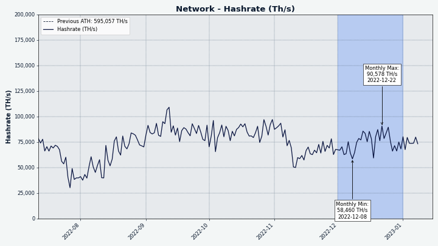
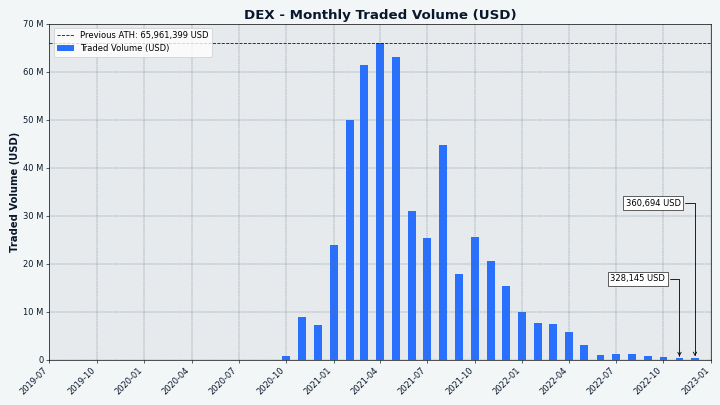

# Decred Journal – Grudzień 2022

_Obraz: oprawa artystyczna Bison Relay, aut. @saender_

Najważniejsze wydarzenia z grudnia:

- Uruchomiono Bison Relay. Ta innowacyjna sieć komunikacyjna zwiększająca prywatność i odporna na spam wykorzystuje Lightning Network sieci Decred do dołączania kosztów do wiadomości i odstraszania spamu i można już z niej korzystać.
- Liczba węzłów Lightning Network i jej pojemność wzrosła znacząco po uruchomieniu Bison Relay, ponieważ nowi użytkownicy otworzyli kanały i zaczęli płacić za wiadomości.
- Wydano DCRDEX v0.5.8, który wprowadza nowe, zaawansowane opcje.

Spis treści:

- [Uruchomienie Bison Relay](#bison-relay-launch)
- [Wydanie DCRDEX v0.5.8](#dcrdex-v058-release)
- [Rozwój](#development)
- [Ludzie](#people)
- [Zarządzanie](#governance)
- [Sieć](#network)
- [Ekosystem](#ecosystem)
- [Nawiązywanie kontaktów](#outreach)
- [Eventy](#events)
- [Media](#media)
- [Rynki](#markets)
- [Ważne kwestie i wiadomości poboczne](#relevant-external)

## Uruchomienie Bison Relay

Bison Relay to nowa platforma społecznościowa peer to peer z silnymi zabezpieczeniami przed cenzurą, inwigilacją i reklamą. Wiadomości są szyfrowane end-to-end, aby zapewnić, że tylko zamierzeni odbiorcy mogą zobaczyć ich treść. Aplikacja nie wymaga korzystania z konta (pojęcie to nie istnieje dla aplikacji), a metadane są zminimalizowane tak, że operatorzy serwerów nie mogą podejrzeć treści wiadomości, nadawcy, odbiorcy ani tego, w jakich czatach uczestniczy użytkownik. Wbudowane płatności pozwalają na monetyzację treści poprzez płatny dostęp lub napiwki.

Początkowe wydanie zawiera następujące funkcje (niepełna lista):

- Bezpośrednie czaty (rozmowy prywatne)
- Wysyłanie plików
- Czaty grupowe
- Tworzenie dłuższych postów za pomocą formatu Markdown i obrazów
- Komentowanie postów
- News feed z treściami od użytkowników, których subskrybujesz (funkcja mediów społecznościowych)
- Przekazywanie postów (repostowanie)
- Łączenie się z innymi użytkownikami poprzez pliki zaproszeń wysyłane przez istniejące kanały komunikacji lub bezpośrednio przez Bison Relay (Twoje istniejące kontakty łączą Cię z ich kontaktami, aka mediowana wymiana kluczy)
- Wysyłanie i odbieranie napiwków w DCR poprzez Decred Lightning Network
- Udostępnianie plików z opcjonalną ceną, którą użytkownicy płacą za dostęp
- Tworzenie i płacenie faktur Lightning
- Aplikacje GUI i wiersza poleceń dla Linux, macOS i Windows

Płatności za wysyłanie i odbieranie wiadomości służą jako ochrona antyspamowa, ale Bison Relay jest tani w użyciu, 0,1 DCR może wystarczyć na długie miesiące regularnego korzystania.

Większość użytkowników najbardziej zainteresuje aplikacja GUI [tutaj](https://github.com/companyzero/bisonrelay/releases); pobierz plik o nazwie `bisonrelay-xxx` dla swojego systemu operacyjnego. Pliki do pobrania nie mają jeszcze haseł ani podpisów, ale te zostaną dodane w przyszłości.

Oto jak korystać z Bison Relay:

- Oficjalne [funkcje](https://bisonrelay.org/features/) i [samouczek](https://bisonrelay.org/tutorial/)
- [2-minutowy przegląd w Wiadomościach Decred](https://www.youtube.com/watch?v=K6Cu4Gi7Lp0)
- [Konfiguracja Bison Relay v0.1.1 na macOS](https://www.youtube.com/watch?v=L4jm-VMPmBo)
- [Pierwsze spojrzenie i przegląd funkcji v0.1.1](https://www.youtube.com/watch?v=ukRkQC4IXoo)
- [News feed - podłączanie, tworzenie i używanie markdown](https://www.youtube.com/watch?v=NuKVAp4fIBY)

Po skonfigurowaniu przeczytaj [przewodnik onboardingowy](https://chat.decred.org/#/room/!GHnoHXSgkVAsUknRUg:decred.org/$tdpPg8WYSQGCizeGngYeoXSG_lCBrTnDxcuLGiZbfuI?via=decred.org&via=matrix.org&via=zettaport.com) i skontaktuj się z @kozel na Matrixie, aby otrzymać wstępne zaproszenie(a).

Zaawansowani użytkownicy mogą również sprawdzić [aplikację wiersza polecenia brclient](https://github.com/companyzero/bisonrelay/releases), [kod źródłowy serwera](https://github.com/companyzero/bisonrelay#server) i [dokumentację techniczną](https://github.com/companyzero/bisonrelay/tree/master/doc).

Aby zrozumieć motywację stojącą za Bison Relay, zachęcamy do lektury postów autorstwa @jy-p:

- [Problemy z zasięgiem, z jakimi borykał się Decred](https://blog.decred.org/2022/12/02/What-is-wrong-with-Decred/) z istniejącymi portalami i platformami social media
- Nieodłączne [problemy z dzisiejszą siecią](https://blog.decred.org/2022/12/09/Trapped-in-the-Web/)
- Wstępne [ogłoszenie Bison Relay](https://blog.decred.org/2022/12/14/Bison-Relay-The-Sovereign-Internet/) zawiera wysokopoziomowy opis projektu systemu i dlaczego był on wymagany do umożliwienia korzystania z wolności słowa i stowarzyszeń
- Ogłoszenie [na Twitterze](https://twitter.com/behindtext/status/1603470873503141903)

> Wniosek jest taki, że Decred powinien spróbować rozwinąć swoją sieć bez konwencjonalnego marketingu. Droga do przodu nie wiedzie przez, ale wokół. \[[Co jest nie tak z Decred?](https://blog.decred.org/2022/12/02/What-is-wrong-with-Decred/)>.]

## Wydanie DCRDEX v0.5.8

To wydanie naprawia problemy z zapytaniami o kursy walut z zewnętrznych źródeł i dodaje opcje dla zaawansowanych użytkowników wiersza polecenia i API Go, które pozwalają na pominięcie czasochłonnych operacji przy uruchamianiu i zamykaniu.

Wydanie v0.5.8 dostępne jest jako samodzielna aplikacja i można je pobrać [tutaj](https://github.com/decred/dcrdex/releases).

## Rozwój

O ile nie zaznaczono inaczej, prace zgłaszane poniżej mają status „scalonych z repozytorium głównym (master)”. Oznacza to, że prace są ukończone, zrecenzowane i zintegrowane z kodem źródłowym, który zaawansowani użytkownicy mogą [kompilować i uruchamiać](https://medium.com/@artikozel/the-decred-node-back-to-the-source-part-one-27d4576e7e1c), ale ich efekty nie są jeszcze dostępne w wersji plików binarnych dla zwykłych użytkowników.

### dcrd

_[dcrd](https://github.com/decred/dcrd) jest pełną implementacją węzła, który obsługuje sieć peer-to-peer Decred na całym świecie._

- Bezwzględne podawanie znanych filtrów, gdy peery poproszą o to za pomocą zapytania [`getcfilterv2`](https://github.com/decred/dcrd/pull/3035). Poprzednio węzeł nie serwował filtrów, dopóki jego łańcuch nie został w pełni zsynchronizowany z siecią. To ograniczenie zostało odziedziczone po starej logice filtrów bloom, gdzie pomagało uniknąć spadków wydajności, szczególnie podczas początkowej synchronizacji łańcucha. Wadą tego rozwiązania było to, że węzeł mógł wydawać się niereaktywny lub zatrzymany w różnych scenariuszach produkcyjnych i testowych. Filtry bloom zostały zastąpione przez filtry w wersji 2 i są one teraz stosunkowo tanie w obsłudze, więc węzeł może zawsze odpowiadać na żądania `getcfilterv2`, nawet przed pełną synchronizacją łańcucha.
- Zaktualizowano [dokumentację JSON-RPC API](https://github.com/decred/dcrd/pull/3032) dla metod używanych do odkrywania transakcji pasujących do określonych kryteriów: `loadtxfilter`, `notifynewtransactions` oraz `rescan`. Informacje o usuniętych metodach API i powiadomieniach zostały [usunięte](https://github.com/decred/dcrd/pull/3034).
- Mniejsze zmiany i porządki.

### dcrwallet

_[dcrwallet](https://github.com/decred/dcrwallet) to serwer portfela używany przez wiersz polecenia oraz aplikacje graficzne._

- Dodano przełącznik [`--cpuprofile`](https://github.com/decred/dcrwallet/pull/2195) do przechwytywania danych o wydajności procesora i zapisywania ich do pliku.
- Dodano pobieranie nowych [wypłat ze Skarbca w trybie SPV](https://github.com/decred/dcrwallet/pull/2194). Zostanie to wykorzystane przez portfel Decrediton do umożliwienia głosowania TSpend w większej ilości scenariuszy.
- Zmodyfikowano logikę [zakupu biletów](https://github.com/decred/dcrwallet/pull/1946) w celu wsparcia stakingu za pomocą portfela sprzętowego Trezor w nadchodzących zmianach w Decrediton. Ta zmiana łączy niektóre istniejące fragmenty kodu razem, a przyszłe zmiany skupią się na utrzymaniu biletów i ponownym uiszczeniu nieudanych opłat dla VSP. Staking DCR przechowywanych na portfelu Trezor jest bardzo pożądaną funkcją, więc należy się odrobina kontekstu. Połączenie podpisywania transakcji za pomocą Trezora, systemu stakingu Decred oraz nowszego systemu delegowania głosów do VSP (Voting Service Providers), stawia szereg wyzwań. Jednym z nich jest to, że VSP potrzebuje klucza prywatnego adresu do głosowania, aby zagłosować za pomocą biletu, ale Trezor nie pozwala na bezpośredni eksport kluczy prywatnych. Innym jest to, że Decrediton musi podpisać preferencje do głosowania dla każdego biletu zarządzanego przez VSP, ale zapytania dl Trezora o podpisanie każdej wiadomości jest słabe z perspektywy UX. Aby obejść te problemy, pewne dane prywatne, które można uzyskać od Trezora, zostaną użyte do wyprowadzenia kluczy do głosowania i podpisywania preferencji głosowania.
- Zaktualizowano zależności dla dodatkowych narzędzi wiersza polecenia: movefunds, repaircfilters i sweepaccount.

### Decrediton

_[Decrediton](https://github.com/decred/decrediton) to w pełni funkcjonalny desktopowy portfel ze zintegrowaną funkcją głosowania, mieszania StakeShuffle, Lightning Network, handlem na DEX i nie tylko. Działa z lub bez dostępu do pełnego łańcucha (tryb SPV)._

- Zaktualizowano moduł DCRDEX do wersji v0.5.7, co naprawia kilka przypadków brzegowych wokół [anulowania zamówień](https://github.com/decred/decrediton/pull/3840).
- Wprowadzono głosowanie dla [indywidualnych wydatków ze Skarbca - TSpend](https://github.com/decred/decrediton/pull/3787). Jeśli jakieś bilety są zarządzane przez VSP, zmienione preferencje głosowania biletów zostaną wysłane do VSP. Jeśli wykryte zostaną nowe, nieprzegłosowane TSpendy, na stronie głównej pojawi się powiadomienie. Istniejące zasady głosowania dla kluczy Skarbca i poszczególnych transakcji TSpend będą widoczne na stronie szczegółów biletu.
- Rozszerzono zakres automatycznych testów UI.

_Obraz: Głosowanie nad transakcją TSpend w Decreditonie._

### Politeia

_[Politeia](https://github.com/decred/politeia) to system składania propozycji w ekosystemie Decred, który służy do wnioskowania o środki ze Skarbca._

- Budowanie i testy pi-ui przy wykorzystaniu [Node w wersji 18 oraz 19](https://github.com/decred/pi-ui/pull/468).
- Poprawki testów.

### vspd

_[vspd](https://github.com/decred/vspd) to oprogramowanie serwera dla pul udziałów (Voting Service Provider). VSP oddaje głos za swoich użytkowników 24/7 oraz nie wchodzi w posiadanie żadnych środków, a tym samym nie może ich ukraść._

- Usunięto [sprawdzanie zduplikowanych adresów dla opłat](https://github.com/decred/vspd/pull/361), które nie skalowało się dobrze (potrzebowało ponad 500 ms, aby przejść przez bazę danych 100K biletów). Zduplikowanych adresów do opłat nie odnotowano nigdy w fazie rozwoju, testów, czy na produkcji.

### DCRDEX

_[DCRDEX](https://github.com/decred/dcrdex) to niepowiernicza giełda, umożliwiająca handel bez konieczności zaufania, działająca dzięki technologii atomic swaps._

[Wydanie v0.5.8](https://github.com/decred/dcrdex/releases/tag/v0.5.8):

- Dodano [opcje Core API](https://github.com/decred/dcrdex/pull/1568), aby pominąć czasochłonne operacje podczas uruchamiania i zamykania. `NoAutoWalletLock` wyłącza blokowanie portfela przy zamykaniu, co jest przydatne do uniknięcia potencjalnie [bardzo długiej](https://github.com/decred/dcrdex/pull/1568#discussion_r998877146) operacji odblokowania. `NoAutoDBBackup` wyłącza automatyczne tworzenie kopii zapasowych bazy danych przy wyłączaniu. `UnlockCoinsOnLogin` instruuje portfel, aby odblokować wszystkie monety (wyjścia) zablokowane indywidualnie przy logowaniu lub tworzeniu portfela, to automatyzuje ręczne odzyskiwanie z wielu [problemów](https://github.com/decred/dcrdex/pull/1568#discussion_r998880897) spowodowanych przez upuszczone połączenia i awarie podczas składania zamówienia. Te opcje mogą być również ustawione za pomocą nowych przełączników dla aplikacji `dexc` z wiersza polecenia, ale są one naprawdę przeznaczone dla ludzi piszących własny kod Go do kontroli klienta DEX poprzez API `Core`.
- Poprawiono obsługę nieudanych [zapytań o kursy fiat](https://github.com/decred/dcrdex/commit/2ae50bb7617706c62b86e4b16b684744c995c818) do zewnętrznych usług i dostosowano ich częstotliwość, aby uniknąć uderzenia w limity połączeń.

Zmiany poniżej scalone z gałęzią `master` na poczet przyszłych wydań.

Ethereum:

- Dodano obsługę klienta i serwera dla swapów z [testnetem USDC](https://github.com/decred/dcrdex/pull/1733).
- Dodano możliwość połączenia klienta i serwera DEX przez [uwierzytelniony WebSocket](https://github.com/decred/dcrdex/pull/1963) z pełnym węzłem Geth. Dzięki temu użytkownicy mogą uruchomić Geth na osobnej maszynie.

Kaucje (klient):

- Połączono trzecią partię implementacji [kaucji](https://github.com/decred/dcrdex/pull/1820), budując na niższym poziomie API oraz kod serwera dodany w październiku i listopadzie. Ta partia dodaje wewnętrzny kod klienta do tworzenia, przechowywania, wysyłania, potwierdzania i zwrotu kaucji, jak również komendę dla `dexc` do wysyłania kaucji z wiersza polecenia. Implementacja kaucji została podzielona na fazy, aby umożliwić przegląd i postęp równolegle z wieloma innymi zmianami. Następnym krokiem jest utrzymanie poziomu konta, odnowienie kaucji, ustawienia i komponenty UI.
- Udokumentowano kaucje w [specyfikacji](https://github.com/decred/dcrdex/pull/1994).
- Podsumowując, blokowane czasowo [kaucje](https://en.wikipedia.org/wiki/Fidelity_bond) zastąpią obecny system opłat rejestracyjnych. Użytkownicy będą blokować środki w kaucjach i zdobywać uprawnienia do handlu, tak długo, jak ich poziom bedzie wystarczająco wysoki (możliwie kompensując złe zachowania na rynkach, takie jak zbyt częste anulowanie zamówień). Kiedy dostęp do handlu nie będzie już potrzebny, kaucja może zostać wykupiona, aby odzyskać środki. System kaucji jest warunkiem koniecznym do zbudowania [siatki serwerów](https://github.com/decred/dcrdex/issues/1765).

Pozostałe zmiany klienta:

- Zmieniono [sekwencję logowania](https://github.com/decred/dcrdex/pull/1903), aby lepiej obsługiwała wielokrotne próby logowania i unikała powtarzania kroków inicjalizacji. Dodano ostrzeżenie zachęcające do odblokowania portfeli tak szybko, jak to możliwe, aby przetworzyć aktywne transakcje.
- Zaktualizowano [szacowanie opłat](https://github.com/decred/dcrdex/pull/1967) wspólne dla aktywów podobnych do Bitcoina i dodano zewnętrzny estymator opłat dla DOGE. Zewnętrzne szacowanie opłat jest przydatne jako rozwiązanie awaryjne dla portfeli SPV (lekkich), a także RPC (pełnych), które zostały uruchomione niedawno, gdy ich szacowanie opłat nie zostało jeszcze skalibrowane.
- Dodano [wartości domyślne](https://github.com/decred/dcrdex/pull/1981) dla portfeli utworzonych przez RPC. Ma to pomóc w testowaniu na simnecie.
- Przeniesiono więcej ciągów [plików tłumaczeń](https://github.com/decred/dcrdex/pull/1980).
- [Skompaktowano bazy danych](https://github.com/decred/dcrdex/pull/1987) tak, aby bardziej agresywnie zwalniać miejsce i dokładniej raportować oszczędności.
- Dodano bardziej szczegółowe [raportowanie postępu](https://github.com/decred/dcrdex/pull/1997) podczas logowania.
- Dodano [tłumaczenie na jęz. arabski](https://github.com/decred/dcrdex/pull/1898) i wymagane poprawki do wyświetlania tekstu od prawej do lewej.
- Poprawiono [usuwanie pliku dziennika](https://github.com/decred/dcrdex/pull/1946) podczas odzyskiwania portfela SPV.
- Naprawiono [wartość fiat](https://github.com/decred/dcrdex/pull/1983) na formularzu Wyślij nie zawierającą opłaty za transakcję.
- Poprawiono obsługę opcji [wstępnego podziału rozmiaru środków](https://github.com/decred/dcrdex/pull/1988). Ta opcja tworzy dodatkową "podzieloną transakcję", aby przygotować dokładną ilość środków potrzebnych do wykonania zamówienia, co pozwala uniknąć zablokowania większej ilości środków niż potrzeba, ale kosztem dodatkowych opłat za podział. Poprawka pozwala uniknąć transakcji wstępnej, gdy nie przynosi ona korzyści. Również UX został uspójniony, zawsze pokazując opcję, ale wyjaśniając, dlaczego została wyłączona. Wreszcie, kolejna poprawka wyłącza pre-sizing dla [natychmiastowych zleceń rynkowych](https://www.investopedia.com/terms/i/immediateorcancel.asp), ponieważ muszą one zostać wykonane szybko.
- Inne poprawki.

_Obraz: Pierwsza wymiana pomiędzy USDC oraz DCR na testnecie._

### dcrdata

_[dcrdata](https://github.com/decred/dcrdata) to eksplorator blockchaina Decred oraz danych off-chain, takich jak propozycje na platformie Politeia, rynków i ponadto._

Zmiany skierowane do użytkowników:

- Zasady i postępy [głosowania w sprawie wydatków ze Skarbca](https://github.com/decred/dcrdata/pull/1918) stały się łatwiejsze do zrozumienia i śledzenia. Strony transakcji wydatków skarbowych pokażą, jak aktualne głosowania mają się do minimalnego kworum i wymagań procentowych głosów na "tak", przybliżone daty kalendarzowe rozpoczęcia i zakończenia głosowania, który klucz Politeia podpisał transakcję TSpend, i więcej. Przykład ostatniej transakcji TSpend można zobaczyć [tutaj](https://tip.dcrdata.org/tx/49f141f51421a499d319bc617a4430f87db3a73ffa605dee8408eefb081bd11b).
- Naprawiono rzadki błąd polegający na tym, że [niezatwierdzone transakcje](https://docs.decred.org/governance/overview/#block-voting), które zostały później włączone do zatwierdzonego bloku [nieprawidłowo wyświetlały swoje wyjścia jako niewydane](https://github.com/decred/dcrdata/pull/1938). W całej historii łańcucha dotyczyło to mniej niż 20 transakcji.
- Inne poprawki i ulepszenia UI.

Zmiany dla deweloperów oraz API:

- Usunięto niektóre [importy dcrwallet](https://github.com/decred/dcrdata/pull/1887), aby uprościć aktualizacje do nowych modułów dcrd.
- Usunięto wymóg uruchomienia dcrd z włączonym indeksem adresów, ponieważ został on [usunięty z dcrd](https://github.com/decred/dcrd/pull/2930). Usunięto użycie metody `searchrawtransactions` dcrd (która polega na indeksie adresowym) na rzecz własnej bazy danych dcrdata, która posiada wszystkie potrzebne informacje.
- Dodano dwa pola do [API danych transakcji](https://github.com/decred/dcrdata/pull/1946): `tree` (bloki Decred przechowują transakcje w drzewach regularnych i stake) oraz `type` (transakcje Decred mogą być typu `regular`, `ticket`, `vote`, `revocation`, `coinbase`, `treasurybase`, `treasury add`, `treasury spend`).

_Obraz: Dzięki dcrdata łatwiej teraz śledzić głosowania nad transakcjami TSpend._

### Bison Relay

_[Bison Relay](https://github.com/companyzero/bisonrelay) to nowa platforma mediów społecznościowych peer-to-peer z silną ochroną przeciw cenzurze, inwiligacji, oraz reklamom, działająca na bazie Lightning Network projektu Decred._

Bison Relay został ujawniony po 2 latach wstępnego [rozwoju](https://blog.decred.org/2022/12/14/Bison-Relay-The-Sovereign-Internet/) przez Company 0. Szczegóły dotyczące użytkowników końcowych można znaleźć w [ogłoszeniu](#bison-relay-launch) powyżej, a tutaj skupimy się na technologii i ostatnich zmianach w kodzie źródłowym.

Przegląd stosu technologicznego Bison Relay:

- [Serwer](https://github.com/companyzero/bisonrelay#server) jest napisany w Go i używa PostgreSQL do przechowywania danych.
- Klient [wiersza polecenia](https://github.com/companyzero/bisonrelay#cli-client) jest napisany w Go i implementuje [tekstowe UI](https://en.wikipedia.org/wiki/Text-based_user_interface) podobne do Irssi lub WeeChat.
- [Klient GUI](https://github.com/companyzero/bisonrelay/tree/master/bruig) jest wieloplatformową aplikacją napisaną w Dart, Flutter i korzysta z biblioteki Go implementującej protokół Bison Relay. [Flutter](https://flutter.dev) jest obiecującą platformą do budowania międzyplatformowych aplikacji GUI dla głównych systemów desktopowych (Linux, macOS, Windows) i mobilnych (Android, iOS) z jednej bazy kodu.
- Wszystkie komunikaty od klienta do serwera są podwójnie szyfrowane przy użyciu tunelu TLS jako warstwy zewnętrznej i `NaCl secretbox` jako warstwy wewnętrznej.
- Cała komunikacja między klientami jest szyfrowana za pomocą [podwójnego mechanizmu zapadkowego](https://signal.org/docs/specifications/doubleratchet/) (trzecia warstwa szyfrowania) z kluczami, które posiadają tylko klienty.
- Więcej szczegółów można znaleźć w [folderze dokumentacji](https://github.com/companyzero/bisonrelay/tree/39015e62770ae6b18e73599a6fe497ceec463047/doc) i [przeglądzie protokołu](https://github.com/companyzero/bisonrelay/blob/39015e62770ae6b18e73599a6fe497ceec463047/rpc/README.md#protocol).

Aplikacja GUI, zmiany wprowadzone w wersji [v0.1.1](https://github.com/companyzero/bisonrelay/releases/tag/v0.1.1):

- Naprawiono wiele [problemów](https://github.com/companyzero/bisonrelay/pull/13) z powiadomieniami, układem i formatowaniem liczb.
- Naprawiono możliwość [utknięcia](https://github.com/companyzero/bisonrelay/pull/21) użytkownika po niedokończonej konfiguracji ziaren i dodano możliwość [usunięcia](https://github.com/companyzero/bisonrelay/pull/42) niedokończonego portfela.
- Naprawiono nieczytelny kolor czcionki w [odciskach palców serwera](https://github.com/companyzero/bisonrelay/pull/21).
- Naprawiono uderzanie w [limit luki](https://github.com/companyzero/bisonrelay/pull/39) podczas otwierania kanałów LN.
- Inne poprawki.

Aplikacja GUI app, zmiany na gałęzi `master` na poczet następnego wydania:

- Dodano zapisywanie/przywracanie niewysłanych [wersji roboczych wiadomości](https://github.com/companyzero/bisonrelay/pull/43) przy zmianie widoku na inny.
- Dodano stronę [przywracania ziaren](https://github.com/companyzero/bisonrelay/pull/58).
- Dodano przycisk do [kopiowania ziaren](https://github.com/companyzero/bisonrelay/pull/58) do schowka.
- Dodano obsługę zapisywania i przywracania plików [Static Channel Backup](https://docs.decred.org/lightning-network/backups/) (SCB). Środki zablokowane w kanałach LN nie mogą być odzyskane jedynie z ziarna portfela. Dane odzyskiwania, które nie mogą być generowane z ziarna, są przechowywany w plikach SCB.
- Zmieniono [tytuł okna](https://github.com/companyzero/bisonrelay/pull/64) na "Bison Relay".

Aplikacja GUI app, ulepszony onboarding:

- Wyświetlanie [wskazówek](https://github.com/companyzero/bisonrelay/pull/58) na pustej stronie czatów, aby dodać środki, utworzyć kanały oraz połączyć się z innymi użytkownikami za pomocą zaproszeń.

Aplikacja GUI, poprawki:

- Naprawiono brak [autofokusu](https://github.com/companyzero/bisonrelay/pull/43) pola wprowadzania danych podczas przełączania czatów.
- Poprawiono kolor [nieczytelnego tekstu](https://github.com/companyzero/bisonrelay/pull/64) w wielu miejscach.

Aplikacja CLI:

- Ograniczenie [wyświetlanego tytułu](https://github.com/companyzero/bisonrelay/pull/57) do 255 znaków.
- Wyrównanie [znaczników czasu komentarzy](https://github.com/companyzero/bisonrelay/pull/60) do prawej.
- Dodano opcję zaimportowania [kopii zapasowej SCB](https://github.com/companyzero/bisonrelay/pull/65) przy odtwarzaniu portfela z ziarna.
- Naprawiono awarię podczas [repostowania](https://github.com/companyzero/bisonrelay/issues/52).

Strona [bisonrelay.org](https://bisonrelay.org) to strona statyczna zbudowana za pomocą Hugo, Bootstrapa, oraz SCSS. Kod źródłowy strony jest też [publiczny](https://github.com/companyzero/bisonrelay-web).

Grudniowe zmiany na stronie:

- [Przygotowanie do wydania](https://github.com/companyzero/bisonrelay-web/commit/05d95d8a2bc04b63659aea930036f1e1c3db87e2).
- Animowana [strzałka w dół](https://github.com/companyzero/bisonrelay-web/commit/0c0ff8e3ac90883ec68d7664b3b1e737ad38f9ac).
- Dodano tekst dla strony [funkcji](https://github.com/companyzero/bisonrelay-web/commit/207cf5aba58dfb2aedb5ad5483a126254c9c4b60).
- Dodano [stronę](https://github.com/companyzero/bisonrelay-web/commit/aca241b3dfa6010b85fe7076fb27ccdef4c66622) [samouczka](https://github.com/companyzero/bisonrelay-web/commit/70a6eac099d4b440b52c2884f26a8638d840ab4d).

Przyszłe plany dotyczące Bison Relay zostały [ogłoszone](https://www.youtube.com/watch?v=K6Cu4Gi7Lp0&t=47s) na samym BR:

> projektujemy następny zestaw funkcji dla br, który obejmuje możliwość posiadania pewnego rodzaju "stron", zarówno dla treści, jak i jako witrynę sklepu. Obecna iteracja tej funkcji polega na tym, że klient może dostarczyć "strony", które inni klienci wymieniani kluczami mogą przeglądać i wchodzić w nimi w interakcje w jakiś sposób.
\[@jy-p w dniu 2022-12-18\]

## Ludzie

Witamy nowych, po raz pierwszych udzielających swych umiejętności współtwórców:

- c12 ([Decred Magazine](https://www.decredmagazine.com/author/c12/), autor, [@c12hz](https://twitter.com/c12hz) na Twitterze)

Statystyki społeczności na dzień 4. stycznia (w porównaniu z 2. grudnia):

- Obserwujący na [Twitterze](https://twitter.com/decredproject): 53392 (-342)
- Subskrybenci na [Reddit](https://www.reddit.com/r/decred/): 12648 (+14)
- Użytkownicy na [Matrixie](https://chat.decred.org/) w pokoju #general:738 (+9)
- Użytkownicy na [Discordzie](https://discord.gg/GJ2GXfz): 1530 (-348 - czystka nieaktywnych użytkowników), zweryfikowanych z możliwością pisania: 929 (-7)
- Użytkownicy na [Telegramie](https://t.me/Decred): 2872 (-22)
- Subskrybenci na [YouTube](https://www.youtube.com/decredchannel): 4640 (+0), wyświetleń: 221K (+2K)

Na naszym głównym twitterowym koncie, [@decredproject](https://twitter.com/decredproject), [odnotowano](https://chat.decred.org/#/room/!ggjLwhBHTjsMROezFf:decred.org/$ym0IL1s6fWqw9iu21vnMzVm1jmR0kdPm_4V3fKkV5Zs?via=decred.org&via=matrix.org&via=planetdecred.org) aplikację 2 z 4 banów: Ghost Ban oraz Reply Deboosting, zgodnie z [Twitter Shadowban Check](https://shadowban.jp/). Podobno nie tak dawno aktywne były wszystkie 4. Ten i inne [raporty](https://twitter.com/behindtext/status/1610663633498869760) poniekąd wyjaśniają popularność naszych treści na Twitterze.

## Zarządzanie

W grudniu nowy [Skarbiec](https://dcrdata.decred.org/treasury) otrzymał 8712 DCR o wartości 172 tys. USD po średnim grudniowym kursie wymiany $19,79. 3907 DCR zostało wydane, aby zapłacić kontrahentom (lecz transakcja nie została wydobyta aż do 3. stycznia), co stanowiło wartość $77K po grudniowym kursie wymiany, lub $86K po listopadowym kursie rozliczeniowym $21,92.

Transakcja [wypłaty ze Skarbca](https://dcrdata.decred.org/tx/49f141f51421a499d319bc617a4430f87db3a73ffa605dee8408eefb081bd11b) zawierała 24 wyjścia dokonujące płatności na rzecz kontrahentów, od 5 DCR do 1270 DCR.

Na dzień 7. stycznia, łączne saldo [starego](https://dcrdata.decred.org/address/Dcur2mcGjmENx4DhNqDctW5wJCVyT3Qeqkx) i [nowego Skarbca](https://dcrdata.decred.org/treasury) wynosi 834055 DCR (15,6 miliona USD po kursie $18.70).

W grudniu na Politei nie pojawiły się żadne propozycje.

## Sieć

**Hashrate**: grudniowy [hashrate](https://dcrdata.decred.org/charts?chart=hashrate&scale=linear&bin=day&axis=time) na początku miesiąca wyniósł ~67 Ph/s a zamknął go na poziomie ~68 Ph/s, zaliczając niż w ok. 58 Ph/s oraz szczyt w wys. 91 Ph/s w ciągu miesiąca.

_Obraz: Moc obliczeniowa projektu Decred._

Dystrybucja mocy obliczeniowej w wys. 75 Ph/s [zadeklarowana](https://miningpoolstats.stream/decred)  przez pule wydobywcze na dzień 1. stycznia: Poolin 55%, F2Pool 38%, BTC.com 5%, AntPool 2,7%.

Podział 1000 bloków [wydobytych](https://miningpoolstats.stream/decred) przed 4. stycznia: Poolin 55%, F2Pool 36%, (prawdopodobnie) BTC.com 5%, (prawdopodobnie) AntPool 2,6%, CoinMine 0,4%, nieznany 0,9%.

_Obraz: Dystrybucja mocy obliczeniowej pul wydobywczych._

_Obraz: Historyczny wykres dystrybucji mocy obliczeniowej pul wydobywczych._

**Staking**: [Cena biletów](https://dcrdata.decred.org/charts?chart=ticket-price&axis=time&visibility=true-true&mode=stepped) wahała się między 234 a 244 DCR, a jej 30-dniowa [średnia](https://dcrstats.com/) wyniosła 234,8 DCR (+3,3).

[Zablokowana suma](https://dcrdata.decred.org/charts?chart=ticket-pool-value&scale=linear&bin=day&axis=time) to pomiędzy 9,46 a 9,62 miliona DCR (nowy szczyt), co oznacza, że 64,0-64,8% podaży dostępnej w obiegu [wzięło udział](https://dcrdata.decred.org/charts?chart=stake-participation&scale=linear&bin=day&axis=time) w elemencie Proof of Stake.

**VSP**: Na 1. stycznia, ~7120 (+190) biletów w puli zarządzanych było przez [17 oficjalnych VSP](https://decred.org/vsp/) serwerów vspd, co stanowi 17,2% całej puli biletowej (+0,4%). Dane te nie uwzględniają vspd.stakey.com, który [podaje nieaktualne dane przez API](https://github.com/decred/dcrwebapi/pull/171).

Największe wzrosty w grudniu odnotowały vspd.bass.cf (+371), big.decred.energy (+179) oraz vspd.99split.com (+178).

_Obraz: Dystrybucja biletów zarządzanych przez VSP._

**Węzły**: [Decred Mapper](https://nodes.jholdstock.uk/user_agents) odnotował 79 węzłów dcrd na dzień 1. stycznia: v1.7.5 - 27%, v1.7.1 - 27%, v1.8.0 dev buildy - 23%, v1.7.2 - 11%, v1.7.0 - 6%, v1.7.4 - 2.5%, pozostałe - 4%.

_Obraz: Wersje dostępnych węzłów dcrd._

_Obraz: Historyczna dystrybucja wersji węzłów dcrd, dane z nodes.jholdstock.uk._

Ilość [monet mieszanych](https://dcrdata.decred.org/charts?chart=coin-supply&zoom=jz3q237o-la8vk000&scale=linear&bin=day&axis=time&visibility=true-true-true) wahała się w granicach 61,1-61,4%, lub 9,02-9,10 miliona DCR (nowy szczyt). Dzienna [kwota mieszana](https://dcrdata.decred.org/charts?chart=privacy-participation&bin=day&axis=time) oscylowała w granicach 291-479K DCR.

Uruchomienie Bison Relay miało duży wpływ na LN sieci Decred. Porównanie statystyk zaobserwowanych przez węzeł @karamble pomiędzy 1. grudniem i 19. grudniem: węzły 67 -> 120, kanały 104 -> 212, pojemność 40,6 -> 91,1.

Eksplorator [Lightning Network](https://ln-map.jholdstock.uk/) sieci Decred ponownie działa i na 4. stycznia odnotował 130 węzłów oraz 233 kanały o całkowitej pojemności 100,7 DCR. Statystyki te zależą od węzła LN. Na przykład, tego samego dnia węzeł @karamble odnotował 144 węzły oraz 312 kanałów o pojemności 154 DCR.

## Ekosystem

VSP vspd.synergy-crypto.net został [usunięty](https://github.com/decred/dcrwebapi/pull/172) z API po przegłosowaniu jego pozostałych biletów. Działał od czerwca 2021 roku i przegłosował łącznie 892 bilety. Wyłączenie zostało wykonane bezbłędnie: przestał przyjmować nowe bilety w sierpniu 2022 roku, a przez następne 4 miesiące wszystkie pozostałe bilety zagłosowały.

Poloniex ponownie włączył rynek DCR/BTC, który był zamrożony od 30 września, kiedy to giełda [zatweetowała](https://twitter.com/PoloSupport/status/1575745498933522432), że portfel DCR jest nadal w konserwacji (od stycznia 2022). Rynek został po raz pierwszy ponownie włączony 28 listopada, ale szybko został ponownie zamrożony na kolejny tydzień, aż do pełnego przywrócenia 5 grudnia.

Binance odrzucał wypłaty DCR przez około 10 dni. Pierwsze raporty o odrzuconych wypłatach [pojawiły się](https://chat.decred.org/#/room/!teQafvHMYpIbqLIieU:decred.org/$T5Mv2ATD2vgdbAlbIZ7BNGjRTNNWwPqIvzrfELK4vXc?via=decred.org&via=matrix.org&via=t2bot.io) około 12 grudnia. Niektóre przeszły 14 grudnia, ale następnego dnia więcej wypłat zostało zawieszonych. Binance podzielił się sprzecznymi informacjami na temat przyczyny przestoju. Wsparcie na [Twitterze](https://twitter.com/BinanceHelpDesk/status/1603293107633594369) nazwało to "standardową procedurą konserwacyjną". W jednym bilecie wsparcia podano, że sieć DCR jest "zajęta", ale później ujawniono, że nie ma wystarczających środków w gorącym portfelu. [Aktualizacje konserwacji portfela](https://www.binance.com/en/support/announcement/c-157?navId=157) nie wymieniają żadnych postów na temat tego problemu w chwili pisania. Problem został rozwiązany około 22 grudnia. Blockchain działał zgodnie z oczekiwaniami i nie zaobserwowano żadnych przestojów ani problemów w innych miejscach sieci.

Dołączcie do naszego kanału [#ecosystem](https://chat.decred.org/#/room/#ecosystem:decred.org), aby śledzić wszelkie nowości związane z ekosystemem Decred.

Uwaga: autorzy Decred Journal nie są w stanie ocenić wiarygodności żadnego z powyższych podmiotów czy ich usług. Uprasza się o dołożenie należnych starań i własnoręczną weryfikację informacji przed powierzeniem jakichkolwiek środków innym stronom.

## Nawiązywanie kontaktów

Osiągnięcia Monde PR:

- Zaproponowano informację o nowościach w projekcie
- Zdobyto 1 wywiad w mediach
- Zaproponowano 8 felietonów z komentarzem

Umieszczono w mediach poniższe artykuły:

- Artykuł w [CoinJournal](https://coinjournal.net/news/expert-panel-what-mistakes-should-users-avoid-when-attempting-to-buy-cryptocurrencies/) zawierający komentarz @jy-p na temat błędów, których należy unikać przy zakupie kryptowalut.
- Artykuł w [CoinJournal](https://coinjournal.net/news/expert-panel-what-is-your-biggest-tip-for-a-user-just-getting-into-crypto/) zawierający komentarz @jy-p na temat wskazówek dla osób dopiero wchodzących w kryptowaluty.
- Artykuł w [CoinJournal](https://coinjournal.net/news/expert-panel-what-are-the-3-most-important-things-to-look-out-for-when-choosing-a-crypto-platform-to-sign-up-to/) zawierający komentarz @jy-p na temat tego, jak wybrać platformę kryptowalutową.
- Artykuł w [Cryptonews](https://cryptonews.com/news/today-in-crypto-decred-launches-social-media-messaging-platform-opera-announces-a-suite-of-security-features-t-systems-mms-participates-in-chainlink-staking.htm) o uruchomieniu Bison Relay.
- Artykuł w [Invezz](https://invezz.com/news/2022/12/16/decred-launches-new-social-media-platform-bison-relay/) o uruchomieniu Bison Relay.
- @jy-p udzielił wywiadu w [Piece of the Py](https://www.youtube.com/watch?v=OS_AOyMdAeU), omawiając uruchomienie Bison Relay, wykorzystanie Decred w wyborach w Brazylii w 2022 roku oraz uruchomienie DCRDEX v0.5.
- Artykuł w [BeInCrypto](https://beincrypto.com/focus-on-decentralization-and-empower-users-in-2023-says-industry/) zawierający komentarz @jz na temat skupienia się na decentralizacji w 2023 roku, ze wzmianką o DCRDEX.

## Eventy

**Na których byliśmy:**

- @arij uczestniczyła w panelu dyskusyjnym "Kobieca przedsiębiorczość" organizowanym przez JCI Casablanca (w ramach 17. edycji wydarzenia Wieczoru Przdsiębiorców). Opowiadała o swoich doświadczeniach z branżą IT, kryptowalutami, o tym, jak działa DAO Decred i jak to jest dla niego pracować. Więcej szczegółów i linków w [relacji](https://decredcommunity.github.io/events/index/20221220.1).

## Media

**Wybrane artykuły:**

- [Co jest nie tak z Decred?](https://blog.decred.org/2022/12/02/What-is-wrong-with-Decred/), aut. @jy-p
- [Pogodziwszy się z degeneracją, część 1 - NFT na Decred ](https://www.decredmagazine.com/embracing-degeneracy-part-1-decred-nfts/), aut. @c12hz
- [Uwięzieni w sieci](https://blog.decred.org/2022/12/09/Trapped-in-the-Web/), aut. @jy-p
- [Bison Relay: Niezależny Internet](https://blog.decred.org/2022/12/14/Bison-Relay-The-Sovereign-Internet/), aut. @jy-p
- [P2P World Wide Web](https://www.decredmagazine.com/the-p2p-world-wide-web-bison-relay/), aut. @phoenixgreen
- [Wyobrażając sobie przyszłość Bison Relay](https://www.decredmagazine.com/imagining-the-future-of-bison-relay/), aut. @c12hz
- [Co robi dcrd?](https://www.decredmagazine.com/what-does-dcrd-do/), aut. @phoenixgreen i @zippycorners
- [Decred vs Bitcoin: Od początku do końca!](https://www.decredmagazine.com/decred-vs-bitcoin-from-start-to-the-end/), aut. @Joao
- [Przebijanie się przez fasadę ułudy mediów społecznościowych](https://www.decredmagazine.com/breaking-through-the-facade-of-social-media-delusion/), aut. @BlockchainJew
- [Końcoworoczne podsumowanie Decred w 2022 r.](https://www.decredmagazine.com/decred-2022-end-of-year-summary/), aut. @phoenixgreen
- [Nauka z 2022 roku](https://www.decredmagazine.com/ftx-a-learning-from-2022/), aut. @HassanMaishera

Statystyki aktywności [Decred Magazine](https://www.decredmagazine.com/) za grudzień:

- Całkowita liczba artykułów na DM: 371
- Subskrybentów newslettera: 83
- Opublikowane nowe posty i newslettery: 22
- Aktywne kampanie w mediach społecznościowych: 25
- Zakończone kampanie w mediach społecznościowych 27
- Posty w mediach społecznościowych: 214
- Polubienia: 1040
- Retweety: 169
- Liczba obserwujących na wszystkich kontach i platformach mediów społecznościowych: 1090

**Wideo:**

- [2022 rok niedźwiedzia - Decred i stan rynku](https://www.youtube.com/watch?v=PO2byx7D8z0) z udz. @phoenixgreen, @Exitus i @Tivra (podcast [wersja audio](https://anchor.fm/decred-magazine/episodes/2022-the-year-of-the-bear---Decred-and-the-state-of-the-market-e1rnn2k))
- [Decred i rewolucja atomic swaps - Fundamenty DCRDEX](https://www.youtube.com/watch?v=JyBoe1z5h9U), aut. @phoenixgreen - dostępny również jako [podcast](https://anchor.fm/decred-magazine/episodes/Decred-and-the-Atomic-Swap-Revolution---DCRDEX-Fundamentals-e1s85ne) oraz jako [wersja tekstowa](https://www.decredmagazine.com/decred-and-the-atomic-swap-revolution/)
- [Konfiguracja BisonRelay 0.1.1 na macOS](https://www.youtube.com/watch?v=L4jm-VMPmBo), aut. @phoenixgreen
- [Bison Relay - Pierwsze spojrzenie (wersja 0.1.1)](https://www.youtube.com/watch?v=ukRkQC4IXoo), aut. @phoenixgreen
- [Moja pogawędka z założycielem Decred/CEO Jake'iem](https://www.youtube.com/watch?v=OS_AOyMdAeU), aut. Py Patel w Piece of the Py
- [Wiadomości Decred - Bison Relay - chat P2P + social media na Lightning już wylądował! Wielkie aktualizacje!](https://www.youtube.com/watch?v=K6Cu4Gi7Lp0), aut. @Exitus

**Audio:**

Nowe nagrania z Twitter Spaces:

- [Bison Relay: Niezależny Internet](https://twitter.com/i/spaces/1ZkKzXlVvZqJv), aut. @Tivra i @kozel z udz. wielu członków społeczności. 1.7K ludzi wysłuchało audycji (na żywo + nagranie). Dostępna również na [Anchor](https://anchor.fm/decred-magazine/episodes/Bison-Relay-The-Sovereign-Internet-e1sebd4) oraz innych platformach podcastowych.
- [Badając możliwości zdecentralizowanych mediów społęcznościowych](https://twitter.com/i/spaces/1ypKddnRQZvKW) - aut. @Tivra i @kozel z udz. członków społeczności, odsłuchane ~550 razy. ([Anchor](https://anchor.fm/decred-magazine/episodes/Bison-Relay---Exploring-Possibilities-of-Decentralized-Social-Media---Decred-Twitter-Space-e1smab7))

**Coś dla oka i serca:**

- [Piorunujący](https://twitter.com/karamblez/status/1604033417519177728) obraz celebrujący wydanie Bison Relay, aut. @karamble
- [2023: Decred, odyseja krypto](https://www.decredmagazine.com/2023-decred-a-crypto-odyssey/), aut. @OfficialCryptos

**Tłumaczenia:**

- Wydania wrzesień - listopad Decred Journal 2022 wzbogaciły się o 4 nowe [tłumaczenia](https://xaur.github.io/decred-news/) na jęz. chiński (@Dominic) oraz jęz. polski (@kozel). Dziękujemy za szerzenie dobrej nowiny!

**Treści nieanglojęzyczne:**

- [Decred Une Crypto Trop Meconnue 🧐 Pour Combien dE Temps ? 🔥 Par des anciens DEV du Bitcoin 💎](https://www.youtube.com/watch?v=GeSpRLr3_94) (przegląd projektu i analiza techniczna, w jęz. francuskim)

## Rynki

W grudniu kurs wymiany DCR mieścił się w przedziale USDT 18,20-24,80 / BTC 0,00110-0,00145. Średni dzienny kurs wynosił $19,79.

Nowy rynek DCR/USDT na Poloniexie odnotował około 1070 DCR średniego wolumenu dziennie, znacznie więcej niż 230 DCR/dzień na starej parze DCR/BTC. Co ciekawe, rynek DCR/BTC był zamrożony przez pierwszy tydzień, podczas gdy DCR/USDT był aktywny.

_Obraz: Miesięczny wolumen DCRDEX, w USD._

## Ważne kwestie i wiadomości poboczne

W listopadzie [wyciekły](https://www.coindesk.com/policy/2022/11/15/privacy-enhancing-crypto-coins-could-be-banned-under-leaked-eu-plans/) plany zdelegalizowania kryptowalut zwiększających prywatność w UE. Plany zostały przedstawione przez czeskich urzędników, którzy obecnie przewodniczą rozmowom. Dostawcy usług kryptowalutowych i inne instytucje zostałyby zakazane w ramach propozycji posiadania lub wykorzystywania kryptowalut zwiększających prywatność.

W Brazylii Kongres [uchwalił](https://decrypt.co/116011/brazil-crypto-payments) ustawę regulującą płatności kryptowalutowe, która pozwoli bankom oferować usługi wokół aktywów kryptowalutowych, a także obejmuje takie rzeczy jak punkty lotnicze.

Avraham Eisenberg, frontman, który publicznie przypisywał sobie zasługi za "wysoce zyskowną strategię handlową", która pozbawiła Mango Markets 110 milionów dolarów, został [aresztowany](https://decrypt.co/118045/mango-markets-attacker-avraham-eisenberg-arrested-charged-with-market-manipulation-offenses) i oskarżony o przestępstwa związane z manipulacją rynkową.

SBF został oskarżony o szereg przestępstw i zgodził się na [ekstradycję](https://cointelegraph.com/news/sbf-signs-extradition-papers-set-to-return-to-face-charges-in-the-us) do USA, gdzie nałożono na niego kaucję w wysokości 250 milionów dolarów pod warunkiem, że pozostanie w domu swoich rodziców. Nazwiska niektórych zamożnych współpracowników, którzy pokryli część kaucji, zostały utrzymane [w tajemnicy](https://decrypt.co/118298/sbf-keep-bail-bond-cosigners-secret-like-lawyers-for-ghislaine-maxwell), co jest dość nietypowe. Proces ma się rozpocząć w październiku 2023 roku.

[Ujawniono](https://twitter.com/fintechfrank/status/1601295493102911488), że popularni dostawcy wiadomości i badań kryptowalutowych The Block potajemnie finansowani byli przez SBF za pośrednictwem Alamedy. Wygląda na to, że trzy pożyczki zostały udzielone dyrektorowi generalnemu The Block McCaffreyowi, z których jedna została wykorzystana na [zakup](https://www.axios.com/2022/12/09/bankman-fried-funded-crypto-news-site-block) apartamentu na Bahamach. Wygląda na to, że nikt z redakcji The Block nie był świadomy układu między SBF a McCaffreyem, który obecnie podał się do dymisji.

Grayscale Bitcoin Trust [zastanawia](https://seekingalpha.com/article/4563283-grayscale-bitcoin-trust-rating-upgrade) i straszy niektórych inwestorów, ponieważ jego "obniżka względem NAV" (cena udziału w funduszu powierniczym vs wartość ilości Bitcoinów, które reprezentuje jeden udział) [wzrosła](https://ycharts.com/companies/GBTC/discount_or_premium_to_nav) do oszałamiających 45%. W lecie 2022 roku wniosek Grayscale o przekształcenie funduszu w ETF został odrzucony, więc obecnie utknął w pozycji, w której inwestorzy nie mogą ubiegać się o BTC, do których uprawniają ich udziały, chociaż ta decyzja jest przedmiotem odwołania. Grayscale jest własnością Digital Currency Group, która jest również właścicielem [kłopotliwego](https://www.forbes.com/sites/dereksaul/2023/01/05/crypto-broker-genesis-cuts-30-of-staff-reportedly-mulls-bankruptcy/) pożyczkodawcy kryptowalutowego Genesis, który musiał zawiesić działalność w następstwie upadku FTX, a w styczniu zwolnił 30% pracowników. Digital Currency Group jest właścicielem wielu [firm](https://dcg.co/portfolio/) w przestrzeni kryptowalutowej i pojawiły się spekulacje, które z nich mogą sprzedać, aby ratować te zmagające się z problemami. Ich udziały obejmują CoinDesk, który opublikował historię o FTX, która wywołała obecne trudności dla DCG. Udziały kryptowalutowe DCG były przedmiotem pewnych kontrowersji, ponieważ [odmowa](https://cryptopotato.com/grayscale-says-no-to-proof-of-reserves/) Grayscale do udziału w dostarczeniu "Proof of Reserves" była jednym z czynników, które początkowo wzbudziły podejrzenia - chociaż Coinbase [poręczył](https://www.cryptopolitan.com/coinbase-clears-about-grayscale-reserves) za to, że ich aktywa są bezpiecznie przechowywane.

To był [trudny rok](https://www.forbes.com/sites/colinharper/2022/12/23/bitcoin-mining-in-2022-the-year-boom-turned-to-bust/) dla górników Bitcoina, a w szczególności dla branży północnoamerykańskiej, która szybko rosła napędzana tanimi kredytami w 2021 roku i zwabiona luką pozostawioną, gdy Chiny zakazały wydobywania PoW. Ponieważ cena BTC spadła o 63% w 2022 roku, branża stawała się bardziej konkurencyjna, co doprowadziło do 70% spadku rentowności wydobycia. Gdy problemy stały się jasne, wartość najlepszych maszyn górniczych spadła o 85%, a wartość akcji firm górniczych spadła o ok. 80-98%. W grudniu Core Scientific, jeden z największych amerykańskich górników kryptowalut, [złożył](https://bitcoinmagazine.com/legal/bitcoin-miner-core-scientific-bankruptcy) wniosek o upadłość.

Amerykańska Rezerwa Federalna przygotowuje się do [uwolnienia](https://www.federalreserve.gov/paymentsystems/fednow_about.htm) "FedNow" w maju-lipcu 2023 r., wersji cyfrowego dolara dla instytucji depozytowych, do którego ich klienci będą mogli uzyskać dostęp i używać bezpośrednio do natychmiastowego przetwarzania i rozliczania 24/7 godzin dziennie 365 dni w roku. Różni się to od wszelkich detalicznych CBDC, które jak dotąd nie są aktywnie planowane w USA, ale pewne eksperymenty miały już miejsce.

Bank Anglii aktywnie [poszukuje](https://www.cityam.com/bank-of-england-ramps-up-cbdc-ambitions-after-offering-200000-wallet-contract-to-bidders/) aplikacji od firm w celu zbudowania prototypu mobilnej aplikacji portfela, strony internetowej dla handlowców oraz serwera back-end dla księgi głównej - i oferuje budżet w wysokości 200 000 funtów dla zwycięskiego zgłoszenia.

ConsenSys spotkał się z [ostrym sprzeciwem](https://www.coindesk.com/tech/2022/11/24/ethereum-software-firm-consensys-reveals-it-collects-user-data/) na aktualizację polityki prywatności w listopadzie, w której użytkownicy sprzeciwiali się zbieraniu informacji o adresach IP przez dostawcę RPC, firmę Infura, i łączeniu ich z adresami i stanami kont. A [odpowiedź](https://uk.finance.yahoo.com/news/consensys-metamask-crypto-wallet-response-130000872.html) od ConsenSys w grudniu wyjaśniła, że zbierają dane tylko dla zdarzeń "zapisu" (jak dokonywanie transakcji), a nie wtedy, gdy użytkownik jedynie sprawdza swoje salda, i że robią to od 2018 roku. Zobowiązali się do zaprzestania przechowywania danych IP obok danych o dostępie do konta i ułatwienia użytkownikom zmiany dostawcy RPC poprzez interfejs.

Sia uruchomiła program grantów społecznościowych we wrześniu, a w listopadzie przedstawiła [aktualizację](https://blog.sia.tech/grants-program-update-november-2022-83dd4a7e266e). Istnieje niewielki panel, który przegląda propozycje i jak dotąd zatwierdził dwie - Lume Web ma na celu "wykorzystanie Skynetu, aby umożliwić Sia działanie jako Internet", dostaje $80K, a Sia Satellite, który pozwoli ludziom płacić za korzystanie z pamięci masowej Sia za pomocą karty kredytowej, $26K. W grudniu inny [update](https://blog.sia.tech/grants-program-update-december-2022-f7be5f103d13) doniósł, że propozycja Fabstir została zatwierdzona na $40K i planuje współpracować z Lume Web nad innymi aspektami "platformy web3", jak media społecznościowe dla gospodarki twórców ze sprzedażą i napiwkami. Pozostałe dwie propozycje zostały odrzucone, ale z możliwością edycji i ponownego złożenia.

Osmosis DAO (Osmosis jest główną platformą DeFi na Cosmos) spojrzał wstecz na [2022](https://osmosis.zone/blog/osmosis-2022-retrospective). Było 278 [propozycji](https://www.mintscan.io/osmosis/proposals), z czego 26 zostało odrzuconych, więc 90% propozycji przeszło. Jednym z najważniejszych punktów wydaje się być "superfluid staking" (inaczej zwany "reverse liquid staking)", który pozwala dostawcom płynności wiązać tokeny, które otrzymują w taki sposób, że bazowe OSMO może być stakowane, aby przyczynić się do zabezpieczenia blockchaina. Początkowo prawa do głosowania były przekazywane wraz ze stawkami do wybranego przez stakera walidatora, ale udana [propozycja zarządzania](https://www.mintscan.io/osmosis/proposals/252) pozwoliła następnie stakerom LP na unieważnienie głosów wybranego przez nich walidatora. Głosujący na Osmosis [zatwierdzili](https://www.mintscan.io/osmosis/proposals/186) również propozycję grantów społecznościowych z budżetem 1,5M OSMO na 6 miesięcy i podmiotem prowadzącym program otrzymującym $70K/miesiąc oprócz początkowych $100K - program został [odnowiony](https://www.mintscan.io/osmosis/proposals/362) w listopadzie.

Społeczność Balancer DAO [zgodziła się](https://decrypt.co/117590/how-balancer-dao-achieved-peace-with-a-clever-whale-named-humpy) na [traktat pokojowy](https://forum.balancer.fi/t/bip-128-peace-treaty/4128) z wielorybem veBAL (tokenu zarządzania Balancera), który stał się znany jako Humpy. Humpy jest największym posiadaczem BAL i dostawcą płynności i wykorzystał swoją siłę głosu, aby zdominować zarządzanie Balancerem i zwiększyć stopy zwrotu dla puli płynności, z których osobiście korzystał. Deweloperzy Balancera i społeczność zmobilizowali się, aby złagodzić samokorzystanie Humpy'ego, ale Humpy nadal był w stanie wyciągnąć znaczne zyski poprzez skierowanie nagród BAL do puli, które stworzyli z wysokimi poziomami opłat. Traktat pokojowy został zatwierdzony prawie jednogłośnie przez społeczność veBAL w głosowaniu tokenowym, Humpy zgodził się nie zwiększać dalej swojej pozycji BAL i zlikwidować znaczną jej część, z pomocą członków społeczności w organizacji transakcji OTC.

Fundacja DFINITY [ogłosiła](https://finance.yahoo.com/news/internet-computer-brings-smart-contract-130000045.html) uruchomienie integracji Bitcoina z Internet Computer (IC), gdzie IC służy jako warstwa 2 dla Bitcoina bez scentralizowanego mostu.

Donald Trump [uruchomił](https://www.bbc.co.uk/news/business-63995563) własną kolekcję NFT, sprzedając 45 000 "kart do wymiany" przedstawiających go w różnych kostiumach za 99 dolarów każda. Wszystkie NFT zostały wybite w ciągu 24 godzin i początkowo była to popularna kolekcja NFT do handlu, a najniższa cena na wtórnym rynku wzrosła do ponad 200 USD. NFT uprawniałyby posiadaczy do dostępu do pewnych działań związanych z Trumpem, a przepustki te są w [styczniu](https://decrypt.co/119055/nft-zoom-call-donald-trump-selling-under-25) zrzucane posiadaczom, ale nie okazują się tak lukratywne w handlu; z tokenizowanymi biletami na dostęp do grupowych rozmów Zoom z Donaldem zmieniających ręce za mniej niż 25 dolarów za sztukę.

To wszystko na grudzień. Podzielcie się swoimi aktualizacjami do następnego numeru na naszym kanale [#journal](https://chat.decred.org/#/room/#journal:decred.org).

## O tym wydaniu

To 54. wydanie Decred Journal. Spis wszystkich wydań, mirrorów i tłumaczeń dostępny jest [tutaj](https://xaur.github.io/decred-news/).

Większość informacji od stron trzecich jest przekazywana bezpośrednio ze źródła po minimalnym sprawdzeniu poprawności. Autorzy Decred Journal nie mają możliwości zweryfikowania wszystkich publikowanych stwierdzeń. Proszę uważać na oszustwa i przeprowadzać własny research.

Zasługi (kolejność alfabetyczna):

- redakcja treści: bee, bochinchero, Exitus, jz, l1ndseymm, phoenixgreen, richardred
- recenzje i komentarze: davecgh, jholdstock, JoeGruff
- ilustracja tytułowa: saender
- finansowanie: interesariusze Decred
