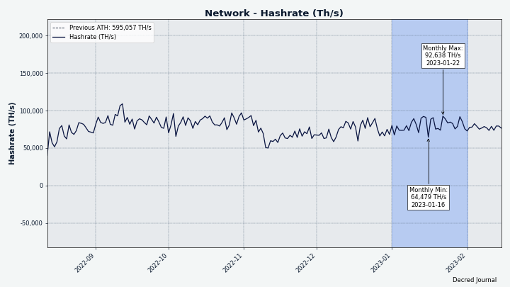

# Decred Journal – Styczeń 2023

_Obraz: Sowa Decred, aut. @OfficialCryptos_

Najważniejsze wydarzenia ze stycznia:

- Zatwierdzono propozycję przebudowy strony Timestamply mającą ułatwić timestamping na łańcuchu DCR. Usługę po faceliftingu można już testować.

- Na Politei opublikowano 8 propozycji i do czasu publikacji wydania głosowanie zakończyło się dla wszystkich z nich; 5 zostało zatwierdzonych, a 3 odrzucono.

- Bison Relay otrzymał aktualizację v0.1.3, zawierającą wiele poprawek i ulepszeń do wygody użytkowania.

Spis treści:

- [Bison Relay v0.1.3](#bison-relay-v013)
- [Rozwój](#development)
- [Ludzie](#people)
- [Zarządzanie](#governance)
- [Sieć](#network)
- [Ekosystem](#ecosystem)
- [Nawiązywanie kontaktów](#outreach)
- [Eventy](#events)
- [Media](#media)
- [Rynki](#markets)
- [Ważne kwestie i wiadomości poboczne](#relevant-external)

## Bison Relay v0.1.3

Nowe [wydanie v0.1.3](https://github.com/companyzero/bisonrelay/releases/tag/v0.1.3) przyniosło wiele poprawek błędów i ulepszeń jakości życia odkrytych podczas wczesnych testów przeprowadzonych przez społeczność. Kompilacje AppImage są teraz dostępne dla użytkowników Linuksa.

Pobierz najnowsze wydanie w nowym [selektorze pobierania](https://bisonrelay.org/download/) lub bezpośrednio z [GitHub](https://github.com/companyzero/bisonrelay/releases).

Udaj się do sekcji [Bison Relay](#bison-relay) po szczegółową listę zmian w v0.1.3 i nie tylko.

## Rozwój

O ile nie zaznaczono inaczej, prace zgłaszane poniżej mają status „scalonych z repozytorium głównym (master)”. Oznacza to, że prace są ukończone, zrecenzowane i zintegrowane z kodem źródłowym, który zaawansowani użytkownicy mogą [kompilować i uruchamiać](https://medium.com/@artikozel/the-decred-node-back-to-the-source-part-one-27d4576e7e1c), ale ich efekty nie są jeszcze dostępne w wersji plików binarnych dla zwykłych użytkowników.

### dcrd

_[dcrd](https://github.com/decred/dcrd) jest pełną implementacją węzła, który obsługuje sieć peer-to-peer Decred na całym świecie._

- Zmodyfikowano metodę [przycinania wygasłych transakcji](https://github.com/decred/dcrd/pull/3042) z mempoola, by akceptowała aktualną najlepszą wysokość, zamiast szukać jej wewnętrznie. Jest to część większej inicjatywy, aby stan mempoola był łatwiejszy do zrozumienia dzięki usunięciu ukrytych założeń.
- Zaktualizowano [obraz Dockera](https://github.com/decred/dcrd/pull/3043) do nowszych wersji Go i Alpine Linux.
- Skonfigurowano kontener Docker do [przekazywania sygnału SIGTERM](https://github.com/decred/dcrd/pull/3044) do działającej instancji dcrd, dzięki czemu wyłącza się ona poprawnie i zgrabnie, gdy kontener jest zatrzymywany.
- Poprawiono i rozszerzono [dokumentację Dockera](https://github.com/decred/dcrd/pull/3045).
- Zoptymalizowano wybór peerów w menedżerze adresów, aby zmniejszyć [wysokie zużycie procesora](https://github.com/decred/dcrd/pull/3047) odkryte podczas testowania DEX z portfelem SPV DCR.

### dcrwallet

_[dcrwallet](https://github.com/decred/dcrwallet) to serwer portfela używany przez wiersz polecenia oraz aplikacje graficzne._

- Dodano opcję [`watchlast`](https://github.com/decred/dcrwallet/pull/2196) do ograniczenia początkowo obserwowanych adresów, co z kolei poprawia wykorzystanie zasobów startowych i wydajność. Będzie to korzystne dla bardzo dużych portfeli z wieloma starymi adresami, które nie będą ponownie używane.

### Politeia

_[Politeia](https://github.com/decred/politeia) to system składania propozycji w ekosystemie Decred, który służy do wnioskowania o środki ze Skarbca._

Wszystkie poniższe zmiany służą przeprojektowaniu GUI na nową [architekturę opartą o wtyczki](https://github.com/decred/politeiagui/tree/master/plugins-structure#politeiagui---plugins-structure).

Ponownie zaimplementowane strony:

- Strony [szczegółów użytkownika](https://github.com/decred/politeiagui/pull/2884). Wszystkie wizualne komunikaty, modale i wiadomości zostały zrefaktoryzowane, wspólne elementy UI zostały wyodrębnione do ponownego użycia, kilka problemów z UI i responsywnością zostało naprawionych i wprowadzono drobne ulepszenia projektu.
- Strony [sesji użytkownika](https://github.com/decred/politeiagui/pull/2887), w tym rejestracji, logowania, wylogowania, resetu hasła i potwierdzenia adresu e-mail.
- [Strony administratora](https://github.com/decred/politeiagui/pull/2891) dla niezweryfikowanych propozycji i wyszukiwania użytkowników.
- [Strony propozycji](https://github.com/decred/politeiagui/pull/2892), w tym strony edycji i wersji raw.
- Założono [sprawę główną](https://github.com/decred/politeiagui/issues/2875), która śledzi, które strony zostały ponownie wdrożone.

Pozostałe zmiany:

- Przebudowano aplikację Politeia tak, aby używała nowego [toolkitu](https://github.com/decred/politeiagui/pull/2881) do łączenia wtyczek razem.
- Dodano [walidację](https://github.com/decred/politeiagui/pull/2889) do wszystkich formularzy w Politei, włączając w to komunikaty o błędach i kontrolę wysyłania formularzy.
- ~5 innych poprawek w GUI i bibliotece pi-ui.

_Obraz: Strona konta użytkownika w przebudowaym GUI Politei._

### cspp

_[cspp](https://github.com/decred/cspp) to serwer do koordynowania mieszania monet za pośrednictwem protokołu CoinShuffle++. Nie jest powierniczy, tzn. nie przejmuje kontroli nad środkami._

- Przechwytywanie adresu IP i typu wiadomości, gdy [wysyłanie do klienta nie powiedzie się](https://github.com/decred/cspp/pull/79).
- Naprawiono [błąd w protokole](https://github.com/decred/cspp/pull/80), który powodował niepowodzenie walidacji podpisu, jeśli klient i serwer używały różnych rozmiarów liczb całkowitych, np. 32-bitowy klient łączący się z 64-bitowym serwerem. Ta poprawka jest zmianą łamiącą protokół (klienci będą musieli się zaktualizować, aby móc korzystać z tej poprawki).
- Zaktualizowano do [najnowszych](https://github.com/decred/cspp/pull/81) modułów dcrd.

### DCRDEX

_[DCRDEX](https://github.com/decred/dcrdex) to niepowiernicza giełda, umożliwiająca handel bez konieczności zaufania, działająca dzięki technologii atomic swaps._

Zmiany w klientach:

- Zaktualizowano liczne [zależności webowe](https://github.com/decred/dcrdex/pull/1996).
- Zaktualizowano konfigurację Dockera: [zoptymalizowane obrazy bazowe](https://github.com/decred/dcrdex/pull/2030), przełączono klienta DEX na [uruchamianie jako użytkownik bez uprawnień administratorskich](https://github.com/decred/dcrdex/pull/2035) oraz [wykluczono niepotrzebne pliki](https://github.com/decred/dcrdex/pull/2077). Między innymi pomaga to zintegrować klienta DEX [z Umbrelem](https://proposals.decred.org/record/8d83046).
- Umożliwienie [potwierdzania i ukrywania](https://github.com/decred/dcrdex/pull/2044) ostrzeżenia, które przypomina o konieczności pozostawienia uruchomionego klienta DEX do czasu rozliczenia wszystkich transakcji.
- Ulepszono interfejs pola wyboru z [jednolitym stylem](https://github.com/decred/dcrdex/pull/2002) we wszystkich formularzach.
- Wyświetlanie [brakującego portfela](https://github.com/decred/dcrdex/pull/2071), jeśli nie został znaleziony podczas uruchamiania.
- Dodano spójne [obramowanie](https://github.com/decred/dcrdex/pull/2070) do wszystkich pól wejściowych, rozwijanych i pól wyboru.
- Zachowanie niektórych [preferencji użytkownika](https://github.com/decred/dcrdex/pull/1975) podczas przełączania/odświeżania strony i ponownego uruchamiania klienta DEX, jak ukrycie/pokazanie lewego doku rynkowego lub wybór wybranego portfela na stronie Portfele.

Poprawki w klientach:

- Poprawiono mylące skoki [postępu synchronizacji](https://github.com/decred/dcrdex/pull/2008) po utracie połączenia ze wszystkimi peerami SPV.
- Poprawiono wykrywanie i obsługę transakcji refundacji, które zostały [nadane ręcznie](https://github.com/decred/dcrdex/pull/2011) przez użytkownika (poza klientem DEX).
- Naprawiono błąd uruchamiania w [systemach 32-bitowych](https://github.com/decred/dcrdex/pull/2031).
- Naprawiono [ścieżki katalogowe](https://github.com/decred/dcrdex/pull/2018), które blokowały wbudowane portfele SPV utworzone w v0.5 przed aktualizacją w nadchodzącej v0.6.
- Naprawiono ~4 błędy związane ze współbieżnością.

Poprawki dla serwera:

- Unikanie [impasu](https://github.com/decred/dcrdex/pull/2021) po otrzymaniu potwierdzenia wykupienia od strony maker.
- Dodano kontrolę poprawności, aby nigdy nie wysyłać [swapów z zerową opłatą](https://github.com/decred/dcrdex/pull/2060).

Ethereum:

- Usunięto [niedawno dodany](https://github.com/decred/dcrdex/pull/2047) interfejs `authrpc`. Okazało się, że jest on [niepotrzebnie ograniczający](https://github.com/decred/dcrdex/issues/2016#issuecomment-1369091909) poprzez brak metod do sprawdzania mempoola i obliczania najnowszego salda. W tym samym czasie niewiele zyskano z używania go w DEX. Dla przypadków użycia w DEX bardziej sensowne jest łączenie się z Geth za pomocą [IPC](https://en.wikipedia.org/wiki/Inter-process_communication) lub flag `--http` / `--ws`. W przyszłości uwierzytelniona obsługa RPC może być nadal potrzebna do uzyskania danych Ethereum od zaufanych dostawców RPC. Może to znacznie uprościć testowanie, ponieważ uruchomienie pełnego węzła Ethereum jest [zbyt trudne](https://github.com/decred/dcrdex/pull/2020#discussion_r1081309070).
- Bezwzględne sprawdzanie [znacznika czasu nagłówka bloku](https://github.com/decred/dcrdex/pull/2034), aby określić status synchronizacji. Od czasu "Merge" Ethereum, Geth zgłasza bieżący blok i najwyższy blok jako ten sam numer, więc różnica między nimi nie może być już używana do określenia postępu synchronizacji. Zamiast tego DEX porówna czas nagłówka ostatniego bloku z zegarem systemowym użytkownika, a jeśli blok jest wystarczająco stary, łańcuch zostanie uznany za niezsynchronizowany.
- Poprawiono wyświetlanie wartości [wykupienia ze strony maker](https://github.com/decred/dcrdex/pull/1978) w przypadkach, gdy nie jest znana dokładna transakcja.
- Dodano możliwość łączenia się serwera DEX z Geth przez interfejsy [HTTP i WebSocket](https://github.com/decred/dcrdex/pull/2047).
- Dodano [timeouty](https://github.com/decred/dcrdex/pull/2051) do żądań RPC, aby bardzo długie żądania do dostawców RPC mogły wygasnąć i zostać anulowane.
- Niebranie pod uwagę oczekujących (niewydobytych) transakcji podczas obliczania salda, jeśli dostawca RPC nie posiada [wymaganych metod](https://github.com/decred/dcrdex/pull/2059), aby to zrobić.
- Sprawdzanie [opłaty za zamianę](https://github.com/decred/dcrdex/pull/2062) tylko po otrzymaniu kilku potwierdzeń (optymalizacja prędkości).
- Poprawiono [niezapisywanie konfiguracji portfela](https://github.com/decred/dcrdex/pull/2055) po operacji ponownej konfiguracji.
- Naprawiono brak przycisku [Ustawienia](https://github.com/decred/dcrdex/pull/2053) dla tokenów ERC-20.
- Naprawiono min/max [szacunkowe opłaty](https://github.com/decred/dcrdex/pull/2057) pokazane dla swapów z aktywami typu "token". Opłaty za zamianę tokenów są ponoszone w aktywach bazowych. Na przykład, kupując DCR za USDC, opłaty za stronę USDC transakcji są płacone w ETH.

Pozostałe zmiany:

- Zaktualizowano stronę [podstawowych specyfikacji](https://github.com/decred/dcrdex/pull/2001) (najnowsza wersja znajduje się [tutaj](https://github.com/decred/dcrdex/blob/master/spec/fundamentals.mediawiki)).

W toku:

- Wsparcie dla [DigiByte (DGB)](https://github.com/decred/dcrdex/pull/1993).

_Obraz: Ulepszone szacowanie opłat dla tokenów na DCRDEX._

### Dokumentacja

_[dcrdocs](https://github.com/decred/dcrdocs) to repozytorium źródłowe [dokumentacji użytkownika](https://docs.decred.org/) dla Decred._

- Dodano [akapity dotyczące zarządzania on-chain i Politeia](https://github.com/decred/dcrdocs/pull/1212) do strony [Historia projektu](https://docs.decred.org/getting-started/project-history/). Dodano również punkty na osi czasu.

### decred.org

_[dcrweb](https://github.com/decred/dcrweb) to źródło kodu dla strony decred.org._

- Uporządkowanie plików językowych i18n poprzez [zastąpienie](https://github.com/decred/dcrweb/pull/1107) uciekających cudzysłowów, aby zmniejszyć możliwość wystąpienia błędów.
- Zaktualizowano wersję [Hugo](https://github.com/decred/dcrweb/pull/1108).

### Bison Relay

_[Bison Relay](https://github.com/companyzero/bisonrelay) to nowa platforma mediów społecznościowych peer-to-peer z silną ochroną przeciw cenzurze, inwiligacji, oraz reklamom, działająca na bazie Lightning Network projektu Decred._

Zmiany w interfejsie graficznych GUI w wydaniu v0.1.3:

- Dodano skrypty kompilacji dla [Linuxa](https://github.com/companyzero/bisonrelay/pull/85) (AppImage i tar) oraz [Windowsa](https://github.com/companyzero/bisonrelay/pull/88) (MSIX).
- Subskrybowanie i odsubskrybowanie się z postów następuje teraz [asynchronicznie](https://github.com/companyzero/bisonrelay/pull/86). Poprawnie obsługuje to przypadek, gdy użytkownik docelowy jest offline i będzie potrzebował dużo czasu, aby odpowiedzieć na żądanie subskrypcji.
- Dodano właściwe [ikony launchera](https://github.com/companyzero/bisonrelay/pull/94) dla różnych systemów operacyjnych.

Poprawki w interfejsie graficznym w wydaniu v0.1.3:

- Wiadomości o błędach mogą być teraz [kopiowane](https://github.com/companyzero/bisonrelay/pull/72) i wklejane do raportów o błędach.
- Otwieranie nowych kanałów będzie [uniemożliwione](https://github.com/companyzero/bisonrelay/pull/73), gdy będą otwarte kanały oczekujące. Poprawione komunikaty o błędach będą lepiej wyjaśniać powody, dla których kanały nie mogą być otwarte (to [myliło](https://github.com/companyzero/bisonrelay/issues/11) nowych użytkowników podczas uruchamiania).
- Poprawiono [adres serwera](https://github.com/companyzero/bisonrelay/pull/81) na nowej stronie konfiguracyjnej.
- Naprawiono błąd podczas próby przeniesienia [dużego płatnego pobrania](https://github.com/companyzero/bisonrelay/pull/91).
- Naprawiono brak [autofokusa na polu Hasło](https://github.com/companyzero/bisonrelay/pull/92) wyświetlanego po uruchomieniu aplikacji. Również hasło może być teraz przesłane za pomocą klawisza Enter.
- [Naprawiono](https://github.com/companyzero/bisonrelay/pull/96) nieklikalne linki w komentarzach do postów, menu kontekstowe pozostające otwarte i obrazy niepokazujące się na liście postów.
- Naprawiono dziwny [znak końcowy](https://github.com/companyzero/bisonrelay/pull/100) po linkach.

Zmiany w aplikacji wiersza polecenia w wydaniu v0.1.3:

- Dodano komendę `/timestats`, która raportuje [statystyki czasowe](https://github.com/companyzero/bisonrelay/pull/) dla płatności LN i wysyłania wiadomości wychodzących.
- Pokazywanie [promowanych adresów](https://github.com/companyzero/bisonrelay/pull/82) dla węzłów LN odpytanych komendami `/svrnode` i `/queryroute`.
- Subskrybowanie i odsubskrybowanie się z postów następuje teraz [asynchronicznie](https://github.com/companyzero/bisonrelay/pull/86).

Poprawki w aplikacji wiersza polecenia w wydaniu v0.1.3:

- Naprawiono logowanie wysyłania plików do [niewłaściwego okna](https://github.com/companyzero/bisonrelay/pull/71) i poprawiono wynik polecenia `/winlist`.
- [Wyczyszczenie pola certyfikatu](https://github.com/companyzero/bisonrelay/pull/90) podczas ustawiania niestandardowego adresu dostawcy płynności LN.
- Naprawiono błąd podczas próby przesłania [dużego zakupionego pliku](https://github.com/companyzero/bisonrelay/pull/91).

Zmiany dla serwera w wydaniu v0.1.3:

- Obsługa nasłuchiwania połączeń na [wielu adresach](https://github.com/companyzero/bisonrelay/pull/89).

Zmiany dla aplikacji GUI scalone z gałęzią "master" do następnego wydania:

- Poprawiono wskaźniki nieprzeczytanych wiadomości i sortowanie w [liście czatów](https://github.com/companyzero/bisonrelay/pull/101).
- Dodano przycisk [Wróć](https://github.com/companyzero/bisonrelay/pull/112) do widoków Ustawień zaawansowanych i Przywracania.
- Zaktualizowano [biblioteki](https://github.com/companyzero/bisonrelay/pull/114) Dart i Flutter do nowszych wersji i przypięto ich hasze, aby zapewnić bardziej solidne kompilacje.
- Poprawiono renderowanie [przerw w liniach](https://github.com/companyzero/bisonrelay/pull/113).

Zmiany dla aplikacji wiersza polecenia scalone z gałęzią "master":

- Dodano API do [sterowania brclientem](https://github.com/companyzero/bisonrelay/pull/84) z narzędzi innych firm. Pozwala to na pisanie botów (takich jak bot mostu Matrix) i innych integracji. Zobacz dokumentację API i przykłady [tutaj](https://github.com/companyzero/bisonrelay/tree/0d85ba164376fb5e4c3351c0d7cb76c09a52583b/clientrpc).

Strona [bisonrelay.org](https://bisonrelay.org/):

- Dodano [kreator pobierania](https://github.com/companyzero/bisonrelay-web/pull/5), który prowadzi użytkowników do poprawnego pobierania plików, który działa nawet przy wyłączonym JavaScripcie.
- Zaktualizowano wersję [Hugo](https://github.com/companyzero/bisonrelay-web/pull/6).
- Dodano przycisk linkujący do najnowszych [informacji do wydania](https://github.com/companyzero/bisonrelay-web/pull/7).

Pozostałe:

- Dwukierunkowy most między Bison Relay a Matrix [już działa](https://twitter.com/behindtext/status/1615452002502205454) na kanałach #br, #random i #trading.
- @davecgh [wyjaśnił](https://twitter.com/BisonDigest/status/1609882842871500804) co się dzieje, gdy "po prostu" wysyłasz wiadomość na Bison Relay (jak działają punkty Rendezvous, jak serwer nie jest w stanie odkryć, kto z kim rozmawia, itp.)
- [@BisonRelay](https://twitter.net/BisonRelay) to nowe konto na Twitterze do ogłoszeń.
- [@BisonDigest](https://twitter.net/BisonDigest) jest nowym kontem na Twitterze do repostowania najlepszych treści z Bison Relay.

### Timestamply

_[Timestamply](https://github.com/decred/dcrtimegui) to darmowa usługa znakowania czasowego plików działająca na łańcuchu Decred. Znacznik czasowy udowadnia, że dany plik istniał w określonym momencie. Usługa ta ma szereg zastosowań w ochronie nienaruszalności danych._

Usługa dcrtimegui zmieniła nazwę na Timestamply, a aplikacja otrzymała [pełny redesign](https://github.com/decred/dcrtimegui/pull/151). Niektóre z nowych funkcji obejmują:

- Nowy projekt graficzny pasujący do standardów projektowania Decred opracowanych dla Decrediton, Politeia i ostatniej aktualizacji decred.org.
- Tryb jasny i ciemny.
- Wiele języków, w tym wstępne tłumaczenie na jęz. portugalski.
- Oddzielne strony Znakowania i Weryfikacji.
- Wyświetlanie czasu następnego zakotwiczenia (nie było jasne, że zakotwiczenie odbywa się co godzinę).
- Sekcja najnowszych haszy.
- Poprawiony UX dla pobierania wielu dowodów.
- Lista haszy oznaczonych czasem i zweryfikowanych przez użytkownika.
- Postęp potwierdzeń transakcji dla każdego hasza.
- Ulepszona strefa zrzutu plików.

Przeprojektowanie Timestamply pojawiło się wkrótce po tym, jak aplikacja otrzymała trochę uwagi od [brazylijskich polityków](https://haddadoficial.com.br/lula-e-haddad-registram-plano-de-governo-em-blockchain-para-evitar-fake-news/), którzy oznaczyli czasowo pliki PDF z ich planami rządowymi, aby zwalczać dezinformację rozprzestrzeniającą się poprzez fałszywe wersje plików.

[Wniosek](https://proposals.decred.org/record/855a506) o sfinansowanie nowej wersji został zatwierdzony i czeka na wdrożenie na [timestamp.decred.org](https://timestamp.decred.org/). Do tego czasu użytkownicy mogą wypróbować nadchodzącą wersję na [stronie testowej](https://dcrtimegui-redesign.netlify.app/). Należy pamiętać, że strona testowa korzysta z innej bazy danych i może nie znaleźć oznakowanych haszy przez aktualną wersję aplikacji.

_Obraz: Nowy design Timestamply._

### Pozostałe

- Program [Bug Bounty](https://bounty.decred.org/) [poinformował](https://twitter.com/JamieHoldstock/status/1611641784127430657), że w ciągu 6 miesięcy od ostatniej [propozycji](https://proposals.decred.org/record/da2f32d) prowadzonej przez @jholdstock przetworzono 20 zgłoszeń. Tylko 1 było na tyle poważne, że uzasadniało wypłatę.
- [Strona internetowa](https://github.com/decred/dcrbounty) Bug Bounty otrzymała aktualizację  [hali sław](https://github.com/decred/dcrbounty/pull/91) dodając uczestników i poprawiając wyniki oraz ogólne [porządki](https://github.com/decred/dcrbounty/pull/92) w celu oczyszczenia nieużywanego kodu i uproszczenia przyszłych aktualizacji.

## Ludzie

Statystyki społeczności na dzień 2. lutego (w porównaniu z 4. stycznia):

- Obserwujący na [Twitterze](https://twitter.com/decredproject): 53268 (-124)
- Subskrybenci na [Reddit](https://www.reddit.com/r/decred/): 12663 (+15)
- Użytkownicy na [Matrixie](https://chat.decred.org/) w pokoju #general: 742 (+4)
- Użytkownicy na [Discordzie](https://discord.gg/GJ2GXfz) zweryfikowani z możliwością pisania:  926 (-3)
- Użytkownicy na [Telegramie](https://t.me/Decred): 2816 (-56)
- Subskrybenci na [YouTube](https://www.youtube.com/decredchannel): 4640 (+0), wyświetleń: 222K (+1K)

## Zarządzanie

W styczniu nowy [Skarbiec](https://dcrdata.decred.org/treasury) otrzymał 8564 DCR o wartości 189 tys. USD po średnim grudniowym kursie wymiany $22,05.

Transakcja [wypłaty ze Skarbca](https://dcrdata.decred.org/tx/49f141f51421a499d319bc617a4430f87db3a73ffa605dee8408eefb081bd11b) została wydobyta 3. stycznia i zawierała 24 wyjścia, oraz, jak doniesiono w [zeszłym miesiącu](202212.md#governance), dokonywała wypłaty wykonawcom za (głównie) prace wykonaną w listopadzie w kwotach od 5 DCR do 1270 DCR. Zatwierdzono ją 6967 głosami (wszystkie na "tak") oraz frekwencją głosowania na poziomie 54%, z puli 12909 biletów uprawnionych do głosowania w trakcie skróconego, 9-dniowego okienka głosowania. Podsumowując, transakcja opiewała na 3907 DCR o wartości ok. $86K po listopadowym kursie rozliczeniowym $21,92.

Wszystkie transakcje wypłat z nowego Skarbca można zobaczyć [tutaj](https://dcrdata.decred.org/treasury?txntype=tspend).

Na dzień 30. stycznia, łączne saldo [starego](https://dcrdata.decred.org/address/Dcur2mcGjmENx4DhNqDctW5wJCVyT3Qeqkx) i [nowego Skarbca](https://dcrdata.decred.org/treasury) wynosi 840 tys. DCR (19,4 miliona USD po kursie $23,03).

_Obraz: Miesieczne wpływy i wypłaty ze Skarbca Decred._

W styczniu na platformie Politeia opublikowano 8 propozycji.

- Propozycja [tworzenia treści wideo dla Decred 2023](https://proposals.decred.org/record/56a439a) wnioskowała o budżet w wysokości 45 600 dolarów, aby kontynuować produkcję treści wideo, w tym livestreamu @DecredSociety "Decred i stan rynku", aktualizacji wiadomości aut. @Exitus, animacji wideo/gifów aut. @karamble i Twitter Spaces aut. @Tivra. Została ona zatwierdzona przy 83% głosów na tak i 55% frekwencji.
- Propozycja [komunikacji i tworzenia treści w jęz. arabskim dla Decred w r. 2023](https://proposals.decred.org/record/5b975ba) wnioskowała o budżet w wysokości 13 000 dolarów, aby kontynuować wysiłki zespołu przez kolejny rok, została zatwierdzona przy 75% głosów na tak i 49% frekwencji.
- Propozycja [tłumaczenia treści i zasobów Decred w r. 2023](https://proposals.decred.org/record/31c4b5f) wnioskowała o budżet w wysokości 33 000 dolarów na rok pracy nad tłumaczeniami, została zatwierdzona przy 88% głosów na tak i frekwencji 44%.
- Propozycja [Timestamply](https://proposals.decred.org/record/855a506), która wnioskowała o 17 300 dolarów za prace wykonane nad aplikacją internetową dla usługi znakowania czasowego DCR, została zatwierdzona przy 88% głosów na tak i frekwencji 48%.
- Propozycja [integracji DCRDEX z platformą Umbrel](https://proposals.decred.org/record/8d83046) wnioskowała o budżet w wysokości 1960 dolarów na integrację DCRDEX z platformą Umbrel do samodzielnego hostowania oprogramowania open source, co znacznie ułatwi użytkownikom Umbrel instalację DCRDEX. Została ona zatwierdzona przy 84% głosów na tak i frekwencji 47%.
- Propozycja [Rick Red Revival: badania i inne zebrane prace](https://proposals.decred.org/record/f12258b) wnioskowała o budżet w wysokości 32 500 dolarów na mieszankę rodzajów pracy aut. @richardred: badania, testy, pisanie oprogramowania, moderowanie Politei, memy i ogólna pomoc. Wniosek został odrzucony przy 56% głosów na tak i frekwencji 30%.
- Propozycja [grantu dla Alphaday](https://proposals.decred.org/record/49793bf) wnioskowała o 2400 dolarów na zbudowanie dashboardu, który zbierałby różnego rodzaju informacje o Decred w jednym miejscu, została odrzucona przy 17% głosów na tak i frekwencji 25%.
- Propozycja [zasponsorowania sportów motoryzacyjnych](https://proposals.decred.org/record/2b19c56) zawierała prośbę o 26 033 dolarów na pełne zasponsorowanie samochodu Honda Civic Type R w serii wyścigów, została odrzucona z 9% poparciem i frekwencją 22%.

Zapraszamy do lektury [wydania nr 55](https://blockcommons.red/politeia-digest/issue055/) oraz [wydania nr 56](https://blockcommons.red/politeia-digest/issue056/) Politeia Digest po więcej informacji na temat zgłoszonych w tym miesiącu propozycji.

## Sieć

**Hashrate**: styczniowy [hashrate](https://dcrdata.decred.org/charts?chart=hashrate&scale=linear&bin=day&axis=time) na początku miesiąca wyniósł ~80 Ph/s a zamknął go na poziomie ~76 Ph/s, zaliczając niż w ok. 64 Ph/s oraz szczyt w wys. 93 Ph/s w ciągu miesiąca.

_Obraz: Moc obliczeniowa projektu Decred._

Dystrybucja mocy obliczeniowej w wys. 81 Ph/s [zadeklarowana](https://miningpoolstats.stream/decred) przez pule wydobywcze na dzień 1. lutego: Poolin 64%, F2Pool 30%, BTC.com 4%, AntPool 2%, CoinMine 0,4%.

Podział 1000 bloków [wydobytych](https://miningpoolstats.stream/decred) przed 1. lutego: Poolin 61%, F2Pool 31%, AntPool 4%, BTC.com 3%, CoinMine 0,4%.

_Obraz: Historyczny wykres dystrybucji mocy obliczeniowej pul wydobywczych._

**Staking**: [Cena biletów](https://dcrdata.decred.org/charts?chart=ticket-price&axis=time&visibility=true-true&mode=stepped) wahała się między 140 a 298 DCR, a jej 30-dniowa [średnia](https://dcrstats.com/) wyniosła 212,5 DCR (-22,3).

_Obraz: Cena biletów oszalała._

[Zablokowana suma](https://dcrdata.decred.org/charts?chart=ticket-pool-value&scale=linear&bin=day&axis=time) to pomiędzy 8,93 a 9,71 miliona DCR, co oznacza, że 59,9-65,2% podaży dostępnej w obiegu [wzięło udział](https://dcrdata.decred.org/charts?chart=stake-participation&scale=linear&bin=day&axis=time) w elemencie Proof of Stake.

_Obraz: Spadek i odbicie DCR zablokowanych w PoS._

Gwałtowny spadek wolumenu zakupu biletów posłał ich cenę w dół do 140 DCR, do poziomu ostatnio obserwowanego w październiku 2022 roku podczas podobnego spadku. Ilość DCR zablokowanych w biletach zmniejszyła się o ~780K DCR do 8,93 mln DCR.

Tak niska cena biletu wywołała bardzo wysoki zakup biletów, który bardzo rozhuśtał cenę biletów przez najbliższe dni. 48,624 bilety zostały kupione w styczniu - [najwyższy miesięczny rekord](https://dcrdata.decred.org/months?rows=100) od pierwszego miesiąca istnienia Decred w lutym 2016 roku.

**VSP**: Na 1. lutego, ~8390 (+1270) biletów w puli zarządzanych było przez [16 oficjalnych VSP](https://decred.org/vsp/) serwerów vspd, co stanowi 18,8% całej puli biletowej (+1,6%). Podczas wykonywania migawki puli biletów było w niej ok. 44 670 biletów, co oznacza, że przekroczyła ona [zakładaną docelową ilość](https://docs.decred.org/proof-of-stake/overview/) o całe 9%.

Największe wzrosty w styczniu odnotowały vspd.99split.com (+419), dcrhive.com (+328) oraz vsp.stakeminer.com (+319).

_Obraz: Dystrybucja biletów zarządzanych przez VSP._

**Węzły**: [Decred Mapper](https://nodes.jholdstock.uk/user_agents) odnotował 187 węzłów dcrd na dzień 1. lutego: v1.7.5 - 33%, v1.7.1 - 21%, v1.8.0 dev buildy - 13%, v1.7.2 - 13%, v1.7.0 - 9%, v1.7.4 - 3%, pozostałe - 8%.

_Obraz: Historyczna dystrybucja wersji węzłów dcrd, dane z nodes.jholdstock.uk. Uwaga: Dane do stycznia 2023 były niekompletne_

Odkryliśmy, że podawana liczba węzłów, którą raportowaliśmy od [czerwca 2022](202206.md) była niekompletna. Możliwą przyczyną tego jest to, że Decred Mapper polegał na żądaniu `GetAddr`, a wiele węzłów przestało odpowiadać na nie odpowiadać z jakiegoś powodu. `GetAddr` jest częścią sieciowego protokołu plotkarskiego, który odpowiada za sposób, w jaki węzły odkrywają inne węzły w sieci. Odpowiadanie na nie jest opcjonalne, więc brak odpowiedzi nie jest błędem. Liczby węzłów zgłoszone przez Decred Mapper były poprawne 26 stycznia.

Ilość [monet mieszanych](https://dcrdata.decred.org/charts?chart=coin-supply&zoom=jz3q237o-la8vk000&scale=linear&bin=day&axis=time&visibility=true-true-true) wahała się w granicach 59,9-61,6%.
Dzienna [kwota mieszana](https://dcrdata.decred.org/charts?chart=privacy-participation&bin=day&axis=time) oscylowała w granicach 140-611K DCR.

_Obraz: Ilośc mieszanych i niewydanych DCR nieco spadła._

Eksplorator [Lightning Network](https://ln-map.jholdstock.uk/) sieci Decred na 1. lutego odnotował 147 węzłów (+17) oraz 261 kanałów (+28) o całkowitej pojemności 106,1 DCR. Statystyki te zależą od węzła LN. Na przykład, tego samego dnia węzeł @karamble odnotował 166 węzłów (+19) oraz 342 kanały (+35) o pojemności 159,7 DCR (+5,7).

## Ekosystem

API [listy VSP](https://api.decred.org/?c=vsp) zgłasza teraz wysokość bloku i szacowany udział w sieci. Wysokość bloku lepiej obrazuje, czy dany VSP jest w pełni zsynchronizowany z blockchainem, czy może utknął. Historyczne migawki danych API są dostępne [tutaj](https://github.com/bochinchero/dcrsnapcsv).

VSP stakey.com został [usunięty](https://github.com/decred/dcrwebapi/pull/171) z [listy VSP](https://decred.org/vsp/) z powodu [problemów](https://github.com/decred/dcrwebapi/pull/171#issuecomment-1279775352) z naprawą jego API. Portfele głosujące nie powinny były zostać dotknięte tą zmianą.

Portfel GoDCR SPV został [usunięty](https://github.com/decred/dcrweb/pull/1104) ze [strony Portfeli](https://decred.org/wallets/). Linki do pobrania już nie działają, a portfel nie jest już wspierany/aktualizowany w wyniku tego, że [propozycja GoDCR](https://proposals.decred.org/record/0ef42e5) nie przeszła. [Kod źródłowy](https://github.com/planetdecred/godcr) jest nadal dostępny.

Uruchomiono [nowy węzeł Lightning Network](https://www.reddit.com/r/decred/comments/102zzxu/dcr_hive_launches_a_ln_node_and_lowers_fees/) zarządzany przez @kozel pod adresem ln.dcrhive.com (standardowy port 9735). Z okazji uruchomienia węzła, jego [VSP](https://dcrhive.com/) zaoferował obniżoną opłatę w wys. jedynie 0,1% do 8 lutego. W przyszłości @kozel planuje dodać instancję LN Liquidity Provider, więc każdy kto chce otrzymać przychodzącą przepustowość LN do swojego węzła będzie mógł o nią poprosić.

Dołączcie do naszego kanału [#ecosystem](https://chat.decred.org/#/room/#ecosystem:decred.org), aby śledzić wszelkie nowości związane z ekosystemem Decred.

Uwaga: autorzy Decred Journal nie są w stanie ocenić wiarygodności żadnego z powyższych podmiotów czy ich usług. Uprasza się o dołożenie należnych starań i własnoręczną weryfikację informacji przed powierzeniem jakichkolwiek środków innym stronom.

## Nawiązywanie kontaktów

Osiągnięcia Monde PR:

- Zaproponowano 2 możliwości umieszczenia komentarza
- Zaproponowano 4 możliwości występu w mediach

Umieszczono w mediach poniższe artykuły:

- @jy-p udzielił wywiadu w podcaście [SlateCast](https://cryptoslate.com/podcasts/combining-proof-of-work-and-proof-of-stake-for-a-decentralized-financial-system-with-decred/) na CryptoSlate, mówiąc o podejściu Decred do cenzury i prywatności, Skarbcu projektu i hybrydowym modelu konsensusu.
- Artykuł w [Decred Magazine](https://www.decredmagazine.com/defi-needs-to-be-decentralized-beyond-name/) zawierający komentarz @jz na temat tego, jak DeFi musi być zdecentralizowane poza tylko nazwą.

## Eventy

**Na których byliśmy:**

- @arij została zaproszona na DevFest organizowany przez zespół deweloperski Google z Settat i Women Techmakers Settat-Marrakech. Mówiła o potędze technologii blockchain i Decred jako przykładzie oraz o tym, jak ważne jest używanie korzystanie z zarządzanych przez siebie portfeli, a nie scentralizowanych giełd. Większość publiczności stanowili deweloperzy i studenci informatyki, niektórzy zadawali pytania o to, jak zacząć pracę dla Decred lub odbywać staże. Więcej szczegółów w [raporcie](https://decredcommunity.github.io/events/index/20230107.1).

## Media

**Wybrane artykuły:**

- [Decred uruchamia Bison Relay: Prywatną, odporną na cenzurę platformę mediów społecznościowych i komunikatorów](https://decred.org/news/2022-12-15-decred-launches-bison-relay/) (informacja prasowa na decred.org)
- [Przyszłość już tu jest - rozmowa z OpenAI o rynku kryptowalut](https://www.decredmagazine.com/future-is-here-a-talk-with-openai-about-the-crypto-market/), aut. @Joao
- [Osobisty serwer prywatny Umbrel](https://www.decredmagazine.com/personal-private-server-umbrel/), aut. @phoenixgreen
- [Decred vs Monero: starcie monet prywatnościowych](https://www.decredmagazine.com/decred-vs-monero-clash-of-privacy-coins/), aut. @Joao
- [Bison Relay od Decred pomaga użytkownikom monetyzować wszystkie rodzaje treści](https://www.decredmagazine.com/decreds-bison-relay-helps-users-monetize-all-types-of-content/), aut. @HassanMaishera
- [Przegląd roczny Decred (2022)](https://www.decredmagazine.com/decred-a-year-in-review-2022/), aut. @phoenixgreen

Statystyki aktywności [Decred Magazine](https://www.decredmagazine.com/) za styczeń 2023:

- Całkowita liczba artykułów na DM: 392
- Subskrybentów newslettera: 87
- Opublikowane nowe posty i newslettery: 21
- Aktywne kampanie w mediach społecznościowych: 26
- Zakończone kampanie w mediach społecznościowych 31
- Posty w mediach społecznościowych: 132
- Polubienia: 704
- Retweety: 129
- Liczba obserwujących na wszystkich kontach i platformach mediów społecznościowych: 1180

Należy pamiętać, że Decred Magazine generuje dużo więcej treści niż [@decredproject](https://twitter.com/decredproject) może retweetować (co nie jest przecież problemem!), więc można go śledzić bezpośrednio, aby nie przegapić żadnego newsa. Istnieje wiele sposobów na śledzenie DM: [Twitter](https://twitter.com/decredmagazine), [Instagram](https://instagram.com/decredmagazine), [Facebook](https://www.facebook.com/Decredmagazine), [kanał RSS](https://www.decredmagazine.com/rss/), lub po bezpośrednio na [decredmagazine.com](https://www.decredmagazine.com/) lub konkretną kategorię, [News](https://www.decredmagazine.com/tag/news/) lub [Politeia Digest](https://www.decredmagazine.com/tag/politeia-digest/).

**Wideo:**

- [Bison Relay 0.1 news feed - podłączanie, tworzenie i używanie markdown](https://www.youtube.com/watch?v=NuKVAp4fIBY), aut. @phoenixgreen
- [Wbudowany system płatności - Bison Relay](https://www.youtube.com/watch?v=aZvnd5BvEBs), aut. @phoenixgreen - również jako [post tekstowy](https://www.decredmagazine.com/built-in-payment-system-bison-relay/)
- [Bison Relay - Zarządzanie treścią](https://www.youtube.com/watch?v=1gNc_DLCddc), aut. @phoenixgreen - również jako [post tekstowy](https://www.decredmagazine.com/bison-relay-manage-content/)
- [SlateCast #49: połączenie proof of work & proof of stake w DeFi z Decred](https://www.youtube.com/watch?v=VYDPCbb5VhE), aut. CryptoSlate z udz. @jy-p
- [Bison Relay aktualizuje się do wersji 0.1.3](https://www.youtube.com/watch?v=EWNW91_rp1w), aut. @phoenixgreen - również jako [post tekstowy](https://www.decredmagazine.com/bison-relay-updates-to-version-0-1-3/)

**Audio:**

Tivra aka [@WasPraxis](https://twitter.com/WasPraxis) zorganizował 5 nowych Twitter Spaces:

- [2023: Rok prywatności?](https://twitter.com/i/spaces/1YqKDobzqoOxV) z udz. członków społeczności Monero (także na [Anchor](https://anchor.fm/decred-magazine/episodes/2023-The-Year-of-the-Privacy-Coin-e1t4mst) + wersja edytowana na [YouTube](https://www.youtube.com/watch?v=5ttufSLhsE0))
- [Narzędzia prywatności dla epoki niezależności](https://twitter.com/i/spaces/1jMJgLyXXEyxL) z udz. Decred i członków społeczności Monero ([Anchor](https://anchor.fm/decred-magazine/episodes/Privacy-Tools-for-a-Sovereign-Age---Decred-Twitter-Space-e1tf0g9))
- [5 propozycji do przegłosowania - dyskusja ogólna](https://twitter.com/i/spaces/1YpKkgeoVqwKj) - rozmowa z osobami składającymi propozycje i społecznością o najnowszej partii propozycji ([Anchor](https://anchor.fm/decred-magazine/episodes/Decred-Twitter-Space-5-Proposals-Up-General-Discussion-hosted-by-WasPraxis-e1tpati))
- [Dlaczego prywatność jest kluczowa dla w pełni funkcjonalnej waluty](https://twitter.com/i/spaces/1YqJDoDNrnzGV) z udz. współzałożyciela Firo [Reuben Yap](https://twitter.com/reubenyap) ([Anchor](https://anchor.fm/decred-magazine/episodes/Why-Privacy-is-Critical-for-a-Fully-Functional-Currency---Decred--Firo-Twitter-Space-e1u52o8))
- [Propozycje DCR](https://twitter.com/i/spaces/1jMKgLAlLXgGL) - drugi czat z autorami propozycji w celu omówienia ich celów i rezultatów ([Anchor](https://anchor.fm/decred-magazine/episodes/DCR-Proposals-Space-e1u9f9j))

**Coś dla oka i serca:**

- [Promo Bison Relay na TikToku](https://twitter.com/exitusdcr/status/1620123207251681280) z udz. [@DajanaDcr](https://twitter.com/DajanaDcr)
- [Decred uderza ponownie](https://www.decredmagazine.com/decred-strikes-again/), aut. @OfficialCryptos

_Obraz: "Pora na gorącą czekoladę z Decred" aut. [@maitreludo](https://twitter.com/maitreludo/status/1608847709930393601)_

**Pozostałe**:

- [Wątek edukacyjny](https://twitter.com/toddfmaki/status/1616283326490497025), aut. @toddfmaki o dostawcach usługi głosowania Decred.

**Tłumaczenia:**

- Wydania listopad-grudzień Decred Journal doczekały się 3 nowych [tłumaczeń](https://xaur.github.io/decred-news/) na jęz. arabski (@arij, @abdulrahman4), jęz. chiński (@Dominic) i jęz. polski (@kozel). Dziękujemy zaangażowanym!
- [Bison Relay: niezależny Internet](https://blog.decred.org/2022/12/14/Bison-Relay-The-Sovereign-Internet/) przetłumaczono na [jęz. chiński](https://github.com/DominicTing/decred-ZH-translations/blob/master/Bison%20Relay:%20The%20Sovereign%20Internet.md), aut. @Dominic ([tweet](https://twitter.com/wanbihou/status/1604010848745230336))

**Dyskusje**:

- [Czy cokolwiek może prześcignąć bitcoina jako środek przechowania wartości?](https://www.reddit.com/r/decred/comments/103dkbu/can_anything_surpass_bitcoin_as_the_main_store_of/)
- [Burza mózgów: pomysł na papierowe przekazywanie DCR](https://www.reddit.com/r/decred/comments/10m8y6r/decred_notes_idea/)
- [Dlaczego CPFP jest lepsze od RBF CPFP](https://matrix.to/#/!aNnAOHkWUdNcEXRGjJ:decred.org/$0a-UUBBdWAG0y7spLPr5TD42Q__uSV_mEbnEbAs9wtQ?via=decred.org&via=matrix.org&via=planetdecred.org). TL;DR -  RBF (Replace By Fee) otwiera drzwi do podwójnych wydatków, a tylko nadawca może przyspieszyć transakcję o niskiej opłacie. CPFP (Child Pays For Parent) nie pozwala na podwójne wydatki i pozwala zarówno nadawcy, jak i odbiorcy przyspieszyć transakcje.
- Nie złap się na [przynętę](https://twitter.com/applesaucesome1/status/1612328396868009986) obecnego [FUDu](https://twitter.com/applesaucesome1/status/1615063402514157568).

## Rynki

W styczniu kurs wymiany DCR mieścił się w przedziale USDT 18,30-24,90 / BTC 0,00097-0,00116. Średni dzienny kurs wynosił $22,05.

Chociaż nie na łamach [Decred Magazine](https://www.decredmagazine.com/author/applesaucesome/) to @Applesaucesome dalej zamieszcza analizę techniczną $DCR i przewidywania cenowe [na Twitterze](https://twitter.com/applesaucesome1).

_Obraz: Miesięczny wolumen DCRDEX, w USD._

## Ważne kwestie i wiadomości poboczne

Protokół Ordinals, do "inskrypcji" danych na satoshich, jak bitcoinowa wersja NFT, zadebiutował w tym miesiącu i [spotkał się z mieszaną reakcją](https://www.coindesk.com/tech/2023/01/31/bitcoin-community-erupts-in-existential-debate-over-nft-project-ordinals/) społeczności Bitcoin. Reakcje były podzielone pomiędzy tych, którzy postrzegali go jako dodatkowy zabawny przypadek użycia dla Bitcoina, oraz tych, którzy postrzegali go jako spam wdzierający się do łańcucha Bitcoina, którego nie powinno się popierać, a wręcz trzeba nawet cenzurować. Adam Back był wśród tych, którzy natychmiast zaczęli myśleć o sposobach, w jakie pule wydobywcze mogłyby się zmobilizować do cenzurowania i zapobiegania takiemu wykorzystaniu Bitcoina, choć później usunął i [wycofał](https://twitter.com/adam3us/status/1620005172058669056) się z tweeta.

Na początku lutego wydobyto największą transakcję w historii sieci Bitcoin - [napis Ordinal "Taproot Wizard"](https://www.coindesk.com/tech/2023/02/02/giant-bitcoin-taproot-wizard-nft-minted-in-collaboration-with-luxor-mining-pool/) - wypełniający cały blok prawie do limitu 4 megabajtów. Transakcja została wydobyta przez pulę Luxor i opłacona w prywatnym porozumieniu z Udi Wertheimerem, jednym z Taproot Wizardów. Ordinale polegają na Taproot, a także SegWit, aby działać w swojej specyficznej formie na łańcuchu Bitcoin i mają pewne strukturalne różnice w stosunku do tego, jak NFT działają na Ethereum i innych łańcuchach.

[Taproot](https://bitcoinops.org/en/topics/taproot/) sam w sobie został [przedstawiony](https://www.coindesk.com/layer2/privacyweek/2022/01/24/bitcoin-isnt-private-but-its-recent-taproot-upgrade-will-help/) jako ulepszenie prywatności dla Bitcoina, ponieważ pozwala on skomplikowanym transakcjom, takim jak te wymagające autoryzacji wieloma podpisami lub wykorzystujące blokady czasowe, na wyglądanie podobnie do normalnych transakcji, w sposób, który nie ujawnia ich natury. Taproot pozwala również, aby niektóre z tych operacji były wykonywane bardziej efektywnie, co oznacza płacenie mniej za przestrzeń bloków. Chociaż Taproot jest aktywny od soft forka przeprowadzonego w listopadzie 2021 roku, jego wykorzystanie [pozostawało niskie](https://cryptonews.com/exclusives/taproot-adoption-remains-low-but-devs-say-it-isnt-problem-for-bitcoin.htm) do niedawna, z zaledwie 0,37% transakcji korzystających z niego w kwietniu 2022 roku.

Polkadot planuje [przekształcić](https://polkadot.network/blog/lets-talk-polkadot-opengov-part-i) swoje zarządzanie, dążąc do poprawy poziomu decentralizacji i uczestnictwa społeczności. Obecnie Rada jest wybierana przez posiadaczy tokenów i wyznacza Komitet Techniczny składający się z ekspertów protokołu; te organy pełnią kluczowe role w zarządzaniu Polkadot. Nowy system rozwiąże rolę Rady i Komitetu. Niektóre z ich funkcji będą wykonywane bezpośrednio przez członków społeczności, propozycje będą przekazywane do różnych ścieżek w zależności od tego, co robią, a ścieżki będą miały własne progi zatwierdzenia i ramy czasowe, z automatycznym procesem określającym, kiedy głosowanie rozpoczyna się i kończy oraz które propozycje są aktywowane w pierwszej kolejności. Tzw. "Substrate Fellowship" przejmie odpowiedzialność za zapewnienie jakości kodu dla aktualizacji, ale przy liczbie ponad 100 członków będzie to znacznie większa grupa niż Komitet Techniczny. Nowy system zarządzania umożliwi również bardziej elastyczne przekazywanie uprawnień do głosowania, w zależności od rodzaju propozycji.

Fundacja Web3 Polkadot [zatweetowała](https://twitter.com/Web3foundation/status/1618550186166620161) swój własny powód, dla którego twierdzi, że Polkadot nie jest papierem wartościowym, [wyjaśniając](https://cointelegraph.com/news/polkadot-restates-its-case-that-dot-has-morphed-away-from-security-status) wysiłki podjęte, aby spełnić oczekiwania organizacji regulujących w Stanach Zjednoczonychi w listopadzie 2022 r. ogłosiła, że DOT przejdzie przemianę w coś, co nie stanowi już papieru wartościowego.

Wygląda na to, że Ooki DAO [przegra](https://cointelegraph.com/news/ooki-dao-misses-lawsuit-response-deadline-default-judgment-on-the-cards) swoją sprawę z CFTC w wyroku zaocznym, ponieważ nikt nie wstąpił, aby reprezentować DAO w terminie 11 stycznia. Do tej pory CFTC ustaliła, że może [służyć](https://cointelegraph.com/news/judge-orders-cftc-to-serve-ooki-dao-founders-with-lawsuit) przekazać dokumenty DAO, umieszczając je na ich forum/Discordzie, o ile zidentyfikują i przekażą je również co najmniej jednemu posiadaczowi tokena, a także wskazała, że uważa każdego, kto uczestniczy w DAO w jakikolwiek sposób, za współodpowiedzialnego za jego działania jako spółkę nieposiadającą osobowości prawnej.

SEC [dorzuca](https://www.sec.gov/news/press-release/2023-13) na Aviego Eisenberga własne zarzuty manipulacji rynkowej Mango do tych wniesionych już przez DoJ i CFTC. Na początku lutego Eisenberg [próbował](https://www.coindesk.com/policy/2023/02/02/alleged-mango-markets-exploiter-eisenberg-waives-bail-in-first-ny-court-hearing/) negocjować kaucję, przebywając w areszcie od 26 grudnia.

Okryci złą sławą współzałożyciele 3AC [próbują](https://vulcanpost.com/814224/three-arrows-capital-seeks-funding-gtx-fill-ftx-void/) odrodzić się z popiołów FTX, poszukując funduszy na założenie firmy zajmującej się handlem roszczeniami, które traderzy kryptowalutowi mają w związku z likwidacją upadłych giełd.

Platforma DeFi Moonwell na łańcuchu Moonbeam [rozgryzała](https://forum.moonwell.fi/t/explanation-of-methodology-to-calculate-the-impact-of-mip-14-on-moonwell-users/351), jak zadośćuczynić swoim użytkownikom po tym, jak zatwierdzona przez wyborców zmiana parametrów spowodowała, że wszystkie zabezpieczenia na platformie straciły 99,9% swojej siły pożyczkowej i wszyscy zostali zlikwidowani, płacąc 10% wielkości swojej pozycji w karach. 30% kar likwidacyjnych trafiło do funduszu społecznościowego i zostanie złożona propozycja bezpośredniego zwrotu tej części, pozostałe 70% pokryje Gauntlet, [partner zarządzający ryzykiem](https://medium.com/gauntlet-networks/gauntlet-and-moonwell-partner-to-offer-dynamic-risk-management-259856b6146c) Moonwell.

Reddit uruchomił kilka nowych przypadków użycia dla MOONów, tokena nagród karmicznych subreddita /r/cryptocurrency. Moonplace to seria 10 000 NFT, z których każda przyznaje ich posiadaczowi kontrolę nad tablicą 10x10 pikseli w 2d publicznej [przestrzeni](https://moonplace.io/). Po 4 dniach wszystkie NFT zostały wybite, spalając 1 milion MOONów (wartych ~130 000$) i powodując ich tymczasowy skok ceny. NFT Moonplace znajdują się w sieci Arbitrum Nova, rozwiązaniu skalującym L2 rollup dla Ethereum.

Pierwszy baner reklamowy /r/cryptocurrency został również [sprzedany](https://www.reddit.com/r/CryptoCurrency/comments/10q99w7/elite_darkweb_hacker_group_1inch_just_hacked_the/) za MOONy (warte $3350) zdecentralizowanej giełdzie 1inch.

Największe pule stakingowe ETH [rozważają](https://twitter.com/nixorokish/status/1620061177551417349), czy powinny ograniczyć swój dalszy wzrost, aby uniknąć problemu centralizacji. Rocket Pool jest na dobrej drodze do zatwierdzenia [wniosku](https://snapshot.org/#/rocketpool-dao.eth/proposal/0x9e093dea49dee9d1b3e43dbb6e0d8735149c5fde6ef703620970129b81d0f7f8) (RPIP-17), który zapisałby cel Rocket Pool do promowania "zdrowego stakingu", z kilkoma mechanizmami ograniczającymi wzrost jego udziału w zbiorowym stakingu ETH, z których Rocket Pool obecnie kontroluje 1,66%. Lido, które kontroluje znacznie większy udział w stakingu ETH (29%), miażdżąco [odrzuciło](https://snapshot.org/#/lido-snapshot.eth/proposal/0x10abedcc563b66b1adee60825e78c387105110fa4a1e7354ab57bc9cc1e675c2) podobnego rodzaju propozycję w lipcu 2022 roku.

Vitalik Buterin [opublikował](https://vitalik.ca/general/2023/01/20/stealth.html) wpis na blogu o adresach stealth, opisując prywatność jako jedno z największych pozostałych wyzwań w ekosystemie Ethereum. Adresy stealth byłyby generowane przez nadawcę z metaadresu odbiorcy, który tylko odbiorca mógłby kontrolować, ale który nie byłby związany z jego tożsamością w łańcuchu. Innymi słowy, zapewniałoby to ten sam rodzaj prywatności, co generowanie nowego adresu dla każdego odbioru aktywów, ale bez kłopotów związanych z generowaniem nowych adresów.

Zarządzanie Uniswap zmieniło się w [starcie](https://www.theblock.co/post/207297/uniswap-temperature-check-spurs-feverish-backroom-maneuvering-among-crypto-vc-heavyweights) VC, ponieważ a16z i Jump wspierają forsowane przez siebie rozwiązania w wyborze mostu do integracji dla Binance Smart Chain. Jump wspiera Wormhole, a wybór a16z to LayerZero, ale twistem jest to, że a16z są technicznie niezdolne do udziału w głosowaniu typu "temperature check", aby zdecydować, która integracja zostanie zakodowana, ale poprosili, żeby ich 15M tokenów policzone było jako głosujące na LayerZero. Wormhole wygrał kontrolę temperatury 11M głosów, więc głosy a16z wystarczyłyby do zmiany wyniku. Jeśli to się nie uda, a16z może spróbować zablokować wdrożenie mostu Wormhole, głosując przeciwko niemu w głosowaniu on-chain (zakładając, że będzie to technicznie możliwe).

Silvergate Capital to bank, z którego korzysta wiele giełd kryptowalutowych, a jego akcje [zanurkowały](https://www.coindesk.com/business/2023/01/05/silvergate-cuts-40-jobs-writes-off-diem-asset-acquisition/) o 46% po tym, jak poinformował o odpływie 8,1 miliarda dolarów w aktywach kryptowalutowych w II kwartale 2022 r. i zwolnił 40% swojego personelu (około 200 pracowników) w celu cięcia kosztów. Silvergate był postrzegany jako możliwa ofiara zarazy FTX/Genesis, stymulując falę wycofań środków. Silvergate ogłosił również, że spisuje na straty wszystkie 196 milionów dolarów ze swojej inwestycji w Diem (dawniej Facebook Libra/Zuck Bucks), zdając sobie sprawę, że kod open source i nadszarpnięta marka nie są wiele warte.

Aptos, który jest prowadzony przez byłych deweloperów Diem, ale nie zapłacił Meta/Silvergate nic za ich aktywa, a zamiast tego [wziął](https://siliconangle.com/2022/03/15/aptos-raises-200m-bring-diem-blockchain-back-life/) $200M finansowania od a16z i innych VC, doświadczył gwałtownego wzrostu ceny w styczniu, który doprowadził jego kapitalizację rynkową do $2,4B, jako że stał się "[gorącą nową monetą](https://finance.yahoo.com/news/crypto-market-january-roundup-aptos-224447055.html)" przez pewien czas.

Znany deweloper Bitcoin [Luke Dashjr](https://twitter.com/LukeDashjr) został [zhakowany](https://twitter.com/peterktodd/status/1609655629903265795) i stracił znaczną część swojego stacku BTC, ponad 200 BTC. Wydaje się, że hakerzy byli w stanie wykorzystać używany przez niego system Linux, co dało dostęp do kluczy szyfrujących PGP Luke'a, jak również jego BTC. Klucze PGP były używane do podpisywania wydań Bitcoin Core i Knots, więc powinny one być wpisane na czarną listę przez użytkowników, dopóki sytuacja nie zostanie rozwiązana i Luke Dashjr przypuszczalnie opublikuje nowy klucz PGP.

Rola Logana Paula z YouTube w projekcie CryptoZoo NFT została [udokumentowana](https://www.vulture.com/2023/01/logan-paul-cryptozoo-scam-coffeezilla-allegations-explained.html) przez Coffeezillę, z wnioskiem, że był on szefem wśród oszustów w projekcie, który przesadnie reklamował grę, której realnie nie zamierzali dostarczyć. Paul groził pozwaniem Coffeezilli, ale potem [wycofał](https://cointelegraph.com/news/logan-paul-backflips-on-defamation-lawsuit-against-coffeezilla-apologizes) te groźby i przeprosił. Logan Paul jest teraz [przedmiotem](https://www.sportskeeda.com/esports/news-coffeezilla-reveals-class-action-lawsuit-filed-logan-paul-role-cryptozoo) pozwu zbiorowego w związku z jego rolą w CryptoZoo.

To wszystko na styczeń. Podzielcie się swoimi aktualizacjami do następnego numeru na naszym kanale [#journal](https://chat.decred.org/#/room/#journal:decred.org).

## O tym wydaniu

To 55. wydanie Decred Journal. Spis wszystkich wydań, mirrorów i tłumaczeń dostępny jest [tutaj](https://xaur.github.io/decred-news/).

Większość informacji od stron trzecich jest przekazywana bezpośrednio ze źródła po minimalnym sprawdzeniu poprawności. Autorzy Decred Journal nie mają możliwości zweryfikowania wszystkich publikowanych stwierdzeń. Proszę uważać na oszustwa i przeprowadzać własny research.

Zasługi (kolejność alfabetyczna):

- redakcja treści: bee, bochinchero, Exitus, jz, l1ndseymm, phoenixgreen, richardred
- recenzje i komentarze: davecgh, jholdstock
- ilustracja tytułowa: OfficialCryptos
- finansowanie: interesariusze Decred
