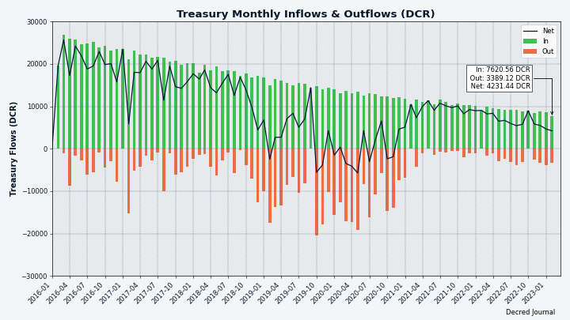
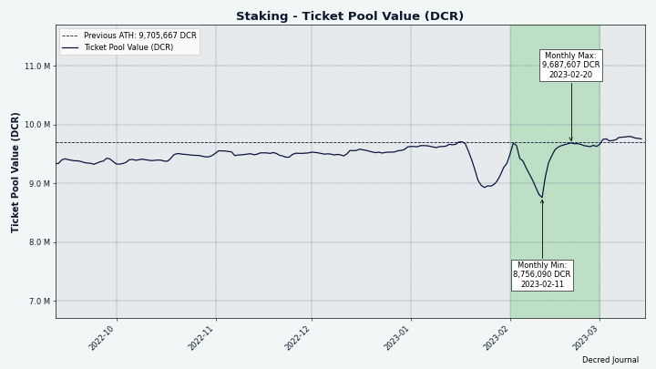
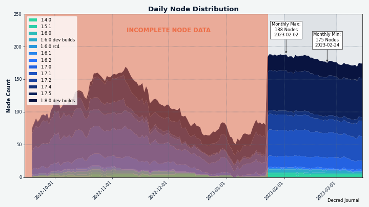
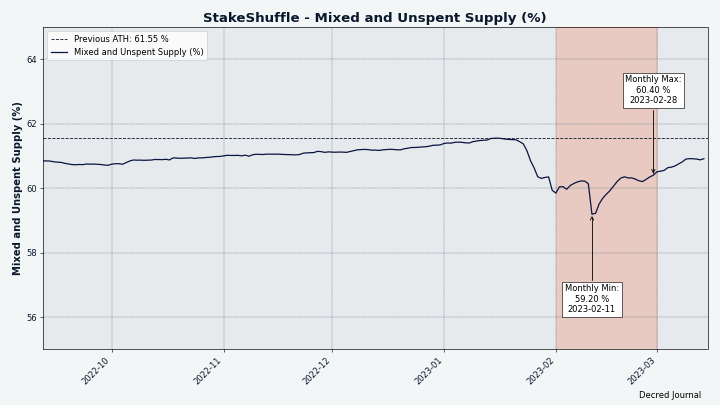
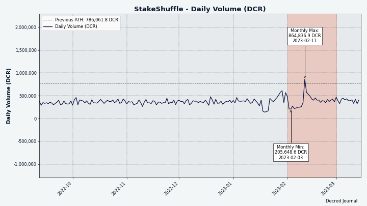

# Decred Journal – Luty 2023

_Obraz: Tort urodzinowy Decred_

Najważniejsze wydarzenia z lutego:

- Kolejny kamień milowy w Decred; to już 7 lat nieprzerwanego działania i rozwoju.
- Decred DEX doczekał się wersji v0.5.9 z poprawkami błędów i upiększeniem, pojawiają się liczne doniesienia o dużym postępie w rozwoju, a wersja v0.6 jest coraz bliżej.
- Wydano Bison Relay v0.1.4, z poprawkami UX i uruchomieniem Oprah, bota do napiwków.
- Wdrożono przeprojektowanie usługi Timestamply.
- Cena biletów odnotowała gwałtowny spadek, po którym nastąpił epicki wzrost, który wybił ją na nowe wyżyny.

Spis treści:

- [Wydanie DCRDEX v0.5.9](#dcrdex-v059-release)
- [Wydanie Bison Relay v0.1.4](#bison-relay-v014-release)
- [Rozwój](#development)
- [Ludzie](#people)
- [Zarządzanie](#governance)
- [Sieć](#network)
- [Nawiązywanie kontaktów](#outreach)
- [Eventy](#events)
- [Media](#media)
- [Rynki](#markets)
- [Ważne kwestie i wiadomości poboczne](#relevant-external)

## Wydanie DCRDEX v0.5.9

Wydano v0.5.9, z v0.6 tuż za rogiem, aby umożliwić automatyczne wdrażanie obrazów Docker dla Umbrel. Jednakże, w tym wydaniu znajduje się wiele innych poprawek, które zostały przeniesione z rozwoju v0.6:

- Poprawiona kompakcja bazy danych klientów, aby zaoszczędzić miejsce na dysku.
- Dokładniejsze szacunki opłat za wymianę.
- Ochrona przed swapami o zerowej opłacie.
- Poprawiona wydajność.
- Poprawione logowanie.
- Naprawiono około tuzina przypadków brzegowych.

Pełna informacja o wydaniu i samodzielna aplikacja DEX do pobrania znajduje się [tutaj](https://github.com/decred/dcrdex/releases). Dołączone zostały hashe i podpisy, które pozwalają na [weryfikację](https://docs.decred.org/advanced/verifying-binaries), że pobrane pliki nie zostały uszkodzone lub zmodyfikowane przez osoby trzecie.

## Wydanie Bison Relay v0.1.4

Bison Relay otrzymał kolejne ulepszenia jakości życia wraz z aktualizacją v0.1.4:

- Wszystko działa szybciej.
- Regulowany rozmiar czcionki.
- Załączanie obrazów i linków.
- Panel po prawej stronie ułatwiający dostęp do działań na użytkownikach i czatach grupowych.
- Solidniejsze utrzymanie wymiany kluczy.
- Bot napiwkowy, który nagradza autorów wartościowych treści.
- Wiele innych usprawnień UX.

Krótki przegląd wideo nowych funkcji jest dostępny [tutaj](https://www.youtube.com/watch?v=Yz-IPu00eDc).

Pobierz najnowsze wydanie na ulepszonej stronie [pobrań](https://bisonrelay.org/download/). Zgłoszenia błędów i opinie są mile widziane w [trackerze issues na GitHub](https://github.com/companyzero/bisonrelay/issues) i na czacie [#br](https://chat.decred.org/#/room/#br:decred.org) na Matrixie.

## Rozwój

O ile nie zaznaczono inaczej, prace zgłaszane poniżej mają status „scalonych z repozytorium głównym (master)”. Oznacza to, że prace są ukończone, zrecenzowane i zintegrowane z kodem źródłowym, który zaawansowani użytkownicy mogą [kompilować i uruchamiać](https://medium.com/@artikozel/the-decred-node-back-to-the-source-part-one-27d4576e7e1c), ale ich efekty nie są jeszcze dostępne w wersji plików binarnych dla zwykłych użytkowników.

### dcrd

_[dcrd](https://github.com/decred/dcrd) jest pełną implementacją węzła, który obsługuje sieć peer-to-peer Decred na całym świecie._

Większość zmian skupiła się na uczynieniu kodu wdrażania konsensusu bardziej solidnym i łatwiejszym do zrozumienia:

- Przerobiono logikę walidacji i testy [wdrażania konsensusu](https://github.com/decred/dcrd/pull/3056), aby ułatwić jej modyfikację i dostosować ją do bardziej nowoczesnych praktyk kodowania stosowanych w bazie kodu. Terminy "wdrożenie" i "agenda", które odnoszą się do [definicji z głosowania nad zasadami konsensusu](https://github.com/decred/dcrd/blob/974b1b3ccc7393c5450d75f1f58b75b80020cc3b/chaincfg/mainnetparams.go#L139), zawierają opis, wybór głosów, okres ważności i inne szczegóły.
- Wymuszenie [globalnie unikalnych identyfikatorów głosów](https://github.com/decred/dcrd/pull/3057) dla różnych agend głosowania. Technicznie rzecz biorąc, ponowne użycie identyfikatorów głosów nie było niepoprawne, jednakże różne oprogramowanie w ekosystemie Decred domyślnie zakłada, że identyfikatory są unikalne dla wszystkich agend. Ta niepisana zasada jest teraz sformalizowana, aby zapobiec zamieszaniu i uprościć kod zajmujący się nią.
- Uproszczono kod, który śledzi status [zmiany zasad konsensusu](https://github.com/decred/dcrd/pull/3059).
- Dodano parametr sieciowy do [wymuszania głosowania konsensusowego](https://github.com/decred/dcrd/pull/3060) do pewnych wyników i aktywowania odpowiednio ich cech. Było to już używane w sieciach testowych do szybkiego testowania funkcji bez przechodzenia przez cały proces głosowania. Sposób, w jaki to działało, został jednak uznany za zaskakujący: "jeśli wdrożenie nie występuje w parametrach dla danej sieci, jest ono uważane za aktywne". Inne problemy obejmowały złożoność testowania samego procesu głosowania i takie niejawnie wymuszone głosowania będące niewidoczne w komendach takich jak `getblockchaininfo`. Wszystkie te problemy zostały naprawione i teraz łatwiej jest zlokalizować wymuszone reguły w kodzie. Dodano także kontrolę bezpieczeństwa, aby upewnić się, że wymuszone wybory głosów nie mogą być używane w głównej sieci.

Docker:

- Dodano możliwość budowania [obrazów Docker](https://github.com/decred/dcrd/pull/3048) dla określonej wersji Git.
- Wyświetlanie wersji [dcrctl](https://github.com/decred/dcrd/pull/3062) oprócz wersji dcrd, ponieważ pochodzą one teraz z oddzielnych repozytoriów.

Pozostałe:

- Przełączenie się na nowe [typy atomowe](https://github.com/decred/dcrd/pull/3053) w niewyeksportowanych modułach dzięki Go 1.19. Dzięki temu kod jest mniej podatny na błędy ludzkie i nieco mniej rozwlekły. Wyeksportowane moduły są aktualizowane w [osobnym PR](https://github.com/decred/dcrd/pull/3054), który zostanie scalony później, aby [nie zmuszać konsumentów](https://github.com/decred/dcrd/pull/3054#issuecomment-1428189607) do korzystania z nowszych wersji Go zbyt wcześnie.
- Zaktualizowano śledzenie [zapytań połączenia](https://github.com/decred/dcrd/pull/3055), aby zapobiec błędom współbieżności.
- Poprawiono budowanie dla OpenBSD na architekturze CPU [riscv64](https://github.com/decred/dcrd/pull/3049).
- Zaktualizowano infrastrukturę buildów i dokumenty dla [Go 1.20](https://github.com/decred/dcrd/pull/3052) oraz porzucono wsparcie dla Go 1.18.
- Aktualizacje zależności.

### dcrwallet

_[dcrwallet](https://github.com/decred/dcrwallet) to serwer portfela używany przez wiersz polecenia oraz aplikacje graficzne._

- Naprawiono martwy punkt przy [odkrywaniu adresów](https://github.com/decred/dcrwallet/pull/2204), który mógł być wywołany przez niefortunnie wykonaną komendę `getnewaddress`.
- Zaktualizowano moduł [`addrmgr`](https://github.com/decred/dcrwallet/pull/2206) z dcrd w celu poprawy wydajności w trybie SPV, gdy dostępnych jest kilka wysokiej jakości peerów.
- Zaktualizowano moduły [golang.org/x](https://github.com/decred/dcrwallet/pull/2209), włączając w to nowszy `x/sys`, aby wspierać budowanie na [OpenBSD](https://github.com/decred/dcrwallet/pull/2208) działającym na procesorze riscv64.

### dcrctl

_[dcrctl](https://github.com/decred/dcrctl) to klient wiersza polecenia dla dcrd i dcrwallet._

- Zaktualizowano [zależności](https://github.com/decred/dcrctl/pull/54) do najnowszych modułów. Pozwala to na budowanie na OpenBSD riscv64, a także znacznie ogranicza pośrednie zależności.

### Decrediton

_[Decrediton](https://github.com/decred/decrediton) to w pełni funkcjonalny desktopowy portfel ze zintegrowaną funkcją głosowania, mieszania StakeShuffle, Lightning Network, handlem na DEX i nie tylko. Działa z lub bez dostępu do pełnego łańcucha (tryb SPV)._

W toku:

- [Aktualizacja do React v18](https://github.com/decred/decrediton/pull/3851). Może wymagać dużych zmian, ale powinna przynieść poprawę wydajności.

### vspd

_[vspd](https://github.com/decred/vspd) to oprogramowanie serwera dla pul udziałów (Voting Service Provider). VSP oddaje głos za swoich użytkowników 24/7 oraz nie wchodzi w posiadanie żadnych środków, a tym samym nie może ich ukraść._

- Sprawdzanie, czy [VSP jest zamknięte](https://github.com/decred/vspd/pull/369) dużo wcześniej, przed inicjalizacją baz danych klientów dcrd/dcrwallet. Jest to bardziej wydajne i zapobiega ewentualnym błędom.
- Aktualizacja do [Go 1.20](https://github.com/decred/vspd/pull/368).
- Testy są teraz uruchamiane jako [podtesty](https://github.com/decred/vspd/pull/365), aby umożliwić lepsze raportowanie wyników testów i metryk.
- Dodano testy dla [obsługi błędów](https://github.com/decred/vspd/pull/363), które zapewniają, że błędy vspd są poprawnie sformatowane, a błędy niepochodzące od vspd zawierają odpowiednie informacje do debugowania.
- Usunięto [instrukcje dcrstakepool](https://github.com/decred/vspd/pull/370) z dokumentacji, ponieważ jest ona już nieaktualna.

### cspp

_[cspp](https://github.com/decred/cspp) to serwer do koordynowania mieszania monet za pośrednictwem protokołu CoinShuffle++. Nie jest powierniczy, tzn. nie przejmuje kontroli nad środkami._

- Zaktualizowano CI do kompilacji na Ubuntu 22 z najnowszą biblioteką [matematyki](http://www.flintlib.org/) [flint2](https://github.com/decred/cspp/pull/69).
- Dodano pakiet [`solverrpc`](https://github.com/decred/cspp/pull/86) jako zamiennik dla istniejącego już `solver`. Pozwala on na wyodrębnienie interakcji z kodem C (biblioteką matematyczną flint2) do osobnego procesu tła o nazwie `csppsolver` i rozmowę z tym procesem z poziomu czystego kodu Go, co jest bardziej elastyczne.
- Dodano [flagi dla buildów](https://github.com/decred/cspp/pull/87), które pozwalają na zbudowanie całkowicie samodzielnego pliku wykonywalnego `csppsolver` z osadzoną w nim biblioteką flint2. Dystrybucja takiego programu usuwa potrzebę instalacji flint2.

### DCRDEX

_[DCRDEX](https://github.com/decred/dcrdex) to niepowiernicza giełda, umożliwiająca handel bez konieczności zaufania, działająca dzięki technologii atomic swaps._

Wydanie [v0.5.9](https://github.com/decred/dcrdex/releases/tag/v0.5.9) zostało stworzone, by wspierać [integrację z Umbrel](https://github.com/decred/dcrdex/pull/2153), ale zawiera także wiele ważnych poprawek wprowadzonych na gałęzi `master` od około grudnia 2022:

- Dostosowano, które [opłaty swapowe](https://github.com/decred/dcrdex/pull/2147) są uważane za "najlepsze" dla BTC i DCR. Najkorzystniejsze opłaty występują, gdy całe zamówienie jest zużywane w jednym spasowaniu, tj. 1 transakcja i 1 wyjście dla całego zamówienia. Wpływa to na podglądy opłat pokazywane podczas składania zamówienia.
- Automatyczne ignorowanie bardzo [starych powiadomień](https://github.com/decred/dcrdex/pull/2144) generowanych przez stare wersje klienta.
- [Zaktualizowano konfigurację Dockera](https://github.com/decred/dcrdex/pull/2112): zoptymalizowano obrazy bazowe, przełączono klienta DEX do uruchamiania jako użytkownik bez praw roota, usunięto niepotrzebne pliki i zoptymalizowano [build Dockera](https://github.com/decred/dcrdex/pull/2162) pod kątem produkcji. Między innymi pomaga to opublikować klienta DEX w [sklepie aplikacji Umbrel](https://proposals.decred.org/record/8d83046).
- Dodano workflow GitHub do budowania i publikowania [obrazów wydań Dockera](https://github.com/decred/dcrdex/pull/2127).
- Zaktualizowano moduł [menadżera adresów](https://github.com/decred/dcrdex/pull/2096) dcrd, aby naprawić wysokie użycie procesora podczas uruchamiania portfela testnet SPV przez dłużej niż jeden dzień.
- Poprawiono liczbę usuniętych [zamówień i spasowań](https://github.com/decred/dcrdex/pull/2098), która jest zgłaszana przez funkcje czyszczenia archiwum.
- Naprawiono bezcelowe [próby ponownego połączenia](https://github.com/decred/dcrdex/pull/2130) w przypadku wykrycia błędu certyfikatu "niespełniającego standardów" na niektórych systemach macOS.
- Naprawiono próbę uruchomienia klienta, gdy nie udało się załadować [bazy danych kont](https://github.com/decred/dcrdex/pull/2119).
- Aktualizacje zależności, w tym drobne poprawki bezpieczeństwa.
- Zbackportowano [~14 pozostałych poprawek](https://github.com/decred/dcrdex/pull/2153) z gałęzi `master` z okresu grudzień-styczeń.

Wszystkie inne zmiany poniżej są na gałęzi `master` w kierunku następnego [wydania v0.6](https://github.com/decred/dcrdex/milestone/22).

Zmiany w klientach:

- Obsługa większej ilości przypadków brzegowych, gdy [certyfikat serwera się zmienia](https://github.com/decred/dcrdex/pull/2019).
- Ukrycie [formularza zamówienia](https://github.com/decred/dcrdex/pull/2054), jeśli wersja aktywów nie jest obsługiwana.
- Wyświetlanie [opłaty jako procenta](https://github.com/decred/dcrdex/pull/2110) zamówienia dla aktywów tokenowych, jeśli stawki fiat są dostępne zarówno dla tokena, jak i jego aktywów macierzystych.
- Zezwolenie na połączenie się z serwerem DEX [w trybie tylko do oglądania](https://github.com/decred/dcrdex/pull/1986) bez rejestracji i przeglądanie rynków i księgi zamówień.

Klient, postępy w kaucjach:

- Zaimplementowano główny [cykl życia kaucji](https://github.com/decred/dcrdex/pull/2036) dla klienta, włączając w to automatyczną ich rotację. Kiedy aktualna kaucja ma wygasnąć, musi zostać zastąpiona inną w odpowiednim czasie, aby kontynuować korzystanie z DEX bez przerwy. Dodano [diagram](https://github.com/decred/dcrdex/blob/7603ead02dc6e040e69b50f8796e3f23aac06e1b/client/core/bond.go#L49) wyjaśniający cykl życia kaucji.
- Wprowadzono utrzymanie [rezerwy środków dla kaucji](https://github.com/decred/dcrdex/pull/2103). Część środków portfela będzie zarezerwowana na przyszłe kaucje plus bufor na opłaty transakcyjne. Kiedy rezerwy są egzekwowane, transakcje takie jak wypłaty z portfela lub zlecenia handlowe będą ograniczone do niższego dostępnego salda. Raport bilansu portfela pokaże środki zablokowane w istniejących kaucjach i zarezerwowane na poczet przyszłych. Kaucje będą używać innej strategii wyboru monet, niż ta, która finansuje zlecenia handlowe. Zamówienia starają się zużywać mniej wyjść, aby zminimalizować opłaty (mogą wydać więcej DCR i zwrócić nadmiar jako drobne), podczas gdy obligacje starają się umieścić dokładną kwotę DCR w blokadzie czasowej (i nie mogą polegać na wyjściu dla drobnych). Wstępna dostosowanie wielkości wejść dla transakcji swapowych zostało domyślnie włączone dla DCR, ponieważ jest korzystne dla zarządzania kaucjami, a opłaty DCR są teraz niskie. Nie będzie można wyłączyć kont, które mają niewydane kaucje. Początkowa implementacja wspiera tylko kaucje w DCR, ale dodano fundamenty, aby umożliwić opłacanie kaucji w innych aktywach.
- Zmieniono przepływ UI rejestracji do [tworzenia kaucji](https://github.com/decred/dcrdex/pull/2025) zamiast płacenia opłaty. Użytkownik będzie miał wybór, jak duża powinna być kaucja. Jeśli poziom konta będzie poniżej poziomu wymaganego do handlu i będą z nim powiązane oczekujące kaucje, strona rynków pokaże ilość potwierdzeń kaucji, zanim będzie można przejść do handlu. Funkcja Post Bond została dodana dla ręcznego uiszczania kaucji.
- Zoptymalizowano algorytm [wyboru monet](https://github.com/decred/dcrdex/pull/2169), aby tworzyć kaucje bliższe docelowej kwocie DCR.
- Ukończone, trwające i pozostałe zadania dla podsystemu kaucji można zobaczyć na [tej tablicy](https://github.com/orgs/decred/projects/2/views/1).
- W szerszym ujęciu, [kaucje](https://en.wikipedia.org/wiki/Fidelity_bond) są potrzebne, aby przejść od użytkowników *płacących opłaty* na rzecz serwera, do użytkowników *blokujących fundusze* podczas korzystania z serwera. Oba podejścia chronią serwer przed spamem i innymi niepożądanymi zachowaniami. Kaucje są bardziej złożone niż opłaty, ale mają zalety. Użytkownicy mogą zwrócić zablokowane środki, gdy nie chcą już handlować, a także wspierają przejście od samodzielnych serwerów do zdecentralizowanej [siatki](https://github.com/decred/dcrdex/issues/1765) (z systemem opłat byłoby niejasne, które serwery powinny zbierać opłaty).

Poprawki w kliencie:

- Naprawiono tworzenie [portfeli tokenów](https://github.com/decred/dcrdex/pull/2121), gdy portfel nadrzędny nie został jeszcze utworzony.
- Poprawiono rozbieżność [statusu zamówienia](https://github.com/decred/dcrdex/pull/2140) na różnych widokach.
- Naprawiono mylące raportowanie [postępu synchronizacji](https://github.com/decred/dcrdex/pull/2133) na stronie Rejestracji.
- Naprawiono powtarzające się ponowne pobieranie [ikony aktywów](https://github.com/decred/dcrdex/pull/2163).
- Naprawiono błąd przy wysyłaniu [wszystkich dostępnych DCR](https://github.com/decred/dcrdex/pull/2170) z portfela.
- Naprawiono [kursor i kierunek sortowania](https://github.com/decred/dcrdex/pull/2172) w tabeli ostatnich spasowań.
- Naprawiono brak aktualizacji [salda portfela](https://github.com/decred/dcrdex/pull/2183) po sfinansowaniu zlecenia.
- Naprawiono ~4 błędy związane ze współbieżnością.
- Inne poprawki dla UI, testów, dokumentacji i optymalizacji obrazu Docker.

Ethereum, dostawcy danych RPC:

- Dodano możliwość konfigurowania przez serwer DEX [wielu dostawców danych Ethereum](https://github.com/decred/dcrdex/pull/2104) i przełączania się na innego dostawcę, jeśli wybrany dostawca przestanie działać.
- Dodano monitorowanie stanu [dostawcy RPC](https://github.com/decred/dcrdex/pull/2125). Poprzednio backend ETH uruchamiał się tylko wtedy, gdy wszyscy skonfigurowani dostawcy mogli być podłączeni i mieli zaktualizowany blockchain. Teraz backend ETH uruchomi się, jeśli połączenie z co najmniej jednym dostawcą działa i zgłasza świeży blok. Po nawiązaniu połączenia dostawcy będą stale monitorowani pod kątem zdrowych odpowiedzi, a najlepsi dostawcy będą wykorzystywani w pierwszej kolejności.
- Poprawiono zarządzanie [znanymi i zgodnymi dostawcami RPC](https://github.com/decred/dcrdex/pull/2102).
- Naprawiono próby użycia dostawców RPC, którzy mają [zbyt stare nagłówki bloków](https://github.com/decred/dcrdex/pull/2074), co oznacza, że nie są zsynchronizowani z siecią.

Ethereum, optymalizacja opłat wymiany:

- [Szacunkowe opłaty wymiany](https://github.com/decred/dcrdex/pull/2129) reagują teraz na limity gazu bloków Ethereum.
- Próba użycia niższego limitu gazu dla [grupowych wymian](https://github.com/decred/dcrdex/pull/2143) (wiele swapów w jednej transakcji) przed poddaniem się i niepowodzeniem z niewystarczającymi środkami.
- Dostosowano [szacunkowe opłaty](https://github.com/decred/dcrdex/pull/2139) do niższych i bardziej realistycznych kwot.

Ethereum, pozostałe zmiany:

- Wyjaśniono [wersjonowanie API](https://github.com/decred/dcrdex/pull/2094) ETH i jego tokenów. Na razie aktywa tokenowe będą używać tej samej wersji co aktywa główne. Numery wersji będą używane do określenia, czy różni klienci i serwery są kompatybilne.
- Usunięto metodę [`isRedeemable`](https://github.com/decred/dcrdex/pull/2111) ze smartkontraktów Solidity dla wymian ETH i ERC-20 oraz wyłączono użycie wywołania `estimateRedeemGas`. Obie metody ujawniają sekret węzłowi Ethereum przed transakcją redeem. Nie stanowiło to problemu, gdy klient korzystał z prywatnego węzła, ale staje się podatnością w przypadku publicznych dostawców RPC, których DEX jest zmuszony używać od czasu The Merge. Kompilator Solidity został zaktualizowany do v0.8.18.
- Budowanie kodem [go-ethereum](https://github.com/ethereum/go-ethereum) jest teraz [domyślne](https://github.com/decred/dcrdex/pull/2157). go-ethereum to popularne oprogramowanie Ethereum, dzięki któremu DCRDEX wspiera ETH i ERC-20. W przeciwieństwie do DEX jest ono licencjonowane na licencji GNU Lesser General Public License (LGPL). Obciążenie tą licencją może być nie do zaakceptowania dla zamkniętego oprogramowania, które chce korzystać z DCRDEX, dlatego dodano flagę, aby wykluczyć go-ethereum z kompilacji.
- Uruchomiono ETH i USDC na sieci [mainnet](https://github.com/decred/dcrdex/pull/2013) i dostosowano limity gazu. Zmniejszono ilość potwierdzeń transakcji wykupienia z 10 do 3, ponieważ reorgi po The Merge są [uważane](https://github.com/decred/dcrdex/commit/5c1ff8ab05a43b431f6d8e091692c32ea181e937) za bardzo mało prawdopodobne. Entuzjaści smartkontraktów mogą znaleźć nowy kontrakt wymiany dla ETH [tutaj](https://etherscan.io/address/0x8c17e4968b6903e1601be82ca989c5b5e2c7b400#code), a dla ERC-20 [tutaj](https://etherscan.io/address/0x1bbd020ddd6dc01f974aa74d2d727b2a6782f32d#code).
- @chappjc [zatweetował](https://twitter.com/chappjc/status/1623136803661266947), że nowe kontrakty wykorzystane zostały w wielu atomic swapach ETH i USDC na mainnecie.
- Poprawki błędów.

Aktualizacja Ethereum do konsensusu proof-of-stake (zwana również [The Merge](https://ethereum.org/en/upgrades/merge/)) przypadkiem [zepsuła lekkiego klienta](https://github.com/ethereum/go-ethereum/issues/25623) używanego przez DCRDEX, pomimo pewnych [oczekiwań](https://blog.ethereum.org/2021/03/24/finalized-no-24), że będzie działać. Opóźniło to dość znacznie wydanie DCRDEX v0.6, ponieważ gdy trzeba było opracować obejście problemu. Do czasu naprawienia [lekkiego klienta](https://geth.ethereum.org/docs/fundamentals/les) użytkownicy DEX będą mieli do wyboru uruchomienie własnego pełnego węzła lub skorzystanie ze scentralizowanych dostawców danych łańcuchowych takich jak [Infura](https://www.infura.io/), [Ankr](https://www.ankr.com/) i [8 innych](https://github.com/decred/dcrdex/blob/80b0531a64a806ac8901d812b1e322418118cac1/client/asset/eth/multirpc.go).

Integracja ze sklepem aplikacji Umbrel:

- Dodano nowe repozytorium do organizacji Decred GitHub dla przechowywania kodu [integracji z Umbrel](https://github.com/decred/umbrel-app-store). Użytkownicy Umbrel mogą postępować zgodnie z instrukcjami, aby dodać to repozytorium i zainstalować pakiet DCRDEX.
- Pakiet DCRDEX został przesłany do [oficjalnego sklepu z aplikacjami Umbrel](https://github.com/getumbrel/umbrel-apps/pull/430) w celu weryfikacji. W przeciwieństwie do niestandardowych sklepów z aplikacjami społecznościowymi wymaga on scentralizowanego zatwierdzenia.

### Timestamply

_[Timestamply](https://github.com/decred/dcrtimegui) to darmowa usługa znakowania czasowego plików działająca na łańcuchu Decred. Znacznik czasowy udowadnia, że dany plik istniał w określonym momencie. Usługa ta ma szereg zastosowań w ochronie nienaruszalności danych._

- Pełny [redesign](https://github.com/decred/dcrtimegui/pull/151) ogłoszony w [styczniu](202301.md#timestamply) został sfinalizowany i wdrożony pod adresem [timestamp.decred.org](https://timestamp.decred.org/). Wszystkie istniejące dane zostały [zmigrowane](https://proposals.decred.org/record/855a506/comments/20).
- Dodana została nowa metoda API, która zwraca [ostatnie digesty](https://github.com/decred/dcrtime/pull/84) opatrzone znacznikiem czasu przez serwer dcrtime. Jest ona używana przez nowe GUI.
- Aktualizacja do [Node v16](https://github.com/decred/dcrtimegui/pull/152).

### Dokumentacja

_[dcrdocs](https://github.com/decred/dcrdocs) to repozytorium źródłowe [dokumentacji użytkownika](https://docs.decred.org/) dla Decred._

- Aktualizacja do [MkDocs Material v9](https://github.com/decred/dcrdocs/pull/1214) z ulepszonym wyszukiwaniem.
- Usunięto ikony [Font Awesome](https://github.com/decred/dcrdocs/pull/1216), ponieważ nie działały i pojawiały się tylko na kilku stronach.

### Bison Relay

_[Bison Relay](https://github.com/companyzero/bisonrelay) to nowa platforma mediów społecznościowych peer-to-peer z silną ochroną przeciw cenzurze, inwiligacji, oraz reklamom, działająca na bazie Lightning Network projektu Decred._

Wspólne zmiany dla aplikacji GUI i wiersza polecenia w wydaniu v0.1.4:

- Dodano wsparcie dla opłacania i wysyłania [wielu wiadomości równolegle](https://github.com/companyzero/bisonrelay/pull/98) bez czekania na potwierdzenie serwera, co znacznie przyspiesza wysyłanie.
- Dodano wsparcie dla [wysyłania i renderowania embedów](https://github.com/companyzero/bisonrelay/pull/118) (takich jak obrazy i linki do pobrania) w prywatnych i grupowych czatach.
- Poprawiono śledzenie statusu szyfrowania i utrzymywanie [resetu wymiany kluczy (KX)](https://github.com/companyzero/bisonrelay/pull/116). Dodano półautomatyczne narzędzia do wykrywania i resetowania potencjalnie uszkodzonych wymian kluczy. Kandydatami do zresetowania są użytkownicy, od których nie otrzymywano wiadomości przez długi czas, lub wszyscy użytkownicy, jeśli ich klient był offline przez długi czas.
- Poprawiono obsługę nowych wiadomości czatu grupowego otrzymanych tuż [po połączeniu](https://github.com/companyzero/bisonrelay/pull/130) z serwerem. Powinno to pokazać wiadomości prawidłowo uporządkowane według czasu, szczególnie na wolniejszych połączeniach.
- Naprawiono błąd, który uniemożliwiał [czyste zamknięcie](https://github.com/companyzero/bisonrelay/commit/ec5637968937439eb8752aa41200947051b2f8c0) w niektórych przypadkach.
- Naprawiono możliwe pętle ponownego połączenia spowodowane przez klienta próbującego [ponownie użyć tej samej płatności](https://github.com/companyzero/bisonrelay/pull/131).

Zmiany w aplikacji GUI w wydaniu v0.1.4:

- Dodano [ustawienie rozmiaru czcionki](https://github.com/companyzero/bisonrelay/pull/117) z 4 rozmiarami do wyboru.
- Przeniesiono akcje menu dla użytkowników i czatów grupowych (Lista postów, Daj napiwek, itp.) do [panelu po prawej stronie](https://github.com/companyzero/bisonrelay/pull/119). Jest to rozwiązanie podobne do tego z Elementa i łatwiejsze w użyciu.
- Kolejność list czatów jest [zachowywana](https://github.com/companyzero/bisonrelay/pull/111) po ponownym uruchomieniu aplikacji.
- Używanie [czcionki emoji](https://github.com/companyzero/bisonrelay/commit/41fd091af874512d7a3d941f094c1615e54ee70b), aby wyświetlić więcej znaków i emoji.

Zmiany w aplikacji wiersza polecenia w wydaniu v0.1.4:

- Usunięto Ctrl+C jako skrót do zamknięcia aplikacji.
- Usunięto [automatyczne przewijanie do dołu](https://github.com/companyzero/bisonrelay/commit/9324add82f4f7bd5317a31f14c8f78618e79e856), jeśli widok nie był od początku na dole.
- Powiadamianie bieżącego okna o [zakończonym pobieraniu](https://github.com/companyzero/bisonrelay/commit/fdad19d95a140125019daa5bbb929ed6892df2f2).
- Dodano [znacznik nieprzeczytanej wiadomości](https://github.com/companyzero/bisonrelay/commit/e03164fcdf3c168cb772bde17310a003de8418f6) do nieaktywnych okien.
- Inne poprawki i aktualizacje zależności.

Zmiany serwera i inne w wydaniu v0.1.4:

- Dodano obsługę przyjmowania wielu wiadomości [jednocześnie](https://github.com/companyzero/bisonrelay/pull/97). Domyślnie podłączony klient może zażądać do 8 faktur za wysyłanie wiadomości, zanim będzie musiał za nie zapłacić. Serwer musi wykryć płatność w ciągu 24 godzin, w przeciwnym razie wymagana będzie nowa płatność. Serwer produkcyjny może używać do tego innych parametrów.
- [Przechowywanie otrzymanych wiadomości](https://github.com/companyzero/bisonrelay/pull/110), aby korzystający z `clientrpc` mogli je pobrać. Zapobiega to pomijaniu wiadomości w botach i innych narzędziach automatyzacji.

Wspólne zmiany dla aplikacji GUI i wiersza polecenia scalone na gałęzi `master` do następnego wydania (v0.1.5):

- Dodano [ostrzeżenie](https://github.com/companyzero/bisonrelay/pull/139) dla użytkownika o awarii generowania faktur LN i sugerujące zwiększenie pojemności odbiorczej.
- Dodano [wersjonowanie czatów grupowych](https://github.com/companyzero/bisonrelay/pull/140) oraz ostrzeżenie o nieobsługiwanej wersji czatu grupowego.
- Dodano polecenie [ponownego wysłania informacji o czacie grupowym](https://github.com/companyzero/bisonrelay/commit/dc63dafcad9dad4e1db105418e642ea50349896f) do jego członków, aby naprawić problemy związane z utratą synchronizacji listy użytkowników.
- Naprawiono [porządkowanie wiadomości czatu grupowego](https://github.com/companyzero/bisonrelay/pull/136) po ponownym uruchomieniu aplikacji.

Zmiany w aplikacji GUI scalone z gałęzią `master`:

- Dodano poziomą linię oznaczającą początek otrzymanych [nieprzeczytanych wiadomości](https://github.com/companyzero/bisonrelay/pull/137). Usunięto wyświetlanie awatara i nazwy użytkownika, jeśli następujące po sobie wiadomości pochodzą od tego samego autora.
- Dodano podsumowanie [wysłanych i otrzymanych](https://github.com/companyzero/bisonrelay/pull/146) DCR do strony statystyk płatności.
- Dodano [kody QR](https://github.com/companyzero/bisonrelay/pull/148) dla adresów do depozytów.
- Domyślnie ukryto [opcje zaawansowane](https://github.com/companyzero/bisonrelay/pull/150) na stronach, które zachęcają do otwarcia większej ilości kanałów LN.
- Naprawiono utratę możliwości wyboru [aktywnego czatu](https://github.com/companyzero/bisonrelay/pull/145) przy otwieraniu sekcji czatów.

Zmiany w aplikacji wiersza polecenia scalone z gałęzią `master`:

- Uproszczono kod dla otwierania kanałów i [żądania pojemności odbiorczej](https://github.com/companyzero/bisonrelay/pull/147).
- Umożliwienie określenia [niestandardowych adresów IP](https://github.com/companyzero/bisonrelay/pull/149), na których wbudowana instancja dcrlnd będzie słuchać zamiast domyślnego `127.0.0.1`.
- Poprawiono [zawijanie tekstu](https://github.com/companyzero/bisonrelay/pull/132) i renderowanie elementów wieloliniowych.
- Dodano [mediację wymiany kluczy](https://github.com/companyzero/bisonrelay/pull/134) i [nick autora](https://github.com/companyzero/bisonrelay/pull/151) do API automatyzacji używanego przez boty i inne narzędzia.

Pozostałe:

- Oprah już rozdaje! To bot napiwkowy, który śledzi użytkowników i nagradza ich za merytoryczne posty lub komentarze. Zapytaj na czacie [#br](https://chat.decred.org/#/room/#br:decred.org) na Matrixie, jak dostać napiwek od Oprah.

## Ludzie

Statystyki społeczności na dzień 1. marca (w porównaniu z 2. lutego):

- Obserwujący na [Twitterze](https://twitter.com/decredproject): 53064 (-204)
- Subskrybenci na [Reddit](https://www.reddit.com/r/decred/): 12660 (-3)
- Użytkownicy na [Matrixie](https://chat.decred.org/) w pokoju #general: 750 (+8)
- Użytkownicy na [Discordzie](https://discord.gg/GJ2GXfz): 1557, zweryfikowani z możliwością pisania: 932 (+6)
- Użytkownicy na [Telegramie](https://t.me/Decred): 2,756 (-60)
- Subskrybenci na [YouTube](https://www.youtube.com/decredchannel): 4630 (-10), wyświetleń: 224,6K (+2,3K)

## Zarządzanie

W lutym nowy [Skarbiec](https://dcrdata.decred.org/treasury) otrzymał 7620 DCR o wartości 83 tys. USD po średnim lutowym kursie wymiany $24,03. 3389 DCR zostało wydane, aby zapłacić kontrahentom, co stanowiło wartość $81K po lutowym kursie wymiany.

Transakcja [wypłaty ze Skarbca](https://explorer.dcrdata.org/tx/e09505dbb877e5efdd184129858be5655a3de235cdac2cfa749442f0ccf7de81) zawierała 27 wyjść, od 3 do 1084 DCR. Większość z tej sumy pokrywała pracę za grudzień, jako że zrobiło się pewne opóźnienie między końcem miesiąca a utworzeniem transakcji TSpend za rzeczony miesiąc, co w rezultacie oznacza około dwumiesięczne opóźnienie pomiędzy wykonaną pracą a zatwierdzeniem wypłaty przez interesariuszy. Po grudniowym kursie rozliczeniowym $19,79 transakcja TSpend opiewała na sumę $67K.

_Obraz: Miesieczne wpływy i wypłaty ze Skarbca Decred._

Na dzień 14. marca, łączne saldo [starego](https://dcrdata.decred.org/address/Dcur2mcGjmENx4DhNqDctW5wJCVyT3Qeqkx) i [nowego Skarbca](https://dcrdata.decred.org/treasury) wynosi 844504 DCR (16,8 miliona USD po kursie $19,88).

_Obraz: Historia salda Skarbca Decred._

W lutym nie pojawiły się żadne nowe propozycje, a propozycje, które zakończyły głosowanie, zostały opisane i podsumowane w [styczniowym wydaniu](202301.md#governance) Decred Journal.

## Sieć

**Hashrate**: lutowy [hashrate](https://dcrdata.decred.org/charts?chart=hashrate&scale=linear&bin=day&axis=time) na początku miesiąca wyniósł ~73 Ph/s a zamknął go na poziomie ~71 Ph/s, zaliczając niż w ok. 60 Ph/s oraz szczyt w wys. 83 Ph/s w ciągu miesiąca.

_Obraz: Moc obliczeniowa projektu Decred._

Dystrybucja mocy obliczeniowej w wys. 66 Ph/s [zadeklarowana](https://miningpoolstats.stream/decred) przez pule wydobywcze na dzień 1. marca: Poolin 51%, F2Pool 38%, AntPool 11%, CoinMine 0,4%.

Podział 1000 bloków [wydobytych](https://miningpoolstats.stream/decred) przed 1. marca: Poolin 54%, F2Pool 36%, AntPool 6%, prawdopodobnie BTC.com 4%.

_Obraz: Historyczny wykres dystrybucji mocy obliczeniowej pul wydobywczych._

**Staking**: [Cena biletów](https://dcrdata.decred.org/charts?chart=ticket-price&axis=time&visibility=true-true&mode=stepped) wahała się między 207 a 496,5 DCR, a jej 30-dniowa [średnia](https://dcrstats.com/) wyniosła 263,8 DCR (+51,3).

Po dramatycznym spadku do poziomu 140 DCR w styczniu cena biletów wystrzeliła w kosmos aż do nowego szczytu wszechczasów **496,5 DCR**. Wróciła na ziemię tydzień później i ustabilizowała się w okolicach 230 DCR.

_Obraz: Największe wahnięcie ceny biletów Decred w historii._

[Zablokowana suma](https://dcrdata.decred.org/charts?chart=ticket-pool-value&scale=linear&bin=day&axis=time) to pomiędzy 8,76 a 9,68 miliona DCR, co oznacza, że 58,5-64,9% podaży dostępnej w obiegu [wzięło udział](https://dcrdata.decred.org/charts?chart=stake-participation&scale=linear&bin=day&axis=time) w elemencie Proof of Stake. Liczby te wystawione były również na większe wahania, niż zwykle.

_Obraz: Spadek i odbicie DCR ulokowanych w PoS._

**VSP**: Na 1. marca, ~7410 (-980) biletów w puli zarządzanych było przez [16 oficjalnych VSP](https://decred.org/vsp/) serwerów vspd, co stanowi 18,4% całej puli biletowej (-0,4%).

Jedynymi dostawcami, którzy odnotowali wzrosty w lutym byli dcrhive.com (+383 bilety - zmiana o +74%) oraz vsp.decredcommunity.org (+202 bilety - zmiana o +38%). 14 pozostałych VSP straciło średnio ~25% biletów, lecz zmianę tę powinno się rozpatrywać w kontekście całej puli biletowej przechodzącej korektę z abnormalnego rozmiaru ~44880 aż do docelowego - 40960 biletów.

_Obraz: Dystrybucja biletów zarządzanych przez VSP._

**Węzły**: [Decred Mapper](https://nodes.jholdstock.uk/user_agents) odnotował między 175 a 188 węzłów dcrd w ciągu miesiąca. Wersje 176 węzłów odnotowanych 1. marca to: v1.7.5 - 34%, v1.7.1 - 22%, v1.8.0 dev buildy - 13%, v1.7.2 - 11%, v1.7.0 - 10%, v1.7.4 - 3%, pozostałe - 7%.

_Obraz: Historyczna dystrybucja wersji węzłów dcrd, dane z nodes.jholdstock.uk. Uwaga: Dane do stycznia 2023 były niekompletne_

Ilość [monet mieszanych](https://dcrdata.decred.org/charts?chart=coin-supply&zoom=jz3q237o-la8vk000&scale=linear&bin=day&axis=time&visibility=true-true-true) wahała się w granicach 59,2-60,4%.
Dzienna [kwota mieszana](https://dcrdata.decred.org/charts?chart=privacy-participation&bin=day&axis=time) oscylowała w granicach 206-865K DCR.

Ponieważ duża część mieszanych monet pochodzi ze stakingu, spadek jednego wiązał się ze spadkiem drugiego. Obie liczby wróciły do normy pod koniec lutego wraz z tym, jak udział w PoS ustabilizował się.

_Obraz: Spadek i odbicie procenta monet mieszanych i niewydanych_

_Obraz: Dzienny wolumen monet mieszanych wahał się bardziej, niż zwykle._

Eksplorator [Lightning Network](https://ln-map.jholdstock.uk/) sieci Decred na 1. marca odnotował 158 węzłów (+11) oraz 305 kanałów (+44) o całkowitej pojemności 115 DCR (+9). Statystyki te zależą od węzła LN. Na przykład, tego samego dnia węzeł @karamble odnotował 172 węzły (+12) oraz 385 kanałów (+38) o pojemności 168 DCR (+9).

## Nawiązywanie kontaktów

Osiągnięcia Monde PR:

- Zdobyto 1 wywiad w mediach
- Zaproponowano 3 możliwości umieszczenia komentarza
- Zaproponowano 4 możliwości występu w mediach

Umieszczono w mediach poniższe artykuły:

- Bison Relay został przedstawiony w [Blockworks](https://blockworks.co/news/web3-social-media-apps-to-watch) jako "aplikacja mediów społecznościowych Web3, którą warto mieć na oku".
- Artykuł w [Decred Magazine](https://www.decredmagazine.com/planbs-s2f-model-is-flawed/) zawierający komentarz @jz na temat wad modelu S2F aut. PlanB.
- Artykuł [Decred Magazine](https://www.decredmagazine.com/middlemen-need-to-be-eliminated-from-the-cryptocurrency-space/) zawierający komentarz @jz na temat pozbywania się pośredników z przestrzeni kryptowalutowej.

Komentarz do Decred Magazine został pierwotnie przygotowany dla publikacji kryptowalutowej, ale nie został wykorzystany. Zamiast wyrzucać go do kosza, został przeprojektowany i opublikowany na DM.

## Eventy

**Na których byliśmy:**

- @arij zorganizowała w Technoparku Casablanca uroczystość dla około 60 gości z okazji 7. rocznicy powstania Decred. Impreza rozpoczęła się od prezentacji projektu i jego najważniejszych kamieni milowych na przestrzeni lat, po czym nastąpiły komentarze partnerów projektu. Na imprezie dostrzeżono nową wersję tortu Decred. Więcej szczegółów w [raporcie](https://decredcommunity.github.io/events/index/20230205.1).

_Obraz: 7. tort urodzinowy Decred._

## Media

Użytkownicy Nostr [mogą teraz śledzić](https://twitter.com/decredproject/status/1626112166448271360) ogłoszenia Decred pod adresem: `npub1decredzl29afqaalgw79kzz7cscrakzul00zgq9qymt4weqg03fsqmmnzd` ([podgląd](https://iris.to/#/profile/npub1decredzl29afqaalgw79kzz7cscrakzul00zgq9qymt4weqg03fsqmmnzd)). Zamieszczajcie swoje klucze publiczne w [tym wątku](https://www.reddit.com/r/decred/comments/10vnmmo/decred_on_nostr/), aby stworzyć zalążek społeczności Decred na Nostr.

**Wybrane artykuły:**

- [Pośrednicy muszą zostać wyeliminowani z przestrzeni kryptowalutowej](https://www.decredmagazine.com/middlemen-need-to-be-eliminated-from-the-cryptocurrency-space/), aut. @HassanMaishera
- [Kryptowaluty o wartości 3,8 mld dolarów skradzione! Co można zrobić?](https://www.decredmagazine.com/u-3-8-billion-worth-of-crypto-stolen-what-can-be-done/), aut. @Joao
- [Prywatność w Internecie i dlaczego jest ważna](https://www.decredmagazine.com/internet-privacy-and-why-it-is-important/), aut. @BlockchainJew
- [Decred vs Firo: prywatność i zarządzanie!](https://www.decredmagazine.com/decred-vs-firo-privacy-and-governance/), aut. @Joao

Statystyki aktywności [Decred Magazine](https://www.decredmagazine.com/) za luty:

- Całkowita liczba artykułów na DM: 409
- Subskrybentów newslettera: 88
- Opublikowane nowe posty i newslettery: 17
- Aktywne kampanie w mediach społecznościowych: 32
- Zakończone kampanie w mediach społecznościowych 32
- Posty w mediach społecznościowych: 143
- Polubienia: 678
- Retweety: 148
- Liczba obserwujących na wszystkich kontach i platformach mediów społecznościowych (w tym [@DecredSociety](https://twitter.com/DecredSociety)): 1220

Decred Magazine zaczął budowanie bazy publiczności na TikToku. Zachęcamy do interakcji z [@decredmagazine](https://www.tiktok.com/@decredmagazine).

**Wideo:**

- [Instalacja Decrediton w trybie pełnej walidacji - fundamenty Decred](https://www.youtube.com/watch?v=JxLMi5fWL80), aut. @phoenixgreen
- [Wiadomości Decred - pary ERC20 na DEX, nowe ATH ceny biletów, nowe ekscytujące propozycje dla DCR DAO & więcej](https://www.youtube.com/watch?v=9fJ92YxL_pU), aut. @Exitus
- [Tryb Decrediton SPV i import frazy ziarna - fundamenty Decred](https://www.youtube.com/watch?v=K1zUdxsrgJM), aut. @phoenixgreen
- [Płatności peer to peer w Decrediton - wysyłanie i odbieranie](https://www.youtube.com/watch?v=DRWJ9Ajh6II), aut. @phoenixgreen
- [Aktualizacja Bison Relay do wersji 0.1.4](https://www.youtube.com/watch?v=Yz-IPu00eDc), aut. @phoenixgreen

Livestream:

- [Okrągły Stół Decred Roundtable - Następny szał w krypto](https://www.youtube.com/watch?v=ntJO1Ckmj4M) z udz. @phoenixgreen, @Exitus, @DCR\_Jay oraz @Laurent - omówienie [propozycji motoryzacyjnej](https://proposals.decred.org/record/2b19c56) oraz przyszłych trendów w krypto.

**Audio:**

Twitter Spaces:

- [Bitcoin.jpg: "Wrzucamy wszystko na łańcuch!"](https://twitter.com/WasPraxis/status/1620938664879554560), aut. @Tivra; omówienie przypadków wykorzystania NFT i Ordinals na Bitcoinie - mirror na [Anchor](https://anchor.fm/decred-magazine/episodes/Bitcoin-jpg-Were-putting-it-all-on-chain-e1ud6gq)
- [Siódme urodziny Decred](https://twitter.com/decredproject/status/1622721223913271299), aut. @Tivra z udz. społeczności Decred; omówienie siedmiu lat Decred, gdzie byliśmy i dokąd zmierzamy - mirror na [Anchor](https://anchor.fm/decred-magazine/episodes/Decreds-7th-Birthday-Bash-e1um58e)
- [Gra uczciwa, czy ustawiona?  - o proof-of-work i produkcji ASIC](https://www.decredmagazine.com/fair-game-or-rigged-system-on-proof-of-work-and-asic-production/), aut. @Tivra z udz. Davida Voricka; omówienie jego doświadczeń w produkcji ASIC i uczciwości systemu i branży - mirror na [Anchor](https://anchor.fm/decred-magazine/episodes/Fair-Game-or-Rigged-System---On-Proof-of-Work-and-ASIC-Production-e1v382d), plus wyedytowana i skondensowana wersja na [YouTube](https://www.youtube.com/watch?v=n8Wz5Zx0MSs)

**Coś dla oka i serca:**

- [Clay Stakey ujeżdżający plastelinowego żubra](https://twitter.com/RichardRed0x/status/1622676008955412480), aut. @richardred
- Animacje @karamble dla [Bison Relay](https://twitter.com/karamblez/status/1624099752555032602), więcej [Bison Relay](https://twitter.com/karamblez/status/1625176367573700615), i aktualizacja ws. ETH+USDC na [DCRDEX](https://twitter.com/karamblez/status/1629475704088805378)
- [Naklejki Bison Relay](https://www.reddit.com/r/decred/comments/10rvh06/join_the_herd_bison_relay_stickers/) - projekt aut. [@TofuPixel](https://twitter.com/TofuPixel), który można wykorzystać w mediach społecznościowych lub wydrukować jako naklejkę promującą BR
- [Decred - jednorożec branży krypto](https://www.decredmagazine.com/decred-a-crypto-unicorn/), aut. @OfficialCryptos

> Decred to prawdziwy jednorożec wśród uznanych kryptowalut. Powszechnie opisuje się go jako niezwykle wszechstronne stworzenie, symbol krypto czystości i wdzięku.

**Tłumaczenia:**

- [Elektroniczna korporacja peer-to-peer](https://www.decredmagazine.com/peer-to-peer-electronic-corporation/), aut. @Tivra - [w jęz. chińskim](https://github.com/DominicTing/decred-ZH-translations/blob/master/Peer-to-Peer%20Electronic%20Corporation.md) aut. @Dominic
- Decred Journal z okresu grudzień-styczeń otrzymał w sumie 3 nowe [tłumaczenia](https://xaur.github.io/decred-news/) na jęz. arabski (@arij, @abdulrahman4), chiński (@Dominic) i polski (@kozel). Dziękujemy wszystkim za rozpowszechnianie przesłania Decred!

**Treści nieanglojęzyczne:**

- [Cotygodniowy przegląd rynków krypto & Decred](https://www.youtube.com/watch?v=ZLBrCKKNkPs), aut. @FIMA (jęz. chorwacki)
- [Przegląd Decred i prognoza cenowa](https://www.youtube.com/watch?v=vmdAarp-Lew) (jęz. francuski)

**Dyskusje**:

- [360 DCR za bilet, czy to rekordowy szczyt?](https://www.reddit.com/r/decred/comments/10qtjtj/360_dcr_per_ticket_is_this_a_record_high/)

**Pozostałe:**

- Wątek edukacyjny o tym, [jak finansowane jest DAO Decred](https://twitter.com/toddfmaki/status/1622136960407183360), aut. @toddfmaki
- Wątek edukacyjny o [Bison Relay](https://twitter.com/karamblez/status/1623621101027835904), aut. @karamble

## Rynki

W lutym kurs wymiany DCR mieścił się w przedziale USDT 21,71-28,52 / BTC 0,00095-0,00121. Średni dzienny kurs wynosił $24,03.

_Obraz: Miesięczny wolumen DCRDEX, w USD._

## Ważne kwestie i wiadomości poboczne

Localbitcoins, wieloletni pośrednik wymiany Bitcoinów między osobami, zostaje [zamknięty](https://www.coindesk.com/business/2023/02/09/bitcoin-exchange-localbitcoins-to-close-citing-market-conditions/). Po 10 latach działania Localbitcoins nie mógł wytrzymać "trwającej bardzo mroźnej krypto zimy" i zawiesił handel 16 lutego, pozostając online tylko dla użytkowników, aby wypłacić wszelkie salda.

Giełda kryptowalut Kraken [poszła na ugodę z SEC](https://www.sec.gov/news/press-release/2023-25) w sprawie "niezarejestrowanej oferty i sprzedaży programu Staking-As-A-Service z wykorzystaniem aktywów krypto" i zgodziła się "zapłacić 30 milionów dolarów celem ugody z SEC". Zostało to przedstawione jako część większej [akcji](https://www.wsj.com/articles/sec-is-cracking-down-on-crypto-staking-heres-what-to-know-f0922151) przeciw usługom stakingu świadczonym przez giełdy, gdzie giełdy generują przychody poprzez stakowanie tokenów użytkowników i dzielą się częścią zysku z posiadaczami tokenów. Deklarowaną motywacją tych działań jest zapewnienie inwestorom wiarygodnych informacji na temat tego, do czego powiernicy wykorzystują tokeny, ale jak powiedział Jesse Powell, dyrektor generalny giełdy Kraken, nie jest to tak proste, jak wypełnienie formularza, a w przypadku firm, które próbowały zaangażować się w proces zatwierdzania, [nie poszło to najlepiej](https://twitter.com/lex_node/status/1626609794260803584).

Protokół DeFi Oasis został wykorzystany do "[kontr-exploita](https://www.blockworksresearch.com/research/we-do-a-little-counter-exploit)" na hakerze, który ukradł 120 000 ETH z mostu Wormhole w lutym 2022 r. i odzyskania z powrotem funduszy, które zostały zdeponowane na platformie, po tym, jak jej deweloperzy zostali do tego [zmuszeni](https://blog.oasis.app/statement-regarding-the-transactions-from-the-oasis-multisig-on-21st-feb-2023/) nakazem brytyjskiego Sąda Najwyższego. Po tym, jak most Wormhole został wykorzystany w zeszłym roku, Jump Crypto (jego partner VC) wkroczył do akcji, aby zapewnić użytkownikom dostęp do środków i od tego czasu śledzi skradzione fundusze w celu ich odzyskania. Jak [donosi](https://blockworks.co/news/jump-crypto-wormhole-hack-recovery) Blockworks, Jump Crypto prawdopodobnie odegrał kluczową rolę w odzyskaniu środków, zapewnił fundusze na odzyskanie zabezpieczenia i zamknięcie otwartych pozycji i prawdopodobnie jest to również "grupa Whitehat", o której mowa we wpisie na blogu Oasis, która dostarczyła dowód koncepcji, jak można odzyskać aktywa. Kontr exploit polegał na uaktualnieniu kontraktu i dodaniu nowego sygnatariusza do multisigu 4-z-12, który jest właścicielem kontraktów Oasis. Nie jest jasne, jaki był proces generowania nakazu sądowego w celu wykonania exploita.

Optimism, łańcuch Ethereum drugiej warstwy, [wykonał](https://optimism.mirror.xyz/lPZEkFF7LU2ZlrO-dsV3p_LtWQUaknFGfxFMgSz3vGA) swój drugi airdrop, wysyłając 11,7 milionów tokenów OP na ponad 300 000 adresów. Ten airdrop nagradzał użytkowników, którzy delegowali swoje OP do zarządzania, a także użytkowników, którzy wydali więcej niż 6 USD na opłaty za gaz, wraz z mnożnikami za delegowanie więcej na dłużej lub użycie większej ilości gazu. Optimism zobowiązuje się do dystrybucji 19% swojej podaży w zrzutach, a pierwszy w maju 2022 roku rozdał 5%.

Meta, firma-matka Facebooka, [ogłosiła](https://www.coindesk.com/business/2023/02/01/facebook-parent-metas-metaverse-division-lost-137b-in-2022/) straty w wysokości 13,7 miliarda dolarów w swoim oddziale Metaverse za rok 2022 i ostrzegła, że straty jeszcze bardziej przyspieszą w roku 2023.

Indie [zmierzają](https://www.coindesk.com/policy/2023/02/08/unpacking-indias-cbdc-pilots-as-country-prepares-for-digital-rupee/) do uruchomienia CBDC do końca 2023 r. i mają dwa trwające testy hurtowego i detalicznego CBDC, które rozwijają się, ale nie bez problemów. Indie mają już wszechobecny Zunifikowany Interfejs Płatniczy (UPI) obsługiwany przez banki, który jest szeroko stosowany i naraża dane użytkownika na działanie operatorów bankowych - detaliczne CBDC jest postrzegane jako sposób na zaoferowanie bardziej zbliżonego do gotówki i respektującego prywatność sposobu dokonywania płatności bez pośredników bankowych.

Bank centralny Zjednoczonych Emiratów Arabskich (ZEA) [ogłosił](https://www.coindesk.com/policy/2023/02/13/uae-plans-to-issue-a-cbdc-to-promote-digital-payments/) plany wydania CBDC dla płatności krajowych i transgranicznych w ramach nowego projektu mającego na celu przyspieszenie transformacji cyfrowej.

W styczniu Narodowy Bank Australii [stał się](https://www.afr.com/companies/financial-services/nab-creates-a-stablecoin-in-boost-for-digital-economy-20230117-p5cd8f) drugim dużym bankiem australijskim, który stworzył stablecoin (AUDN), aby umożliwić klientom biznesowym rozliczanie transakcji na technologii blockchain w czasie rzeczywistym przy użyciu dolarów australijskich. Na celu jest uruchomienie go w połowie roku i wspieranie transakcji, w tym płatności zagranicznych i handlu kredytami węglowymi, a deklarowanym celem jest pobudzenie gospodarki cyfrowej. Przychodzi to 9 miesięcy po tym, jak rywal z Melbourne, ANZ, stworzył podobny produkt (A$DC). Bank Rezerw Australii bada przypadki użycia dla CBDC i wybierze kilka projektów pilotażowych w pierwszej połowie 2023 roku.

To wszystko na luty. Podzielcie się swoimi aktualizacjami do następnego numeru na naszym kanale [#journal](https://chat.decred.org/#/room/#journal:decred.org).

## O tym wydaniu

To 56. wydanie Decred Journal. Spis wszystkich wydań, mirrorów i tłumaczeń dostępny jest [tutaj](https://xaur.github.io/decred-news/).

Większość informacji od stron trzecich jest przekazywana bezpośrednio ze źródła po minimalnym sprawdzeniu poprawności. Autorzy Decred Journal nie mają możliwości zweryfikowania wszystkich publikowanych stwierdzeń. Proszę uważać na oszustwa i przeprowadzać własny research.

Zasługi (kolejność alfabetyczna):

- redakcja treści: bee, bochinchero, Exitus, jz, karamble, l1ndseymm, phoenixgreen, richardred
- recenzje i komentarze: davecgh, kozel
- ilustracja tytułowa: arij, Exitus
- finansowanie: interesariusze Decred
