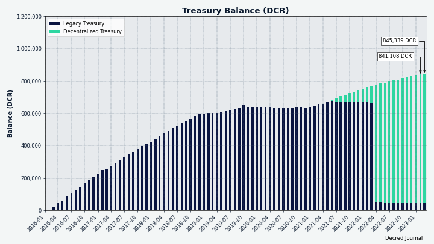
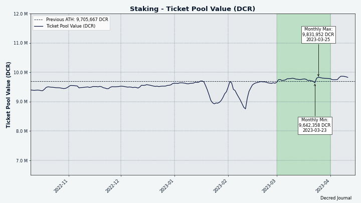
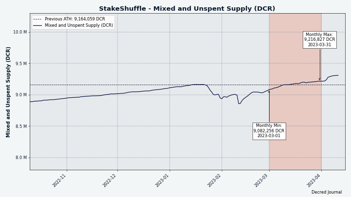

# Decred Journal – Marzec 2023

_Obraz: Niezatytułowany, aut. @Exitus_

Najważniejsze wydarzenia z marca:

- Przedstawiono i zatwierdzono propozycję zmiany wypłaty nagrody blokowej z 10/80 PoW/PoS na 1/89, a także zmiany algorytmu w celu wykluczenia specjalistycznego sprzętu do miningu.

- Wydano wersje v0.1.5 oraz v0.1.6 RC1 Bison Relay.

- DCRDEX 0.6 jest w fazie beta testów i pojawiają się kandydaci do wydania.

- Decred Journal był jedną z czterech propozycji zatwierdzonych w tym miesiącu, z czego trzy dotyczyły konkretnych aspektów rozwoju DCRDEX.

Spis treści:

- [Propozycja zmiany algorytmu PoW oraz zmniejszenia nagród PoW](#proposal-to-change-pow-algorithm-and-reduce-pow-rewards)
- [Kandydat do wydania wersji v0.1.6 Bison Relay](#bison-relay-v016-release-candidate)
- [Rozwój](#development)
- [Ludzie](#people)
- [Zarządzanie](#governance)
- [Sieć](#network)
- [Ekosystem](#ecosystem)
- [Nawiązywanie kontaktów](#outreach)
- [Eventy](#events)
- [Media](#media)
- [Rynki](#markets)
- [Ważne kwestie i wiadomości poboczne](#relevant-external)

## Propozycja zmiany algorytmu PoW oraz zmniejszenia nagród PoW

Nadchodzą poważne zmiany w zasadach konsensusu i ekonomii Decred. Złożono [propozycję](https://proposals.decred.org/record/a8501bc) dalszego zmniejszenia udziału nagród Proof of Work z 10% do 1%, zwiększenia nagród Proof of Stake z 80% do 89% oraz zmiany algorytmu wydobywczego z BLAKE-256 na BLAKE3. Spowoduje to usunięcie całego obecnego wydobywczego sprzętu ASIC z sieci, aby umożliwić przeprowadzenia procesu odkrycia ceny DCR. W chwili pisania tego tekstu propozycja została zatwierdzona. Następnymi krokami będzie wdrożenie nowych zasad konsensusu w kodzie, wydanie nowej wersji oprogramowania podstawowego, umożliwienie sieci zainstalowania go i umożliwienie interesariuszom głosowania w celu aktywacji nowych zasad. Wszystko to powinno zająć kilka miesięcy a więcej informacji na temat każdego etapu pojawi się na [oficjalnych kanałach](https://decred.org/community/) Decred.

## Kandydat do wydania wersji v0.1.6 Bison Relay

W marcu wyszły dwie wersje dedykowane poprawie doświadczenia korzystania z czatów grupowych.

Najważniejsze zmiany w wydaniu v0.1.5:

- Nowa strona statystyk płatności
- Kody QR dla adresów wpłat
- Ulepszone komunikaty o błędach
- Naprawiono brak synchronizacji listy członków czatu grupowego
- Naprawiono porządkowanie wiadomości czatu grupowego
- Inne poprawki błędów i ulepszenia interfejsu użytkownika

Najważniejsze zmiany w wydaniu v0.1.6 Release Candidate 1:

- Nowa wersja czatów grupowych z obsługą wielu administratorów
- Powiadomienia o nowych wiadomościach na pasku bocznym
- Automatyczne zaproszenia do czatów grupowych w plikach zaproszeń
- Podświetlanie wiadomości pseudonimem użytkownika
- Bardziej widoczny przycisk dodawania Nowego posta
- Wszystkie komentarze do postów są kierowane do oryginalnego postu, komentarze do przekazanych kopii są wyłączone
- Wiele poprawek błędów i ulepszeń interfejsu użytkownika zarówno w aplikacjach GUI, jak i CLI

Pobierz najnowsze wydanie na [GitHub](https://github.com/companyzero/bisonrelay/releases) (na chwilę obecną [strona pobrań](https://bisonrelay.org/download/) na bisonrelay.org wciąż podaje v0.1.4 za najnowszą wersję). Zgłoszenia błędów i opinie są mile widziane w [trackerze issues na GitHub](https://github.com/companyzero/bisonrelay/issues) i na czacie [#br](https://chat.decred.org/#/room/#br:decred.org) na Matrixie.

## Rozwój

O ile nie zaznaczono inaczej, prace zgłaszane poniżej mają status „scalonych z repozytorium głównym (master)”. Oznacza to, że prace są ukończone, zrecenzowane i zintegrowane z kodem źródłowym, który zaawansowani użytkownicy mogą [kompilować i uruchamiać](https://medium.com/@artikozel/the-decred-node-back-to-the-source-part-one-27d4576e7e1c), ale ich efekty nie są jeszcze dostępne w wersji plików binarnych dla zwykłych użytkowników.

### dcrd

_[dcrd](https://github.com/decred/dcrd) jest pełną implementacją węzła, który obsługuje sieć peer-to-peer Decred na całym świecie._

Kontynuacja wzmacniania kodu dla głosowania nad zasadami konsensusu z [zeszłego miesiąca](202302.md#dcrd):

- Ulepszona [walidacja](https://github.com/decred/dcrd/pull/3068) parametrów wdrożenia przy uruchamianiu w celu zapewnienia, że spełniają one założenia, na których opiera się logika zliczania głosów. Na przykład sprawdza, czy każdy głos ma dokładnie jeden wybór "wstrzymuję się" i jeden "nie", czy nie ma zduplikowanych wyborów i czy wybory są prawidłowo zakodowane w bitach. Pozwala to zoptymalizować i uprościć kod związany z liczeniem głosów.
- Dodano walidację w celu zapewnienia, że parametry głosowania nad zmianami konsensusu [nie używają specjalnych bitów](https://github.com/decred/dcrd/pull/3073) zarezerwowanych dla zatwierdzenia lub odrzucenia poprzedniego bloku.
- Dodano walidację w celu zapewnienia, że bity używane przez różne głosy w tej samej partii głosowania [nie pokrywają się](https://github.com/decred/dcrd/pull/3077).
- Dodano walidację odrzucającą wybory głosów z [pustymi identyfikatorami](https://github.com/decred/dcrd/pull/3079). ID to krótkie ciągi znaków podsumowujące, co oznacza wybór w głosowaniu, zwykle są to `"tak"`, `"nie"` lub `"wstrzymuję się"`.
- Zmieniono kod określający logikę [etap głosowania nad zasadami konsensusu i podliczanie głosów](https://github.com/decred/dcrd/pull/3069), aby go zoptymalizować i ułatwić jej zrozumienie.
- Zmieniono wewnętrzną reprezentację zwycięskiego wyboru głosowania konsensusowego w celu poprawy czytelności i dodatkowej ochrony przed jego [niewłaściwym użyciem](https://github.com/decred/dcrd/pull/3080).
- Przerobiono testy dla kodu [przetwarzania głosów konsensusu](https://github.com/decred/dcrd/pull/3075), aby były łatwiejsze do zrozumienia, testowały więcej przypadków brzegowych i robiły to [bardziej niezawodnie](https://github.com/decred/dcrd/pull/3076).
- Należy zauważyć, że powyższe zmiany w żaden sposób nie łamią konsensusu między wersjami, dodają więcej kontroli, które pozwalają dcrd na wcześniejsze niepowodzenie, jeśli wykryje, że jakiekolwiek założenia przyjęte przez kod konsensusu zostały naruszone.

Pozostałe zmiany:

- Ponowne żądanie bloków i transakcji [wcześniej](https://github.com/decred/dcrd/pull/3067), jeśli peer, który został o nie zapytany, rozłączy się. Zamiast czekać, aż te dane zostaną ponownie ogłoszone później, zostaną one natychmiast zażądane od peerów, o których wiadomo, że je mają.
- Naprawiono buforowanie [znanych zasobów](https://github.com/decred/dcrd/pull/3074) innych peerów. Był to bardzo drobny błąd, który mógł powodować nieco większy ruch, niż jest to absolutnie konieczne.
- Refaktoryzacja i aktualizacje [konfiguracji kompilacji](https://github.com/decred/dcrd/pull/3081).

### dcrwallet

_[dcrwallet](https://github.com/decred/dcrwallet) to serwer portfela używany przez wiersz polecenia oraz aplikacje graficzne._

- Usunięto niepotrzebne [obliczanie salda](https://github.com/decred/dcrwallet/pull/2203) podczas korzystania z automatycznego kupowania biletów z nieustawioną lub zerową opcją utrzymywania salda. W przypadku bardziej obciążonych portfeli powoduje to znaczną poprawę wydajności.
- Migracja do [klienta VSP](https://github.com/decred/dcrwallet/pull/2213) dostarczonego przez repozytorium [vspd](https://github.com/decred/vspd). Jest to w większości ten sam kod zapożyczony z dcrwallet, ale konsolidacja kodu VSP w jednym miejscu pozwala na usunięcie duplikatów, które mogą się rozsynchronizować, takich jak kody błędów, struktury danych itp.
- Naprawiono [wyścig danych](https://github.com/decred/dcrwallet/pull/2210) w trybie SPV.
- Naprawiono możliwość wystąpienia [braku odpowiednich transakcji](https://github.com/decred/dcrwallet/pull/2212) w przypadku anulowania żądania zakupu biletu z powodu zmiany ceny biletu.

### Decrediton

_[Decrediton](https://github.com/decred/decrediton) to w pełni funkcjonalny desktopowy portfel ze zintegrowaną funkcją głosowania, mieszania StakeShuffle, Lightning Network, handlem na DEX i nie tylko. Działa z lub bez dostępu do pełnego łańcucha (tryb SPV)._

W toku:

- Integracja [Ledger](https://github.com/JoeGruffins/ledger-decred-poc) z portfelem Decrediton została zainicjowana przez @JoeGruff z początkowym [proof of concept](https://github.com/JoeGruffins/ledger-decred-poc) i kolejną [propozycją](https://proposals.decred.org/record/609db9e), celem przygotowania do produkcji. Obecnie użytkownicy są zobowiązani do korzystania z oprogramowania Ledger Live do wysyłania/odbierania DCR z/do urządzenia Ledger, ale w przeszłości występowało zbyt wiele [problemów technicznych](https://matrix.to/#/!MYLcxlwzxwViTaFPGo:decred.org/$fxDMmKpCE-Edb1fRQyhyy_Rjlx2HuKNGtpwSmC76nIA?via=decred.org&via=matrix.org&via=planetdecred.org) z tym oprogramowaniem. Obsługa Ledger bezpośrednio w Decrediton da posiadaczom DCR lepszy wybór.

Pozostałe:

- Staking DCR z Decrediton + Trezor jest ponownie [zablokowane](https://github.com/decred/decrediton/issues/2681#issuecomment-1366432017) przez zmiany wymagane w oprogramowaniu układowym. Poprawka została [przesłana](https://github.com/trezor/trezor-firmware/pull/2703) do repozytorium oprogramowania Trezor w grudniu, ale nie została jeszcze sprawdzona ani scalona.

### vspd

_[vspd](https://github.com/decred/vspd) to oprogramowanie serwera dla pul udziałów (Voting Service Provider). VSP oddaje głos za swoich użytkowników 24/7 oraz nie wchodzi w posiadanie żadnych środków, a tym samym nie może ich ukraść._

Zmiany ułatwiające wykorzystanie kodu vspd przez inne oprogramowanie (takie, jak dcrwallet):

- Usunięto możliwość [uchylenia walidacji podpisu po stronie serwera](https://github.com/decred/vspd/pull/372) z niestandardową funkcją. Ta funkcja została dodana w celu ułatwienia testowania, ale okazała się niepotrzebna i utrudniała korzystanie z biblioteki klienta VSP.
- Usunięto potrzebę [konwersji błędów](https://github.com/decred/vspd/pull/374) w kodzie wywołującym. Było to wymagane do podniesienia głównej wersji modułu do wersji v2.

Pozostałe zmiany:

- Dodano [ograniczenie szybkości](https://github.com/decred/vspd/pull/373) żądań logowania administratora (maks. 3 próby na sekundę) i przykładową konfigurację Nginx do jego obsługi.
- Dodano nowe [narzędzie deweloperskie](https://github.com/decred/vspd/pull/366) do testowania różnych kroków protokołu VSP: tworzenia transakcji opłaty VSP, wysyłania jej do VSP, sprawdzania statusu biletu i zmiany wyborów głosowania w bilecie. Operatorzy VSP mogą użyć tego narzędzia do sprawdzenia, czy ich VSP działa poprawnie.
- Zwiększono zakres testów.

### Lightning Network

_[dcrlnd](https://github.com/decred/dcrlnd) to oprogramowanie węzła Lightning Network dla Decred. LN umożliwia przesyłanie natychmiastowych i niskokosztowych transakcji._

- Zaktualizowano do kompilacji i testowania z [Go 1.20](https://github.com/decred/dcrlnd/pull/176).
- Zaktualizowano [zależności](https://github.com/decred/dcrlnd/pull/177).

[Dostawca płynności LN](https://github.com/decred/dcrlnlpd) (LP):

- Dodano [kontrole poprawności po stronie klienta](https://github.com/decred/dcrlnlpd/pull/9), aby zakończyć niepowodzeniem wcześniej, gdy nie można uzyskać kanału przychodzącego z LP. Klient użyje polityki serwera, aby określić, czy serwer może utworzyć kanał o żądanym rozmiarze i czy klient będzie w stanie za niego zapłacić. Pozwala to uniknąć pobierania faktury, która nie zostanie opłacona.
- Możliwość [konfiguracji](https://github.com/decred/dcrlnlpd/pull/9) polityki wygasania faktur serwera LP. Faktury są generowane przez serwer w celu pobierania opłat za otwarcie kanałów LN dla klientów. Operator serwera może teraz skonfigurować, jak długo faktury są ważne i jak długo klienci muszą czekać, zanim zażądają nowej faktury.
- Zaktualizowano [zależności](https://github.com/decred/dcrlnlpd/pull/10).

LN Liquidity Provider to oprogramowanie, które przejmuje kontrolę nad zwykłym węzłem LN i dodaje do niego jedną przydatną funkcję: oprogramowanie klienckie może poprosić LP o otwarcie kanału z powrotem do klienta. Daje to klientowi dodatkową przepustowość przychodzącą i pozwala mu otrzymywać więcej środków za pośrednictwem Lightning Network. W zamian operator LP pobiera niewielką opłatę za usługę.

Głównym użytkownikiem Lightning Network sieci Decred jest platforma Bison Relay, która korzysta z ulepszeń zarówno podstawowego oprogramowania LN, jak i dostawcy płynności.

### cspp

_[cspp](https://github.com/decred/cspp) to serwer do koordynowania mieszania monet za pośrednictwem protokołu CoinShuffle++. Nie jest powierniczy, tzn. nie przejmuje kontroli nad środkami._

- Zaktualizowano [zależności Go](https://github.com/decred/cspp/pull/89).

### DCRDEX

_[DCRDEX](https://github.com/decred/dcrdex) to niepowiernicza giełda, umożliwiająca handel bez konieczności zaufania, działająca dzięki technologii atomic swaps._

Wewnętrzne testy przedpremierowe dużego wydania v0.6 rozpoczęły się od jednej wersji beta i dwóch kandydatów do wydania [oznaczonych](https://github.com/decred/dcrdex/tags) w marcu. Wszystkie zgłoszone poniżej zmiany zostaną uwzględnione w wydaniu v0.6.

Zmiany w klientach:

- Usunięto [domyślny węzeł Bitcoin](https://github.com/decred/dcrdex/pull/2193) do uzyskiwania kompaktowych filtrów blokowych w trybie SPV. Został on dodany, gdy istniało niewiele publicznych pełnych węzłów Bitcoin obsługujących [BIP-157](https://bitcoin.stackexchange.com/questions/86231/whats-the-distinction-between-bip-157-and-bip-158-are-they-supported-by-bitcoi/86232#86232). Teraz jest ich wiele, a usunięcie domyślnego może poprawić łączność, ponieważ jest on często przeciążony.
- Poprawiono komunikat o błędzie, gdy baza danych [nie została zainicjalizowana](https://github.com/decred/dcrdex/pull/2205), najczęściej podczas próby uruchomienia drugiej instancji dexc.

Poprawki w klientach:

- Naprawiono puste [przerwy między świecami](https://github.com/decred/dcrdex/pull/2195) na wykresie cenowym.
- Naprawiono niespójną [precyzję dziesiętną](https://github.com/decred/dcrdex/pull/2208) w różnych elementach interfejsu użytkownika.
- Naprawiono brak aktualizacji [ceny](https://github.com/decred/dcrdex/pull/2214) w niektórych miejscach.
- Naprawiono wskazanie reorganizacji bloków dla [DCR](https://github.com/decred/dcrdex/pull/2219) i [BTC](https://github.com/decred/dcrdex/pull/2225) w trybie SPV, aby pasowało do dcrd i dcrwallet. W szczególności bloki, które nie znajdują się w głównym łańcuchu ("osierocone" bloki) będą zgłaszane jako posiadające potwierdzenia "-1".
- Naprawiono [urodziny portfela](https://github.com/decred/dcrdex/pull/2236) pokazujące datę UTC zamiast daty lokalnej systemu.
- Naprawiono ~5 innych błędów interfejsu użytkownika i ~1 błąd współbieżności.

Ethereum, klient:

- Poprawiono obsługę słabych połączeń z dostawcami RPC podczas [wyłączania](https://github.com/decred/dcrdex/pull/2191) klienta DEX.
- Dodano stronę wiki [Przewodnik po portfelu Ethereum](https://github.com/decred/dcrdex/pull/2233).
- Dodano bufor 20% do [szacunków opłat](https://github.com/decred/dcrdex/pull/2234), aby zapewnić, że wysyłanie ETH powiedzie się, nawet jeśli opłata podstawowa sieci skoczy tuż przed wysłaniem.
- Zaktualizowano do wersji [Geth v1.11](https://github.com/decred/dcrdex/pull/2238). Jest to wymagane do aktualizacji sieci Szanghaj zaplanowanej na 12 kwietnia 2023 r.
- Naprawiono brak aktualizacji [salda aktywów nadrzędnych](https://github.com/decred/dcrdex/pull/2201) tokena podczas anulowania zamówienia obejmującego ten token.
- Naprawiono brak odzwierciedlenia [niepotwierdzonych transakcji](https://github.com/decred/dcrdex/pull/2211) w dostępnym saldzie.
- Naprawiono komunikaty o błędach.

Ethereum, serwer:

- Zezwalanie operatorom serwerów na szeregowanie punktów końcowych dostawcy RPC według [priorytetu](https://github.com/decred/dcrdex/pull/2199) w pliku konfiguracyjnym. Zdrowe połączenie o najwyższym priorytecie będzie zawsze próbowane jako pierwsze.

Kaucje:

- [Aktualizacje interfejsu użytkownika](https://github.com/decred/dcrdex/pull/2200) w celu zastąpienia opłat rejestracyjnych kaucjami, w tym integracji kaucji z przepływami importu i eksportu kont. Różne przypadki są brane pod uwagę podczas przywracania z tego samego, lub nowego ziarna aplikacji oraz podczas korzystania z istniejącego lub tworzenia nowego konta DEX.
- Wdrożono finansowanie kaucji [za pomocą BTC](https://github.com/decred/dcrdex/pull/2196) zarówno w kliencie, jak i na serwerze. Możliwe będzie przełączenie kaucji na inne aktywa, np. z DCR na BTC.

Pozostałe zmiany:

- Dodano bardziej rygorystyczne [testy](https://github.com/decred/dcrdex/pull/2248) po stronie serwera dla adresów używanych w swapach.
- Zaktualizowano [zależności LTC](https://github.com/decred/dcrdex/pull/2268), aby pobrać [krytyczną poprawkę](https://github.com/ltcsuite/ltcd/pull/25) do obsługi dużych transakcji.
- Ulepszenia w infrastrukturze testowej, skrypty kompilacji, aktualizacje zależności.

Zmiany w kliencie scalone na gałęzi `master` do następnego wydania (prawdopodobnie v0.6.1):

- Powiadamianie użytkownika o [niestabilnym połączeniu](https://github.com/decred/dcrdex/pull/2028).
- Naprawiono błąd podczas [nieudanej subskrypcji](https://github.com/decred/dcrdex/pull/2252) nowych powiadomień nagłówka od dostawcy Ethereum RPC.

Inne:

- DCRDEX zostało [odrzucone](https://github.com/getumbrel/umbrel-apps/pull/430#issuecomment-1452436145) w oficjalnym sklepie Umbrel App Store, ponieważ "w przypadku aplikacji związanych z kryptowalutami akceptujemy jedynie aplikacje, które koncentrują się wyłącznie na bitcoinie". Dwa tygodnie później [zatweetowali](https://twitter.com/umbrel/status/1636068336101621760), że cenzurowanie deweloperów jest zachowaniem antywolnorynkowym, co zaskoczyło niektórych członków społeczności w kontekście odrzucenia. DCRDEX nadal można zainstalować za pośrednictwem Umbrel, dodając własny [Community App Store](https://github.com/decred/umbrel-app-store). Różnica polega na tym, że wymaga to więcej ręcznych kroków i przedstawia DCRDEX mniejszej liczbie użytkowników w porównaniu do centralnego oficjalnego Umbrel App Store.
-  Na Twitterze [zauważono](https://twitter.com/DigiByteCoin/status/1640820963532214273) pierwsze wymiany w sieci głównej z DigiByte (DGB)

_Obraz: Aktualizacje interfejsu użytkownika w DCRDEX w celu zastąpienia opłat rejestracyjnych kaucjami z blokadą czasową. Projekt interfejsu użytkownika jest w toku. Pokazane kwoty DCR nie są rzeczywiste._

### dcrdata

_[dcrdata](https://github.com/decred/dcrdata) to eksplorator blockchaina Decred oraz danych off-chain, takich jak propozycje na platformie Politeia, rynków i ponadto._

- Dodano oprogramowanie pośredniczące dla [dopuszczonych hostów](https://github.com/decred/dcrdata/pull/1958), aby zapewnić, że każda wartość `Host` ustawiona w nagłówku żądania znajduje się na białej liście hostów. Zapobiega to nieprawidłowym lub nieoczekiwanym wartościom `Host`, nawet jeśli dcrdata jest wdrażana bez Nginx, który normalnie się tym zajmuje.
- Zaktualizowano Decred i inne [moduły Node.js](https://github.com/decred/dcrdata/pull/1952) oraz [zależności](https://github.com/decred/dcrdata/pull/1959) Go do ich najnowszych wersji i przeniesiono kompilacje do Go 1.19 i 1.20.

### Dokumentacja

_[dcrdocs](https://github.com/decred/dcrdocs) to repozytorium źródłowe [dokumentacji użytkownika](https://docs.decred.org/) dla Decred._

- Dodano [podświetlanie składni](https://github.com/decred/dcrdocs/pull/1219), aby naprawić problemy z trudną do odczytania składnią kodu, szczególnie w trybie ciemnym.
- Zaktualizowano wartości [nagrody PoS](https://github.com/decred/dcrdocs/pull/1220) (z 30% do 80%) na stronie przeglądu [proof-of-stake](https://docs.decred.org/proof-of-stake/overview/).
- Dodano wpis w [słowniczku](https://github.com/decred/dcrdocs/pull/1217) dla "skryptu wykupienia".
- Zaktualizowano [informacje o stakingu z VSP](https://github.com/decred/dcrdocs/pull/1217) na wielu stronach. Obejmuje to usunięcie większości odniesień do skryptów wykupienia, usunięcie "starszych" instrukcji stakingu i uproszczenie pozostałych instrukcji.
- Skonsolidowano [zalety i wady](https://github.com/decred/dcrdocs/pull/1217) korzystania z VSP i samodzielnego stakingu.
- Dodano [uwagę](https://github.com/decred/dcrdocs/pull/1217) do strony o skrypcie wykupienia, wskazując, że nie są one już istotne.
- Strona [Kupowanie biletów za pomocą dcrwallet](https://github.com/decred/dcrdocs/pull/1217) została zoptymalizowana. Teraz wyraźnie oddziela ona zakup i głosowanie w dwóch krokach i usuwa wszelkie odniesienia do przestarzałego systemu dcrstakepool.
- Zoptymalizowano [kompilację Docker](https://github.com/decred/dcrdocs/pull/1222): przełączono na znacznie mniejszy obraz oparty na Alpine Linux, poprawiono typ MIME dla kanałów RSS i zaktualizowano skrypty, aby kończyły się niepowodzeniem w przypadku błędu.

### Dev Docs

_[dcrdevdocs](https://github.com/decred/dcrdevdocs) to kod źródłowy dla [dokumentacji deweloperskiej](https://devdocs.decred.org/) projektu Decred._

- Aktualizacja do wersji [MkDocs Material 9](https://github.com/decred/dcrdevdocs/pull/108) z ulepszonym wyszukiwaniem. Zaktualizowano również do wersji Python 3.11, Nginx 1.22 i zoptymalizowano kompilację Docker.

### decred.org

_[dcrdocs](https://github.com/decred/dcrdocs) to repozytorium źródłowe [dokumentacji użytkownika](https://docs.decred.org/) dla Decred._

Zmiany na stronie [Wiadomości](https://github.com/decred/dcrweb/pull/1106):

- Od teraz wyświetlana jest bardziej czytelna nazwa serwisu informacyjnego zamiast nazwy domeny witryny.
- Wydawca i autor nie są już wyświetlani dla wydań oprogramowania.

### Bison Relay

_[Bison Relay](https://github.com/companyzero/bisonrelay) to nowa platforma mediów społecznościowych peer-to-peer z silną ochroną przeciw cenzurze, inwiligacji, oraz reklamom, działająca na bazie Lightning Network projektu Decred._

Zostały wydane binarki użytkownika końcowego dla Bison Relay v0.1.5 ze wszystkimi zmianami i poprawkami, o których informowaliśmy w [wydaniu lutowym](202302.md#bison-relay). Zaledwie tydzień później wersja v0.1.6 Release Candidate 1 udostępniono do pobrania. Poniżej znajdują się wszystkie zmiany w v0.1.6 RC1 i v0.1.6 final. W tej ostatniej dodano bardzo drobne poprawki i nie przygotowano dla niej żadnych plików binarnych.

Wspólne zmiany dla aplikacji GUI oraz CLI w wersji v0.1.6:

- Zaimplementowano [nową wersję czatów grupowych](https://github.com/companyzero/bisonrelay/pull/155), która wprowadza obsługę wielu administratorów. Administratorzy mogą zapraszać lub usuwać członków oraz przypisywać, lub odbierać uprawnienia administratora. Zezwolenie na zamknięcie czatu grupowego jest nadal możliwe dzięki specjalnej roli właściciela. Istniejące czaty grupowe będą miały opcję aktualizacji do nowej wersji.
- Poprawiono obsługę błędów i rejestrowanie [nieudanych płatności](https://github.com/companyzero/bisonrelay/pull/156) (takich jak napiwki).
- Ulepszono tekst pomocy dla [dodawania przepustowości odbioru LN](https://github.com/companyzero/bisonrelay/pull/166).
- Uniemożliwiono komentowanie na [przekazanych postach](https://github.com/companyzero/bisonrelay/pull/162). Komentowanie postów będzie wymagało wymiany kluczy z oryginalnym autorem. Ponadto, po otrzymaniu oryginalnego postu od autora, wszystkie przekazane kopie zostaną usunięte na rzecz oryginału.
- Naprawiono błąd uniemożliwiający zaakceptowanie [wielu zaproszeń do czatu grupowego](https://github.com/companyzero/bisonrelay/pull/154) w tym samym czasie.
- Aktualizacje zależności i wewnętrzne refaktoryzacje.

Zmiany w aplikacji GUI w wersji v0.1.6:

- Dodano ikonę powiadomień na pasku bocznym dla [nowych wiadomości czatu](https://github.com/companyzero/bisonrelay/pull/157).
- Wyświetlanie [liczby nieprzeczytanych wiadomości](https://github.com/companyzero/bisonrelay/pull/157) jako "1k+", gdy przekracza ona 1000.
- Uniknięto zbędnego wskaźnika [ostatnio przeczytanych](https://github.com/companyzero/bisonrelay/pull/157), gdy na czacie nie ma poprzednich wiadomości.
- Dodano widoczny przycisk [Nowy post](https://github.com/companyzero/bisonrelay/pull/159), który jest łatwo dostępny z różnych widoków.
- Dodano [podświetlanie wiadomości](https://github.com/companyzero/bisonrelay/pull/164), które zawierają nick użytkownika.
- Dodano [krok weryfikacji ziaren](https://github.com/companyzero/bisonrelay/pull/174), w którym użytkownik musi odpowiedzieć na pytania dotyczące jego ziaren.
- Dodano [stronę informacyjną](https://github.com/companyzero/bisonrelay/pull/175) z wersją aplikacji i informacjami o prawach autorskich.
- Naprawiono błąd segfault [przy zamykaniu](https://github.com/companyzero/bisonrelay/pull/157).
- Naprawiono błędy podczas [opuszczania lub zabijania](https://github.com/companyzero/bisonrelay/pull/170) czatów grupowych.
- Mniejsze usprawnienia i poprawki interfejsu użytkownika.

Zmiany w aplikacji CLI w wersji v0.1.6:

- Dodano [autouzupełnianie](https://github.com/companyzero/bisonrelay/pull/163) nazw użytkowników i nazw czatów grupowych do różnych poleceń.
- Dodano [Alt+V](https://github.com/companyzero/bisonrelay/pull/153) jako klawisz skrótu wklejania.
- Dodano polecenie dekodowania i sprawdzania [faktur LN](https://github.com/companyzero/bisonrelay/pull/166), ulepszono rejestrowanie zdarzeń LN (takich jak otwarcie lub zamknięcie kanału).
- Wyświetlanie zaproszenia do czatu grupowego na [czacie prywatnym](https://github.com/companyzero/bisonrelay/pull/169) z zapraszającym użytkownikiem.
- Dodano opcję dołączenia [zaproszenia do czatu grupowego](https://github.com/companyzero/bisonrelay/pull/178) do pliku zaproszenia. Odbiorca zaproszenia zostanie automatycznie zaproszony do czatu grupowego po zakończeniu początkowej wymiany kluczy z autorem zaproszenia.
- Naprawiono [zawijanie](https://github.com/companyzero/bisonrelay/pull/153) tekstu wielowierszowego.

Zmiany w [API automatyzacji](https://github.com/companyzero/bisonrelay/tree/master/clientrpc) `clientrpc` w wersji v0.1.6:

- Poprawiono obsługę pętli odczytu [anulowania i zamknięcia](https://github.com/companyzero/bisonrelay/issues/158).
- Dodano metody [zarządzania czatami grupowymi](https://github.com/companyzero/bisonrelay/pull/161) i [wysyłania plików](https://github.com/companyzero/bisonrelay/pull/179).
- Naprawiono [odczyt](https://github.com/companyzero/bisonrelay/pull/161) z pliku dziennika powtórki wiadomości.

Pozostałe zmiany oraz czego można się spodziewać:

- Załączniki obrazów są teraz przesyłane między Bison Relay i Matrix w obu kierunkach.
- Ogłoszono [zaproszenia przedpłacone](https://twitter.com/behindtext/status/1641080004778897408), które pomogą one wdrożyć nowych użytkowników bez konieczności uzyskiwania DCR z zewnątrz i finansowania ich portfela Bison Relay.
- Kolejnym ważnym [kamieniem milowym](https://matrix.to/#/!aNnAOHkWUdNcEXRGjJ:decred.org/$oCz1kQZLJ_wc4Wwjq6z8x8numCsuZWyy7IyPWw3vDIA?via=decred.org&via=matrix.org&via=planetdecred.org) są przedpłacone zaproszenia do czatów grupowych, które łączą przedpłacone zaproszenia i powiązane zaproszenia do czatów grupowych.
- Technologia stojąca za GUI Bison Relay (Flutter) zapewnia infrastrukturę do tworzenia aplikacji mobilnych z tej samej bazy kodu. Nadal wymagana jest praca, aby dostosować UI/UX do platformy mobilnej i naprawić przypadki brzegowe specyficzne dla urządzeń mobilnych, ale jest to znacznie łatwiejsze w porównaniu do budowania aplikacji mobilnych od podstaw w natywnych stosach Androida i iOS.
- W perspektywie średnioterminowej deweloperzy planują dodać strony i witryny sklepowe, których wdrożenie będzie wymagało sporo pracy.

### Pozostałe

- Strona [Decred Bug Bounty](https://bounty.decred.org/): dodano [szablony wiadomości e-mail](https://github.com/decred/dcrbounty/pull/95), zoptymalizowano [kompilacje Docker](https://github.com/decred/dcrbounty/pull/96) i [dodano](https://github.com/decred/dcrbounty/pull/94) Tanvir0x1 do Hali Sław.
- Zaktualizowano wiele witryn tak, aby korzystały z najnowszego generatora witryn Hugo.

## Ludzie

Statystyki społeczności na dzień 3. kwietnia (w porównaniu z 1. marca):

- Obserwujący na [Twitterze](https://twitter.com/decredproject): 53189 (+125)
- Subskrybenci na [Reddit](https://www.reddit.com/r/decred/): 12678 (+18)
- Użytkownicy na [Matrixie](https://chat.decred.org/) w pokoju #general: 761 (+11)
- Użytkownicy na [Discordzie](https://discord.gg/GJ2GXfz):  1556 (-1), zweryfikowani z możliwością pisania: 923 (-9)
- Użytkownicy na [Telegramie](https://t.me/Decred): 2619 (-137)
- Subskrybenci na [YouTube](https://www.youtube.com/decredchannel): 4,630 (+0), wyświetleń: 226,5K (+1,9K)

## Zarządzanie

W marcu nowy [Skarbiec](https://dcrdata.decred.org/treasury) otrzymał 8388 DCR o wartości 174 tys. USD po średnim marcowym kursie wymiany $20,69. 4271 DCR zostało wydane, aby zapłacić kontrahentom, co stanowiło wartość $88K po marcowym kursie wymiany.

Transakcja [wypłaty ze Skarbca](https://explorer.dcrdata.org/tx/57c226c50632baf64aa3bb366e11c586c38689248a067b4642173a6a96fd47d0) została wydobyta 13. marca i zawierała 27 wyjść dokonujących płatności kontrahentom w przedziale od 2,7 DCR do 1264 DCR.  Po styczniowym kursie rozliczeniowym w wys. $22,05 transakcja TSpend opiewa na równowartość $94K.

Na dzień 13. kwietnia, łączne saldo [starego](https://dcrdata.decred.org/address/Dcur2mcGjmENx4DhNqDctW5wJCVyT3Qeqkx) i [nowego Skarbca](https://dcrdata.decred.org/treasury) wynosi 852332 DCR (17,8 miliona USD po kursie $20,9).

W marcu zgłoszono 7 propozycji na platformie Politeia:

- Propozycja kontynuowania [Decred Journal i Politeia Digest](https://proposals.decred.org/record/9e68dca) wnioskowała o budżet w wysokości 40 tys. USD i została zatwierdzona 86% głosami na "tak" przy frekwencji 46%.

- Decred DEX złożył 3 propozycje, które zostały zatwierdzone. Główna [propozycja](https://proposals.decred.org/record/ca6b749) dotycząca rozwoju klienta wnioskowała o budżet w wysokości 182 tys. USD i została zatwierdzona 94% głosów na "tak" i 49% frekwencji. [Propozycja](https://proposals.decred.org/record/ae7c4fe) dotycząca finansowania prac nad opakowaniem oprogramowania DEX jako aplikacji komputerowej została sfinansowana z budżetem w wysokości 29 tys. USD, z 91% głosów poparcia przy 43% frekwencji. [Propozycja](https://proposals.decred.org/record/8b1ceda) mająca na celu sfinansowanie rozwoju animatora rynku i bota arbitrażowego została sfinansowana z budżetem w wysokości 73 tys. USD, uzyskując 89% poparcia od 42% biletów, które głosowały.

- [Propozycja](https://proposals.decred.org/record/ff64137) od Cointelegraph dotycząca publikacji treści o wartości 50 tys. USD została odrzucona z 41% głosów na "tak" przy frekwencji 51%.

- [Propozycja](https://proposals.decred.org/record/a8501bc) aut. @jy-p, aby zmienić podział dotacji PoW/PoS na 1/89, a także zmienić algorytm PoW na BLAKE3, usuwając tym samym sprzęt ASIC zaprojektowany do wydobywania DCR z sieci.

- [Propozycja](https://proposals.decred.org/record/609db9e) aut. @joegruff, aby opracować wsparcie w portfelu Decrediton dla sprzętu Ledger kosztem 20 500 USD.

Zapraszamy do lektury [wydania nr 57](https://blockcommons.red/politeia-digest/issue057/) oraz [wydania nr 58](https://blockcommons.red/politeia-digest/issue058/) Politeia Digest po więcej informacji na temat zgłoszonych w tym miesiącu propozycji.

Politeia Digest dostępne jest w następujących miejscach: [Block Commons](https://blockcommons.red/politeia-digest/), [Decred Magazine](https://www.decredmagazine.com/tag/politeia-digest/), [Medium](https://medium.com/politeia-digest), oraz [GitHub](https://github.com/RichardRed0x/politeia-digest).

## Sieć

**Hashrate**: marcowy [hashrate](https://dcrdata.decred.org/charts?chart=hashrate&scale=linear&bin=day&axis=time) na początku miesiąca wyniósł ~71 Ph/s a zamknął go na poziomie ~73 Ph/s, zaliczając niż w ok. 64 Ph/s oraz szczyt w wys. 83 Ph/s w ciągu miesiąca.

_Obraz: Moc obliczeniowa projektu Decred._

Dystrybucja mocy obliczeniowej w wys. 74 Ph/s [zadeklarowana](https://miningpoolstats.stream/decred) przez pule wydobywcze na dzień 1. kwietnia: Poolin 54%, F2Pool 35%, AntPool 11%, CoinMine 0,2%.

Podział 1000 bloków [wydobytych](https://miningpoolstats.stream/decred) przed 3. kwietnia: Poolin 44%, F2Pool 43%, AntPool 9%, BTC.com 3%.

_Obraz: Historyczny wykres dystrybucji mocy obliczeniowej pul wydobywczych._

**Staking**: [Cena biletów](https://dcrdata.decred.org/charts?chart=ticket-price&axis=time&visibility=true-true&mode=stepped) wahała się między 223 a 254 DCR.

_Obraz: Stabilizacja ceny biletów._

[Zablokowana suma](https://dcrdata.decred.org/charts?chart=ticket-pool-value&scale=linear&bin=day&axis=time) to pomiędzy 9,64 a 9,83 miliona DCR, co oznacza, że 64,0-65,2% podaży dostępnej w obiegu [wzięło udział](https://dcrdata.decred.org/charts?chart=stake-participation&scale=linear&bin=day&axis=time) w elemencie Proof of Stake.

_Obraz: Suma zablokowanych w biletach DCR ciągle idzie w górę._

**VSP**: Na 1. kwietnia, ~7200 (-210) biletów w puli zarządzanych było przez [16 oficjalnych VSP](https://decred.org/vsp/) serwerów vspd, co stanowi 17,6% całej puli biletowej (-0,8%).

Największe wzrosty w marcu odnotowały ubiqsmart.com (280 biletów, czyli +155%) oraz dcrhive.com (+225 biletów, czyli +25%).

_Obraz: Dystrybucja biletów zarządzanych przez VSP._

**Węzły**: [Decred Mapper](https://nodes.jholdstock.uk/user_agents) odnotował między 162 a 176 węzłów dcrd w ciągu miesiąca. Wersje 166 węzłów odnotowanych 1. kwietnia to: v1.7.5 - 36%, v1.7.1 - 21%, v1.8.0 dev buildy - 13%, v1.7.2 - 13%, v1.7.0 - 8%, v1.7.4 - 4%, pozostałe - 7%.

_Obraz: Historyczna dystrybucja wersji węzłów dcrd, dane z nodes.jholdstock.uk. Uwaga: Dane do stycznia 2023 były niekompletne_

Ilość [monet mieszanych](https://dcrdata.decred.org/charts?chart=coin-supply&zoom=jz3q237o-la8vk000&scale=linear&bin=day&axis=time&visibility=true-true-true) wahała się w granicach 60,5-61,1%.
Dzienna [kwota mieszana](https://dcrdata.decred.org/charts?chart=privacy-participation&bin=day&axis=time) oscylowała w granicach 317-495K DCR.

_Obraz: Mieszana podaż monet odbiła się po chwilowych spadkach._

Eksplorator [Lightning Network](https://ln-map.jholdstock.uk/) sieci Decred na 3. kwietnia odnotował 175 węzłów (+17) oraz 354 kanały (+49) o całkowitej pojemności 129 DCR (+14). Statystyki te zależą od węzła LN. Na przykład, tego samego dnia węzeł @karamble odnotował 175 węzłów (+0) oraz 376 kanałów (-9) o pojemności 135 DCR (-33).

## Ekosystem

[Metal Pay](https://metalpay.com/) wyłączyło handel DCR zgodnie z [raportem użytkownika](https://matrix.to/#/!teQafvHMYpIbqLIieU:decred.org/$JvKPmPcgLw-bUW-7Tn2QFlqmRFtLQN0pPC-4Qq5u0yY?via=decred.org&via=matrix.org&via=t2bot.io). Potwierdza to ich strona wsparcia, która nie pokazuje już DCR na liście [aktywów dostępnych do handlu](https://help.metalpay.com/hc/en-us/articles/4409447985303-What-Cryptocurrencies-are-Available-for-Trading-on-Metal-Pay-). Aktywa obsługujące [wpłaty i wypłaty](https://help.metalpay.com/hc/en-us/articles/4409465061911-Which-Cryptocurrencies-Support-Deposit-and-Withdrawal-on-Metal-Pay-) również nie zawierają DCR i najwyraźniej nigdy nie zawierały. Inne monety usunięte w tej samej partii z DCR obejmują BNB, BUSD, DGB, PAX i TUSD. W szerszej perspektywie, Metal Pay [usunął](https://www.reddit.com/r/CryptoCurrency/comments/zlmxj3/delisting_notice_for_select_tokens_on_metal_pay/) 13 aktywów w grudniu, w tym XMR, ZEC, DASH i BSV. Od [listopada 2022 r.](https://web.archive.org/web/20221207223930/https://help.metalpay.com/hc/en-us/articles/4409447985303-What-Cryptocurrencies-are-Available-for-Trading-on-Metal-Pay-) lista dostępnych aktywów zmniejszyła się z 63 do zaledwie 15. Metal Pay po raz pierwszy zintegrował DCR w [kwietniu 2020 r.](https://twitter.com/metalpaysme/status/1249745420206686208).

Funkcja [zakupu instant](https://global.bittrex.com/instant) giełdy Bittrex nie działała dla DCR z powodu niskiej płynności, zgodnie z [raportem użytkownika](https://matrix.to/#/!teQafvHMYpIbqLIieU:decred.org/$GWyVIBD5k_vDEUPxJK3QTOFqdAot8he-q4RNcxLsmqo?via=decred.org&via=matrix.org&via=t2bot.io). Nie miało to wpływu na zlecenia z limitem w pełnym interfejsie handlowym.

Przedstawiciel [Ledger](https://www.ledger.com/) pojawił się na czacie Matrix Decred, aby podzielić się [aktualizacją statusu](https://matrix.to/#/!teQafvHMYpIbqLIieU:decred.org/$kwC-IMBBr92cstg707O_SlLBJEtCiOt_RmVTtE6S0dI?via=decred.org&via=matrix.org&via=t2bot.io). Podsumowanie jest następujące: Obsługa Decred w Ledger Live jest zepsuta dla niektórych użytkowników, naprawa zajmuje dużo czasu, a Ledger chciałby przekierować dotkniętych użytkowników do usług firm trzecich kompatybilnych z ich urządzeniami w sytuacjach, gdy integracja jest zepsuta po ich stronie. W zwiazku z tym, Ledger skorzysta z nadchodzącej [bezpośredniej integracji](https://proposals.decred.org/record/609db9e) w portfelu Decrediton.

Binance [ogłosiło](https://www.reddit.com/r/decred/comments/123tn1i/binance_close_isolated_margin_for_decred_and_some/) usunięcie par DCR/BTC i DCR/USDT z Isolated Margin. Dla kontekstu, NEBL i XVG były również częścią tej wycofanej partii. Nie ma to wpływu na regularny handel DCR (Spot). Jednocześnie osobisty limit w produkcie Simple Earn został [zwiększony](https://matrix.to/#/!aNnAOHkWUdNcEXRGjJ:decred.org/$Iv4uASbdiLZIMZWbVVYFqY-motmynF19DH5MYvSRgNo?via=decred.org&via=matrix.org&via=planetdecred.org) z 300 do 10000 DCR na osobę. Na dzień 27 marca Simple Earn pokazywał 1,67% APR, podczas gdy bezpośredni staking DCR daje około 7% rocznie.

Bittrex ogłosiło [zamknięcie działalności w USA](https://twitter.com/BittrexExchange/status/1641879884682387457) z powodu wyzwań regulacyjnych i ekonomicznych. Zgodnie z ich [osią czasu](https://bittrex.zendesk.com/hc/en-us/articles/10080271948701), wypłaty fiat muszą zakończyć się do 24 kwietnia, a wypłaty kryptowalut do 29 kwietnia (im wcześniej, tym lepiej). Bittrex Global nie jest (bezpośrednio) dotknięte i będzie kontynuowało działalność dla klientów spoza USA. Posunięcie to nastąpiło po tym, jak w grudniu Bittrex został [ukarany grzywną](https://www.reuters.com/business/finance/crypto-exchange-bittrex-fined-53-mln-by-us-treasury-dept-2022-10-11/) w wysokości 29 milionów dolarów za naruszenie sankcji i przepisów AML. Pomimo zamknięcia działalności w USA, Bittrex może zostać dotknięty kolejnym [pozwem](https://reason.com/2023/04/19/sec-sues-crypto-exchange-bittrex-shortly-after-it-announces-its-leaving-u-s-markets/) ze strony SEC za prowadzenie niezarejestrowanej giełdy papierów wartościowych.

Dołączcie do naszego kanału [#ecosystem](https://chat.decred.org/#/room/#ecosystem:decred.org), aby śledzić wszelkie nowości związane z ekosystemem Decred.

Uwaga: autorzy Decred Journal nie są w stanie ocenić wiarygodności żadnego z powyższych podmiotów czy ich usług. Uprasza się o dołożenie należnych starań i własnoręczną weryfikację informacji przed powierzeniem jakichkolwiek środków innym stronom.

## Nawiązywanie kontaktów

Osiągnięcia Monde PR:

- Zaproponowano 2 możliwości umieszczenia komentarza
- Zaproponowano 8 możliwości występu w mediach

Umieszczono w mediach poniższe artykuły:

- Artykuł w [Cointelegraph](https://cointelegraph.com/news/trezor-crypto-wallet-s-move-into-the-semiconductor-business-isn-t-for-everyone) z komentarzem aut. @jz na temat przejścia portfela kryptowalutowego Trezor do branży półprzewodników. Artykuł został powielony w 14 publikacjach, w tym [Ethereum Today](https://www.ethereum.today/trezor-crypto-wallets-move-into-the-semiconductor-business-isnt-for-everyone/) i [Bitcoin Insider](https://www.bitcoininsider.org/article/207994/trezor-crypto-wallets-move-semiconductor-business-isnt-everyone).
- Artykuł w [CoinDesk](https://www.coindesk.com/markets/2023/03/16/crypto-observers-believe-us-banking-crisis-could-strengthen-crypto-ecosystem-in-the-long-term/) z komentarzem aut. @jz na temat długoterminowych skutków kryzysu bankowego w USA na kryptowaluty. Artykuł był dystrybuowany do 3 publikacji, w tym [Yahoo! Finance](https://finance.yahoo.com/news/crypto-observers-believe-u-banking-113017805.html) i [Markets Insider](https://markets.businessinsider.com/news/currencies/crypto-observers-believe-us-banking-crisis-could-strengthen-crypto-ecosystem-in-the-long-term-1032172484).

## Eventy

**Na których byliśmy:**

- @arij wygłosiła [prezentację](https://decredcommunity.github.io/events/index/20230304.1) w Technopark Casablanca na temat "Blockchain i przedsiębiorczość". Zaczęło się od wprowadzenia do przypadków użycia technologii blockchain i jej historii, po którym nastąpiła demonstracja portfela Decrediton i platformy Politeia. Uczestnicy pochodzili z różnych środowisk, w tym z sektora finansowego, energetycznego i IT. Większość z nich przybyła w odpowiedzi na ogłoszenie na LinkedIn.
- [Drugie wydarzenie](https://decredcommunity.github.io/events/index/20230311.1) zorganizowane przez zespół Decred Arabia było współorganizowane przez stowarzyszenie sportowe Aïn Chock i radę dzielnicy Aïn Chock Casablanca. @khalidesi przedstawił wprowadzenie do blockchainów w pierwszym dniu oraz zastosowanie blockchainów i przykład Decred dnia następnego. Tematem było zademonstrowanie, w jaki sposób blockchain może poprawić sposób działania firm i promować większą integrację gospodarczą i społeczną.

**Na których będziemy**:

- @elian zaprezentuje najnowsze aktualizacje Decred na [Monerotopia](https://monerotopia.com/) w Mexico City w dniach 5, 6 i 7 maja. Decred będzie miał małe stoisko.

## Media

**Wybrane artykuły:**

- [Decred vs DigiByte: Wyscig prędkości!](https://www.decredmagazine.com/decred-vs-digibyte/), aut. @Joao
- [Dlaczego Decred nie jest kompatybilny z EVM?](https://www.decredmagazine.com/why-is-decred-not-evm-compatible/), aut. @BlockchainJew

Statystyki aktywności [Decred Magazine](https://www.decredmagazine.com/) za marzec:

- Całkowita liczba artykułów na DM: 427
- Subskrybentów newslettera: 93
- Opublikowane nowe posty i newslettery: 18
- Aktywne kampanie w mediach społecznościowych: 35
- Zakończone kampanie w mediach społecznościowych 35
- Posty w mediach społecznościowych: 127
- Polubienia: 709
- Retweety: 181
- Liczba obserwujących na wszystkich kontach i platformach mediów społecznościowych (w tym [@DecredSociety](https://twitter.com/DecredSociety)): 1290

**Wideo:**

- [Konta w portfelu Decrediton - ewolucja pieniądza](https://www.decredmagazine.com/accounts-in-decrediton/), aut. @phoenixgreen
- [Timestamply - przeprojektowanie dla znakowania czasowego cyfrowego istnienia](https://www.decredmagazine.com/timestamply-redesign-for-timestamping-digital-existence/), aut. @phoenixgreen - również jako [post tekstowy](https://www.decredmagazine.com/timestamply-redesign-for-timestamping-digital-existence/) oraz [podcast na Spotify](https://podcasters.spotify.com/decred-magazine/episodes/Timestamply---Redesign-for-timestamping-digital-existence-e204bff)
- [Nadchodzi DCRDEX 0.6 - portfel wielołańcuchowy, boty animatora rynków, wsparcie dla DigiByte & więcej](https://www.decredmagazine.com/dcrdex-0-6-is-coming/), aut. @phoenixgreen - również jako post tekstowy oraz [podcast](https://podcasters.spotify.com/pod/show/decred-magazine/episodes/DCRDEX-0-6-is-coming-e210q07)
- [Demonstracja Timestamply - timpestamping na Decred](https://www.youtube.com/watch?v=Vw1J5nleUK8), aut. @phoenixgreen - również jako [post tekstowy](https://www.decredmagazine.com/timestamply-tutorial/)

Livestream:

- [Stan rynku - Propozycje tworzenia treści oraz rozwoju Decred z udz. Cointelegraph](https://www.decredmagazine.com/state-of-the-market-content-and-development-proposals/), aut. @phoenixgreen oraz @Exitus z ucz. Matthew i Yany - również jako [podcast](https://podcasters.spotify.com/pod/show/decred-magazine/episodes/State-of-the-market---Content-and-Development-Proposals-e209gfm)

**Audio:**

- [Żyjąc na krypto - Ponowne odkrycie oryginalnego przeznaczenia krypto jako gótówki ](https://twitter.com/i/spaces/1djGXlALNNdGZ) - @Tivra rozmawia z [@TheDesertLynx](https://twitter.com/TheDesertLynx), który żyje na krypto od 2016. "Jeśli masz dość tradycyjnej bankowości i chcesz się oderwać, to opcja dla Ciebie". Mirror na [Spotify](https://podcasters.spotify.com/decred-magazine/episodes/Living-on-Crypto--Rediscovering-the-Original-Purpose-of-Crypto-as-Cash-e205aup).

**Coś dla oka i serca:**

- [Nagrody w Bison Relay](https://twitter.com/karamblez/status/1631583670732480514) animacja aut. @karamble
- [A Ty w ogóle znakujesz jakoś swoje istnienie?](https://twitter.com/karamblez/status/1632551305469128704) animacja aut. @karamble
- [DEX Decred - jest lepszy sposób](https://www.youtube.com/shorts/CpwiihYotbI), aut. @buck54321
- [Przyszłosć nie będzie scentralizowana](https://www.decredmagazine.com/the-future-will-not-be-centralised/), aut. @OfficialCryptos
- [Decred Pepe rozjeżdża górnikow](https://twitter.com/karamblez/status/1640492718211182592), aut. @karamble
- [Coś Ty powiedział o Decred?](https://www.youtube.com/watch?v=WRL-ISUme0I), aut. Laboratorium Eksperymentacji Memetycznej
- [TikTok nt. propozycji Cointelegraph](https://twitter.com/exitusdcr/status/1641796401725337602), aut. @DajanaDcr oraz @Exitus

**Tłumaczenia:**

- Decred Journal z okresu styczeń-luty otrzymał w sumie 3 nowe [tłumaczenia](https://xaur.github.io/decred-news/) na jęz. arabski (@arij, @abdulrahman4), chiński (@Dominic) i polski (@kozel). Dziękujemy!

**Dyskusje**:

- Wpływ obecnego kryzysu bankowego na [rynki kryptowalut](https://twitter.com/BisonDigest/status/1636523254050324481) i powiązane kwestie. Obserwujcie [@BisonDigest](https://twitter.com/BisonDigest), aby nie przegapić najlepszych rozmów z Bison Relay, lub lepiej [dołączcie do Bison Relay](https://bisonrelay.org/), aby nie przegapić żadnej.
- [Ankieta dotycząca dobrych pomysłów marketingowych](https://twitter.com/exitusdcr/status/1639809057870721024)

**Pozostałe:**

- @decredmagazine popełnił 3 nowe [filmiki na TikToku](https://www.tiktok.com/@decredmagazine)

## Rynki

W marcu kurs wymiany DCR mieścił się w przedziale USDT 17,53-25,90 / BTC 0,00068-0,00102. Średni dzienny kurs wynosił $20,69.

_Obraz: Applesaucesome z byczym nastawieniem. Obserwuj go na [Twitterze](https://twitter.com/applesaucesome1) po więcej._

_Obraz: Miesięczny wolumen DCRDEX, w USD._

## Ważne kwestie i wiadomości poboczne

W marcu [upadły trzy amerykańskie banki](https://www.decredmagazine.com/is-this-the-start-of-a-new-banking-crisis/), a największym z nich był [Silicon Valley Bank](https://www.nytimes.com/2023/03/10/business/silicon-valley-bank-stock.html) (SVB), który był [drugim co do wielkości](https://www.decredmagazine.com/is-this-the-start-of-a-new-banking-crisis/) upadkiem amerykańskiego banku wszechczasów. Jednym z efektów ubocznych był tymczasowy [de-pegging](https://www.coindesk.com/markets/2023/03/11/usdc-stablecoin-depegs-from-1-circle-says-operations-are-normal/) stablecoina USDC, ponieważ pojawiła się wiadomość, że ~10% środków wspierających USDC utknęło w SVB, gdy wkroczyło FDIC, aby przejąć kontrolę, zanim przetworzono wypłaty Circle.

Operatorzy stablecoina Tether rzekomo wykorzystali sfałszowane dokumenty i firmy-wydmuszki, aby zakładać konta bankowe, jak podaje [artykuł](https://www.wsj.com/articles/crypto-companies-behind-tether-used-falsified-documents-and-shell-companies-to-get-bank-accounts-f798b0a5) Wall Street Journal (niepłatny [link](https://archive.is/50s0q)). WSJ przejrzało archiwum e-maili od pracowników Tether, które wskazywały na długotrwałe wysiłki mające na celu zachowanie dostępu do bankowości poprzez uwikłanie w różne procedery, w tym zlecanie komuś w Chinach wystawiania fałszywych faktur i umów w celu ukrycia wpłat i wypłat - praktyka, która została ostatecznie wstrzymana, gdy właściciel Stephen Moore napisał, że "...nie chciałby argumentować żadnego z powyższych w potencjalnej sprawie o oszustwo / pranie pieniędzy".

Nic Carter udokumentował [dowody](https://www.piratewires.com/p/2023-banking-crisis) na to, co nazywa Operacją Choke Point 2.0, celowym wysiłkiem mającym na celu ograniczenie dostępu bankowego do firm kryptowalutowych poprzez zniechęcanie banków do zawierania z nimi transakcji przy użyciu różnych środków.

Binance zostało [oskarżone](https://decrypt.co/124800/binance-cftc-lawsuit-crypto) przez CFTC w szeroko zakrojonej skardze, która obejmuje szereg przestępstw, w tym słabe KYC/AML, które pozwoliły klientom z USA na handel instrumentami pochodnymi i papierami wartościowymi, których nie byli zarejestrowani do oferowania, zezwolenie na pranie pieniędzy i handel przeciwko własnym klientom. 74-stronicowa [skarga](https://www.docdroid.net/60YAbCz/cftc-binance-pdf) zawiera cytaty z wiadomości wysyłanych między pracownikami wewnętrznymi, w tym takie perełki jak "NIE MAM ZAUFANIA DO NASZEGO GEOFENCINGU", od pracownika zgłaszającego pranie pieniędzy. Skarga wspomina również o Bitcoinie i Ethereum jako towarach, służąc zdefiniowaniu działalności Binance jako podlegającej jurysdykcji CFTC. CZ [zareagował](https://twitter.com/cz_binance/status/1640372505046052866) tweetując "4" [co oznacza](https://twitter.com/cz_binance/status/1610018096122851328) "Ignoruj FUD", a później z dłuższą [odpowiedzią](https://www.binance.com/en/blog/from-cz/czs-response-to-the-cftc-complaint-2408916493005890282), która podsumowuje, ile Binance [zainwestowało](https://decrypt.co/124683/binance-cftc-lawsuit-response) w zgodność i współpracę z organami regulacyjnymi. Niektórzy analitycy są [pesymistyczni](https://twitter.com/adamscochran/status/1640378686397448192) co do szans Binance przeciwko CFTC.

Coinbase [zagrożono](https://reason.com/2023/03/23/sec-to-coinbase-nice-crypto-exchange-you-got-there-itd-be-a-shame-if-something-happened-to-it/) możliwym postępowaniem sądowym w związku z naruszeniem federalnych przepisów dotyczących papierów wartościowych. Przedstawiciel Coinbase publicznie poinformował o frustracji firmy związanej z niejasnym wyborem przez SEC kryptowalut uznawanych za papiery wartościowe i zacytował odmowę SEC wskazania, które konkretne aktywa będące przedmiotem obrotu na platformach Coinbase są papierami wartościowymi.

Justin Sun i jego firmy - fundacje Tron i BitTorrent, a także Rainberry zostały [pozwane](https://www.sec.gov/news/press-release/2023-59) przez SEC za naruszenia, w tym sprzedaż niezarejestrowanych papierów wartościowych (TRX i BTT) oraz manipulowanie rynkiem wtórnym TRX poprzez szeroko zakrojony wash trading. Szereg celebrytów, którzy zostali zaangażowani do promowania projektów Suna, również zostało pozwanych w tym samym wniosku za promowanie TRX/BTT bez ujawnienia umowy, w tym Lindsey Lohan, Jake Paul, Soulja Boy i Lil Yachty. Okres, w którym Sun jest oskarżony o wash trading, obejmuje okres od kwietnia 2018 r. do lutego 2019 r., w którym to czasie Sun rzekomo dostarczył od 4,5 mln do 7,4 mln TRX i poinstruował pracowników, aby dokonali wash tradingu przy użyciu dwóch jego kont.

Do Kwon, niesławny założyciel Terra/Luna, został [aresztowany](https://www.coindesk.com/business/2023/03/23/do-kwon-arrested-in-montenegro-interior-minister/) w Czarnogórze za posługiwanie się sfałszowanymi dokumentami. Zarówno USA, jak i Korea Południowa [ogłosiły](https://www.coindesk.com/consensus-magazine/2023/03/29/the-questions-that-linger-after-do-kwons-arrest/) chęć ekstradycji i postawienia go przed sądem.

Druga inicjatywa Retroactive Public Goods Funding (RetroPGF) firmy Optimism została [zakończona](https://optimism.mirror.xyz/Upn_LtV2-3SviXgX_PE_LyA7YI00jQyoM1yf55ltvvI) w marcu, w ramach której 10 milionów OP zostało rozdanych 195 różnym projektom i osobom, które wniosły coś do ekosystemu Optimism lub Ethereum. Fundusze zostały rozdzielone między odbiorców w trzech różnych sekcjach: Infrastruktura (otrzymała 37%), Narzędzia i narzędzia (32%) oraz Edukacja (31%). Aby zdecydować, w jaki sposób OP zostaną rozdzielone, [utworzono panel 90 członków](https://community.optimism.io/docs/governance/retropgf-2/#voting-badge-distribution)  społeczności, wybierając członków społeczności za pomocą różnych środków. Każdy "posiadacz odznaki" uszeregował nominowane projekty, a fundusze zostały rozdysponowane zgodnie ze średnią ważoną ich głosów.

Arbitrum, 2 warstwa Ethereum, przeprowadziło długo oczekiwany airdrop i pojawiły się kontrowersje dotyczące tego, jak dobrze warunki zostały przewidziane przez łowców airdropów. [Analiza](https://mirror.xyz/x-explore.eth/AFroG11e24I6S1oDvTitNdQSDh8lN5bz9VZAink8lZ4) zrzutu wykazała, że pomimo zasad Sybil - unikania wielokrotnych zrzutów do tych samych użytkowników - aż 48% zrzuconych tokenów trafiło na adres, który był silnie powiązany z co najmniej jednym innym adresem, który również otrzymał zrzut - a 22% trafiło do zaawansowanych użytkowników, którzy mieli tysiące powiązanych adresów otrzymujących zrzut.

Gdy tokeny zostały zrzucone, ich posiadacze (ci, którzy nie sprzedali ich natychmiast) stali się decydentami zarządzającymi Arbitrum. W pierwszej propozycji (AIP-1) decydowali oni o tym, czy przydzielić 750 milionów tokenów ARB (o wartości 1 miliarda dolarów) Fundacji Arbitrum i okazało się to [nie lada problemem](https://www.coindesk.com/business/2023/04/01/arbitrums-first-governance-proposal-turns-messy-with-1b-arb-tokens-at-stake/). Członkowie społeczności sprzeciwili się temu, by Fundacja miała swobodę wydawania niektórych z tych funduszy bez zgody społeczności, a kiedy stało się jasne, że propozycja jest trudna do przepchnięcia, Fundacja opublikowała [post na blogu](https://forum.arbitrum.foundation/t/clarity-around-the-ratification-of-aip-1/12864) wyjaśniający, że głosowanie miało na celu ratyfikację czegoś, co już się wydarzyło, Fundacja miała już fundusze i faktycznie zaczęła je wydawać. Wygląda na to, że była to pomyłka dotycząca charakteru głosowania, ale po kontrowersjach, które wybuchły, Fundacja podjęła kroki w celu zapewnienia społeczności, że pozostałe 700 milionów ARB nie zostanie tknięte, dopóki społeczność nie zatwierdzi propozycji.

Rekordowe włamanie do DeFi w tym miesiącu to dobra wiadomość, ponieważ jest to największe w historii [odzyskanie](https://twitter.com/eulerfinance/status/1643345907344379904) funduszy przez zespół Euler Labs. Protokół Euler Finance został [naruszony](https://cointelegraph.com/news/euler-labs-hacker-returns-all-of-the-recoverable-funds-timeline) w ataku typu flash loan 13 marca, kiedy atakujący był w stanie uzyskać 197 milionów dolarów i spowodować, że wartość zablokowana w kontraktach Euler spadła do 10 milionów dolarów. Euler Labs próbowało wynegocjować z hakerem zwrot 90% środków, a gdy negocjacje się nie powiodły, wyznaczyło nagrodę w wysokości 1 miliona dolarów za informacje o atakującym. Chociaż nie udało się osiągnąć porozumienia, atakujący zaczął sporadycznie zwracać środki, aż w końcu 4 kwietnia Euler Labs ogłosiło, że wszystkie "możliwe do odzyskania środki" zostały zwrócone, a nagroda została anulowana.

LinksDAO wydaje się być na dobrej drodze do [osiągnięcia](https://twitter.com/LinksDAO/status/1636433901232222208) swojego głównego celu i zakupu Links Golf Club, a konkretnie Spey Bay na wybrzeżu Moray w Szkocji. Klub został wystawiony za 905 000 USD, a przedstawiciele LinksDAO byli najlepszymi oferentami, przy czym sprzedaż ma zostać potwierdzona, a ostateczna cena sprzedaży nie jest jeszcze znana. LinksDAO nadal [podobno](https://www.golfdigest.com/story/links-golf-club-buys-spey-bay-golf-links) poszukuje nieruchomości golfowych w USA, ponieważ prawdopodobnie niewielu z jego 5400 członków na całym świecie ma łatwy dostęp do wybrzeża Moray, aby zagrać partię.

"Czaszka Satoshiego", instalacja artystyczna zamówiona przez Greenpeace w ramach kampanii mającej na celu podkreślenie wpływu wydobywania PoW, została [przyjęta](https://decrypt.co/124622/skull-satoshi-artist-says-was-wrong-bitcoin-mining) przez społeczność Bitcoin jako jej własna. Artysta zdał sobie sprawę, że nie jest to kwestia czarno-biała, jak myśleli, kiedy zaczęli tworzyć dzieło.

Ron DeSantis, gubernator Florydy, [zaproponował](https://www.coindesk.com/policy/2023/03/20/florida-governor-ron-desantis-proposes-law-to-ban-cbdcs/) ustawodawstwo zakazujące akceptacji cyfrowej waluty banku centralnego (CBDC) w tym stanie. [Pojawiły się wątpliwości](https://www.coindesk.com/consensus-magazine/2023/03/22/cbdc-desantis-ban-digitaldollar/), czy przepisy te są wykonalne; jest prawdopodobne, że federalny nacisk na CBDC może obalić istniejące wcześniej prawo stanowe.

Dubaj opublikował w lutym nowe przepisy, które zakazują emisji i używania [kryptowalut zwiększających anonimowość](https://www.coindesk.com/policy/2023/02/08/dubai-prohibits-privacy-coins-under-new-crypto-rules/), takich jak Monero.

Dwa brytyjskie banki [ograniczyły](https://www.bloomberg.com/news/articles/2023-03-02/uk-banks-ramp-up-crypto-restrictions-with-new-retail-limits) dostęp klientów detalicznych do kryptowalut. Nationwide wprowadził dzienny limit w wysokości 5000 GBP na zakupy kartą debetową, jednocześnie uniemożliwiając korzystanie z kart kredytowych do kupowania kryptowalut. HSBC również zablokował zakupy kryptowalut za pomocą swoich kart kredytowych.

Nigeria naciska na CBDC, a kiedy [zachęty](https://www.coindesk.com/consensus-magazine/2023/03/06/nigerians-rejection-of-their-cbdc-is-a-cautionary-tale-for-other-countries/), takie jak zniżki na taksówki, nie zadziałały w celu zwiększenia adopcji, kraj dostęp do gotówki, aby wymusić tę kwestię, jednak ludzie protestują z powodu braku gotówki a adopcja CBDC nadal wynosi mniej niż 0,5% populacji.

To wszystko na marzec. Podzielcie się swoimi aktualizacjami do następnego numeru na naszym kanale [#journal](https://chat.decred.org/#/room/#journal:decred.org).

## O tym wydaniu

To 57. wydanie Decred Journal. Spis wszystkich wydań, mirrorów i tłumaczeń dostępny jest [tutaj](https://xaur.github.io/decred-news/).

Większość informacji od stron trzecich jest przekazywana bezpośrednio ze źródła po minimalnym sprawdzeniu poprawności. Autorzy Decred Journal nie mają możliwości zweryfikowania wszystkich publikowanych stwierdzeń. Proszę uważać na oszustwa i przeprowadzać własny research.

Aktualizacje:

- 2023-04-27: Usunięto przypadkowy raport o [pull requeście](https://github.com/decred/dcrpool/pull/338) dla dcrpool z roku 2022.

Zasługi (kolejność alfabetyczna):

- redakcja treści: bee, bochinchero, Exitus, jz, karamble, l1ndseymm, phoenixgreen, richardred
- recenzje i komentarze: davecgh
- ilustracja tytułowa: Exitus
- finansowanie: interesariusze Decred
