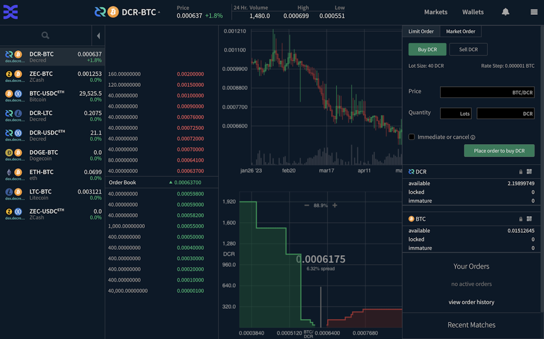
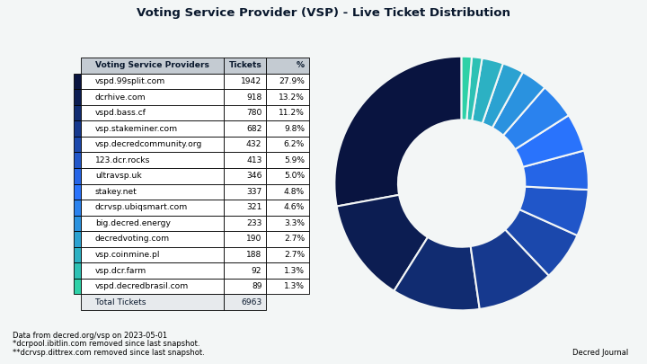
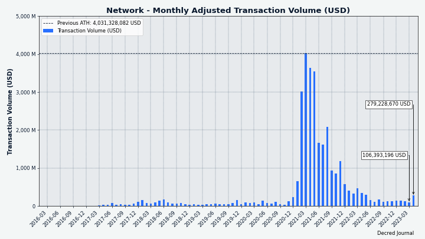
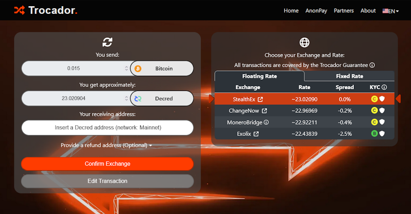

# Decred Journal – Kwiecień 2023

_Obraz: Niezatytułowany, aut. @Exitus_

Najważniejsze wydarzenia z kwietnia:

- Decred DEX doczekał się nowego wydania po około 8 miesiącach prac deweloperskich, w tym dostępności handlu ETH i USDC.

- Wydano wersję 1.7.7 podstawowego oprogramowania Decred, zawierającą optymalizacje i poprawki błędów, a także funkcję umożliwiającą użytkownikom Decrediton głosowanie na poszczególne transakcje TSpend, czyli wydatków ze Skarbca.

- Kolejna nowa wersja Bison Relay wdrożyła wiele ulepszeń UX i onboardingu.

Spis treści:

- [Wydanie wersji v1.7.7 oprogramowania podstawowego](#core-software-v177-release)
- [Wydanie DCRDEX v0.6.0](#dcrdex-v060-release)
- [Wydanie Bison Relay v0.1.7](#bison-relay-v017-release)
- [Rozwój](#development)
- [Ludzie](#people)
- [Zarządzanie](#governance)
- [Sieć](#network)
- [Ekosystem](#ecosystem)
- [Nawiązywanie kontaktów](#outreach)
- [Eventy](#events)
- [Media](#media)
- [Rynki](#markets)
- [Ważne kwestie i wiadomości poboczne](#relevant-external)

## Wydanie wersji v1.7.7 oprogramowania podstawowego

Najważniejsze informacje związane z [wydaniem v1.7.7](https://twitter.com/decredproject/status/1648190102802161671):

- **dcrd** otrzymał kilka optymalizacji, aby zużywać nieco mniej przepustowości i procesora w niektórych przypadkach.

- **dcrwallet** otrzymał wiele poprawek błędów i ulepszeń wydajności dla trybu SPV, kupowania biletów i mieszania. W szczególności jest to korzystne dla intensywnie używanych portfeli, które zawierają wiele transakcji.

- **Decrediton** zyskał możliwość głosowania na poszczególne transakcje TSpend, przeprojektowane widoki launchera, które edukują użytkownika podczas ładowania portfela, przeprojektowane widoki Trezor, aktualizację do DCRDEX v0.6.0 z handlem ETH i USDC oraz szereg poprawek błędów.

Odwiedź stronę [wydania GitHub](https://github.com/decred/decred-binaries/releases), aby uzyskać pełną listę zmian i plików do pobrania. Jak zawsze zalecamy [weryfikację plików](https://docs.decred.org/advanced/verifying-binaries) przed uruchomieniem.

_Obraz: Nowe widoki launchera - dowiedz się więcej o Decred podczas, gdy portfel synchronizuje się z siecią_

## Wydanie DCRDEX v0.6.0

Długo oczekiwana wersja 0.6 została wydana po około 8 miesiącach prac rozwojowych. Główne zmiany od wersji 0.5:

- Portfele dla i handel ETH i ERC-20
- Wbudowane lekkie portfele dla Bitcoin Cash (BCH) i Litecoin (LTC) pozwalają na przechowywanie i handel środkami bez uruchamiania pełnych węzłów
- Opłata rejestracyjna została zastąpiona kaucjami, środkami zablokowanymi w czasie, które mogą zostać zwrócone użytkownikowi.
- Możliwość połączenia się z serwerem DEX w trybie tylko do podglądu
- Odświeżone strony rynków i portfeli z różnymi układami dla różnych rozmiarów ekranu
- Eksperymentalny bot animatora rynku (market maker)

Pozostałe istotne zmiany:

- Ręczne zarządzanie równorzędnymi użytkownikami
- Szacunki opłat na stronach wysyłania
- Możliwość wyłączenia istniejącego portfela
- Archiwizacja danych starszych zamówień
- Szybsze składanie zleceń
- Ostatnie matche wyświetlane na stronie Rynków
- Liczne ulepszenia i poprawki w zakresie obsługi Electrum, Ethereum, śledzenia i prezentacji zleceń, raportowania błędów, szacowania opłat, tłumaczeń i innych

Są 3 sposoby na korzystanie z DCRDEX:

- Jako część portfela [Decrediton](https://github.com/decred/decred-binaries/releases) (wszystko zintegrowane, bez oddzielnej aplikacji do uruchomienia, podpisane kluczem `Decred Release`)
- Samodzielna aplikacja `dexc` z [wydania głównego oprogramowania](https://github.com/decred/decred-binaries/releases) (więcej opcji CPU i OS, podpisana kluczem `Decred Release`)
- Samodzielna aplikacja `dexc` z [własnego wydania DCRDEX](https://github.com/decred/dcrdex/releases) (ma bardziej przyjazną dla Windows wersję z ikoną zasobnika systemowego i bez okna terminala, podpisana przez programistów DEX)

Prosimy o poświęcenie czasu na przeczytanie [ważnych uwag](https://github.com/decred/dcrdex/releases/tag/v0.6.0), aby dowiedzieć się więcej o specyfice handlu P2P.

Wskazówki:

- Zaznajom się z nowymi przewodnikami wideo na temat [konfigurowania DEX w Decrediton](https://www.decredmagazine.com/setting-up-dcrdex-0-6-in-decrediton/) i [konfigurowania lekkich wbudowanych portfeli dla LTC, BCH i BTC](https://www.decredmagazine.com/setting-up-dcrdex-native-wallets-btc-bch-ltc/), a także więcej na [@DecredTV](https://www.youtube.com/@DecredTV/videos).
- Wbudowany portfel LTC może być powolny w uruchamianiu, ponieważ wyszukuje węzeł obsługujący kompaktowe filtry bloków. Użytkownicy mogą przejść do strony portfela DEX, kliknąć Litecoin -> Ustawienia -> Zarządzaj peerami i ręcznie dodać jednego peera [z tej listy](https://gist.github.com/chappjc/d0f26b12258f8531bb78b37f38d080a0), aby przyspieszyć proces.
- Bota animatora rynku można [włączyć](https://twitter.com/blockchainbuck/status/1655933747064360967), uruchamiając klienta DEX z flagą `--experimental` i wybierając "Market Making" z menu. Pamiętaj, aby zwiększyć "wagę wyroczni". Bot pomaga zwiększyć płynność, ale powinien być używany ostrożnie, ponieważ jest on eksperymentalny i jest to wciąż praca w toku.

_Obraz: Zaktualizowany widok handlu w DCRDEX v0.6.0_

_Obraz: Zaktualizowany widok portfela w DCRDEX v0.6.0_

## Wydanie Bison Relay v0.1.7

Nowa wersja pojawiła się zaledwie 4 tygodnie po wydaniu v0.1.6 RC1. Najważniejsze zmiany w finalnej wersji 0.1.7:

- Ulepszony onboarding dzięki nowym zaproszeniom przedpłaconym, zaproszeniom przedpłaconym od serwera i automatycznej konfiguracji portfela.
- Kliknięcie nazwy użytkownika prawym przyciskiem myszy otwiera menu, co znacznie ułatwia wysyłanie napiwków
- Przycisk sugerujący użytkownikowi wymianę kluczy z innym użytkownikiem (tj. przedstawienie jednego użytkownikowi drugiemu)
- Powiadomienia UI o nowych postach i nowych komentarzach do istniejących postów
- Wysyłanie i odbieranie DCR on-chain (może być używane do wypłacania DCR z Bison Relay)
- Ulepszone i naprawione zachowanie przewijania
- Lista wszystkich własnych postów
- Lepszy UX dla dodawania plików do postów
- Otrzymane pliki mogą być otwierane bezpośrednio z BR
- Ulepszony instalator macOS, aplikacja jest podpisana i poświadczona
- Więcej szczegółów w sekcji rozwoju [Bison Relay](#bison-relay) poniżej

Najnowsze wersje binarne dostępne są na [GitHub](https://github.com/companyzero/bisonrelay/releases). Pobieranie Bison Relay może być teraz [zweryfikowane](https://docs.decred.org/advanced/verifying-binaries) dzięki dodanym podpisom wykonanym przez ten sam klucz, który podpisuje wydania Decred (`Decred Release <release@decred.org>` z odciskiem palca `F516ADB7A069852C7C28A02D6D897EDF518A031D`).

Sprawdź [przewodnik instalacji](https://www.decredmagazine.com/bison-relay-upgrades-to-version-0-1-7/) i [przewodnik po napiwkach](https://www.decredmagazine.com/oprah-tipping-bot-bisonrelay/), aby uniknąć typowych problemów z otrzymywaniem napiwków. Więcej przewodników wideo Bison Relay można znaleźć na stronie [@DecredTV](https://www.youtube.com/@DecredTV/videos).

_Obraz: Bison Relay v0.1.7_

_Obraz: Oprah przekazuje napiwki w czasie rzeczywistym na Bison Relay_

## Rozwój

O ile nie zaznaczono inaczej, prace zgłaszane poniżej mają status „scalonych z repozytorium głównym (master)”. Oznacza to, że prace są ukończone, zrecenzowane i zintegrowane z kodem źródłowym, który zaawansowani użytkownicy mogą [kompilować i uruchamiać](https://medium.com/@artikozel/the-decred-node-back-to-the-source-part-one-27d4576e7e1c), ale ich efekty nie są jeszcze dostępne w wersji plików binarnych dla zwykłych użytkowników.

### dcrd

_[dcrd](https://github.com/decred/dcrd) jest pełną implementacją węzła, który obsługuje sieć peer-to-peer Decred na całym świecie._

Wcześniejsze zmiany zbackportowane do [wydania v1.7.7](https://github.com/decred/dcrd/releases/tag/release-v1.7.7):

- Zwiększono minimalną wersję Go do 1.17 dla modułów [`peer`](https://github.com/decred/dcrd/commit/0d375e0738e5995b1c3beb303a654aefe76e4a64) i [`addrmgr`](https://github.com/decred/dcrd/commit/235233906177b5c429f0e1297cc05bafb9d60b15), aby umożliwić optymalizacje łańcucha narzędzi Go, takie jak [przycinanie grafu modułów](https://go.dev/ref/mod#graph-pruning) i [leniwe ładowanie modułów](https://go.dev/ref/mod#lazy-loading). Moduły [`peer`](https://github.com/decred/dcrd/tree/8f3e249555544ff8f1991d055da1e910dbd5a88b/peer) i [`addrmgr`](https://github.com/decred/dcrd/tree/8f3e249555544ff8f1991d055da1e910dbd5a88b/addrmgr) zapewniają solidne podstawy do tworzenia oprogramowania, które komunikuje się z siecią Decred.
- Zwiększono wersję [protokołu peer-to-peer](https://github.com/decred/dcrd/commit/ad501373e203aeff56e8f7f699ab442f8706694e) używanego przez moduł `peer`, aby nie używał już komunikatu `reject` (wyjaśniliśmy to w wydaniu [z listopada](202211.md#dcrd)).
- Naprawiono buforowanie [inwentarza innych peerów](https://github.com/decred/dcrd/pull/3074) (mała optymalizacja ruchu).
- Zoptymalizowano [wybór adresu peera](https://github.com/decred/dcrd/commit/32e98be286deb3104352f81fe8c1147c1f158e29) i złagodzono nadmierne użycie procesora w scenariuszach sieci testowej.
- Zaktualizowano formatowanie kodu, skrypty kompilacji i README dla [Go 1.20](https://github.com/decred/dcrd/pull/3087).
- Zaktualizowano do najnowszego modułu `sys` (niskopoziomowa interakcja z systemem operacyjnym) w celu wsparcia kompilacji na OpenBSD z 64-bitowymi procesorami [RISC-V](https://en.wikipedia.org/wiki/RISC-V).
- Wszystkie backportowane zmiany zostały dodane do gałęzi [wydania](https://github.com/decred/dcrd/commits/release-v1.7) w przeciwieństwie do zwiększania numerów wersji modułów w pliku `go.mod`. To sprawia, że budowanie z gałęzi wydania jest [łatwiejsze](https://github.com/decred/dcrd/pull/3083) dla niektórych deweloperów.

Zmiany scalone na gałęzi `master` ku przyszłym wydaniom:

- Dodano definicje dla nadchodzących głosowań konsensusu, aby zmienić funkcję haszowania [proof-of-work](https://github.com/decred/dcrd/pull/3089) na [BLAKE3](https://en.wikipedia.org/wiki/BLAKE_(hash_function)#BLAKE3) i [zmniejszyć nagrodę za wydobycie bloków PoW](https://github.com/decred/dcrd/pull/3090). Zmiany te zostaną bardziej formalnie udokumentowane odpowiednio w [propozycjach zmian Decred](https://github.com/decred/dcps) DCP-11 i DCP-12. Definicje dodają tylko podstawowe informacje, takie jak opis głosowania, wybory i daty ważności. Kod implementujący rzeczywiste zmiany zostanie dodany osobno.
- Zaimplementowano [głosowanie konsensusowe dla DCP-12](https://github.com/decred/dcrd/pull/3092). Jeśli głosowanie się powiedzie, podział nagród w blokach zmieni się na 1% PoW, 89% PoS, 10% Skarbiec.
- Dodano funkcję [generowania klucza prywatnego](https://github.com/decred/dcrd/pull/3096) przy użyciu niestandardowego źródła entropii. Posiadanie takiej funkcji w dcrd pozwala usunąć duplikaty z innych pakietów Decred.
- Refaktoryzacja i czyszczenie kodu.
- Wersje kilku modułów zostały podniesione, aby umożliwić przycinanie grafu modułów Go w całej bazie kodu.

### dcrwallet

_[dcrwallet](https://github.com/decred/dcrwallet) to serwer portfela używany przez wiersz polecenia oraz aplikacje graficzne._

Zmiany zbackportowane do wydania v1.7.7:

- Dodano opcję [`watchlast`](https://github.com/decred/dcrwallet/pull/2196) w celu ograniczenia początkowo obserwowanych adresów, co jest korzystne dla dużych portfeli z wieloma starymi adresami.
- Usunięto niepotrzebne [obliczanie salda](https://github.com/decred/dcrwallet/pull/2203) podczas korzystania z automatycznego kupowania biletów. Poprawia to wydajność bardziej aktywnych portfeli.
- Naprawiono przypadek brzegowy, w którym zakup biletu jest anulowany z powodu zmiany ceny biletu, co prowadzi do tego, że transakcje niektórych portfeli [nie są wykrywane](https://github.com/decred/dcrwallet/pull/2212).
- Zaimplementowano szybszy sposób [wybierania losowych UTXO](https://github.com/decred/dcrwallet/pull/2202) (aka "monet") używanych do tworzenia nowych transakcji.
- Unikanie tworzenia [reszty z transakcji mieszanych](https://github.com/decred/dcrwallet/pull/2218), aby niezmieszane konto nie było wypełnione tymi wyjściami, które są zbyt małe, aby je zmieszać i zbyt kuszące, aby wydać je razem. "Mix change" to specjalne wyjścia transakcji mieszanych, które są tworzone, gdy kwota DCR wysłana do mieszanki nie [dzieli się równo](https://math.stackexchange.com/a/58558) przez nominał mieszanki. Weźmy na przykład [ten mix](https://dcrdata.decred.org/tx/a87479a31814f2f08513df76ea4dcc438de9f12b04bfba89c77dd960db169656): 3,2189 DCR trafia do mieszania, a wyjścia obejmują 17 wyjść o standardowym nominale miksu wynoszącym 0,1678 DCR (łącznie 2,8521 DCR) i 7 wyjść "reszty" o mniejszym rozmiarze (łącznie 0,3666 DCR). Zgodnie z [mix.decred.org](https://mix.decred.org/), reszta z miksu nie jest anonimowa i może zostać wykorzystana do naruszenia prywatności miksów. dcrwallet może zanonimizować taką resztę, ostrożnie ją mieszając, ale nie można tego zrobić dla reszt mniejszych niż 0,00264314 DCR (najmniejszy nominał miksu 0,00262144 DCR plus opłata domyślna). Zamiast tworzyć tak małe wyjścia, które i tak nie powinny być używane, ich wartość jest wliczana do opłaty transakcyjnej.

Zmiany scalone na gałęzi `master` ku przyszłym wydaniom:

- Oczyszczono i uproszczono publiczne API wewnętrznego [kodu VSP](https://github.com/decred/dcrwallet/pull/2227). Jest to część konsolidacji kodu VSP w repozytorium [vspd](https://github.com/decred/vspd) w celu łatwiejszej konserwacji i ponownego wykorzystania kodu.
- Usunięto obsługę [cofnięcia biletu](https://github.com/decred/dcrwallet/pull/2230) z klienta VSP. Usuwa to znaczącą zależność z kodu VSP i jest niepotrzebne, ponieważ cofnięcia są automatyczne od wejścia w życie [DCP-9](https://github.com/decred/dcps/blob/master/dcp-0009/dcp-0009.mediawiki).
- Naprawiono [maksymalną opłatę VSP](https://github.com/decred/dcrwallet/pull/2228) ustawioną w konfiguracji, która nie była respektowana i zawsze zastępowana zakodowaną na stałe wartością 0,2 DCR. Walidacja konfiguracji VSP została również przeniesiona do kodu startowego, dzięki czemu nieprawidłowe opcje są zgłaszane wcześniej.
- Konserwacja kodu i 1 poprawka współbieżności.

### dcrctl

_[dcrctl](https://github.com/decred/dcrctl) to klient wiersza polecenia dla dcrd i dcrwallet._

- Aktualizacje dla wydania v1.7.7: przejście na najnowszy kod kompilacji GitHub, Go 1.20 i najnowszy kod dcrwallet.

### Decrediton

_[Decrediton](https://github.com/decred/decrediton) to w pełni funkcjonalny desktopowy portfel ze zintegrowaną funkcją głosowania, mieszania StakeShuffle, Lightning Network, handlem na DEX i nie tylko. Działa z lub bez dostępu do pełnego łańcucha (tryb SPV)._

Zmiany zbackportowane do wydania v1.7.7:

- ~34 [commity](https://github.com/decred/decrediton/compare/release-v1.7.6...release-v1.7.7) ze wszystkimi poprawkami i ulepszeniami wprowadzonymi od [listopada 2022](202211.md#decrediton).
- Zaktualizowano do wersji [DCRDEX v0.6.0](https://github.com/decred/decrediton/pull/3857).
- Naprawiono błąd w [formularzu wysyłania](https://github.com/decred/decrediton/pull/3855), który powodował zgłaszanie lub wysyłanie nieprawidłowej kwoty DCR w niektórych przypadkach.
- Naprawiono opóźnienie podczas [otwierania portfela](https://github.com/decred/decrediton/pull/3846), usuwając niepotrzebne pobieranie informacji o VSP.
- Naprawiono [stan ładowania](https://github.com/decred/decrediton/pull/3846) w widokach przetwarzania zarządzanych/niezarządzanych biletów i dodano dla nich testy. Widoki te pomagają upewnić się, że wszystkie bilety są zarejestrowane w VSP, a ich opłaty są uiszczane.
- Naprawiono [ETH wyświetlane jako nieobsługiwane](https://github.com/decred/decrediton/pull/3861) w oknie DEX. Wersje [binarne](https://github.com/decred/decred-binaries/releases/tag/v1.7.7) zostały szybko przebudowane, aby uwzględnić tę poprawkę.

Zapraszamy do lektury [uwag do wydania](https://github.com/decred/decred-binaries/releases/tag/v1.7.7#decrediton-v177), aby uzyskać podsumowanie wszystkich zmian od wersji v1.7.6.

### vspd

_[vspd](https://github.com/decred/vspd) to oprogramowanie serwera dla pul udziałów (Voting Service Provider). VSP oddaje głos za swoich użytkowników 24/7 oraz nie wchodzi w posiadanie żadnych środków, a tym samym nie może ich ukraść._

- Zaktualizowano do najnowszej wersji [modułów Decred](https://github.com/decred/vspd/pull/378) z dcrd i dcrwallet.
- Konserwacja kodu.

### Lightning Network

_[dcrlnd](https://github.com/decred/dcrlnd) to oprogramowanie węzła Lightning Network dla Decred. LN umożliwia przesyłanie natychmiastowych i niskokosztowych transakcji._

- Zbackportowano [zmianę](https://github.com/lightningnetwork/lnd/pull/5047) z głównego repozytorium lnd, aby wprowadzić [funkcje związane z kontami](https://github.com/decred/dcrlnd/pull/178) (import konta, import pojedynczego klucza publicznego, lista kont itp.) Ponadto dodano kilka dodatkowych funkcji: tworzenie dodatkowych kont portfela, eksportowanie indywidualnych kluczy prywatnych i wydawanie określonych UTXO. Celem tych zmian jest umożliwienie użytkownikom utworzenia konta, z którego można wyodrębnić indywidualne klucze prywatne, a następnie je wydać. Jest to wykorzystywane w Bison Relay do finansowania zaproszeń prepaid.
- Zaktualizowano do najnowszych [modułów Decred](https://github.com/decred/dcrlnd/pull/179) z dcrd i dcrwallet.
- Dodano żądanie RPC w celu uzyskania informacji o [transakcji](https://github.com/decred/dcrlnd/pull/180) należącej do portfela LN.

### cspp

_[cspp](https://github.com/decred/cspp) to serwer do koordynowania mieszania monet za pośrednictwem protokołu CoinShuffle++. Nie jest powierniczy, tzn. nie przejmuje kontroli nad środkami._

- Szef projektu Jake Yocom-Piatt informuje, że [miksowanie peer-to-peer](https://twitter.com/exitusdcr/status/1655095852392935425) ostatecznie zastąpi centralny serwer, który obecnie koordynuje miksy.

### DCRDEX

_[DCRDEX](https://github.com/decred/dcrdex) to niepowiernicza giełda, umożliwiająca handel bez konieczności zaufania, działająca dzięki technologii atomic swaps._

Zmiany w klientach zawarte w wydaniu v0.6.0:

- Nieumieszczanie adresu serwera WWW w nagłówku HTTP Content Security Policy (CSP), jeśli jest to [adres IPv6](https://github.com/decred/dcrdex/pull/2287). Jest to poprawka obejścia [błędu Safari](https://bugs.webkit.org/show_bug.cgi?id=201591), który powodował, że niektóre ikony [nie ładowały się](https://github.com/decred/dcrdex/issues/1652) poprawnie.
- Naprawiono potencjalny [integer overflow](https://github.com/decred/dcrdex/pull/2285) podczas obliczania potwierdzeń transakcji Ethereum.
- Kilka mniejszych poprawek.

Wszystkie poniższe zmiany są scalone z gałęzią `master` ku przyszłym wydaniom.

Klient:

- Wyświetlanie powiadomienia, gdy [nie uda się połączyć](https://github.com/decred/dcrdex/pull/2288) z portfelem.
- Domyślne używanie adresu [`127.0.0.1`](https://github.com/decred/dcrdex/pull/2283) IPv4, gdy nie jest on określony w konfiguracji. Pomaga to spełnić wymagania protokołu [Content Security Policy](https://developer.mozilla.org/en-US/docs/Web/HTTP/CSP) w sposób, który pozwala również obejść błąd w Safari. Nowe ustawienie domyślne pozwala uniknąć sytuacji, w której niektóre [ikony](https://github.com/decred/dcrdex/issues/1652) nie ładują się poprawnie z powodu błędów CSP.
- Bezwzględne wyświetlanie [ostatnich matchy](https://github.com/decred/dcrdex/pull/2307). Wcześniej lista ostatnich matchy była czyszczona w niektórych sytuacjach, takich jak ponowne uruchomienie klienta.
- Wyświetlanie [kursu zlecenia](https://github.com/decred/dcrdex/pull/2281), nawet jeśli pole zlecenia jest zwinięte. Stawka (cena) to ważna informacja, która musi być widoczna bez konieczności klikania w celu rozwinięcia szczegółów zamówienia.
- Usunięto nadmiar [końcowych zer](https://github.com/decred/dcrdex/pull/2278) z niektórych elementów interfejsu użytkownika i poprawiono ogólną spójność formatowania liczb.
- Zapamiętywanie ostatnio wybranego [rozmiaru świecy](https://github.com/decred/dcrdex/pull/2284) po przeładowaniu strony. Zmieniono domyślny rozmiar świecy z 5 minut na 1 godzinę.
- Śledzenie potwierdzeń dla transakcji [wykupienia środków](https://github.com/decred/dcrdex/pull/2049) i ponawianie jej w razie potrzeby. Jest to odpowiedź na skrajny przypadek, gdy mempool jest tak pełny, że transakcje płacące niższe opłaty są usuwane i nigdy nie są wydobywane. Takie transakcje muszą zostać ponowione później, być może z wyższą opłatą.
- Dodano [informacje o wydaniu](https://github.com/decred/dcrdex/pull/2276) dla wersji 0.6.0.
- Naprawiono brak synchronizacji [cen](https://github.com/decred/dcrdex/pull/2280) na lewym pasku bocznym.
- Naprawiono obsługę [powiadomień](https://github.com/decred/dcrdex/pull/2286) serwera , które mogą pojawić się przed zainicjowaniem rynków klienta.
- Naprawiono błąd podczas [zamykania](https://github.com/decred/dcrdex/pull/2325) podczas pracy w Decreditonie.
- Naprawiono ~2 mniejsze błędy interfejsu użytkownika.

Ethereum:

- Wyświetlanie bardziej znaczących [typów portfela](https://github.com/decred/dcrdex/pull/2207), takich jak "RPC" dla portfeli ETH od zewnętrznych dostawców danych i "tokenów Ethereum" dla portfeli USDC.
- Zaktualizowano [dokumenty](https://github.com/decred/dcrdex/pull/2289): Usunięto dostawcę ArchiveNode.io, który kończy działalność, odradzono korzystanie z Flashbots.net, dodano wskazówki dotyczące odzyskiwania portfela.
- Zmodyfikowano kod dla [kaucji obrotowych](https://github.com/decred/dcrdex/pull/2275) w celu łatwiejszej integracji kaucji ETH.
- Zmieniono rozgłaszanie transakcji do [wszystkich dostawców RPC](https://github.com/decred/dcrdex/pull/2266) zamiast tylko do jednego preferowanego dostawcy. Powinno to pomóc w zapewnieniu szybkiej propagacji i wydobycia transakcji.
- Dodano [link do przewodnika konfiguracji](https://github.com/decred/dcrdex/pull/2261) do formularzy związanych z konfiguracją portfela. Wyświetlane będą również dwa pola wejściowe dla dostawców RPC zamiast jednego. Ważne jest, aby użytkownicy zrozumieli, że awaria dostawcy może prowadzić do utraty środków i skonfigurowali 2 lub więcej dostawców, aby zawsze mieć rezerwę.
- Dodano narzędzie deweloperskie do uzyskiwania [szacowanych stawek gazu](https://github.com/decred/dcrdex/pull/2050) dla krytycznych operacji DEX na Ethereum. Pomoże to w dodawaniu nowych tokenów lub nowych wersji kontraktów.

Litecoin:

- Przeniesiono [poprawki rozmiaru transakcji](https://github.com/decred/dcrdex/pull/2299) z [ltcd](https://github.com/ltcsuite/ltcd/pull/25), aby obsłużyć niektóre niezwykle duże transakcje SegWit.
- Część [kodu dekodera](https://github.com/ltcsuite/ltcd/issues/17#issuecomment-1201877368) MimbleWimble napisanego dla DCRDEX została [zaadoptowana](https://github.com/ltcsuite/ltcd/issues/17#issuecomment-1506234416) w [ltcd](https://github.com/ltcsuite/ltcd/pull/31)!

Zcash:

- Zastąpiono użycie [przestarzałych metod adresowania](https://github.com/decred/dcrdex/pull/2237) dla Zcash. Wymaga to zcashd w wersji 5.4.2 lub nowszej.
- Dodano [początkową](https://github.com/decred/dcrdex/pull/2317) [infrastrukturę](https://github.com/decred/dcrdex/pull/2250) dla ekranowanych pul, funkcji Zcash umożliwiającej prywatne salda i transakcje. Pierwszy etap integracji prywatności Zcash będzie ograniczony do osłaniania/odsłaniania własnych funduszy i wysyłania z własnych osłoniętych na dowolne osłonięte lub przezroczyste adresy. Początkowo tylko przezroczyste adresy będą zaangażowane w działalność swapową.
- Poprawiono pisownię [Zcash](https://github.com/decred/dcrdex/pull/2300) w całej bazie kodu.

DigiByte:

- Swapy DigiByte zostały przetestowane na sieci [mainnet](https://github.com/decred/dcrdex/pull/1993#issuecomment-1487571640), obsługa DGB została [scalona](https://github.com/decred/dcrdex/pull/1993) i jest [planowana](https://github.com/decred/dcrdex/pull/1993#issuecomment-1511304826) dla nadchodzącej wersji v0.6.1.
- Uruchomienie pełnego węzła DigiByte jest obecnie jedyną opcją, ponieważ jest on oparty na Bitcoin Core v0.17 i nie ma obsługi [kompaktowych filtrów](https://github.com/decred/dcrdex/issues/1992#issue-1486990539) (więc DEX nie może zaimplementować lekkiego wbudowanego portfela dla DGB). Duża aktualizacja do funkcji Bitcoin Core v22 jest [w toku](https://github.com/DigiByte-Core/digibyte/pull/63), więc może się to zmienić w przyszłości.
- Członkowie społeczności DGB wyrazili zainteresowanie w listopadzie 2022 r. i byli [aktywni](https://twitter.com/JohnnyLaw2021/status/1587801707790180353) na [Twitterze](https://twitter.com/dgb_ycagel/status/1599944772403466241) i [GitHubie](https://github.com/decred/dcrdex/pull/1993#issuecomment-1459097459) DEX. @chappjc stworzył [łatkę](https://github.com/DigiByte-Core/digibyte/pull/102), która poprawia wydajność węzła DigiByte w sieci testowej, aby ułatwić rozwój. W marcu 2023 r. interesariusze Decred zatwierdzili integrację DGB jako część najnowszej [propozycji rozwoju DEX](https://proposals.decred.org/record/ca6b749).
- Należy pamiętać, że ten etap to tylko wsparcie oprogramowania w DCRDEX, a uruchomienie rynków DGB jest [oddzielnym](https://github.com/decred/dcrdex/pull/1993#issuecomment-1456932743) zadaniem.

Serwer:

- Usunięto wymóg uruchamiania serwera po skonfigurowaniu [opłat rejestracyjnych DCR](https://github.com/decred/dcrdex/pull/2293) i usunięto kod ściśle powiązany z opłatami DCR. Ten stary kod stał się przestarzały dzięki możliwości uiszczenia opłaty rejestracyjnej w aktywach innych niż DCR. Teraz, wraz z przejściem na obligacje lojalnościowe, obsługa opłat rejestracyjnych dla wielu aktywów jest przestarzała, ale pozostanie dostępna przez jakiś czas.
- Naprawiono błąd uruchamiania [sprawdzania salda](https://github.com/decred/dcrdex/pull/2312), który mógł błędnie anulować rezerwację zlecenia.

Pozostałe:

- Wiele mniej ekscytujących, ale niezbędnych zmian jest wprowadzanych za kulisami, takie jak refaktoryzacja kodu, czyszczenie, optymalizacja kodu kompilacji itp., aby płynniej dodawać nowe zasoby.
- Niektóre z [poprawek](https://github.com/decred/dcrdex/pull/2323) wymienionych powyżej zostaną przeniesione do nadchodzącego wydania v0.6.1.
- Integracja z Umbrel została zakończona. Sklep aplikacji społeczności Umbrel został [zaktualizowany o Decred](https://github.com/decred/umbrel-app-store/pull/3) i najnowszy obraz Docker zawierający wydanie DEX v0.6.0. Linki instalacyjne Umbrel zostały [dodane](https://github.com/decred/dexweb/pull/34) do [dex.decred.org](https://dex.decred.org/). Wreszcie, wydanie DEX v0.6 na Umbrel zostało [ogłoszone](https://twitter.com/decredproject/status/1648439889678192640) na Twitterze.
- Operatorom węzłów Litecoin [zaleca się](https://twitter.com/chappjc/status/1645982431571329024) zaktualizowanie swoich węzłów do wersji 0.21 i włączenie kompaktowych filtrów blokowych. Obecnie wbudowanemu portfelowi SPV trudno jest znaleźć pierwszego peera, ponieważ nie tak wiele publicznych pełnych węzłów obsługuje kompaktowe filtry. Użytkownicy DCRDEX mogą to obejść, ręcznie dodając peery z [tej listy](https://gist.github.com/chappjc/d0f26b12258f8531bb78b37f38d080a0).

W toku:

- [Staking DCR](https://github.com/decred/dcrdex/issues/2264) bezpośrednio w portfelu DEX. Wywołało to próbę [wyodrębnienia większej ilości kodu VSP](https://github.com/decred/vspd/pull/382) z dcrwallet do repozytorium vspd, aby ułatwić jego ponowne wykorzystanie.
- Bot animatora rynku. Jest to duży wysiłek obejmujący zadania takie jak [interfejs wiersza poleceń](https://github.com/decred/dcrdex/issues/2304), [framework testowy](https://github.com/decred/dcrdex/issues/2303) symulujący różne warunki rynkowe, [monitorowanie wydajności handlu](https://github.com/decred/dcrdex/issues/2306), [segregowanie sald bota](https://github.com/decred/dcrdex/pull/2332) i inne.
- [Bot arbitrażowy](https://github.com/decred/dcrdex/pull/2005). Oba boty są częścią niedawnej [propozycji botów DEX](https://proposals.decred.org/record/8b1ceda).
- Pakowanie DEX jako [aplikacji desktopowej](https://github.com/decred/dcrdex/pull/1957). Spowoduje to owinięcie GUI w [WebView](https://github.com/webview/webview), dzięki czemu DEX będzie zachowywał się jak normalna aplikacja desktopowa z własnym oknem, ikoną paska zadań/trayem, powiadomieniami itp. tak, aby użytkownicy nie musieli już ładować aplikacji w zwykłej przeglądarce. Jest to część [propozycji pakowania](https://proposals.decred.org/record/ae7c4fe). Specjalistyczne pakiety dla [Debiana](https://github.com/decred/dcrdex/pull/2308) i [macOS](https://github.com/decred/dcrdex/pull/2333) są również w przygotowaniu. Szukamy testerów! Dołącz do czatu [#dexdev](https://chat.decred.org/#/room/#dexdev:decred.org) i zapytaj, jak wziąć udział w testach.
- [Integracja z Polygon](https://github.com/decred/dcrdex/issues/2319) (część propozycji [deweloperskiej klienta DEX](https://proposals.decred.org/record/ca6b749)). Polygon to rozwiązanie skalowania warstwy 2 dla Ethereum z szybszą realizacją i niższymi opłatami. Wcześniej znany jako Matic Network (token MATIC).
- Nowa wersja [smartkontraktów ETH dla swapów](https://github.com/decred/dcrdex/pull/2038), która ma potencjał do znacznego [obniżenia opłat](https://github.com/decred/dcrdex/pull/1426).
- Kaucje opłacane w [ETH](https://github.com/decred/dcrdex/pull/2223).
- Rozpoczęto wstępne badania nad integracją [Firo](https://github.com/decred/dcrdex/pull/2270). Firo było wcześniej znane jako Zcoin.

_Obraz: Nadchodzi integracja DigiByte z DCRDEX_

_Obraz: Umbrel to kolejne miejsce, z któego można pozyskać dostęp do DCRDEX_

### decred.org

_[dcrdocs](https://github.com/decred/dcrdocs) to repozytorium źródłowe [dokumentacji użytkownika](https://docs.decred.org/) dla Decred._

- Aktualizacje dla [wersji v1.7.7](https://github.com/decred/dcrweb/pull/1115).

### Bison Relay

_[Bison Relay](https://github.com/companyzero/bisonrelay) to nowa platforma mediów społecznościowych peer-to-peer z silną ochroną przeciw cenzurze, inwiligacji, oraz reklamom, działająca na bazie Lightning Network projektu Decred._

Nowe funkcje zostały po raz pierwszy przetestowane przez społeczność w wersji Release Candidate 1, która ujawniła kilka błędów, które zostały naprawione w wersji finalnej v0.1.7.

Wspólne zmiany w aplikacjach GUI i CLI w wersji 0.1.7:

- Dodano śledzenie postępów i automatyczne [ponawianie prób wysłania wskazówek DCR](https://github.com/companyzero/bisonrelay/pull/176).

Zmiany w aplikacji GUI w wersji v0.1.7:

- Dodano polecenie menu [sugerujące](https://github.com/companyzero/bisonrelay/pull/182), aby dany użytkownik przeprowadził wymianę kluczy z innym użytkownikiem. Pozwala to na połączenie dwóch użytkowników poprzez pośredniczenie w wymianie kluczy.
- Uczyniono [odebrane pliki](https://github.com/companyzero/bisonrelay/pull/190) interaktywnymi: każdy plik ma ikonę wskazującą jego typ, a kliknięcie pliku otwiera go za pomocą programu skonfigurowanego w systemie operacyjnym.
- Dodano podpowiedź wyjaśniającą pole [Koszt](https://github.com/companyzero/bisonrelay/pull/196) podczas udostępniania zawartości (jest to cena, jaką użytkownicy zapłacą za pobranie zawartości).
- Dodano menu kontekstowe po [kliknięciu prawym przyciskiem myszy](https://github.com/companyzero/bisonrelay/pull/198) nazwy użytkownika w różnych miejscach, takich jak czat, lista użytkowników, kanał lub komentarze do postów. Zapewnia to szybszy dostęp do napiwków i innych działań dotyczących użytkowników.
- Poprawiono UX dla [osadzania plików w postach](https://github.com/companyzero/bisonrelay/pull/203). Kilku użytkowników nie nacisnęło przycisku `+`, aby dodać plik, co skutkowało postami bez obrazów. Mylący przycisk `+` został usunięty, a pliki są teraz dodawane w jednej akcji.
- Dodano stronę z listą wszystkich [własnych postów](https://github.com/companyzero/bisonrelay/pull/204).
- Dodano [przedpłacone zaproszenia](https://github.com/companyzero/bisonrelay/pull/191). Gdy takie zaproszenie zostanie zaimportowane, jego DCR automatycznie zasili portfel Bison Relay zaproszonego użytkownika.
- Dodano zarządzanie kontami portfela (tworzenie i lista kont) oraz możliwość [wysyłania i odbierania DCR z transakcjami on-chain](https://github.com/companyzero/bisonrelay/pull/191) (nie LN). Dzięki temu BR może działać jako prosty portfel DCR, stając się trzecim aktywnie obsługiwanym portfelem GUI po Decreditonie i DCRDEX.
- Dodano [zaproszenia oparte na serwerze](https://github.com/companyzero/bisonrelay/pull/194) (aka zaproszenia oparte na RV), które pozwalają uniknąć konieczności wymiany plików zaproszeń. Zamiast tego zaproszenie jest wysyłane na serwer, a jego pobranie jest opłacane z góry przez nadawcę. Otrzymujący użytkownik może pobrać takie zaproszenie bez konieczności płacenia serwerowi. Jeśli zaproszenie zawiera DCR, można je wykorzystać do zasilenia portfela nowego użytkownika w celu korzystania z Bison Relay.
- Dodano zautomatyzowany [onboarding flow](https://github.com/companyzero/bisonrelay/pull/197) przy użyciu zaproszeń opartych na serwerze. Wykonuje wszystkie zadania związane z konfiguracją portfela, jeśli otrzyma odpowiedni przedpłacony klucz zaproszenia. Zadania obejmują: pobranie zaproszenia, wykorzystanie środków, otwarcie wychodzących i przychodzących kanałów LN oraz przeprowadzenie początkowej wymiany kluczy z użytkownikiem, który utworzył zaproszenie.
- Naprawiono niechciane wstawianie [nowej linii](https://github.com/companyzero/bisonrelay/pull/195) podczas wysyłania za pomocą klawisza Enter, gdy kursor nie znajduje się na końcu linii. Naprawiono również wysyłanie pustych wiadomości.
- Naprawiono kilka formularzy wejściowych, które nie reagowały na [klawisz Enter](https://github.com/companyzero/bisonrelay/pull/198), który normalnie wysyła formularz.
- Naprawiono i poprawiono zachowanie [przewijania czatu](https://github.com/companyzero/bisonrelay/pull/207). Nowe wiadomości nie będą już powodować przewijania do dołu i utraty pozycji przewijania. Po opuszczeniu i powrocie do czatu będzie on przewijany do dołu tak, jak w Element. Dodano przewijanie do pierwszej nieprzeczytanej wiadomości.
- Naprawiono komunikat o błędzie podczas korzystania z funkcji [Query Route](https://github.com/companyzero/bisonrelay/pull/200) w celu sprawdzenia, czy istnieje prawidłowa trasa do węzła LN używanego przez serwer Bison Relay.

Problemy znalezione w wersji Release Candidate 1 i naprawione do wydania v0.1.7 final:

- Dodano [powiadomienia](https://github.com/companyzero/bisonrelay/pull/217) dla nowych postów i nowych komentarzy do istniejących postów. Jeśli istnieją nieprzeczytane elementy, ikony na głównym pasku bocznym zmienią się, elementy kanału zostaną oznaczone jako "Nowy post" lub "Nowe komentarze", a nowe komentarze będą wyświetlane pogrubioną czcionką, dopóki użytkownik nie kliknie postu.
- Zaktualizowano [ikony](https://github.com/companyzero/bisonrelay/pull/218) dla macOS i Windows, zmieniono nazwę aplikacji z "bruig" na "bisonrelay".
- Naprawiono przycisk [Nowy post](https://github.com/companyzero/bisonrelay/pull/210) nawigujący do niewłaściwej strony.
- Naprawiono wyświetlanie [ikon](https://github.com/companyzero/bisonrelay/pull/220) w trybie ciemnym.
- Naprawiono kartę czatów zachowującą się jak [jakby użytkownik nie miał jeszcze kontaktów](https://github.com/companyzero/bisonrelay/issues/211) i wyświetlającą początkowy monit o zaproszenie, dopóki aplikacja nie zsynchronizuje się z siecią. Zostało to zastąpione animacją ładowania podczas ładowania książki adresowej.

Zmiany w aplikacji wiersza polecenia w wersji v0.1.7:

- Dodano opcję do polecenia `/channels`, aby wyświetlić [dodatkowe informacje](https://github.com/companyzero/bisonrelay/pull/208) dla kanałów LN.
- Naprawiono próbę załadowania certyfikatu TLS, gdy jego ścieżka jest pusta w widoku "Żądanie przepustowości odbioru".
- Zaktualizowano [skrypt kompilacji](https://github.com/companyzero/bisonrelay/pull/209) i usunięto pozostałości po ZKC (poprzedniku Bison Relay).

Zmiany scalone na gałęzi `master` ku przyszłym wydaniom:

- Naprawiono możliwą awarię aplikacji CLI podczas wyświetlania listy [kanałów LN](https://github.com/companyzero/bisonrelay/pull/222) poleceniem `/ln channels`.
- Zaktualizowano [style](https://github.com/companyzero/bisonrelay/pull/225) aplikacji GUI dla powiadomień o nowych postach i komentarzach.

Pozostałe:

- Bot do napiwków Oprah będzie [wysyłał wiadomości](https://matrix.to/#/!GHnoHXSgkVAsUknRUg:decred.org/$FKG9OTiG-WZO7vRl_-VhS9ST_EhvjpWOLeQjs9qvcyc?via=decred.org&via=matrix.org&via=zettaport.com) do użytkowników, gdy nie uda mu się wysłać napiwku. W ten sposób odbiorcy napiwków będą powiadamiani o problemach z ich kanałami odbioru.
- Istniejące publiczne czaty grupowe zostaną zaktualizowane w celu obsługi wielu administratorów i wykorzystania nowego bota administratora. Członkowie takich pokojów powinni dokonać aktualizacji do wersji 0.1.6 lub wyższej.
- Nowy [admin bot](https://matrix.to/#/!GHnoHXSgkVAsUknRUg:decred.org/$X75ujNeIVZdUSDf2HUwdlIzbXVzYsfKj-HnkWMJwpZk) jeszcze bardziej usprawni onboarding, pomagając nowym użytkownikom odkrywać publiczne kanały i zapraszając ich automatycznie, eliminując oczekiwanie na ręczne zaproszenie.
- Po zakończeniu prac nad onboardingiem deweloperzy planują pracować nad [stronami, sklepami i aplikacjami mobilnymi](https://matrix.to/#/!GHnoHXSgkVAsUknRUg:decred.org/$oyK-Bcj3BRUfWvIcJcR4-gx-pOC7BbFRHm9KStEFmTk?via=decred.org&via=matrix.org&via=zettaport.com).

_Obraz: Z Bison Relay można teraz korzystać jak z prostego portfela DCR_

_Obraz: Przekazywanie napiwków użytkownikom Bison Relay stało się jeszcze prostsze_

_Obraz: Przyjazny bot pomaga odkrywać publiczne czaty_

### Pozostałe

- Własne narzędzie kompilacji [wydań Decred](https://github.com/decred/release) wzbogaciło się o [smaczki buildowe](https://github.com/decred/release/pull/90), które będą używane przez kompilacje DCRDEX z integracją zasobnika systemowego Windows. Dodano wsparcie dla [OpenBSD na 64-bitowym ARM](https://github.com/decred/release/pull/88). [Windows na 64-bitowym ARM](https://github.com/decred/release/commit/542b45cf593c8c6dbfa1d2d92e67bf7c21e36f0e) zostało zbadane, ale usunięte z powodu jednej zależności, która jeszcze go nie obsługuje.
- Automatyczny instalator [decred-release](https://github.com/decred/decred-release) został zaktualizowany o skróty i podpisy dla wydania v1.7.7.
- Framework testów integracyjnych [dcrtest](https://github.com/decred/dcrtest/pull/11) został [zaktualizowany](https://github.com/decred/dcrtest/pull/11) do najnowszych modułów Go z dcrd.
- Podczas odtwarzalnego budowania [sesji](https://matrix.to/#/!zefvTnlxYHPKvJMThI:decred.org/$qjda4fjr5oQaDICsfnfhSRMmmoJtYx67zBrrRQqzyrk?via=decred.org&via=matrix.org&via=planetdecred.org) dla wydania v1.7 deweloperzy wydania napotkali niezgodność w kompilacjach `go-ethereum` dla DCRDEX, która okazała się ["nielada bugiem kompilatora"](https://github.com/golang/go/issues/59500) (to spore osiągnięcie trafić na błąd kompilatora!) i inny [błąd](https://github.com/golang/go/issues/59525) w kodzie budowania Go. Dochodzenie opóźniło wydanie o kilka dni, ostatecznie oba błędy zostały naprawione, a poprawki pojawią się w Go 1.21 i Go 1.20.4.

## Ludzie

Witamy nowych współtwórców:

- Jay ([Decred Magazine](https://www.decredmagazine.com/author/jay/) autor, [@h3la1](https://twitter.com/h3la1) na Twitterze)

Gratulacje dla [@norwnd](https://github.com/norwnd) za otrzymanie DCC (dopuszczenia współtwórcy Decred)!

Statystyki społeczności na dzień 3. maja (w porównaniu z 3. kwietnia):

- Obserwujący na [Twitterze](https://twitter.com/decredproject): 53077 (-112)
- Subskrybenci na [Reddit](https://www.reddit.com/r/decred/): 12701 (+23)
- Użytkownicy na [Matrixie](https://chat.decred.org/) w pokoju #general: 763 (+2)
- Użytkownicy na [Discordzie](https://discord.gg/GJ2GXfz):  1573 (+17), zweryfikowani z możliwością pisania: 921 (-2)
- Użytkownicy na [Telegramie](https://t.me/Decred): 2508 (-111)
- Subskrybenci na [YouTube](https://www.youtube.com/decredchannel): 4630 (+0), wyświetleń: 228,1K (+1,6K)

## Zarządzanie

W kwietniu nowy [Skarbiec](https://dcrdata.decred.org/treasury) otrzymał 7958 DCR o wartości 161 tys. USD po średnim kwietniowym kursie wymiany $20,22. 3087 DCR zostało wydane, aby zapłacić kontrahentom, co stanowiło wartość $62K po kwietniowym kursie wymiany.

Transakcja [wypłaty ze Skarbca](https://dcrdata.decred.org/tx/5aa2142e4dce72d28fb3cef3e7d1b565a90655304fdd284016fb585cc96431e9) została wydobyta 16. kwietnia stosunkiem głosów 6900 na "tak" i 54% udziale w głosowaniu i zawierała 23 wyjścia dokonujące płatności kontrahentom w przedziale od 7 DCR do 1102 DCR. Większość z tej sumy to zapłata za pracę z lutego po kursie wymiany $24,03 a cała transakcja TSpend opiewa na równowartość $74K.

Na dzień 9. maja, łączne saldo [starego](https://dcrdata.decred.org/address/Dcur2mcGjmENx4DhNqDctW5wJCVyT3Qeqkx) i [nowego Skarbca](https://dcrdata.decred.org/treasury) wynosi 856305 DCR (14,5 miliona USD po kursie $16,96).

_Obraz: Saldo Skarbca Decred w DCR_

_Obraz: Saldo Skarbca Decred w USD_

W kwietniu złożono dwie nowe propozycje:

- [Decred Vanguard](https://proposals.decred.org/record/0a1b782) to nowa inicjatywa mająca na celu sfinansowanie kierowanego przez społeczność zespołu zewnętrznego z budżetem w wysokości 46784 USD. W budżet wchodzi do 25 płatnych stanowisk dla uczestników, którzy otrzymają 100 USD miesięcznie, a także nagrody w wysokości 100 USD za dobry wkład z zespołu Vanguard i spoza niego.

- BTC-ECHO, niemiecki portal z wiadomościami z branży krypto, złożył [propozycję](https://proposals.decred.org/record/49e373b) z prośbą o 9 500 USD na 2 artykuły sponsorowane i powiązaną promocję, trwającą przez okres 3 miesięcy.

[Propozycja @jy-p](https://proposals.decred.org/record/a8501bc) dotycząca zmiany dystrybucji nagród, tak aby górnicy PoW otrzymywali tylko 1%, oraz zmiany algorytmu hashowania zostały zatwierdzone 97% głosami na tak i frekwencją 62%. @bee [skompilował](https://github.com/decredcommunity/proposals/blob/master/proposals/a8501bc/qna.md) najczęstsze pytania i odpowiedzi z bardzo aktywnych komentarzy na temat propozycji. Prace rozwojowe potrzebne do wdrożenia zmiany DCP-12 zostały już [scalone](https://github.com/decred/dcrd/pull/3092) do gałęzi master.

[Propozycja](https://proposals.decred.org/record/609db9e) od @joegruff, aby rozwinąć wsparcie Decrediton dla sprzętu Ledger została zatwierdzona z 89% głosów na tak i 39% frekwencji.

Zapraszamy do lektury [wydania nr 59](https://blockcommons.red/politeia-digest/issue059/) Politeia Digest po więcej informacji na temat zgłoszonych w tym miesiącu propozycji.

## Sieć

Nowe kwietniowe szczyty:

- DCR w stakingu: 9,882,748.69 DCR
- Przemieszane i niewydane DCR: 9,380,774.51 DCR
- Węzły LN: 192
- Kanały LN channels: 392
- Pojemność sieci LN: 163,63 DCR

**Hashrate**: kwietniowy [hashrate](https://dcrdata.decred.org/charts?chart=hashrate&scale=linear&bin=day&axis=time) na początku miesiąca wyniósł ~94 Ph/s a zamknął go na poziomie ~76 Ph/s, zaliczając niż w ok. 62 Ph/s oraz szczyt w wys. 94 Ph/s w ciągu miesiąca.

_Obraz: Moc obliczeniowa projektu Decred._

Dystrybucja mocy obliczeniowej w wys. 72 Ph/s [zadeklarowana](https://miningpoolstats.stream/decred) przez pule wydobywcze na dzień 1. maja: Poolin 64%, F2Pool 30%, AntPool 6%, CoinMine 0,3%.

Podział 1000 bloków [wydobytych](https://miningpoolstats.stream/decred) przed 1. maja: Poolin 63%, F2Pool 28%, AntPool 6%, BTC.com 2,5%, CoinMine 0,2%.

_Obraz: Historyczny wykres dystrybucji mocy obliczeniowej pul wydobywczych._

**Staking**: [Cena biletów](https://dcrdata.decred.org/charts?chart=ticket-price&axis=time&visibility=true-true&mode=stepped) wahała się między 236 a 253 DCR.

_Obraz: Cena biletów w kwietniu była niebywale stabilna_

[Zablokowana suma](https://dcrdata.decred.org/charts?chart=ticket-pool-value&scale=linear&bin=day&axis=time) to pomiędzy 9,75 a 9,88 miliona DCR, co oznacza, że 64,6-65,3% podaży dostępnej w obiegu [wzięło udział](https://dcrdata.decred.org/charts?chart=stake-participation&scale=linear&bin=day&axis=time) w elemencie Proof of Stake.

_Obraz: Suma DCR zamkniętych w biletach pnie się w górę_

**VSP**: Na 1. maja, ~6960 (-240) biletów w puli zarządzanych było przez [14 oficjalnych VSP](https://decred.org/vsp/), co stanowi 17,1% całej puli biletowej (-0,5%).

Największe wzrosty w kwietniu odnotował vspd.bass.cf (+165 biletów, czyli +27%). Dwa VSP zostały [usunięte](#ecosystem).

_Obraz: Dystrybucja biletów zarządzanych przez VSP._

**Węzły**: [Decred Mapper](https://nodes.jholdstock.uk/user_agents) odnotował między 163 a 171 węzłów dcrd w ciągu miesiąca. Wersje 166 węzłów odnotowanych 1. kwietnia to: v1.7.5 - 28%, v1.7.1 - 21%, dev buildy v1.8.0 - 13%, v1.7.2 - 12%, v1.7.7 - 11%, v1.7.0 - 5%, v1.7.4 - 4%, pozostałe- 7%.

_Obraz: Historyczna dystrybucja wersji węzłów dcrd, dane z nodes.jholdstock.uk. Uwaga: Dane do stycznia 2023 były niekompletne._

Ilość [monet mieszanych](https://dcrdata.decred.org/charts?chart=coin-supply&zoom=jz3q237o-la8vk000&scale=linear&bin=day&axis=time&visibility=true-true-true) wahała się w granicach 61,0-61,8%.
Dzienna [kwota mieszana](https://dcrdata.decred.org/charts?chart=privacy-participation&bin=day&axis=time) oscylowała w granicach 303-502K DCR.

_Obraz: Mieszana podaż monet pnie się w górę_

_Obraz: Wzrost w ["skorygowanym wolumenie transakcji"](https://coinmetrics.io/introducing-adjusted-estimates/) za definicją Coin Metrics, zarówno w DCR jak i USD_

Eksplorator [Lightning Network](https://ln-map.jholdstock.uk/) sieci Decred na 1. maja odnotował 196 węzłów (+21) oraz 399 kanałów (+45) o całkowitej pojemności 163 DCR (+34). Statystyki te zależą od węzła LN. Na przykład, tego samego dnia węzeł @karamble odnotował 193 węzły (+18) oraz 429 kanałów (+39) o pojemności 174 DCR (+39).

Sieć LN Decred pobiła sieć LN Litecoin pod względem liczby węzłów oraz kanałów, a także zbliża się do jej pojemności według [danych](https://1ml.com/litecoin/) z 1ML.com.

_Obraz: Sieć Lightning Network projektu Decred powiększa się o kolejne węzły_

@bochinchero stworzył wykresy pokazujące [salda największych adresów wydobywczych](https://github.com/bochinchero/decred-pub/blob/main/MiningRewardBalance/MiningAddresses.md) na tle historii cen DCR i kluczowych wydarzeń, takich jak daty uruchomienia ASICów i notowania CEX. Chociaż wykres sam w sobie nie dostarcza wielu analiz ani komentarzy, przyczynia się do zbiorowego badania udziału górników we wrogim tłumieniu rynków DCR, co jest kluczowym argumentem niedawnej [propozycji](https://proposals.decred.org/record/a8501bc) zmniejszenia nagród za wydobycie do 1% i zmiany algorytmu wydobywczego.

_Obraz: Połączone saldo najiekszych 22 adresów wydobywczych kontra historia ceny Decred_

## Ekosystem

Nowe serwisy, na których DCR zostało notowane:

- Uruchomiono [nowe pary](https://twitter.com/decredproject/status/1648190102802161671) DCR/USDC, BTC/USDC i ETH/BTC są na [dex.decred.org](https://dex.decred.org/). Do tworzenia portfeli ETH i USDC oraz handlu wymagany jest klient DEX w wersji 0.6.0 lub nowszej.

- [Bison Relay](https://bisonrelay.org/) został [dodany](https://github.com/decred/dcrweb/pull/1114) do linków [społeczności](https://decred.org/community/) na decred.org.

- [Trocador.app](https://trocador.app/) został [dodany](https://github.com/decred/dcrweb/pull/1124) do strony [Giełd](https://decred.org/exchanges/). Jest to meta wymiennik (agregator), który wyszukuje kwotowania z różnych usług, a następnie udostępnia je użytkownikowi za pośrednictwem ich interfejsów API. Działa bez JavaScript i przez Tor (mają nawet adres URL Onion). Przydatną funkcją Trocador jest ocena prawdopodobieństwa, że każdy dostawca backendu wymusi KYC/AML po fakcie. Jest to największe ryzyko związane z natychmiastową wymianą, inne niż zwykłe oszustwo. Ponadto Trocador może zwrócić część wymienionej kwoty, jeśli z jakiegoś powodu dostawca backendu nie wyśle środków lub nie dostarczy dowodu uzasadniającego nakaz prawny. DCR został notowany w serwisie w [lutym 2023 r.](https://twitter.com/TrocadorApp/status/1625487712601112576).

_Obraz: Serwis Trocador.app odnajduje najlepsze kursy, tworzy dystans między usługodawcami i ostrzega o ryzykach związanych z KYC._

Serwisy, z których DCR zostało usunięte:

- VSP [dcrpool.ibitlin.com](https://dcrpool.ibitlin.com) został [usunięty](https://github.com/decred/dcrwebapi/pull/173) z [listy VSP](https://decred.org/vsp/) po tym, jak był offline od 28 lutego, kiedy ostatnio zgłosił 4 bilety. Ten VSP działał od stycznia 2021 r. i zagłosował na ~1200 biletów ze współczynnikiem chybień wynoszącym 0,75%. Opłata wynosiła 1% nagrody za bilet.

- VSP [dcrvsp.dittrex.com](https://dcrvsp.dittrex.com) został usunięty z [listy VSP](https://decred.org/vsp/), ostatnio widziano go online 4. kwietnia z 2 biletami. Właściciel [wyjaśnił](https://github.com/decred/dcrwebapi/pull/175) na GitHub, że zamyka VSP. Służył od kwietnia 2021 r. i zagłosował na ~500 biletów, tracąc tylko 0,6% z nich i miał opłatę w wysokości 5%.

- [Metal Pay](https://github.com/decred/dcrweb/pull/1124) został [usunięty](https://github.com/decred/dcrweb/pull/1124) z [Giełd](https://decred.org/exchanges/), wyłączył zlecenia kupna dla DCR, jak podano w [wydaniu marcowym](202303.md#ecosystem).

- [GloBee](https://globee.com/) został [usunięty](https://github.com/decred/dcrweb/pull/1119) z [Giełd](https://decred.org/exchanges/). Procesor płatności założony przez fluffypony'ego z Monero i innych jest teraz offline. Nie mogliśmy znaleźć żadnego ogłoszenia o zamknięciu na jego [Twitterze](https://twitter.com/GlobeeCom) lub w innym miejscu. Ostatnia migawka strony została wykonana w [styczniu](https://web.archive.org/web/20230131111854/https://globee.com/).

- [dcrstats.com](https://dcrstats.com/) jest offline od około początku kwietnia, był to pulpit statystyk sieciowych popularny we wczesnych latach Decred.

Pozostałe wiadomości:

- Amerykańska SEC [oskarżyła](https://reason.com/2023/04/19/sec-sues-crypto-exchange-bittrex-shortly-after-it-announces-its-leaving-u-s-markets/) giełdę Bittrex o prowadzenie niezarejestrowanej giełdy papierów wartościowych. Nastąpiło to wkrótce po [marcowym](202303.md#ecosystem) ogłoszeniu, że Bittrex opuszcza rynki amerykańskie. Jak dotąd nie widzieliśmy informacji sugerujących, że może to mieć wpływ na użytkowników [Bittrex Global](https://global.bittrex.com/trade/dcr-usdt) spoza USA.

Nadchodzące [zmiany](https://matrix.to/#/!lDZCzVQjFoJsXMPkvr:decred.org/$jO-Hc1bk0SGjON0JrJvLwzLNeF6pzg-bAgwXT5lv-BA) na [platformach komunikacyjnych](https://decred.org/community/) Decred:

- Wszystkie mosty czatów są usuwane, z wyjątkiem mostu między Matrixem i Bison Relay.
- Discord prawdopodobnie zostanie całkowicie zamknięty. Bez zmostkowanej zawartości może stać się miastem duchów, a bez wystarczającej liczby moderatorów zostanie przejęty przez spamerów lub oszustów.
- [Telegram projektu Decred](https://t.me/Decred) będzie nadal działał jak zwykle z tymi samymi zasadami, ale bez mostu (został [wyłączony](202112.md#outreach) w 2021 roku z powodu dużej ilości spamu).
- Telegram [Decred Trading](https://t.me/DecredTrading) został przemianowany na [Bison Time](https://t.me/BisonTime), a branding Decred został usunięty.
- [Telegram kanału wsparcia Decred](https://t.me/DecredSupport) został odłączony, zablokowany i teraz przekierowuje tylko do kanału #support na Matrixie.
- [#trading](https://matrix.to/#/!lDZCzVQjFoJsXMPkvr:decred.org/) na Matrixie będzie podlegał tym samym zasadom moderacji, co inne czaty.
- [#support](https://matrix.to/#/!xUNvyzkFgiMjhvPbIi:decred.org/) na Matrixie staje się *jedynym* czatem, który jest aktywnie monitorowany przez deweloperów. Wszystkie prośby o wsparcie [będą przekierowywane](https://matrix.to/#/!xUNvyzkFgiMjhvPbIi:decred.org/$oC3cXW1RvLqONPyIiqOBm1Oo5tMTbbQ3ndntruO8aTw) na ten czat Matrix.

Dołączcie do naszego kanału [#ecosystem](https://chat.decred.org/#/room/#ecosystem:decred.org), aby śledzić wszelkie nowości związane z ekosystemem Decred.

Uwaga: autorzy Decred Journal nie są w stanie ocenić wiarygodności żadnego z powyższych podmiotów czy ich usług. Uprasza się o dołożenie należnych starań i własnoręczną weryfikację informacji przed powierzeniem jakichkolwiek środków innym stronom.

## Nawiązywanie kontaktów

Osiągnięcia Monde PR:

- Zaproponowano 1 możliwość umieszczenia komentarza
- Zaproponowano 6 możliwości występu w mediach

Umieszczono w mediach poniższe artykuły:

- Artykuł w [Invezz](https://invezz.com/news/2023/04/17/decred-announces-dcrdex-0-6-with-support-for-ethereum-and-usdc-swaps/) o uruchomieniu DCRDEX 0.6. Artykuł został rozesłany do 5 publikacji, w tym [Bitcoin Insider](https://www.bitcoininsider.org/article/212399/decred-announces-dcrdex-06-support-ethereum-and-usdc-swaps).
- Artykuł w [CoinJournal](https://coinjournal.net/news/decred-launches-dcrdex-0-6-the-latest-version-of-its-decentralized-exchange/) o uruchomieniu DCRDEX 0.6. Artykuł był dystrybuowany do 3 publikacji, w tym [Crypto News BTC](https://cryptonewsbtc.org/2023/04/17/decred-launches-dcrdex-0-6-the-latest-version-of-its-decentralized-exchange/).
- @jy-p pojawił się w podcaście [Entangled Things](https://www.entangledthings.com/all-episodes/episode/7bef6428/quantum-and-cryptocurrency-with-jake-yocom-piatt) mówiąc o zagrożeniu dla kryptowalut ze strony komputerów kwantowych.
- @jy-p pojawił się w [MineYourBiz Show](https://www.youtube.com/watch?v=aTaEul34RsA), mówiąc o obecnym stanie projektu Decred i jego nowych funkcjach prywatności.

## Eventy

**Na których będziemy**:

- @arij i @khalidesi wybierają się na [GITEX AFRICA](https://www.gitexafrica.com/home) zarówno jako odwiedzający, jak i przedstawiciele Decred. Jest to duże wydarzenie technologiczne odbywające się w Marrakeszu, w Maroku, od 31 maja do 2 czerwca. Jeśli ktoś planuje wziąć udział lub ma sugestie, prosimy o dołączenie do czatu Matrix [#events](https://chat.decred.org/#/room/#events:decred.org).

## Media

**Wybrane artykuły:**

- [Czy Decred oferuje rozwiązania problemów społecznych?](https://www.decredmagazine.com/decred-offers-solutions-to-society-problems/), aut. @Joao
- [Ewolucja wydobycia Decred](https://www.decredmagazine.com/decred-mining-evolves/), aut. @OfficialCryptos
- [Decred vs Dash: Zarządzanie dla wszystkich!](https://www.decredmagazine.com/decred-vs-dash/), aut. @Joao
- [Top 5 powodów, dla których cena Decred eksploduje](https://www.decredmagazine.com/top-5-reasons-decreds-price-will-explode/), aut. @Jay
- [Paradoks wyboru: Wybór między blockchainami kompletnymi i niekompletnymi Turinga](https://www.decredmagazine.com/the-paradox-of-choice-deciding-between-turing-complete-and-non-turing-complete-blockchains/), aut. @BlockchainJew
- [Mechanizmy głosowania i zachęty do zarządzania w DAO](https://mirror.xyz/0x34ddd9223D9DDb6B56F640824Af6FCC31e1deBF4/T6AUZv8Rn5rlGS9xxQNVzh7QPoo8h2CCWIwU_OYpJmk), aut. Arhat - studium zarządzania DAO, autor [poprawił](https://twitter.com/0xArhat/status/1650753877430468608) sekcję Decred w odpowiedzi na informacje zwrotne
- [Rozmowa między społecznościami! Jose Trejo ze społeczności DigiByte](https://www.decredmagazine.com/inter-community-talk-today-with-jose-trejo-from-the-digibyte-community/), aut. @Joao - pierwsza rozmowa z serii, w której autorzy Decred Magazine będą przeprowadzać wywiady z członkami innych społeczności kryptowalutowych

> Niezależnie od wyniku, najbliższy rok będzie interesujący. Jeśli jesteś tutaj ze względu na ideały cypherpunk (innowacje, decentralizacja, rozwiązania i rozwój bez ograniczeń), trudno nie być entuzjastycznie nastawionym do przyszłości. \[[@OfficialCryptos](https://www.decredmagazine.com/decred-mining-evolves/)\]

Statystyki aktywności Decred Magazine za kwiecień:

- Całkowita liczba artykułów na DM: 444
- Subskrybentów newslettera: 96
- Opublikowane nowe posty i newslettery: 16
- Aktywne kampanie w mediach społecznościowych: 46
- Zakończone kampanie w mediach społecznościowych 38
- Posty w mediach społecznościowych: 212
- Polubienia: 1230
- Retweety: 260
- Liczba obserwujących na wszystkich kontach i platformach mediów społecznościowych (w tym [@DecredSociety](https://twitter.com/DecredSociety)): 1300

**Wideo:**

- [Decred Recap - Zmiana wydobycia, nowy podział dotacji, propozycja Cointelegraph, mnóstwo aktualizacji deweloperskich!](https://www.youtube.com/watch?v=xW4JzxjYKww), aut. @Exitus - również jako [podcast](https://podcasters.spotify.com/pod/pod/show/decred-magazine/episodes/Decred-Recap---Mining-Change--New-Subsidy-Split--Cointelegraph-Proposal--tons-of-Dev-Updates-e21jks5)
- [Staking w Decreditonie - Kupowanie biletów w łatwy sposób](https://www.youtube.com/watch?v=oaRTDuNVF4Y), aut. @phoenixgreen - również jako [post tekstowy](https://www.decredmagazine.com/decrediton-staking-buying-tickets-the-easy-way/)
- [Bot napiwkowy Oprah - BisonRelay](https://www.youtube.com/watch?v=6uSFttopNnk), aut. @phoenixgreen - również jako [post tekstowy](https://www.decredmagazine.com/oprah-tipping-bot-bisonrelay/)
- [Konfiguracja DCRDEX 0.6 w Decreditonie](https://www.youtube.com/watch?v=6LCxuCSstGo), aut. @phoenixgreen - również jako [post tekstowy](https://www.decredmagazine.com/setting-up-dcrdex-0-6-in-decrediton/)
- [Konfiguracja natywnych portfeli DCRDEX (BTC, BCH i LTC)](https://www.youtube.com/watch?v=7eioER2lWmI), aut. @phoenixgreen - również jako [post tekstowy](https://www.decredmagazine.com/setting-up-dcrdex-native-wallets-btc-bch-ltc/)

> Dzięki Bison Relay nie jesteś już produktem. Twoje treści i opinie zawsze miały wartość pieniężną, ale główna różnica polega na tym, że wartość należy do twórcy, a nie do platformy. \[[@phoenixgreen](https://www.youtube.com/watch?v=6uSFttopNnk)\]

Livestreamy:

- [Decred - Wyrzucenie urządzeń ASIC z sieci rozmowa nt. mediów społecznościowych P2P z udz. Dave'a Collinsa & Jake'a Yocom-Piatta](https://www.youtube.com/watch?v=ZZmq7NVqYBA), aut. @phoenixgreen oraz @Exitus z udz. @jy-p oraz @davecgh - również jako [podcast](https://podcasters.spotify.com/pod/show/decred-magazine/episodes/Decred---Bricking-ASICs-and-P2P-Social-Media-discussion-feat--Dave-Collins--Jake-Yocom-Piatt-e21qf1e)
- [Czym do diabła jest #Decred i jak chroni #prywatność?](https://www.youtube.com/watch?v=aTaEul34RsA), aut. MineYourBiz z udz. @jy-p

**Audio:**

- [Świat kwantowy i kryptowaluty z Jake'iem Yocom-Piattem](https://www.entangledthings.com/all-episodes/episode/7bef6428/quantum-and-cryptocurrency-with-jake-yocom-piatt), aut. Patricka Hyndsa i Cipriana Jichici - odcinek podcastu Entangled Things omawiający standardy szyfrowania i zagrożenie dla blockchaina ze strony komputerów kwantowych. Mirror na [Apple Podcasts](https://podcasts.apple.com/us/podcast/quantum-and-cryptocurrency-with-jake-yocom-piatt/id1552714727?i=1000607276017), [Buzzsprout](https://entangledthings.buzzsprout.com/1617373/12580449-quantum-and-cryptocurrency-with-jake-yocom-piatt) i innych platformach.

**Tłumaczenia:**

- [Dlaczego Decred nie jest kompatybilny z EVM?](https://www.decredmagazine.com/why-is-decred-not-evm-compatible/) - [w jęz. chińskim](https://github.com/DominicTing/decred-ZH-translations/blob/master/Why%20is%20Decred%20not%20EVM%20compatible%3F.md) by @Dominic
- [Paradoks wyboru: Wybór między kompletnymi i niekompletnymi blockchainami Turinga](https://www.decredmagazine.com/the-paradox-of-choice-deciding-between-turing-complete-and-non-turing-complete-blockchains/) - [w jęz. chińskim](https://github.com/DominicTing/decred-ZH-translations/blob/master/The%20Paradox%20of%20Choice:%20Deciding%20Between%20Turing%20Complete%20and%20Non-Turing%20Complete%20Blockchains.md), aut.: @Dominic
- Wydania Decred Journal z okresu luty-marzec otrzymały 3 nowe [tłumaczenia](https://xaur.github.io/decred-news/): na jęz. arabski (@arij, @abdulrahman4), chiński (@Dominic) i polski (@kozel). Dziękujemy wszystkim!

**Treści nieanglojęzyczne:**

- [Przegląd Decred w jęz. chorwackim](https://www.youtube.com/watch?v=xlQH09pzmDw), aut. @FIMA

**Dyskusje**:

- [Post](https://twitter.com/exitusdcr/status/1642750459890008065) na Bison Relay o tym, jak śmieciowe konta obserwujących na Twitterze mogą być wykorzystywane do zmniejszenia widoczności docelowego konta.
- Rozmowa o [centralizacji monet](https://www.reddit.com/r/decred/comments/12d8ake/one_entity_owns_2m_dcr_bad_or_good/)
- [Pogadanka](https://twitter.com/0x69b9/status/1649089557927804928) o Decred, aut. 0x69b9

**Pozostałe:**

- Strona z [tagiem Decred](https://bitcoinmagazine.com/tags/decred) w Bitcoin Magazine zniknęła. Ostatnio była [widziana](https://web.archive.org/web/20220119175419/https://bitcoinmagazine.com/tags/decred) z 4 artykułami. [Bezpośrednie linki](https://bitcoinmagazine.com/business/decred-sets-its-sights-decentralization-2018) powinny nadal działać.

## Rynki

W kwietniu kurs wymiany DCR mieścił się w przedziale USDT 17,91-25,18 / BTC 0,00061-0,00089. Średni dzienny kurs wynosił $20,22.

_Obraz: Miesięczny wolumen DCRDEX, w USD._

## Ważne kwestie i wiadomości poboczne

Protokół Bitcoin Ordinals kontynuował [wzrost](https://decrypt.co/138438/bitcoin-transactions-soar-as-ordinals-barrell-past-2-5-million-notch-daily-record), z ponad 2,5 milionami wybić do tej pory, ze szczytem w wys. 223K w ciągu jednego dnia, zwiększając liczbę dziennych transakcji Bitcoin do poziomów niespotykanych od 2017 roku. Duża część niedawnej aktywności Ordinals dotyczy nowego standardu [BRC-20](https://dailycoin.com/bitcoin-ordinals-highs-brc-20/) do bicia wymienialnych tokenów w serii.

Aktualizacja Ethereum Shapella została [aktywowana](https://cointelegraph.com/news/ethereum-shapella-upgrade-community-celebrates-as-update-goes-live-on-mainnet) w sieci głównej, umożliwiając posiadaczom ETH, którzy stakowali swoje ETH, niektóre z nich od lat, w końcu wycofać je z umowy stakowania.

Emitent stablecoina USDC, Circle, [opublikował](https://www.coindesk.com/tech/2023/04/26/circle-unveils-new-method-for-moving-usdc-between-blockchains/) szczegóły nowej metody przesyłania aktywów między blockchainami bez mostów "lock-and-mint", które okazały się świetnym celem dla hakerów - nazywają to "Cross-Chain Transfer Protocol" lub CCTP.

Giełda kryptowalut Bittrex została [oskarżona](https://www.coindesk.com/policy/2023/04/17/crypto-exchange-bittrex-violated-federal-laws-sec-charges-in-lawsuit/) o naruszenie przepisów dotyczących papierów wartościowych przez SEC. Oskarżenie [wymienia](https://beincrypto.com/sec-6-names-tokens-securities/) 6 tokenów jako papiery wartościowe, które Bittrex powinien był zarejestrować do obrotu: OMG Network (OMG), Dash (DASH), Algorand (ALGO), Monolith (TKN), NAGA (NGC) i IHT Real Estate Protocol (IHT). Nazwanie DASH jako papieru wartościowego zostało [odebrane](https://twitter.com/lex_node/status/1648027888531423232) jako odzwierciedlające szczególnie agresywną postawę, gdyż rozwój Dash jest finansowany z nagród blokowych i nie miał (oficjalnego) wstępnego wydobycia.

Coinbase kontynuuje swoje wysiłki na rzecz rozmów z SEC i uzyskania jasności co do tego, jak definiują kryptowalutowe papiery wartościowe, [pozywając](https://www.theblock.co/post/228047/coinbase-sues-the-sec-for-answer-on-rule-specific-to-digital-assets) instytucję, próbując zmusić ją do upublicznienia swoich kryteriów i wyjaśnienia swoich decyzji.

Gary Gensler [pojawił się](https://www.coindesk.com/policy/2023/04/19/sec-chair-gensler-declines-to-say-if-ether-is-a-security-in-contentious-congressional-hearing/) na przesłuchaniu w Kongresie, podczas którego odpowiedział na kilka pytań dotyczących podejścia SEC, ale nie tego, czy ETH jest klasyfikowane jako papier wartościowy. Opublikował również nowe [wideo](https://twitter.com/GaryGensler/status/1651624244445421591) porównujące kryptowaluty do psów podszywających się pod złote rybki, w swoim charakterystycznym, protekcjonalnym stylu.

Parlament Europejski [zagłosował](https://www.coindesk.com/policy/2023/04/20/eu-parliament-approves-crypto-licensing-funds-transfer-rules/) za systemem licencjonowania Markets in Crypto-Assets (MiCA) z 90% głosów na tak i frekwencją 97%, torując drogę do tego, by stał się on prawem w całej UE w 2024 roku. Podczas gdy przepisy zostały [przyjęte z zadowoleniem](https://www.coindesk.com/policy/2023/04/21/eu-crypto-industry-applauds-mica-but-looks-to-whats-next/) przez branżę ze względu na jasność, jaką przyniosą, wielu entuzjastów prywatności kryptowalut jest [rozczarowanych](https://twitter.com/Hermetics_/status/1651414492528492544), że korzystanie z usług mieszania doprowadzi do oznaczenia funduszy jako obarczonych wysokim ryzykiem. W tym samym czasie parlament głosował za rozporządzeniem w sprawie transferu funduszy, które będzie wymagało od operatorów kryptowalut identyfikacji swoich klientów jako kroku zapobiegającego praniu pieniędzy - ostateczne wyniki głosowania wyniosły 92% głosów na tak, przy 98% uprawnionych do głosowania posłów.

James Zhong, człowiek, który został uznany za posiadacza ponad 50 000 BTC, które oszukańczo pozyskał z Silk Road poprzez jednoczesne składanie poleceń wypłaty, został [skazany](https://www.justice.gov/usao-sdny/pr/silk-road-dark-web-fraud-defendant-sentenced-following-seizure-and-forfeiture-over-34) na rok i jeden dzień więzienia, a także wydano nakazy przepadku wszystkich BTC i powiązanych aktywów, które za nie kupił, w tym spółki holdingowej LLC zajmującej się nieruchomościami, złota, srebra i [monet Casascius](https://en.bitcoin.it/wiki/Casascius_physical_bitcoins).

To wszystko na kwiecień. Podzielcie się swoimi aktualizacjami do następnego numeru na naszym kanale [#journal](https://chat.decred.org/#/room/#journal:decred.org).

## O tym wydaniu

To 58. wydanie Decred Journal. Spis wszystkich wydań, mirrorów i tłumaczeń dostępny jest [tutaj](https://xaur.github.io/decred-news/).

Większość informacji od stron trzecich jest przekazywana bezpośrednio ze źródła po minimalnym sprawdzeniu poprawności. Autorzy Decred Journal nie mają możliwości zweryfikowania wszystkich publikowanych stwierdzeń. Proszę uważać na oszustwa i przeprowadzać własny research.

Zasługi (kolejność alfabetyczna):

- redakcja treści: bee, bochinchero, Exitus, jz, karamble, l1ndseymm, phoenixgreen, richardred
- recenzje i komentarze: chappjc, davecgh
- ilustracja tytułowa: Exitus
- finansowanie: interesariusze Decred
