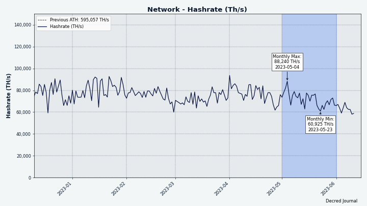
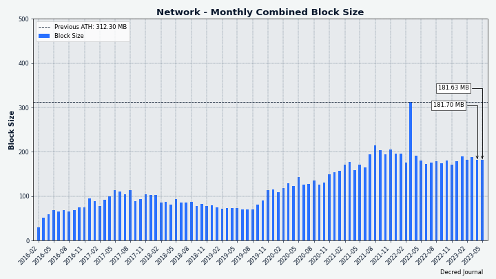
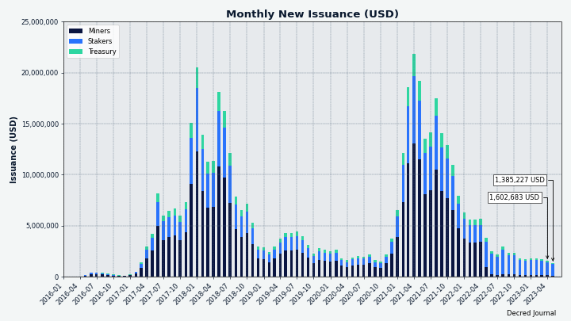
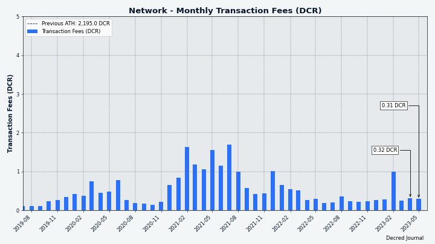
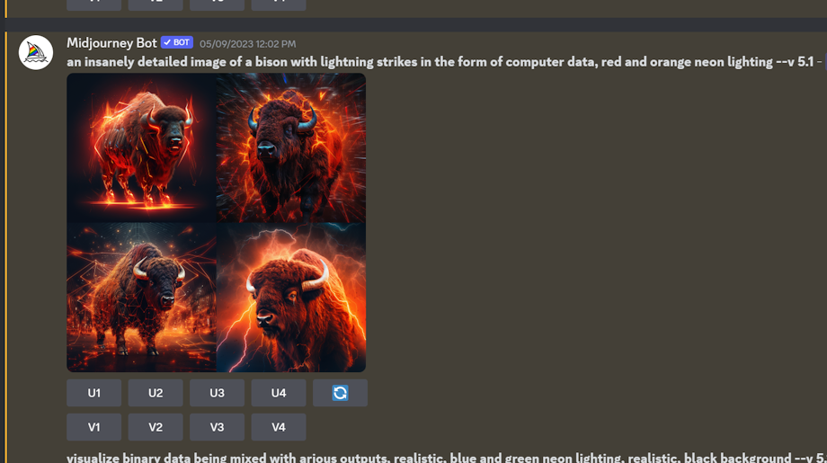
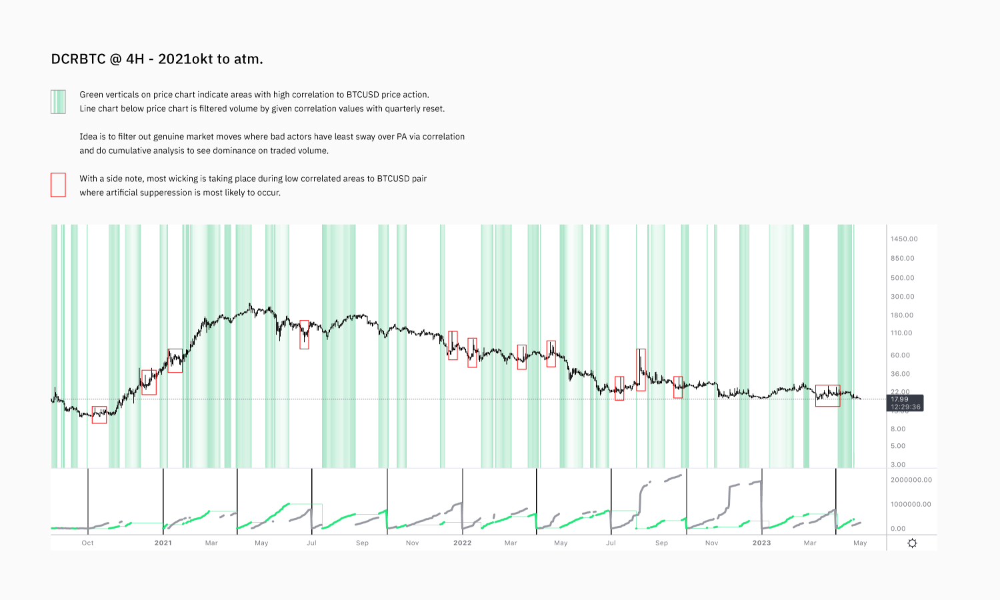

# Decred Journal – Maj 2023

_Obraz: Cyberburza, aut. @Exitus_

Najważniejsze wydarzenia z maja:

- Wydano DCRDEX v0.6.1; od teraz giełda obsługuje DigiByte i zawiera ważne poprawki dla LTC i ZEC.

- Propozycja Decred Vanguard została zatwierdzona, a program już rozpoczął działanie.

- Bison Relay robi postępy, a pierwsza wersja stron została scalona, podobnie jak narzędzia handlowe dla sklepów.

Spis treści:

- [Wydanie DCRDEX v0.6.1](#dcrdex-v061-release)
- [Rozwój](#development)
- [Ludzie](#people)
- [Zarządzanie](#governance)
- [Sieć](#network)
- [Ekosystem](#ecosystem)
- [Nawiązywanie kontaktów](#outreach)
- [Eventy](#events)
- [Media](#media)
- [Rynki](#markets)
- [Ważne kwestie i wiadomości poboczne](#relevant-external)

## Wydanie DCRDEX v0.6.1

W to wydanie DEX wchodzi:

- Wstępna obsługa DigiByte (DGB) (wymaga równolegle działającego portfela pełnego węzła)
- Ważne poprawki dla Litecoin (LTC) i Zcash (ZEC)
- Od teraz kurs zlecenia w tabeli Twoich zleceń jest czytelniejszy
- Rozmiar świecy wykresu jest teraz zapamiętywany, a domyślny rozmiar został zmieniony na 1 godzinę.

Pobierz najnowszego klienta DEX jako [samodzielną aplikację](https://github.com/decred/dcrdex/releases), jako część [Decrediton](https://github.com/decred/decred-binaries/releases) lub zainstaluj go z niestandardowego [sklepu aplikacji Umbrel](https://github.com/decred/umbrel-app-store). Jak zawsze zalecamy [weryfikację plików](https://docs.decred.org/advanced/verifying-binaries) przed uruchomieniem.

## Rozwój

O ile nie zaznaczono inaczej, prace zgłaszane poniżej mają status „scalonych z repozytorium głównym (master)”. Oznacza to, że prace są ukończone, zrecenzowane i zintegrowane z kodem źródłowym, który zaawansowani użytkownicy mogą [kompilować i uruchamiać](https://medium.com/@artikozel/the-decred-node-back-to-the-source-part-one-27d4576e7e1c), ale ich efekty nie są jeszcze dostępne w wersji plików binarnych dla zwykłych użytkowników.

### dcrd

_[dcrd](https://github.com/decred/dcrd) jest pełną implementacją węzła, który obsługuje sieć peer-to-peer Decred na całym świecie._

Zmiany scalone na gałęzi `master` ku przyszłym wydaniom:

- Oczyszczono [kilka funkcji](https://github.com/decred/dcrd/pull/3114) poprzez [usunięcie stanów błędu](https://github.com/decred/dcrd/pull/3110), które już nie występują.
- W [sierpniu ubiegłego roku](202208.md#dcrd), w celu zwalczania ataków ASIC na sieć testową i zapewnienia, że procesory zawsze będą w stanie wydobywać nowe bloki sieci testowej, [sieć testowa została zaktualizowana](https://github.com/decred/dcrd/pull/2978) tak, aby trudność wydobywania sieci testowej była ograniczana przez maksymalną wartość. W tym miesiącu generator szablonów wydobywczych i miner CPU zostały zaktualizowane, aby [usunąć starą logikę sieci testowej](https://github.com/decred/dcrd/commit/c6e53c9ef0926f172a637a6552b744cbd6445537), która nie ma już zastosowania, ponieważ wszystkie nowe bloki sieci testowej wymuszają ograniczanie trudności.
- [Usunięto przestarzałą metodę wewnętrzną](https://github.com/decred/dcrd/pull/3113), która zawierała listę subskrybowanych klientów oczekujących na aktualizacje łańcucha bloków. Ponieważ metoda ta była wewnętrzna, nigdy nie musiała być udostępniana poza dcrd.
- [Odkryto błąd za pośrednictwem dcrdata](https://github.com/decred/dcrdata/issues/1963), w którym obliczenie całkowitej podaży monet zwrócone z serwera RPC dcrd nie obejmowało nowych `TreasuryBases` - części nagrody każdego bloku, która wpływa do nowego zdecentralizowanego Skarbca. Obliczenia całkowitej podaży monet [zostały teraz zaktualizowane](https://github.com/decred/dcrd/pull/3112), co obejmowało również aktualizację bazy danych. Należy zauważyć, że błąd ten był jedynie drobnym błędem w obliczeniach podaży monet RPC i nie wpłynął w żaden sposób na zasady konsensusu.

W toku:

- Implementacja głosowania konsensusowego, [DCP-11](https://github.com/decred/dcrd/pull/3115), nad funkcją haszującą dla PoW.

### dcrwallet

_[dcrwallet](https://github.com/decred/dcrwallet) to serwer portfela używany przez wiersz polecenia oraz aplikacje graficzne._

Zbackportowane zmiany gotowe do wydania v1.7.x:

- Respektowanie [konfiguracji proxy](https://github.com/decred/dcrwallet/commit/7fbdd7fba71525149bf7a98dc7f8033f34a1e108) dla połączeń SPV i seederów P2P. Ma to zapobiec wyciekowi szczegółów sieci wewnętrznej.

Zmiany scalone na gałęzi `master` ku przyszłym wydaniom:

- Używanie najnowszych wersji kilku [modułów dcrd](https://github.com/decred/dcrwallet/pull/2234) i kilku [zależności](https://github.com/decred/dcrwallet/pull/2236) stron trzecich.
- Zezwolono portfelowi na [podążanie za hard forkiem DCP-12](https://github.com/decred/dcrwallet/pull/2232), jeśli zostanie on zatwierdzony i aktywowany.
- Usunięto kilka [przestarzałych metod wewnętrznych](https://github.com/decred/dcrwallet/pull/2235), a mianowicie te, które stały się przestarzałe w wyniku zmian konsensusu [DCP-9](https://github.com/decred/dcps/blob/master/dcp-0009/dcp-0009.mediawiki) (Automatyczne cofnięcia biletów) i [DCP-10](https://github.com/decred/dcps/blob/master/dcp-0010/dcp-0010.mediawiki) (Zmiana podziału dotacji PoW/PoS na 10/80).

### Decrediton

_[Decrediton](https://github.com/decred/decrediton) to w pełni funkcjonalny desktopowy portfel ze zintegrowaną funkcją głosowania, mieszania StakeShuffle, Lightning Network, handlem na DEX i nie tylko. Działa z lub bez dostępu do pełnego łańcucha (tryb SPV)._

W toku:

- [Obsługa Ledger](https://github.com/decred/decrediton/issues/3865): dodanie [funkcji niskopoziomowych](https://github.com/decred/decrediton/pull/3869) i [widoków interfejsu użytkownika](https://github.com/decred/decrediton/pull/3874).
- Ponieważ staking nie jest obecnie możliwy z żadnymi portfelami sprzętowymi, widoki stakingu zostaną [usunięte](https://github.com/decred/decrediton/pull/3870), aby uniknąć nieporozumień.
- Dodano [ikonę Ledger](https://github.com/decred/pi-ui/pull/479) do biblioteki współdzielonej pi-ui.

Pozostałe:

- Decrediton został [dodany](https://github.com/microsoft/winget-pkgs/pull/106493) do repozytorium pakietów [winget](https://en.wikipedia.org/wiki/Windows_Package_Manager). Użytkownicy Windows mogą teraz [zainstalować](https://matrix.to/#/!zefvTnlxYHPKvJMThI:decred.org/$25tEa195uFjzuxC0J9ecm7X8NRGUAhcrUqNvuUKfHqM?via=decred.org&via=matrix.org&via=planetdecred.org) go za pomocą polecenia `winget install Decred.Decrediton`.

### vspd

_[vspd](https://github.com/decred/vspd) to oprogramowanie serwera dla pul udziałów (Voting Service Provider). VSP oddaje głos za swoich użytkowników 24/7 oraz nie wchodzi w posiadanie żadnych środków, a tym samym nie może ich ukraść._

- Skopiowano i dostosowano [automatyczną płatność opłat VSP](https://github.com/decred/vspd/pull/382) z dcrwallet do repozytorium vspd. Ten kod był prywatny w dcrwallet, ale w vspd może być używany przez inne oprogramowanie, które zostanie wykorzystane przez integrację [stakingu DCR](https://github.com/decred/dcrdex/pull/2290) na DCRDEX.

### Lightning Network

_[dcrlnd](https://github.com/decred/dcrlnd) to oprogramowanie węzła Lightning Network dla Decred. LN umożliwia przesyłanie natychmiastowych i niskokosztowych transakcji._

- Dodano obsługę [niestandardowego połączenia](https://github.com/decred/dcrlnd/pull/182) dla dcrwallet. Pozwala to kodowi LN skonfigurować dcrwallet do łączenia się z urządzeniami równorzędnymi SPV przy użyciu serwera proxy.

### cspp

_[cspp](https://github.com/decred/cspp) to serwer do koordynowania mieszania monet za pośrednictwem protokołu CoinShuffle++. Nie jest powierniczy, tzn. nie przejmuje kontroli nad środkami. CSPP to część StakeShuffle - systemu prywatności Decred_

- Zapobieganie [zduplikowanym wejściom](https://github.com/decred/cspp/pull/92) na wcześniejszym etapie procesu mieszania. Przed wprowadzeniem tej poprawki podwójne wydatki powodowały błąd podczas wysyłania transakcji mieszania, co mogło spowodować niepowodzenie sesji mieszania i uniknięcie przypisania winy.
- Ulepszono [rejestrowanie](https://github.com/decred/cspp/pull/93) sesji mieszania, aby zawsze przechwytywać identyfikator sesji, numer przebiegu i wartość nominału mieszanych wyników.
- Zapobieganie transakcjom CoinJoin przed [przekroczeniem limitów wielkości mempoola](https://github.com/decred/cspp/pull/94). Może to wykluczyć niektórych peerów z mieszania, jeśli tak się stanie, serwer spróbuje sparować je w następnej epoce mieszania. Dodano sprawdzenie, aby ponowić sesję, jeśli liczba peerów [spadnie poniżej minimum](https://github.com/decred/cspp/pull/95).

### DCRDEX

_[DCRDEX](https://github.com/decred/dcrdex) to niepowiernicza giełda, umożliwiająca handel bez konieczności zaufania, działająca dzięki technologii atomic swaps._

Zmiany zawarte w wydaniu v0.6.1:

- Ustawianie wystarczająco wysokiej [stawkę opłaty transakcyjnej Zcash](https://github.com/decred/dcrdex/pull/2336). DEX oblicza opłaty na podstawie wielkości transakcji, ale Zcash jest wyjątkiem, ponieważ obecnie stosuje standardową opłatę w wysokości 1000 zats lub 0,00001 ZEC za transakcję, niezależnie od jej wielkości. Zmieni się to po aktywacji [ZIP 317](https://zips.z.cash/zip-0317), co spowoduje wyższe opłaty. Aby zapewnić, że transakcje DEX są zawsze przekazywane do sieci i wydobywane, zmiana ta podnosi opłaty do około 0,0002-0,0003 ZEC. Zakodowana na stałe stawka opłat w wysokości 84 zats/bajt jest używana jako obejście dla Zcash, który nie ma łatwego sposobu na oszacowanie opłat.
- Dodano obsługę handlu [DigiByte](https://github.com/decred/dcrdex/pull/2323) z pełnymi portfelami węzłów.
- Dodano linki do [eksploratora bloków](https://github.com/decred/dcrdex/pull/2340) do transakcji ZEC.
- Dodano opcję czasu kompilacji dla [interwału](https://github.com/decred/dcrdex/pull/2339), w którym serwer DEX odpytywał o nowe bloki aktywów bitcoinopodobnych. Pozwala to na użycie wolniejszego odpytywania dla zdalnych węzłów, gdzie domyślny 1-sekundowy interwał byłby zbyt szybki.
- Naprawiono błąd rekonfiguracji odłączonego bitcoinopodobnego portfela w pewnych okolicznościach.
- Naprawiono bitcoinopodobne portfele, które zawsze wymagały ponownego uruchomienia i nie miały szansy na rekonfigurację w biegu.
- Naprawiono brak uruchamiania pełnego restartu w niektórych scenariuszach zmiany konfiguracji połączenia RPC.
- Naprawiono nieprawidłowy [identyfikator transakcji](https://github.com/decred/dcrdex/pull/2342) wyświetlany podczas wysyłania ZEC.
- Naprawiono kilka błędów związanych z [kaucjami](https://github.com/decred/dcrdex/pull/2343) dla ZEC i aktywów innych niż SegWit.
- Zaimportowano ~22 [poprawki i ulepszenia](https://github.com/decred/dcrdex/pull/2323) wprowadzone na gałęzi `master` przed majem.

Wszystkie poniższe zmiany zostały scalone z gałęzią `master` ku przyszłym wydaniom.

Klient:

- Dodano oczekiwany [czas zwrotu](https://github.com/decred/dcrdex/pull/2042) do karty matchy. Wcześniej przez wiele godzin wyświetlało się mylące `<Oczekujące>`.
- Zautomatyzowano więcej kroków [włączania/wyłączania](https://github.com/decred/dcrdex/pull/2324) portfela. Wyłączenie głównego portfela aktywów łańcucha spowoduje również wyłączenie wszystkich portfeli tokenów dla tego łańcucha. Włączenie portfela tokenów spowoduje również włączenie głównego portfela aktywów łańcucha.
- Zoptymalizowano [obsługę żądań](https://github.com/decred/dcrdex/pull/2350), minimalizując kosztowne wywołania w celu załadowania informacji o użytkowniku.
- Przywrócono [kolorowe rejestrowanie](https://github.com/decred/dcrdex/pull/2350) żądań HTTP do stdout.
- Wykorzystanie zewnętrznych [źródeł stawek opłat](https://github.com/decred/dcrdex/issues/2354) w trybie SPV. Przed tą zmianą możliwe było płacenie nieracjonalnie wysokich opłat podczas wysyłania z portfela SPV.
- Usunięto wymóg wprowadzenia [hasła podczas anulowania zamówienia](https://github.com/decred/dcrdex/pull/2374).

Bitcoin:

- Naprawione [błędy](https://github.com/decred/dcrdex/pull/2326): portfel simnet mógł próbować połączyć się z siecią główną, portfele typu Bitcoin zawsze wymagały ponownego uruchomienia, ponowna konfiguracja odłączonego portfela mogła się nie powieść w pewnych okolicznościach.

Ethereum:

- Uczyniono [zatwierdzenia tokenów](https://github.com/decred/dcrdex/pull/2349) oddzielnym krokiem ręcznym zamiast automatycznej części pierwszej wymiany. Aby handlować tokenami (takimi jak USDC), umowa swap musi zostać zatwierdzona do obsługi tokenów w imieniu użytkownika. Zrobienie z tego ręcznej czynności pozwala użytkownikom być świadomym tego, co się dzieje i nie być zaskoczonym wysoką opłatą za pierwszą wymianę. Zatwierdzenie można później cofnąć w ustawieniach portfela.

Firo:

- Dodano obsługę [pełnego portfela węzłowego](https://github.com/decred/dcrdex/pull/2270) dla [Firo](https://firo.org/) (wcześniej znanego jako Zcoin).
- Następnym krokiem będzie wsparcie dla [lekkich portfeli](https://github.com/decred/dcrdex/issues/2346) Firo opartych na Electrum.

Opakowanie aplikacji:

- Wprowadzono nowy plik wykonywalny `dexc-desktop`, który opakowuje aplikację internetową DEX w komponent WebView, aby wyglądała jak [aplikacja desktopowa](https://github.com/decred/dcrdex/pull/1957). Aplikacja będzie działać w tle, jeśli są aktywne zlecenia (ale może zostać zamknięta przy użyciu przełącznika `--kill` w wierszu poleceń).
- Dodano skrypt do budowania [pakietów Debian](https://github.com/decred/dcrdex/commit/ca5b1d8914b8d84bdfa4cbe28a6c97f5a20c18c4).

Zmiany deweloperskie i wewnętrzne:

- Zaktualizowano [zależności npm](https://github.com/decred/dcrdex/pull/2321).
- Przeniesiono logikę bota [animatora rynku](https://github.com/decred/dcrdex/pull/2320) z pakietu `Core` do [własnego pakietu](https://github.com/decred/dcrdex/tree/ca5b1d8914b8d84bdfa4cbe28a6c97f5a20c18c4/client/mm). Jest to konieczne, aby poprawić architekturę i dodać więcej strategii botów w przyszłości.
- Włączono linter [makezero](https://github.com/decred/dcrdex/pull/2344), aby wykrywać więcej błędów w alokacji pamięci.
- Zaktualizowano przepływ kompilacji i testów, aby dodać [Node.js](https://github.com/decred/dcrdex/pull/2341) v20 i usunąć v16. Node.js v16 osiągnie koniec życia we wrześniu 2023 roku.
- Zmieniono końcówkę łańcucha i goroutines śledzenia peer, aby [zamykały się](https://github.com/decred/dcrdex/pull/2369) w bardziej czysty sposób.

_Obraz: Kontrakt wymiany DEX wymaga jednorazowej zgody na wymianę Twoich tokenów._

_Obraz: Instalacja słoneczna zasilająca serwer Umbrel z działającym animatorem rynku i botem arbitrażowym DCRDEX. Aut. [@busyLightz](https://twitter.com/busyLightz/status/1654876069101436928)._

### dcrdata

_[dcrdata](https://github.com/decred/dcrdata) to eksplorator blockchaina Decred oraz danych off-chain, takich jak propozycje na platformie Politeia, rynków i ponadto._

- Naprawiono nieznacznie zniekształcone liczby na [wykresach sald adresów](https://github.com/decred/dcrdata/pull/1962) z powodu braku filtrowania łańcuchów pobocznych i nieprawidłowych wyjść.

### Bison Relay

_[Bison Relay](https://github.com/companyzero/bisonrelay) to nowa platforma mediów społecznościowych peer-to-peer z silną ochroną przeciw cenzurze, inwiligacji, oraz reklamom, działająca na bazie Lightning Network projektu Decred._

Opisane poniżej wysiłki zostały scalone z gałęzią `master` ku przyszłemu wydaniu (prawdopodobnie v0.1.8).

Aplikacje GUI i wiersza polecenia:

- Zaimplementowano wstępną wersję funkcji [stron](https://github.com/companyzero/bisonrelay/pull/224). Strony pozwalają przeglądać statyczną zawartość od zdalnego użytkownika. Obsługiwane są tylko strony [Markdown](https://www.markdownguide.org/). Strony mogą łączyć się ze stronami innych użytkowników za pomocą linków `br://`. Ograniczenia pierwszej iteracji są wymienione w tym [pull requeście](https://github.com/companyzero/bisonrelay/pull/224). Strony to duża funkcja, która będzie wymagała wielu ulepszeń w odpowiedzi na opinie użytkowników.
- Ulepszona strategia [ponownej próby napiwkowania](https://github.com/companyzero/bisonrelay/pull/236). Zamiast podejmować wiele równoległych prób zapłaty napiwków dla jednego użytkownika, tylko jedna próba jest podejmowana na raz. Powinno to pomóc uniknąć problemów z nieudanymi próbami płatności napiwków z powodu węzłów LN o niskiej przepustowości. Również nieudane próby wypłaty napiwków z powodu braku trasy LN będą ponawiane (ten błąd może być tymczasowy). Aplikacja CLI może wyświetlić listę bieżących prób napiwków użytkownika za pomocą nowej komendy `/runningtips`.
- Dodano możliwość połączenia wbudowanego dcrlnd przez skonfigurowany serwer proxy (taki jak Tor) zarówno do [aplikacji CLI](https://github.com/companyzero/bisonrelay/pull/235), jak i [aplikacji GUI](https://github.com/companyzero/bisonrelay/pull/239). Nowy parametr konfiguracyjny `circuitlimit` pozwala ograniczyć liczbę [otwartych połączeń](https://github.com/companyzero/bisonrelay/pull/234) podczas korzystania z proxy.
- Dodano [funkcję handshake](https://github.com/companyzero/bisonrelay/pull/246), która pozwala użytkownikom sprawdzić, czy ich zapadki szyfrowania nadal działają.
- Zaimplementowano [trwałą historię czatów](https://github.com/companyzero/bisonrelay/pull/230), która zapamiętuje ostatnie 500 wiadomości i pokazuje je po ponownym uruchomieniu aplikacji. Wszystkie czaty są przechowywane w plikach dziennika, ale dostęp do historii z samej aplikacji jest lepszy pod względem UX i był częstym żądaniem funkcji. Plan jest taki, aby ostatecznie dodać ładowanie historii na żądanie, gdy użytkownik przewija wstecz w czasie.
- Naprawiono możliwe [uszkodzone zapadki](https://github.com/companyzero/bisonrelay/pull/248), gdy dwóch użytkowników jednocześnie próbuje wymienić klucze między sobą. Może się to zdarzyć, gdy dwóch użytkowników zostanie dodanych do dwóch różnych czatów grupowych, w których drugi użytkownik już istnieje, co inicjuje dwie wymiany kluczy w tym samym czasie.

Aplikacja GUI:

- Dodano [menu kontekstowe](https://github.com/companyzero/bisonrelay/issues/216) do czatów indywidualnych i grupowych.
- Dodano pływający przycisk [przejścia do ostatnich wiadomości](https://github.com/companyzero/bisonrelay/pull/231).
- Ograniczono rozmiar [osadzonych obrazów](https://github.com/companyzero/bisonrelay/pull/244) wyświetlanych w czatach i postach. Po kliknięciu wyświetlany jest większy obraz. Naprawia to problemy z przewijaniem i różnymi rozmiarami obrazów.
- Naprawiono niektóre problemy z [zaznaczaniem tekstu](https://github.com/companyzero/bisonrelay/pull/226), dodano limit wysokości do bloków kodu i umożliwiono przewijanie bloków kodu. Dwa widżety Fluttera zostały sforkowane i załatane, aby obejść problemy, ale podwójne kliknięcie (zaznaczenie słowa) i potrójne kliknięcie (zaznaczenie akapitu) nadal nie działają.
- Naprawiono [problemy z paskiem przewijania](https://github.com/companyzero/bisonrelay/pull/249) w widokach zarządzania LN.
- Mniejsze poprawki dotyczące przewijania i przepełnienia.

Aplikacja wiersza polecenia:

- Umożliwiono brclientowi delegowanie żądań stron i sklepów do [innego programu](https://github.com/companyzero/bisonrelay/pull/224) poprzez [API clientrpc](https://github.com/companyzero/bisonrelay/tree/master/clientrpc) i przekazywanie odpowiedzi z powrotem do żądających użytkowników BR. Ta elastyczność umożliwi przydatne funkcje w przyszłości.
- Umożliwiono brclientowi delegowanie żądań do [strony internetowej](https://github.com/companyzero/bisonrelay/pull/224) HTTP lub HTTPS. Pozwala to użytkownikom BR na dostęp do zasobów HTTP/HTTPS poprzez innego użytkownika BR, który działa jako proxy.
- Sortowanie postów według [ostatniej aktywności](https://github.com/companyzero/bisonrelay/pull/243). Ponadto, nieprzeczytane posty będą podświetlone innym kolorem.
- Zezwolenie na używanie komendy `/closechannel` z [krótkim prefiksem](https://github.com/companyzero/bisonrelay/pull/252) ID kanału (pełne ID ma 64 znaki).

Postęp w funkcji sklepów:

- Zaimplementowano fundamenty po stronie sprzedawcy dla [prostych sklepów](https://github.com/companyzero/bisonrelay/pull/224). W przeciwieństwie do stron, sklepy są dynamicznymi zasobami, które mogą prezentować produkty na sprzedaż. Sklep ma stronę główną i indywidualne strony produktów, które są generowane z plików lokalnych. Sklep jest ładowany automatycznie, gdy zmieniają się jego pliki. Klient BR uruchamiający sklep może obsługiwać strony produktów, utrzymywać koszyki zakupów, obsługiwać składanie zamówień i tworzyć faktury. Ceny będą wyświetlane w USD, ale płatne w DCR. Kurs wymiany jest pobierany z [dcrdata](https://explorer.dcrdata.org). Kwota DCR do zapłaty jest zablokowana na 60 minut, dopóki zamówienie jest ważne. Aplikacja CLI obsługuje tylko płatności on-chain.
- Wdrożono [proste formularze](https://github.com/companyzero/bisonrelay/pull/241). Formularze mogą być przeglądane, wypełniane i przesyłane przez klientów sklepu w celu dodania produktów do koszyka lub złożenia zamówienia.
- Dodano [szczegóły wysyłki](https://github.com/companyzero/bisonrelay/pull/250) do zamówień. Niektóre produkty mogą wymagać podania informacji o wysyłce.

Pozostałe:

- Dodano kompleksowe [testy wydajności](https://github.com/companyzero/bisonrelay/pull/245).
- @JC zorganizował wydarzenie onboardingowe na kanale #trading z [rozdaniem](https://matrix.to/#/!lDZCzVQjFoJsXMPkvr:decred.org/$FjC6ZsHaR4GBvlR9-o4E4anuqWwoq1F167CU0QPJmS4) 20 przedpłaconych zaproszeń na sumę 0,05 DCR każde.

## Ludzie

Statystyki społeczności na dzień 2. czerwca (w porównaniu z 3. maja):

- Obserwujący na [Twitterze](https://twitter.com/decredproject): 53 108 (+31)
- Subskrybenci na [Reddit](https://www.reddit.com/r/decred/): 12 723 (+22)
- Użytkownicy na [Matrixie](https://chat.decred.org/) w pokoju #general: 774 (+11)
- Użytkownicy na [Discordzie](https://discord.gg/GJ2GXfz):  1590 (+17), zweryfikowani z możliwością pisania: 634 (-287) - most z Discordem został zerwany, a na platformie obowiązują surowsze zasady weryfikacji
- Użytkownicy na [Telegramie](https://t.me/Decred): 2470 (-38)
- Subskrybenci na [YouTube](https://www.youtube.com/decredchannel): 4640 (+10), wyświetleń: 229,6K (+1,5K)

## Zarządzanie

W maju nowy [Skarbiec](https://dcrdata.decred.org/treasury) otrzymał 8088 DCR o wartości 139 tys. USD po średnim majowym kursie wymiany $17,13. 3591 DCR zostało wydane, aby zapłacić kontrahentom, co stanowiło wartość $62K po kursie wymiany z tego miesiąca.

Transakcja [wypłaty ze Skarbca](https://explorer.dcrdata.org/tx/5efdb2de7cbea2682d389aa274a1ef79c5996201226054b28e08e286b1809519) została wydobyta 20. maja stosunkiem 6722 głosów na "tak" i 52% udziale w głosowaniu i zawierała 23 wyjścia dokonujące płatności kontrahentom w przedziale od 4 DCR do 1464 DCR. Większość z tej sumy to zapłata za pracę z marca po kursie wymiany $20,69 a cała transakcja TSpend opiewa na równowartość $74K.

Na dzień 17. czerwca, łączne saldo [starego](https://dcrdata.decred.org/address/Dcur2mcGjmENx4DhNqDctW5wJCVyT3Qeqkx) i [nowego Skarbca](https://dcrdata.decred.org/treasury) wynosi 858 136 DCR (12,1 miliona USD po kursie $14,08).

Propozycje zatwierdzone w maju:

- Propozycja [Decred Vanguard](https://proposals.decred.org/record/0a1b782) została zatwierdzona z budżetem w wysokości 46 784 USD na sfinansowanie rozwoju programu informacyjnego kierowanego przez społeczność, przy 94% głosów na tak i frekwencji 39%.

- Propozycja [BTC-ECHO](https://proposals.decred.org/record/49e373b) z niemiecką stroną o tematyce kryptowalutowej [BTC-ECHO.de](https://www.btc-echo.de/) została zatwierdzona z budżetem w wysokości 9 500 USD z 69% głosów na tak i frekwencją 32% na trzymiesięczny okres próbny, podczas którego przygotują dwa artykuły sponsorowane. Przed głosowaniem edytowano ją, aby uwzględnić dodatkową promocję w ich mediach społecznościowych i 2-tygodniową reklamę w ich podcastach. Druga edycja wyjaśniła, że nie wymagają płatności z góry i zgadzają się czekać na płatność do 60 dni po zakończeniu kampanii, zgodnie z tym, jak działa większość istniejących propozycji i wykonawców. Po zatwierdzeniu propozycji opublikowali [aktualizację](https://proposals.decred.org/record/49e373b/comments/24) dotyczącą kolejnych kroków i harmonogramu wywiązania się z obietnic.

Propozycje złożone w maju:

- Propozycja [początków infrastruktury siatkowej i ewolucji kaucji dla DCRDEX](https://proposals.decred.org/record/4d2324b) wnioskowała o 164 tys. dolarów na opracowanie eksperymentalnej wersji DCRDEX opartej na architekturze siatki serwerów.

Zapraszamy do lektury [wydania nr 60](https://blockcommons.red/politeia-digest/issue060/) Politeia Digest po więcej informacji na temat zgłoszonych w tym miesiącu propozycji.

## Sieć

**Hashrate**: majowy [hashrate](https://dcrdata.decred.org/charts?chart=hashrate&scale=linear&bin=day&axis=time) na początku miesiąca wyniósł ~74 Ph/s a zamknął go na poziomie ~66 Ph/s, zaliczając niż w ok. 61 Ph/s oraz szczyt w wys. 88 Ph/s w ciągu miesiąca.

_Obraz: Moc obliczeniowa projektu Decred_

Dystrybucja mocy obliczeniowej w wys. 67 Ph/s [zadeklarowana](https://miningpoolstats.stream/decred) przez pule wydobywcze na dzień 1. czerwca: Poolin 40%, F2Pool 40%, AntPool 16%, BTC.com 5%.

Podział 1000 bloków [wydobytych](https://miningpoolstats.stream/decred) przed 1. czerwca: F2Pool 40%, Poolin 35%, AntPool 17%, BTC.com 8%.

_Obraz: Historyczny wykres dystrybucji mocy obliczeniowej pul wydobywczych_

**Staking**: [Cena biletów](https://dcrdata.decred.org/charts?chart=ticket-price&axis=time&visibility=true-true&mode=stepped) wahała się między 173 a 334 DCR.

_Obraz: Cena biletów ponownie uległa wahaniu_

[Zablokowana suma](https://dcrdata.decred.org/charts?chart=ticket-pool-value&scale=linear&bin=day&axis=time) to pomiędzy 9,38 a 9,90 miliona DCR, co oznacza, że 61,7-65,1% podaży dostępnej w obiegu [wzięło udział](https://dcrdata.decred.org/charts?chart=stake-participation&scale=linear&bin=day&axis=time) w elemencie Proof of Stake.

**VSP**: Na 1. maja, ~6650 (-310) biletów w puli zarządzanych było przez [14 oficjalnych VSP](https://decred.org/vsp/), co stanowi 16,8% całej puli biletowej (-0,3%).

_Obraz: Dystrybucja biletów zarządzanych przez VSP_

**Węzły**: [Decred Mapper](https://nodes.jholdstock.uk/user_agents) odnotował 147 węzłów dcrd w ciągu miesiąca. Wersje 147 węzłów odnotowanych 1. czerwca to: v1.7.7 - 25%, v1.7.1 - 21%, v1.7.5 - 18%, v1.7.2 - 10%, dev buildy v1.8.0  - 9%, v1.7.0 - 7%, v1.7.4 - 3%, pozostałe - 8%.

_Obraz: Historyczna dystrybucja wersji węzłów dcrd, dane z nodes.jholdstock.uk. Uwaga: Dane do stycznia 2023 były niekompletne._

Ilość [monet mieszanych](https://dcrdata.decred.org/charts?chart=coin-supply&zoom=jz3q237o-la8vk000&scale=linear&bin=day&axis=time&visibility=true-true-true) wahała się w granicach 61,8-61,9%.
Dzienna [kwota mieszana](https://dcrdata.decred.org/charts?chart=privacy-participation&bin=day&axis=time) oscylowała w granicach 143-497K DCR.

_Obraz: Miesięczny wolumen StakeShuffle w USD_

Eksplorator [Lightning Network](https://ln-map.jholdstock.uk/) sieci Decred na 1. czerwca odnotował 211 węzłów (+15) oraz 423 kanały (+45) o całkowitej pojemności 176 DCR (+13). Statystyki te zależą od węzła LN. Na przykład, tego samego dnia węzeł @karamble odnotował 210 węzłów (+17) oraz 446 kanałów (+17) o pojemności 182 DCR (+9).

_Obraz: Pojemność sieci lightning Network projektu Decred_

A teraz pare wykresów dzięki uprzejmości @bochinchero:

_Obraz: Przeciętny czas wydobycia bloku nadal wynosi stabilne 5 minut_

_Obraz: Łańcuch Decred powiększa się o ~180 MB każdego miesiąca_

_Obraz: Pełny łańcuch projektu Decred bez problemu zmieści się w pamięci wewnętrznej nowoczesnego smartfona_

_Obraz: Miesięczna podaż DCR w USD - większość nagrody przeniosła się od górników do interesariuszy, a wkrótce przeniesie się jeszcze bardziej_

_Obraz: Całkowite opłaty w ujęciu miesięcznym - korzystanie z łańcucha Decred jest wciąż bardzo tanie_

Wykresów jest więcej, niż jesteśmy w stanie wyświetlić nawet w Decred Journal. Te i inne wykresy znajdziecie [tutaj](https://github.com/bochinchero/dcrsnapshots) - zachęcamy do powielania ich w mediach społecznościowych!

## Ekosystem

Nowe usługi:

- Pary ZEC/BTC i ZEC/USDC zostały [uruchomione](https://twitter.com/exitusdcr/status/1654626949837500416) na [dex.decred.org](https://dex.decred.org/).

- Rynek DGB/BTC [został uruchomiony](https://twitter.com/DecredSociety/status/1657750204852871173). Wymagany jest klient DEX w wersji 0.6.1 lub wyższej, którego można pobrać jako [samodzielną aplikację](https://github.com/decred/dcrdex/releases) lub z razem [Decrediton](https://github.com/decred/decred-binaries/releases) v1.8.0. Początkowo obsługiwany jest tylko pełny portfel DGB oparty na węzłach, ale może pojawić się wbudowany lekki portfel po wydaniu DigiByte v8.22.

- Dzienniki czatu Matrix można teraz przeglądać na [archive.matrix.org](https://archive.matrix.org/) - nowa przeglądarka archiwum czatu zastępująca [view.matrix.org](https://view.matrix.org/). Usługa działa bez JavaScript i nie wymaga konta Matrix.

Usługi utracone:

- Binance [opuszcza Kanadę](https://www.forbes.com/sites/digital-assets/2023/05/16/binance-exits-canada-over-concerns-of-strict-regulation/) w [odpowiedzi](https://twitter.com/binance/status/1657099651210969088) na ostatnie regulacje kryptowalutowe, które zabraniają zarejestrowanym giełdom przyjmowania depozytów w stablecoinach lub sprzedawania ich klientom bez zgody CSA. Inne ograniczenia obejmują zakaz handlu z depozytem zabezpieczającym i limity inwestorów. Według rozmowy na kanale [#trading](https://matrix.to/#/!lDZCzVQjFoJsXMPkvr:decred.org/$Ox6W2V_jS33D6X5kOvuX6OU-TPW-8xStJL0QdLzpD8E) klienci zostali poproszeni e-mailem o zamknięcie wszelkich otwartych pozycji do 30 września 2023 roku.

- Binance planuje [wycofać 12 monet prywatności](https://cointelegraph.com/news/binance-to-delist-privacy-tokens-in-france-italy-spain-and-poland) we Francji, Włoszech, Polsce i Hiszpanii. Począwszy od 26 czerwca, mieszkańcy tych krajów nie będą już mogli handlować DCR. Binance niedawno uzyskało odpowiednie [licencje](https://beincrypto.com/binance-privacy-coins-prohibition/) w dotkniętych jurysdykcjach. Posunięcie to nastąpiło wkrótce po tym, jak 16 maja w UE [uchwalono](https://cryptoslate.com/binance-delists-privacy-coins-for-european-users-amid-layoff-rumors/) Markets in Crypto Assets (MiCA).

- Hotbit [ogłosił](https://twitter.com/Hotbit_news/status/1660496999458963458), że zamyka działalność i prosi o wycofanie wszystkich aktywów do 30 czerwca. Handel DCR był dostępny na głównej stronie hotbit.io od [października 2019 r.](https://twitter.com/Hotbit_news/status/1186979514741428224) oraz w jej koreańskim oddziale od [listopada 2020 r.](https://twitter.com/Hotbit_Korea/status/1331412789416534017). Według niektórych członków społeczności DCR został wycofany jakiś czas temu i zamknięcie nie powinno mieć wpływu na użytkowników DCR. Powody wycofania giełdy obejmowały: straty z [dochodzenia](https://help.hotbit.io/hc/en-us/articles/8074249353495) kryminalnego , odpływ środków z CEX-ów, niezrównoważony model biznesowy polegający na próbie umieszczenia na liście zbyt wielu monet, z których wiele zostało zhakowanych, oraz trudności w przestrzeganiu przepisów. Cytując pożegnalne [ogłoszenie](https://help.hotbit.io/hc/en-us/articles/14750194236823-It-s-time-to-take-a-bow): "albo przyjmujemy regulacje, albo musimy stać się bardziej zdecentralizowani". Pracujemy nad tym!

Pozostałe wiadomości:

- Najwyraźniej Huobi nie wycofał DCR z giełdy, jak planował we wrześniu 2022 roku. Strona z ogłoszeniem została usunięta, ale dostępna jest [zarchiwizowana kopia](https://web.archive.org/web/20221002130913/https://www.huobi.com/support/en-us/detail/104917015223952). Pary handlowe USDT dla DCR i 6 innych monet prywatności z tej listy są nadal aktywne i zgłaszają dobrze wyglądające wolumeny na CoinGecko i CoinMarketCap od 12 maja. Obserwatorzy z czatu #trading powiedzieli, że DCR nigdy nie przestał przepływać tam i z powrotem między Huobi i Binance.

- Bittrex złożył wniosek o [upadłość](https://fortune.com/2023/05/08/bittrex-bankruptcy-us-filing-crypto-platform/) w USA i na Malcie, 3 tygodnie po tym, jak został oskarżony przez SEC o prowadzenie niezarejestrowanej giełdy papierów wartościowych. Oba ramiona firmy przetwarzały [wypłaty](https://www.coindesk.com/policy/2023/05/10/bittrexs-us-maltese-arms-processed-425m-in-withdrawals-since-april-1-attorney-says/) od kwietnia.

- Ledger [ogłosił](https://twitter.com/Ledger/status/1658458714771169282) nadchodzącą usługę [Ledger Recover](https://www.ledger.com/recover). Recover pozwala na zarejestrowanie swojego ID (CA, EU, UK, US) i utworzenie kopii zapasowej ziarna portfela u zaufanych stron trzecich. Ziarno jest dzielone na 3 fragmenty, fragmenty są szyfrowane kluczem symetrycznym i wysyłane do 3 różnych dostawców kopii zapasowych. Można go później odbudować na innym urządzeniu Ledger, weryfikując ID i uzyskując 2 z 3 fragmentów od dostawców. Obecnie obsługiwany jest tylko Ledger Nano X. Użytkownicy DCR mogą chcieć ocenić [ryzyko](https://support.ledger.com/hc/en-us/articles/9579368109597-Ledger-Recover-FAQs) korzystania z Ledger w świetle tej nowej funkcji, która została dodana w [wersji oprogramowania układowego 2.2.1](https://twitter.com/alistairmilne/status/1658381708763209729) i *powinna* być nieaktywna, dopóki nie zostanie wyraźnie włączona. Bardziej szczegółowy opis dostępny jest na kanale [#ecosystem](https://chat.decred.org/#/room/#ecosystem:decred.org/$LSE8W9g9a4hqu9HN4IIyqWSf6H-LwSjd-xgK8Xie7GQ).

Nowe usługi jeszcze nieprzetestowane przez społeczność:

- [Opcja płatności DCR](https://fxdreema.com/purchase) została [zauważona](https://twitter.com/h3la1/status/1653233413200158721) na [fxDreema](https://fxdreema.com/) - graficznym konstruktorze botów handlowych kompatybilnych z platformami MetaTrader 4 i MetaTrader 5.

- [CryptoWallet.com](https://cryptowallet.com/) oferuje aplikację mobilną, która pozwala użytkownikom kupować i sprzedawać kryptowaluty, obsługuje przelewy VISA/MasterCard/SEPA i planuje uruchomić własny produkt kartowy. Firma posiada licencję w Estonii. Pomoc w badaniach i testach jest bardzo mile widziana.

Dołączcie do naszego kanału [#ecosystem](https://chat.decred.org/#/room/#ecosystem:decred.org), aby śledzić wszelkie nowości związane z ekosystemem Decred.

Uwaga: autorzy Decred Journal nie są w stanie ocenić wiarygodności żadnego z powyższych podmiotów czy ich usług. Uprasza się o dołożenie należnych starań i własnoręczną weryfikację informacji przed powierzeniem jakichkolwiek środków innym stronom.

## Nawiązywanie kontaktów

Decred Vanguard został [zatwierdzony](https://proposals.decred.org/record/0a1b782) i rozpoczął swoją działalność. Vanguard posiada własny serwer Discord, na którym członkowie koordynują działania, opracowują najlepsze podejścia i oceniają wyniki. Członkowie korzystają ze sztucznej inteligencji Midjourney do generowania zaawansowanych dzieł sztuki, które pomagają przekazać przesłanie Decred. Kilku członków nabyło Twitter Blue i wydaje się, że działa całkiem dobrze. Kluczowym wyzwaniem w tym momencie jest rekrutacja członków, którzy są aktywni i produktywni, dlatego też początkowe miesięczne stypendium zostało ustalone na niskim poziomie 100 USD. Kolejnym wyzwaniem jest marketing podczas ryku niedźwiedzia. W maju nie przyznano żadnych nagród za duże / znaczące zaangażowanie.

Każdy zainteresowany dołączeniem do Decred Vanguard powinien skontaktować się z [@Tivra](https://twitter.com/WasPraxis) lub [@Exitus](https://twitter.com/exitusdcr). Jeśli jesteś nowy w Decred, to w porządku - musisz tylko chcieć się uczyć i pomagać tam, gdzie możesz.

> Vanguard to na prawdę coś, czego potrzebujey od lat. \[@Exitus\]

_Obraz: Pokój wojenny inicjatywy Vanguard_

Osiągnięcia Monde PR:

- Zaproponowano 1 możliwość umieszczenia komentarza
- Zaproponowano 7 możliwości występu w mediach
- Zdobyto 1 wywiad w mediach

Umieszczono w mediach poniższe artykuły:

- @jy-p udzielił wywiadu dla [Authority Magazine](https://medium.com/authority-magazine/the-future-is-now-jake-yocom-piatt-on-how-their-technological-innovation-will-shake-u-3966dc1adc22), w którym omówiono wiele aspektów Decred, w tym: historię powstania Decred, ofertę Bison Relay jako suwerennego internetu, nadchodzące wsparcie dla stron i sklepów e-commerce, Politeię oraz wykorzystanie Decred w wyborach w Brazylii.

## Eventy

**Na których byliśmy:**

- @arij i @khalidesi wzięli udział w [EMEC EXPO](https://emecexpo.ma) w Casablance w Maroku, dużym wydarzeniu poświęconym technologiom cyfrowym dla 9 tys. osób. Zespół miał stoisko, na którym wyjaśniał funkcje Decred odwiedzającym z różnych dziedzin, wszedł w interakcje z kilkoma marokańskimi firmami i spotkał kilka osób, które były już zaznajomione z projektem. Pełny raport dostępny jest [tutaj](https://decredcommunity.github.io/events/index/20230511.1).

## Media

**Wybrane artykuły:**

- [Decred DEX uruchamia DCRDEX 0.6, oferując nowy poziom prywatności i bezpieczeństwa dla swapów międzyłańcuchowych](https://decred.org/news/2023-04-18_decred_releases_dcrdex_0.6/) - kwietniowy komunikat prasowy jest już dostępny na decred.org
- [Przyszłość jest teraz: Jake Yocom-Piatt z decred.org o tym, jak ich innowacje technologiczne wstrząsną sceną technologiczną](https://medium.com/authority-magazine/the-future-is-now-jake-yocom-piatt-on-how-their-technological-innovation-will-shake-u-3966dc1adc22), aut. Authority Magazine z udz. @jy-p
- [Decred vs Horizen: krypto to za mało!](https://www.decredmagazine.com/decred-vs-horizen-crypto-is-not-enough/), aut. @Joao
- [Nie chcę twoich polubień](https://www.decredmagazine.com/i-dont-want-your-likes/), aut. @phoenixgreen

Statystyki aktywności Decred Magazine za maj:

- Całkowita liczba artykułów na DM: 460
- Subskrybentów newslettera: 100
- Opublikowane nowe posty i newslettery: 16
- Aktywne kampanie w mediach społecznościowych: 57
- Zakończone kampanie w mediach społecznościowych: 41
- Posty w mediach społecznościowych: 172
- Polubienia: 1180
- Retweety: 302
- Liczba obserwujących na wszystkich kontach i platformach mediów społecznościowych (w tym [@DecredSociety](https://twitter.com/DecredSociety)): 1350

**Wideo:**

- [Dokonanie atomic swapu Litecoin - DCRDEX 0.6](https://www.youtube.com/watch?v=ajHovJHxtFw), aut. @phoenixgreen
- [Decred Recap - ulepszenia v1.7.7, atomic-swap DEX v0.6 - DAO ewoluuje!](https://www.youtube.com/watch?v=OgupSweE94s), aut. @Exitus - również jako [podcast](https://podcasters.spotify.com/pod/show/decred-magazine/episodes/Decred-Recap---v1-7-7-Improvements--Atomic-Swap-DEX-v0-6---The-DAO-Evolves-e23hp9k)
- [Aktualizacja Bison Relay do wersji 0.1.7](https://www.youtube.com/watch?v=wg0k8p3arxI), aut. @phoenixgreen - również jako [post tekstowy](https://www.decredmagazine.com/bison-relay-upgrades-to-version-0-1-7/)
- [Głosowanie nad propozycją w Decrediton](https://www.youtube.com/watch?v=q18OVd9z-n0), aut. @phoenixgreen - również jako [post tekstowy](https://www.decredmagazine.com/decrediton-proposal-voting/)
- [Przedpłacone zaproszenia Bison Relay](https://www.youtube.com/watch?v=n4_fkpyppws), aut. @phoenixgreen - również jako [post tekstowy](https://www.decredmagazine.com/bison-relay-pre-paid-invitations/)
- TikTok [Decred rozwija sieć mesh dla DEX](https://www.tiktok.com/@decred_crypto/video/7239431067764002074), aut. @DajanaDcr i @Exitus

Livestreamy:

- [Stan Rynku - Decred Vanguard - Nowa inicjatywa nawiązywania kontaktów](https://www.youtube.com/watch?v=UDTQFOcva5Q), aut. @phoenixgreen i @Exitus z udz. @Tivra oraz @h3la1 - również jako [podcast](https://podcasters.spotify.com/pod/show/decred-magazine/episodes/State-of-the-market---Decred-Vanguard---A-New-Outreach-Effort-e23midd)

**Audio:**

- Twitter Space [dyskusja społeczności Decred x Zcash](https://twitter.com/i/spaces/1vOxwMZYqYWGB) z udz. @Tivra oraz [ZecHub](https://twitter.com/ZecHub) - również na [YouTube](https://www.youtube.com/watch?v=2RStHBiWNDk)
- [Twitter Space](https://twitter.com/i/spaces/1jMJgLwmPLMxL) z udz. @Tivra oraz [W0wn3r0](https://twitter.com/W0wn3r0)

**Coś dla oka i serca:**

- Inskrypcje [Bison Ordinals](https://twitter.com/c12hz/status/1656636523448606720), aut. @c12hz
- [Wznieś się na wyżyny](https://www.decredmagazine.com/ascend-to-greatness/), aut. @OfficialCryptos
- [Katana Decred](https://www.decredmagazine.com/decred-katana/), aut. @OfficialCryptos
- [Decred Magazine](https://twitter.com/aithzakaria1/status/1653718235588468737) ilustracja aut. @aithzakaria1

_Obraz: Decred pozbywa się balastu. Aut. @OfficialCryptos._

**Tłumaczenia:**

- [Prywatność w Internecie i dlaczego jest ważna](https://www.decredmagazine.com/internet-privacy-and-why-it-is-important/) - [w jęz. chińskim](https://github.com/DominicTing/decred-ZH-translations/blob/master/Internet%20Privacy%20and%20Why%20it%20is%20Important.md) by @Dominic
- Kwietniowe wydanie Decred Journal zostało [przetłumaczone](https://xaur.github.io/decred-news/) na jęz. chiński dzięki @Dominic - dziękujemy!

## Rynki

W maju kurs wymiany DCR mieścił się w przedziale USDT 15,19-20,59 / BTC 0,00056-0,00075. Średni dzienny kurs wynosił $17,13.

Analiza cenowa społeczności DCR opublikowana na kanale #trading:

_Obraz: Nietypowe cienie świec na rynku DCR/USD wydają się pojawiać, gdy korelacja między ceną BTC/USD jest niska. Analiza aut. @saender._

_Obraz: Wartość rynku (USD) oparta na metryce Zrealizowanej Wartości Stakingu dla Decred od @bochinchero_

_Obraz: Analiza stref akumulacyjnych na rynku DCR/USD aut. @saender_

_Obraz: Miesięczny wolumen DCRDEX, w USD._

## Ważne kwestie i wiadomości poboczne

Łańcuch Beacon Ethereum [doświadcza](https://www.theblock.co/post/230680/ethereum-beacon-chain-finality-issue) pewnych problemów z finalizacją, dwóch epizodów, w których walidatorzy w większości przestali proponować poświadczenia przez około godzinę i nikt nie jest pewien dlaczego. Transakcje w sieci Ethereum mogły być kontynuowane, więc użytkownicy mogli nie zauważyć żadnych problemów, ale za kulisami łańcuch beacon, który finalizuje wszystko, nie działał, więc transakcje te były bardziej podatne na odwrócenie niż zwykle. Główni twórcy Ethereum [wydali](https://cointelegraph.com/news/ethereum-s-beacon-chain-is-updated-after-finality-issues) łatki dla dwóch klientów dotkniętych problemem (opartego na Go [Prysm](https://github.com/prysmaticlabs/prysm) z Prysmatic Labs i opartego na Javie [Teku](https://github.com/ConsenSys/teku) z ConsenSys), co było spowodowane wyjątkowo dużym obciążeniem węzłów obsługujących tych klientów.

Sieć i łańcuch Dash utknęły w martwym punkcie 22 maja na 16 godzin z powodu [usterki](https://www.dash.org/blog/dash-network-update/) spowodowanej aktualizacją kryptografii progowej BLS do standardu branżowego w wersji v19. Główny zespół opracował szybką poprawkę (v19.1), aby wstrzymać wdrażanie v19, co pozwoliło na wznowienie działania sieci po 16 godzinach przestoju. Poprawka tego błędu i kolejna próba wdrożenia zmian zostaną uwzględnione w wersji v19.2.

Halborn [udokumentował](https://www.halborn.com/blog/post/halborn-discovers-zero-day-impacting-dogecoin-and-280-networks) kilka problemów odkrytych podczas audytu bazy kodu Dogecoin, ale które mają również zastosowanie do wielu forków tej samej linii Bitcoin, w tym Litecoin i Zcash. Określają je mianem "podatności Rab13s", a najbardziej podatne na wykorzystanie pozwalają atakującym na przejęcie węzłów offline, a inne umożliwiają zdalne wykonanie kodu, ale tylko przy użyciu ważnych danych uwierzytelniających, co utrudnia wykorzystanie problemu.

Nowy standard tokenów BRC-20 dla inskrypcji Bitcoin (NFT), który został uruchomiony w marcu, [osiągnął](https://decrypt.co/139357/bitcoin-brc-20-tokens-near-billion-market-cap-exchanges-list-ordi) łączną (hipotetyczną) wycenę rynkową w wysokości 1 miliarda dolarów. Ten kamień milowy został osiągnięty po tym, jak ORDI, pierwszy token BRC-20, został wymieniony na niektórych głównych giełdach.

Bitcoin ustanowił nowy [rekord](https://www.msn.com/en-us/money/other/bitcoin-sets-new-daily-transaction-record-amid-ordinals-trend-as-crypto-miners-face-potential-energy-tax/ar-AA1aXUjh) w dziennych transakcjach. Trend bicia tokenów zamiennych w standardzie BRC-20 [rozprzestrzenia się](https://decrypt.co/140683/meme-tokens-nfts-took-over-bitcoin-now-happening-dogecoin-litecoin) na łańcuchy Litecoin i Dogecoin, podobnie podnosząc ich poziomy aktywności transakcyjnej.

Pojawiła się pewna [krytyka](https://twitter.com/jratcliff/status/1655669410206457865) nieefektywności przechowywania danych BRC-20 na łańcuchu, sugerując, że niepoświęcanie czasu na kodowanie danych jako binarnych kosztuje 4x tyle w opłatach transakcyjnych. Wybór został [najwyraźniej](https://twitter.com/hash_bender/status/1655671019498258432) dokonany ze względu na chęć, aby dane na łańcuchu były czytelne dla człowieka, ale istnieją [sugestie](https://twitter.com/peterktodd/status/1655694148983312387), że użycie znacznie większej przestrzeni blokowej mogło być celowe ze strony projektantów.

Taproot Assets v0.2 został [wydany](https://lightning.engineering/posts/2023-05-16-taproot-assets-v0.2/), dodając zestaw narzędzi, których programiści mogą używać w sieci testnet do wydawania, przesyłania i odkrywania aktywów w protokole Taproot Assets Protocol (dawniej Taro). Taproot Assets Protocol ma na celu zapewnienie bardziej skalowalnego sposobu obsługi aktywów na łańcuchu Bitcoin poprzez obsługę większości transakcji poza łańcuchem, w przeciwieństwie do inskrypcji Ordinals, które wykorzystują przestrzeń blokową w nieefektywny sposób i powodują znaczny wzrost opłat dla wszystkich użytkowników sieci. Wersja 0.2 dodaje obsługę "wirtualnych częściowo podpisanych transakcji Bitcoin" (vPSBT), co pozwoli deweloperom na łatwiejszą obsługę Taproot Assets. Obsługa sieci Lightning dla aktywów i stablecoinów jest jednym z głównych celów przyszłej wersji, ukierunkowanej na wykorzystanie na rynkach wschodzących.

Pulsechain Richarda Hearta (fork Ethereum), który jest długo oczekiwaną częścią ekosystemu HEX, został [uruchomiony](https://protos.com/richard-hearts-pulse-launch-flops-users-stranded-hex-crashes/), wraz ze zdecentralizowaną giełdą "PulseX" (fork Uniswap). Te premiery były bardzo oczekiwane przez społeczność HEX od lat, zanim stały się forkami oprogramowania Ethereum. Wydaje się jednak, że cel obniżenia opłat dla użytkowników HEX nie został osiągnięty ze względu na długą sekwencję transakcji wymaganych do przeniesienia aktywów do i z Pulsechain. Co więcej, znaczące problemy z płynnością utrudniły użytkownikom uzyskanie PLS, które mogliby wykorzystać do uiszczenia opłat za gaz, w wyniku czego wielu użytkowników utknęło bez odpowiedniego rodzaju tokenów, aby w ogóle korzystać z sieci, a te były dostępne tylko po wygórowanych marżach. Ceny wszystkich powiązanych tokenów gwałtownie spadły.

Protokół pożyczkowy DeFi AAVE [zatwierdził](https://app.aave.com/governance/proposal/224/) i wdrożył zmianę w swoich smartkontraktach w sieciach Ethereum, Polygon i Avalanche, która miała na celu dostosowanie obliczeń stóp procentowych, ale z powodu błędu formatowania funkcji zepsuła protokół w łańcuchu Polygon. Środki użytkowników o wartości około 120 mln USD były [niedostępne](https://www.coindesk.com/tech/2023/05/23/aave-v2-users-temporarily-unable-to-access-120m-on-polygon-after-governance-bug/), podczas gdy propozycja naprawienia błędu przeszła przez proces zarządzania, co zajęło około tygodnia.

DAO do rozwoju usługi mieszania ETH Tornado Cash objętej sankcjami OFAC zostało [przejęte](https://www.coindesk.com/tech/2023/05/21/attacker-takes-over-tornado-cash-dao-with-vote-fraud-token-slumps-40/) przez hakera, który przyznał sobie 1,2 miliona tokenów TORN i wykorzystał je do zatwierdzenia wydatków z funduszu skarbowego DAO. Kod umożliwiający włamanie został niedawno przekazany w ramach legalnie wyglądającej propozycji, która została zatwierdzona przez zwykły proces zarządzania Tornado DAO. Włamanie nie miało wpływu na sam mikser Tornado Cash, ale raczej na smartkontrakty powiązane z DAO. Po kilku dniach atakujący złożył propozycję zresetowania wprowadzonych zmian i [zwrotu](https://crypto.news/hacker-drops-control-over-tornado-cash-as-they-use-it-to-wash-stolen-funds/) niewydanych tokenów, które sobie przyznał, przywracając kontrolę do DAO po zgarnięciu około 900 000 USD w ETH zmieszanych przez Tornado Cash.

Binance kompiluje listy "projektów bez postępu", którymi handel umożliwiło, i zaczęło [dodawać](https://twitter.com/cz_binance/status/1656231470959063041) je do "Strefy Innowacji", na drodze do usunięcia z listy, jeśli nie zaczną wykazywać pewnych postępów. CZ już [zdał sobie sprawę](https://twitter.com/cz_binance/status/1656231889718353921), że może to wymagać zmiany nazwy "Strefy Innowacji".

Bittrex złożył wniosek o [upadłość](https://www.coindesk.com/policy/2023/05/08/us-crypto-exchange-bittrex-files-for-bankruptcy-in-delaware/) w Delaware, ale z planem zwrotu wszystkich depozytów klientów, przy czym globalny podmiot Bittrex wydaje się być ostatnimi perytetiami niedotknięty.

Spółka Silvergate Capital została [wycofana](https://protos.com/crypto-banking-giant-silvergate-is-no-more-following-nyse-delisting/) z NYSE i postawiona w stan likwidacji. Jest to spółka-matka Silvergate Bank, niegdyś największego partnera bankowości kryptowalutowej. Bank Silvergate został [zlikwidowany](https://www.theguardian.com/technology/2023/mar/09/crypto-bank-silvergate-liquidation-sector-turmoil-wind-down-ftx-exchange) w marcu po tym, jak gorączka wypłat klientów po upadku FTX doprowadziła do tego, że w ostatnim kwartale 2022 r. ponieśli stratę w wysokości 1 miliarda dolarów.

Portfel sprzętowy Ledger odzyskuje siły po PR-owej [porażce](https://cointelegraph.com/news/ledger-co-founder-clarifies-there-is-no-backdoor-in-recover-firmware-update) komunikacji wokół nowej funkcji tworzenia kopii zapasowych ziaren, [Ledger Recover](https://www.ledger.com/recover). Były dyrektor generalny dolał oliwy do ognia, gdy odniósł się do obaw związanych z eksportem ziaren przez nowe oprogramowanie układowe, stwierdzając, że użytkownicy już ufali Ledgerowi, że nie wdroży tego rodzaju oprogramowania układowego eksportującego ziarna, więc nie widział wielkiego problemu.

Ministrowie finansów Rady UE [podpisali](https://www.coindesk.com/policy/2023/05/16/eus-crypto-legal-framework-inches-towards-law-with-finance-ministers-sign-off/) rozporządzenie w sprawie rynków aktywów kryptograficznych (MiCA), co oznacza, że jego przepisy wejdą w życie w czerwcu lub lipcu 2024 roku. MiCA będzie wymagać od firm kryptowalutowych ubiegania się o licencje na prowadzenie działalności w UE i określa wymagania, takie jak rezerwy dla stablecoinów. Oprócz MiCA uzgodniono pewne nowe środki w celu upoważnienia do udostępniania organom podatkowym informacji o zasobach kryptowalut obywateli UE.

Udokumentowano [atak](https://www.kaspersky.com/blog/fake-trezor-hardware-crypto-wallet/48155/) na łańcuch dostaw z 2022 r. ze zmodyfikowanym urządzeniem Trezor. Użytkownik kupił urządzenie online, a jego kryptowaluty zniknęły około miesiąc po rozpoczęciu korzystania z niego. Po inspekcji stwierdzono zainstalowanie podejrzanego oprogramowania układowe, które przełączało się między 20 wstępnie ustawionymi ziarnami, zamiast generować losowe ziarno i używało tylko pierwszego znaku dowolnego zestawu haseł - dzięki czemu urządzenie mogło wygenerować tylko 1280 różnych kluczy prywatnych, co było liczbą możliwą do opanowania i obserwowania przez atakujących.

Ishan Wahi, menedżer Coinbase oskarżony o wykorzystywanie informacji poufnych w celu czerpania zysków z nowych notowań, został [skazany](https://www.coindesk.com/policy/2023/05/09/ex-coinbase-product-manager-sentenced-to-2-years-in-prison-for-insider-trading/) na 2 lata więzienia po przyznaniu się do winy. Wahi przekazał informacje swojemu bratu i innemu mężczyźnie, którzy zarobili na nich ponad 1 milion dolarów. Brat Wahiego przyznał się we wrześniu do spiskowania w celu popełnienia oszustwa i został skazany na 10 miesięcy więzienia.

To wszystko na maj. Podzielcie się swoimi aktualizacjami do następnego numeru na naszym kanale [#journal](https://chat.decred.org/#/room/#journal:decred.org).

## O tym wydaniu

To 59. wydanie Decred Journal. Spis wszystkich wydań, mirrorów i tłumaczeń dostępny jest [tutaj](https://xaur.github.io/decred-news/).

Większość informacji od stron trzecich jest przekazywana bezpośrednio ze źródła po minimalnym sprawdzeniu poprawności. Autorzy Decred Journal nie mają możliwości zweryfikowania wszystkich publikowanych stwierdzeń. Proszę uważać na oszustwa i przeprowadzać własny research.

Zasługi (kolejność alfabetyczna):

- redakcja treści: bee, bochinchero, Exitus, jz, karamble, l1ndseymm, phoenixgreen, richardred, zippycorners
- recenzje i komentarze: davecgh
- ilustracja tytułowa: Exitus
- finansowanie: interesariusze Decred
