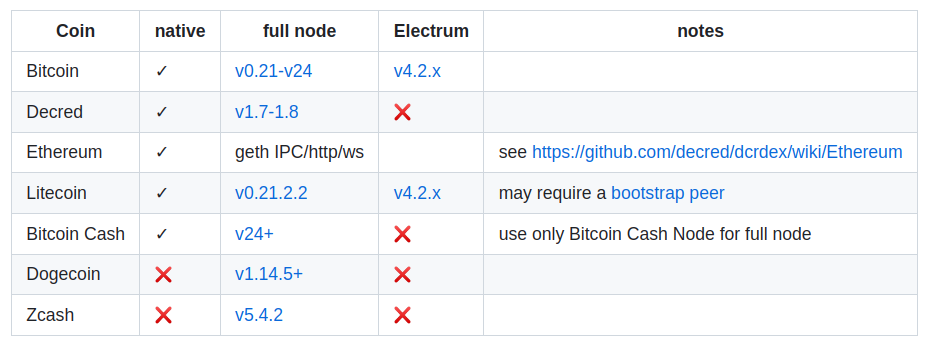
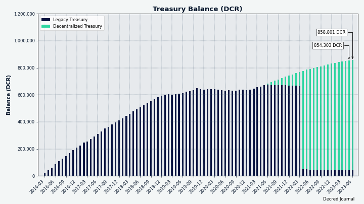
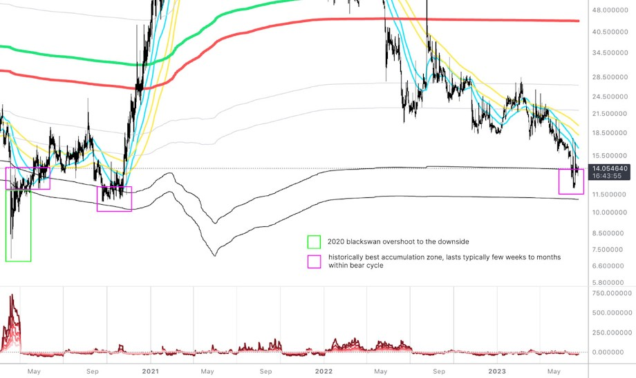
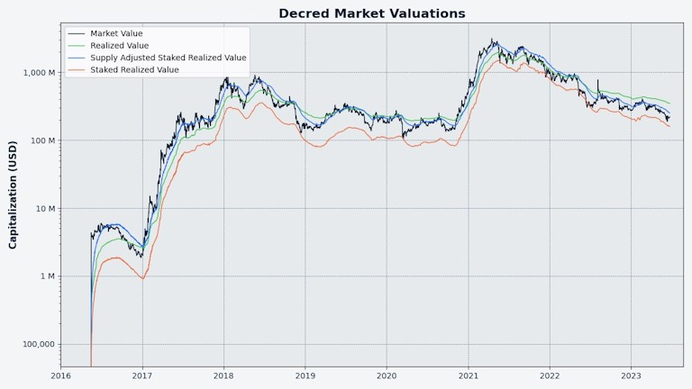

# Decred Journal – Czerwiec 2023

_Obraz: Dzieło aut. @Exitus_

Najważniejsze wydarzenia z czerwca:

- Wydano oprogramowanie podstawowe Decred v1.8.0, odblokowując nowe opcje i funkcje głosowania konsensusowego.

- Wydano również DEX v0.6.2, przygotowując się do nowych głosowań konsensusu i wdrażając wiele innych ulepszeń.

- Rozpoczęło się głosowanie nad dwoma nowymi propozycjami konsensusu (zmiana podziału nagrody blokowej i funkcji haszującej PoW) wraz z zakończeniem aktualizacji sieci we wczesnym czerwcu.

- Zatwierdzono finansowanie rozwoju zdecentralizowanej architektury siatki dla DCRDEX.

Spis treści:

- [Aktualizacja sieci i głosowanie nad nowymi zasadami konsensusu!](#upgrade-and-vote-on-new-consensus-changes)
- [Wydanie wersji v1.8.0 głównego oprogramowania](#core-software-v180-release)
- [Wydanie DCRDEX v0.6.2](#dcrdex-v062-release)
- [Rozwój](#development)
- [Ludzie](#people)
- [Zarządzanie](#governance)
- [Sieć](#network)
- [Ekosystem](#ecosystem)
- [Nawiązywanie kontaktów](#outreach)
- [Eventy](#events)
- [Media](#media)
- [Rynki](#markets)
- [Ważne kwestie i wiadomości poboczne](#relevant-external)

<a id="upgrade-and-vote-on-new-consensus-changes" />

## Aktualizacja sieci i głosowanie nad nowymi zasadami konsensusu!

Zachęcamy wszystkich do aktualizacji do [najnowszej wersji głównego oprogramowania](https://github.com/decred/decred-binaries/releases), aby móc głosować nad dwiema nowymi zmianami w zasadach konsensusu i pozostać na głównym łańcuchu, jeśli zostaną zatwierdzone. Aby zachować synchronizację z siecią, ważne jest, aby dokonać aktualizacji, nawet jeśli nie zamierzasz głosować nad agendami.

Aby przypomnieć sobie podstawowe zasady zarządzania w Decred, o zmianach w zasadach konsensusu i hardforkach, które nie dzielą sieci, zapraszamy do lektury [dokumentacji](https://docs.decred.org/governance/consensus-rule-voting/overview/).

O najnowszych zmianach w zasadach konsensusu możesz dowiedzieć się więcej z następujących dokumentów:

- Propozycja [zmiany podziału nagrody blokowej między PoW/PoS na 1/89 oraz zmiany algorytmu haszującego PoW na BLAKE3](https://proposals.decred.org/record/a8501bc).
- [DCP0011: Zmiana algorytmu PoW na BLAKE3 i ASERT](https://github.com/decred/dcps/blob/master/dcp-0011/dcp-0011.mediawiki) (jeszcze nieopublikowany w chwili pisania)
- [DCP0012: Zmiana podziału nagrody blokowej PoW/PoS na 1/89](https://github.com/decred/dcps/blob/master/dcp-0012/dcp-0012.mediawiki)

Dodatkowe szczegóły, implementację kodu oraz wyniki przeglądu i testów kodu można znaleźć w następujących pull requestach na GitHub [#3115](https://github.com/decred/dcrd/pull/3115) i [#3092](https://github.com/decred/dcrd/pull/3092), które implementują w/w zmiany.

Głosowanie rozpoczęło się 4. lipca i potrwa do około 1 sierpnia (a dokładnie do bloku [786 303](https://dcrdata.decred.org/block/786303)).

Postęp głosowania można śledzić na stronie [panelu głosowania](https://voting.decred.org/) lub na stronie [agend głosowania](https://dcrdata.decred.org/agendas) na dcrdata.

<a id="core-software-v180-release" />

## Wydanie wersji v1.8.0 głównego oprogramowania

Najważniejsze aspekty wydania v1.8.0 , aka ["The Forkening"](https://twitter.com/decredproject/status/1668722927661973505):

**dcrd**: Dwie nowe aktualizacje zasad konsensusu (które spowodują hardfork łańcucha, jeśli zostaną zatwierdzone), mining CPU dla funkcji BLAKE3, odrzucanie transakcji o niskich opłatach, liczne optymalizacje skutkujące skróceniem początkowego czasu synchronizacji o około 20% i lepszym zarządzaniem pamięcią w czasie wykonywania, poprawione czasy głosowania i wiele innych aktualizacji.

**dcrwallet**: Wsparcie dla dwóch nowych zmian konsensusu (np. podczas walidacji bloków lub tworzenia głosów), mieszane kupowanie biletów z obsługą tricklingu dla dodatkowej prywatności, pobieranie wydatków skarbowych w trybie SPV (potrzebne do głosowania nad transakcjami TSpend w trybie SPV), nowe metody gRPC do użytku przez aplikacje GUI i wiele poprawek błędów.

**Decrediton**: Możliwość głosowania na poszczególne transakcje TSpend, zaktualizowany moduł DCRDEX, zaktualizowane układy i stylizacja, liczne poprawki błędów i udoskonalenia na wszystkich stronach/zakładkach.

Zapraszamy do strony [wydań GitHub](https://github.com/decred/decred-binaries/releases), aby uzyskać pełną listę zmian i plików do pobrania. Jak zawsze zalecamy [weryfikację plików](https://docs.decred.org/advanced/verifying-binaries) przed uruchomieniem.

<a id="dcrdex-v062-release" />

## Wydanie DCRDEX v0.6.2

Ważne jest, aby zaktualizować do [DEX v0.6.2](https://github.com/decred/dcrdex/releases/tag/v0.6.2), aby pozostać na głównym łańcuchu po ewentualnych hardforkach w nadchodzących miesiącach. Jeśli nie korzystasz z wbudowanego (aka natywnego) portfela DCR, starsze wersje DEX mogą działać, ale aktualizacja jest nadal zalecana.

Najważniejsze aspekty nowego wydania:

- Wsparcie dla zmian w zasadach konsensusu Decred 1.8
- Dokładniejsze szacunki opłat dla wbudowanych portfeli SPV dla BTC, LTC i BCH (pamiętaj, aby włączyć "Zewnętrzne szacunki stawek opłat" w ustawieniach portfela).
- Sugerowana kwota BTC dla kaucji rejestracyjnej została znacznie zmniejszona.
- Poprawki i optymalizacje

Sprawdź zaktualizowany [przewodnik klienta](https://github.com/decred/dcrdex/wiki/Client-Installation-and-Configuration), aby uzyskać instrukcje krok po kroku.

Pobierz najnowszego klienta DEX jako [samodzielną aplikację](https://github.com/decred/dcrdex/releases), jako część portfela [Decrediton](https://github.com/decred/decred-binaries/releases) lub zainstaluj go z niestandardowego [społecznościowego sklepu aplikacji Umbrel](https://github.com/decred/umbrel-app-store). Jak zawsze zalecamy [weryfikację plików](https://docs.decred.org/advanced/verifying-binaries) przed ich uruchomieniem.

<a id="development" />

## Rozwój

O ile nie zaznaczono inaczej, prace zgłaszane poniżej mają status „scalonych z repozytorium głównym (master)”. Oznacza to, że prace są ukończone, zrecenzowane i zintegrowane z kodem źródłowym, który zaawansowani użytkownicy mogą [kompilować i uruchamiać](https://medium.com/@artikozel/the-decred-node-back-to-the-source-part-one-27d4576e7e1c), ale ich efekty nie są jeszcze dostępne w wersji plików binarnych dla zwykłych użytkowników.

### dcrd

_[dcrd](https://github.com/decred/dcrd) jest pełną implementacją węzła, który obsługuje sieć peer-to-peer Decred na całym świecie._

Najpierw przyjrzyjmy się czerwcowym zmianom zawartym w nowej wersji [1.8.0 release](https://github.com/decred/dcrd/releases/tag/release-v1.8.0).

Największymi zmianami dla użytkowników są zachęty do aktualizacji pełnych węzłów:

- Górnicy korzystający z wersji 1.8 będą [generować nowe wersje bloków](https://github.com/decred/dcrd/pull/3136) (v10), a jeśli większość sieci dokona aktualizacji [węzły odrzucą stare wersje bloków](https://github.com/decred/dcrd/pull/3135) (v9).

- Zmodyfikowano logikę powiadamiania o głosowaniu, tak aby po wysokości bloku 777 240 interesariusze [nie zatwierdzali już bloków ze starymi wersjami](https://github.com/decred/dcrd/pull/3137). Jest to możliwe dzięki temu, że dcrd nie wysyła powiadomień o nowych blokach do podłączonych klientów RPC, takich jak portfele do głosowania. Zmiana ta zmusza górników do aktualizacji do najnowszej wersji bloków w odpowiednim czasie, aby można było rozpocząć głosowanie nad nowymi zmianami konsensusu.

Następnie, parę dużych części implementujących aktualizację zasad konsensusu DCP-11, ["Zmiana algorytmu PoW na BLAKE3 i ASERT"](https://github.com/decred/dcrd/pull/3115):

- Pojęcia *block hash* i *proof of work hash* zostały [oddzielone i uniezależnione od siebie](https://github.com/decred/dcrd/commit/dbb6b782e0580395b3cb05333233994a70196ae7), dzięki czemu każdy hash może być modyfikowany bez zmiany drugiego. Wielką praktyczną konsekwencją jest to, że konsensus *block hash* pozostanie niezmieniony w DCP-11, co oznacza, że całe oprogramowanie obsługujące hashe bloków nie będzie wymagało modyfikacji. Mniejsze, skoncentrowane aktualizacje oznaczają minimalne skutki dla użytkowników.
- Dodano [wsparcie](https://github.com/decred/dcrd/commit/66a59e0d9248632575d57cf26f5f338ed60ed9f5) dla [funkcji haszującej BLAKE3](https://en.wikipedia.org/wiki/BLAKE_(hash_function)#BLAKE3) i podzielono metody obliczania starego PowHashV1 (BLAKE256) i nowego [PowHashV2 (BLAKE3)](https://github.com/decred/dcrd/commit/b2878aa5c18a1a5669f769d594ec3fc4954aa779). Warto zauważyć, że nie jest możliwe całkowite usunięcie PowHashV1 i innego starego kodu konsensusu. Nawet gdy konsensus łańcucha ulegnie zmianie, musi pozostać możliwość walidacji starego łańcucha. Dlatego też starszy kod konsensusu jest utrzymywany, aby móc zweryfikować cały blockchain Decred przed wejściem w życie nowszych zasad konsensusu. Zależność zewnętrzna wybrana dla BLAKE3 to [lukechampine.com/blake3](https://pkg.go.dev/lukechampine.com/blake3) - implementacja, która równoważy wydajność i czytelność kodu, z nadzieją, że ostatecznie wyląduje w standardowej bibliotece Go. Oprócz czystej wersji Go, pakiet zapewnia również procedury AVX-512 i AVX2 dla zwiększenia wydajności. Kolejną dodaną zależnością jest [cpuid](https://github.com/klauspost/cpuid) - pakiet Go do wykrywania dostępnych funkcji procesora.
- [Zaktualizowano](https://github.com/decred/dcrd/commit/6c323c18b0eb7e4035c8ceb4ac3a36230c8c9c42) polecenie `getwork` i powiadomienie websocket `notifywork`. Są one używane przez kod wydobywczy do pobierania nowych danych do haszowania.
- Zaimplementowano obliczanie trudności wydobycia ASERT w [kodzie konsensusu](https://github.com/decred/dcrd/commit/d9b1921177d4626a22c380853d6c7030a2d5c854), który waliduje łańcuch, i oddzielnie w [generowaniu bloków](https://github.com/decred/dcrd/commit/2db55eb6e7d16aca5676cd7d473555d23b30e23f) w kodzie wydobywczym. Zwykle unika się powielania kodu, ale w tym przypadku [celowo](https://github.com/decred/dcrd/pull/3115#discussion_r1210399671) utworzono dwie kopie. Głównym powodem jest wykorzystanie jednej kopii do wyłapywania błędów w drugiej, zasada znana jako [odmienna redundancja](https://en.wikipedia.org/wiki/Redundancy_(engineering)#Dissimilar_redundancy). Drugim powodem jest wdrożenie różnych optymalizacji w kodzie konsensusu i wydobywania w przyszłości. Dla tych, którzy kochają szybką matematykę i sztuczki bitowe, koniecznie przeczytajcie [kod ASERT tutaj](https://github.com/decred/dcrd/blob/d9b1921177d4626a22c380853d6c7030a2d5c854/blockchain/standalone/pow.go#L222).
- Zaimplementowano [głosowanie konsensusowe](https://github.com/decred/dcrd/commit/85e3701a67fa5a9a7eb418ce71fa991ede447dbb) dla DCP-11. W oprogramowaniu do głosowania pojawi się jako `blake3pow`.

Oprócz zmiany hashowania PoW na BLAKE3 która sprawi, że obecne koparki ASIC staną się bezużyteczne, nowy algorytm ASERT będzie dostosowywał trudność z każdym nowym blokiem zamiast co 144 bloki (obecna częstotliwość dostosowywania). Dla porównania, trudność wydobywania Bitcoina jest aktualizowana co 2016 bloków, czyli mniej więcej co dwa tygodnie. ASERT to skrót od Absolutely Scheduled Exponentially Weighted Rising Targets (*ang.* absolutnie zaplanowane wykładniczo ważone rosnące cele).

Algorytm ASERT jest również wykładniczy i może obsługiwać rosnący hashrate znacznie lepiej niż istniejący algorytm. Zniechęci to w znacznym stopniu oportunistycznych górników, którzy szukają tylko szybkiej nagrody przy niskim poziomie trudności. [Duże spadki mocy obliczeniowej](https://github.com/decred/dcrd/pull/3115#discussion_r1205741807), które powodują wolne bloki i w rezultacie pogarszają UX, są również obsługiwane znacznie lepiej. Sieć jest silniejsza, gdy górnicy konsekwentnie tworzą nowe bloki i utrzymują docelowy czas bloku wynoszący 5 minut. Zobacz także odpowiednią [dyskusję na temat na Matrixie](https://matrix.to/#/!uCnoeYfbhUnvwWihzS:decred.org/$tbF9LyO1EzQ8m3JDHfX9EYnQz1zr8W0Ra73Yjtprj1M).

Aby zilustrować nową szybkość dostosowywania trudności, [zapytaliśmy](https://github.com/xaur/decred-news/pull/182#discussion_r1265803246) @davecgh, jak nowy algorytm sprawdziłby się w hipotetycznym scenariuszu, w którym hashrate nagle spada ze 100 PH/s do 20 PH/s. Poprawa jest ogromna: przywrócenie docelowego czasu bloku wynoszącego 5 minut zajęłoby ok. 75 godzin (~3,1 dnia) w przypadku starego algorytmu w porównaniu z 20-30 minutami w przypadku nowego algorytmu ASERT.

Jeśli DCP-11 zostanie zatwierdzony, po 1-miesięcznym [okresie aktualizacji](https://docs.decred.org/governance/consensus-rule-voting/overview/) trudność zostanie zresetowana do [zakodowanej na stałe wartości](https://github.com/decred/dcrd/blob/a13ca3ace61d28678e1889b9a6303dd88c3dae98/chaincfg/mainnetparams.go#L115), co odpowiada początkowemu docelowemu hashrate'owi wynoszącemu około 1,45 TH/s. Liczba ta nie ma jednak większego znaczenia, ponieważ bardzo szybko dostosuje się do nowego algorytmu trudności.

_Obraz: Symulacja algorytmu dostosowywania trudności ASERT w reakcji na stałą, gwałtownie spadającą, oraz rosnącą ilość mocy obliczeniowej sieci._

Dla porównania, prace nad DCP-12 "Zmiana podziału nagrody blokowej PoW/PoS na 1/89" zostały zakończone i omówione w wydaniu [kwietniowym](202304.md#dcrd). Sama DCP została sprawdzona i [opublikowana](https://github.com/decred/dcps/pull/28) w czerwcu i jest teraz [dostępna w repozytorium DCP](https://github.com/decred/dcps/blob/master/dcp-0012/dcp-0012.mediawiki).

Podobnie jak wszystkie poprzednie zmiany konsensusu, kod konsensusu pozostanie uśpiony i aktywowany tylko wtedy, gdy odpowiednie [agendy głosowania](https://voting.decred.org/) zostaną zatwierdzone w drodze głosowania.

Dwie zakodowane na stałe wartości zostały zaktualizowane w ramach cyklu rozwoju wydania: [`AssumeValid`](https://github.com/decred/dcrd/pull/3122) i [`MinKnownChainWork`](https://github.com/decred/dcrd/pull/3123).

Dla porównania, od [maja 2022 r.](202205.md#development), `AssumeValid` zastąpiło starszą metodę "checkpoints" w celu optymalizacji początkowego pobierania łańcucha. Dzięki `AssumeValid` bardzo stare forki blockchain są odrzucane, a niektóre kontrole walidacji są pomijane dla bloków, które są przodkami zakładanego ważnego bloku. Może to znacznie przyspieszyć początkowe pobieranie blockchaina. Aktualizacje `AssumeValid` i `MinKnownChainWork` są zewnętrznie weryfikowane i zakodowane przez deweloperów i używane domyślnie bez żadnych działań wymaganych przez administratorów węzłów. Uwaga: Istnieje możliwość zmiany tego zachowania za pomocą flag `--allowoldforks` i `--assumevalid`, jak opisano w `dcrd --help` lub [w kodzie](https://github.com/decred/dcrd/blob/255ef183f66567f1e623026eb524f9cd26fd2b23/chaincfg/mainnetparams.go#L129), ale dla typowych administratorów węzłów nie jest to zalecane.

`MinKnownChainWork` [zastąpiło](https://github.com/decred/dcrd/pull/2000) starsze punkty kontrolne jako lepszy sposób na określenie, czy łańcuch jest aktualny. W przeciwieństwie do `AssumeValid`, nie można go wyłączyć i nie ma ku temu powodu, ponieważ wartość ta nie może zostać unieważniona przez reorganizację łańcucha. Podczas gdy określony blok może, ale nie musi stać się częścią głównego łańcucha bloków, minimalna znana praca łańcucha nigdy nie może zmaleć.

Poniżej lista zmian w wersji 1.8.0 istotnych dla deweloperów:

- Wydano nowe wersje modułów w ramach regularnego cyklu wydawniczego. Programiści budujący na bazie dcrd mogą teraz korzystać z następujących zaktualizowanych modułów Go: [addrmgr](https://github.com/decred/dcrd/pull/3121), [blockchain](https://github.com/decred/dcrd/pull/3133), [blockchain/standalone](https://github.com/decred/dcrd/pull/3120), [blockchain/stake](https://github.com/decred/dcrd/pull/3131), [chaincfg](https://github.com/decred/dcrd/pull/3125), [connmgr](https://github.com/decred/dcrd/pull/3124), [database](https://github.com/decred/dcrd/pull/3130), [dcrutil](https://github.com/decred/dcrd/pull/3129), [gcs](https://github.com/decred/dcrd/pull/3132), [hdkeychain](https://github.com/decred/dcrd/pull/3127), [peer](https://github.com/decred/dcrd/pull/3128), [rpcclient](https://github.com/decred/dcrd/pull/3134), [txscript](https://github.com/decred/dcrd/pull/3126), [wire](https://github.com/decred/dcrd/pull/3119) i [main](https://github.com/decred/dcrd/pull/3138).
- Zaktualizowano framework testów integracyjnych (dcrtest) i [ponownie włączono test Skarbca](https://github.com/decred/dcrd/pull/3118). Był on [tymczasowo wyłączony](https://github.com/decred/dcrd/issues/3093), aby obejść problem zależności kołowych.
- Zaktualizowano [konfigurację CI dla Go oraz lintery](https://github.com/decred/dcrd/commit/ab6d284362de7a30f623289bb1523ecc395c18ca)

_Obraz: Zoptymalizowana alokacja pamięci w dcrd v1.8.0. Im mniejsza alokacja, tym lepiej przekłada się to na wykorzystanie procesora i niższe czasy synchronizacji._

Zmiany scalone na gałęzi `master` ku przyszłym wydaniom:

- Zaktualizowano [obraz Docker](https://github.com/decred/dcrd/pull/3146), aby zbudować plik binarny dcrd z nowszymi wersjami Go i Alpine Linux. Warto wspomnieć, że szablon dcrd Dockera nie zachowuje systemu operacyjnego Alpine Linux. Po zbudowaniu pliku binarnego system operacyjny jest usuwany, a dcrd działa samodzielnie w kontenerze `scratch` Dockera, bez systemu operacyjnego, bez użytkownika root, nawet bez powłoki. Lekki [kontener z maksymalnym bezpieczeństwem](https://github.com/decred/dcrd/tree/4aa67947b5b36d40bb146d5ecacb76dcb7f50a7f/contrib/docker).
- Dodano [uwagi do wydania v1.8.0](https://github.com/decred/dcrd/pull/3144).
- [Ulepszono obsługę flag testowych](https://github.com/decred/dcrd/pull/3151), szczególnie w przypadkach, gdy domyślne katalogi domowe są niedostępne (jak w NixOS) i muszą zostać zmienione. Dodatkowo, zmienna środowiskowa [`DCRD_APPDATA`](https://github.com/decred/dcrd/pull/3152) może być teraz użyta do zastąpienia domyślnego katalogu. Zmienne środowiskowe są ogólnie preferowanym podejściem do zastępowania domyślnych ustawień w kontenerach.

Zmiany deweloperskie oraz wewnętrzne scalone na gałęzi `master`:

- Aktualizacja do najnowszego [dcrtest](https://github.com/decred/dcrd/pull/3142) i wykluczenie [nieużywanych modułów](https://github.com/decred/dcrd/pull/3143) z regularnych kompilacji.
- Oczyszczono [logikę testu bazy danych](https://github.com/decred/dcrd/pull/3147).
- Dodano [szablony not do wydania](https://github.com/decred/dcrd/pull/3148).
- Dodano [obsługę CI](https://github.com/decred/dcrd/pull/3145) dla pamięci podręcznych testów i modułów, co spowoduje szybsze uruchamianie CI. CI to ciągła integracja, usługa, która *ciągle* buduje i testuje kod, aby upewnić się, że wszystkie zmiany *dobrze* się integrują. Szybsze uruchamianie CI skraca czas oczekiwania deweloperów na sprawdzenie, czy ich zmiany przeszły wszystkie testy. Pamięć podręczna skraca czas uruchamiania CI z ~10 do ~1 minuty.
- Zaktualizowano [diagram hierarchii modułów](https://github.com/decred/dcrd/pull/3149), aby dokładnie odzwierciedlał zależności modułów.

Zmiany scalone w repozytorium frameworka [dcrtest](https://github.com/decred/dcrtest):

- Zaktualizowano portfel do głosowania, aby obsługiwał semantykę podziału nagrody za blok [DCP-12](https://github.com/decred/dcrtest/pull/12) w sieci simnet.
- Zaktualizowano portfel do głosowania, aby obsługiwał semantykę PoW określoną w [DCP-11](https://github.com/decred/dcrtest/pull/14) w sieci simnet.
- Zaktualizowano do korzystania z najnowszych zależności [modułu Decred](https://github.com/decred/dcrtest/pull/15) i najnowszego [głównego modułu dcrd](https://github.com/decred/dcrtest/pull/16).

### dcrwallet

_[dcrwallet](https://github.com/decred/dcrwallet) to serwer portfela używany przez wiersz polecenia oraz aplikacje graficzne._

Zmiany zawarte w nowym wydaniu v1.8.0:

- Upewniono się, że portfel może poprawnie weryfikować bloki wydobyte za pomocą [oryginalnego algorytmu PoW BLAKE-256 oraz nadchodzącego BLAKE3](https://github.com/decred/dcrwallet/pull/2240) i zaktualizowano wersję głosowania.
- Zakupy biletów mieszanych mają teraz [losowe opóźnienie 20-60 sekund](https://github.com/decred/dcrwallet/pull/2244), zanim portfel opublikuje każdą transakcję w mempoolu. Ten efekt "skapywania" poprawi prywatność, znacznie utrudniając każdemu, kto monitoruje mempool, łączenie biletów na podstawie opublikowanego znacznika czasu.
- Zaktualizowano moduły [dcrd i cspp](https://github.com/decred/dcrwallet/pull/2241) do ich najnowszych wersji. Moduł dcrwallet v3.0.0 został wydany dla aplikacji takich jak vspd, DCRDEX czy Politeia.

Poniższe usprawnienia zostały scalone z gałęzią `master` ku przyszłym wydaniom:

- Zaktualizowano [README](https://github.com/decred/dcrwallet/pull/2247) dla osób budujących ze źródeł.
- Podniesiono główną wersję modułu [dcrwallet](https://github.com/decred/dcrwallet/pull/2248) do wersji v4, aby przygotować się na przyszłe zmiany.
- Usunięto przestarzałą opcję z wewnętrznej konfiguracji portfela, która włączała automatyczne [`AddressReuse`](https://github.com/decred/dcrwallet/pull/2258) w niektórych funkcjach, takich jak automatyczny zakup biletów. Opcja była pierwotnie [przestarzała](https://github.com/decred/dcrwallet/pull/1442) w wersji v1.5 i [usunięta](https://github.com/decred/dcrwallet/pull/1676) z głównego pakietu w wersji v1.6, ponieważ ponowne użycie adresów jest szkodliwe dla prywatności. Portfel przestał używać opcji `AddressReuse`, ale pozostawiono ją jako przestarzałą w wewnętrznym pakiecie, aby zachować kompatybilność kodu w tym czasie.
- Konserwacja: poprawione logowanie, czyszczenie kodu, aktualizacje kodu testowego dla Go 1.21.

Praca wykonana w celu konsolidacji kodu VSP do repozytorium vspd:

- Dostosowano dcrwallet do vspd i [zredukowano zależności](https://github.com/decred/dcrwallet/pull/2238) między klientem VSP a dcrwallet.
- Przeniesiono logikę [wybierania niezarządzanych biletów](https://github.com/decred/dcrwallet/pull/2257) z modułu klienta VSP do modułu portfela.
- Wewnętrzna refaktoryzacja, czyszczenie, dodano więcej testów.

Końcowym celem tych zmian jest wyodrębnienie klienta VSP z dcrwallet do vspd, aby można go było ponownie wykorzystać w DCRDEX, umożliwiając DCRDEX zakup biletów i zarejestrowanie ich w VSP. Klient VSP pozwoli DCRDEX na zapewnienie funkcji stakingu i głosowania Decred w trybie light (SPV) bez konieczności pobierania pełnego blockchaina. Inne portfele napisane w Go również będą mogły z tego skorzystać.

### dcrctl

_[dcrctl](https://github.com/decred/dcrctl) to klient wiersza polecenia dla dcrd i dcrwallet._

- Aktualizacje dla wersji v1.8.0: korzystanie z najnowszych modułów [dcrd i dcrwallet](https://github.com/decred/dcrctl/pull/60), aby uzyskać dostęp do wszystkich ich nowych funkcji.

### Decrediton

_[Decrediton](https://github.com/decred/decrediton) to w pełni funkcjonalny desktopowy portfel ze zintegrowaną funkcją głosowania, mieszania StakeShuffle, Lightning Network, handlem na DEX i nie tylko. Działa z lub bez dostępu do pełnego łańcucha (tryb SPV)._

Zmiany zawarte w nowym wydaniu v1.8.0:

- Zaktualizowano moduł DCRDEX do wersji [wydania v0.6.1](https://github.com/decred/decrediton/pull/3871).
- [Usunięto strony stakingu dla portfeli sprzętowych](https://github.com/decred/decrediton/pull/3870), ponieważ nie mogą one uczestniczyć w stakingu. Dodano również ostrzeżenia, aby nie używać portfeli sprzętowych do otrzymywania środków ze stakingu lub Skarbca, ponieważ portfele sprzętowe nie mogą wydawać tych środków.
- Dodano w aplikacji [informacje o wydaniu](https://github.com/decred/decrediton/pull/3878) dla wersji 1.8.0.
- Zaktualizowano [tłumaczenie na jęz. polski](https://github.com/decred/decrediton/pull/3850).
- Naprawiono błąd występujący, gdy ludzie zrywają połączenie między Decreditonem a portfelem DEX. Domyślnym zachowaniem podczas korzystania z DEX w Decrediton jest to, że istnieje tylko jeden portfel kontrolowany przez Decrediton, a moduł DEX używa właśnie jego. Użytkownicy mogą jednak przerwać to połączenie i wymusić ustawienie typu portfela DEX na "SPV", co spowoduje utworzenie zupełnie nowego portfela w pełni zarządzanego przez DEX. Główny portfel Decrediton będzie nadal działał, ale nie będzie już mógł kontrolować nowego portfela utworzonego przez DEX i w niektórych przypadkach będzie zgłaszał błędy. [Błąd został naprawiony](https://github.com/decred/decrediton/pull/3866) poprzez uniemożliwienie Decreditonowi próby zmiany hasła w portfelu DEX, którego już nie kontroluje. Użytkownicy powinni jednak nadal unikać tej nietypowej konfiguracji i nie zmieniać typu portfela z poziomu modułu DEX.
- Inne drobne aktualizacje i poprawki, w tym kilka literówek i podbicie zależności.
- Zaktualizowano [metadane aplikacji](https://github.com/decred/decrediton/pull/3872) dla oficjalnych publikacji, jako część [wykonanej pracy](https://github.com/microsoft/winget-pkgs/pull/106493) w celu dodania Decreditona do repozytorium pakietów [winget](https://en.wikipedia.org/wiki/Windows_Package_Manager).

Poniższe usprawnienia zostały scalone z gałęzią `master` ku przyszłym wydaniom:

- Zaktualizowano [moduł DEX do wersji 0.6.2](https://github.com/decred/decrediton/pull/3882), która jest wymagana do śledzenia hardforków Decred 1.8.0 ze względu na zmiany w zasadach konsensusu. Ponadto naprawiono błąd "zbyt krótkiego bufora odpowiedzi" zgłaszany przez niektórych użytkowników.
- Zaktualizowano [tłumaczenie na jęz. arabski](https://github.com/decred/decrediton/pull/3847).
- Poprawiono tekst zastępczy w [samouczkach wprowadzających](https://github.com/decred/decrediton/pull/3881). Dodano również poprawną grafikę wydania v1.8.
- Zaktualizowano [zależności sieciowe](https://github.com/decred/decrediton/pull/3876).
- Zaktualizowano [Electron v23](https://github.com/decred/decrediton/pull/3884) z wersji v18. Pozwala to między innymi na komunikację Decreditona z urządzeniami USB, co jest wymagane dla niektórych portfeli sprzętowych, takich jak Ledger. Ponieważ [WebUSB](https://en.wikipedia.org/wiki/WebUSB) jest wbudowany w nowsze wersje Electrona, oznacza to, że deweloperzy nie muszą korzystać z zewnętrznych zależności, co jest dobre dla bezpieczeństwa.

Prace w toku:

- Jak wspomniano [w zeszłym miesiącu](202305.md#decrediton), trwają prace nad [dodaniem obsługi Ledger](https://github.com/decred/decrediton/issues/3865), w szczególności nad [interfejsem użytkownika Ledger](https://github.com/decred/decrediton/pull/3874). Najbardziej interesującymi nowościami w czerwcu były prace nad dodaniem [funkcji backendu Ledger](https://github.com/decred/decrediton/pull/3869), tak, aby interfejs użytkownika mógł faktycznie wchodzić w interakcje z samym Ledgerem. Główną trudnością nie jest po prostu sprawdzenie, czy funkcje działają zgodnie z przeznaczeniem, ale raczej [usunięcie jak największej liczby zależności](https://github.com/decred/decrediton/pull/3869#discussion_r1221483673), aby zmniejszyć ogromne ryzyko [ataków na łańcuch dostaw](https://en.wikipedia.org/wiki/Supply_chain_attack). Oprogramowanie Ledger wykorzystuje [liczne zależności](https://npmgraph.js.org/?q=%40ledgerhq%2Fhw-app-btc), a jeśli którakolwiek z tych zależności zostanie naruszona przez wrogi podmiot, może to zagrozić bezpieczeństwu portfela. Dlatego też twórcy Decred dokładają wszelkich starań, aby ta integracja przebiegła prawidłowo.

### Politeia

_[Politeia](https://github.com/decred/politeia) to system składania propozycji w ekosystemie Decred, który służy do wnioskowania o środki ze Skarbca._

- [Naprawiono błąd](https://github.com/decred/politeia/pull/1688), który powodował awarię serwera Politeia podczas próby przetworzenia płatności rejestracyjnej nowego użytkownika, jeśli nie można było znaleźć transakcji. Teraz, jeśli transakcja nie może zostać znaleziona, serwer po prostu odpowie, że użytkownik jeszcze nie zapłacił.
- Wewnętrzne aktualizacje deweloperskie: wymagają [Go 1.19 lub 1.20](https://github.com/decred/politeia/pull/1690); [ulepszono](https://github.com/decred/politeia/pull/1691) [linting](https://github.com/decred/politeia/pull/1692) [oraz](https://github.com/decred/politeia/pull/1693) [logowanie](https://github.com/decred/politeia/pull/1689).

### vspd

_[vspd](https://github.com/decred/vspd) to oprogramowanie serwera dla pul udziałów (Voting Service Provider). VSP oddaje głos za swoich użytkowników 24/7 oraz nie wchodzi w posiadanie żadnych środków, a tym samym nie może ich ukraść._

Zmiany zawarte w wydaniu [v1.2.0](https://github.com/decred/vspd/releases/tag/release-v1.2.0):

- [Dopracowano](https://github.com/decred/vspd/pull/390) dokumentację administratora vspd i dodano nowe [informacje o wydaniu](https://github.com/decred/vspd/pull/393), które zawierają istotne zmiany od marca 2022 r. oraz instrukcje aktualizacji.
- Wewnętrzne aktualizacje deweloperskie: zaktualizowano [lintery](https://github.com/decred/vspd/pull/384), zrefaktoryzowano [kodowanie bazy danych](https://github.com/decred/vspd/pull/384), zaktualizowano do korzystania z [najnowszych modułów](https://github.com/decred/vspd/pull/392) [dcrd](https://github.com/decred/vspd/pull/387) i [dcrwallet](https://github.com/decred/vspd/pull/388) w kliencie i [serwerze](https://github.com/decred/vspd/pull/389), zaktualizowano [framework sieciowy Gin](https://github.com/decred/vspd/pull/391).

Zmiany scalone z gałęzią `master` ku przyszłym wydaniom:

- Zaktualizowano interfejs administratora, aby wyświetlał [transakcje opłat czytelne dla człowieka](https://github.com/decred/vspd/pull/397) zamiast tylko surowych bajtów. Ta poprawa jakości życia dla administratorów VSP obejmowała również kilka dodatkowych funkcji, takich jak ładniejsze wyszukiwanie zgłoszeń i lepsze formatowanie JSON.

### dcrpool

_[dcrpool](https://github.com/decred/dcrpool) to oprogramowanie serwera do operowania i zarządzania pulą wydobywczą._

- Zaktualizowano [konfigurację oraz zależności CI](https://github.com/decred/dcrpool/pull/340), aby używać Go 1.20, PostgreSQL 15, modułów dcrd i dcrwallet z wydania v1.8.0, nowszych zależności stron trzecich i włączono dodatkowe narzędzia do sprawdzania kodu (aka lintery).

### Lightning Network

_[dcrlnd](https://github.com/decred/dcrlnd) to oprogramowanie węzła Lightning Network dla Decred. LN umożliwia przesyłanie natychmiastowych i niskokosztowych transakcji._

- Zaktualizowano do używania najnowszych modułów [dcrd](https://github.com/decred/dcrlnd/pull/184) i [dcrwallet](https://github.com/decred/dcrlnd/pull/171) z wydania v1.8.0.
- Poprawiono [czas uruchamiania](https://github.com/decred/dcrlnd/pull/186) dcrlnd i przeniesiono kilka zmian do repozytorium upstream, aby ułatwić jego działanie. Optymalizacja opiera się na zapewnieniu szybkiego dostępu do płatności w locie i pominięciu kosztownego skanowania wszystkich historycznych płatności podczas uruchamiania.
- Zaktualizowano wyjście `dcrlncli --version`, aby było [spójne](https://github.com/decred/dcrlnd/pull/185) z innym oprogramowaniem Decred.
- Zaktualizowano [konfiguracje CI](https://github.com/decred/dcrlnd/pull/183) dla normalnych kompilacji i kompilacji Docker.
- Podniesiono wersję do [v0.4.0](https://github.com/decred/dcrlnd/pull/171), aby odzwierciedlić przełomowe zmiany od wersji v0.3.8.
- Przełączono testy ze starego pakietu `rpctest` z repozytorium dcrd na nowy framework [dcrtest](https://github.com/decred/dcrtest).

### cspp

_[cspp](https://github.com/decred/cspp) to serwer do koordynowania mieszania monet za pośrednictwem protokołu CoinShuffle++. Nie jest powierniczy, tzn. nie przejmuje kontroli nad środkami. CSPP to część StakeShuffle - systemu prywatności Decred._

- Zmieniono limity czasu [wysyłania i odbierania](https://github.com/decred/cspp/pull/82) serwera miksowania tak, aby były obliczane z wyprzedzeniem na podstawie rozpoczęcia miksowania. Implementuje to bardziej niezawodny harmonogram terminów każdego kroku protokołu miksowania. Limity czasu po stronie klienta zostały znacznie zwiększone. Klienci nie muszą precyzyjnie śledzić terminów protokołów, ponieważ są one koordynowane przez serwer. Większe limity czasu po stronie klienta umożliwiają elastyczne dostosowywanie terminów na serwerze bez konieczności aktualizowania oprogramowania klienta.
- Dodano funkcję [`StartSolver`](https://github.com/decred/cspp/commit/ea898fb6341ed8173f7cf51f8542a4df1d7e19ae), która pozwala klientom RPC uruchomić proces solvera w tle i wykryć problemy z jego uruchomieniem przed rozpoczęciem sesji mieszania.
- Zaktualizowano [zależności](https://github.com/decred/cspp/pull/96).

### DCRDEX

_[DCRDEX](https://github.com/decred/dcrdex) to niepowiernicza giełda, umożliwiająca handel bez konieczności zaufania, działająca dzięki technologii atomic swaps._

Zmiany zawarte w wydaniu v0.6.2:

- Ulepszono [tekst pomocy wyjaśniający kaucje](https://github.com/decred/dcrdex/pull/2402) w procesie rejestracji. Jest to oparte na opiniach społeczności i innych użytkowników nowych w społeczności Decred.
- Znacznie zmniejszono [początkowy depozyt wymagany dla założenia kaucji](https://github.com/decred/dcrdex/pull/2392), z 0,056 BTC (1500 USD) do 0,0035 BTC (100 USD), co ułatwi wdrażanie nowych użytkowników. Należy pamiętać, że obligacje można również finansować za pomocą DCR.
- Zaktualizowano do najnowszej wersji [modułów](https://github.com/decred/dcrdex/pull/2403) dcrd i dcrwallet z wersji v1.8.0.
- Włączono korzystanie z [informacji o opłatach zewnętrznych](https://github.com/decred/dcrdex/pull/2391) dla portfeli SPV, takich jak wbudowane portfele DEX lub portfele Electrum. Działa to dla aktywów opartych na BTC: BTC, LTC i BCH. Przed tą zmianą możliwe było płacenie nieuzasadnionych [wysokich opłat](https://github.com/decred/dcrdex/issues/2354) w niektórych scenariuszach.
- Zoptymalizowano ładowanie [statycznych zasobów GUI](https://github.com/decred/dcrdex/pull/2398) w przeglądarce. Pliki CSS, JavaScript, obrazy i fonty będą teraz ładować się szybciej.
- Naprawiono błąd, który powodował, że proces rejestracji mógł być kontynuowany [bez oczekiwania na wpłatę wystarczających środków z kaucji](https://github.com/decred/dcrdex/pull/2392).
- Naprawiono błąd, który powodował, że strona ustawień używała nieprawidłowych [kwot funduszy](https://github.com/decred/dcrdex/pull/2402) dla kaucji.
- Dodano obejście dla [błędu obcięcia](https://github.com/decred/dcrdex/pull/2389) bazy danych Badger, który może wystąpić w systemie Windows po awarii. Baza danych Badger ma być [odporna na awarie bez utraty danych](https://dgraph.io/blog/post/badger/), a jednym ze sposobów, w jaki to robi, jest agresywne zapisywanie wszystkich danych w [plikach odwzorowanych w pamięci](https://en.wikipedia.org/wiki/Memory-mapped_file) i odzyskiwanie z nich po awarii. Windows obsługuje pliki mapowane w pamięci [inaczej](https://github.com/dgraph-io/badger/issues/476#issuecomment-388122680) niż inne systemy operacyjne, a Badger musi z góry przydzielić ogromną część pliku. Po awarii Badger musi [obciąć](https://github.com/dgraph-io/badger/issues/744) (usunąć) nadmiar alokacji przed wznowieniem normalnej pracy. W systemach operacyjnych opartych na Uniksie potrzeba przycięcia pliku może wskazywać na utratę danych, ale w systemie Windows po prostu tak to działa i w tym scenariuszu występuje [niemalże zerowe ryzyko utraty danych](https://github.com/dgraph-io/badger/issues/476#issuecomment-388655357).

Wszystkie odnotowane poniżej zmiany znajdą się w kolejnym wydaniu.

Klient:

- Dodano wsparcie dla [połączenia HTTPS](https://github.com/decred/dcrdex/pull/2345) pomiędzy front-endem klienta (interfejsem przeglądarki) a back-endem (procesem `dexc`). Gdy `dexc` działa w sieci publicznej, HTTPS będzie domyślnie włączony, w przeciwnym razie można go wymusić za pomocą flagi `--webtls`. Przeglądarka pokaże przerażające ostrzeżenie o samopodpisanym certyfikacie, ale można je uchylić.
- Dodano [narzędzie wskazówek](https://github.com/decred/dcrdex/pull/2357), aby wyjaśnić różne salda portfela (dostępne, zablokowane, niedojrzałe, rezerwy kaucji).
- Dodano opcję zasobnika systemowego, aby [DEX nadal był uruchomiony](https://github.com/decred/dcrdex/pull/2367) nawet po zamknięciu wszystkich okien.
- [Zaktualizowano](https://github.com/decred/dcrdex/pull/2383) stronę wiki [Instalacja i konfiguracja klienta](https://github.com/decred/dcrdex/wiki/Client-Installation-and-Configuration), aby była bardziej przejrzysta, zwięzła i aktualna z najnowszą wersją. Jednym z godnych uwagi dodatków jest tabela podsumowująca typy portfeli obsługiwane dla każdego zasobu.
- Dodano [informacje o wydaniu](https://github.com/decred/dcrdex/pull/2394) dla wersji 0.6.1.
- Naprawiono błąd, w wyniku którego przycisk [Przyspiesz](https://github.com/decred/dcrdex/pull/2414) był wyświetlany dla odwołanych (anulowanych) transakcji.

Bitcoin:

- [Ponowne wykorzystanie](https://github.com/decred/dcrdex/pull/2368)  nieużywanych adresów wykupu i zwrotów. DEX generuje nowe adresy Bitcoin, które mają być używane do wykupu (transakcja zakończona normalnie) i zwrotów (transakcja została anulowana i zwrócona). Wiele adresów pozostaje niewykorzystanych. W portfelach typu Hierarchical Deterministic (HD) może to tworzyć *gapy (luki)* pomiędzy używanymi adresami, które są większe niż [limit luki (gap limit)](https://blog.lopp.net/mind-the-bitcoin-address-gap/), co może powodować problemy z wykrywaniem środków i przywracaniem portfeli z ziaren. Aby uniknąć przekroczenia limitu luk, wygenerowane adresy, które nie zostały wykorzystane do wykupu lub zwrotu środków, zostaną zapisane i wykorzystane w przyszłych transakcjach.
- Naprawiono [awarię](https://github.com/decred/dcrdex/pull/2396) wbudowanego portfela BTC podczas synchronizacji. Testowanie portfeli DEX [ujawniło](https://github.com/decred/dcrdex/issues/1690) [awarię](https://github.com/btcsuite/btcwallet/issues/827) w kodzie upstream btcwallet. Deweloperzy DEX przyczynili się do zbadania i [naprawienia](https://github.com/btcsuite/btcwallet/pull/870) tego błędu.
- Zaimplementowano funkcję [składania wielu zleceń za jednym razem](https://github.com/decred/dcrdex/pull/2362). Będzie ona używana przez boty animatora rynku i może umożliwić optymalizacje handlowe.

Polygon (MATIC):

- Zaimplementowano kilka niskopoziomowych prymitywów i [uprząż testową](https://github.com/decred/dcrdex/pull/2399), aby pomóc w rozwijaniu obsługi Polygon. Uprząż była w stanie synchronizować salda i wysyłać środki w sieciach simnet i testnet. Istniejący kod Ethereum został zrefaktoryzowany, aby był bardziej ogólny i możliwy do ponownego wykorzystania przez kod Polygon.
- Rozszerzono [uprząż testową](https://github.com/decred/dcrdex/pull/2413), aby utworzyć dwa węzły, połączyć je ze sobą i wydobywać bloki.

Opakowanie aplikacji:

- Dodano skrypty pakujące do tworzenia [instalatora DMG dla macOS](https://github.com/decred/dcrdex/pull/2333).
- Utworzono [pakiet DCRDEX](https://aur.archlinux.org/packages/dcrdex) w Arch User Repository (AUR). W Arch lub dystrybucjach Linuksa opartych na Arch, takich jak Manjaro, można go zainstalować za pomocą optymistycznie brzmiącego polecenia `$ yay dcrdex`. Dokumentacja została [zaktualizowana](https://github.com/decred/dcrdex/pull/2347) z listą istniejących i nadchodzących pakietów dla różnych systemów pakowania.

Serwer:

- Zmieniono limity zleceń na [oparte na wielkości kaucji](https://github.com/decred/dcrdex/pull/2411). Zwiększenie poziomu kaucji poprzez zablokowanie większej ilości środków odblokuje większe rozmiary zleceń. Limit zleceń jest również zmniejszany przez złe zachowanie, takie jak nieukończenie swapów. Ta zmiana powinna naprawić brak możliwości składania zleceń przez niektórych użytkowników. System kar i nagród nadal jest rozwijany.

Zmiany wewnętrzne i deweloperskie:

- Zaktualizowano blockchain simnet o [nowy dowód pracy](https://github.com/decred/dcrdex/pull/2358).
- Dodano skrypty do automatycznej [aktualizacji cache busterów](https://github.com/decred/dcrdex/pull/2363).
- Włączono [buforowanie](https://github.com/decred/dcrdex/pull/2390) wyników kompilacji Go generowanych przez GitHub Actions. Pozwala to uniknąć niepotrzebnej rekompilacji i przyspiesza kompilacje i testy, które są uruchamiane dla każdego żądania ściągnięcia. W rezultacie sprawdzenie, czy opracowywana zmiana nie przechodzi jakichś testów zajmuje mniej czasu.

_Obraz: Poprawione wprowadzenia do kaucji DCRDEX_

_Obraz: Typy portfeli wspieranych przez DCRDEX_

### dcrdata

_[dcrdata](https://github.com/decred/dcrdata) to eksplorator blockchaina Decred oraz danych off-chain, takich jak propozycje na platformie Politeia, rynków i ponadto._

- Zaktualizowano do korzystania z najnowszych [modułów dcrd](https://github.com/decred/dcrdata/pull/1968) wydanych w wersji v1.8.0. Dzięki temu dcrdata i kozystający zeń klienci, tacy jak Decrediton, informowani są o nowych głosowaniach nad zasadami konsensusu, które zostają również dodane do strony [Agend](https://dcrdata.decred.org/agendas).
- Zaktualizowano matematykę [nagród blokowych](https://github.com/decred/dcrdata/pull/1969), aby była świadoma daty aktywacji DCP-12, a także nowego podziału nagród blokowych.
- Naprawiono błąd, w wyniku którego transakcje TSpend były uwzględniane w danych [podaży monet](https://github.com/decred/dcrdata/pull/1964) wyświetlanych na stronie wykresów. W połączeniu z poprawką dla [raportowania podaży monet](https://github.com/decred/dcrd/pull/3112) w dcrd naprawia to rozbieżność podaży między stroną [główną](https://dcrdata.decred.org/) i [wykresów](https://dcrdata.decred.org/charts) na dcrdata.
- Zaktualizowano [konfigurację kompilacji CI](https://github.com/decred/dcrdata/pull/1966), konfigurację Dockera i lintery.

### Timestamply

_[Timestamply](https://github.com/decred/dcrtimegui) to darmowa usługa znakowania czasowego plików działająca na łańcuchu Decred. Znacznik czasowy udowadnia, że dany plik istniał w określonym momencie. Usługa ta ma szereg zastosowań w ochronie nienaruszalności danych._

- Zaktualizowano dcrtime do [budowania i testowania z wykorzystaniem Go 1.20](https://github.com/decred/dcrtime/pull/91) oraz użyto najnowszych modułów Decred.

### Dokumentacja

_[dcrdocs](https://github.com/decred/dcrdocs) to repozytorium źródłowe [dokumentacji użytkownika](https://docs.decred.org/) dla Decred._

- Wiele aktualizacji dotyczących aplikacji wiersza poleceń w wersji [v1.8.0](https://github.com/decred/dcrdocs/pull/1223).

### Bison Relay

_[Bison Relay](https://github.com/companyzero/bisonrelay) to nowa platforma mediów społecznościowych peer-to-peer z silną ochroną przeciw cenzurze, inwiligacji, oraz reklamom, działająca na bazie Lightning Network projektu Decred._

Wszystkie podane poniżej zmiany zostały scalone z gałęzią `master` do następnego wydania.

Aplikacje GUI oraz wiersza polecenia:

- Domyślne tworzenie nowych czatów grupowych w [wersji 1](https://github.com/companyzero/bisonrelay/pull/263). Jest to najnowsza wersja, która obsługuje wielu administratorów w jednym czacie grupowym.
- [Utrwalanie](https://github.com/companyzero/bisonrelay/pull/257) odebranych, ale nie w pełni przetworzonych wiadomości czatu grupowego. Pomaga to wyświetlać wiadomości we właściwej kolejności, zwłaszcza po ponownym uruchomieniu aplikacji.
- Zmniejszono maksymalną liczbę [bezczynnych połączeń HTTP](https://github.com/companyzero/bisonrelay/pull/281) ze 100 do 2. Połączenia HTTP z "normalną siecią" są używane do pobierania kursów wymiany DCR/BTC i BTC/USD.
- Przyspieszono [pętlę ponownego połączenia](https://github.com/companyzero/bisonrelay/pull/290) serwera.
- Naprawiono niektóre problemy z [wymianą kluczy](https://github.com/companyzero/bisonrelay/pull/273) (KX). Poprawiono raportowanie zakończonych KX w czatach bezpośrednich i grupowych. Unikanie wielu prób KX z tym samym użytkownikiem podczas dołączania do wielu czatów grupowych. Dodano automatyczne próby KX podczas wysyłania wiadomości do członków czatu grupowego, co powinno naprawić problemy z dostarczaniem wiadomości z powodu nieodebranego KX z użytkownikiem docelowym.

Aplikacja GUI:

- Dodano [książkę adresową](https://github.com/companyzero/bisonrelay/pull/256), która wyświetla listę wszystkich znanych użytkowników i czatów grupowych. Lista ostatnich czatów została zoptymalizowana pod kątem ukrywania pustych czatów i wyświetlania nowszych czatów na górze. Ukryte puste czaty można przywrócić z książki adresowej.
- Dodano funkcję [wyszukiwania i filtrowania](https://github.com/companyzero/bisonrelay/pull/264) na stronie książki adresowej.
- Dodano możliwość [ukrywania niepustych czatów](https://github.com/companyzero/bisonrelay/pull/264). Ukryte czaty można ponownie wyświetlić za pomocą książki adresowej.
- Tworzenie [katalogu konfiguracji](https://github.com/companyzero/bisonrelay/pull/259), jeśli go brakuje.
- Przechowywanie i ładowanie [faktur](https://github.com/companyzero/bisonrelay/pull/282) w celu lepszego śledzenia statusu napiwków po ponownym uruchomieniu aplikacji.
- Ulepszono [sortowanie postów na feedzie społecznościowym](https://github.com/companyzero/bisonrelay/pull/288), aby uwzględnić ostatnie komentarze.
- Ulepszono UX [komentowania postów](https://github.com/companyzero/bisonrelay/pull/291), aby lepiej wizualizować, czy użytkownik dodaje komentarz najwyższego poziomu, czy odpowiedź na inny komentarz.
- Ulepszono [UX listy czatów](https://github.com/companyzero/bisonrelay/pull/292).
- Zoptymalizowano [przestrzeń pionową](https://github.com/companyzero/bisonrelay/pull/293) na stronach kanałów przychodzących i wychodzących.
- Zaktualizowano zależności [Flutter](https://github.com/companyzero/bisonrelay/pull/258).
- Naprawiono ładowanie historii dla kontaktów, które [nie zakończyły wymiany kluczy](https://github.com/companyzero/bisonrelay/pull/257).
- Naprawiono błąd, który mógł uniemożliwiać prawidłowe [wyświetlanie błędów](https://github.com/companyzero/bisonrelay/pull/271) na stronie wdrażania.
- Naprawiono błąd, który powodował, że strona czatów nie była świadoma [ukrytych czatów](https://github.com/companyzero/bisonrelay/pull/276) i błędnie wyświetlała strony "Potrzebne fundusze" lub "Potrzebne zaproszenie".
- Naprawiono nieprawidłowe działanie akcji [zasugerowania KX](https://github.com/companyzero/bisonrelay/pull/277). Powoduje to również dodanie ukrytych użytkowników do listy rozwijanej.
- Naprawiono możliwość otwierania [wielu selektorów plików](https://github.com/companyzero/bisonrelay/pull/262) w miejscach takich jak tworzenie postów lub generowanie zaproszeń.

Aplikacja wiersza polecenia:

- Umożliwienie tworzenia nowych postów z [istniejącego pliku](https://github.com/companyzero/bisonrelay/pull/253) za pomocą komendy `/post new`.
- Zezwalanie na tworzenie postów i komentarzy w [zewnętrznym edytorze tekstu](https://github.com/companyzero/bisonrelay/pull/253) skonfigurowanym w zmiennej środowiskowej `EDITOR`.
- Umożliwienie [osadzania obrazów](https://github.com/companyzero/bisonrelay/pull/253) w postach i komentarzach poprzez dodanie dyrektywy `localfilename`, która zostanie zastąpiona zawartością pliku.
- Umożliwiono [przeglądanie i potwierdzanie komentarzy](https://github.com/companyzero/bisonrelay/pull/253) przed ich wysłaniem.
- Dodano polecenie [ręcznego ustawiania kursów wymiany](https://github.com/companyzero/bisonrelay/pull/272) i zmniejszono szczegółowość dziennika w przypadku niepowodzeń pobierania kursów z dcrdata i Bittrex.
- Naprawiono [zduplikowane wiadomości](https://github.com/companyzero/bisonrelay/pull/254) w nowych oknach czatu.

Implementacja funkcji sklepów:

- Dodano stronę umożliwiającą wyświetlenie informacji o jednym [zamówieniu](https://github.com/companyzero/bisonrelay/pull/255).
- Zezwolono [adminowi](https://github.com/companyzero/bisonrelay/pull/260) i [klientowi](https://github.com/companyzero/bisonrelay/pull/283) sklepu na dodawanie komentarzy do zamówienia i wyświetlanie ich zarówno na stronie administratora, jak i klienta.

Przygotowania do buildów mobilnych:

- Skonfigurowano wbudowany dcrlnd, aby [nie zawierał adresu IP ani nazwy hosta](https://github.com/companyzero/bisonrelay/pull/267) w generowanych certyfikatach TLS. Jest to potrzebne do kompilacji wersji na Androida.
- Zaktualizowano bibliotekę [gomobile](https://github.com/companyzero/bisonrelay/pull/267).
- Naprawiono [kompilację `golib`](https://github.com/companyzero/bisonrelay/pull/267) z gomobile. `golib` jest adapterem dla niskopoziomowego kodu Bison Relay w Go do ponownego użycia przez wysokopoziomowy kod GUI, który jest napisany w Dart i Flutter.
- Przeniesiono i dostosowano część [kodu desktopowego](https://github.com/companyzero/bisonrelay/pull/267) do wspólnej lokalizacji, aby umożliwić ponowne wykorzystanie na urządzeniach mobilnych.
- Wprowadzono wiele zmian specyficznych dla [kompilacji iOS i Android](https://github.com/companyzero/bisonrelay/pull/267).
- Pierwszy etap tworzenia widoków [responsywnych](https://github.com/companyzero/bisonrelay/pull/285) i użytecznych na mniejszych ekranach i platformach mobilnych. Dokładniejsza implementacja projektu zostanie przeprowadzona w przyszłości, po sfinalizowaniu specyfikacji UX.

Zmiany wewnętrzne i deweloperskie:

- Zaktualizowano Decred i inne [zależności Go](https://github.com/companyzero/bisonrelay/pull/268).
- Ulepszono [konfigurację kompilacji](https://github.com/companyzero/bisonrelay/pull/280) GitHub, zautomatyzowano większą część [procesu wydania](https://github.com/companyzero/bisonrelay/pull/274) i [wyczyszczono](https://github.com/companyzero/bisonrelay/pull/279) część kodu.

### Pozostałe

- Testnetowy kran został zaktualizowany do wersji [Go 1.20](https://github.com/decred/testnetfaucet/pull/70) i [modułów Decred](https://github.com/decred/testnetfaucet/pull/71) wydanych wraz z wersją v1.8.0. Kran jest używany przez programistów do uzyskiwania testnetowych DCR.
- gominer został [zaktualizowany](https://github.com/decred/gominer/pull/193) dla najnowszych modułów Decred, linterów i konfiguracji kompilacji GitHub Actions.
- [Panel głosowania](https://voting.decred.org/): zaktualizowany do [Go 1.20](https://github.com/decred/dcrvotingweb/pull/289) i nowszych [zależności Decred](https://github.com/decred/dcrvotingweb/pull/291) i stron trzecich, dodano wyświetlanie agend głosowania nad zmianami konsensusu w v1.8.0, naprawiono [głosowane wersje](https://github.com/decred/dcrvotingweb/pull/292) dla `testnet3`.
- dcrinstall, automatyczny instalator/aktualizator aplikacji wiersza poleceń, został [zaktualizowany](https://github.com/decred/decred-release/pull/234) do wersji v1.8.0. Najnowszą wersję można pobrać na [stronie wydań](https://github.com/decred/decred-release/releases).
- dcrseeder, usługa wyszukiwania węzłów sieci Decred, została [zaktualizowana](https://github.com/decred/dcrseeder/pull/58) do Go 1.20 i modułów Decred od wersji v1.8.0.

<a id="people" />

## Ludzie

Statystyki społeczności na dzień 2. lipca (w porównaniu z 2. czerwca):

- Obserwujący na [Twitterze](https://twitter.com/decredproject): 53 580 (+450)
- Subskrybenci na [Reddit](https://www.reddit.com/r/decred/): 12 738 (+15)
- Użytkownicy na [Matrixie](https://chat.decred.org/) w pokoju #general: 787 (+13)
- Użytkownicy na [Discordzie](https://discord.gg/GJ2GXfz):  1586 (-4), zweryfikowani z możliwością pisania: 635 (+1)
- Użytkownicy na [Telegramie](https://t.me/Decred): 2362 (-108)
- Subskrybenci na [YouTube](https://www.youtube.com/decredchannel): 4640 (+0), wyświetleń: 231,1K (+1,5K)

<a id="governance" />

## Zarządzanie

W czerwcu nowy [Skarbiec](https://dcrdata.decred.org/treasury) otrzymał 7760 DCR o wartości 111 tys. USD po średnim czerwcowym kursie wymiany $14,25. 4604 DCR zostało wydane, aby zapłacić kontrahentom, co stanowiło wartość $66K po kursie wymiany z tego miesiąca.

Transakcja [wypłaty ze Skarbca](https://explorer.dcrdata.org/tx/4734a7e88ecb366d5c3be8510c35e846ff5a117fa92e24a0ad9329ac65b4925f) została wydobyta 13. lipca stosunkiem 7456 głosów na "tak" i 52% udziale w głosowaniu i zawierała 20 wyjść dokonujących płatności kontrahentom w przedziale od 4 DCR do 1308 DCR. Większość z tej sumy to zapłata za pracę z kwietnia po kursie wymiany $20,22 a cała transakcja TSpend opiewa na równowartość $93K.

Na dzień 9. lipca, łączne saldo [starego](https://dcrdata.decred.org/address/Dcur2mcGjmENx4DhNqDctW5wJCVyT3Qeqkx) i [nowego Skarbca](https://dcrdata.decred.org/treasury) wynosi 8630788 DCR (13,9 miliona USD po kursie $16,06).

_Obraz: Saldo Skarbca Decred w DCR_

_Obraz: Saldo Skarbca Decred w USD_

W czerwcu opublikowano 4 propozycje, a jedna z maja zakończyła głosowanie:

- [Propozycja](https://proposals.decred.org/record/552c87e) sfinansowania rozwoju strony internetowej Decred.club z treściami w języku chińskim i rozwoju społeczności wokół niej za kwotę 2400 USD.
- [Propozycja](https://proposals.decred.org/record/4d3a8fc) zmiany marki Decred Magazine na Cypherpunk Times i kontynuowania jego produkcji przez kolejny rok ze zwiększonym budżetem w wysokości 44 000 USD.
- [Propozycja](https://proposals.decred.org/record/9e265ad) wyprodukowania 90-sekundowych filmów przedstawiających postać w masce narciarskiej mówiącą o Decred w jednym z 12 języków za kwotę 23 650 USD.
- [Propozycja](https://proposals.decred.org/record/20ba5cd) stworzenia promocyjnej strony internetowej dla DCRDEX, której koszt wyniesie $2000.
- [Propozycja](https://proposals.decred.org/record/4d2324b) sfinansowania badań nad architekturą Mesh dla DCRDEX z budżetem w wysokości $164 000 została zatwierdzona stosunkiem głosów 94% na tak przy 44% frekwencji.

Zapraszamy do lektury [wydania nr 61](https://blockcommons.red/politeia-digest/issue061/) oraz [62](https://blockcommons.red/politeia-digest/issue062/) Politeia Digest po więcej informacji na temat zgłoszonych w tym miesiącu propozycji.

<a id="network" />

## Sieć

**Hashrate**: czerwcowy [hashrate](https://dcrdata.decred.org/charts?chart=hashrate&scale=linear&bin=day&axis=time) na początku miesiąca wyniósł ~66 Ph/s, a zamknął go na poziomie ~63 Ph/s, zaliczając niż w ok. 46 Ph/s oraz szczyt w wys. 69 Ph/s w ciągu miesiąca.

_Obraz: Moc obliczeniowa projektu Decred_

Dystrybucja mocy obliczeniowej w wys. 64 Ph/s [zadeklarowana](https://miningpoolstats.stream/decred) przez pule wydobywcze na dzień 1. lipca: F2Pool 49%, Poolin 30%, AntPool 16%, BTC.com 5%.

Podział 1000 bloków [wydobytych](https://miningpoolstats.stream/decred) przed 1. lipca: F2Pool 46%, Poolin 31%, AntPool 18%, BTC.com 5%.

**Staking**: [Cena biletów](https://dcrdata.decred.org/charts?chart=ticket-price&axis=time&visibility=true-true&mode=stepped) wahała się między 175 a 328 DCR.

_Obraz: Cena biletów ponownie doświadcza huśtawek_

_Obraz: Cena biletów jest naturalnie skorelowana ze zmiennością w liczbie zakupionych biletów_

[Zablokowana suma](https://dcrdata.decred.org/charts?chart=ticket-pool-value&scale=linear&bin=day&axis=time) to pomiędzy 9,34 a 9,77 miliona DCR, co oznacza, że 61,2-63,8% podaży dostępnej w obiegu [wzięło udział](https://dcrdata.decred.org/charts?chart=stake-participation&scale=linear&bin=day&axis=time) w elemencie Proof of Stake.

_Obraz: Procentowy udział monet w proof of stake jest dobrym wskaźnikiem siły przekonania interesariuszy_

**VSP**: Na 1. lipca, ~6630 (-20) biletów w puli zarządzanych było przez [14 oficjalnych VSP](https://decred.org/vsp/), co stanowi 16,5% całej puli biletowej (-0,3%).

Największe wzrosty w czerwcu odnotowały [dcrhive.com](https://dcrhive.com/) (+652 biletów, lub +58%), [stakey.net](https://stakey.net/) (+182 biletów, lub +59%), oraz [ultravsp.uk](https://ultravsp.uk/) (+131 biletów, lub +37%).

_Obraz: Podział biletów zarządzanych przez VSP_

**Węzły**: [Decred Mapper](https://nodes.jholdstock.uk/user_agents) odnotował między 144 a 172 węzły dcrd w ciągu miesiąca. Wersje 170 węzłów odnotowanych 1. lipca to: v1.8.0 - 77%, v1.7.x - 14%, dev buildy v1.8.0 - 3,5%, pozostałe - 6%.

Sieć bardzo szybko przeprowadziła aktualizację do wersji v1.8.0 i zaczęła wydobywać bloki, co widać na następnych dwóch wykresach.

_Obraz: Operatorzy węzłów błyskawicznie zaktualizowali je do wersji v1.8.0. Czerwony obszar przed styczniem 2023 zaznacza obszar, co do którego nie posiadaliśmy wówczas kompletnych danych._

_Obraz: Wersja 10 bloków szybko stała się wersją dominującą, co umożliwiło przeprowadzenie głosowania nad zasadami konsensusu._

Ilość [monet mieszanych](https://dcrdata.decred.org/charts?chart=coin-supply&zoom=jz3q237o-la8vk000&scale=linear&bin=day&axis=time&visibility=true-true-true) wahała się w granicach 61,8-62,1%.
Dzienna [kwota mieszana](https://dcrdata.decred.org/charts?chart=privacy-participation&bin=day&axis=time) oscylowała w granicach 298K-699K DCR.

_Obraz: Ogromne wzrosty w dziennym wolumenie StakeShuffle_

_Obraz: Największy do tej pory miesięczny wolumen StakeShuffle_

Eksplorator [Lightning Network](https://ln-map.jholdstock.uk/) sieci Decred na 1. lipca odnotował 212 węzłów (+1) oraz 427 kanałów (+4) o całkowitej pojemności 191 DCR (+15). Statystyki te zależą od węzła LN. W porównaniu z [statystykami LN Litecoin](https://1ml.com/litecoin/) z tego samego dnia: 95 węzłów, 170 kanałów oraz całkowita pojemność 35 LTC. W kategoriach USD pojemność wynosiła $3010 dla DCR, oraz $3710 dla LTC.

_Obraz: Wzrost liczby węzłów LN Decred zatrzymał się_

_Obraz: Pojemność sieci LN Decred powoli rośnie_

<a id="ecosystem" />

## Ekosystem

Voting Service Providers:

- Operatorzy VSP szybko dokonywali aktualizacji, aby wesprzeć nadchodzące aktualizacje konsensusu. 7 z 14 VSP dokonało aktualizacji w ciągu zaledwie 3 dni od wydania [nowej wersji vspd](https://github.com/decred/vspd/releases/tag/release-v1.2.0). Do 30 czerwca wszystkie VSP działały w wersji 1.2.0.

- Nowy VSP na [vote.dcr-swiss.ch](https://www.vote.dcr-swiss.ch/) rozpoczął testowanie na testnecie i mainnecie, aby zostać dodanym do [listy VSP](https://decred.org/vsp/).

Portfele:

- DCRDEX zostało [dodane](https://github.com/decred/dcrweb/pull/1125) do [strony portfeli](https://decred.org/wallets/) na decred.org jako "lekki portfel multi-coin z obsługą DEX".

- Bezpieczeństwo portfela [Atomic Wallet](https://atomicwallet.io/) zostało naruszone około 2-3 czerwca. Straty szacowane są od [67 milionów dolarów](https://twitter.com/tayvano_/status/1668778031790587905) do [ponad 100 milionów dolarów](https://cointelegraph.com/news/north-korean-hackers-swipe-over-100m-from-atomic-wallet-users) przez zewnętrznych badaczy, podczas gdy Atomic Wallet woli mierzyć je jako "mniej niż 0,1% użytkowników", czyli mniej niż 5000 użytkowników w oparciu o 5 milionów użytkowników podanych na [stronie internetowej](https://atomicwallet.io/). Główna przyczyna nie została zidentyfikowana do [20 czerwca](https://atomicwallet.io/blog/june-3rd-event-statement). Zarejestrowany w Estonii Atomic Wallet [obsługuje DCR](https://twitter.com/atomicwallet/status/1042032573168476160) od sierpnia 2018 roku. DCR nie było na [liście dotkniętych monet](https://twitter.com/zachxbt/status/1665151915355676674) opublikowanej przez ZachXBT 4 czerwca i nie widzieliśmy żadnych raportów o stratach od użytkowników DCR. Jeśli znasz jakieś, podziel się nimi na czacie #ecosystem.

- Użytkownicy Ledger Live mogą chcieć ustawić hasło, ponieważ dopóki nie zostanie ono ustawione, z Ledger Live może [wyciekać](https://twitter.com/RandyMcMillan/status/1671637422281728000) niezaszyfrowany [rozszerzony klucz publiczny](https://support.ledger.com/hc/en-us/articles/360011069619-Extended-public-key-xPub-) do systemu plików. Ten pojedynczy klucz pozwala znaleźć wszystkie adresy i transakcje używane przez portfel.

Giełdy:

- 14 czerwca zaobserwowana została krótka przerwa w dostępie do depozytów DCR na Binance z powiadomieniem o "trwającej konserwacji". Było to prawdopodobnie spowodowane [nieporozumieniem](https://matrix.to/#/!lDZCzVQjFoJsXMPkvr:decred.org/$RG0di1DqCrR14qRXk5FM-UodObPb3ndayJrHeAywQ64) dotyczącym procesu forkowania Decred i [wydania v1.8.0](https://github.com/decred/decred-binaries/releases/tag/v1.8.0), które ukazało się 13 czerwca. Problem został rozwiązany w mniej niż 12 godzin.

- Binance [cofnęło swoją decyzję o wycofaniu DCR](https://cointelegraph.com/news/binance-to-delist-privacy-tokens-in-france-italy-spain-and-poland) we Francji, Włoszech, Polsce i Hiszpanii od 26 czerwca. Klienci otrzymali [zaktualizowaną listę](https://twitter.com/beczka2006/status/1671224544693026817) monet, które nie pozwalają na "pełne monitorowanie transakcji", zawierającą tylko 5 z 12 monet pierwotnie planowanych do usunięcia. DCR nie znajduje się na zaktualizowanej liście, prawdopodobnie ze względu na to, że jego system prywatności jest dobrowolny.

- Binance i CZ zostali [pozwani przez amerykańską SEC](https://www.coindesk.com/policy/2023/06/05/sec-sues-crypto-exchange-binance-ceo-changpeng-zhao/) za naruszenie przepisów dotyczących papierów wartościowych. Zarzuty są podobne do tych wniesionych przeciwko Binance przez [CFTC w marcu](202303.md#relevant-external). Wiadomość ta wywołała masowe [wypłaty](https://www.reuters.com/technology/crypto-exchange-binance-hit-by-outflows-780-mln-last-24-hours-nansen-2023-06-06/) z Binance i Binance.US. DCR nadal nie znajduje się na [zaktualizowanej liście ponad 50 aktywów](https://cointelegraph.com/news/sec-labels-61-cryptocurrencies-securities-after-binance-suit) wymienionych jako "papiery wartościowe" przez SEC w różnych momentach. Binance jest nadal największym rynkiem dla DCR, jeśli można ufać podawanemu wolumenowi obrotu.

- Inne wiadomości dotyczące Binance obejmują [wyrejestrowanie na Cyprze](https://www.coindesk.com/policy/2023/06/14/binances-cyprus-unit-under-examination-for-deregistration-as-crypto-service-provider/), [opuszczenie Holandii](https://www.coindesk.com/business/2023/06/16/binance-to-quit-netherlands-after-failing-to-acquire-license/), nakaz zaprzestania świadczenia usług od [belgijskiego organu regulacyjnego](https://www.coindesk.com/policy/2023/06/23/binance-ordered-to-immediately-halt-offering-crypto-services-in-belgium-by-markets-regulator/) oraz nadchodzącą zmianę [dostawcy usług bankowych SEPA](https://www.coindesk.com/business/2023/06/28/binance-eur-banking-partner-to-halt-support-of-the-crypto-exchange-in-september/). Ta ostatnia może wymagać od użytkowników zaakceptowania nowych warunków i aktualizacji danych bankowych po 25 września 2023 r.

- KuCoin dodaje [obowiązkowe KYC](https://www.kucoin.com/news/enhancement-of-kucoin-customer-identification-and-verification-program) dla wszystkich użytkowników od 15 lipca 2023 roku. Ich pierwszy [poziom weryfikacji](https://www.kucoin.com/support/360015102254) o nazwie "Podstawowe dane osobowe" może być wystarczający, ale wymaga testów - raporty są mile widziane! Według [Forbesa](https://www.forbes.com/advisor/investing/cryptocurrency/kucoin-review/) i kilku raportów użytkowników, które widzieliśmy, ta zmiana może mieć niefortunny skutek w postaci zakończenia wsparcia dla użytkowników z siedzibą w USA, którzy wcześniej byli obsługiwani, o ile byli niezweryfikowani. KuCoin ma siedzibę na Seszelach i ma pary handlowe DCR od [września 2018 r.](https://web.archive.org/web/20200513103616/https://news.kucoin.com/en/decred-dcr-gets-listed-on-kucoin/). Od 7 lipca rynek DCR/BTC odnotował 24-godzinny wolumen w wysokości 20 tys. dolarów.

Systemy komunikacyjne:

- Discord Decred został uratowany przed śmiercią i nadal działa z bardziej rygorystycznymi zasadami. 1 maja [ogłoszono](202304.md#ecosystem), że mosty czatu do Discorda zostały wyłączone i że Discord prawdopodobnie zostanie zamknięty z powodu trudności w zapobieganiu i usuwaniu niepożądanych treści. @tothemoon wkroczył do akcji, by to naprawić, co zaowocowało nowym przepływem weryfikacji użytkowników, który znacznie lepiej zapobiega spamowi. Nowe zasady wymagają od użytkowników połączenia konta w mediach społecznościowych, takich jak Reddit, Twitter lub GitHub, lub poproszenia administratorów o specjalne ręczne zatwierdzenie. Wszyscy istniejący członkowie powrócili do stanu niezweryfikowanego, jeśli nie spełnili nowych warunków, co dotyczyło ~300 z 900 członków.

- Kanały wsparcia Telegram i Discord zostały [usunięte](https://github.com/decred/dcrweb/pull/1128) ze [strony społeczności](https://decred.org/community/), aby odzwierciedlić [ostatnie zmiany](202304.md#ecosystem). Wszystkie prośby o wsparcie są teraz przekierowywane [na czat Matrix](https://decred.org/matrix-support/).

- Ogłoszenia Decred są teraz dostępne na [Bluesky](https://bsky.app/profile/dcr.pw). Od 4 lipca Bluesky jest nadal w fazie beta tylko dla zaproszonych i potrzebujesz konta, aby śledzić Decred. [Kod źródłowy](https://github.com/bluesky-social) Bluesky został upubliczniony w maju 2023 roku.

- Utworzono [społeczność Decred na Twitterze](https://twitter.com/i/communities/1669880501681659904/about). [Społeczności na Twitterze](https://help.twitter.com/en/using-twitter/communities) pozwalają na posiadanie dedykowanych, moderowanych przestrzeni, w których tylko członkowie mogą tweetować i odpowiadać, podczas gdy aktywność jest widoczna publicznie. Społeczności konkurują z Redditem i grupami na Facebooku.

Pozostałe wiadomości:

- Timestamply jest teraz dostępny w krótszej domenie: [timestamply.org](https://timestamply.org/). Stara domena [timestamp.decred.org](https://timestamp.decred.org/) również nadal działa.

Odkryte, ale jeszcze nieprzetestowane usługi:

- [Swapika](https://swapika.com/exchange-pairs/btc-to-dcr/) i [CryptoWallet.com](https://cryptowallet.com/) wciąż oczekują na ocenę przez członków społeczności. Każda pomoc jest mile widziana.

Dołączcie do naszego kanału [#ecosystem](https://chat.decred.org/#/room/#ecosystem:decred.org), aby śledzić wszelkie nowości związane z ekosystemem Decred.

Uwaga: autorzy Decred Journal nie są w stanie ocenić wiarygodności żadnego z powyższych podmiotów czy ich usług. Uprasza się o dołożenie należnych starań i własnoręczną weryfikację informacji przed powierzeniem jakichkolwiek środków innym stronom.

<a id="outreach" />

## Nawiązywanie kontaktów

BTC-ECHO udostępniło [wstępne wersje 2 artykułów](https://proposals.decred.org/record/49e373b/comments/28) w związku z zatwierdzoną propozycją. Osoby posługujące się językiem niemieckim mogą pomóc w ulepszeniu artykułów przed ich opublikowaniem.

Osiągnięcia Monde PR:

- Zaproponowano 1 możliwość umieszczenia komentarza
- Zaproponowano 2 pomysły na publikacje w mediach branży krypto
- Zdobyto 2 wywiady w mediach
- Zdobyto 1 możliwość wystąpienia w mediach

Poniżej znajdziecie aktualizację od zespołu Decred Vanguard.

Vanguard idzie naprzód, budując nowe pomysły, tworząc sztukę i szukając okazji do promowania protokołu Decred.

@Tivra eksperymentuje z rekrutacją nowych członków z Reddita. Osoby te dają nam interesującą perspektywę na to, jak osoby z zewnątrz, nowe w Decred, postrzegają propozycję wartości Decred i ogólny stos technologiczny. Są chętni do nauki, a niektórzy już wykonali godną pochwały pracę promując DCR na własną rękę.

Omawialiśmy najlepsze sposoby radzenia sobie z comiesięcznymi nagrodami, które wynoszą łącznie 400 USD, i uważamy, że zrobienie kilku akcji giveaway z nagrodami pieniężnymi będzie interesującym sposobem na pomoc w promowaniu DCR.

Laureaci nagrody $100 za czerwiec:

- @PubPete - Wyjątkowa aktywność
- @TallAmericano - Wyjątkowa aktywność

Następnie zdecydowaliśmy się wydać pozostałe pieniądze na konkursy:

- [Konkurs plastyczny](https://twitter.com/exitusdcr/status/1680287503528370179) - cieszył się sporą popularnością i dzięki niemu otrzymaliśmy kilka fajnych nowych grafik i memów. Czterech różnych [zwycięzców](https://twitter.com/exitusdcr/status/1681067908699389952) podzieliło się nagrodą w wysokości 100$.
- [Decred Elevator Pitch](https://twitter.com/WasPraxis/status/1680928961415589889) - wciąż w toku!

Decred Vanguard prowadzi rekrutację! Uczestnicy otrzymują stałe stypendium w wysokości 100 USD miesięcznie, a ich Twitter Blue jest opłacany przez Decred DAO. Zobacz [propozycję](https://proposals.decred.org/record/0a1b782) po więcej szczegółów i skontaktuj się z [@Tivra](https://twitter.com/WasPraxis) lub [@Exitus](https://twitter.com/exitusdcr) w sprawie dołączenia.

<a id="events" />

## Eventy

**Na których byliśmy:**

- @arij i @khalidesi wzięli udział w [GITEX Africa Digital Summit](https://twitter.com/in_insaf/status/1664663673053298690) w Marrakeszu w Maroku. Ze względu na wysokie koszty nie było stoiska Decred, zamiast tego @arij i @khalidesi reprezentowali projekt mniej formalnie, nawiązując kontakty z odwiedzającymi. [Oto raport](https://decredcommunity.github.io/events/index/20230601.1).

<a id="media" />

## Media

**Wybrane artykuły:**

- [Rozmowa między społecznościami! Dziś z Reubenem Yapem, współzałożycielem FIRO](https://www.cypherpunktimes.com/inter-community-talk-today-with-reuben-yap-co-founder-of-firo/), aut. @Joao
- [OPSEC w kryptowalutach](https://www.cypherpunktimes.com/opsec-in-crypto/), aut. @BlockchainJew
- [Giełdy CEX borykają się ze spadkiem wolumenu obrotu; czas na zdecentralizowane giełdy](https://www.cypherpunktimes.com/cexs-face-a-decline-in-trading-volume-time-to-embrace-decentralized-exchanges/), aut. @BlockchainJew
- [Brazylia definiuje bank centralny jako odpowiedzialny za regulację rynku kryptowalut](https://www.cypherpunktimes.com/brazil-defines-the-central-bank-as-responsible-for-regulating-the-crypto-market/), aut. @Joao
- [Jak do tego doszliśmy? Krótka historia decentralizacji](https://www.cypherpunktimes.com/how-did-we-get-here-a-brief-history-of-decentralization/), aut. @Joao

Statystyki aktywności Decred Magazine za czerwiec 2023:

- Całkowita liczba artykułów na DM: 479
- Subskrybentów newslettera: 101
- Opublikowane nowe posty i newslettery: 19
- Aktywne kampanie w mediach społecznościowych: 66
- Zakończone kampanie w mediach społecznościowych: 44
- Posty w mediach społecznościowych: 160
- Polubienia: 1070
- Retweety: 256
- Liczba obserwujących na wszystkich kontach i platformach mediów społecznościowych (w tym [@DecredSociety](https://twitter.com/DecredSociety)): 1410

**Wideo:**

- [Mieszanie prywatności w Decrediton](https://www.youtube.com/watch?v=fQpdGi57x-M), aut. @phoenixgreen - również jako [post tekstowy](https://www.cypherpunktimes.com/decrediton-privacy-mixing-with-stakeshuffle/)
- [Zaawansowane opcje handlu dla DCRDEX](https://www.youtube.com/watch?v=yqqzKFmBA8E), aut. @phoenixgreen
- [Głosowanie nad aktualizacją konsensusu za pomocą Decrediton](https://www.youtube.com/watch?v=5klbCo6HzD4), aut. @phoenixgreen - również jako [post tekstowy](https://www.cypherpunktimes.com/consensus-upgrade-voting-with-decrediton/)
- [Funkcje portfela Bison Relay](https://www.youtube.com/watch?v=VZe-3T7k-24), aut. @phoenixgreen - również jako [post tekstowy](https://www.cypherpunktimes.com/bison-relay-wallet-features/)

Livestreamy:

- [Kryptojedność - Budowanie zdecentralizowanych kaucji - stan rynku](https://www.youtube.com/watch?v=CPQpP7K6EN8) autorstwa @phoenixgreen, @Exitus i @Tivra z udziałem [JohnnyLaw2021](https://twitter.com/JohnnyLaw2021), [ZecHub](https://twitter.com/ZecHub) i [LTCUnderground](https://twitter.com/LTCUnderground) - również jako [podcast](https://podcasters.spotify.com/pod/show/cypherpunktimes/episodes/Crypto-Unity---Building-Decentralised-Bonds---State-of-the-market-e25n9na).

**Audio:**

- [Krypto pod oblężeniem?](https://twitter.com/i/spaces/1OyJAVgRnEOxb) - Twitter Space z @Tivra i [BawdyAnarchist_](https://twitter.com/BawdyAnarchist_) omawiający sytuację kryptowalut - również na [Spotify](https://podcasters.spotify.com/pod/show/cypherpunktimes/episodes/Crypto-Under-Siege-e260ibe)

**Coś dla oka i serca:**

- [Na czele stada DAO](https://www.cypherpunktimes.com/leading-the-dao-pack/), aut. @OfficialCryptos
- [Pociąg innowacji Decred](https://www.cypherpunktimes.com/decred-innovation-train/), aut. @OfficialCryptos
- [Krzywa dzwonowa IQ](https://twitter.com/exitusdcr/status/1671540620328828930), aut. @Exitus
- [Jedyna rzecz, która może zdenerwować silnego mężczyznę](https://twitter.com/exitusdcr/status/1665459255682519042), aut. @Exitus
- Na czacie #trading Matrix i Bison Relay około 28 czerwca pojawiła się grupa przezabawnych [memów o starych ludziach](https://matrix.to/#/!lDZCzVQjFoJsXMPkvr:decred.org/$hpdZUQThNeIg6FphVY1Vk3Gwr2qWYYVahrxRdZMxexU).

**Tłumaczenia:**

- Decred Journal z okresu marzec-maj wzbogacił się o 3 nowe [tłumaczenia](https://xaur.github.io/decred-news/) na jęz. arabski (@arij, @abdulrahman4), jęz. chiński (@Dominic) oraz jęz. polski (@kozel). Dziękujemy zaangażowanym!

**Dyskusje społeczności:**

- Wyzwanie dla innych projektów, aby konkurować z [początkowym czasem synchronizacji](https://twitter.com/decredproject/status/1673431473234366464) Decred.
- Które monety należy zintegrować w następnej kolejności w DCRDEX - ankieta na [Twitterze](https://twitter.com/decredproject/status/1668408872107687936) i na [Reddicie](https://www.reddit.com/r/decred/comments/148de6k/which_coin_should_be_next_on_our_dcrdex/)
- [Ogłoszenie DCRDEX](https://www.reddit.com/r/litecoin/comments/13xonle/litecoin_atomicswaps_trade_litecoin_p2p_with_no/) na r/litecoin uzyskało ponad 90 głosów wsparcia
- Zclassic (ZCL) [kokietował na](https://twitter.com/ZclassicCoin/status/1668873387907637249) Twitterze o możliwej integracji DEX
- Rhett Creighton (założyciel [Zclassic](https://zclassic.org/) i [Bitcoin Private](https://www.investopedia.com/terms/b/bitcoin-private-btcp.asp)) nagrał [livestream](https://twitter.com/rhett_creighton/status/1668133884779974656), w którym bada międzyłańcuchowe atomic swapy i DCRDEX. Film ten przyczynił się do kilku ulepszeń [UX](https://matrix.to/#/!mlRZqBtfWHrcmgdTWB:decred.org/$lzWuh7yk-jxorxgLyppFIInMSZmvfXQVM8du3tgtBs4) interfejsu użytkownika i dokumentacji aplikacji DEX.

**Wybrane artykuły spoza tematyki Decred** opublikowane na Cypherpunk Times:

- [BRC-20; Hit, czy kit?](https://www.cypherpunktimes.com/brc-20-here-to-stay-or-fade/), aut. @BlockchainJew - omawia również nowy protokół Taproot Assets.
- [Najlepsze banki z zadowoleniem przyjmą interoperacyjność technologii blockchain ze SWIFT](https://www.cypherpunktimes.com/top-banks-to-welcome-blockchain-interoperability-with-swift/), aut. @BlockchainJew
- [Brazylijczycy chcą inwestować w kryptowaluty, wynika z nowych badań](https://www.cypherpunktimes.com/brazilians-want-to-invest-in-crypto-says-new-research/), aut. @Joao

_Obraz: Na czele stada DAO, aut. @OfficialCryptos_

<a id="markets" />

## Rynki

W czerwcu kurs wymiany DCR mieścił się w przedziale USDT 12,01-17,84 / BTC 0,00046-0,00067. Średni dzienny kurs wynosił $14,25.

Analiza cenowa społeczności DCR opublikowana na kanale #trading:

_Obraz: Analiza stref akumulacyjnych DCR/USD, aut. @saender_

_Obraz: Wartość rynku (USD) oparta na metryce [Zrealizowanej Wartości Stakingu](https://bochinchero.medium.com/decred-on-chain-staked-realised-value-444ab5a146d8) dla Decred od @bochinchero_

_Obraz: Metryka stosunku SASRV/RV dla Decred, aut. @bochinchero to opóźniony wskaźnik kierunku, w którym podąża rynek_

Oraz nowy wykres od @bochinchero:

> inny interesujący wykres, nad którym wcześniej majstrowałem, szacując, jaka byłaby zrealizowana wartość bez biletów / głosów (np. RV-SRV), wygląda to bardzo podobnie do BTC RV... i wydaje się całkiem dobrze wskazywać lokalne dna
>
> Oczywiście, biorąc pod uwagę zmanipulowane rynki, wiele z tego można potraktować jako ziarno soli, próbując czytać ze sfałszowanych liści herbaty

_Obraz: Wartość zrealizowana minus zrealizowana wartość w stakingu, aut. @bochinchero_

_Obraz: Miesięczny wolumen DCRDEX, w USD._

<a id="relevant-external" />

## Ważne kwestie i wiadomości poboczne

Bittrex US otrzymał [pozwolenie](https://www.coindesk.com/policy/2023/06/14/bankrupt-crypto-exchange-bittrex-us-set-to-allow-withdrawals-starting-thursday/) na ponowne otwarcie wypłat klientów, które zwykle byłyby zamrożone podczas likwidacji, ale Bittrex argumentował, aby umożliwić klientom wypłatę środków, a sędzia zgodził się, chociaż stwierdził, że nie stanowi to ustalenia, że klienci (nadal) są właścicielami aktywów i mogą nastąpić wycofania w miarę kontynuowania procesu likwidacji.

SEC [pozwało](https://www.coindesk.com/policy/2023/06/05/sec-sues-crypto-exchange-binance-ceo-changpeng-zhao/) Binance i CZ w długo oczekiwanym posunięciu, które deklaruje szereg aktywów wymienionych przez Binance jako papiery wartościowe i twierdzi, że zezwalali obywatelom USA na handel na platformie, a nawet zachęcali do wielorybów. W [skardze SEC](https://downloads.coindesk.com/legal/Binance.pdf) wymieniono 10 tokenów krypto ze stroną lub więcej wyjaśnień na temat ich pochodzenia i powodów, dla których SEC uważa je za papiery wartościowe. Tokeny wymienione jako papiery wartościowe to: SOL, ADA, MATIC, FIL, ATOM, SAND, MANA, ALGO, AXS i COTI.

Mniej więcej dzień po złożeniu pozwu przez SEC, zarówno Binance (1,43 miliarda dolarów), jak i Coinbase (1,18 miliarda dolarów) odnotowały znaczny [odpływ aktywów netto](https://fortune.com/crypto/2023/06/06/binance-coinbase-net-negative-outflows-billions-sec-lawsuits/), a klienci wycofywali znacznie więcej, niż wpłacali, w odpowiedzi na nowiny.

Niektóre z konsekwencji pościgu SEC to [przekazanie](https://www.reuters.com/technology/urgent-binance-sec-strike-deal-move-all-us-customer-funds-wallet-keys-back-2023-06-17/) kontroli nad aktywami pracownikom Binance US, tak, że pracownicy Binance Holdings nie mają już żadnego dostępu do aktywów kryptograficznych ani systemów wewnętrznych. Była to część porozumienia osiągniętego w celu uniknięcia zamrożenia wszystkich aktywów Binance w USA, co [groziło](https://www.reuters.com/technology/binanceus-suspends-usd-deposits-pausing-fiat-withdrawal-channels-2023-06-09/) zdolności Binance US do przetwarzania transakcji dolarowych.

Było więcej złych wiadomości dla Binance, z [utratą](https://www.coindesk.com/business/2023/06/28/binance-eur-banking-partner-to-halt-support-of-the-crypto-exchange-in-september/) partnera bankowego w EUR po wycofaniu się z [Holandii](https://www.coindesk.com/business/2023/06/16/binance-to-quit-netherlands-after-failing-to-acquire-license/) po nieuzyskaniu licencji, rezygnacji z licencji w [Wielkiej Brytanii](https://www.coindesk.com/policy/2023/06/19/uk-financial-watchdog-cancels-binance-permissions-on-firms-request/) i [Cyprze](https://www.coindesk.com/policy/2023/06/14/binances-cyprus-unit-under-examination-for-deregistration-as-crypto-service-provider/) oraz nakazie [zaprzestania](https://www.coindesk.com/policy/2023/06/23/binance-ordered-to-immediately-halt-offering-crypto-services-in-belgium-by-markets-regulator/) oferowania usług kryptograficznych w Belgii.

Binance [cofnęło](https://cointelegraph.com/news/binance-relists-privacy-coins-in-europe) swoją decyzję o usunięciu z listy kilku krypto-aktywów zorientowanych na prywatność dla użytkowników z niektórych krajów europejskich, aby zachować zgodność z nowymi przepisami MiCA. Po wysłuchaniu opinii użytkowników i społeczności tych projektów, zdecydowali, że mogą nadal je wspierać, ponieważ mają one przejrzyste księgi publiczne.

Binance pracuje również nad [integracją](https://twitter.com/binance/status/1671042638592589826) sieci Lightning Bitcoin do wpłat i wypłat.

Długotrwały pozew SEC przeciwko Ripple ujawnił zakulisowe informacje zwrotne na temat (nie)sławnego przemówienia Billa Hinmana, w którym powiedział, że Ether nie wygląda jak papier wartościowy i oświadczył, że sieci, które są "wystarczająco zdecentralizowane", nie muszą martwić się o prawo papierów wartościowych, wymieniając kilka rzeczy, na które SEC zwróciłaby uwagę przy podejmowaniu takiej decyzji. E-maile towarzyszące przemówieniu [ujawniają](https://twitter.com/s_alderoty/status/1668601225418543109), że Bill zignorował obawy kolegów dotyczące niektórych jego aspektów, w tym swobody, z jaką dodawał nowe czynniki i używał Ether jako wymienionego przykładu, co, jak ostrzegali, utrudniłoby ściganie naruszeń papierów wartościowych związanych z ETH w przyszłości.

SEC [pozwała również](https://www.sec.gov/news/press-release/2023-102) Coinbase za działanie jako niezarejestrowana giełda papierów wartościowych, na co Coinbase [odpowiedziała](https://www.coindesk.com/policy/2023/06/29/sec-has-no-jurisdiction-over-cryptos-on-coinbases-platform-exchange-claims-in-response-to-regulators-lawsuit/) argumentując, że SEC nie ma jurysdykcji nad aktywami na swojej platformie, ponieważ Coinbase obsługuje tylko rynki wtórne i nie oferuje żadnych kryptowalut do sprzedaży bezpośrednio od ich emitenta.

Podczas gdy SEC ściga wiele uznanych giełd kryptowalut za domniemane naruszenia papierów wartościowych, [pojawił się nowy gracz](https://decrypt.co/144833/prometheum-sec-poster-child-crypto-compliance), Prometheum, który wydaje się być na szybkiej drodze do uzyskania tego rodzaju zatwierdzenia, które tacy jak Coinbase próbowali uzyskać od lat. Co-CEO Prometheum pojawił się na Kapitolu, aby zeznawać przed Kongresem, a to, co powiedział, było powszechnie postrzegane jako papugowanie stanowiska SEC, rodząc pytania o to, skąd pochodzi ten nowy nieznany podmiot i dlaczego tak dobrze dogaduje się z SEC. Firma twierdzi, że od lat pracuje nad zatwierdzeniami regulacyjnymi, ale pozostaje w dużej mierze nieznana, ponieważ jej podejście "pełzanie-chodzenie-bieganie" oznacza, że w rzeczywistości nie oferuje jeszcze żadnego handlu BTC ani ETH. [Zasugerowano](https://twitter.com/adamscochran/status/1669143092274888704), że zatrudnianie osób z FINRA i SEC jest kluczem do tego, dlaczego Prometheum zostało zatwierdzone, a następnie zaczęło pojawiać się na przesłuchaniach z punktami do dyskusji pro-SEC.

Jednym z dwóch chińskich podmiotów powiązanych z Prometheum i posiadających w nim udziały jest Wanxiang, organizacja, która [wymienia](https://decrypt.co/145654/ethereum-founder-vitalik-buterin-prometheum-ties) Vitalika Buterina jako jednego ze swoich współzałożycieli. Związek Vitalika z Wanxiang sięga początków Ethereum w 2015 r., kiedy to ówczesny CEO zainwestował 500 000 USD w ETH, co pomogło pokryć pensje niektórych programistów.

"Electric Coin Company" (ECC) ogłosiło (w maju), że przeprowadza [restrukturyzację](https://electriccoin.co/blog/ecc-restructuring-to-better-serve-zcash/), aby obsługiwać Zcash na różne sposoby, ze znacznie mniejszym zespołem (13 pracowników, 50% zostaje zwolnionych) i koncentruje się na podstawowych specjalizacjach, takich jak przejście do konsensusu proof of stake. Wiele funkcji ECC zostanie przeniesionych do innych podmiotów w ramach społeczności ZEC.

MakerDAO [zagłosowało](https://www.coindesk.com/markets/2023/06/01/makerdao-votes-to-ditch-500m-in-paxos-dollar-stablecoin-from-reserve-assets/) za usunięciem stablecoina USDP dostarczonego przez Paxos ze swoich rezerw, które obecnie obejmują 500 milionów USDP, co stanowi połowę podaży tokena.

Procesor płatności Mastercard uruchomił platformę testową o nazwie "[Multi-Token Network](https://www.coindesk.com/business/2023/06/28/mastercard-is-piloting-tokenized-bank-deposits-in-new-uk-testbed/)" (MTN) do tokenizacji depozytów bankowych, przekształcając je w tokeny cyfrowe w łańcuchach bloków, które można programować jak tokeny kryptograficzne. Wersja beta MTN będzie dostępna dla partnerów branżowych w Wielkiej Brytanii od lata 2023 r., a Mastercard tworzy trampolinę innowacyjną, w ramach której wybrane zespoły otrzymają dostęp do MTN, aby mogły opracowywać przypadki użycia. Mastercard planuje również eksperymentować ze stablecoinami i CBDC w MTN.

Obserwatorzy CRV [zauważyli](https://twitter.com/scott_lew_is/status/1669057317684359170) na Twitterze, że ponad 30% jego podaży w obiegu zostało zdeponowane jako zabezpieczenie pożyczek w protokole AAVE przez jednego użytkownika, założyciela, co wywołało obawy, że gdyby pozycja została zlikwidowana, rynek zostałby zalany CRV, a protokół Aave skończyłby z dużą ilością nieściągalnych długów. Cena CRV spadła jeszcze bardziej, ale dany pożyczkobiorca [spłacił](https://www.coindesk.com/markets/2023/06/15/wallet-linked-to-curve-founder-repays-13m-to-aave-amid-crv-token-decline/) część długu i zmniejszył ryzyko likwidacji.

Wielu użytkownikom Atomic Wallet [skradziono aktywa](https://decrypt.co/143362/atomic-wallet-attack-exploit-investigation) w pozornym włamaniu 3 czerwca, z wczesnymi szacunkami na 35 milionów dolarów i [później](https://twitter.com/tayvano_/status/1668778031790587905) 100 milionów dolarów strat poniesionych przez użytkowników. Jednak nadal nie jest jasne, co było przyczyną włamania, a wpis na blogu od twórców portfela z 22 czerwca pozostawił wiele pytań [bez odpowiedzi](https://cointelegraph.com/news/atomic-wallet-hack-statement-exploit-unanswered-questions) - zaproponowali cztery możliwości, w jaki sposób środki użytkowników zostały skradzione, ale nie byli pewni, która z nich była prawdziwą przyczyną. Zasugerowali, że wszystkie kradzieże miały miejsce 3 czerwca, ale opierają się tylko na zeznaniach użytkowników i raportach, podobnie jak badacze społeczności, którzy zajmowali się tą sprawą i dostarczali bardziej aktualne aktualizacje.

Użytkownicy internetowej platformy bukmacherskiej Polymarket zwrócili [uwagę](https://www.independent.co.uk/news/world/americas/titanic-submarine-online-gambling-cryptocurrency-b2363328.html) na [hazard](https://protos.com/crypto-is-betting-on-the-missing-titan-sub-and-its-looking-bearish/) na wynik zagubionej łodzi podwodnej Titan, z kryptowalutą o wartości kilkuset tysięcy dolarów, co czyni ją najbardziej aktywnym rynkiem w tym czasie. [Wydarzenie na Polymarket ](https://polymarket.com/event/will-the-missing-submarine-be-found-by-june-23) obstawiające, czy łódź podwodna Titan zostanie odnaleziona do 23 czerwca, zostało poddane rozstrzygnięciu sporu po rozstrzygnięciu na "tak", gdy rzeczywiście znaleziono fragmenty łodzi podwodnej, ale kilka [historii](https://www.lbc.co.uk/news/gamblers-bet-titan-sub/) o tym wydarzeniu odnosi się do ludzi zarabiających na "obstawianiu, że łódź podwodna Titan nie zostanie znaleziona". Nie było możliwe zlokalizowanie wyniku rozstrzygnięcia sporu na samym Polymarket.

Trwa długotrwała [bitwa sądowa](https://www.coindesk.com/consensus-magazine/2023/06/08/consensys-faces-shareholder-vote-over-controversial-transfer-of-company-assets/) między ConsenSys, organizacją zajmującą się rozwojem Ethereum kierowaną przez Joe Lubina, a pracownikami jej pierwotnego szwajcarskiego podmiotu (ConsenSys AG). Spór dotyczy przeniesienia aktywów (ConsenSys jest właścicielem kilku głównych dostawców infrastruktury Ethereum, takich jak Infura) w 2020 r. do nowego podmiotu z siedzibą w USA, w który zainwestował JP Morgan - pracownicy ConsenSys AG posiadali udziały w spółce i twierdzą, że aktywa otrzymały absurdalnie niską wycenę (47 mln USD), tak, aby otrzymali bardzo mało pieniędzy pochodzących od JP Morgan (pośrednio) za te aktywa. W tym miesiącu ConsenSys przeprowadził głosowanie akcjonariuszy, aby z mocą wsteczną zatwierdzić transfer - coś, co zostało im nakazane przez szwajcarski sąd, co pozwoli pracownikom przejść do kolejnego etapu ich wieloletniego postępowania sądowego.

MFW zdecydował, że zakaz kryptowalut "[może nie być skuteczny](https://www.imf.org/en/News/Articles/2023/06/22/cf-interest-in-cb-digital-currencies-picks-up-in-latam-the-caribbean-while-crypto-use-varies) w dłuższej perspektywie", po tym jak [wcześniej](https://www.reuters.com/world/imf-flags-debt-disagreements-says-banning-crypto-should-not-be-off-table-2023-02-25/) sugerował to jako opcję już w lutym 2023 roku. Teraz sugerują zajęcie się popytem na płatności cyfrowe w inny sposób, aby zmniejszyć popyt na kryptowaluty, ale nie zakazać ich, ponieważ uniemożliwia to krajowi uzyskanie jakichkolwiek korzyści.

SEC [zmniejszyła](https://decrypt.co/140181/sec-lbry-44-million-burden-reduced-111k-penalty) karę finansową nałożoną na LBRY z 44 mln USD do 111 000 USD - ale zamiast zmiany zdania odzwierciedla to raczej uznanie, że podmiot jest obecnie nieistniejący i jest likwidowany, nie będąc w stanie zapłacić milionów dolarów grzywny. Sprawa przeciwko LBRY przez SEC ciągnęła się latami, aż została [rozwiązana](https://decrypt.co/113754/lbry-loses-sec-case-dangerous-precedent-crypto) w listopadzie 2022 r. ze stratą dla LBRY i z sędzią ustanawiającym precedensy, które rzucają szeroką sieć w zakresie naruszeń w kwestii papierów wartościowych. LBRY sprzedało tokeny, zanim ich sieć zaczęła działać, więc sądy zdecydowały, że każda sprzedaż tokenów LBRY przez organizację stanowiłaby nielegalną ofertę sprzedaży papierów wartościowych, nawet w przypadku transakcji o wartości 5 USD, aby dać napiwek niektórym twórcom wideo - co było głównym zamierzonym celem tokenów LBRY.

Rząd Izraela [przejął](https://www.coindesk.com/policy/2023/06/28/israel-seizes-millions-in-crypto-from-iranian-military-and-hezbollah-report/) 1,7 miliona dolarów w kryptowalutach z portfeli powiązanych z irańskim wojskiem i wspieraną przez Iran grupą bojowników Hezbollah w Libanie. Chainalysis pomogła w śledzeniu USDT w sieci Tron do 40 różnych adresów, które zostały zamrożone z upoważnienia ministra obrony. W maju Izrael [poinformował](https://www.coindesk.com/business/2023/05/05/israel-has-seized-190-binance-accounts-with-alleged-terrorist-ties-since-2021-reuters/) o zamrożeniu 190 kont Binance powiązanych z Hamasem i Daesh od 2021 roku.

Komisja Europejska [opublikowała](https://www.coindesk.com/policy/2023/06/28/eu-publishes-digital-euro-bill-featuring-privacy-controls-offline-guarantee/) swoje plany legislacyjne, które mają stanowić podstawę cyfrowego euro, wskazując na pewne zalety, takie jak ułatwienie transakcji między ludźmi przy wyższych standardach ochrony danych niż banki oraz zapewnienie swobodnego dostępu do płatności wszędzie, w tym w odległych lokalizacjach. Podczas gdy Komisja chce wprowadzenia cyfrowego euro chroniącego prywatność, jego emisja leży w gestii Europejskiego Banku Centralnego, a w kręgach bankowych nadal istnieje duży sprzeciw wobec tego pomysłu. Propozycje zostały [skrytykowane](https://blog.lukaszolejnik.com/preliminary-assessment-of-digital-euro/) jako znacznie bardziej podatne na inwigilację niż gotówka.

Niedawno [odtajniony](https://www.wired.com/story/odni-commercially-available-information-report/) raport Biura Dyrektora Wywiadu Narodowego ujawnił, że rząd federalny masowo kupuje dane o Amerykanach, potajemnie gromadząc "dużą ilość" "wrażliwych i intymnych informacji" o swoich obywatelach. Avril Haines, dyrektor wywiadu krajowego, została o tym poinformowana rok temu po zleceniu panelu ekspertów, ale raport był utrzymywany w tajemnicy aż do teraz.

Pojawiła się nowa [giełda kryptowalut](https://www.wsj.com/articles/crypto-exchange-backed-by-citadel-securities-fidelity-schwab-starts-operations-597f6d46), wspierana przez głównych graczy rynków finansowych Citadel Securities, Fidelity i Charles Schwab. Giełda jest nietypowa, ponieważ nie jest powiernicza, rynek pozwala traderom uzgadniać transakcje, ale następnie firmy przenoszą kryptowaluty i gotówkę między nimi bezpośrednio w celu rozliczenia transakcji - chociaż EDX planuje uruchomić izbę rozliczeniową jeszcze w tym roku, aby ułatwić ten proces (choć nadal bez bezpośredniego dotykania aktywów, wykorzystując do tego innych usługodawców). W związku z tym EDX nie będzie bezpośrednio obsługiwać inwestorów indywidualnych, ale detaliczne domy maklerskie mogą wysyłać zamówienia na swój rynek w celu ich realizacji.

To wszystko na czerwiec. Podzielcie się swoimi aktualizacjami do następnego numeru na naszym kanale [#journal](https://chat.decred.org/#/room/#journal:decred.org).

<a id="about" />

## O tym wydaniu

To 60. wydanie Decred Journal. Spis wszystkich wydań, mirrorów i tłumaczeń dostępny jest [tutaj](https://xaur.github.io/decred-news/).

Większość informacji od stron trzecich jest przekazywana bezpośrednio ze źródła po minimalnym sprawdzeniu poprawności. Autorzy Decred Journal nie mają możliwości zweryfikowania wszystkich publikowanych stwierdzeń. Proszę uważać na oszustwa i przeprowadzać własny research.

Zasługi (kolejność alfabetyczna):

- redakcja treści: bee, bochinchero, Exitus, jz, karamble, l1ndseymm, phoenixgreen, richardred, zippycorners
- recenzje i komentarze: davecgh, jholdstock
- ilustracja tytułowa: Exitus
- finansowanie: interesariusze Decred
