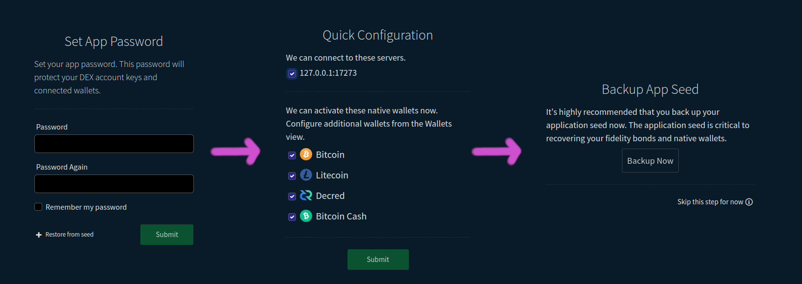
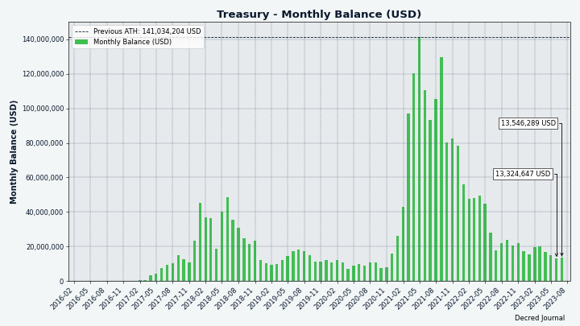
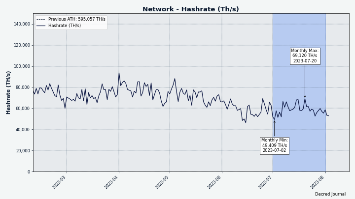
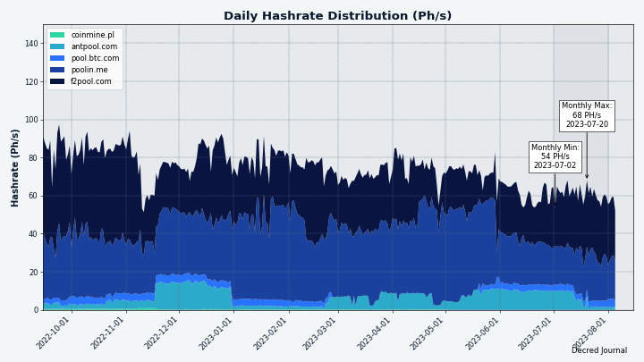
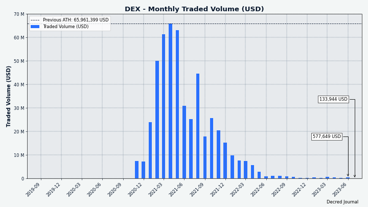

# Decred Journal – Lipiec 2023

_Obraz: Apogeum, aut. @Exitus_

Najważniejsze wydarzenia z lipca:

- Głosowania nad dwiema zmianami w zasadach konsensusu (funkcja haszowania PoW i podział dotacji PoW/PoS) zakończyły się niemal jednogłośnym poparciem a zmiany zostaną aktywowane pod koniec sierpnia (więc zaktualizuj swoje oprogramowanie do wersji 1.8).

- Cypherpunk Times uruchomił swoją przemianowaną stronę (dawniej Decred Magazine) a pierwszym projektem, który wniesie doń treści, poza Decred, jest Firo.

- Discord jest teraz ponownie połączony z pokojami Matrixa za pomocą nowego, ulepszonego mostu, który pozwala użytkownikom Matrixa blokować poszczególnych użytkowników Discorda. Poprawiono również procedurę zatwierdzania nowych członków na Discordzie.

Spis treści:

- [Zaktualizuj oprogramowanie przed nadchodzącym forkiem!](#upgrade-for-the-coming-fork)
- [Rozwój](#development)
- [Ludzie](#people)
- [Zarządzanie](#governance)
- [Sieć](#network)
- [Ekosystem](#ecosystem)
- [Nawiązywanie kontaktów](#outreach)
- [Media](#media)
- [Rynki](#markets)
- [Ważne kwestie i wiadomości poboczne](#relevant-external)

## Zaktualizuj oprogramowanie przed nadchodzącym forkiem!

Zakończyło się głosowanie nad dwiema zmianami konsensusu [Zmiana PoW na BLAKE3 i ASERT](https://github.com/decred/dcps/blob/master/dcp-0011/dcp-0011.mediawiki) i [Zmiana podziału dotacji PoW/PoS na 1/89](https://github.com/decred/dcps/blob/master/dcp-0012/dcp-0012.mediawiki), które zostały pierwotnie [zaproponowane na Politei](https://proposals.decred.org/record/a8501bc) w marcu 2023 roku.

Obie zmiany zostały **zatwierdzone** z ponad 99% głosów na tak i ponad 60% frekwencją wyborczą. Zmiany są teraz [zablokowane czasowo w kodzie](https://docs.decred.org/governance/consensus-rule-voting/overview/) i zostaną aktywowane w bloku 794,368 około 29 sierpnia. Pozostały do ich wprowadzenia czas można śledzić w [panelu głosowania](https://voting.decred.org/) lub w [sekcji agend na dcrdata ](https://dcrdata.decred.org/agendas).

Wszystkim użytkownikom zaleca się aktualizację do najnowszej wersji [podstawowego oprogramowania](https://github.com/decred/decred-binaries), [samodzielnej aplikacji DEX](https://github.com/decred/dcrdex/releases) lub [innych portfeli](https://decred.org/wallets/). Jak zawsze zalecamy [weryfikację plików](https://docs.decred.org/advanced/verifying-binaries) przed uruchomieniem.

<a id="development" />

## Rozwój

O ile nie zaznaczono inaczej, prace zgłaszane poniżej mają status „scalonych z repozytorium głównym (master)”. Oznacza to, że prace są ukończone, zrecenzowane i zintegrowane z kodem źródłowym, który zaawansowani użytkownicy mogą [kompilować i uruchamiać](https://medium.com/@artikozel/the-decred-node-back-to-the-source-part-one-27d4576e7e1c), ale ich efekty nie są jeszcze dostępne w wersji plików binarnych dla zwykłych użytkowników.

### dcrd

_[dcrd](https://github.com/decred/dcrd) jest pełną implementacją węzła, który obsługuje sieć peer-to-peer Decred na całym świecie._

Poniższe zmiany został scalone z gałęzią `master` ku przyszłym wydaniom:

- Zaktualizowano polecenia `GetBlock` i `GetBlockHeader`, aby pokazywały [nowy hasz dowodu pracy](https://github.com/decred/dcrd/pull/3154). Dla bloków po aktywacji [DCP-11: Zmiana PoW na BLAKE3 oraz ASERT](https://github.com/decred/dcps/blob/master/dcp-0011/dcp-0011.mediawiki), *hasz dowodu pracy* będzie nowym hashem BLAKE3. Dla bloków sprzed DCP-11, *hasz bloku* i *hasz proof of work* będą identyczne. Ta aktualizacja umożliwia konsumentom takim jak [dcrdata](#dcrdata) łatwy dostęp do nowych haszy.
- Zaktualizowano [obraz Dockera](https://github.com/decred/dcrd/pull/3158), aby zbudować plik binarny dcrd z nowszymi wersjami Go i Alpine Linux. Administratorzy węzłów mogą uznać Dockera za dobrą opcję bezpieczeństwa w przeciwieństwie do korzystania z maszyny wirtualnej, która ma znacznie większą powierzchnię ataku.
- Zaktualizowano serwer RPC do [dynamicznego przeładowywania nowych certyfikatów RPC](https://github.com/decred/dcrd/pull/3153) bez wyłączania i ponownego uruchamiania. Jest to poprawa jakości życia dla administratorów węzłów, ponieważ umożliwia im wymianę na gorąco pary certyfikat/klucz serwera, a także wszelkich potencjalnych certyfikatów klienta. Na przykład aktualizacja certyfikatu jest wymagana, gdy serwer RPC jest publicznie dostępny i zmienia się jego adres IP lub nazwa domeny. Innym przykładem jest sytuacja, w której certyfikaty klientów muszą zostać zmodyfikowane w celu odwołania klientów, dodania nowych lub umożliwienia istniejącym klientom zmiany kluczy prywatnych. Ta aktualizacja jest solidna, minimalizuje dostęp do dysku, nie wymaga zależności specyficznych dla platformy i jest odporna na błędy użytkownika, aby uniknąć zerwania działającej konfiguracji.
- Wyraźnie skonfigurowano klientów RPC łączących się z dcrd przez HTTP do [używania TLS v1.2 lub nowszego](https://github.com/decred/dcrd/pull/3169). Było to już domyślne minimum, ale teraz jest bardziej przejrzyste.

Zmiany deweloperskie oraz wewnętrzne scalone na gałęzi `master`:

- Zaktualizowano komentarze wyszczególniające [współczynniki obliczeniowe ASERT](https://github.com/decred/dcrd/pull/3156) w kodzie wydobywczym, aby były zgodne z komentarzami do kodu konsensusu.
- Dodano [nowy linter](https://github.com/decred/dcrd/pull/3157), rozwiązano niektóre [skargi dotyczące lintera](https://github.com/decred/dcrd/pull/3155) i przeniesiono [logikę lintingu](https://github.com/decred/dcrd/pull/3161) do własnego skryptu poza skryptem testowym.
- Zaktualizowano [Github Actions](https://github.com/decred/dcrd/pull/3159) i upewniono się, że działania ciągłej integracji odbywają się w [prawidłowej kolejności](https://github.com/decred/dcrd/pull/3166).
- Zaktualizowano [linter golangci](https://github.com/decred/dcrd/pull/3163) i zmieniono [metodę instalacji](https://github.com/decred/dcrd/pull/3162) z `curl` na `go install`, co ma tę zaletę, że zmniejsza potencjalne zagrożenia bezpieczeństwa wynikające z ataków na łańcuch dostaw. Ponadto zbuforowano plik binarny w celu szybszego uruchamiania w przyszłości.
- Obecne wersje Go mają mylący sposób obsługi pętli. Zarówno "pętle for", jak i "pętle zakresowe" traktują wewnętrzne zmienne pętli niejednoznacznie, co doprowadziło do powstania kodu, który jest trudny do odczytania i trudny do debugowania. Programiści musieli traktować pętle z dużą dozą ostrożności, wciąż jednak potencjalnie borykając się z irytującymi błędami. Pełne wyjaśnienie problemu można [przeczytać tutaj](https://go.googlesource.com/proposal/+/master/design/60078-loopvar.md), zwłaszcza sekcję, która mówi o [uzasadnieniu](https://go.googlesource.com/proposal/+/master/design/60078-loopvar.md#racjonalne-i-kompatybilne). Przyszłe wersje Go (prawdopodobnie 1.22) wprowadzą przełomową zmianę w sposobie obsługi pętli. Podczas gdy nowa semantyka pętli będzie mniej myląca i podatna na błędy, projekty będą musiały ustawić bardzo wysoką minimalną obsługiwaną wersję Go, aby uniknąć błędów podczas kompilacji ze starszym Go. Aby upewnić się, że kod dcrd będzie działał poprawnie z Go 1.22, a także pozostanie kompatybilny wstecz i poprawnie skompiluje się ze starszymi wersjami Go, [wszystkie niezbędne pętle zostały zaktualizowane](https://github.com/decred/dcrd/pull/3165). Pozwoli to uniknąć wszelkich potencjalnych problemów, zanim jeszcze będą miały szansę się pojawić.

### dcrwallet

_[dcrwallet](https://github.com/decred/dcrwallet) to serwer portfela używany przez wiersz polecenia oraz aplikacje graficzne._

Poniższe zmiany został scalone z gałęzią `master` ku przyszłym wydaniom.

Głównymi zmianami, które mogą zauważyć użytkownicy, są te związane z kupnem biletów za pośrednictwem VSP:

- Naprawiono uszkodzoną [logikę ponawiania](https://github.com/decred/dcrwallet/pull/2252) dla błędnych zakupów biletów VSP. Problem ten dotyczył wielu użytkowników. Wszelkie zakupy biletów, które zadziałały za pierwszym razem, pozostały nienaruszone, ale wszelkie zakupy, które napotkały błąd, nie były ponawiane, co prowadziło do tego, że bilety nie były dodawane do VSP, a głosy były pomijane. Na szczęście ponowna rejestracja biletu w innym VSP była obejściem, ale oczywiście był to kiepski UX.
- Naprawiono błąd, w wyniku którego [sprawdzenie statusu płatności](https://github.com/decred/dcrwallet/pull/2269) mogło być nieuzasadnienie opóźnione. Klient VSP opóźnia działania o pewien losowy czas, aby pomóc chronić prywatność. Przy tym nieprawidłowym obliczeniu opóźnienia portfel zgłaszał płatności jako niepotwierdzone przez maksymalnie 2 godziny do następnego sprawdzenia, podczas gdy w rzeczywistości opłata została wysłana i potwierdzona. Teraz portfel użytkownika zostanie zaktualizowany wcześniej.
- Wymaganie od klientów VSP [czekania na potwierdzenie opłat przez VSP](https://github.com/decred/dcrwallet/pull/2271) przed uznaniem biletu VSP za w pełni zakupiony. Eliminuje to wiele problematycznych skrajnych przypadków spowodowanych przez użytkowników transmitujących własne transakcje opłat, takich jak płacenie zbyt niskiej opłaty lub wysyłanie płatności na niewłaściwy adres. Jest to zapobiegawcza poprawka dla bardzo mało prawdopodobnych przypadków, które nie zostały zaobserwowane na wolności.
- Naprawiono błąd, w wyniku którego niektóre bilety VSP mogły być [pomijane i nieaktualizowane](https://github.com/decred/dcrwallet/pull/2266) na różnych etapach cyklu życia zarządzania biletami VSP. Żaden użytkownik nie zgłosił żadnych problemów spowodowanych tym błędem. Ulepszony kod obsługi błędów wykorzystuje nową funkcję `Errors.Join`, która została udostępniona po aktualizacji do wersji Go 1.20, co omówiono poniżej.

Zmiany deweloperskie oraz wewnętrzne scalone na gałęzi `master`:

Go 1.20 odblokowało [lepszą obsługę błędów](https://tip.golang.org/doc/go1.20#errors), co zainspirowało kilka zmian:

- Usunięto [nieużywaną zmienną](https://github.com/decred/dcrwallet/pull/2262) i mylącą [niestandardową funkcję błędu](https://github.com/decred/dcrwallet/pull/2263) z wewnętrznej definicji błędów dcrwallet.
- [Porzucono wsparcie dla Go 1.19](https://github.com/decred/dcrwallet/pull/2267) i zwiększono wsparcie dla Go 1.20 i 1.21.0-rc3. Wynika to z faktu, że Go 1.19 nie ma fukncji `Errors.Join`.
- Dodano nową funkcję [`Errors.Join`](https://github.com/decred/dcrwallet/pull/2268) ze standardowej biblioteki Go 1.20. Ta nowa funkcja to prosty sposób na połączenie kilku komunikatów o błędach. W Go 1.19 i wcześniejszych było to w pewnym stopniu możliwe dzięki funkcjom `Errors.Is`/`As`, ale zawinięte błędy mogły być ukryte, co utrudniało ich śledzenie. `Errors.Join` jest [znacznie lepszym rozwiązaniem](https://blog.devgenius.io/wrapping-multiple-errors-in-go-1-20-78163ef5fc2c).

Dodatkowo:

- Zaktualizowano [cache LRU](https://github.com/decred/dcrwallet/pull/2264), aby korzystał z Go Generics i akceptował wiele typów zmiennych. LRU to standardowy schemat buforowania, który usuwa najmniej ostatnio aktualizowane wartości po zapełnieniu pamięci podręcznej. Główną zaletą generycznej pamięci podręcznej LRU jest zmniejszenie duplikacji kodu i odblokowanie łatwiejszego ponownego jego użycia. Ma to dodatkową zaletę w postaci bardziej przejrzystego kodu poprzez określenie typów dla każdej nowej instancji pamięci podręcznej LRU, a także lepszą weryfikację kodu przez kompilator. Generics zostały [dodane w Go 1.18](https://go.dev/blog/go1.18) (marzec 2022) i są stosunkowo kontrowersyjne, ale tylko dlatego, że mają kompromisy, które deweloperzy muszą wziąć pod uwagę. W idealnej sytuacji kompilator Go traktowałby funkcje generyczne tak samo, jak funkcje z określonymi typami zmiennych, a każda z nich byłaby tak samo zoptymalizowana. W praktyce nie zawsze tak jest. Korzyści płynące z generycznych funkcji czasami przychodzą kosztem większej złożoności i [nieco wolniejszej wydajności](https://planetscale.com/blog/generics-can-make-your-go-code-slower). W tym przypadku dcrwallet obecnie w minimalnym stopniu korzysta z funkcji generycznych, więc wpływ na wydajność jest minimalny.
- Ulepszono i dopracowano [testy portfela](https://github.com/decred/dcrwallet/pull/2260), w tym usunięto zbędny kod.

### dcrctl

_[dcrctl](https://github.com/decred/dcrctl) to klient wiersza polecenia dla dcrd i dcrwallet._

Poniższe zmiany został scalone z gałęzią `master` ku przyszłym wydaniom:

- [Usunięto nieaktualne zależności](https://github.com/decred/dcrctl/pull/64) z głównego modułu i zaktualizowano moduły [dcrd i dcrwallet](https://github.com/decred/dcrctl/pull/67) do ich najnowszych wersji. W szczególności udostępnia to nowe, szczegółowe wyniki wywołań dcrd `getblock` i `getblockheader`.
- Zaktualizowano README, aby zalecić programistom korzystanie z lokalnych [Go Workspaces](https://github.com/decred/dcrctl/pull/66) podczas pracy z wersjami rozwojowymi dcrd i dcrwallet.

### Decrediton

_[Decrediton](https://github.com/decred/decrediton) to w pełni funkcjonalny desktopowy portfel ze zintegrowaną funkcją głosowania, mieszania StakeShuffle, Lightning Network, handlem na DEX i nie tylko. Działa z lub bez dostępu do pełnego łańcucha (tryb SPV)._

W toku:

- Aktualizacja do [React v18](https://github.com/decred/decrediton/pull/3851)
- [Funkcje backendowe Ledger](https://github.com/decred/decrediton/pull/3869) i [interfejs użytkownika](https://github.com/decred/decrediton/pull/3874)
- Aktualizacja tłumaczeń na [jęz. francuski](https://github.com/decred/decrediton/pull/3895) i [jęz. chiński](https://github.com/decred/decrediton/pull/3893)

W lipcu @norwnd zaproponował [przechowywanie z 2FA dla Decreditona](https://www.reddit.com/r/decred/comments/15cyod5/decrediton_2fa_hoddle_safely/) oparte na prostym multisigu 2 z 2. Pomysł polega na zapewnieniu bezpieczniejszego rozwiązania do przechowywania DCR poprzez użycie drugiego urządzenia do podpisywania transakcji, początkowo smartfona z Androidem. Powinno to chronić przed zagrożeniami, takimi jak słabe hasło szyfrowania portfela lub skradziony laptop. Dodatkowo, może to sprawić, że funkcje multisig będą bardziej dostępne dla zwykłych użytkowników, którzy nie mają umiejętności samodzielnego programowania rozwiązań multisig. Obecnie jest to wczesna faza dyskusji i opinii, ale podjęto pewne wysiłki w celu przetestowania funkcji multisig w dcrwallet i sprawdzenia, ile danych można przekazać w kodach QR.

### vspd

_[vspd](https://github.com/decred/vspd) to oprogramowanie serwera dla pul udziałów (Voting Service Provider). VSP oddaje głos za swoich użytkowników 24/7 oraz nie wchodzi w posiadanie żadnych środków, a tym samym nie może ich ukraść._

Zmiany zawarte w [wydaniu v1.2.1](https://github.com/decred/vspd/releases/tag/release-v1.2.1):

- Naprawiono logikę [rozgłaszania transakcji](https://github.com/decred/vspd/pull/398), aby nie generować błędu, gdy transakcja już istnieje (co nie stanowi problemu). Ten brakujący warunek błędu został zauważony podczas badania błędu [zepsutych powtórzeń transakcji](https://github.com/decred/dcrwallet/pull/2252) w kliencie VSP dcrwallet. Jest to poprawka zapobiegawcza i nie zgłoszono żadnych problemów spowodowanych tym błędem.

### Lightning Network

_[dcrlnd](https://github.com/decred/dcrlnd) to oprogramowanie węzła Lightning Network dla Decred. LN umożliwia przesyłanie natychmiastowych i niskokosztowych transakcji._

- Poprawiono [śledzenie zamkniętych kanałów](https://github.com/decred/dcrlnd/pull/187). W sieci głównej LN Decred zaobserwowano, że niektóre kanały, które zostały zamknięte na łańcuchu, są nadal ogłaszane w sieci. Chociaż główna przyczyna nie została ustalona, zmiana ta zmniejsza liczbę nieprawidłowych ogłoszeń o kanałach i ich negatywne skutki, szczególnie w przypadku węzłów działających w trybie SPV (takich jak klienci Bison Relay). Jest to realizowane poprzez zapisywanie identyfikatorów kanałów, o których wiadomo, że są zamknięte i wykorzystywanie tych informacji do pomijania nieprawidłowych aktualizacji lub unikania kosztownych operacji.

### DCRDEX

_[DCRDEX](https://github.com/decred/dcrdex) to niepowiernicza giełda, umożliwiająca handel bez konieczności zaufania, działająca dzięki technologii atomic swaps._

[Przeniesione poprawki](https://github.com/decred/dcrdex/pull/2432) do wprowadzenia w nowej łatce dla wersji v0.6:

- Serwer: [Zwiększenie limitów zleceń](https://github.com/decred/dcrdex/pull/2411), ponieważ użytkownicy blokują więcej środków w kaucjach i zapewniają, że konta z dodatnim poziomem zawsze mają dodatni limit zleceń, wystarczająco duży na co najmniej jeden lot. Powinno to naprawić niemożność składania zleceń przez niektórych użytkowników.
- Klient: Upewnienie się, że serwer jest świadomy, że klient [zakończył](https://github.com/decred/dcrdex/pull/2405) transakcję. W niektórych przypadkach klient nie informował serwera o zakończonym spasowaniu zleceń, co mogło negatywnie wpłynąć na reputację konta. Dzięki tej poprawce klient będzie ponawiał próbę wysłania wiadomości, dopóki serwer nie otrzyma i nie potwierdzi, że klient wykupił (otrzymał) środki.
- Klient: Zaktualizowano zależności [btcwallet i neutrino](https://github.com/decred/dcrdex/pull/2438), aby naprawić awarie wbudowanego portfela BTC. Programiści zwykle unikają aktualizacji zależności w wydanych wersjach, aby nie wprowadzać nowych błędów. Ten przypadek jest jednak wyjątkiem, biorąc pod uwagę kłopoty spowodowane przez błąd i fakt, że następna główna wersja DCRDEX jest wciąż dość odległa.

Poniższe zmiany został scalone z gałęzią `master` ku przyszłym wydaniom.

Klient:

- Ulepszono [przepływ konfiguracji aplikacji](https://github.com/decred/dcrdex/pull/2385). Po ustawieniu hasła aplikacji użytkownikowi zostanie wyświetlona strona szybkiej konfiguracji, która umożliwia włączenie serwerów DEX i wybranie portfeli do aktywacji. Następnie nowa strona przypomni użytkownikowi o utworzeniu kopii zapasowej ziarna aplikacji. Strona docelowa wyświetlana po zmianie konfiguracji na Portfele.
- [Przełączono](https://github.com/decred/dcrdex/pull/2372) z WebView do biblioteki [MacDriver](https://github.com/progrium/macdriver) na macOS. Umożliwia to natywne zachowanie macOS, takie jak: utrzymywanie aplikacji uruchomionej bez okien, tworzenie nowych okien i posiadanie menu ikon doku.
- Zezwolenie na [dokonywanie transakcji](https://github.com/decred/dcrdex/issues/2436), jeśli portfel nie jest zsynchronizowany i nie ma peerów do synchronizacji. Pozwala to uniknąć transakcji, które nigdy nie są wydobywane i dezorientują użytkowników.
- Naprawiono [wprowadzający w błąd komunikat startowy](https://github.com/decred/dcrdex/pull/2428) "wymagana czynność, aby umożliwić handel" z prośbą o dodanie większej kaucji. Może się to zdarzyć, gdy transakcje kaucji nie zostały jeszcze wysłane, a użytkownik musi po prostu poczekać, nie podejmując żadnych działań.
- Naprawiono błąd, w wyniku którego zielone trójkąty [znaczników własnych zleceń](https://github.com/decred/dcrdex/pull/2448) nie zawsze były wyświetlane na wykresie głębokości księgi zleceń.

Klient, zmiany wewnętrzne:

- Zaimplementowano funkcję składania wielu zleceń za jednym razem dla portfeli [Decred](https://github.com/decred/dcrdex/pull/2433), [Ethereum](https://github.com/decred/dcrdex/pull/2421) i tokenów Ethereum. Będzie to wykorzystywane przez boty do animacji rynku i może odblokować optymalizacje handlowe.
- Refaktoryzacja i ulepszenia kodu testowego.
- Zaktualizowano [zależności npm](https://github.com/decred/dcrdex/pull/2439), aby naprawić ostrzeżenia bezpieczeństwa (pakiety, których to dotyczyło, nie były używane przez DEX w czasie wykonywania).

Bitcoin, zmiany wewnętrzne:

- Naprawiono błąd w logice [wyboru monet](https://github.com/decred/dcrdex/pull/2435). Nie był on krytyczny, ponieważ dotyczył tylko funkcji `MultiTrade`, która nie jest jeszcze używana na produkcji.

Ethereum:

- Dodano [wartości fiat](https://github.com/decred/dcrdex/pull/2427) do formularza zatwierdzania tokenów. Jednorazowe zatwierdzenie jest wymagane, aby umożliwić kontraktowi swap obsługę tokenów (takich jak USDC) w imieniu użytkownika. Zarówno przyznanie, jak i cofnięcie tego pozwolenia wymaga niewielkiej transakcji ETH.

Najważniejsze zmiany z prac w toku:

- Decred: podwaliny pod [staking DCR](https://github.com/decred/dcrdex/pull/2290).
- Polygon: [praca nad infrastrukturą](https://github.com/decred/dcrdex/pull/2431), w tym kontrakt swapowy USDC.
- Dash: [obsługa pełnego portfela węzłowego](https://github.com/decred/dcrdex/pull/2424).
- Firo: [obsługa lekkiego portfela Electrum](https://github.com/decred/dcrdex/pull/2426).
- [Zarządzanie saldem](https://github.com/decred/dcrdex/pull/2332) dla botów animacji rynku.

_Obraz: Przeprojektowany przepływ konfiguracji aplikacji w DCRDEX_

_Obraz: Menu dokowe w macOS wyświetlać będzie wszystkie okienka DEX_

### dcrdata

_[dcrdata](https://github.com/decred/dcrdata) to eksplorator blockchaina Decred oraz danych off-chain, takich jak propozycje na platformie Politeia, rynków i ponadto._

- Dodano nowy hasz dowodu pracy BLAKE3 do [strony szczegółów bloku](https://github.com/decred/dcrdata/pull/1970). Jeśli dcrdata działa z dość nową wersją dcrd, [wykorzysta](https://github.com/decred/dcrdata/pull/1971) [nowo zaktualizowaną](https://github.com/decred/dcrd/pull/3154) komendę `GetBlockHeader`, aby szybciej uzyskać hasz PoW.

### Timestamply

_[Timestamply](https://github.com/decred/dcrtimegui) to darmowa usługa znakowania czasowego plików działająca na łańcuchu Decred. Znacznik czasowy udowadnia, że dany plik istniał w określonym momencie. Usługa ta ma szereg zastosowań w ochronie nienaruszalności danych._

- Zaktualizowano GitHub Actions do [budowania z wykorzystaniem Go 1.20](https://github.com/decred/dcrtime/pull/91), a także dodano lintery i naprawiono ich skargi.
- Biblioteka [JavaScript](https://github.com/decred/dcrtimejs) do oznaczania czasu Decred, dcrtimejs, została zaimportowana z jej [oryginalnej lokalizacji](https://github.com/tiagoalvesdulce/dcrtimejs), aby stać się częścią konta [decred](https://github.com/decred/dcrtimejs) na GitHub. Wydanie dcrtimejs v1.0.0 zostało sfinansowane przez Skarbiec jako kluczowy element propozycji [przeprojektowania usługi Timestamply](https://proposals.decred.org/record/855a506).

### Bison Relay

_[Bison Relay](https://github.com/companyzero/bisonrelay) to nowa platforma mediów społecznościowych peer-to-peer z silną ochroną przeciw cenzurze, inwiligacji, oraz reklamom, działająca na bazie Lightning Network projektu Decred._

Aplikacje GUI oraz wiersza polecenia:

- Dodano opcję konfiguracji `syncfreelist` w celu dostrojenia bazy danych bbolt używanej przez wewnętrzny węzeł Lightning Network. Ustawienie jej na `false` poprawia wydajność działania kosztem wydajności uruchamiania.

Aplikacja GUI:

- Ulepszono interfejs użytkownika komentarzy, teraz wątki komentarzy mogą być [zwinięte lub rozwinięte](https://github.com/companyzero/bisonrelay/pull/298).
- Naprawiono błąd, który powodował, że News Feed nie renderował [osadzonych obrazów](https://github.com/companyzero/bisonrelay/pull/296) i zamiast tego wyświetlał kod "--embed".

Aplikacja wiersza polecenia:

- Dodano podstawowe polecenie [`/backup`](https://github.com/companyzero/bisonrelay/pull/297).
- Dodano system [filtrowania treści](https://github.com/companyzero/bisonrelay/pull/265), który może blokować wyświetlanie wiadomości użytkownikowi końcowemu na poziomie klienta. Aby utworzyć regułę filtrowania, użytkownik musi określić, w jakim kontekście będzie ona działać (bezpośrednie czaty, czaty grupowe, posty, komentarze do postów lub wszystkie) i jaką zawartość powinna dopasować (mogą to być proste ciągi lub wyrażenia regularne). Wypróbuj `/help filters add` i `/help filters addrule` by dowiedzieć się jak to działa. Obecnie jest to dostępne tylko w aplikacji CLI, ale niskopoziomowe części mogą zostać podłączone do aplikacji GUI w przyszłości.

### Pozostałe

- Wszystkie starsze VSP (zwane wcześniej "stakepoolami") zostały [usunięte](https://github.com/decred/dcrwebapi/pull/158) z dcrwebapi, usługi, która zasila Decrediton i [listę VSP](https://decred.org/vsp/) na decred.org. Starsze VSP zostały wycofane wraz z [wydaniem vspd](https://blog.decred.org/2020/06/02/A-More-Private-Way-to-Stake/) w 2020 roku, a wszystkie znane serwery publiczne zostały wyłączone około 2022 roku.

<a id="people" />

## Ludzie

Statystyki społeczności na dzień 1. sierpnia (w porównaniu z 2. lipca):

- Obserwujący na [Twitterze](https://twitter.com/decredproject): 53 328 (-230)
- Subskrybenci na [Reddit](https://www.reddit.com/r/decred/): 12 747 (+9)
- Użytkownicy na [Matrixie](https://chat.decred.org/) w pokoju #general: 797 (+10)
- Użytkownicy na [Discordzie](https://discord.gg/GJ2GXfz):  1589 (+3), zweryfikowani z możliwością pisania: 643 (+8)
- Użytkownicy na [Telegramie](https://t.me/Decred): 2355 (-7)
- Subskrybenci na [YouTube](https://www.youtube.com/decredchannel): 4640 (+0), wyświetleń: 232,5K (+1,4K)

<a id="governance" />

## Zarządzanie

W lipcu nowy [Skarbiec](https://dcrdata.decred.org/treasury) otrzymał 7859 DCR o wartości 121 tys. USD po średnim lipcowym kursie wymiany $15,40. 4943 DCR zostało wydane, aby zapłacić kontrahentom, co stanowiło wartość $76K po kursie wymiany z tego miesiąca.

Transakcja [wypłaty ze Skarbca](https://dcrdata.decred.org/tx/bf3fcf63697c2191260690aa8471088e863e4f25434564196f8110464b669a51) została wydobyta 25. lipca stosunkiem 5274 głosów na "tak" i 37% udziale w głosowaniu i zawierała 32 wyjścia dokonujące płatności kontrahentom w przedziale od 1,5 DCR do 1692 DCR. Większość z tej sumy to zapłata za pracę z maja po kursie wymiany $17,13 a cała transakcja TSpend opiewa na równowartość $85K. Transakcja ta otrzymała 9 głosów sprzeciwu, co czyni ją drugą transakcją TSpend z niezerowym wynikiem głosów na "nie".

Na dzień 6. sierpnia, łączne saldo [starego](https://dcrdata.decred.org/address/Dcur2mcGjmENx4DhNqDctW5wJCVyT3Qeqkx) i [nowego Skarbca](https://dcrdata.decred.org/treasury) wynosi 865 895 DCR (12,6 miliona USD po kursie $14,56).

_Obraz: Niższy kurs wymiany DCR/USD przyczynia się do większych odpływów ze Skarbca_

_Obraz: Saldo Skarbca w równoważniku USD_

4 propozycje zakończyły głosowanie w lipcu:

- [Propozycja](https://proposals.decred.org/record/552c87e) sfinansowania rozwoju strony Decred.club z chińskojęzycznymi treściami i rozwoju społeczności wokół niej za $2400 została odrzucona przy 28% głosów na tak i 26% frekwencji.
- [Propozycja](https://proposals.decred.org/record/4d3a8fc), aby zmienić nazwę Decred Magazine na Cypherpunk Times i kontynuować jego produkcję przez kolejny rok ze zwiększonym budżetem w wysokości 44 000 USD - została zatwierdzona stosunkiem 95% głosów na tak i 47% frekwencji.
- [Propozycja](https://proposals.decred.org/record/9e265ad), aby wyprodukować 90-sekundowe filmy wideo z udziałem ludzi w maskach narciarskich mówiących o Decred w 12 językach kosztem 23 650 USD, została zatwierdzona 75% głosów na tak i 42% frekwencji.
- [Propozycja](https://proposals.decred.org/record/20ba5cd) stworzenia promocyjnej strony internetowej dla DCRDEX kosztem $2000 została odrzucona przy 30% głosów na tak i 34% frekwencji.

<a id="network" />

## Sieć

**Hashrate**: lipcowy [hashrate](https://dcrdata.decred.org/charts?chart=hashrate&scale=linear&bin=day&axis=time) na początku miesiąca wyniósł ~52 Ph/s, a zamknął go na poziomie ~55 Ph/s, zaliczając niż w ok. 49 Ph/s oraz szczyt w wys. 69 Ph/s w ciągu miesiąca.

_Obraz: Moc obliczeniowa projektu Decred_

Dystrybucja mocy obliczeniowej w wys. 55 Ph/s [zadeklarowana](https://miningpoolstats.stream/decred) przez pule wydobywcze na dzień 1. sierpnia: F2Pool 58%, Poolin 32%, BTC.com 8%, AntPool 3%.

Podział 1000 bloków [wydobytych](https://miningpoolstats.stream/decred) przed 1. sierpnia: F2Pool 52%, Poolin 38%, BTC.com 7%, AntPool 3%.

_Obraz: Historyczny wykres dystrybucji mocy obliczeniowej pul wydobywczych_

**Staking**: [Cena biletów](https://dcrdata.decred.org/charts?chart=ticket-price&axis=time&visibility=true-true&mode=stepped) wahała się między 196 a 277 DCR.

_Obraz: Cena biletów stabilizuje się_

[Zablokowana suma](https://dcrdata.decred.org/charts?chart=ticket-pool-value&scale=linear&bin=day&axis=time) to pomiędzy 9,73 a 9,87 miliona DCR, co oznacza, że 63,3-64,2% podaży dostępnej w obiegu [wzięło udział](https://dcrdata.decred.org/charts?chart=stake-participation&scale=linear&bin=day&axis=time) w elemencie Proof of Stake.

_Obraz: Całkowita kwota DCR zablokowana w biletach atakuje ATH_

_Obraz: Ilość przegapionych biletów w ciągu miesiąca spada po małym czerwcowym wzroście_

**VSP**: Na 1. sierpnia, ~6150 (-480) biletów w puli zarządzanych było przez [14 oficjalnych VSP](https://decred.org/vsp/), co stanowi 15,1% całej puli biletowej (-1,4%).

Największe wzrosty w lipcu odnotowały [bass.cf](https://vspd.bass.cf/) (+96 biletów, lub +15%) oraz [decredcommunity.org](https://vsp.decredcommunity.org/) (+37 biletów, lub +8%).

_Obraz: Podział biletów zarządzanych przez VSP_

**Węzły**: [Decred Mapper](https://nodes.jholdstock.uk/user_agents) odnotował między 162 a 170 węzłów dcrd w ciągu miesiąca. Wersje 164 węzłów odnotowanych 1. sierpnia to: v1.8.0 - 84%, v1.7.x - 11%, dev buildy v1.9.0 - 1,2%, dev buildy v1.8.0 - 0,6%, pozostałe - 4%.

_Obraz: Większość sieci działa na wersji v1.8.0_

_Obraz: Operatorzy węzłów błyskawicznie aktualizowali je do wersji v1.8.0. Czerwony obszar przed styczniem 2023 oznacza niekompletne dane, które posiadaliśmy na tę chwilę._

Ilość [monet mieszanych](https://dcrdata.decred.org/charts?chart=coin-supply&zoom=jz3q237o-la8vk000&scale=linear&bin=day&axis=time&visibility=true-true-true) wahała się w granicach 62,0-62,3%.
Dzienna [kwota mieszana](https://dcrdata.decred.org/charts?chart=privacy-participation&bin=day&axis=time) oscylowała w granicach 351K-486K DCR.

_Obraz: Wolumen DCR StakeShuffle_

_Obraz: Wolumen transakcji udał się na wakacje. [Metryka](https://coinmetrics.io/introducing-adjusted-estimates/) zdefiniowana przez Coin Metrics._

Eksplorator [Lightning Network](https://ln-map.jholdstock.uk/) sieci Decred na 1. sierpnia odnotował 219 węzłów (+7) oraz 445 kanałów (+18) o całkowitej pojemności 188 DCR (-3). Statystyki te zależą od węzła LN. Na przykład, tego samego dnia węzeł @karamble odnotował 220 węzłów oraz 464 kanały o pojemności 191 DCR.

_Obraz: Liczba węzłów Lightning Network sieci Decred powoli rośnie_

_Obraz: Pojemność Lightning Network sieci Decred ustabilizowała się w okolicach 200 DCR_

<a id="ecosystem" />

## Ekosystem

Voting Service Providers:

- Nowy VSP pod adresem [vote.dcr-swiss.ch](https://vote.dcr-swiss.ch/) przegłosował swoje pierwsze bilety mainnetowe i [złożył wniosek](https://github.com/decred/dcrwebapi/pull/178) o umieszczenie w portfelu Decrediton i na [stronie VSP](https://decred.org/vsp/). DCR Swiss ma niską opłatę w wysokości 0,25%. Spośród 14 istniejących VSP jest to trzecia najniższa opłata po dcrhive.com (0,1%) i vspd.bass.cf (0,2%).

Portfele:

- Portfele Decred na Androida i iOS przestaną się synchronizować pod koniec sierpnia, gdy aktywowane zostaną nowe [zasady konsensusu](https://voting.decred.org/). Aplikacje zostały usunięte z Google Play i Apple Store, aby uniemożliwić użytkownikom instalowanie aplikacji, które nie są już obsługiwane. Jeśli korzystałeś z portfeli Decred na Androida lub iOS, skontaktuj się z nami przez [ankietę na Reddicie](https://www.reddit.com/r/decred/comments/15eokjz/survey_have_you_used_decred_mobile_apps/).

Giełdy:

- EXMO [ogłosiło](https://info.exmo.me/ru/uvedomleniya/exmo-me-exclude-from-listing-five-crypto/) 6 lipca, że wycofa DCR i 3 inne tokeny do 20 lipca z powodu niskiej płynności. EXMO była jedyną giełdą, która wprowadziła DCR na giełdę za pośrednictwem niedrogiej [propozycji](https://proposals.decred.org/proposals/950e8149e594b01c010c1199233ab11e82c9da39174ba375d286dc72bb0a54d7), która została zatwierdzona w maju 2019 r. i zrealizowana w [czerwcu 2019 r.](https://exmo.com/en/news_view?id=2776).

- Członkowie #trading [odkryli](https://matrix.to/#/!lDZCzVQjFoJsXMPkvr:decred.org/$aTBeqNdAk4d03IEEybIk8WtVo-Wfe0JYFwVX0fZsIh4) 9 lipca, że DCR chodziło po około 20 USD na indyjskim [Bitbns](https://bitbns.com/trade/#/dcr), podczas gdy na innych giełdach było to około 16 USD. Od 31 lipca DCR nadal był notowany z premią i znacznym 24-godzinnym wolumenem wynoszącym 68 tys. USD, co czyni DCR/INR parą z pierwszej dziesiątki na Bitbns (jeśli oczywiście ufamy zgłoszonym wolumenom). [Wykres cenowy DCR](https://bitbns.com/trade/#/dcr) sugeruje, że listing projektu odbył się w maju 2022 roku.

Systemy komunikacyjne:

- Publiczny dostęp do Twittera był w większości [niedostępny](https://techcrunch.com/2023/07/05/twitter-silently-removes-login-requirement-for-viewing-tweets/) między 30 czerwca a 5 lipca. Przeglądanie Twittera wymagało logowania i podlegało ograniczeniom prędkości nawet dla płatnych kont. Według Elona Muska był to [tymczasowy środek nadzwyczajny](https://www.reuters.com/technology/twitter-now-needs-users-sign-view-tweets-2023-06-30/) w celu zwalczania botów AI, które pobierały tak dużo danych z Twittera, że skutecznie stały się atakiem typu denial of service. Ograniczenia publicznego API również [złamały Nittera](https://github.com/zedeus/nitter/issues/919), lekką alternatywę do przeglądania [@decredproject](https://nitter.net/decredproject) i innych kont. Wymóg logowania został [usunięty](https://techcrunch.com/2023/07/05/twitter-silently-removes-login-requirement-for-viewing-tweets/) 5 lipca. Pomimo wszystkich problemów i [rewelacji](https://twitter.com/elonmusk/status/1670117122650050561) Twitter pozostaje główną platformą Decred z 53,3 tys. obserwujących na dzień 1 sierpnia.

- Dwukierunkowy most między Matrixem a Discordem powraca! Stało się to możliwe dzięki nowemu przepływowi [weryfikacji użytkownika](202306.md#ecosystem), który znacznie lepiej zapobiega spamowi. Nowy most umożliwia blokowanie poszczególnych użytkowników Discorda po stronie Matrixa bez wpływu na innych użytkowników Discorda, co nie było możliwe w przypadku starego mostu. Ponadto edycja wiadomości powinna być propagowana w obu kierunkach. Nowy most jest hostowany przez [t2bot.io](https://t2bot.io/discord/), darmową usługę dostarczającą boty i mosty dla społeczności [Matrix](https://matrix.org/). Jest on obsługiwany przez jedną osobę i wspierany przez [darowizny](https://t2bot.io/donations/). W chwili pisania tego tekstu następujące pokoje Matrix są połączone z Discordem: #101, #dex, #marketing, #media, #memes, #proposals, #showerthoughts, #support i oczywiście #trading.

Pozostałe wiadomości:

- W maju zarówno [@StakeShuffle_](https://twitter.com/StakeShuffle_/status/1660015673102180353), jak i [@dcrtimestampbot](https://twitter.com/dcrtimestampbot/status/1660015663514107904) ogłosiły, że boty są "wyłączone do odwołania z powodu ostatnich zmian twitter-api". Boty zostały opracowane przez @cli\_query i sponsorowane w sumie przez 3 niskobudżetowe [propozycje](https://proposals.decred.org/user/3b9b30d5-1065-4e48-b1b6-3f558d0cb378?tab=submitted%20proposals). Wygląda na to, że czas deweloperów jest [ograniczony](https://proposals.decred.org/record/1a290d8) na utrzymanie tych projektów, ale kod źródłowy Pythona [StakeShuffle_](https://github.com/JC60522/StakeShuffle_BOT) i [dcrtimestampbot](https://github.com/JC60522/dcr_timestampbot) jest dostępny na GitHub dla współpracowników, którzy mogą go pobrać i ulepszyć.

- Uruchomiono [Cypherpunk Times](https://cypherpunktimes.com/). Więcej szczegółów w sekcji [Nawiązywania kontaktów](#outreach) poniżej.

Dołączcie do naszego kanału [#ecosystem](https://chat.decred.org/#/room/#ecosystem:decred.org), aby śledzić wszelkie nowości związane z ekosystemem Decred.

Uwaga: autorzy Decred Journal nie są w stanie ocenić wiarygodności żadnego z powyższych podmiotów czy ich usług. Uprasza się o dołożenie należnych starań i własnoręczną weryfikację informacji przed powierzeniem jakichkolwiek środków innym stronom.

<a id="outreach" />

## Nawiązywanie kontaktów

Pierwsza iteracja nowej publikacji typu multi-coin [Cypherpunk Times](https://cypherpunktimes.com/) jest już dostępna! Jest to kontynuacja i rebranding Decred Magazine, zatwierdzony i sfinansowany przez interesariuszy Decred w [lipcu 2023 r.](https://proposals.decred.org/record/4d3a8fc). Nowe konto mediów społecznościowych to `@cypherpunktimes` na [Twitterze](https://twitter.com/cypherpunktimes), [Facebooku](https://www.facebook.com/cypherpunktimes) i [podcastach Spotify](https://podcasters.spotify.com/pod/cypherpunktimes). Każde wsparcie jest bardzo mile widziane.

Firo jest pierwszym projektem, który współtworzy zawartość Cypherpunk Times. W lipcu Firo [włączyło](https://matrix.to/#/!NkCFEoJGXyDMwLfgMb:decred.org/$hoWcufElq2WAw5RcQ2GM1pE2ASKDme8q9-RZTQfvv04) 3 treści i opublikowało swój pierwszy [artykuł](https://www.cypherpunktimes.com/unveiling-spark-public-testnet-launch-date-confirmed/).

Konto TikTok `@decredmagazine` zostało przemianowane na [@dearcryptopunk](https://www.tiktok.com/@dearcryptopunk). W przyszłości jego zakres zostanie rozszerzony ze wspierania Cypherpunk Times na ogólny zasięg Decred i zostanie przeniesiony pod parasol propozycji [Decred Vanguard](https://proposals.decred.org/record/0a1b782). Konto na Twitterze [@decredmagazine](https://twitter.com/decredmagazine) będzie nadal działać, aby wspierać wyłącznie treści związane z Decred.

Statystyki aktywności Cypherpunk Times za lipiec:

- Całkowita liczba artykułów na Cypherpunk Times: 497
- Subskrybentów newslettera: 104
- Opublikowane nowe posty i newslettery: 18
- Aktywne kampanie w mediach społecznościowych: 68
- Zakończone kampanie w mediach społecznościowych: 2
- Posty w mediach społecznościowych: 128
- Polubienia: 496
- Retweety: 120
- Liczba obserwujących na wszystkich kontach i platformach mediów społecznościowych (w tym [@DecredSociety](https://twitter.com/DecredSociety) oraz starym [@decredmagazine](https://twitter.com/decredmagazine)): 1440

Totti z [BTC-ECHO](https://www.btc-echo.de/) zebrała dwie rundy opinii opublikowanych na [Politei](https://proposals.decred.org/record/49e373b) i pokoju [#writers](https://chat.decred.org/#/room/#writers:decred.org) i włączyła je do pierwszego niemieckiego artykułu. BTC-ECHO [zasugerowało](https://proposals.decred.org/record/49e373b/comments/30), aby przeczekać niższą aktywność sezonową i opublikować pierwszy artykuł w połowie sierpnia. Opóźnienie zostało wykorzystane do [dodania wzmianek](https://matrix.to/#/!NkCFEoJGXyDMwLfgMb:decred.org/$-Y8Sj1vafMV3bFwDTRyMavH9ab6ki2zntLvdmz6LBEw) o odporności na hardforki i zarządzaniu na łańcuchu, które są kluczowe dla konsensusu Decred.

Monde PR's achievements:

- Pitched two commentary opportunities
- Pitched three story ideas to target crypto publications
- Secured one media interview

Osiągnięcia Monde PR:

- Zaproponowano 2 możliwości umieszczenia komentarza
- Zaproponowano 3 pomysły na publikacje w mediach branży krypto
- Zdobyto 1 wywiad w mediach

Umieszczono w mediach poniższe artykuły:

- @Tivra wziął udział w [Twitter Space](https://twitter.com/i/spaces/1djGXlqNBeeGZ) prowadzonym przez podcast [The Rollup](https://twitter.com/therollupco), gdzie opowiedział o DCRDEX.

<a id="media" />

## Media

**Wybrane artykuły:**

- [Jak uruchomić DCRDEX na Raspberry Pi dzięki Umbrel](https://www.cypherpunktimes.com/how-to-dcrdex-on-raspberry-pi-with-umbrel/), aut. @karamble
- [Czy nadszedł czas, aby pokonać tradycyjne media społecznościowe?](https://www.cypherpunktimes.com/is-it-time-to-overcome-traditional-social-media/), aut. @Joao
- [Efekt falowania na regulacjach dotyczących kryptowalut](https://www.cypherpunktimes.com/the-ripple-effect-on-cryptocurrency-regulation/), aut. @Tivra
- [Decred vs Ethereum: Stawianie na przyszłość](https://www.cypherpunktimes.com/decred-vs-ethereum-staking/), aut. @Joao

**Wideo:**

- [Samodzielna aplikacja Decred DEX: Atomic-swapy w przeglądarce internetowej](https://www.youtube.com/watch?v=9U3fNFQFkkE), aut. @phoenixgreen - również jako [post tekstowy](https://www.cypherpunktimes.com/decred-dex-standalone-atomic-swaps-in-a-web-browser/)
- [Zdecentralizowana giełda Decred: Tworzenie kaucji](https://www.youtube.com/watch?v=5Z2jISaNkxc), aut. @phoenixgreen - również jako [post tekstowy](https://www.cypherpunktimes.com/decred-decentralized-exchange-creating-a-fidelity-bond/)
- [Zarządzanie siecią Lightning Network w Bison Relay: Jak zarządzac pojemnością kanałów](https://www.youtube.com/watch?v=LD54opBdkh8), aut. @phoenixgreen - również jako [post tekstowy](https://www.cypherpunktimes.com/bison-relay-lightning-network-management-how-to-rebalance-your-channels/)
- [Korzystanie z botów animatorów rynku na zdecentralizowanej giełdzie: pierwsze spojrzenie](https://www.youtube.com/watch?v=cyp_vnQRCXE), aut. @phoenixgreen - również jako [post tekstowy](https://www.cypherpunktimes.com/using-market-maker-bots-on-decentralised-exchange-first-look/)

Livestreamy:

- [Żyjąc na krypto & swoboda wymiany](https://www.youtube.com/watch?v=riW1HbhfoIw), aut. @phoenixgreen oraz @Exitus z udz. [Joel Valenzuela](https://twitter.com/TheDesertLynx) z Dash, Reuben Yap z Firo, oraz @Tivra

**Audio:**

- [Krypto ewolucja: Wzniesienie się ponad wahania rynkowe z wizją na przyszłość](https://twitter.com/i/spaces/1yNxaNYLwwqKj) - Twitter Space aut. @Tivra z udz. @Exitus i Joel Valenzuela omawiają zamknięcie DashDirect i Cake Pay, napiwki, usługi P2P i nie tylko - również jako [podcast](https://podcasters.spotify.com/pod/show/cypherpunktimes/episodes/Crypto-Evolution-Rising-Above-Volatility-with-Vision-e26qm28)

**Coś dla oka i serca:**

- Lipiec jest [Narodowym Miesiącem Żubra](https://nationaltoday.com/national-bison-month/) w USA.
- [Wyspa DEX](https://www.cypherpunktimes.com/dex-island/), aut. @OfficialCryptos
- [Infografika szoku podażowego](https://www.reddit.com/r/decred/comments/14vruz2/supply_shock_infographic_wip/), aut. @Tivra
- [Konkurs artystyczny Decred](https://twitter.com/exitusdcr/status/1680287503528370179), aut. @Exitus - czterech [zwycięzców](https://twitter.com/exitusdcr/status/1681067908699389952) otrzymało swoje DCR
- Konkurs na [zwięzłą prezentację Decred](https://twitter.com/WasPraxis/status/1680928961415589889), aut. @Tivra miał [dwóch zwycięzców](https://twitter.com/waspraxis/status/1684173637623119872)
- [Ranking posiadaczy Decred](https://matrix.to/#/!lDZCzVQjFoJsXMPkvr:decred.org/$Im4VJ9nJDedNOOCaKlxSu9a9N7HCA9fJEUd-W3ubVMY), aut. @Void

_Obraz: Ranking posiadaczy Decred, aut. @Void_

**Tłumaczenia:**

- [Jak uruchomić DCRDEX na Raspberry Pi dzięki Umbrel](https://www.cypherpunktimes.com/how-to-dcrdex-on-raspberry-pi-with-umbrel/) - w [jęz. chińskim](https://github.com/Decred-CN/articles/blob/master/How-To_DCRDEX_on_Raspberry_Pi_with_Umbrel.md) by @Dominic
- [Korzystanie z botów animatorów rynku na zdecentralizowanej giełdzie: pierwsze spojrzenie](https://www.cypherpunktimes.com/using-market-maker-bots-on-decentralised-exchange-first-look/) - w [jęz. chińskim](https://github.com/Decred-CN/articles/blob/master/Using%20Market%20Maker%20Bots%20on%20Decentralised%20Exchange:%20First%20Look.md)
- Należy pamiętać, że wszystkie treści przetłumaczone na język chiński są publikowane na WeChat od 2019 roku.
- Decred Journal z okresu maj-czerwiec otrzymał w sumie 3 nowe [tłumaczenia](https://xaur.github.io/decred-news/) na jęz. arabski (@arij, @abdulrahman4) i jęz. chiński (@Dominic). Dziękujemy za waszą pracę!

**Dyskusje społeczności:**

- [Próba odszyfrowania AT aut. @saender przez ChatGPT4](https://www.reddit.com/r/decred/comments/14wlx9u/some_technical_analysis_based_on_saender_post/)
- [Potrzebujemy nowego internetu](https://news.ycombinator.com/item?id=36676452) na Hacker News
- Odpowiedź na pytanie Jamesa Prestwicha ["czy Decred kiedykolwiek zmienił świat?"](https://twitter.com/_prestwich/status/1679630835019030531)

<a id="markets" />

## Rynki

W lipcu kurs wymiany DCR mieścił się w przedziale USDT 13,70-19,75 / BTC 0,00047-0,00064. Średni dzienny kurs wynosił $15,40.

Członkowie kanału \#trading [zaobserwowali](https://matrix.to/#/!lDZCzVQjFoJsXMPkvr:decred.org/$qOBXWvgSgINClwaPNzI9IXoqu9BLuqZdmJic2qTwMLw) ścianę o wartości 1 miliona dolarów na Binance DCR/USDT. Ponadto wolumeny handlowe na wszystkich rynkach były [niezwykle niskie](https://matrix.to/#/!lDZCzVQjFoJsXMPkvr:decred.org/$o6Rmw5-8oiHBwRIGWWnE3qMpJTXmm__ad7HoxyJVioo) w niektóre dni, prawdopodobnie ze względu na okres letni.

_Obraz: Osiągi DCR na tle innych monet prywatności, aut. @saender_

_Obraz: Metryki wyceny Decred aut. @bochinchero_

Powyższy [wykres](https://matrix.to/#/!lDZCzVQjFoJsXMPkvr:decred.org/$H540G0LtMAsa1Vc1ANY0A2Jf6CuN0uTyr6XKQO68nq8) opiera się na tym samym modelu [Staked Realized Value](https://bochinchero.medium.com/decred-on-chain-staked-realised-value-444ab5a146d8), który pokazaliśmy [w zeszłym miesiącu](202306.md#markets), ale z ceną zamiast kapitalizacji rynkowej.

_Obraz: DCR/BTC w okresie czerwiec-lipiec_

_Obraz: Miesięczny wolumen DCRDEX w USD zdecydowanie nie lubi lata_

<a id="relevant-external" />

## Ważne kwestie i wiadomości poboczne

Platforma pożyczkowa DeFi Curve, filar DeFi na Ethereum, została [zhakowana](https://twitter.com/CurveFinance/status/1685693202722848768). Włamanie polegało na użyciu nieprawidłowo działającej blokady reentrancy w niektórych wersjach Vyper, co sprawiło, że niektóre pule, ale nie inne, były podatne na opróżnienie. Podobne protokoły Metronome i Alchemix również zostały zaatakowane, a łącznie te 3 projekty [straciły](https://www.coindesk.com/markets/2023/08/04/looter-behind-61m-curve-hack-starts-returning-assets-raising-hope-for-recovery/) aktywa o wartości 61,7 milionów dolarów. Atakujący był w stanie opróżnić tylko niektóre z dotkniętych pul, ponieważ gdy akcja się rozpoczęła, wielu hakerów white hat wkroczyło do akcji, aby uratować swoje środki. Do 7 sierpnia 73% aktywów zostało [odzyskanych](https://www.coindesk.com/tech/2023/08/07/curve-recoups-73-of-hacked-funds-bolstering-crv-sentiment/), część od white hatów, ale także znaczne kwoty od atakującego. Curve oferował 10% premię za dobrowolny zwrot środków do 6 sierpnia, ale z ponad 18 milionami dolarów wciąż w posiadaniu hakera po terminie, szansa na zakończenie sprawy została utracona, a premia została otwarta dla publicznych śledczych, którzy mogliby pomóc w odzyskaniu środków.

Gitcoin [uruchomił](https://www.theblock.co/post/241425/gitcoins-layer-2-public-goods-network-goes-live-on-mainnet) Ethereum Layer 2 o nazwie Public Goods Network (PGN), korzysta ze stosu Optimism, a część opłat sekwencera zostanie zebrana w puli na finansowanie dóbr publicznych.

Arkham Intelligence uruchomił rynek danych tożsamości kryptowalut lub "[program doxxuj aby zarobić](https://protos.com/arkham-intelligence-draws-ire-for-dox-to-earn-program/)", gdzie użytkownicy mogą umieszczać nagrody za tożsamość niektórych adresów portfeli kryptowalutowych, a chętni badacze próbują odkryć, kto jest właścicielem portfela, aby otrzymać zapłatę. Arkham wykazał się również lekceważeniem własnych użytkowników, generując linki polecające przy użyciu łatwego do odwrócenia algorytmu [ujawniającego](https://www.coindesk.com/business/2023/07/10/crypto-startup-arkham-has-apparently-been-doxxing-privacy-obsessed-users-for-months/) adresy e-mail promotorów.

Worldcoin Sama Altmana [uruchomił](https://www.bbc.com/news/technology-66128111) swoje kule skanujące gałki oczne w 1500 lokalizacjach na całym świecie, umożliwiając ludziom skanowanie tęczówki w celu założenia portfela i otrzymania 25 darmowych WLD (o wartości ~50 USD). Perspektywa założyciela firmy zajmującej się sztuczną inteligencją, wysyłającego orby w świat w celu skanowania oczu ludzi w poszukiwaniu drobnej jałmużny, została potępiona jako dystopijna przez wielu w przestrzeni kryptowalut. Worldcoin nie jest popularnym projektem, jednak Vitalik Buterin opublikował niedawno blog [post](https://vitalik.eth.limo/general/2023/07/24/biometric.html) na temat biometrycznego dowodu osobowości, w którym wydaje się znajdować sporo zalet w podejściu Worldcoin, sugerując, że chroni on prywatność lepiej niż większość alternatywnych podejść do dowodu osobowości, choć nadal ma pewne negatywne aspekty. Dzień po uruchomieniu Worldcoin, brytyjski organ nadzorujący dane został [zgłoszony](https://protos.com/worldcoin-eyed-by-uk-data-watchdog-day-after-launch-avoided-us/), aby sprawdzić, czy jest on zgodny z przepisami o ochronie danych. W Kenii, gdzie Worldcoin był w kontakcie z Biurem Komisarza ds. Ochrony Danych od kwietnia, uważano, że działa legalnie, ale jego operacje skanowania zostały [zawieszone](https://www.coindesk.com/policy/2023/08/03/kenya-appears-to-have-flip-flopped-on-worldcoins-data-practices/) i nie jest jasne, czy zostało to narzucone przez Worldcoin w celu poprawy kwestii "kontroli tłumu" z długimi kolejkami na stacjach rejestracji, czy też władze [zmieniły](https://techcrunch.com/2023/08/02/kenya-suspends-worldcoin-scans-over-security-privacy-and-financial-concerns/) zdanie na temat jego legalności.

FedNow, amerykański rządowy system płatności natychmiastowych, został [uruchomiony](https://techcrunch.com/2023/07/21/fednow-is-finally-live-in-the-us/) z 35 instytucjami finansowymi skonfigurowanymi do korzystania z usługi, która umożliwia natychmiastowe rozliczenia 24/7. Jest to postrzegane jako wypełnienie luki, w której Stany Zjednoczone są dość daleko w tyle za innymi jurysdykcjami, które już mają takie możliwości natychmiastowych przelewów bankowych. Przewiduje się, że przyjęcie FedNow przez instytucje zajmie trochę czasu, aby usługa była szeroko dostępna dla użytkowników końcowych.

Token Engineering Commons (TEC) [zakończyło](https://medium.com/token-engineering-commons/expertise-and-quadratic-funding-bd4f0c5c3e23) pierwszą rundę swojego nowego programu grantowego, wykorzystując Quadratic Funding (podobnie jak granty Gitcoin) do dystrybucji puli finansowania w wysokości 25 000 USD i pobierając darowizny w wysokości 6 162 USD w celu jej zwiększenia i określenia, gdzie trafią dotacje. TEC dodał do zwykłego modelu Quadratic Funding (w którym większa liczba indywidualnych darowizn na rzecz projektu oznacza większą część puli dopasowania), dodając mechanizm wyrażania "wiedzy specjalistycznej". Darczyńcy, którzy posiadali tokeny TEC i/lub certyfikaty poświadczające wiedzę NFT w swoim portfelu, byli uważani za "ekspertów", a ich darowizny miały większą wagę przy określaniu kwoty dopasowania - miało to na celu rozwiązanie postrzeganego problemu, w którym projekty, które są dobre w mobilizowaniu wsparcia społeczności, radzą sobie najlepiej w rundach finansowania kwadratowego.

Ustawodawstwo [dotyczące](https://www.coindesk.com/policy/2023/07/28/us-stablecoin-bill-takes-big-step-despite-fight-from-democrats-white-house/) stablecoinów po raz pierwszy opuściło komisję w Kongresie Stanów Zjednoczonych, co oznacza, że wkrótce powinno zostać poddane pod głosowanie, a jeśli zostanie zatwierdzone, przekazane zostanie do Senatu. Projekt ustawy cieszył się ponadpartyjnym poparciem, ale Demokraci wycofali to poparcie na późnym etapie procesu z powodu niepowodzenia w negocjacjach w sprawie rozwiązania niektórych punktów spornych, co zmniejszyło szanse ustawy na wprowadzenie jej w życie. Jednym z kluczowych punktów sporu wydaje się być rola federalnego regulatora nadzorującego stablecoiny licencjonowane na poziomie stanowym, przy czym Demokraci naciskają na tego rodzaju nadzór, a Republikanie go odrzucają.

Szumnie zapowiadana runda aplikacji Bitcoin ETF od głównych instytucji finansowych [zawiera](https://www.coindesk.com/business/2023/07/11/blackrocks-bitcoin-etf-application-takes-surveillance-to-the-next-level/) nową funkcję, umowę współdzielności śledzenia (SSA) z Coinbase jako dostawcą informacji rynkowych, gdzie dostawcy ETF i organy regulacyjne mogą pobierać dane bezpośrednio, w tym zdolność do żądania od Coinbase informacji umożliwiających identyfikację osoby, jeśli jest to uznane za konieczne do zbadania lub zapobiegania manipulacjom na rynku. W poprzednich zgłoszeniach ETF dostawca rynku przekazywał organom regulacyjnym informacje o podejrzanej aktywności, SSA odwracają to, aby zapewnić większy nadzór. SSA z Coinbase zostało po raz pierwszy wprowadzone przez BlackRock, ale zostało skopiowane przez innych wnioskodawców w tej rundzie wniosków ETF.

Dokument Komisji Europejskiej dotyczący strategii Metaverse [wyciekł](https://www.coindesk.com/policy/2023/07/06/eus-leaked-metaverse-strategy-proposes-regulatory-sandbox-new-global-governance/) przed jego publikacją. Dokument opisuje potencjał wirtualnych światów jako "bezprecedensowych możliwości w wielu obszarach społecznych" oraz potrzebę usunięcia barier dla nowych form organizacyjnych, takich jak DAO, aby zrealizować ich korzyści.

Dyrektor generalny Coinbase, Brian Armstrong, [ujawnił](https://protos.com/sec-coinbase-demand-would-have-meant-end-of-crypto-in-the-us/), że na krótko przed złożeniem pozwu SEC zażądała od nich porzucenia wszystkich aktywów z wyjątkiem Bitcoina, co ułatwiło firmie skierowanie sprawy do sądu, ponieważ oznaczałoby to faktyczny koniec ich działalności w USA.

Australijska siedziba Binance została [najechana](https://protos.com/binance-australia-raided-by-regulator-just-weeks-after-europe-hq-raid/) przez Australijską Komisję Papierów Wartościowych i Inwestycji (ASIC) w ramach dochodzenia w sprawie nielegalnych transakcji na instrumentach pochodnych, które obejmowały błędne oznaczanie klientów detalicznych i instytucjonalnych. Binance również [wycofało](https://protos.com/binance-withdraws-germany-crypto-license-request-as-europe-bites-back/) swój wniosek o licencję w Niemczech, po tym jak powiedziano im, że nie zostanie ona przyznana w obecnej formie. Po tym, jak Binance US straciło swojego partnera bankowego, BTC zaczęło handlować z [przeceną](https://protos.com/scoop-major-crypto-arbitrage-fund-says-binance-us-discounts-arent-worth-risk/), coś podobnego wydarzyło się w Australii w maju.

Binance zakończyło [integrację](https://cointelegraph.com/news/binance-integration-bitcoin-btc-lightning-network) Lightning Network sieci Bitcoin.

Firma LBRY została [zamknięta](https://decrypt.co/148288/lbry-token-plummets-file-sharing-crypto-project-shuts-down) po przegranej sprawie przeciwko SEC, a jej sprzedaż tokenów LBC została zdefiniowana jako niezarejestrowana oferta papierów wartościowych wykluczono jej możliwość robienia tego bez uprzedniej "rejestracji w SEC". Protokół LBRY żyje dalej, nigdy nie był celem sporu sądowego, a status tokena LBC pozostaje niejednoznaczny co do tego, czy jest on obecnie papierem wartościowym, ponieważ SEC zbankrutowała zarejestrowane "wspólne przedsiębiorstwo", z którego posiadacze tokenów mieli czerpać zyski.

Richard Heart, twórca i główny beneficjent projektów Hex i PulseChain, został [pozwany](https://www.coindesk.com/policy/2023/07/31/us-sec-sues-richard-heart-hex-pulsechain-on-unregistered-securities-fraud-allegations/) przez SEC za naruszenie przepisów dotyczących oszustw związanych z papierami wartościowymi. Chociaż ekosystem Heart/Hex jest powszechnie uważany za oszustwo, [kilka](https://twitter.com/lex_node/status/1686030110443315200) osobistości prawnych kryptowalut [zasugerowało](https://twitter.com/collins_belton/status/1686064809467396096), że sprawa nie wydaje się zbyt mocna. Warunki HEX odnosiły się do poświęcania pieniędzy na mechanizm czarnej skrzynki, a sam Heart był bardzo [jasny](https://www.youtube.com/shorts/tlFC_NhoRsQ) w kwestii, że wydawał dużo dochodów na markowe ubrania, przedstawiając to jako część strategii marketingowej, która miała pomóc w pompowaniu ceny powiązanych tokenów.

Alex Mashinsky, były dyrektor generalny Celsius, został [aresztowany](https://protos.com/mashinsky-charged-by-doj-cftc-sec-and-ftc-year-on-from-celsius-bankruptcy/) i oskarżony o szereg przestępstw, w tym oszustwa bankowe i manipulacje rynkowe. Oskarżono również dyrektora ds. przychodów. Zgłoszenie wskazuje, że Celsius aktywnie manipulował ceną tokenów CEL, kłamiąc na temat kluczowych aspektów jego wydajności, pompując i dumpingując tokeny, aby spieniężyć duże sumy, 42 miliony dolarów rzekomo w przypadku Mashinsky'ego.

W [raporcie](https://www.elliptic.co/hubfs/Elliptic_Report_Crypto%20and%20the%20Global%20Fentanyl%20Trade.pdf) badacze Elliptic zidentyfikowali rosyjskie (Garantex) i australijskie giełdy kryptowalut jako kluczowych pośredników ułatwiających handel prekursorami fentanylu. Badacze [zidentyfikowali](https://protos.com/centralized-crypto-exchanges-used-to-buy-32m-in-fentanyl-precursors-elliptic/) i skomunikowali się z ponad 100 sprzedawcami, którzy byli gotowi do wysyłki Fentanylu lub jego prekursorów, a także śledzili adresy płatności kryptowalutowych, aby dowiedzieć się o ich innych transakcjach. W ten sposób odkryli adresy otrzymujące 19 mln USD w Bitcoinach i 13 mln USD w USDT, głównie z niektórych scentralizowanych giełd.

Bittrex [przypomniał](https://protos.com/bittrex-reminds-us-customers-to-withdraw-crypto-or-risk-unforeseen-issues/) swoim amerykańskim klientom, aby wycofali aktywa krypto z upadłej platformy, na co mają czas do 31 sierpnia, ale Bittrex sugeruje, aby zrobić to raczej wcześniej, niż później z obawy przed "nieprzewidzianymi problemami".

Technologia Blockchain ponownie otworzyła nowe możliwości w dziedzinie hazardu, wraz z [uruchomieniem](https://www.coindesk.com/markets/2023/07/21/move-over-shiba-inu-crypto-community-flirts-with-hamster-race-betting/) pierwszej na świecie [platformy do wyścigów chomików na żywo](https://hamsters.gg/), gdzie użytkownicy mogą wpłacać ETH, BNB lub BUSD i obstawiać, który chomik pierwszy przekroczy linię. Na podstawie obserwacji kilku wyścigów (które są transmitowane na Twitchu) chomiki nie tyle ścigają się, co wędrują (lub nie), wykazując bardzo małe zainteresowanie linią mety lub motywację, by dotrzeć tam jako pierwszy.

To wszystko na lipiec. Podzielcie się swoimi aktualizacjami do następnego numeru na naszym kanale [#journal](https://chat.decred.org/#/room/#journal:decred.org).

## O tym wydaniu

To 61. wydanie Decred Journal. Spis wszystkich wydań, mirrorów i tłumaczeń dostępny jest [tutaj](https://xaur.github.io/decred-news/).

Większość informacji od stron trzecich jest przekazywana bezpośrednio ze źródła po minimalnym sprawdzeniu poprawności. Autorzy Decred Journal nie mają możliwości zweryfikowania wszystkich publikowanych stwierdzeń. Proszę uważać na oszustwa i przeprowadzać własny research.

Zasługi (kolejność alfabetyczna):

- redakcja treści: bee, bochinchero, Exitus, jz, karamble, kozel, l1ndseymm, phoenixgreen, richardred, zippycorners
- recenzje i komentarze: davecgh, jholdstock
- ilustracja tytułowa: Exitus
- finansowanie: interesariusze Decred
