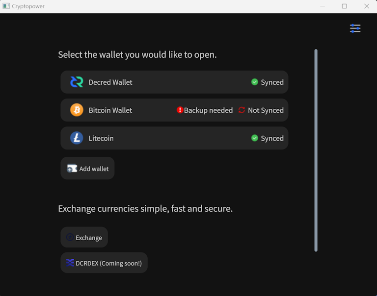

# Decred Journal – Sierpień 2023

_Obraz: Niezatytułowany, aut. @Exitus_

Najważniejsze wydarzenia z sierpnia:

- Dwie zmiany w zasadach konsensusu zostały aktywowane w sieci głównej Decred w celu zmniejszenia nagród za wydobycie i zmiany algorytmu wydobywczego. Zmiany te zakłócają działanie karteli wydobywczych ASIC i sprawiają, że wydobycie GPU jest bardziej dostępne dla przeciętnych użytkowników.

- Ukazała się pierwsza mainnetowa wersja portfela Cryptopower. Jest to nowy portfel bazujący na spuściźnie GoDCR i dodający portfele BTC i LTC, natychmiastową wymianę monet i nie tylko. Początkowo dostępny jako aplikacja desktopowa, ale aplikacje mobilne są obecnie w fazie rozwoju.

- Wydano Bison Relay v0.1.8 z ładowaniem historii czatu po ponownym uruchomieniu aplikacji, początkowymi funkcjami e-commerce i licznymi ulepszeniami UX w aplikacjach zarówno graficznych, jak i tekstowych.

- Scalono kod do obsługi portfeli pełnowęzłowych dla Dash i Firo w DCRDEX. Zaawansowani użytkownicy mogą ją wypróbować.

Spis treści:

- [Aktywacja nowych zasad konsensusu sieci](#new-consensus-rules-activated)
- [Wydanie portfela Cryptopower v1.0.0](#cryptopower-v100-release)
- [Wydanie wersji v0.1.8 Bison Relay](#bison-relay-v018-release)
- [Rozwój](#development)
- [Ludzie](#people)
- [Zarządzanie](#governance)
- [Sieć](#network)
- [Ekosystem](#ecosystem)
- [Nawiązywanie kontaktów](#outreach)
- [Media](#media)
- [Rynki](#markets)
- [Ważne kwestie i wiadomości poboczne](#relevant-external)

<a id="new-consensus-rules-activated" />

## Aktywacja nowych zasad konsensusu sieci

Zmiany w zasadach konsensusu pt. [Zmiana PoW na BLAKE3 i ASERT](https://github.com/decred/dcps/blob/master/dcp-0011/dcp-0011.mediawiki) i [Zmiana podziału dotacji PoW/PoS na 1/89](https://github.com/decred/dcps/blob/master/dcp-0012/dcp-0012.mediawiki) zostały aktywowane w sieci głównej Decred w bloku [794,368](https://dcrdata.decred.org/block/071683030010299ab13f139df59dc98d637957b766e47f8da6dd5ac762f1e8c7) 29 sierpnia. Wdrożenie tych zmian i aktywowanie ich w drodze głosowania zajęło około 5 miesięcy od momentu złożenia propozycji [Politeia](https://proposals.decred.org/record/a8501bc) w marcu.

Łańcuch był wstrzymany przez prawie 3 dni, dopóki górnicy CPU nie znaleźli pierwszych bloków i wszystko znów zaczęło działać. W następnym numerze zajmiemy się wczesnym rozwojem wydobycia na CPU i GPU. W chwili pisania tego tekstu wszystko znów wygląda stabilnie, a kolejne aktualizacje są w przygotowaniu.

Stare oprogramowanie nie będzie działać po forku z 29 sierpnia. Aby korzystać z oprogramowania Decred, upewnij się, że zaktualizowałeś oprogramowanie do [najnowszej wersji](https://github.com/decred/decred-binaries/releases), samodzielnej aplikacji [DCRDEX](https://github.com/decred/dcrdex/releases), [Cryptopower](https://github.com/crypto-power/cryptopower/releases) lub innego [portfela](https://decred.org/wallets/), z którego korzystałeś.

Gratulacje dla społeczności Decred za aktywację naszej [12. zmiany konsensusu](https://github.com/decred/dcps)!

<a id="cryptopower-v100-release" />

## Wydanie portfela Cryptopower v1.0.0

Cryptopower to nowy, niepowierniczy portfel do samodzielnego przechowywania DCR, BTC i LTC. Pierwsza publiczna wersja sieci głównej zawiera pakiet rocznych prac rozwojowych i nowych funkcji dodanych od czasu wycofania GoDCR w [sierpniu 2022 r.](202208.md#godcr). Najważniejsze funkcje:

- Wielomonetowy portfel dla DCR, BTC i LTC - wszystkie działające w trybie light (SPV) bez konieczności pobierania pełnych łańcuchów bloków.
- Staking Decred, mieszanie i zarządzanie - głosowanie nad zmianami konsensusu, wydatkami skarbowymi i propozycjami Politeia
- Konwersja monet za pośrednictwem scentralizowanych giełd, takich jak [Flyp.me](https://flyp.me/), [Godex.io](https://godex.io/), [ChangeNOW.io](https://changenow.io/) i innych.
- Niestandardowy wybór monet dla dodatkowej kontroli UTXO
- Niestandardowy limit luki
- Działa na systemach Windows, macOS, Linux, FreeBSD
- Możliwość tworzenia aplikacji mobilnych na Androida i iOS z tej samej bazy kodu

Pobierz aplikację dla swojego systemu operacyjnego [tutaj](https://github.com/crypto-power/cryptopower/releases). Upewnij się, że zweryfikowałeś pliki, jak wyjaśniono w [notatkach do wydania](https://github.com/crypto-power/cryptopower/releases/tag/release-v1.0.0); kompilacje są podpisane przez `Cryptopower <release@cryptopower.dev>` z odciskiem palca klucza `5C26BFEC6C2466A528D5551CD05AC74F68976E52`.

Kompilacje Android APK są [eksperymentalne](https://twitter.com/dreacot/status/1699963093940363668) i nie są jeszcze zalecane dla portfeli, z których zamierza się rzeczywiście korzystać, ale testerzy są mile widziani.

Raporty o błędach i opinie są mile widziane za pośrednictwem [GitHub Issues](https://github.com/crypto-power/cryptopower/issues) lub pokoju [#cryptopower](https://matrix.to/#/!oxOZZtibVUXxXtdPJS:decred.org) na Matrixie.

Więcej informacji:

- [Krótki film demonstracyjny](https://twitter.com/dreacot/status/1694260734878712220)
- [Wprowadzenie i zrzuty ekranu](https://www.cypherpunktimes.com/cryptopower-golang-native-desktop-mobile-wallet/)
- [Propozycja](https://proposals.decred.org/record/256efee) finansowania rozwoju Cryptopower
- [Status wersji desktopowej i mobilnej oraz duża lista funkcji](https://proposals.decred.org/record/256efee) porównanie Cryptopower, Decrediton, starych portfeli na Androida i iOS, Cake Wallet i DCRDEX
- [Q&A z głównym deweloperem @dreacot](https://www.cypherpunktimes.com/introducing-decred-developer-dreacot/)

_Obraz: Wybór portfela w Cryptopower w trybie ciemnym_

_Obraz: Strona wysyłania portfela Cryptopower_

_Obraz: Cryptopower wspiera zaawansowaną opcję wyboru monet dla dodatkowej kontroli nad poszczególnymi transakcjami_

_Obraz: Cryptopower pozwala na [wymianę monet](https://twitter.com/exitusdcr/status/1699366344813109572) bez dotykania przeglądarki internetowej_

<a id="bison-relay-v018-release" />

## Wydanie wersji v0.1.8 Bison Relay

To duże wydanie z nowymi funkcjami i ulepszeniami UX wprowadzonymi w ciągu ostatnich 4 miesięcy.

Główne zmiany w graficznym interfejsie użytkownika i aplikacji wiersza polecenia:

- Ładowanie historii czatu po ponownym uruchomieniu aplikacji
- Strony z hiperłączami (podobne do stron internetowych)
- Zwiększona niezawodność wymiany kluczy i wysyłania napiwków
- Liczne poprawki błędów

Najważniejsze zmiany w aplikacji GUI:

- Książka adresowa z wyszukiwaniem i filtrowaniem
- Kanał wiadomości z obrazami i ulepszonym sortowaniem
- Ulepszony interfejs powiadomień
- Poprawiona responsywność na mniejszych ekranach

Najważniejsze zmiany w aplikacji wiersza polecenia (brclient):

- Początkowe funkcje e-commerce
- Filtrowanie zawartości po stronie klienta
- Kopie zapasowe danych klienta

Początkowa infrastruktura e-commerce o nazwie "simplestore" została zaprojektowana do sprzedaży towarów wyłącznie cyfrowych, takich jak obrazy, filmy, audio i pliki. Obsługiwane metody płatności to Lightning Network sieci DCR, transfery DCR na łańcuchu oraz przetwarzanie niestandardowe/ręczne. Simplestore jest dostępny tylko w tekstowej aplikacji brclient w tym wydaniu.

Klienty GUI i CLI mają teraz odmienne funkcje. Zmiany dla każdej aplikacji są wymienione na [stronie wydania](https://github.com/companyzero/bisonrelay/releases/tag/v0.1.8); zwróć uwagę na powiadomienie o aktualizacji, jeśli migrujesz z wersji 0.1.7 na Windows. Pełna lista zmian wraz z objaśnieniami znajduje się w wydaniach [Decred Journal](https://xaur.github.io/decred-news/) od kwietnia do lipca 2023 roku. Instrukcje dotyczące weryfikacji plików znajdują się w pliku [README](https://github.com/companyzero/bisonrelay/blob/v0.1.8/README.md#verifying-binaries).

_Obraz: Wersja v0.1.8 Bison Relay pomaga w szybszym odnajdywaniu nowych komentarzy_

<a id="development" />

## Rozwój

O ile nie zaznaczono inaczej, prace zgłaszane poniżej mają status „scalonych z repozytorium głównym (master)”. Oznacza to, że prace są ukończone, zrecenzowane i zintegrowane z kodem źródłowym, który zaawansowani użytkownicy mogą [kompilować i uruchamiać](https://medium.com/@artikozel/the-decred-node-back-to-the-source-part-one-27d4576e7e1c), ale ich efekty nie są jeszcze dostępne w wersji plików binarnych dla zwykłych użytkowników.

### dcrd

_[dcrd](https://github.com/decred/dcrd) jest pełną implementacją węzła, który obsługuje sieć peer-to-peer Decred na całym świecie._

Większość pracy w tym miesiącu była skoncentrowana na programistach, a niekoniecznie na użytkownikach. Jednak zawsze jest to ciekawe, gdy obsługiwana jest nowa wersja Go, ponieważ odblokowuje ona potencjalne nowe funkcje i ulepszenia z poziomu samego języka kodowania (sprawdź aktualizacje dcrwallet z [lipcowego wydania](202307.md#dcrwallet), aby uzyskać tego przykłady).

Poniższe zmiany zostały scalone z gałęzią `master` ku przyszłym wydaniom:

- Zrezygnowano z oficjalnego wsparcia dla Go 1.19 i [dodano wsparcie dla Go 1.21](https://github.com/decred/dcrd/pull/3172) (Go 1.20 jest nadal obsługiwane). Obejmowało to aktualizacje przepływu pracy kompilacji GitHub Actions. Kompilacja z Go 1.19 jest nadal możliwa i jest bardzo prawdopodobne, że będzie działać dobrze, ale nie jest już aktywnie testowana.
- Zaktualizowano [obraz Docker](https://github.com/decred/dcrd/pull/3171), aby zbudować plik binarny dcrd z Go 1.21.0.
- Zoptymalizowano [przepływ budowania](https://github.com/decred/dcrd/pull/3168) GitHub Actions w celu zmniejszenia liczby zduplikowanych wpisów i spamu w pamięci podręcznej. Wiązało się to z usunięciem modułu Go i pamięci podręcznej kompilacji z przepływu pracy kompilacji GitHub, ponieważ najnowsza akcja `setup-go` domyślnie je buforuje, co powodowało tworzenie zduplikowanych wpisów w pamięci podręcznej. Linter jest nadal buforowany osobno, a aktualizacja obejmuje również niewielką zmianę nazwy pliku, aby uzyskać znacznie mniej obiektów pamięci podręcznej.
- Dodano scenariusz testowy do [testów ASERT](https://github.com/decred/dcrd/pull/3173), który zapewnia odpowiednie dostosowanie trudności, gdy czas wydobycia bloków przyspiesza.
- Dodano [linter zduplikowanych słów](https://github.com/decred/dcrd/pull/3175) i użyto go do [uporządkowania komentarzy](https://github.com/decred/dcrd/pull/3174) w 44 różnych plikach.
- [Usunięto nieużywane parametry](https://github.com/decred/dcrd/pull/3177) z kilku funkcji blockchain. Funkcje te są wewnętrzne, więc zmiana ta nie ma wpływu na klientów ani użytkowników.
- Dodano [linter błędów](https://github.com/decred/dcrd/pull/3179) i zaktualizowano wiele błędów, aby można je było [opakować w użyteczny kontekst](https://github.com/decred/dcrd/pull/3178). Pozwala to na ich rozpakowanie przez osoby wywołujące funkcje w celu zidentyfikowania źródła błędu. Ta aktualizacja pozwala błędom ładnie współpracować z `errors.Is` i `errors.As`.

Dokument [DCP-11](https://github.com/decred/dcps/blob/master/dcp-0011/dcp-0011.mediawiki) określający zmiany w BLAKE3 i ASERT został zrecenzowany i [wydany](https://github.com/decred/dcps/pull/29). Oto kilka interesujących faktów, które znaleźliśmy:

- Dokument wyjaśnia nowy hasz dowodu pracy, nowy algorytm dostosowywania trudności ASERT i reset trudności w bloku aktywacyjnym, a wszystko to w najdrobniejszych szczegółach wraz ze wzorami, diagramami i wskazówkami dotyczącymi implementacji.
- *Nagłówek bloku* pozostał dokładnie taki sam; jest to kompaktowa 180-bajtowa struktura, która przechowuje ważne metadane o bloku i umożliwia bardzo szybką synchronizację i nawigację po łańcuchu.
- *Hasz bloku* również pozostał niezmieniony; jest to ten sam 14-rundowy hash BLAKE-256 z *nagłówka bloku*. Większość oprogramowania Decred wykorzystuje hash bloku do identyfikacji bloków i nie wymaga żadnych modyfikacji.
- Zmieniono *hasz proof-of-work* na BLAKE3; jest on tworzony przez hashowanie *nagłówka bloku*. Jedynie oprogramowanie wydobywcze (i sprzęt) musi dostosować się do tego nowego algorytmu hashowania.
- Badania nad algorytmami trudności wykazały, że ASERT jest jednym z [najlepszych](https://github.com/zawy12/difficulty-algorithms/issues/50) w tej dziedzinie. Uwaga dodatkowa: algorytm trudności Bitcoina uzyskał najgorszą ocenę w 9. kategorii po wszystkich innych. W oparciu o te i inne badania Bitcoin Cash [przyjął](https://documentation.cash/protocol/forks/2020-11-15-asert.html) odmianę ASERT w listopadzie 2020 roku.
- Nowa trudność ASERT musi być obliczana dla każdego bloku, co jest 144 razy częstsze niż w przypadku poprzedniego algorytmu EMA. Algorytm ASERT można jednak obliczyć ~16x szybciej, więc ogólnie dcrd spędzi ~9x więcej czasu na uruchamianiu kodu ASERT. Na szczęście jest to długość rzędu mikrosekund na blok i nie stanowi żadnej praktycznej różnicy. Więcej informacji [tutaj](https://github.com/decred/dcps/pull/29#discussion_r1300314310).
- DCP-11 jest jak dotąd największym DCP, biorąc pod uwagę długość tekstu, liczbę plików i ogólny rozmiar. Jest bardzo dobrze wykonany i wszyscy entuzjaści Decred powinni [przeczytać go w całości](https://github.com/decred/dcps/blob/master/dcp-0011/dcp-0011.mediawiki).

Wyniki głosowania zostały dodane do wszystkich 12 [dokumentów DCP](https://github.com/decred/dcps), aby odnotować, w których historycznych blokach rozpoczęło się głosowanie, a także, kiedy zmiany konsensusu zostały zablokowane i aktywowane. Implementacje konsensusu Decred mogą wykorzystywać te numery bloków do optymalizacji logiki weryfikacji łańcucha i unikania zliczania historycznych głosów.

_Obraz: Wzór na trudność algorytmu ASERT jest dość prosty. Gdyby nasze procesory mogły po prostu uruchomić tę piękną matematykę bezpośrednio..._

_Obraz: Ale trzeba zejść na ziemię i zmierzyć się z brutalną rzeczywistością komputerów binarnych o ograniczonej precyzji. Ta dostosowana formuła jest zoptymalizowana do szybkiego działania na prawdziwym sprzęcie, z minimalnymi błędami._

### dcrwallet

_[dcrwallet](https://github.com/decred/dcrwallet) to serwer portfela używany przez wiersz polecenia oraz aplikacje graficzne._

Zmiany z okresu czerwiec-lipiec [przeniesione](https://github.com/decred/dcrwallet/pull/2277) do następnego wydania v1.8.x:

- [Ostrzeganie użytkowników](https://github.com/decred/dcrwallet/commit/1c1bcfbd5aa7ca0b1cbad06b4f1bb6b8c2af5aa5) o błędach płatności opłat VSP spowodowanych zablokowaniem portfela. Pozwoli to użytkownikom zareagować, jeśli zablokowany portfel blokuje płatności opłat VSP. Po zobaczeniu błędu użytkownik powinien odblokować portfel i spróbować ponownie, aby zapobiec pominięciu biletów.
- Naprawiono uszkodzoną [logikę ponawiania](https://github.com/decred/dcrwallet/commit/07854e3746aeef2de88488ae5cc87ee6a092387b) dla błędnych zakupów biletów VSP. Problem ten dotyczył wielu użytkowników. Nie miało to wpływu na zakupy biletów, które zadziałały za pierwszym razem, ale zakupy, które napotkały błąd, nie były ponawiane, co prowadziło do tego, że bilety nie były dodawane do VSP, a głosy były pomijane. Na szczęście ponowna rejestracja biletu w innym VSP była swoistym obejściem problemu, ale był to kiepski UX.
- Naprawiono błąd, w wyniku którego [sprawdzenie statusu płatności](https://github.com/decred/dcrwallet/commit/c4c6c4213da7cde5ecdc97fb5347a1c7bc3aeae2) mogło być nieuzasadnienie opóźnione. Klient VSP opóźnia działania o pewien losowy czas, aby pomóc chronić prywatność. Przy tym nieprawidłowym obliczeniu opóźnienia portfel zgłaszał płatności opłat jako niepotwierdzone przez maksymalnie 2 godziny do następnego sprawdzenia, podczas gdy w rzeczywistości opłata została wysłana i potwierdzona. Teraz portfel użytkownika zostanie zaktualizowany wcześniej.
- Wymaganie od klientów VSP [czekania na potwierdzenie opłat przez VSP](https://github.com/decred/dcrwallet/commit/7c551ce6b95456b6ec1a174b5529641dd133230a) przed uznaniem biletu VSP za w pełni zakupiony. Eliminuje to wiele problematycznych skrajnych przypadków spowodowanych przez użytkowników transmitujących własne transakcje opłat, takich jak płacenie zbyt niskiej opłaty lub wysyłanie płatności na niewłaściwy adres. Jest to zapobiegawcza poprawka dla bardzo mało prawdopodobnych przypadków, które nie zostały zaobserwowane na wolności.

Nowe zmiany scalone z gałęzią `master` i przeniesione do nowego wydania v1.8.x:

- Naprawiono kolejny błąd, w wyniku którego potwierdzenie transakcji opłaty za bilet VSP trwało dłużej niż było to konieczne, co było spowodowane tym, że wysokość bloku [wejścia do puli i wygaśnięcia](https://github.com/decred/dcrwallet/pull/2270) biletu nie była aktualizowana po jego wydobyciu. Działo się tak w przypadku większości biletów VSP. Opłata zostanie ostatecznie potwierdzona, jeśli portfel pozostanie uruchomiony. Ponowne uruchomienie portfela zsynchronizowałoby go od razu. Nie było ryzyka pominięcia głosów. Przeniesiona zmiana znajduje się [tutaj](https://github.com/decred/dcrwallet/commit/1319da0b05d4a9715b045e847ff58b442f407f39).

Zmiany skierowane do użytkowników scalone z gałęzią `master` ku przyszłym wydaniom:

- Dodano [rejestrowanie zmian transakcji zauważonych przez portfel](https://github.com/decred/dcrwallet/pull/2275) podczas ponownego skanowania. Funkcja ta jest wyłączona podczas początkowego ponownego skanowania (podczas resetu lub po ponownym uruchomieniu dcrwallet), ponieważ byłaby zbyt hałaśliwa. Wszelkie inne ponowne skanowania są zwykle wykonywane w celu naprawienia problemu, a dcrwallet rejestruje, gdy znajdzie nowe transakcje portfela wewnątrz starego bloku lub transakcje portfela, które wcześniej nie były wydobywane, ale teraz są wydobywane. Ponowne skanowanie nie jest przyjemne dla użytkowników i są na prawdę tylko doraźnym zabiegiem do synchronizacji portfeli, które się rozsynchronizowały. Posiadanie hashy pominiętych transakcji będzie pomocne w debugowaniu, dlaczego portfel miał problem z ich synchronizacją, i miejmy nadzieję, że zaowocuje poprawkami błędów, które zmniejszą potrzebę ponownego skanowania przez użytkowników.
- Dodano [sprawdzanie anulowania](https://github.com/decred/dcrwallet/pull/2276) do zakupów biletów niemieszanych przed opublikowaniem zakupu. Zakupy biletów mieszanych już sprawdzają anulowanie, więc może to rozwiązać jakieś brzegowe przypadki.
- Naprawiono przetwarzanie partii biletów VSP, jeśli [jeden z nich nie powiódł się](https://github.com/decred/dcrwallet/pull/2259). Podczas dodawania wielu biletów do klienta VSP, jeśli jeden z nich nie zostanie poprawnie dodany, pozostałe nie będą próbowane. Jest mało prawdopodobne, aby spowodowało to jakiekolwiek problemy w świecie rzeczywistym. Ta zmiana dodała również brakujące rejestrowanie, aby uświadomić użytkownikom, że dodanie niektórych biletów VSP nie powiodło się i sprawa może wymagać zbadania.

Zmiany wewnętrzne oraz deweloperskie:

- Przeniesiono logikę [znajdowania biletów zarządzanych przez VSP](https://github.com/decred/dcrwallet/pull/2259) z klienta VSP do głównego kodu portfela. Jest to część ciągłych wysiłków na rzecz refaktoryzacji logiki VSP i portfela.
- Dodano oficjalne [wsparcie dla Go 1.21](https://github.com/decred/dcrwallet/pull/2278) i zaktualizowano przepływ pracy kompilacji GitHub Actions.
- [Zastąpiono](https://github.com/decred/dcrwallet/pull/2265) wszystkie niegenerowane użycia `interface{}` z `any` w bazie kodu. Chociaż `any` jest tylko nowym aliasem, sprawia, że kod jest łatwiejszy do odczytania.

### dcrctl

_[dcrctl](https://github.com/decred/dcrctl) to klient wiersza polecenia dla dcrd i dcrwallet._

- Poprawiono instrukcje ustawiania [zmiennych środowiskowych](https://github.com/decred/dcrctl/pull/68) podczas budowania lub instalowania dcrctl.
- Zaktualizowano CI i dokumentację dla [Go 1.21](https://github.com/decred/dcrctl/pull/69).

### Decrediton

_[Decrediton](https://github.com/decred/decrediton) to w pełni funkcjonalny desktopowy portfel ze zintegrowaną funkcją głosowania, mieszania StakeShuffle, Lightning Network, handlem na DEX i nie tylko. Działa z lub bez dostępu do pełnego łańcucha (tryb SPV)._

Prace nad opakowaniem aplikacji:

- Decrediton v1.8.0 został dodany do repozytorium [Homebrew Cask](https://github.com/Homebrew/homebrew-cask/pull/149083) dla użytkowników macOS.
- Decrediton v1.8.0 został dodany do [winget](https://github.com/microsoft/winget-pkgs/pull/112385), menedżera pakietów instalowanego domyślnie w systemach Windows 10 i 11.

Pozostałe wiadomości:

- Pomysł na [uwierzytelnianie dwuskładnikowe dla Decreditona](https://www.reddit.com/r/decred/comments/15cyod5/decrediton_2fa_hoddle_safely/) aut. @norwnd został [wstrzymany](https://matrix.to/#/!DwNysKhaQPBPURaBGt:decred.org/$sn4rEGvdxLgITmVuwLrFXfQhPXbVqvMVkK1So_xa2DY) na rzecz zbadania rozwiązania ogólnego przeznaczenia z wykorzystaniem [multisig](https://gist.github.com/norwnd/890ad642985f4e9e9f7b1dd243b21f9e#long-term-we-need-decrediton-with-generic-multisig-support-right-) dla Decreditona, jeśli zaistnieje takie zapotrzebowanie. Obecnie w Decred nie ma graficznego interfejsu użytkownika dla rozwiązań multisig.

### vspd

_[vspd](https://github.com/decred/vspd) to oprogramowanie serwera dla pul udziałów (Voting Service Provider). VSP oddaje głos za swoich użytkowników 24/7 oraz nie wchodzi w posiadanie żadnych środków, a tym samym nie może ich ukraść._

Zmiany w funkcjonalności, które mogą zauważyć operatorzy VSP:

- Odczekanie, aż wszystkie inne zadania startowe zostaną zakończone, zanim rozpocznie się nasłuchiwanie [powiadomień z dcrd](https://github.com/decred/vspd/pull/407). Wcześniej nie było problemu z łączeniem się z dcrd, ale było to niepotrzebne i tworzyło bałagan w logach.
- Zmieniono wykrywanie [zagłosowanych i cofniętych biletów](https://github.com/decred/vspd/pull/413) z używania wywołania `TicketInfo` dcrwallet na używanie [filtrów GCS](https://github.com/decred/dcrd/tree/f69247ff2478057ddbbc6692fc96ff6520b6a8c1/gcs) z dcrd. [Zestawy kodowane Golombem](https://github.com/decred/dcps/blob/master/dcp-0005/dcp-0005.mediawiki#user-content-Golombcoded_Sets) (GCS) umożliwiają bardzo skuteczne wykrywanie transakcji, funkcja ta jest kluczowym elementem lekkich portfeli chroniących prywatność (SPV) Decred. Nowa metoda jest [bardziej niezawodna](https://github.com/decred/vspd/pull/413#issuecomment-1694228745), w wyniku czego administratorzy VSP mogą zauważyć, że vspd wykrywa niektóre historyczne zagłosowane/odwołane bilety, których `TicketInfo` nigdy nie wykryło.
- Dodano nową kontrolę integralności, która aktualizuje odwołane bilety w bazie danych, aby były odnotowywane jako [wygasłe lub pominięte](https://github.com/decred/vspd/pull/415). Początkowa wersja vspd nie była w stanie rozróżnić między wygasłymi i pominiętymi biletami i zgłaszała je wszystkie jako "odwołane". Wiedza o tym, ile zgłoszeń zostało pominiętych przez VSP, jest przydatna do [oceny jego niezawodności](https://github.com/decred/vspd/issues/268). Ta aktualizacja wykorzystuje sprytną heurystykę, aby odgadnąć wynik biletu na podstawie tego, ile czasu zajęło jego cofnięcie. Nie jest to w 100% dokładne, ale jest wystarczająco dobre do celów raportowania statystyk VSP.

Zmiany wewnętrzne i deweloperskie:

- Dodano test, aby upewnić się, że zakodowany na stałe [ciąg błędu](https://github.com/decred/vspd/pull/404) zwrócony z [securecookie](https://github.com/gorilla/securecookie) nie zmieni się nieoczekiwanie, gdy vspd zostanie zaktualizowany do nowszej wersji biblioteki.
- [Zastąpiono](https://github.com/decred/vspd/pull/401) użycie `interface{}` z `any`, podobnie jak w [dcrwallet](#dcrwallet).
- Zaktualizowano do [Go 1.21](https://github.com/decred/vspd/pull/402) i nowszych GitHub Actions. Testowanie z Go 1.19 zostało usunięte.
- Usunięto [logikę płatności opłat VSP po stronie klienta](https://github.com/decred/vspd/pull/403) z repozytorium vspd. [Pomysł](https://github.com/decred/vspd/issues/379) migracji całego kodu klienckiego VSP z dcrwallet do repozytorium vspd okazał się problematyczny, stworzył zależność kołową między vspd i dcrwallet, co jest [uciążliwe](https://matrix.to/#/!zefvTnlxYHPKvJMThI:decred.org/$_rzNyvnGedWeh_tnXWk5WDQKaj3TODeXbxRa9fg7CtY) i niewarte obciążenia związanego z utrzymaniem. Większość kodu klienta VSP została usunięta z vspd i będzie nadal znajdować się w repozytorium dcrwallet. Ostatecznie powinien on stać się wyeksportowanym pakietem, który może być ponownie wykorzystany przez oprogramowanie chcące dodać funkcje stakingu VSP. To, co pozostaje w repozytorium vspd, to absolutne podstawy, które będą przydatne dla każdego konsumenta API vspd: [typy danych](https://github.com/decred/vspd/blob/2db761e0727866fda0bc303432e443599a2d3b45/types/types.go) i [podstawowy klient HTTP](https://github.com/decred/vspd/blob/2db761e0727866fda0bc303432e443599a2d3b45/client/client.go) do komunikacji z vspd, w tym podpisywania żądań i weryfikacji podpisów odpowiedzi dla [dwukierunkowej odpowiedzialności](https://github.com/decred/vspd/blob/2db761e0727866fda0bc303432e443599a2d3b45/docs/two-way-accountability.md).
- Uproszczono [kod wyłączający](https://github.com/decred/vspd/pull/410). Został on odziedziczony po dcrwallet i był nieco bardziej elastyczny i złożony niż wymaga dla vspd.
- Różne [refaktoryzacje](https://github.com/decred/vspd/pull/408) w celu umożliwienia ponownego użycia kodu i poprawy kontroli integralności.
- Zmieniono sposób przekazywania [danych](https://github.com/decred/vspd/pull/409) wewnętrznie, aby usunąć duplikację i przygotować się na przyszłe zmiany.
- Naprawiono błąd związany z przetwarzaniem [powiadomień](https://github.com/decred/vspd/pull/412) nowych bloków z dcrd (nie miał on wpływu na żadną wydaną wersję).
- Usunięto [konteksty ze struktur](https://github.com/decred/vspd/pull/411) jako [rekomendowanych](https://pkg.go.dev/context) w dokumentacji biblioteki standardowej. Dodano [lintery](https://github.com/decred/vspd/pull/411), aby zapobiec temu i innym problemom, które pojawiły się podczas recenzji kodu.

### Lightning Network

_[dcrlnd](https://github.com/decred/dcrlnd) to oprogramowanie węzła Lightning Network dla Decred. LN umożliwia przesyłanie natychmiastowych i niskokosztowych transakcji._

- Przeniesiono zmiany wprowadzone w repozytorium [lnd](https://github.com/lightningnetwork/lnd) między wersją 0.11.1 a [v0.12.1](https://github.com/lightningnetwork/lnd/releases/tag/v0.12.1-beta) (wydaną w lutym 2021 r.). Przeniesiono 541 commitów rozproszonych w 220 PR-ach w repozytorium upstream, z czego [53 commity](https://github.com/decred/dcrlnd/commits?after=c97f63c8bc41977c6c9b6e5b62fb216e8157cef9+0&author=matheusd) były potrzebne do dostosowania bazy kodu do Decred. Pełną listę przeniesionych pull requestów można znaleźć [tutaj](https://github.com/decred/dcrlnd/blob/master/docs/upstream-prs.csv).

### DCRDEX

_[DCRDEX](https://github.com/decred/dcrdex) to niepowiernicza giełda, umożliwiająca handel bez konieczności zaufania, działająca dzięki technologii atomic swaps._

DCRDEX v0.6.2 jest już dostępny w [sklepie Umbrel](https://github.com/decred/umbrel-app-store).

Sierpniowe zmiany zawarte w wersji v0.6.3 (we wrześniu):

- Naprawiono możliwość wyświetlania nieprawidłowej [księgi zamówień](https://github.com/decred/dcrdex/pull/2449) w niektórych scenariuszach anulowania zamówień.

Pozostałe poniższe zmiany zostały scalone na gałęzi `master` ku przyszłym wydaniom.

Klient:

- Poprawiono [wyświetlanie ziarna aplikacji](https://github.com/decred/dcrdex/pull/2462) na stronie kopii zapasowej; będzie ono wyświetlane w grupach po 8 znaków.
- Zaimplementowano [ograniczenia konfiguracji](https://github.com/decred/dcrdex/pull/2454) dla portfeli kontrolowanych zewnętrznie. Może to ukryć ustawienia, takie jak zmiana hasła, jeśli interfejs graficzny DEX jest osadzony w Decreditonie i nie działa samodzielnie. W tym scenariuszu wszelkie zmiany w portfelu handlowym muszą być dokonywane z Decreditona, a zablokowanie ich w interfejsie DEX powinno uniemożliwić użytkownikom zepsucie portfela.
- Aktualizacja widoku [tytułu karty/okna](https://github.com/decred/dcrdex/pull/2458) przeglądarki podczas zmiany rynków. Zapewnienie również natychmiastowej wizualnej informacji zwrotnej, gdy użytkownik kliknie na inny rynek, np. wyczyszczenie wykresu głębokości, książki zleceń i ostatnich spasowań zamówień.

Serwer:

- Wysyłanie powiadomienia o karach tylko wtedy, gdy zmieni się [poziom użytkownika](https://github.com/decred/dcrdex/pull/2451), unikając niepotrzebnych powiadomień.

Decred:

- Dodano [fundamenty obsługi stakingu](https://github.com/decred/dcrdex/pull/2290).
- Ujawniono metody stakingu za pośrednictwem [JSON-RPC API](https://github.com/decred/dcrdex/pull/2316).
- Dodano metodę pobierania [listy dostawców usług głosowania](https://github.com/decred/dcrdex/pull/2466) z [api.decred.org](https://github.com/decred/dcrwebapi/blob/master/docs/api.md).
- Następnym krokiem jest stworzenie graficznego interfejsu użytkownika do stakingu.

Bitcoin:

- Naprawiono awarię podczas próby [rekonfiguracji](https://github.com/decred/dcrdex/pull/2474) brakującego lub uszkodzonego portfela BTC.

Dash:

- Dodano obsługę [pełnego portfela węzła](https://github.com/decred/dcrdex/pull/2424) dla DASH.
- Wymaga obowiązkowej aktualizacji Dash [v19.2.0](https://github.com/decred/dcrdex/pull/2484).

Firo:

- Zaimplementowano obsługę [lekkiego portfela Electrum](https://github.com/decred/dcrdex/pull/2426) dla Firo, w tym uprząż testową z zautomatyzowanym daemonem łańcucha Firo, serwerem ElectrumX i klientem portfela.

Postęp w [botach arbitrażowych i animatora rynku](https://proposals.decred.org/record/8b1ceda):

- Zaimplementowano [segregację salda](https://github.com/decred/dcrdex/pull/2332), która ogranicza ilość środków dostępnych dla każdego bota.
- Wdrożono [symulację](https://github.com/decred/dcrdex/pull/2409) rynków bocznych, trendów i zmienności. Zostanie to wykorzystane do [testowania zachowania bota](https://github.com/decred/dcrdex/issues/2303). Dla ciekawskich, dostępne symulacje rynkowe są udokumentowane [tutaj](https://github.com/decred/dcrdex/blob/8fad25372c4af9d0b378335e4a3dbd12f6ba0d22/dex/testing/loadbot/README.md).
- Zaktualizowano podstawową strategię animatora rynku, aby [składał wiele zleceń](https://github.com/decred/dcrdex/pull/2416) w różnych odległościach od ceny bazowej zamiast tylko jednego.
- Uwzględnienie możliwości [zwrotów](https://github.com/decred/dcrdex/pull/2479) w obliczeniach salda animatora rynku.

Dokumentacja:

- Dodano stronę wiki o [zarządzaniu kontami handlowymi DEX](https://github.com/decred/dcrdex/pull/2468) obejmującą tematy takie jak: tworzenie, korzystanie z istniejącego konta, wyłączanie, eksportowanie lub zarządzanie poziomem konta handlowego.
- Zaktualizowano [specyfikację](https://github.com/decred/dcrdex/pull/2470) dla nowych endpointów API.
- Dodano [instrukcje kompilacji](https://github.com/decred/dcrdex/pull/2476) dla aplikacji na macOS.

Zmiany wewnętrzne i deweloperskie:

- Dodano flagę [wyłączania wydobycia w tle](https://github.com/decred/dcrdex/pull/2452) w uprzęży testowej DCR.
- Ulepszenia refaktoryzacji i testowania.

Pozostałe:

- Wstępny plan rozwoju na [jesień 2023](https://github.com/decred/dcrdex/issues/2483) został opublikowany do przeglądu i dyskusji, w tym kilka ambitnych pomysłów, takich jak wykorzystanie walut.

_Obraz: Ochrona przed strzałem w stopę obroni nas przed przypadkowymi zmianami, które mogą zepsuć portfel podczas korzystania z DEX przed Decreditona_

_Obraz: Symulowany rynek boczny dla testów wydajności botów animatora rynku_

### Cryptopower

_[Cryptopower](https://github.com/crypto-power/cryptopower) to wielomonetowy desktopowy portfel z graficznym interfejsem dla DCR, BTC i LTC. Działa ze wsparciem dla chroniącego prywatność trybu lekkiego bez potrzeby pobierania pełnych łańcuchów wspieranych, wspiera staking, mieszanie, głosowanie oraz inne unikalne cechy Decred._

Ostatni raz pisaliśmy dzienniki deweloperów dla tego projektu w [sierpniu 2022 r.](202208.md#godcr), kiedy nosił on nazwę GoDCR. Oto krótkie podsumowanie dotychczasowej historii projektu:

- We wrześniu 2018 r. Raedah Group rozpoczęła eksperymenty z bibliotekami GUI odpowiednimi do budowy portfela Decred w czystym Go. Aplikacja w czystym Go ma potencjał, aby zapewnić większe bezpieczeństwo, lepszą wydajność i dotrzeć do większej liczby platform.
- Zbudowano pięć prototypowych interfejsów: wiersz poleceń, tekstowy interfejs terminala oparty na [tview](https://github.com/rivo/tview), interfejs przeglądarki internetowej oparty na [Stimulus](https://stimulus.hotwired.dev/), graficzny interfejs użytkownika wykonany w trybie natychmiastowym [nucular](https://github.com/aarzilli/nucular) oraz kolejny graficzny interfejs użytkownika wykonany w trybie zatrzymanym [Fyne](https://github.com/fyne-io/fyne). Te prototypy i [zrzuty ekranu](https://github.com/raedahgroup/godcr-old/wiki/Screenshots) są teraz zarchiwizowane [tutaj](https://github.com/raedahgroup/godcr-old).
- W wyniku tych badań inna biblioteka o nazwie [Gio](https://gioui.org/) została wybrana jako zwycięzca, a nowa aplikacja [GoDCR](https://github.com/planetdecred/godcr) została uruchomiona w styczniu 2020 roku.
- [Pierwsza propozycja rozwoju GoDCR](https://proposals.decred.org/proposals/e5c8051) została zatwierdzona w listopadzie 2020 r. z 92% poparciem.
- Pierwsza funkcjonalna wersja testowa została wydana we [wrześniu 2021 r.](https://xaur.github.io/decred-news/journal/202109).
- [Druga propozycja](https://proposals.decred.org/record/f7d9fc8) została odrzucona z 49% głosów na tak w październiku 2021 roku.
- Pierwsza wersja sieci głównej została wydana w [maju 2022 r.](https://xaur.github.io/decred-news/journal/202205).
- [Trzecia propozycja](https://proposals.decred.org/record/0ef42e5) łącząca GoDCR i istniejący rozwój portfela mobilnego została odrzucona z 20% poparciem w lipcu 2022 roku.
- Commity w repozytorium [godcr](https://github.com/planetdecred/godcr) zatrzymały się w sierpniu 2022 r., ale zaledwie 2 tygodnie później prace były kontynuowane na prywatnym forku.
- Po pełnym roku prywatnego rozwoju, rebrandingu na Cryptopower, wydanie v1.0.0 i nowa propozycja zostały [ujawnione](https://matrix.to/#/!aNnAOHkWUdNcEXRGjJ:decred.org/$Bz6ilL9i3WnaaHeAuWxEl8UOvuJrD9sNQIK8fC359lM).

Sierpień był stosunkowo spokojny pod względem rozwoju, podczas gdy zespół skupiał się na dostarczeniu [wstępnej wersji v1.0.0](#cryptopower-v100-release) i pracy nad [propozycją](https://proposals.decred.org/record/256efee), aby uzyskać finansowanie tego projektu.

Zmiany scalone na gałęzi `master` ku przyszłym wydaniom:

- Naprawiono błędy uniemożliwiające [zakup biletu](https://github.com/crypto-power/cryptopower/pull/44). Jeśli uiszczenie opłaty VSP nie powiodło się, można ją ponownie przesłać, otwierając stronę szczegółów biletu.
- Naprawiono awarię aplikacji po kliknięciu przycisku [Głosuj](https://github.com/crypto-power/cryptopower/pull/54) w celu zagłosowania na propozycję.

Biblioteka [instantswap](https://github.com/crypto-power/instantswap):

- Dodano funkcję sprawdzającą, czy [adres otrzymał](https://github.com/crypto-power/instantswap/pull/5) określoną kwotę.
- Portfel Cryptopower wykorzystuje bibliotekę instantswap do konwersji między monetami za pośrednictwem scentralizowanych usług, takich jak Flyp.me, Godex.io, ChangeNOW.io [i innych](https://github.com/crypto-power/instantswap/tree/a58863beed9541e9cfefce611b2a3392ef0a9c1d/instantswap). Zapewnia również narzędzia do sprawdzania adresów i transakcji za pośrednictwem różnych [eksploratorów bloków](https://github.com/crypto-power/instantswap/tree/a58863beed9541e9cfefce611b2a3392ef0a9c1d/blockexplorer).

Plan jest taki, aby naprawić błędy znalezione w początkowej wersji i rozwinąć funkcje opisane w [propozycji](https://proposals.decred.org/record/256efee), jednocześnie czerpiąc jak najwięcej z DCRDEX i innych projektów Decred.

Programiści i testerzy zainteresowani udziałem mogą dołączyć do czatów #cryptopower i #cryptopower-dev. Polecamy [ten przewodnik](https://docs.decred.org/getting-started/joining-matrix-channels/), aby dowiedzieć się, jak dołączyć do naszych czatów na Matrixie.

_Obraz: Portfel LTC w Cryptopower_

_Obraz: Interfejs użytkownika podczas tworzenia portfela w Cryptopower na Androidzie, trwają prace nad designem_

_Obraz: Eksperymentalny build Android portfela sprawdzany na prawdziwym urządzeniu_

### Dokumentacja

_[dcrdocs](https://github.com/decred/dcrdocs) to repozytorium źródłowe [dokumentacji użytkownika](https://docs.decred.org/) dla Decred._

- Zaktualizowano kilka stron dla [DCP-12](https://github.com/decred/dcrdocs/pull/1226). Strony [Przeglądu](https://docs.decred.org/), [Słowniczka](https://docs.decred.org/glossary/) i [Konstytucji](https://docs.decred.org/governance/decred-constitution/) mają teraz poprawny podział nagród blokowych. Dodatkowo, strona [Emisji](https://docs.decred.org/advanced/issuance/) dokumentuje teraz wszystkie trzy historyczne podziały (60/30/10, 10/80/10 i 1/89/10) i ma zaktualizowany wykres emisji.
- Zaktualizowano szablon [Material dla MkDocs](https://github.com/decred/dcrdocs/pull/1227) do wersji 9.2.6, która dodaje nową walidację linków wewnętrznych i elementów menu nawigacyjnego. Wystąpił [problem](https://github.com/squidfunk/mkdocs-material/issues/5924) z jedną wtyczką, ale opiekun naprawił go i wydał poprawioną wersję w ciągu zaledwie jednego dnia.

> Biorąc pod uwagę początkowy podział nagrody za blok dla pierwszych 794 367 bloków i zmodyfikowany podział rozpoczynający się od bloku 794 368, efektywny ostateczny podział wszystkich wydobytych monet wynosi:
>
> * 40,34% dla górników PoW
> 49,63% dla głosujących PoS
> * 10% dla Skarbca Decred \[[Emisja DCR](https://docs.decred.org/advanced/issuance/)\]

### decred.org

_[dcrweb](https://github.com/decred/dcrweb) to repozytorium kodu źródłowego strony [decred.org](https://decred.org/)._

- Dodano [ikony marki](https://github.com/decred/dcrweb/pull/1132) do wydań oprogramowania na stronie [Aktualności](https://decred.org/news/).
- Dodano [13 elementów](https://decred.org/news/) do strony Wiadomości.

### Bison Relay

_[Bison Relay](https://github.com/companyzero/bisonrelay) to nowa platforma mediów społecznościowych peer-to-peer z silną ochroną przeciw cenzurze, inwiligacji, oraz reklamom, działająca na bazie Lightning Network projektu Decred.__

Sierpniowe zmiany zawarte w wydaniu v0.1.8 zarówno dla aplikacji GUI, jak i wiersza polecenia:

- Rozpoznawanie linków [`lnpay://`](https://github.com/companyzero/bisonrelay/commit/66ebc67b02d758594bf86bf640c8f66d9f409fe5) i wyświetlanie ich jako przycisków, które mogą inicjować płatności LN.
- Dodano [informacje o wydaniu](https://github.com/companyzero/bisonrelay/pull/313), skróty i podpisy dla wydania v0.1.8. Dodano również instrukcje dotyczące [weryfikacji plików](https://github.com/companyzero/bisonrelay/tree/8f902aaa62bf3475d859fc3aef50474b7f98d03a#verifying-binaries) do pliku README.
- Pominięto błędne [kontrole ilości](https://github.com/companyzero/bisonrelay/pull/309) w dcrlnd do czasu ich naprawienia. Kontrole te mogą uniemożliwić klientowi wysyłanie wiadomości.

Zmiany w aplikacji z graficznym interfejsem użytkownika zawarte w wydaniu v0.1.8:

- Katalog danych Bison Relay w systemie Windows zostanie [przeniesiony do nowej lokalizacji](https://github.com/companyzero/bisonrelay/pull/307) z powodu problemów z MSIX i zaktualizowanym certyfikatem. Użytkownikowi zostanie wyświetlone ostrzeżenie i zalecenie wykonania kopii zapasowej przed kontynuowaniem.
- Lista [aktywnych czatów](https://github.com/companyzero/bisonrelay/pull/320) w książce adresowej. Wcześniej, jeśli czat był już otwarty, nie był wyświetlany w książce adresowej, a użytkownicy mogli być zdezorientowani, że brakuje niektórych kontaktów.
- Naprawiono [nazwę aplikacji](https://github.com/companyzero/bisonrelay/pull/322) wyświetlaną w Menedżerze zadań Windows.

Zmiany w aplikacji brclient zawarte w wydaniu v0.1.8:

- Dodano [śledzenie płatności simplestore](https://github.com/companyzero/bisonrelay/pull/303) dokonanych za pomocą faktur LN i transakcji DCR na łańcuchu. Dodano możliwość wysłania zakupionego pliku po potwierdzeniu płatności.
- Dodano [dokumentację](https://github.com/companyzero/bisonrelay/pull/311) dotyczącą konfiguracji simplestore.
- Naprawiono możliwość parsowania nieprawidłowych plików podczas [przeładowywania produktów](https://github.com/companyzero/bisonrelay/commit/57c8d48a2ad7cf8a88208e9d89c9e952bab13ae0) z dysku.

Poniżej podane zmiany zostały scalone na gałęzi `master` ku przyszłemu wydaniu, najprawdopodobniej wersji v0.1.9.

Wspólne zmiany dla aplikacji GUI oraz wiersza polecenia:

- Automatyczne anulowanie subskrypcji bezczynnych użytkowników i usunięcie ich z czatów grupowych. Jeśli klient peer jest bezczynny przez 21 dni, wysyłany jest automatyczny handshake w celu sprawdzenia, czy odpowie. Po 60 dniach, jeśli nadal nie ma odpowiedzi, bezczynny peer jest przymusowo wypisywany z postów lokalnego użytkownika i usuwany z czatów grupowych, w których lokalny użytkownik jest administratorem. Oba interwały czasowe mogą być skonfigurowane lub wyłączone przez użytkownika.

Zmiany w aplikacji GUI:

- Naprawiono funkcję [otwieranie linku](https://github.com/companyzero/bisonrelay/pull/318) zwracającą błąd zamiast otwierania linku w przeglądarce internetowej.

Zmiany w aplikacji brclient:

- [Generowanie](https://github.com/companyzero/bisonrelay/pull/332) plików stub simplestore, jeśli skonfigurowany katalog store istnieje, ale jest pusty. Wcześniej istniejący pusty katalog uniemożliwiał to.
- [Rozszerzenie](https://github.com/companyzero/bisonrelay/pull/330) zmiennych środowiskowych i `~` w poleceniu `/backup`.

Zmiany wewnętrzne i deweloperskie:

- Budowanie i testowanie z [Go 1.21](https://github.com/companyzero/bisonrelay/pull/315).
- Aktualizacja [zależności](https://github.com/companyzero/bisonrelay/pull/312).

### Pozostałe

- Koncepcja atomic swapu Monero z BTC lub BCH została [zaproponowana](https://github.com/decred/atomicswap/issues/129) w repozytorium atomicswap. Monero nie posiada prymitywów, takich jak hashowanie lub timelocki, potrzebnych do konwencjonalnych atomic swapów, ale proponowany schemat wymaga, aby tylko jeden z dwóch łańcuchów miał wystarczające możliwości skryptowe. Istnieje znaczne zainteresowanie tymi badaniami, a projekty takie jak [xmr-btc-swap](https://github.com/comit-network/xmr-btc-swap) z COMIT Network i [BasicSwap](https://particl.news/bidirectional-part-anon-and-xmr-atomic-swaps-now-live-on-basicswap-dex/) z Particl badają, jak zamienić Monero na waluty podobne do Bitcoina.

<a id="people" />

## Ludzie

Witamy nowych współtwórców:

- @tallamericano ([Cypherpunk Times](https://www.cypherpunktimes.com/author/tall/), autor)

Statystyki społeczności na dzień 2. września (w porównaniu z 1. sierpnia):

- Obserwujący na [Twitterze](https://twitter.com/decredproject): 53 306 (-22)
- Subskrybenci na [Reddit](https://www.reddit.com/r/decred/): 12 751 (+4)
- Użytkownicy na [Matrixie](https://chat.decred.org/) w pokoju #general: 805 (+8)
- Użytkownicy na [Discordzie](https://discord.gg/GJ2GXfz):  1661 (+72), zweryfikowani z możliwością pisania: 677 (+34)
- Użytkownicy na [Telegramie](https://t.me/Decred): 2303 (-52)
- Subskrybenci na [YouTube](https://www.youtube.com/decredchannel): 4640 (+0), wyświetleń: 234,6K (+2,1K)

<a id="governance" />

## Zarządzanie

W sierpniu nowy [Skarbiec](https://dcrdata.decred.org/treasury) otrzymał 7155 DCR o wartości 99 tys. USD po średnim sierpniowym kursie wymiany $13,89. 5961 DCR zostało wydane, aby zapłacić kontrahentom, co stanowiło wartość $83K po kursie wymiany z tego miesiąca.

Transakcja [wypłaty ze Skarbca](https://dcrdata.decred.org/tx/144c17b0542e4aecb6c2b00b905552b001055dcf8298a0cd8ce0c1409e4bb2e4) została wydobyta 28. sierpnia stosunkiem 7163 głosów na "tak" i 56% udziale w głosowaniu i zawierała 26 wyjść dokonujących płatności kontrahentom w przedziale od 7 DCR do 2036 DCR. Większość z tej sumy to zapłata za pracę z czerwca po kursie wymiany $14,25 a cała transakcja TSpend opiewa na równowartość $85K.

Na dzień 2. września, łączne saldo [starego](https://dcrdata.decred.org/address/Dcur2mcGjmENx4DhNqDctW5wJCVyT3Qeqkx) i [nowego Skarbca](https://dcrdata.decred.org/treasury) wynosi 865 779 DCR (11,1 miliona USD po kursie $12,81).

_Obraz: Wpływy i wydatki ze Skarbca w DCR_

_Obraz: Saldo Skarbca w równoważniku USD_

Zgłoszono 3 nowe propozycje:

- [Propozycja](https://proposals.decred.org/record/256efee) z prośbą o budżet w wysokości 61 600 USD na rozwój portfela Cryptopower, wielozasobowej wersji stanowiącej odrodzenie projektu GoDCR, napisanej w Go, aby była wieloplatformowa i przyjazna dla urządzeń mobilnych. Oprócz na Politei, wiele komentarzy zostało opublikowanych na [kanale propozycji](https://matrix.to/#/!qYpAAClAYrHaUIGkLs:decred.org/$dhl2WaQkMIKawUTXNg5Jrx30doUAvJkoFS2vD4d5AAs).
- [Propozycja](https://proposals.decred.org/record/2f25f2d) z prośbą o budżet w wysokości 80 000 USD na integrację początkowej i podstawowej obsługi DCR w [Cake Wallet](https://cakewallet.com/). Komentarze na czacie zaczynają się [tutaj](https://matrix.to/#/!qYpAAClAYrHaUIGkLs:decred.org/$PTJF15NZg5RqJgt_aDQfWOkh9YoJfI-bYwCKcwERpXU).
- [Propozycja](https://proposals.decred.org/record/b80040f) z prośbą o 15 000 USD na napisanie i opublikowanie dwóch artykułów o Decred na [Odaily](https://www.odaily.news/) chińskojęzycznej stronie z wiadomościami z branży krypto.

Zapraszamy do lektury [wydania 63](https://blockcommons.red/politeia-digest/issue063/) Politeia Digest  po więcej szczegółów na temat zgłoszonych w tym miesiącu propozycji.

<a id="network" />

## Sieć

**Hashrate**: sierpniowy [hashrate](https://dcrdata.decred.org/charts?chart=hashrate&scale=linear&bin=day&axis=time) na początku miesiąca wyniósł ~59 Ph/s, a zamknął go na poziomie ~0 Ph/s, zaliczając niż w ok. 0 Ph/s oraz szczyt w wys. 65 Ph/s w ciągu miesiąca. Ten spadek prawie do 0 PH/s związany jest z aktywacją [DCP-11](https://github.com/decred/dcps/blob/master/dcp-0011/dcp-0011.mediawiki), która wymiotła dotychczasową moc obliczeniową z sieci i spowodowała blisko trzydniowy przestój sieci, podczas którego nie były wydobywane nowe bloki. Koniec końców, jednak, trudność wydobycia została dostosowana odpowiednio do mocy obliczeniowej i normalne funkcjonowanie sieci zostało przywrócone, co szczegółowo opiszemy w następnym wydaniu.

_Obraz: Moc obliczeniowa projektu Decred_

Dystrybucja mocy obliczeniowej w wys. 54 Ph/s [zadeklarowana](https://miningpoolstats.stream/decred) przez pule wydobywcze na dzień 29. sierpnia (ostatni dzień z rzetelnymi danymi od pul wydobywczych): Poolin 46%, F2Pool 44%, BTC.com 7%, AntPool 3%.

Podział 1000 bloków [wydobytych](https://miningpoolstats.stream/decred) przed 29. sierpnia: Poolin 44%, F2Pool 40%, BTC.com 6%, AntPool 3%, nieznany 7%.

_Obraz: Historyczny wykres dystrybucji mocy obliczeniowej pul wydobywczych_

**Staking**: [Cena biletów](https://dcrdata.decred.org/charts?chart=ticket-price&axis=time&visibility=true-true&mode=stepped) wahała się między 236 a 244 DCR.

_Obraz: Cena biletów w sierpniu była zaskakująco stabilna_

[Zablokowana suma](https://dcrdata.decred.org/charts?chart=ticket-pool-value&scale=linear&bin=day&axis=time) to pomiędzy 9,76 a 9,81 miliona DCR, co oznacza, że 63,2-63,7% podaży dostępnej w obiegu [wzięło udział](https://dcrdata.decred.org/charts?chart=stake-participation&scale=linear&bin=day&axis=time) w elemencie Proof of Stake.

**VSP**: Na 1. września, ~5,900 (-250) biletów w puli zarządzanych było przez [14 oficjalnych VSP](https://decred.org/vsp/), co stanowi 14,5% całej puli biletowej (-0,6%).

Największe wzrosty w sierpniu odnotowały [dcr.farm](https://vsp.dcr.farm) (+220 biletów, lub +193%) oraz [bass.cf](https://vspd.bass.cf/) (+183 biletów, lub +25%).

_Obraz: Podział biletów zarządzanych przez VSP_

**Węzły**: [Decred Mapper](https://nodes.jholdstock.uk/user_agents) odnotował między 157 a 167 węzłów dcrd w ciągu miesiąca. Wersje 157 węzłów odnotowanych 1. września to: v1.8.0 - 88%, v1.7.x - 5%, dev buildy v1.8.0 - 2%, dev buildy v1.9.0 - 1.3%, pozostałe - 4%.

_Obraz: Większość węzłów działa na dcrd v1.8.0. Czerwony obszar przed styczniem 2023 oznacza niekompletne dane, którymi na ten czas dysponowaliśmy._

Ilość [monet mieszanych](https://dcrdata.decred.org/charts?chart=coin-supply&zoom=jz3q237o-la8vk000&scale=linear&bin=day&axis=time&visibility=true-true-true) wahała się w granicach 62,45-62,5%.
Dzienna [kwota mieszana](https://dcrdata.decred.org/charts?chart=privacy-participation&bin=day&axis=time) oscylowała w granicach 0-497K DCR. Niż w wysokości 0 DCR spowodowany był brakiem wydobytych bloków w dwóch ostatnich dniach miesiąca.

Eksplorator [Lightning Network](https://ln-map.jholdstock.uk/) sieci Decred na 1. września odnotował 213 węzłów (-6) oraz 431 kanałów (-14) o całkowitej pojemności 186 DCR (-3). Statystyki te zależą od węzła LN. Na przykład, tego samego dnia węzeł @karamble odnotował 217 węzłów (-3) oraz 453 kanały (-11) o pojemności 192 DCR (+1).

_Obraz: Liczba węzłów Lightning Network sieci Decred ustabilizowała się_

<a id="ecosystem" />

## Ekosystem

Gotowość usługodawców i stron trzecich na hardfork w okolicach 29. sierpnia:

- 25 sierpnia [Binance ogłosiło](https://www.binance.com/en/support/announcement/binance-will-support-the-decred-dcr-and-multiversx-egld-network-upgrades-hard-forks-969d5dee8218430aa94310e6820d41eb), że wpłaty i wypłaty zostaną zawieszone do czasu ustabilizowania się łańcucha po forku, jednak nie będzie to miało wpływu na handel.

- Poloniex wydał komunikat [25 sierpnia](https://support.poloniex.com/hc/en-us/articles/17020071785111), który jest bardzo podobny do komunikatu Binance. Został on również opublikowane na ich [Telegramie](https://t.me/PoloniexAnnouncements/2453).

- Jedyną komunikacją ze strony Bittrex, jaką udało nam się znaleźć, była ogólna odpowiedź na Twitterze ["więcej informacji wkrótce"](https://twitter.com/BittrexGlobal/status/1694979576512872708). Witryny wsparcia Bittrex Global nie zawierają żadnych wzmianek o ["Decred"](https://bittrexglobal.zendesk.com/hc/en-us/search?utf8=%E2%9C%93&query=Decred), a tylko 2 stare strony dla zapytań ["DCR"](https://bittrexglobal.zendesk.com/hc/en-us/search?utf8=%E2%9C%93&query=DCR).

- 25 sierpnia [F2Pool ogłosił](https://f2pool.zendesk.com/hc/en-us/articles/22224378432665-Closing-DCR-mining-pool) ([mirror](https://f2pool.io/mining/updates/#20230825)), że zakończy usługi wydobywcze DCR w dniu aktualizacji sieci. Wypłaty DCR zostaną zakończone w ciągu tygodnia po aktualizacji sieci. Użytkownicy mogą pobrać historię swoich nagród za wydobycie do 2023-09-29.

- Poolin ogłosił zamknięcie puli wydobywczej DCR w dniu [28 sierpnia](https://help.poolin.me/hc/en-us/articles/22324428533273-Announcement-on-Closing-DCR-Mining-Pool) i uprzejmie [powielił ją](https://matrix.to/#/!lDZCzVQjFoJsXMPkvr:decred.org/$_acFN1O8kvkZHBVl7OxecDrFewDkma_7omNGOJrBUKE) na czacie [Decred na Telegramie](https://t.me/Decred). W powiadomieniu ostrzegano użytkowników puli, aby skonfigurowali lub wyłączyli swoje koparki, ponieważ zarobki zostaną znacznie zmniejszone po forku, i wezwano do jak najszybszego wycofania DCR z puli. Niezwykłym szczegółem jest to, że w przeciwieństwie do innych dostawców, Poolin całkowicie przegapił *zmianę algorytmu wydobywczego* na BLAKE3 i planował uruchomić pulę przez 1-2 dni *po* forku, "abyś miał więcej czasu na skonfigurowanie swoich koparek".

- Ta lista obejmuje tylko aktualizacje, które pojawiły się na czatach Decred. Jeśli masz więcej wiadomości, nie wahaj się podzielić nimi na kanale #ecosystem!

Systemy komunikacyjne:

- stakey.net [uruchomił](https://matrix.to/#/!ggjLwhBHTjsMROezFf:decred.org/$FhjfyYqxHoPF3m6lMkWhk6Pf3txJpA3facOHWOLjRMI) przekaźnik Nostr pod adresem `wss://nostr.stakey.net` oraz klienta webowego pod adresem [citadel.stakey.net](https://citadel.stakey.net/), zasilanego przez [snort](https://github.com/v0l/snort). Klient sieciowy Nostr zastępuje serwer Mastodon, który wcześniej był hostowany na tej samej domenie. Mastodon był używany do ogłoszeń [stakey.net](https://stakey.net/). Był również otwarty dla członków społeczności Decred do rejestracji i publikowania postów, ale był mało używany i ostatecznie został [zamknięty](https://matrix.to/#/!ggjLwhBHTjsMROezFf:decred.org/$K3iSve6SAtBeCK2sBy1abK3ImA0FgbjzuC04UmXriis) na rzecz Nostr. Użytkownicy Nostr mogą śledzić [stakeynet](https://citadel.stakey.net/p/npub1feh69xgmqfmxf5rjf44x6wfyntuz3mzlxcrymucxa0k2af5uzysqmlgx6j), aby uzyskać aktualizacje usług dotyczące tego VSP.

Pozostałe wiadomości:

- Dwóch członków społeczności Decred zwróciło się do giełdy Kraken z prośbą o umieszczenie DCR na liście za pośrednictwem [formularza zgłoszeniowego](https://matrix.to/#/!lDZCzVQjFoJsXMPkvr:decred.org/$xZe0qWBllVIePmjOPqvNKyuEYda7EvrK9kulXUX-268) i [Twittera](https://twitter.com/longtermdaily/status/1688517496628711424). Było to robione wiele razy w przeszłości, szanse są niskie, ale nie zaszkodzi próbować dalej. Ponadto wielu członków kanału #trading [oceniło DCR](https://matrix.to/#/!lDZCzVQjFoJsXMPkvr:decred.org/$CtHJaU81BKb_Cvi_zWMuzWxGty21CU2XaDy8gUXLWSY) w aplikacji Coinbase, mając nadzieję, że więcej wyszukiwań i ocen coś zmieni.

Dołączcie do naszego kanału [#ecosystem](https://chat.decred.org/#/room/#ecosystem:decred.org), aby śledzić wszelkie nowości związane z ekosystemem Decred.

Uwaga: autorzy Decred Journal nie są w stanie ocenić wiarygodności żadnego z powyższych podmiotów czy ich usług. Uprasza się o dołożenie należnych starań i własnoręczną weryfikację informacji przed powierzeniem jakichkolwiek środków innym stronom.

<a id="outreach" />

## Nawiązywanie kontaktów

<a id="monde-pr" />

### Monde PR

Sierpniowe osiągnięcia Monde PR:

- Zaproponowano jedną aktualizację do wybranej publikacji z branży krypto
- Zaproponowano 4 pomysły na artykuły w publikacjach branży krypto

Umieszczono w mediach poniższe artykuły:

- Artykuł w [BeInCrypto](https://beincrypto.com/blockchain-reform-democracy-decred-co-founder/) na temat tego, jak blockchain może ujawnić fałszywe wiadomości i pomóc w poprawie demokracji. Artykuł analizuje, w jaki sposób Decred został wykorzystany w wyborach w Brazylii i mówi o roli, jaką mogą odegrać media społecznościowe, przedstawiając szczegóły dotyczące Bison Relay, z cytatami aut. @jy-p. Artykuł został rozesłany do ośmiu publikacji, w tym [Bitcoin Linux](https://www.bitcoinlinux.com/2023/08/10/blockchain-can-expose-fake-news-and-help-improve-democracies-says-decreds-co-founder/) i [Trading View](https://www.tradingview.com/news/beincrypto:d5091a62a094b:0-blockchain-can-expose-fake-news-and-help-improve-democracies-says-decred-s-co-founder/).
- Artykuł został również opublikowany w [hiszpańskiej](https://es.beincrypto.com/blockchain-puede-exponer-fake-news-mejorar-democracias-reporte/) wersji BeInCrypto, która została rozesłana do [Cryptocity.press](https://cryptocity.press/noticias/blockchain-puede-exponer-fake-news-y-mejorar-las-democracias-segun-reporte).
- Artykuł w [ZyCrypto](https://zycrypto.com/3ac-founders-slammed-with-2-6-million-fine-by-dubais-regulator-over-new-exchange/) z komentarzem @jz na temat upadku 3AC. Artykuł był dystrybuowany do trzech publikacji, w tym [Bitcoin Crypto](https://bitcoin-crypto.nl/zycrypto-com-3ac-founders-slammed-with-2-6-million-fine-by-dubais-regulator-over-new-exchange/).
- Artykuł w [Cryptonews.com](https://cryptonews.com/news/decred-launches-bison-relay-v018-revolutionizing-e-commerce-with-decentralized-shopify.htm) na temat wydania Bison Relay v0.1.8, w tym szczegóły dotyczące nowych funkcji, infrastruktury Simplestore i cytaty od @jy-p. Artykuł został rozesłany do trzech publikacji, w tym [Globe Echo World News](https://globeecho.com/business/crypto/decred-launches-bison-relay-v0-1-8-revolutionizing-e-commerce-with-decentralized-shopify/).
- Akapit w [CoinDesk's "Protocol Village"](https://www.coindesk.com/tech/2023/08/28/protocol-latest-tech-news-crypto-blockchain/) podsumowujący wiadomości na temat wydania Bison Relay, z linkami do strony Decred i GitHub.
- Artykuł w [The Currency Analytics](https://thecurrencyanalytics.com/crypto-exchanges/revolutionizing-online-shopping-bison-relay-unveils-latest-upgrade-paving-the-way-for-decentralized-e-commerce-67167.php) na temat wydania Bison Relay, w tym szczegóły dotyczące nowych funkcji i tego, jak aktualizacja "toruje drogę dla zdecentralizowanego handlu elektronicznego".

W dyskusji na temat ostatnich propozycji marketingowych @l1ndseymm skomentowała różnice między marketingiem a PR:

> Korzystne jest posiadanie zarówno strategii PR, jak i marketingowej, ponieważ mogą się one wzajemnie uzupełniać i ogólnie wzmacniać wyniki. Marketing jest z natury droższy niż PR. Firmy wydają około 10% swoich przychodów na marketing.
>
> Przekazałam informację zwrotną na temat propozycji Cointelegraph, że idealną sytuacją byłoby posiadanie osoby zajmującej się marketingiem, która wcześniej zarządzała wydatkami na reklamę. Istnieje tak wiele opcji - moglibyśmy sponsorować/reklamować się w biuletynach, podcastach, billboardach, mediach społecznościowych, oprócz płatnych treści, takich jak te. Osoba ta mogłaby zasugerować budżet, a następnie doradzić, które platformy i media przyniosą najlepsze wyniki w oparciu o naszych odbiorców / cele. Następnie może śledzić wyniki i dostosowywać strategię w miarę postępów. Często mają dostęp do specjalnych stawek i wiedzą, co jest uczciwe pod względem cen. \[[@l1ndseymm](https://matrix.to/#/!qYpAAClAYrHaUIGkLs:decred.org/$nXniE7jvWEt3H1J6UrEh6oejVdz6JeWifATWj12xk0c)\]

<a id="decred-vanguard" />

### Decred Vanguard

Testowaliśmy kilka taktyk zaangażowania na małą skalę, takich jak niedawny [giveaway](https://twitter.com/exitusdcr/status/1685994386339897344) (pula nagród 100 USD, 15 uczestników, 2 zwycięzców), który wymagał od uczestników udowodnienia rzeczywistej instalacji portfela.

Poza tym zwolniliśmy tempo, próbując zastanowić się nad najlepszymi sposobami poruszania się po rynku niedźwiedzia, na którym zainteresowanie i wolumen są znacznie niższe niż zwykle. Podczas gdy metoda marketingowa Vanguard koncentruje się na próbach mówienia o Decred *dużo*, w tej chwili wolelibyśmy być realistami i twardo stąpać po ziemi podczas konfigurowania nowych strategii.

[Decred Vanguard](https://proposals.decred.org/record/0a1b782) zawsze poszukuje nowych, chętnych członków, którzy pomogą nam promować Decred. Korzyści są proste - 100$ miesięcznie w Decred za uczestnictwo i opłacone konto Twitter Blue! Organizacja odbywa się na serwerze Discord. Jeśli masz jakieś unikalne pomysły na promowanie Decred, takie jak tworzenie memów, sztuki lub po prostu chcesz zostać członkiem, skontaktuj się z [@Exitus](https://twitter.com/exitusdcr) lub [@Tivra](https://twitter.com/WasPraxis).

<a id="cypherpunk-times" />

### Cypherpunk Times

Statystyki aktywności Cypherpunk Times za sierpień:

- Całkowita liczba artykułów na Cypherpunk Times: 517
- Subskrybentów newslettera: 105
- Opublikowane nowe posty i newslettery: 20
- Aktywne kampanie w mediach społecznościowych: 80
- Zakończone kampanie w mediach społecznościowych: 9
- Posty w mediach społecznościowych: 192
- Liczba obserwujących na wszystkich kontach i platformach mediów społecznościowych: 1575
- Statystyki [@decredsociety](https://twitter.com/decredsociety): obserwujących - 967, wyświetleń tweetów - 12,8K, polubień - 311, retweetów - 79
- Statystyki [@decredmagazine](https://twitter.com/decredmagazine): obserwujących - 481, wyświetleń tweetów  - 15,4K, polubień - 450, retweetów - 144
- Statystyki [@cypherpunktimes](https://twitter.com/cypherpunktimes): obserwujących - 127, wyświetleń tweetów  - 31,0K, polubień - 550, retweetów - 170

### Pozostałe

- @Tivra nawiązał kontakt z Cake Wallet, co zaowocowało wspólnym [livestreamem wideo](https://www.youtube.com/watch?v=0KKsD4ZhZn0) z [Vikiem Sharmą](https://twitter.com/vikrantnyc) i [Justinem Ehrenhoferem](https://twitter.com/JEhrenhofer) oraz [propozycją](https://proposals.decred.org/record/2f25f2d) sfinansowania integracji DCR z Cake Wallet. Cake wygląda na obiecującego partnera dzięki opublikowanemu [kodowi źródłowemu](https://github.com/cake-tech/cake_wallet), budowaniu [niepowierniczego podejścia do finansów](https://cakewallet.com/), budowania pomostów do fiat, promowania prywatności i [wzmacniania indywidualnej suwerenności](https://cakelabs.com/#principles).
- @Dominic wziął udział w zawodach triathlonowych w [stylowym stroju Decred](https://twitter.com/wanbihou/status/1695772020687229092).
- Totti z BTC-ECHO opublikowała [czwarty](https://proposals.decred.org/record/49e373b/comments/31) i [piąty](https://proposals.decred.org/record/49e373b/comments/32) komentarz na Politei. Wszystkie opinie zostały uwzględnione i pierwszy [artykuł Decred](https://www.btc-echo.de/news/decred-eine-der-aeltesten-kryptos-ueberzeugt-mit-prinzipien-sponsored-166076/) został opublikowany [17 sierpnia](https://twitter.com/btcecho/status/1692192057136119841). Tydzień później został on "ponownie opublikowany", zgodnie z planem w piątej aktualizacji.

_Obraz: "Gdy biorę udział w triatlonie, to staję się billboardem dla #decred" \[[@wanbihou](https://twitter.com/wanbihou/status/1695772020687229092)\]_

<a id="media" />

## Media

**Wybrane artykuły:**

- [CBDC: badanie globalnego wpływu na tradycyjną bankowość](https://www.cypherpunktimes.com/central-bank-digital-currencies-cbdcs-exploring-the-global-impact-on-traditional-banking/), aut. @tallamericano
- [Blockchain może ujawnić fałszywe wiadomości i pomóc ulepszyć demokracje, mówi współzałożyciel Decred](https://beincrypto.com/blockchain-reform-democracy-decred-co-founder/), aut. Josha Adamsa dla BeInCrypto
- [DeFi, Decred i potencjał zakłócenia tradycyjnej bankowości](https://www.cypherpunktimes.com/defi-decred-and-the-potential-to-disrupt-traditional-banking/), aut. @tallamericano
- [Cryptopower: natywny portfel desktopowy i mobilny napisany w technologii Golang](https://www.cypherpunktimes.com/cryptopower-golang-native-desktop-mobile-wallet/), aut. @phoenixgreen
- [Decred prezentuje Bison Relay v0.1.8, wprowadzając nową erę zdecentralizowanego handlu elektronicznego i niezrównanej suwerenności użytkowników](https://decred.org/news/2023-08-29_decred_unveils_bison_relay_0.1.8/) - informacja prasowa na decred.org
- [Decred uruchamia Bison Relay v0.1.8: Rewolucja w e-handlu dzięki zdecentralizowanemu "Shopify"](https://cryptonews.com/news/decred-launches-bison-relay-v018-revolutionizing-e-commerce-with-decentralized-shopify.htm) aut. Hassan Shittu dla Crypto News
- [Tutorial: Jak kopać solo nadchodzący algorytm Blake3 projektu Decred](https://www.cypherpunktimes.com/tutorial-solo-mine-decreds-blake3/), aut. @karamble
- [Cypherpunkowa rozmowa z Ernesto ze społeczności Dash!](https://www.cypherpunktimes.com/cypherpunk-talk-with-ernesto-from-the-dash-community/), aut. @Joao

*UWAGA: Tu w Decred Journal wyliczamy jedynie wybrane artykuły o Decred, ale Cypherpunk Times publikuje więcej wartościowych treści również o innych monetach, finansach oraz mediach społecznościowych. [Przekonajcie się sami!](https://www.cypherpunktimes.com/page/2/)*

**Wideo:**

- [Aktualizacja wiadomości - Głosowanie zakończone! Decred przechodzi na wydobycie GPU. Sklepy w Bison Relay + więcej](https://www.youtube.com/watch?v=P7SC7Ug_qZY), aut. @Exitus - również jako [podcast](https://podcasters.spotify.com/pod/show/cypherpunktimes/episodes/News-Update---Voting-Complete--Decred-Switching-to-GPU-Mining--Bison-Relay-Stores--More-e27o05t)
- [Jak kupić swój pierwszy Decred (DCR)? - Najczęstsze pytania](https://www.youtube.com/watch?v=tBHqUuLfIIw), aut. @phoenixgreen - również jako [podcast](https://podcasters.spotify.com/pod/show/cypherpunktimes/episodes/QA-Sessions---How-to-buy-your-first-Decred-DCR-e27veep) i [post tekstowy](https://www.cypherpunktimes.com/how-to-buy-your-first-decred-dcr/)
- [Jak wydobywać solo nadchodzący algorytm Blake3 Decred](https://www.youtube.com/watch?v=pKFEV2AW-fk), aut. @phoenixgreen
- [Czym są simple swapy - sesje pytań i odpowiedzi Decred](https://www.youtube.com/watch?v=QJEGB9TInuE), aut. @phoenixgreen - również jako [podcast](https://podcasters.spotify.com/pod/show/cypherpunktimes/episodes/QA-Sessions---What-are-simple-swaps-e289kk8) i [post tekstowy](https://www.cypherpunktimes.com/what-are-simple-swaps/)
- [Głosowanie nad wydatkami skarbowymi w Decrediton](https://www.youtube.com/watch?v=kdJMDSM01_0), aut. @phoenixgreen

Livestreamy:

- [Kryptointegracje: Cake Wallet](https://www.youtube.com/watch?v=0KKsD4ZhZn0), aut. @phoenixgreen oraz @Tivra z udz. [Vik Sharma](https://twitter.com/vikrantnyc) oraz [Justin Ehrenhofer](https://twitter.com/JEhrenhofer) - również jako [podcast](https://podcasters.spotify.com/pod/show/cypherpunktimes/episodes/Crypto-Integrations-Cake-Wallet-e27m0td)
- [Decred v1.8.0 - "The Forkening" z udz. głównego programisty Dave'a Collinsa](https://www.youtube.com/watch?v=TJnP_t4dEq8) , aut. @phoenixgreen i @Exitus z udziałem @davecgh - również jako [podcast](https://podcasters.spotify.com/pod/show/cypherpunktimes/episodes/Decred-1-8-0---The-Forkening-feat--Dave-Collins-e27sbo9)

**Tłumaczenia:**

- [Samouczek: Jak wydobywać solo nadchodzący algorytm Blake3 Decred](https://www.cypherpunktimes.com/tutorial-solo-mine-decreds-blake3/) - w języku [chińskim](https://github.com/DominicTing/articles/blob/master/Tutorial:%20How%20to%20Solo%20Mine%20Decred's%20Upcoming%20Blake3%20Algorithm.md), aut. @Dominic
- Decred Journal z okresu kwiecień-lipiec otrzymał w sumie 4 nowe [tłumaczenia](https://xaur.github.io/decred-news/) na jęz. arabski (@arij, @abdulrahman4), jęz. chiński (@Dominic) i jęz. polski (@kozel). Dziękujemy!

**Treści nieanglojęzyczne:**

- [Decred: jedna z najstarszych kryptowalut przekonuje zasadami](https://www.btc-echo.de/news/decred-eine-der-aeltesten-kryptowaehrungen-ueberzeugt-mit-prinzipien-sponsored-166076/), aut. BTC-ECHO (w jęz. niemieckim)
- [Blockchain może ujawnić fałszywe wiadomości i pomóc poprawić demokracje, mówi współzałożyciel Decred](https://es.beincrypto.com/blockchain-puede-exponer-fake-news-mejorar-democracias-reporte/), aut. Josh Adams dla BeInCrypto (tłumaczenie na jęz. hiszpański)

**Coś dla oka i dla serca:**

- [Wizje zdecentralizowanej przyszłości](https://www.cypherpunktimes.com/visions-of-a-decentralised-future/), aut. @OfficialCryptos
- [Odkryto](https://matrix.to/#/!rLQWsgjPJFAClvskmU:decred.org/$kV-PGswIf-YyrTaiZTiOhLE5D6EZT5WdnRzJC6sgwKQ) nieoficjalny ["merch" Decred](https://crosby.shop/)
- [Hej! Czy wiesz, kiedy będzie następny blok?](https://matrix.to/#/!lDZCzVQjFoJsXMPkvr:decred.org/$GqIUkOZ8siT5gWrNJSwMtO99x1s6YMpcMalY46jRh44), aut. @Void

_Obraz: "A Ty jak się utożsamiasz?" - "Jestem tak daleko w prawej górnej ćwiartce, że nie ma mnie na wykresie", aut. [@Tivra](https://twitter.com/WasPraxis/status/1676890319902633985)_

_Obraz: "Chciałem się ponownie zaopatrzyć w suple i wpadłem na to. Teraz to chyba trzeba już kupić, co nie?", aut. [@kozel](https://matrix.to/#/!lDZCzVQjFoJsXMPkvr:decred.org/$Svd-YbzCDskjqeiql3tKQB9XSoINI-JnSKt-fjeq-Q)_

_Obraz: Dowód buta_

<a id="markets" />

## Rynki

W sierpniu kurs wymiany DCR mieścił się w przedziale USDT 12,42-15,73 / BTC 0,00040-0,00058. Średni dzienny kurs wynosił $13,89.

_Obraz: DCR w "niżu wszechczasów" względem XMR_

_Obraz: Miesięczny wolumen DCRDEX w USD_

<a id="relevant-external" />

## Ważne kwestie i wiadomości poboczne

Coinbase uruchomiło [nową sieć Ethereum warstwy 2](https://www.coindesk.com/tech/2023/08/09/coinbase-officially-launches-base-blockchain-milestone-for-a-public-company/) wykorzystującą stos Optimism, o nazwie Base. Jest to pierwszy raz, kiedy spółka notowana na giełdzie uruchomiła swój własny blockchain, a Coinbase ma nadzieję na uzyskanie przychodów z opłat transakcyjnych i dappsów w przyszłości.

Wczesny sukces/hype story dla Base pojawił się w postaci [friend.tech](https://www.coindesk.com/web3/2023/08/11/is-friendtech-a-friend-or-foe-a-dive-into-the-new-social-app-driving-millions-in-trading-volume/), aplikacji społecznościowej, w której użytkownicy mogą kupować "udziały" (wkrótce potem [przemianowane](https://decrypt.co/153287/friend-tech-shares-renamed-keys-securities) na "klucze") u innych użytkowników, a posiadanie takich kluczy pozwala na wysyłanie do nich wiadomości. Kiedy pojawił się szum, friend.tech szybko osiągnął 126 tys. transakcji i 4,4 tys. ETH wolumenu, czyli więcej niż cały ekosystem NFT w tym okresie. friend.tech to rebranding "stealcam" i od kogoś najbardziej znanego z "jajek Tweet DAO", NFT, które pozwalały posiadaczom tweetować z określonego konta, dopóki konto nie zostało zawieszone, a strona usunięta. Pod koniec miesiąca aktywność była już [znacznie niższa](https://cointelegraph.com/news/friendtech-pronounced-dead-inflows-activity-declines) we wszystkich wskaźnikach, a transakcje i przychody z opłat spadły o 80% od początkowego szczytu.

Aby wykorzystać szum wokół friends.tech, na Ethereum uruchomiono nowy token memowy - FrensTech. Jego założyciel wykonał rugpulla, gdy cena zaczęła eksplodować; AzFlin [wycofał](https://www.theblock.co/post/244591/uniswap-frenstech) wszystkie swoje tokeny z puli płynności i spieniężył je, posyłając cenę do ziemi. Po tym, jak twitterowy detektyw [ujawnił](https://twitter.com/UniswapVillain/status/1690216623041372161) tożsamość odpowiedzialnego jako pracownika Uniswap, został on [zwolniony](https://twitter.com/haydenzadams/status/1690395983773880321).

Blockchain Horizen [ogłosił](https://www.bitcoininsider.org/article/218557/zen-will-no-longer-be-privacy-coin-after-horizen-update) zamiar usunięcia funkcji prywatności "ekranowanych pul" ZEN na poziomie konsensusu poprzez hard fork. Uzasadnieniem tej decyzji jest uniknięcie reakcji regulacyjnej na "monety prywatności", które nie kwalifikują się już do tej kategorii. Pule prywatności Horizen były oparte na technologii "Sprout" Zcash, którą Zcash już dawno zastąpił, więc jest to traktowane jako okazja do zastąpienia przestarzałej technologii czymś opartym na łańcuchach bocznych lub innej metodzie, która pozwoli ZEN wrócić do notowań na giełdach. Zmiana została uwzględniona w nowej aktualizacji Horizen, która powinna zostać aktywowana we wrześniu dla głównego łańcucha.

Gitcoin [ogłosił](https://www.gitcoin.co/blog/gitcoin-shell-collaboration) kontrowersyjnego partnera w najnowszej rundzie dopasowanego finansowania kwadratowego, firmę Shell (tę naftową) sponsorującą pulę dopasowanych rozwiązań klimatycznych. Nastąpił znaczny [negatywny oddźwięk](https://decrypt.co/152662/greenwashing-gitcoin-shell-partnership-draws-fire-crypto-pundits) ze strony zwolenników Gitcoina na Twitterze, którzy byli rozczarowani faktem, że marka została zszargana (ich zdaniem) przez powiązanie z Shell, który wykorzystywał publiczne relacje z Gitcoin jako opłacalny greenwashing. Reakcja spowodowała, że ktoś, kto był zaangażowany w podejmowanie decyzji, opublikował przepraszającego [tweeta](https://twitter.com/kbw/status/1691797028987162874), wyjaśniając, w jaki sposób podjęto decyzję i przyznając się do problemów związanych z takim powiązaniem. Jednym z głównych zarzutów [ze strony](https://twitter.com/owocki/status/1691488210315288576) założyciela Owockiego było to, że nie tylko marka została sprzedana za greenwashing, ale kwota, którą Shell wpłacił jako dotację, wynosiła zaledwie 500 tysięcy dolarów, więc otrzymali bardzo dobrą ofertę jak dla tak dużej i zasobnej korporacji. Gitcoin zatwierdził to partnerstwo, ponieważ odpowiedni członkowie rady wierzyli w koncepcję dopasowania kwadratowego, aby skierować fundusze do godnych tego odbiorców, niezależnie od tego, skąd pochodzą pieniądze, w tym sensie, że byli ponad podejrzeniami, które zwykle otaczałyby wyniki "rozwiązań klimatycznych" sponsorowanych przez jeden z dużych koncernów naftowych.

SEC [przegrała](https://www.coindesk.com/policy/2023/08/29/sec-must-review-grayscales-etf-bid-appeals-court-rules/) decyzją sądu w sprawie ETF Grayscale, który jest obecnie rozpatrywany, a sąd zgodził się ze sprawą Grayscale, że fundusz był traktowany niesprawiedliwie, ponieważ zatwierdzono dwa zasadniczo podobne fundusze futures. Decyzja ta wywołała wzrost na rynku BTC, ponieważ perspektywa zatwierdzonego ETF była postrzegana jako bardziej prawdopodobna, ale do czasu, gdy SEC [ogłosiła](https://www.coindesk.com/policy/2023/08/31/after-grayscale-victory-sec-kicks-the-can-on-latest-bitcoin-etf-applications/), że opóźnia decyzje w sprawie wszystkich ETF-ów Bitcoin, wzrosty na rynku zdążyły już pospadać.

Republikanie z komisji nadzoru SEC w Kongresie USA [zażądali](https://www.coindesk.com/policy/2023/08/15/republican-lawmakers-demand-gensler-tell-them-how-prometheum-got-sec-approval/), aby Gary Gensler wyjaśnił, co dzieje się z Prometheum, który nagle uzyskał zgodę jako specjalny broker kryptowalut, podczas gdy wszystkie bardziej znane giełdy kryptowalut, które faktycznie mają działające produkty, określiły to za długi i bolesny proces, który prowadzi do nikąd. 23 członków komisji podpisało [list](https://financialservices.house.gov/uploadedfiles/2023-08-09_fsc_gop_letter_to_sec_re_prometheum.pdf) przedstawiający ich podejrzenia, zgodnie z którymi nagłe pojawienie się Prometheum w Waszyngtonie i zatwierdzenie ich licencji na prowadzenie działalności bez rozgłosu nastąpiło w bardzo dogodnym momencie dla Genslera - ponieważ całkowity brak zatwierdzonych dealerów brokerów kryptowalutowych do tego momentu osłabiał jego argument, że przepisy są w porządku tak, jak zostały napisane (i on je egzekwuje). List odnosi się również do powiązań Prometheum z Wanxiang i CCP jako powodu do niepokoju.

SEC zajęła się swoim pierwszym projektem NFT w kwestii dotyczącej [naruszenia](https://protos.com/sec-says-nfts-are-securities-in-landmark-case/) przepisów o papierach wartościowych. Projekt Impact Theory zebrał około 30 milionów dolarów ze sprzedaży NFT, co zostało opisane jako finansowanie działalności firmy. Impact Theory ułatwiło pracę SEC, wydając oświadczenia, w których stwierdzili, że "upewnią się, że zrobią coś, co według wszelkich rozsądnych standardów stanowić będzie miażdżącą, niedorzeczną wręcz wartość dla ludzi" i opisując tokeny jako "mechanizm, dzięki któremu społeczności będą w stanie uchwycić wartość ekonomiczną z rozwoju firmy, którą wspierają". Firma zgodziła się odkupić i zniszczyć tokeny, wyeliminować funkcję podziału tantiem i znaleźć sposób na zwrot reszty pieniędzy zebranych podczas sprzedaży. Istnieją spekulacje, że może to być pierwsze z wielu działań egzekucyjnych wymierzonych w NFT, ponieważ "finansowanie mapy drogowej" było wspólnym celem wydarzeń związanych z wybijaniem tokenow.

Do kłopotów Binance z SEC dołączyło [zapieczętowane](https://www.coindesk.com/policy/2023/08/29/secs-secret-binance-court-filing-has-observers-bracing-for-bad-news/) zgłoszenie sądowe, w którym zawartość 35 dowodów nie jest publicznie ujawniana z nieznanego powodu, prawdopodobnie w związku z równoległym dochodzeniem karnym prowadzonym przez DoJ, ale w każdym razie jest bardzo nietypowe.

Coingecko dodało kategorię "tokenów, które SEC uważa za [papiery wartościowe](https://www.coingecko.com/en/categories/alleged-sec-securities)", co jest wygodnym sposobem na wymienienie wszystkich różnych altcoinów, które mają lub miały przeciwko nim działania egzekucyjne ze strony SEC.

Departament Skarbu USA [opublikował](https://home.treasury.gov/news/press-releases/jy1705) proponowane zasady, które wprowadziłyby nowy obowiązek sprawozdawczości podatkowej dla brokerów aktywów kryptograficznych i [zdefiniowałyby](https://twitter.com/lex_node/status/1695061496177258731) je bardzo szeroko w sposób obejmujący zdecentralizowane giełdy i operatorów stron internetowych, które komunikują się z portfelami. Powstałby nowy formularz (1099-DA), który brokerzy musieliby wypełnić i wysłać zarówno do IRS, jak i do indywidualnych użytkowników, obliczając, ile prawdopodobnie są winni w podatkach. Planuje się, że zasada ta zacznie obowiązywać brokerów w 2025 r. w sezonie składania zeznań podatkowych w 2026 r.

W Stanach Zjednoczonych Urząd Skarbowy (IRS) [opublikował](https://cointelegraph.com/news/crypto-staking-rewards-taxable-gross-income-once-received-irs) wyjaśnienie dotyczące sposobu opodatkowania nagród za staking (z blockchainów PoS). Odbiorca nagród za staking powinien zadeklarować je jako dochód w momencie, gdy uzyska "władzę" nad tokenami (może je sprzedać), w oparciu o sprawiedliwą wartość rynkową tokenów w tym czasie.

Agencja ds. walki z narkotykami padła ofiarą ataku dustingowego i [wysłała](https://www.forbes.com/sites/thomasbrewster/2023/08/24/dea-accidentally-sends-50000-in-drug-proceeds-to-crypto-scammer) 50 000 USD przejętej kryptowaluty do oszusta przez pomyłkę. Pracownicy DEA przejęli część USDT, przenosząc je do własnego portfela sprzętowego Trezor, a przygotowując się do przekazania ich służbom US Marshals, wysłali małą transakcję testową, oszust zauważył tę transakcję, a następnie wysłał airdrop na konto DEA, aby wyglądało na to, że transakcja testowa zakończyła się sukcesem, ale zamieniając ją na swój własny, bardzo podobny adres. Kiedy pracownicy DEA przyszli dokonać prawdziwego przelewu, błędnie skopiowali adres (oszusta) z eksploratora bloków, prawdopodobnie sprawdzili, czy kilka pierwszych i ostatnich znaków pasuje do tego, czego oczekiwali jako adresu służby, i wysłali.

Andrew Schrober, wczesna ofiara włamania do "schowka" Bitcoina za pośrednictwem portfela Electrum Atom w 2018 r., rozpoczął dochodzenie i od 2021 r. ściga domniemanych napastników w sądach. Zhakowane oprogramowanie monitorowało schowek użytkownika, a gdy wykryło coś takiego jak adres Bitcoin, generowało adres zastępczy, który wyglądał podobnie, ale w rzeczywistości był kontrolowany przez portfel atakującego, a następnie użytkownik omyłkowo wysyłał swoje BTC na podstawiony adres. Niektóre z dokumentów w sprawie zawierają szczegółowe [opisy](https://medium.com/@nbax/anatomy-of-a-bitcoin-heist-the-electrum-atom-malware-saga-1685abf7c903), w jaki sposób BTC zostały przeniesione i wysłane do Bitfinex, gdzie połączono używany adres IP z adresem zamieszkania w Wielkiej Brytanii, gdzie mieszkał jeden z podejrzanych. Konto zawiera również szczegółowe informacje na temat transakcji Monero, które uważa się za powiązane ze względu na określone kwoty wchodzące / wychodzące z nieprawdopodobnymi członkami pierścienia wabików oraz wykorzystanie adresów vanity z usługi ShapeShift.

Lastpass został [zidentyfikowany](https://twitter.com/tayvano_/status/1696222671699329271) jako najbardziej prawdopodobny wektor kompromitacji dla tajemniczych kradzieży kryptowalut, które zostały [udokumentowane](https://twitter.com/tayvano_/status/1648187031468781568) od kwietnia przez deweloperów / prawników społeczności, ale najwyraźniej trwających od grudnia 2022 roku. Kradzieże są charakterystyczne, ponieważ mają miejsce w określonych oknach czasowych i mają cechy wspólne, takie jak wymiana tokenów na ETH w portfelu przed wysłaniem lub czasami wysyłanie tokenów na adres innej ofiary, dopóki kwota ETH nie będzie wystarczająco duża, aby przenieść ją na własny adres. Środki te są przenoszone do scentralizowanych usług wymiany, gdzie są wymieniane na BTC, ofiary często tracą inne aktywa, takie jak LTC, XRP, XMR, i wszystkie trafiają do tych samych miejsc, aby zostać zamienione na BTC, które następnie są mieszane. @tayvano\_ na Twitterze wydaje się teraz przekonany, że wspólnym szczegółem zgłaszanym przez prawie wszystkie ofiary jest to, że przechowywali swój klucz prywatny na Lastpass, często przez wiele lat pod ochroną bezpiecznego hasła szyfrującego. Lastpass został [zhakowany](https://twitter.com/tayvano_/status/1696222673632977054) w połowie 2022 roku, ale zakres jest niejasny, a hakerzy nie powinni mieć dostępu do danych, które użytkownicy przechowywali za pomocą silnych haseł szyfrujących, ale najwyraźniej to właśnie skutkuje kradzieżami od wielu "Crypto OG".

CoinDesk [wycofał](https://beincrypto.com/coindesk-poor-journalism-retracts-articles/) dwa artykuły, co według nich [jest rzadkim zjawiskiem](https://www.coindesk.com/consensus-magazine/2023/07/24/chainalysis-investigations-lead-is-unaware-of-scientific-evidence-the-surveillance-software-works/) . [Pierwszy](https://web.archive.org/web/20230728103222/https://www.coindesk.com/consensus-magazine/2023/07/24/chainalysis-investigations-lead-is-unaware-of-scientific-evidence-the-surveillance-software-works/) dotyczył Chainalysis, informując, że szef dochodzeń był "nieświadomy" jakichkolwiek naukowych dowodów na dokładność oprogramowania Reactor, podczas gdy był przesłuchiwany w ramach rozprawy sądowej, która ma na celu wykorzystanie wyników tego narzędzia jako dowodu. Artykuł został [wycofany](https://www.coindesk.com/consensus-magazine/2023/07/24/chainalysis-investigations-lead-is-unaware-of-scientific-evidence-the-surveillance-software-works/) w lipcu, ale autor nie został o tym poinformowany i odkrył to dopiero w sierpniu, kiedy [skarżył się](https://twitter.com/L0laL33tz/status/1696086324254494914) na etykę CoinDesk i zasugerował, że wycofanie było spowodowane posiadaniem przez spółkę macierzystą CoinDesk, DCG, udziałów w Chainalysis. Drugi [wycofany](https://www.coindesk.com/consensus-magazine/2023/08/25/justin-sun-the-next-do-kwon-or-sbf/) artykuł dotyczył Justina Suna, porównując go do SBF i Do Kwona, a następnie [spekulując](https://web.archive.org/web/20230826054525/https://www.coindesk.com/consensus-magazine/2023/08/25/justin-sun-the-next-do-kwon-or-sbf/) na temat skali szkód ubocznych, jeśli imperium Suna upadnie. CoinDesk użył tego samego uzasadnienia, aby wyjaśnić oba wycofania, że nie powinny one zostać opublikowane, ponieważ zostały napisane przez pseudonimowych autorów i atakują konkretne osoby w zniesławiający sposób.

Tether [ogłosił](https://tether.to/en/tether-makes-strategic-transition-to-meet-community-demands-and-foster-innovation/), że przestanie wspierać USDT w warstwie Bitcoin Omni, pierwszej warstwie transportowej używanej przez Tether od 2014 roku, a wsparcie zostanie również ograniczone dla sieci Kusama i Bitcoin Cash. Podczas gdy USDT rozpoczęło działalność na Omni, znaczna część wolumenu została przeniesiona do łańcuchów ze smartkontraktami; z 82 miliardów USDT pozostających w obiegu tylko 240 milionów dolarów krąży w Omni, a znacznie mniej w pozostałych dwóch sieciach, które tracą wsparcie. Wykupy środków będą nadal dostępne przez 12 miesięcy od 17 sierpnia.

To wszystko na sierpień. Podzielcie się swoimi aktualizacjami do następnego numeru na naszym kanale [#journal](https://chat.decred.org/#/room/#journal:decred.org).

## O tym wydaniu

To 62. wydanie Decred Journal. Spis wszystkich wydań, mirrorów i tłumaczeń dostępny jest [tutaj](https://xaur.github.io/decred-news/).

Większość informacji od stron trzecich jest przekazywana bezpośrednio ze źródła po minimalnym sprawdzeniu poprawności. Autorzy Decred Journal nie mają możliwości zweryfikowania wszystkich publikowanych stwierdzeń. Proszę uważać na oszustwa i przeprowadzać własny research.

Zasługi (kolejność alfabetyczna):

- redakcja treści: bee, bochinchero, Exitus, jz, karamble, kozel, l1ndseymm, phoenixgreen, richardred, zippycorners
- recenzje i komentarze: davecgh, jholdstock
- ilustracja tytułowa: Exitus
- finansowanie: interesariusze Decred
