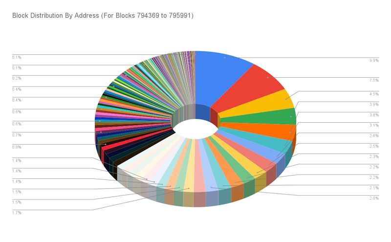
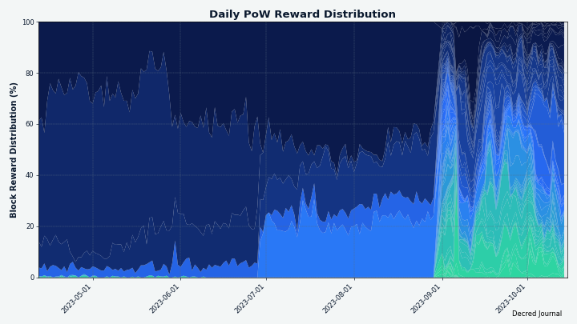
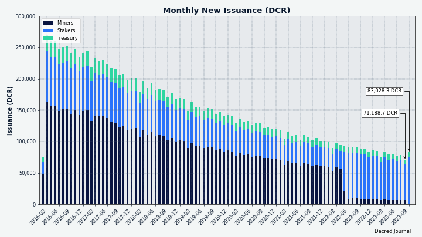

# Decred Journal – Wrzesień 2023

_Obraz: Układ, aut. @Exitus_

Najważniejsze wydarzenia z września:

- Sieć Decred przeszła na funkcję haszującą proof of work BLAKE3 i 89% nagrody za wydobycie bloku dla proof of stake, ale rozpoczęcie wydobywania nowych bloków zajęło 3 dni.

- Obsługa wydobywania Decred na GPU została dodana do oprogramowania gominer i BzMiner, co doprowadziło do eksplozji mocy obliczeniowej.

- Wydano Bison Relay v0.1.9 z licznymi poprawkami i wstępnym projektem mobilnym.

- DCRDEX v0.6.3 zostało wydane z poprawkami dla portfela BTC i utrzymania kaucji. Rozwój integracji Polygon, botów handlowych i innych funkcji postępuje naprzód.

Spis treści:

- [Aktualizacja sieci i przerwa w usługach](#network-upgrade-and-service-outage)
- [Oprogramowanie do wydobycia Decred z wykorzystaniem GPU](#decred-gpu-mining-software)
- [Wydanie Bison Relay v0.1.9](#bison-relay-v019-release)
- [Wydanie DCRDEX v0.6.3](#dcrdex-v063-release)
- [Rozwój](#development)
- [Ludzie](#people)
- [Zarządzanie](#governance)
- [Wydobycie](#mining)
- [Sieć](#network)
- [Ekosystem](#ecosystem)
- [Nawiązywanie kontaktów](#outreach)
- [Eventy](#events)
- [Media](#media)
- [Rynki](#markets)
- [Ważne kwestie i wiadomości poboczne](#relevant-external)

## Aktualizacja sieci i przerwa w usługach

W dniu 29. sierpnia zmiany w zasadach konsensusu pt. [Zmiana PoW na BLAKE3 i ASERT](https://github.com/decred/dcps/blob/master/dcp-0011/dcp-0011.mediawiki) i [Zmiana podziału dotacji PoW/PoS na 1/89](https://github.com/decred/dcps/blob/master/dcp-0012/dcp-0012.mediawiki) zostały aktywowane w sieci głównej Decred wraz z wydobyciem bloku 794,368. Początkowa wartość trudności została zresetowana do docelowej wartości 1,45 TH/s w oczekiwaniu, że już od tego samego dnia w sieci obecny będzie hashrate oparty na GPU. Założenie to miało podstawy w historii, ponieważ w momencie uruchomienia Decred w lutym 2016 r. wydobycie na GPU rozpoczęło się bez żadnej zapowiedzi. Ponadto, o zbliżającym się przejściu na BLAKE3 było publicznie wiadomo od około 5 miesięcy od [kwietnia 2023 r.](https://proposals.decred.org/record/a8501bc). Wydobywanie na GPU nie rozpoczęło się jednak zgodnie z oczekiwaniami, a sieć pozostała z trudnością, która była niezwykle wysoka dla procesorów CPU. W rezultacie łańcuch przestał produkować bloki na kilka dni.

Wszelkie usługi zależne od łańcucha otrzymującego nowe bloki zostały zawieszone, a zaliczały się do nich na przykład:

- Wpłaty i wypłaty na scentralizowanych giełdach zostały tymczasowo wyłączone
- Swapy DCR na DCRDEX nie mogły się rozpocząć ani zakończyć
- Usługi znakowania czasem zostały zawieszone
- Politeia nie mogła rozpocząć lub zakończyć głosowania nad propozycjami
- Oprogramowanie do głosowania Politeia nie działało normalnie (oddawanie głosów wymagało obejść i sztuczek)
- Kanały LN nie mogły być otwierane ani zamykane
- Funkcjonalność Bison Relay była ograniczona (nie można było wpłacać ani wypłacać środków do/z portfeli, nie można było otwierać/zamykać kanałów LN).

Po 24 godzinach bez bloków górnicy stanęli w obliczu problemu, w którym dcrd odmawiał wydobycia starych bloków. Obejściem tego problemu było cofnięcie zegara systemowego i, w razie potrzeby, regeneracja certyfikatów.

Blok [794,369](https://dcrdata.decred.org/block/655d0c998b6f838a63a69991ebfb8dc776ed0234117c7b6cca407fe15c2cb02c) został ostatecznie wydobyty 1 września, a łańcuch ponownie ruszył. Niektóre węzły dcrd musiały zostać ponownie uruchomione z powodu trafienia na ścieżkę, na której nie próbowały pobierać nowych bloków. Po rozwiązaniu tego ostatniego problemu nowy algorytm ASERT dostosował trudność i przywrócił normalną prędkość produkcji bloków w ciągu kilku godzin.

Ta prawie trzydniowa przerwa ustanowiła nowy rekord, bijąc [poprzednią przerwę](https://forum.decred.org/threads/04-23-17-pow-mining-outage.5287/) z [kwietnia 2017 r.](https://twitter.com/decredproject/status/856193098879299584), kiedy wydobycie [bloku 127,072](https://dcrdata.decred.org/block/127072) zajęło 9,6 godziny.

## Oprogramowanie do wydobycia Decred z wykorzystaniem GPU

Wydobywanie na GPU rozpoczęło się tydzień po hardforku i szybko wyparło wydobywanie na CPU. We wrześniu publicznie udostępniono dwie opcje oprogramowania do wydobywania Decred na GPU:

- [gominer](https://github.com/decred/gominer) obsługuje wydobywanie Decred na urządzeniach OpenCL i CUDA, w tym na procesorach graficznych AMD i Nvidia. Pliki binarne nie są obecnie dostępne, ale proces kompilacji i konfiguracji jest [dobrze udokumentowany](https://github.com/decred/gominer#readme).

- [BzMiner](https://www.bzminer.com/) obsługuje wydobywanie Decred na procesorach graficznych AMD, Nvidia i Intel od wersji 17.0.0. Kod źródłowy nie jest publiczny, ale BzMiner ma długą listę [funkcji](https://github.com/bzminer/bzminer) i może osiągnąć wyższe moce wydobywcze w porównaniu do gominera. Pliki binarne są dostępne na [GitHub](https://github.com/bzminer/bzminer/releases) i [bzminer.com](https://www.bzminer.com/).

Aby uzyskać pomoc, dołącz do czatu #pow-mining na Matrix lub na Discordzie.

_Obraz: BzMiner GUI działający na HiveOS_

## Wydanie Bison Relay v0.1.9

To wydanie poprawia UX postów, obsługę wymiany kluczy i naprawia błędy zgłoszone w wersji 0.1.8.

Warte wzmianki zmiany w graficznym interfejsie użytkownika i aplikacji wiersza polecenia:

- Automatyczne handshake'i z użytkownikami nieaktywnymi przez 21 dni w celu utrzymania kontaktów
- Automatyczne anulowanie subskrypcji i wyrzucanie z czatów grupowych użytkowników bezczynnych przez 60 dni
- Lista wykluczeń, aby zapobiec automatycznej rezygnacji z subskrypcji niektórych użytkowników, takich jak dobrze znane boty

Najważniejsze zmiany w aplikacji GUI:

- Ulepszona lista postów użytkowników
- Przycisk resetujący wszystkie stare wymiany kluczy
- Pierwsza runda implementacji mobilnego interfejsu użytkownika (można go przetestować, zmniejszając szerokość okna poniżej 500 pikseli)
- Naprawiono: utknięcie w procesie konfiguracji, otwieranie linków URL i nieprawidłową widoczność wskaźników nieprzeczytanych wiadomości

Dostępny jest [krótki film](https://www.youtube.com/watch?v=Wz0Gn7Kdjeo) demonstrujący nowości w aplikacji GUI.

Najważniejsze zmiany w aplikacji wiersza polecenia (brclient):

- Naprawiono różne błędy związane z funkcją Simplestore
- Naprawiono przeglądanie stron lokalnych
- Naprawiono błędy interfejsu użytkownika z czatem

Pełne informacje o wydaniu i pliki do pobrania można znaleźć na [stronie wydania](https://github.com/companyzero/bisonrelay/releases/tag/v0.1.9). Zaleca się sprawdzenie plików zgodnie z opisem w [README](https://github.com/companyzero/bisonrelay/tree/v0.1.9#verifying-binaries).

_Obraz: Ulepszone powiadomienia w Bison Relay v0.1.9_

## Wydanie DCRDEX v0.6.3

To wydanie zawiera kilka ważnych poprawek i ulepszeń. Wszystkim użytkownikom zaleca się aktualizację. Najważniejsze informacje dla samodzielnej aplikacji:

- Limity handlowe skalują się wraz z poziomem kaucji
- Naprawiono częsty błąd, który pojawiał się podczas ponownego skanowania wbudowanego portfela BTC
- Naprawiono scenariusz, w którym kaucje mogły całkowicie wygasnąć przed ich odnowieniem

Pełne informacje o wydaniu dostępne są [tutaj](https://github.com/decred/dcrdex/releases/tag/v0.6.3).

Uwaga: W chwili pisania tego tekstu, pliki binarne dexc są również dostępne jako część wydania [oprogramowania podstawowego v1.8.1](https://github.com/decred/decred-binaries/releases/tag/v1.8.1). Pliki te oferują szereg korzyści: są podpisane kluczem Decred Release, obsługują więcej systemów operacyjnych i architektur procesorów oraz są zbudowane przy użyciu nowszego i bardziej zoptymalizowanego łańcucha narzędzi Go.

## Rozwój

O ile nie zaznaczono inaczej, prace zgłaszane poniżej mają status „scalonych z repozytorium głównym (master)”. Oznacza to, że prace są ukończone, zrecenzowane i zintegrowane z kodem źródłowym, który zaawansowani użytkownicy mogą [kompilować i uruchamiać](https://medium.com/@artikozel/the-decred-node-back-to-the-source-part-one-27d4576e7e1c), ale ich efekty nie są jeszcze dostępne w wersji plików binarnych dla zwykłych użytkowników.

### dcrd

_[dcrd](https://github.com/decred/dcrd) jest pełną implementacją węzła, który obsługuje sieć peer-to-peer Decred na całym świecie._

Zmiany zbackportowane do wydania v1.8.1:

- Dodano nowy [hasz proof of work](https://github.com/decred/dcrd/pull/3192) do szczegółowych wyników wywołań `getblock` i `getblockheader`.
- Zmieniono wywołanie [`getnetworkhashps`](https://github.com/decred/dcrd/pull/3181), by traktować `-1` jako wartość domyślną (120 bloków wstecz). Poprzednie znaczenie `-1` "liczba bloków od ostatniej zmiany trudności" nie ma już sensu, biorąc pod uwagę, że trudność jest teraz obliczana co blok, a nie co 144 bloki jak w starym algorytmie trudności.

Zmiany scalone z gałęzią `master` ku przyszłym wydaniom:

- Zaktualizowano obraz Docker do wersji [Go 1.21.1](https://github.com/decred/dcrd/pull/3183).
- Poprawiono wewnętrzną [obsługę błędów](https://github.com/decred/dcrd/pull/3182) w `rpcserver`, aby kod był czystszy i trudniejszy do nadużycia.
- Zmieniono pakiet [`sampleconfig`](https://github.com/decred/dcrd/pull/3185), aby korzystał z funkcji osadzania Go. Pozwala to na posiadanie przykładowych konfiguracji jako oddzielnych plików, z którymi łatwiej się pracuje, zachowując wygodny dostęp do ich zawartości z poziomu kodu.
- Dodano funkcje dostępu do [wartości R i S](https://github.com/decred/dcrd/pull/3188) sygnatur w pakiecie `secp256k1/ecdsa`, wartości te mogą być przydatne w niektórych obliczeniach.
- Dodano kilka [nowych](https://github.com/decred/dcrd/pull/3190) [testów](https://github.com/decred/dcrd/pull/3191), aby zwiększyć pokrycie testami do 99,6%.

### dcrwallet

_[dcrwallet](https://github.com/decred/dcrwallet) to serwer portfela używany przez wiersz polecenia oraz aplikacje graficzne._

Zmiany zbackportowane do wydania v1.8.1:

- Zaktualizowano szczegółowe odpowiedzi dla wywołań [`getblock` i `getblockhash`](https://github.com/decred/dcrwallet/pull/2285) tak, aby zawierały nowy hash dowodu pracy.

Zmiany scalone z gałęzią `master` ku przyszłym wydaniom:

- Zaktualizowano [obliczenia opłat VSP](https://github.com/decred/dcrwallet/pull/2281) dla nowego podziału nagrody za blok w DCP-12 (podział nagrody blokowej dla proof of stake wzrósł z 80% do 89%). Ten fragment kodu jest używany tylko przez serwery vspd, więc nie trzeba było go wspierać.

### Decrediton

_[Decrediton](https://github.com/decred/decrediton) to w pełni funkcjonalny desktopowy portfel ze zintegrowaną funkcją głosowania, mieszania StakeShuffle, Lightning Network, handlem na DEX i nie tylko. Działa z lub bez dostępu do pełnego łańcucha (tryb SPV)._

Wszystkie poniższe zmiany zostały uwzględnione w wydaniu v1.8.1 (opublikowane w październiku).

Postępy w integracji z portfelem Ledger:

- Dodano [funkcje backendowe](https://github.com/decred/decrediton/pull/3869) do interakcji z portfelem Ledger. Wykorzystują one API [WebUSB](https://github.com/electron/electron/pull/36289), które pozwala aplikacjom opartym na Electronie na dostęp do urządzeń USB.
- Dodano [interfejs użytkownika Ledger](https://github.com/decred/decrediton/pull/3874) dla sieci testowej.
- Uruchomiono Ledger w sieci [mainnet](https://github.com/decred/decrediton/pull/3906). Zostało to przetestowane na systemach Linux, Windows i macOS na urządzeniach Nano X i Nano S Plus.
- Przywrócono [Electron](https://github.com/decred/decrediton/pull/3912) do wersji 21.2.3, ponieważ nowsza wersja powodowała problemy z oknem DEX. Będzie to musiało zostać [zbadane i naprawione](https://github.com/decred/decrediton/issues/3921) w przyszłej wersji, ponieważ [Electron v23](https://releases.electronjs.org/release/v23.0.0) jest potrzebny do obsługi WebUSB, która umożliwia integrację Ledgera w Decrediton.

Pozostałe:

- Zaktualizowano [moduł DCRDEX](https://github.com/decred/decrediton/pull/3905) do wersji 0.6.3 i włączono jego nowy "tryb rozszerzenia" w celu ochrony portfela Decrediton przed błędną konfiguracją w oknie DEX.
- Zaktualizowano [tłumaczenie na jęz. chiński](https://github.com/decred/decrediton/pull/3893).
- ~8 zmian aktualizujących zależności sieciowe i naprawiających drobne błędy.

### vspd

_[vspd](https://github.com/decred/vspd) to oprogramowanie serwera dla pul udziałów (Voting Service Provider). VSP oddaje głos za swoich użytkowników 24/7 oraz nie wchodzi w posiadanie żadnych środków, a tym samym nie może ich ukraść._

Wrześniowa praca w repozytorium vspd zaowocowała stopniowymi usprawnieniami jakości korzystania dla użytkowników, administratorów oraz deweloperów.

Wszystkie poniższe zmiany zostały zawarte w wydaniach [v1.3.0](https://github.com/decred/vspd/releases/tag/release-v1.3.0) oraz [v1.3.1](https://github.com/decred/vspd/releases/tag/release-v1.3.1), które wyszły we wrześniu.

Zmiany skierowane ku użytkownikom:

- Dodano oddzielne liczniki wygasłych i przegapionych biletów na [stronie głównej VSP](https://github.com/decred/vspd/pull/417) i w odpowiedzi [`/vspinfo`] (https://github.com/decred/vspd/pull/421). Poprzednio zgłaszane "unieważnione bilety" były sumą wygasłych i przegapionych biletów; osobna lista przegapionych biletów jest lepszym miernikiem oceny niezawodności VSP, ponieważ wygasłe bilety nie wynikają z winy VSP.
- Zaktualizowano [obliczenia opłat VSP](https://github.com/decred/vspd/pull/435), aby uwzględnić nowy podział nagród blokowych określony w DCP-12.
- Nowy żółty górny baner pojawi się, jeśli VSP działa w sieci [testnet lub simnet](https://github.com/decred/vspd/pull/417). [Baner debugowania](https://github.com/decred/vspd/pull/443) został zmieniony na kolor czerwony, ponieważ tryb debugowania nie powinien być używany w produkcji.

Zmiany dla administratorów VSP:

- Dodano nową stronę administratora, która zawiera listę wszystkich zgłoszeń, które zostały zarejestrowane w VSP, ale [przegapiły ich głosowania](https://github.com/decred/vspd/pull/451).
- Zoptymalizowano [wykrywanie zagłosowanych i cofniętych biletów](https://github.com/decred/vspd/pull/416), aby działało dwa razy szybciej. Osiągnięto to poprzez użycie innej [funkcji dopasowującej](https://github.com/decred/dcrd/blob/dc41075594cfdef63e8a64340b4fc5651a56a604/gcs/gcs.go#L304) z pakietu dcrd `gcs`, która jest [lepiej zoptymalizowana](https://github.com/decred/vspd/pull/413#issuecomment-1694228745) dla tego zadania.
- Poprawiono responsywność obsługi [żądań wyłączenia](https://github.com/decred/vspd/pull/426) i usunięto zduplikowany generyczny kod.
- Poprawiono kompatybilność obsługi [sygnałów zamknięcia](https://github.com/decred/vspd/pull/438) na różnych systemach operacyjnych.
- Zmieniono interfejs API sieci Web, aby zwracał [wyraźne błędy](https://github.com/decred/vspd/pull/440), jeśli pamięć podręczna interfejsu API sieci Web nie jest gotowa. Dzięki temu administrator będzie natychmiast wiedział o możliwych problemach. Wcześniej, jeśli pamięć podręczna nie była gotowa, strony internetowe były renderowane bez danych i bez wskazania, że coś jest nie tak.
- Upewnienie się, że [komunikaty o uruchomieniu/wyłączeniu](https://github.com/decred/vspd/pull/427) są zawsze pierwszą/ostatnią rzeczą, która zostaje zapisania w logach.
- Poprawiono [logowanie](https://github.com/decred/vspd/pull/445), aby ograniczyć niepotrzebny spam.
- Dodano informacje o wydaniu dla [v1.3.0](https://github.com/decred/vspd/pull/447) i [v1.3.1](https://github.com/decred/vspd/pull/452).

Zmiany wewnętrzne i deweloperskie:

- Przywrócono możliwość uruchamiania [vspd w sieci simnet](https://github.com/decred/vspd/pull/419), która jest potrzebna DCRDEX do testowania nowych funkcji stakingu.
- Niewielkie optymalizacje wydajności poprzez [lepsze wykorzystanie dcrd](https://github.com/decred/vspd/pull/422).
- Nieeksportowanie części kodu i [przeniesienie](https://github.com/decred/vspd/pull/428) go do [wewnętrznych](https://github.com/decred/vspd/pull/430) [pakietów](https://github.com/decred/vspd/pull/436), ponieważ nie nadaje się on do wykorzystania przez strony trzecie. Niewielka powierzchnia publicznego API ułatwia rozwój i konserwację.
- Zmieniono sposób [tworzenia, uruchamiania](https://github.com/decred/vspd/pull/434) i [zatrzymywania](https://github.com/decred/vspd/pull/436) komponentów w celu oddzielenia i uproszczenia kodu.
- Naprawiono [kopię zapasową bazy danych](https://github.com/decred/vspd/pull/439) działającą tylko raz zamiast okresowo (niewydany błąd).
- ~20 commitów z mniejszymi ulepszeniami i porządkowaniem kodu.

_Obraz: Przegapione bilety w panelu administratora vspd_

### gominer

_[gominer](https://github.com/decred/gominer) to oprogramowanie do wydobycia Decred w trybie solo, jak i z wykorzystaniem pul wydobywczych za pomocą urządzeń OpenCL oraz CUDA._

Głównym celem wrześniowego rozwoju gominera było szybkie zareagowanie na pierwszych górników GPU, którzy nie udostępnili publicznie swojego kodu i tym samym zaczęli dominować w ilości dostarczonej mocy obliczeniowej. Aktualizacje gominera pozwalają każdemu na wydobywanie za pomocą swoich GPU. Oprócz dodania obsługi wydobywania BLAKE3 na GPU podjęto wysiłki w celu zautomatyzowania lub udokumentowania procesu konfiguracji, aby rozwiązać wiele bolączek zgłaszanych przez górników.

Wydobycie BLAKE3 za pomocą GPU:

- Dodano obsługę [wydobycia BLAKE3 dla GPU poprzez OpenCL](https://github.com/decred/gominer/pull/194). Zawiera ona niestandardowe zoptymalizowane jądro BLAKE3 OpenCL oparte na stanach pośrednich do obsługi procesorów graficznych współpracujących z OpenCL i OpenCL z ADL. "Jądro" to program napisany w wyspecjalizowanym języku [jądra kernela OpenCL](https://en.wikipedia.org/wiki/OpenCL#OpenCL_kernel_language), który działa na GPU. Zmiana ta poprawia również wykrywanie urządzeń CL, randomizuje nonce, aby upewnić się, że każde urządzenie wykonuje inną pracę, oraz poprawia wyświetlanie wartości hashrate.
- Dodano obsługę [wydobycia BLAKE3 dla GPU poprzez CUDA](https://github.com/decred/gominer/pull/195) w systemie Linux. CUDA to platforma do wysokowydajnych obliczeń na procesorach graficznych. Jądro OpenCL zostało dostosowane do kompilacji z zestawem narzędzi CUDA. W przeciwieństwie do OpenCL [CUDA](https://en.wikipedia.org/wiki/CUDA) jest zastrzeżone, zamknięte i działa tylko na kartach Nvidia. CUDA pozwala jednak kontrolować podkręcanie i prędkości wentylatorów, aby potencjalnie znacznie zwiększyć wydajność (gigahashe na wat). Biorąc pod uwagę, że koszt energii elektrycznej jest ogromnym czynnikiem wpływającym na rentowność, takie kompromisy często mają sens.
- Dodano skrypt i instrukcje budowania wersji gominera obsługującej CUDA w systemie [Windows](https://github.com/decred/gominer/pull/206). Tworzenie programu Go z obsługą CUDA jest [bardziej skomplikowane](https://github.com/decred/gominer/blob/7e2fb9e40e5568d4c85636c7c7ef1474eb44cf6c/cuda_builder.go#L5) w systemie Windows niż Linux, ale nowy kreator dokłada wszelkich starań, aby zautomatyzować proces w jak największym stopniu. Jeśli zostanie wykryta brakująca zależność lub konfiguracja środowiska, kreator wydrukuje czytelne dla człowieka wskazówki, jak rozwiązać ten problem. [Ręczne instrukcje](https://github.com/decred/gominer/blob/7e2fb9e40e5568d4c85636c7c7ef1474eb44cf6c/docs/cuda-manual-windows-build.md) zostały dodane jako rozwiązanie awaryjne w przypadku, gdy automatyczny kreator nie działa. Ta zmiana usuwa również zależność od GNU Make.
- Dodano obsługę [wersji CUDA starszych niż 10](https://github.com/decred/gominer/pull/216). Umożliwia to budowanie gominera na większej liczbie konfiguracji, chociaż wydajność będzie znacznie obniżona w przypadku starszych wersji CUDA. Zainstalowana wersja zestawu narzędzi CUDA i architektura GPU będą [wykrywane automatycznie](https://github.com/decred/gominer/pull/n/commits/a7076d78a46f9b9d9277fb3f92620ed130d5e7e9) podczas kompilacji, aby wykorzystać najlepsze możliwe funkcje GPU, w szczególności szybkie [przesunięcie lejka](https://stackoverflow.com/questions/12767113/funnel-shift-what-is-it).
- Naprawiono błąd, w wyniku którego [autokalibracja](https://github.com/decred/gominer/pull/218/commits/d3e68cf1e370e94eb50b1e74d5b2446b8e24c4ad) nie mogła zwolnić urządzenia i spowodować niepowodzenie rzeczywistej pętli wydobywczej.

Programowanie GPU nie jest czymś, czym deweloperzy Decred zajmują się na co dzień, ale to jądro OpenCL okazało się dość szybkie. Dla przykładu, osiąga ono 10-12 GH/s na RTX 3070, co jest zbliżone do 12 GH/s raportowanych przez [WhatToMine](https://whattomine.com/gpus/48-nvidia-geforce-rtx-3070) dla IronFish, innego algorytmu wydobywczego opartego na BLAKE3. Lepsze porównanie wymagałoby uwzględnienia szczegółów (rozmiar hashowanych danych, liczba rund hashowania itp.), ale zgłoszone do tej pory moce sugerują, że gominer jest wystarczająco dobry, aby uczynić wydobywanie na GPU bardziej sprawiedliwym i dostępnym dla większej liczby osób.

Aktualizacje README:

- Przełączono instrukcje kompilacji OpenCL dla systemu Windows na [MSYS2](https://github.com/decred/gominer/pull/196).
- Dodano [instrukcje kompilacji](https://github.com/decred/gominer/pull/198) OpenCL AMD/Nvidia dla systemu Linux.
- Dodano [instrukcje konfiguracji](https://github.com/decred/gominer/pull/199).
- Dodano [hashrate'y raportowane przez użytkowników](https://github.com/decred/gominer/pull/201).

Pozostałe zmiany:

- Ulepszono [obsługę zamykania](https://github.com/decred/gominer/pull/207).
- 19 [porządkujących commitów](https://github.com/decred/gominer/pull/210), w tym dodanie większej liczby linterów, aby zapobiec przedostawaniu się słabego kodu.
- Naprawiono [kilka](https://github.com/decred/gominer/pull/204) [problemów](https://github.com/decred/gominer/pull/205) z protokołem [Stratum](https://braiins.com/stratum-v1).

### dcrpool

_[dcrpool](https://github.com/decred/dcrpool) to oprogramowanie serwera do operowania i zarządzania pulą wydobywczą._

Podobnie jak w przypadku gominera, rozwój dcrpool został reaktywowany po okresie niskiej aktywności od lata 2021 r., kiedy to ukazała się wersja v1.2.0. Deweloperzy zaktualizowali bazę kodu do najnowszych funkcji Go, naprawili wiele przypadków współbieżności i wyłączania oraz spłacili część długu technicznego, a wszystko to w ramach przygotowań do dodania obsługi wydobywania GPU w puli.

Aktualizacje i zmiany:

- Dodano obsługę [BLAKE3](https://github.com/decred/dcrpool/pull/341) do wewnętrznego górnika CPU, który jest używany do testowania.
- Poprawiono dokładność obliczania liczby [możliwych iteracji](https://github.com/decred/dcrpool/pull/360).
- Poprawiono komunikaty dziennika w celu śledzenia [klientów, którzy przekroczyli limit czasu](https://github.com/decred/dcrpool/pull/376).
- Ulepszono [obsługę sygnałów](https://github.com/decred/dcrpool/pull/381) w celu bardziej czystego zamykania na większej liczbie wariantów systemu Unix, a także w systemie Windows, w odpowiedzi na zdarzenia takie jak wylogowanie użytkownika, zamknięcie terminala lub zamknięcie systemu.
- Zaktualizowano [kod kompilacji](https://github.com/decred/dcrpool/pull/386), aby używał Go 1.21 i PostgreSQL 16.0.
- Usunięto wszystkie [aktualizacje bazy danych](https://github.com/decred/dcrpool/pull/391) bbolt i zresetowano wersję bazy danych do 1. Pozwala to na usunięcie znacznej ilości kodu, który nie musi być już utrzymywany, daje programistom elastyczność w zakresie zmiany formatu bazy danych przed następną wersją i może uniknąć potencjalnych błędów i problemów ze wsparciem spowodowanych niespójnymi danymi. Ta zmiana zakłada, że nie było żadnych znanych publicznych wdrożeń dcrpool i sugeruje oznaczenie następnego wydania v2.0.0, aby odzwierciedlić, że format bazy danych jest niekompatybilny z ostatnią główną wersją v1.2.0.

Poprawki:

- Poprawiono [logikę zamykania](https://github.com/decred/dcrpool/pull/351), aby zapewnić, że pliki dziennika są prawidłowo zamykane, jeśli proces zostanie zamknięty z powodu błędu.
- Naprawiono niektóre przypadki, w których [błędy konfiguracji nie były rejestrowane](https://github.com/decred/dcrpool/pull/352) zgodnie z oczekiwaniami i usunięto duplikację kodu.
- Upewniono się, że [baza danych jest zamknięta](https://github.com/decred/dcrpool/pull/353) na wszystkich ścieżkach błędów.
- Przejście w stan [szybkiej awarii](https://github.com/decred/dcrpool/pull/377), jeśli port nasłuchiwania serwera GUI jest już w użyciu. Przed tą zmianą, jeśli GUI nie mógł uruchomić się normalnie, proces dcrpool nadal działał, co nie było oczekiwanym zachowaniem. Teraz proces zakończy się szybko i pozwoli administratorowi natychmiast rozwiązać wszelkie problemy.
- Naprawiono przypadki brzegowe, w których mogły być generowane zduplikowane [identyfikatory udziału roboczego](https://github.com/decred/dcrpool/pull/390) i [identyfikatory płatności](https://github.com/decred/dcrpool/pull/392). Dodano losowe liczby do tych identyfikatorów, aby zapewnić ich unikalność. Naprawia to błędy testów na szybkim sprzęcie.
- ~9 różnych poprawek dotyczących współbieżności, anulowania, logiki zamykania i obsługi błędów.

Refaktoryzacja:

- Usunięto nieużywany kod uruchamiający dcrpool jako [usługę](https://github.com/decred/dcrpool/pull/349) [Windows](https://github.com/decred/dcrpool/pull/342).
- ~11 commitów porządkujących kod i włączających nowe lintery.
- Zmieniono sposób obsługi [numerów wersji aplikacji](https://github.com/decred/dcrpool/pull/355), aby użyć bardziej niezawodnego podejścia z dcrd i dcrwallet.
- Przerobiono cykle życia kilku podsystemów, aby ich uruchamianie i zamykanie były bardziej przewidywalne, łatwiejsze do zrozumienia i chronione przed niezamierzonymi przyszłymi zmianami. Podsystemy te to: [hub puli](https://github.com/decred/dcrpool/pull/356), [GUI](https://github.com/decred/dcrpool/pull/370) [serwer WWW](https://github.com/decred/dcrpool/pull/371), [punkt końcowy puli i klient](https://github.com/decred/dcrpool/pull/373) oraz [stan łańcucha](https://github.com/decred/dcrpool/pull/378). Uproszczono obsługę rozłączania [klientów puli](https://github.com/decred/dcrpool/pull/380).
- Uczyniono pakiet `gui` [wewnętrznym](https://github.com/decred/dcrpool/pull/357), ponieważ nie jest on przeznaczony dla zewnętrznych konsumentów.
- ~9 commitów, w tym drobne usprawnienia w zarządzaniu pamięcią i współbieżnością.

Dokumentacja:

- Dodano najnowsze [przetestowane wersje](https://github.com/decred/dcrpool/pull/384) PostgreSQL i zaktualizowano najlepsze praktyki tworzenia bazy danych.
- Zaktualizowano i uproszczono [instrukcje kompilacji i konfiguracji](https://github.com/decred/dcrpool/pull/385).

Kod testowy:

- Odczytywanie ze skompresowanego archiwum danych testowych [w kawałkach](https://github.com/decred/dcrpool/pull/348) - dobra praktyka, aby uniknąć niekontrolowanych alokacji.
- Ułatwiono uruchamianie uprzęży testowej w systemie [Windows](https://github.com/decred/dcrpool/pull/368).
- Ulepszono [testy punktów końcowych](https://github.com/decred/dcrpool/pull/387).
- Umożliwienie [zachowania testowej bazy danych](https://github.com/decred/dcrpool/pull/389) do wglądu po niepowodzeniu testu.
- Usunięto cały kod związany z układami ASIC, które nie mogą już wydobywać Decred i nie są już obsługiwane przez dcrpool.

### Lightning Network

_[dcrlnd](https://github.com/decred/dcrlnd) to oprogramowanie węzła Lightning Network dla Decred. LN umożliwia przesyłanie natychmiastowych i niskokosztowych transakcji._

- Usunięto niestandardową konfigurację docelową [100 połączeń równorzędnych](https://github.com/decred/dcrlnd/pull/190) ([odziedziczoną](https://github.com/lightningnetwork/lnd/blob/d233f61383f2f950aa06f5b09da5b0e78e784fae/server.go#L1413) z lnd).
- Naprawiono [błąd uruchamiania](https://github.com/decred/dcrlnd/pull/191), jeśli opcje `--routing` nie były ustawione.
- Zbudowano i przetestowano z [Go 1.21](https://github.com/decred/dcrlnd/pull/192).
- Wydanie [v0.4.0](https://github.com/decred/dcrlnd/releases/tag/v0.4.0) zostało oznaczone jako wersja zawarta w wydaniu oprogramowania podstawowego v1.8.0.

### DCRDEX

_[DCRDEX](https://github.com/decred/dcrdex) to niepowiernicza giełda, umożliwiająca handel bez konieczności zaufania, działająca dzięki technologii atomic swaps._

Wrześniowe zmiany zawarte w [wydaniu v0.6.3](https://github.com/decred/dcrdex/releases/tag/v0.6.3):

- Dodano [tryb rozszerzenia](https://github.com/decred/dcrdex/pull/2486), ograniczony tryb, w którym DCRDEX nie zezwala na zmiany ustawień, takich jak typ portfela, hasło portfela lub konta portfela. Chroni to portfel przed błędną konfiguracją, gdy DEX działa jako część portfela Decrediton.
- Usunięto ["dodatkowe szczeble"](https://github.com/decred/dcrdex/pull/2502); były one "ciekawostką księgową" na serwerze, która nie robiła nic dla klienta, ale wprowadzała błąd, w którym kaucje klienta mogły całkowicie wygasnąć przed wymianą.

Podane niżej wysiłki zostały scalone z gałęzią `master` ku przyszłym wydaniom.

Decred:

- Dodano minimalistyczny [GUI do stakingu z wykorzystaniem VSP](https://github.com/decred/dcrdex/pull/2482) z następującymi funkcjami: wybór VSP, wyświetlanie aktualnej ceny biletu i nagród za głosowanie, zakup biletów, wyświetlanie statystyk stakingu w czasie rzeczywistym, wyświetlanie listy posiadanych biletów, wyświetlanie i ustawianie preferencji głosowania (agendy konsensusu, wydatki ze Skarbca i klucze Skarbca).
- Umożliwienie określenia [niestandardowego VSP](https://github.com/decred/dcrdex/pull/2529), który nie jest wymieniony w [API VSP](https://github.com/decred/dcrwebapi/blob/master/docs/api.md).

Firo:

- Zaimplementowano [parsowanie bloków Firo](https://github.com/decred/dcrdex/pull/2488), aby umożliwić szacowanie opłat w sieci testowej.

Ethereum:

- Zaimplementowano [subskrypcje WebSocket](https://github.com/decred/dcrdex/pull/2490), aby serwer DEX mógł pobierać nowe nagłówki bloków od dostawcy danych łańcuchowych bardziej efektywnie, niż przez ich odpytywanie. Gdy odpytywanie HTTP jest nadal używane, interwał odpytywania zostanie automatycznie zwiększony dla źródeł nielokalnych. Wcześniej zmiana tego interwału wymagała przebudowania serwera.
- Zaimplementowano inteligentny kontrakt do [uzyskiwania sald](https://github.com/decred/dcrdex/pull/2520) ETH i dowolnej liczby tokenów, aby znacznie zmniejszyć liczbę żądań do dostawców. Dodano również pamięć podręczną dla odpowiedzi, aby jeszcze bardziej zmniejszyć liczbę żądań do dostawców między blokami.

Polygon (MATIC):

- Zmiany we wszystkich obszarach w celu zakończenia początkowego [wsparcia Polygon](https://github.com/decred/dcrdex/pull/2431): uogólniono portfel Ethereum i backend serwera, aby ponownie wykorzystać wspólny kod, dodano testy zgodności RPC, dodano obsługę tokenów Polygon do uprzęży testowej i szacowania gazu, wdrożono kontrakt swap USDC w sieci głównej Polygon, zaktualizowano kod interfejsu użytkownika związany z tokenami. Dla wygody użytkowników portfele Polygon i Ethereum będą używać tego samego ziarna i uzyskiwać te same klucze prywatne i adresy, co [omówione jest tutaj](https://github.com/decred/dcrdex/pull/2431#issuecomment-1650510000).
- Dodano obsługę wrapowanych tokenów [WBTC i WETH](https://github.com/decred/dcrdex/pull/2522) i dostosowano stawki gazu na podstawie wyników testów.

Klient GUI:

- Ulepszono interfejs [aktywnych zleceń](https://github.com/decred/dcrdex/pull/2171) użytkownika: wyświetlanie zleceń na żywo i ostatnich zleceń w jednej tabeli oraz wyświetlanie przycisków po najechaniu kursorem na zlecenie, aby użytkownik mógł wykonywać akcje bez rozwijania wierszy.
- Wyświetlanie [średniego kursu handlu](https://github.com/decred/dcrdex/pull/2463) w kilku miejscach.
- Pomijanie zbędnego kroku [wprowadzania hasła](https://github.com/decred/dcrdex/pull/2542) podczas tworzenia konta na serwerze DEX, jeśli hasło jest zapisane w pamięci podręcznej.

Backend klienta:

- Zaimplementowano [asynchroniczne powiadomienia](https://github.com/decred/dcrdex/pull/2492), które portfele mogą wysyłać do GUI. Pozwoli to rozwiązać niektóre problemy i zapewnić aktualność GUI w większej liczbie sytuacji.
- Umożliwiono klientowi łączenie się z serwerami DEX przy użyciu certyfikatów dostarczonych przez zaufane [urzędy certyfikacji](https://github.com/decred/dcrdex/pull/2513). Wcześniej certyfikat serwera musiał być konfigurowany ręcznie.
- Zoptymalizowano logikę i limit czasu [pobierania kursów wymiany](https://github.com/decred/dcrdex/pull/2512).
- Naprawiono możliwość nieoczekiwanego [wygaśnięcia kaucji](https://github.com/decred/dcrdex/pull/2460) i anulowania wszystkich zleceń, co było spowodowane koncepcją "dodatkowych sczebli" i nieprawidłowym odgadnięciem poziomu handlowego konta po stronie klienta.

Klient, boty handlowe:

- Wdrożono [bota arbitrażowego](https://github.com/decred/dcrdex/pull/2480) z prostą strategią, która składa zlecenia tylko wtedy, gdy istnieje możliwość arbitrażu między DEX a scentralizowaną giełdą (początkowo obsługiwana będzie Binance).
- Zaktualizowano interfejs użytkownika dla [animacji rynku](https://github.com/decred/dcrdex/pull/2491), który zawiera teraz stronę przeglądu ze wszystkimi skonfigurowanymi botami i stronami ustawień dla każdego z nich. Konfiguracja jest przechowywana w pliku JSON. Zaktualizowano również stronę rynków, aby nie zezwalać użytkownikom na ręczne składanie zleceń podczas działania animatora rynku.
- Naprawiono bota animatora rynku, aby [przeprowadzał bilansowanie sald](https://github.com/decred/dcrdex/pull/2517) nieco później, gdy dostępne są niezbędne dane spasowań.

Dokumentacja:

- Zaktualizowano [przewodnik odzyskiwania i ponownego skanowania portfela](https://github.com/decred/dcrdex/pull/2473) dla wbudowanego (aka natywnego) portfela BTC.
- Dodano [informacje o wydaniu](https://github.com/decred/dcrdex/pull/2536) dla wersji 0.6.3.

Serwer:

- Zezwolenie na [wyłączenie rynku](https://github.com/decred/dcrdex/pull/2487) w pliku konfiguracyjnym.
- Zezwolono na uruchamianie serwera [bez szyfrowania TLS](https://github.com/decred/dcrdex/pull/2515), na przykład dla konfiguracji, w których szyfrowanie jest obsługiwane przez nginx.
- Dodano [odwrotny tunel](https://github.com/decred/dcrdex/pull/2493) do uzyskiwania usług danych łańcucha. Zamiast serwera DEX łączącego się z dostawcami danych, mogą oni inicjować połączenia z publicznym serwerem DEX i świadczyć usługi RPC. Pozwala to na uzyskanie danych łańcucha z prywatnych węzłów, które nie mogą akceptować połączeń. Posiadanie zintegrowanego tunelu zwrotnego oferuje pewne zalety w porównaniu z tunelowaniem SSH używanym wcześniej do osiągnięcia tego samego celu, takie jak prosta konfiguracja. Serwer DEX może pobierać dane z wielu węzłów źródłowych w celu zapewnienia redundancji.

Pozostałe:

- Zwiększono [minimalną wersję Go](https://github.com/decred/dcrdex/pull/2521) do 1.19.
- Poprawiono wersję desktopową dla [Debiana](https://github.com/decred/dcrdex/pull/2525).
- Dodano skrypt do konfigurowania [dwóch portfeli](https://github.com/decred/dcrdex/pull/2535) do ręcznego testowania w sieci głównej i sieci testowej. Pozwala to przetestować więcej scenariuszy.
- ~11 mniejszych zmian i poprawek.

_Obraz: Interfejs użytkownika dla stakingu na DCRDEX_

_Obraz: Integracja z Polygon na DCRDEX_

### Cryptopower

_[Cryptopower](https://github.com/crypto-power/cryptopower) to wielomonetowy desktopowy portfel z graficznym interfejsem dla DCR, BTC i LTC. Działa ze wsparciem dla chroniącego prywatność trybu lekkiego bez potrzeby pobierania pełnych łańcuchów wspieranych, wspiera staking, mieszanie, głosowanie oraz inne unikalne cechy Decred._

Wszystkie poniższe zmiany zostały scalone na gałęzi `master` ku przyszłym wydaniom.

Nowa strona przeglądu:

- Zaimplementowano nowy projekt [strony głównej](https://github.com/crypto-power/cryptopower/pull/65) z [fikcyjnymi danymi](https://github.com/crypto-power/cryptopower/pull/75) i zreorganizowano funkcje w 3 głównych zakładkach: Przegląd, Portfele i Handel.
- Używanie prawdziwych danych w [karcie ostatnich transakcji](https://github.com/crypto-power/cryptopower/pull/104).
- Używanie rzeczywistych danych portfela w [kartach salda](https://github.com/crypto-power/cryptopower/pull/115).
- Dodano modal pokazujący [całkowitą wartość aktywów](https://github.com/crypto-power/cryptopower/pull/68/commits/f393b5304359f16df92d385e7f93fcc24567692d) w USD.

Integracja DEX:

- Dodano pierwszy krok [wprowadzenia na DEX](https://github.com/crypto-power/cryptopower/pull/119).

Zmiany skierowane ku użytkownikom:

- Pokazywanie [wskaźnika ładowania](https://github.com/crypto-power/cryptopower/pull/73) podczas ładowania listy VSP.
- Ukrywanie [paska postępu miksowania](https://github.com/crypto-power/cryptopower/pull/70), gdy mikser nie jest uruchomiony.
- Trwałe ustawienie [ukrywania salda](https://github.com/crypto-power/cryptopower/pull/81) po ponownym uruchomieniu aplikacji.
- Dodano okno dialogowe dla [odbierania środków](https://github.com/crypto-power/cryptopower/pull/108), do którego można uzyskać dostęp z dowolnego miejsca, klikając przycisk Odbierz.

Poprawki skierowane ku użytkownikom:

- Naprawiono [brakujące ikony](https://github.com/crypto-power/cryptopower/pull/64) na liście ostatnich zleceń funkcji natychmiastowej wymiany.
- Naprawiono wyświetlanie [transakcji stakingowych](https://github.com/crypto-power/cryptopower/pull/92) w Przeglądzie transakcji zamiast w Aktywnościach stakingowych.
- Poprawiono szerokość [karty salda aktywów](https://github.com/crypto-power/cryptopower/pull/95) na stronie przeglądu.
- Naprawiono wyświetlanie [strony głównej](https://github.com/crypto-power/cryptopower/pull/105) po pomyślnym utworzeniu lub przywróceniu portfela.
- Naprawiono łączne saldo USD i dzwonek powiadomień niewidoczne w [trybie ciemnym](https://github.com/crypto-power/cryptopower/pull/132).
- Naprawiono awarię podczas ładowania aplikacji do [strony przeglądu](https://github.com/crypto-power/cryptopower/pull/133).
- Naprawiono błąd podczas klikania w [transakcje stakingu](https://github.com/crypto-power/cryptopower/pull/136).

Decred:

- Naprawiono nieprawidłowy procent głosów Tak/Nie wyświetlany na [pasku głosowania propozycji](https://github.com/crypto-power/cryptopower/pull/63).
- Naprawiono [spam w logach](https://github.com/crypto-power/cryptopower/pull/106) na stronie stakingu, jeśli portfel nie jest zsynchronizowany.

Litecoin:

- Naprawiono niepotrzebne uruchamianie [wykrywania adresów](https://github.com/crypto-power/cryptopower/pull/59) po każdym ponownym uruchomieniu aplikacji.

Android:

- Utworzono prototyp [projektu Kotlin](https://github.com/crypto-power/cryptopower-android).
- Naprawiono uruchamianie aplikacji na Androidzie 11+ poprzez przechowywanie danych w [prywatnym katalogu aplikacji](https://github.com/crypto-power/cryptopower/pull/116). Dodatkową zaletą jest to, że pliki aplikacji nie są dostępne dla innych aplikacji.

Zmiany wewnętrzne i deweloperskie:

- Naprawiono błędy związane z niektórymi [natychmiastowymi wymianami](https://github.com/crypto-power/instantswap/pull/6) w bibliotece `instantswap`.

Zgłoszenia błędów i opinie są mile widziane za pośrednictwem [GitHub Issues](https://github.com/crypto-power/cryptopower/issues) lub w pokoju [#cryptopower](https://matrix.to/#/!oxOZZtibVUXxXtdPJS:decred.org) na naszym matrixowym [czacie](https://docs.decred.org/getting-started/joining-matrix-channels/)!

_Obraz: Głosowanie nad propozycjami w portfelu Cryptopower_

_Obraz: Ostatnie wymiany w portfelu Cryptopower korzystają ze scentralizowanych usług wymian błyskawicznych_

_Obraz: Strony wprowadzające na DCRDEX w portfelu Cryptopower_

_Obraz: Design nadchodzącej strony Przeglądu w portfelu Cryptopower (rzeczywiste jej wdrożenie może nieco odbiegać od prezentowanego)_

### Dokumentacja

_[dcrdocs](https://github.com/decred/dcrdocs) to repozytorium źródłowe [dokumentacji użytkownika](https://docs.decred.org/) dla Decred._

- [Zaktualizowano](https://github.com/decred/dcrdocs/pull/1228) stronę [Proof-of-Work](https://docs.decred.org/mining/overview/), usuwając starsze dokumenty związane z układami ASIC i dodano informacje o BLAKE3 i wydobywaniu CPU.
- Zaktualizowano oś czasu [historii projektu](https://github.com/decred/dcrdocs/pull/1232), dodając ważne wydarzenia, takie jak uruchomienie Bison Relay, wydobywanie BLAKE3 na GPU i zmianę podziału nagrody za wydobycie bloku.
- Dodano [agendy](https://github.com/decred/dcrdocs/pull/1231)  `blake3pow` i `changesubsidysplitr2` do [archiwum głosowania nad zasadami konsensusu](https://docs.decred.org/governance/consensus-rule-voting/consensus-vote-archive/).

### decred.org

_[dcrweb](https://github.com/decred/dcrweb) to repozytorium kodu źródłowego strony [decred.org](https://decred.org/)._

- Zaktualizowano formatowanie [komunikatu prasowego](https://github.com/decred/dcrweb/pull/1136).
- Zaktualizowano [tłumaczenie na jęz. arabski](https://github.com/decred/dcrweb/pull/1140).

### Bison Relay

_[Bison Relay](https://github.com/companyzero/bisonrelay) to nowa platforma mediów społecznościowych peer-to-peer z silną ochroną przeciw cenzurze, inwiligacji, oraz reklamom, działająca na bazie Lightning Network projektu Decred._

Wrześniowe zmiany zarówno w aplikacji z interfejsem graficznym, jak i aplikacji wiersza polecenia zawarte w wydaniu v0.1.9:

- Wyświetlanie dat [utworzenia i ostatniej próby nawiązania połączenia z kontaktami](https://github.com/companyzero/bisonrelay/pull/348).
- Dodano [listę ignorowanych do automatycznego anulowania subskrypcji bezczynnych użytkowników](https://github.com/companyzero/bisonrelay/pull/349). Użytkownicy z tej listy nie będą automatycznie wypisywani ani usuwani z czatów grupowych, nawet jeśli są bezczynni. Domyślnie zawiera ona dobrze znane boty (Oprah i GC bot), ale można dodać do niej innych użytkowników za pomocą nowej opcji pliku konfiguracyjnego `autoremoveignorelist`.

Zmiany w aplikacji GUI zawarte w wydaniu v0.1.9:

- Wdrożono pierwszą rundę [projektu interfejsu użytkownika zoptymalizowanego pod kątem urządzeń mobilnych](https://github.com/companyzero/bisonrelay/pull/334). Obejmuje ona ekran odblokowania, przegląd LN, posty w kanale, mobilną szufladę/pasek boczny, listy czatów i nowe ikony. Układy mobilne można przetestować, zmniejszając szerokość okna poniżej 500 px.
- Zaktualizowano mobilny wygląd [czatów bezpośrednich i grupowych](https://github.com/companyzero/bisonrelay/pull/343) i dodano wskaźnik zmiany daty.
- Ulepszono [listę postów użytkownika](https://github.com/companyzero/bisonrelay/pull/300). Wcześniej był to tylko tekst w oknie czatu bezpośredniego. Nowa lista będzie wyglądać podobnie do News Feed i wskazywać, czy posty zostały pobrane, czy nie. Menu użytkownika zostało dostosowane tak, aby pokazywało pozycję "Subskrybuj posty", jeśli nie jest subskrybentem, oraz pozycje "Lista postów" i "Anuluj subskrypcję postów", jeśli jest subskrybentem.
- Dodano przycisk na stronie ustawień, który próbuje [zresetować wszystkie stare wymiany kluczy](https://github.com/companyzero/bisonrelay/pull/345) z nieaktywnymi użytkownikami. Okres braku aktywności, który jest uważany za "nieaktualny", jest pobierany z serwera.
- Naprawiono [brak możliwości dodania pojemności LN](https://github.com/companyzero/bisonrelay/pull/338) po zamknięciu wszystkich kanałów LN i ponownym uruchomieniu aplikacji.
- Naprawiono [wskaźnik nowych komentarzy](https://github.com/companyzero/bisonrelay/pull/342) nieznikający po obejrzeniu posta, naprawiono wskaźnik nowego czatu niepojawiający się przy nowych wiadomościach.
- Naprawiono [niepotrzebne przerysowywanie](https://github.com/companyzero/bisonrelay/pull/344) wiadomości.
- Naprawiono awarię [strony odblokowania](https://github.com/companyzero/bisonrelay/pull/353) na małych ekranach (mobilnych).

Zmiany w aplikacji wiersza polecenia (brclient) zawarte w wydaniu v0.1.9

- Zmieniono komendę `/list runningtips`  tak, aby [zwracała błąd](https://github.com/companyzero/bisonrelay/pull/347), jeśli nie działa żadna próba przekazania napiwku.
- Naprawiono problemy podczas interakcji z lokalnymi [stronami i sklepami](https://github.com/companyzero/bisonrelay/pull/335). Polecenie `/ln payinvoice` rozumie teraz prefiks `lnpay://` w linkach do faktur. Strona "Zamówienie zrealizowane" została ulepszona tak, aby wyświetlać szczegóły zamówienia i ważność faktury (1 godzina). Jeśli utworzenie faktury LN nie powiedzie się, na przykład, jeśli sprzedawca nie ma wystarczającej przepustowości przychodzącej na LN, zamiast tego zostanie utworzony adres płatności na łańcuchu jako rezerwowy.

W innych wiadomościach, @vctt tworzy dowód koncepcji [gry w pokera](https://matrix.to/#/!GHnoHXSgkVAsUknRUg:decred.org/$sP-K9yQG-ohkPm4G4XVfyaXBcFq2_pvQ4EbxtdePBgU) zbudowany na brclient. W drugiej iteracji logika pokera została [przekonwertowana na bota](https://matrix.to/#/!GHnoHXSgkVAsUknRUg:decred.org/$fKQ_Emk1kqGH4mbV7aFXddMiSNKFTRa3b7PSiDsWlBw), który jest łatwiejszy do zintegrowania z istniejącymi klientami. Kod można znaleźć [tutaj](https://github.com/companyzero/bisonrelay/compare/master...vctt94:bisonrelay:poker-bot).

_Obraz: Pierwsza iteracja designu Bison Relay na urządzenia mobilne w wersji v0.1.9_

_Obraz: Funkcja stron w brclient v0.1.9_

_Obraz: Proof of concept gry w pokera w interfejsie graficznym Bison Relay_

## Ludzie

Witamy nowych współtwórców:

- minizilla (rozwój, [dcrd](https://github.com/decred/dcrd/pull/3188))
- omahs (rozwój, [dcrdex](https://github.com/decred/dcrdex/pull/2533))
- Clopas (rozwój, [dcrweb](https://github.com/decred/dcrweb/pull/1139))

Statystyki społeczności na dzień 2. października (w porównaniu z 2. września):

- Obserwujący na [Twitterze](https://twitter.com/decredproject): 53 407 (+101)
- Subskrybenci na [Reddit](https://www.reddit.com/r/decred/): 12 757 (+6)
- Użytkownicy na [Matrixie](https://chat.decred.org/) w pokoju #general: 819 (+14)
- Użytkownicy na [Discordzie](https://discord.gg/GJ2GXfz):  1795 (+134), zweryfikowani z możliwością pisania: 744 (+67)
- Użytkownicy na [Telegramie](https://t.me/Decred): 2321 (+18)
- Subskrybenci na [YouTube](https://www.youtube.com/decredchannel): 4640 (+0), wyświetleń: 240K (+5,4K)

## Zarządzanie

We wrześniu nowy [Skarbiec](https://dcrdata.decred.org/treasury) otrzymał 8374 DCR o wartości 111 tys. USD po średnim wrześniowym kursie wymiany $13,23.

We wrześniu nie wydobyto żadnych transakcji skarbowych z powodu poślizgu w ich zatwierdzaniu przez administratora, ale transakcja [wypłaty ze Skarbca](https://dcrdata.decred.org/tx/dad857ec261237d51247d4bfae1a1ffb4348c8a7ed8933b2b877e6cac1d75436) wydająca 8411 DCR została wydobyta 1. października po zatwierdzeniu 99,9% głosami na tak i z 64% frekwencją, najwyższą jak dotąd. Ten TSpend obejmuje lipiec i większość sierpniowych rozliczeń, starając się wypełnić powiększającą się lukę między zakończoną pracą a zapłatą. Obejmuje on 53 wyjścia o wielkości od 7 DCR do 1719 DCR. Stawka rozliczeniowa za lipiec wyniosła $15,40/DCR, a za sierpień $13,89/DCR, przy średniej $14,65/DCR płatność pokryłaby około $123K kosztów za oba miesiące łącznie.

Na dzień 5. października, łączne saldo [starego](https://dcrdata.decred.org/address/Dcur2mcGjmENx4DhNqDctW5wJCVyT3Qeqkx) i [nowego Skarbca](https://dcrdata.decred.org/treasury) wynosi 866 862 DCR (11,4 miliona USD po kursie $13,20).

_Obraz: Miesięczne saldo Skarbca w USD; zauważyć należy, że kwota ta jest mocno uzależniona od kursu wymiany_

We wrześniu zakończono głosowaniem nad dwiema propozycjami, ale okres głosowania został zakłócony przez aktywację DCP-0011 i okres około 3 dni, kiedy blockchain utknął w martwym punkcie, czekając na znalezienie nowego bloku z nową funkcją haszu dowodu pracy, po czym nastąpił okres szybkiej produkcji bloków, gdy górnicy GPU zaczęli działać w sieci. Opóźnienie przekraczające 24 godziny bez bloku spowodowało aktywację pewnych zabezpieczeń w oprogramowaniu portfela, które stwierdziło, że klient musi być offline i uniemożliwiłoby normalne zachowanie podczas głosowania.

- Propozycja stworzenia [wielozasobowego portfela Cryptopower](https://proposals.decred.org/record/256efee) napisanego w Go na komputery stacjonarne i urządzenia mobilne z budżetem w wysokości 61 600 USD została zatwierdzona 69,6% głosów na tak i przy 62% frekwencji.

- [Propozycja](https://proposals.decred.org/record/2f25f2d) integracji z portfelem Cake Wallet wymagająca 80 000 USD w celu zintegrowania podstawowej funkcjonalności DCR z [Cake Wallet](https://cakewallet.com/) nie osiągnęła wymaganego kworum przy 18% frekwencji, chociaż uzyskała 87% poparcia. Głosowanie nad Cake Wallet zostało autoryzowane i rozpoczęło się po tym, jak głosowanie nad propozycją Cryptopower trwało już ponad 1 dzień, w wyniku czego głosowanie nad Cake Wallet było bardziej dotknięte problemami z systemem głosowania.

W tym miesiącu opublikowano dwie propozycje, choć jedna z nich jest powtórzeniem propozycji integracji Cake Wallet.

- [Integracja Cake Wallet, ponownie](https://proposals.decred.org/record/b3bdacb) powraca do kolejnej próby spełnienia wymogu kworum.

- Piąta iteracja propozycji [Public Relations](https://proposals.decred.org/record/0c04c6f) aut. @l1ndseymm początkowo wymagała zwiększonej kwoty budżetu 60 000 USD na kolejny rok, a następnie zmniejszyła ją do 48 000 USD.

Więcej wydarzeń i szczegółów dotyczących podane powyżej propozycje zostało zawartych w [wydaniu 64 Politeia Digest](https://blockcommons.red/politeia-digest/issue064/).

## Wydobycie

Wydobycie Decred zostało zrestartowane 29 sierpnia, kiedy układy ASIC wydobyły swój ostatni blok, a łańcuch przełączył się na hasz dowodu pracy BLAKE3.

Ponieważ przełączenie miało na celu usunięcie całego hashrate'u ASIC z sieci, trudność wydobycia musiała zostać zresetowana do wystarczająco niskiej wartości, aby umożliwić sprzętowi komercyjnemu wydobywanie nowych bloków opartych na BLAKE3. Dla porównania, układy ASIC wydobyły swój [ostatni blok](https://dcrdata.decred.org/block/0000000000000000c293d8c67409d05e960447ea25cdaf770e864d995c764ef0) z trudnością 3,5 miliarda, podczas gdy [następny blok](https://dcrdata.decred.org/block/071683030010299ab13f139df59dc98d637957b766e47f8da6dd5ac762f1e8c7) miał wartość trudności 101 tysięcy, czyli 35068 razy niższą.

Początkowa wartość trudności została ręcznie ustawiona na około 1,45 TH/s [przewidując dołączenie mocy obliczeniowej z GPU](https://matrix.to/#/!TSpuyuYWgkTrgPTcXh:decred.org/$mtTPqh-YoNoXn-Q8-Q8K0390wy28L4XrD8Udx9yDU6U), co nie nastąpiło od razu i jedynie górnicy CPU byli aktywni tuż po aktywacji BLAKE3. Pojedynczy procesor osiąga ~5-75 megahashy na sekundę (od starych laptopów po wysokiej klasy procesory). Zakładając, że "przeciętny procesor" osiąga 20 MH/s, uzyskanie 1,45 *terahashy* wymagałoby około 72500 procesorów. Pierwszy blok BLAKE3 (794 368) został znaleziony w zaledwie 50 minut, zakładając, że został znaleziony za pomocą procesorów, ale później łańcuch utknął w martwym punkcie.

W pozytywnym zwrocie akcji incydent ten aktywował wielu starych i nowych członków społeczności do zjednoczenia się celem popchnięcia łańcucha do przodu. Czat #pow-mining stał się bardzo ruchliwy, ponieważ ludzie przekształcali każdy dostępny sprzęt w koparki Decred i znosili generowane nadmiarowe ciepło. Urządzenia wahały się od malutkich Raspberry Pi (1 MH/s), przez stare laptopy (2-5 MH/s), nowe laptopy i komputery stacjonarne (10-20 MH/s), aż po monstrualne 120-watowe procesory z 16 i 32 rdzeniami (60-75 MH/s).

> Muszę przyznać, że bardzo podoba mi się to, jak wszyscy się jednoczą. Brakowało mi tego ducha współpracy. [[@jazzah](https://matrix.to/#/!TSpuyuYWgkTrgPTcXh:decred.org/$dXjs1Gqsw5jE2v1p9Ly5mwo_JaQXU_KDsrg_FyeI4i0)].

Do końca 31. sierpnia około 25 osób zgłosiło łącznie 550 MH/s, ale to (i wszelkie niezgłoszone hashrate'y) wciąż nie wystarczało. Na początku 1. września @grumlin i @davecgh przeszli na [moc obliczeniową w chmurze](https://matrix.to/#/!TSpuyuYWgkTrgPTcXh:decred.org/$-Ql5Vva-X-A2ds34OYP0HZZs8O8fsikHIeTH6zlN9yU) i w ciągu ~3 godzin [blok 794 369](https://dcrdata. decred.org/block/655d0c998b6f838a63a69991ebfb8dc776ed0234117c7b6cca407fe15c2cb02c) został [znaleziony](https://matrix.to/#/!TSpuyuYWgkTrgPTcXh:decred.org/$s5YhsGnMnTGaWnNLHGWD6CSKXYfoTxNklSFeKuS7zb4). Miał on rozmiar 324 KB i zawierał 240 transakcji zgromadzonych w ciągu kilku dni. Ponieważ żadne bloki nie były wydobywane przez tak długi czas, algorytm ASERT potrzebował tylko jednego bloku, aby zmniejszyć trudność wydobycia z ~97 000 do ~1800 i od tego momentu procesory nie miały problemu ze znalezieniem nowych bloków a docelowy czas wydobycia bloków został przywrócony w zaledwie parę godzin.

1-5 września był krótkim okresem, w którym wydobywanie przy użyciu CPU było wykonalne, ponieważ poziom trudności oscylował wokół 500, a odpowiadający mu hashrate sieci utrzymywał się na poziomie 6-10 GH/s, co odpowiada ~300 procesorom CPU lub tylko 1 średniej klasy GPU. Dystrybucja adresów wydobywczych stała się znacznie bardziej zdecentralizowana w porównaniu do [ery ASIC](https://proposals.decred.org/record/a8501bc/comments/66).

_Obraz: Trudność wydobycia podczas ery CPU_

_Obraz: Dystrybucja bloków według adresów wydobywczych na dzień 6. września_

Jednak dni wydobycia CPU nie trwały długo. Deweloperzy spodziewali się, że górnicy GPU wkrótce się pojawią, biorąc pod uwagę, że nawet pojedynczy procesor graficzny wydobywa tak szybko, jak około 500 procesorów, a *farmy* GPU są dość powszechne. Pierwsze oznaki wydobycia GPU zostały zauważone około 2. września, ale nie były one definitywne, ponieważ wydawało się, że celowo utrzymują je w zakresie, który można jeszcze było poddawać w wątpliwość. Wraz z bardziej wiarygodnym potwierdzeniem 5. września, deweloperzy pośpiesznie dodali obsługę wydobywania GPU do [gominer](https://github.com/decred/gominer).

Już 6. września znaczny wzrost w tempie produkcji bloków był wyraźnym wskaźnikiem wydobycia GPU w sieci. Hashrate wzrósł do ok. 32 GH/s o godzinie 15:00, z ok. 9 GH/s zaledwie dzień wcześniej. W ciągu około jednego dnia, nagrody za ok. 150 bloków zostały zebrane przez pojedynczy adres (normalnie ok. 288 bloków jest wydobywanych dziennie). Pierwsza [łatka umożliwiająca wydobycie GPU](https://github.com/decred/gominer/pull/194) została scalona w gominer około 14:30, a przed 15:30 pierwsi członkowie społeczności uruchomili swoje GPU. Po udostępnieniu wszystkim wydobycia na GPU moc obliczeniowa od razu wzrosła, osiągając ok. 52 GH/s o 18:30 i [~700 GH/s](https://matrix.to/#/!TSpuyuYWgkTrgPTcXh:decred.org/$P9sXHlT3txgllOwHtrWLNVWpXSC10i0Dx9p6mImfMgw) o 20:00. Nowe bloki były wydobywane w tempie 100 na godzinę (normalne tempo to 12 bloków na godzinę).

Pod koniec 7. września hashrate osiągnął poziom oczekiwany w dniu forka, około 1500 GH/s lub 150 GPU (zakładając GPU 10 GH/s, takie jak RTX 3070). Był to dobry test nowego algorytmu trudności, który został zaprojektowany z myślą o takim scenariuszu. Zadziałał on dobrze, ASERT zdołał przywrócić normalne czasy bloków do 10. września, mimo że hashrate wzrósł do ~3000 GH/s w tym samym okresie. W przypadku starego algorytmu zajęłoby to w najlepszym przypadku 2 tygodnie.

Wkrótce potem gominer był w na tyle dobrej formie, że programiści przeszli do odświeżenia bazy kodu i dodania obsługi BLAKE3 do [dcrpool](https://github.com/decred/dcrpool). Deweloper BzMiner @iedoc wydał BzMiner v17.0.0 z obsługą wydobywania Decred, zdolną do wyciśnięcia kilku dodatkowych gigahashy z GPU w porównaniu do gominera.

_Obraz: BzMiner v17 obsługujący 8 GPU wydobywających Decred_

Reszta września nie była tak dramatyczna, ale mimo to hashrate nadal rósł i osiągnął ~8 000 GH/s pod koniec miesiąca.

_Obraz: Trudność wydobycia wzrosła o 200x w zaledwie 2 dni, po czym wzrosła jeszcze pięciokrotnie do końca września_

_Obraz: Średni czas wydobycia bloku nieco szalał przez parę dni, lecz szybko się ustabilizował_

_Obraz: Ten wykres unaocznia, jak bardzo scentralizowanym procesem było wydobycie przed forkiem; nagrody przypadały jedynie ~5 adresom_

_Obraz: Kolejny rzut oka na (de)centralizację wydobycia; każdy kolor oznacza unikatowy adres wydobywczy_

## Sieć

Aktualizacja sieci Decred i związane z nią problemy techniczne spowodowały wahania w kilku wskaźnikach, jak pokazano na poniższych wykresach, ale większość z nich ustabilizowała się pod koniec września lub na początku października.

**Hashrate**: wrześniowy [hashrate](https://dcrdata.decred.org/charts?chart=hashrate&scale=linear&bin=day&axis=time) na początku miesiąca wyniósł ~0 TH/s, a zamknął go na poziomie ~8,8 TH/s, zaliczając niż w ok. 0 TH/s oraz szczyt w wys. 8,8 TH/s w ciągu miesiąca.

Nie posiadamy żadnych informacji o działaniu pul wydobywczych Decred we wrześniu.

**Staking**: [Cena biletów](https://dcrdata.decred.org/charts?chart=ticket-price&axis=time&visibility=true-true&mode=stepped) wahała się między 141 a 278 DCR.

[Zablokowana suma](https://dcrdata.decred.org/charts?chart=ticket-pool-value&scale=linear&bin=day&axis=time) to pomiędzy 8,52 a 9,82 miliona DCR, co oznacza, że 54,9-63,5% podaży dostępnej w obiegu [wzięło udział](https://dcrdata.decred.org/charts?chart=stake-participation&scale=linear&bin=day&axis=time) w elemencie Proof of Stake.

_Obraz: Niska aktywność w kupowaniu biletów spowodowała spadek wysokości zablokowanej sumy oraz wskaźnika uczestnictwa w stakingu_

_Obraz: Cena biletów spadła, aby zachęcić do ponownego ich zakupu_

**VSP**: Na 1. października, ~7550 (+650) biletów w puli zarządzanych było przez [15 oficjalnych VSP](https://decred.org/vsp/), co stanowi 18,0% całej puli biletowej (+3.5%).

Największe wzrosty we wrześniu odnotowały [bass.cf](https://vspd.bass.cf/) (+495 biletów, lub +54%), [stakeminer.com](https://vsp.stakeminer.com/) (+357 biletów, lub +107%), oraz [stakey.net](https://stakey.net/) (+336 biletów, lub +128%).

_Obraz: Podział biletów zarządzanych przez VSP_

**Węzły**: [Decred Mapper](https://nodes.jholdstock.uk/user_agents) odnotował między 147 a 159 węzłów dcrd w ciągu miesiąca. Wersje 153 węzłów odnotowanych 1. października to: v1.8.0 - 89%, v1.7.x - 4%, dev buildy v1.9.0 - 2,6%, dev buildy v1.8.0 - 0,7%, pozostałe - 4%.

_Obraz: Większość węzłów działa na dcrd v1.8.0. Czerwony obszar przed styczniem 2023 oznacza niekompletne dane, którymi na ten czas dysponowaliśmy._

Ilość [monet mieszanych](https://dcrdata.decred.org/charts?chart=coin-supply&zoom=jz3q237o-la8vk000&scale=linear&bin=day&axis=time&visibility=true-true-true) wahała się w granicach 60,7-62,6%.
Dzienna [kwota mieszana](https://dcrdata.decred.org/charts?chart=privacy-participation&bin=day&axis=time) oscylowała w granicach 40-**906K** DCR, która wyznaczyła nowy szczyt wszechczasów.

_Obraz: Dzienny wolumen mieszanych DCR spadł podczas zatrzymania się łańcucha, lecz powrócił z podwójną siłą od razu wyznaczając nowe ATH_

_Obraz: Całkowita liczba przemieszanych i niewydanych DCR nieco spadła, lecz błyskawicznie się odbiła_

Eksplorator [Lightning Network](https://ln-map.jholdstock.uk/) sieci Decred na 2. października odnotował 211 węzłów (-2) oraz 429 kanałów (-2) o całkowitej pojemności 190 DCR (+4). Statystyki te zależą od węzła LN. Na przykład, tego samego dnia węzeł @karamble odnotował 213 węzły (-4) oraz 446 kanałów (-7) o pojemności 191 DCR (-1).

_Obraz: Pojemność sieci Lightning Network projektu Decred nadal jest stabilna_

_Obraz: Za wzrost w liczbie przegapionych biletów we wrześniu odpowiadają najprawdopodobniej przyczyny techniczne po hard forku_

_Obraz: Miesięczna emisja DCR była nieco wyższa niż zwykle, przez okres szybkiej produkcji bloków_

Dziękujemy @bochinchero za dostarczenie i ulepszenie widocznych tu wykresów. Stworzył on ponad 40 innych wykresów, które nie zostały wykorzystywane na łamach tego wydania Decred Journal, lecz są dostępne w repozytorium [dcrsnapshots](https://github.com/bochinchero/dcrsnapshots); zapraszamy wszystkich do dzielenia się nimi w mediach społecznościowych.

## Ekosystem

Voting Service Providers:

- Serdecznie witamy [vote.dcr-swiss.ch](https://vote.dcr-swiss.ch/), nowego VSP [wymienionego](https://github.com/decred/dcrwebapi/pull/178) w API VSP i na [stronie VSP](https://decred.org/vsp/). DCR Swiss ma niską opłatę w wysokości 0,25%. Spośród 15 istniejących VSP jest to czwarta najniższa opłata po dcrhive.com (0,15%), dcr.farm (0,15%) i vspd.bass.cf (0,2%). W chwili pisania tego tekstu VSP zgłasza 391 przegłosowanych, 0 cofniętych oraz 334 bilety gotowe do głosowania.

Giełdy:

- Użytkownicy Poloniex, którzy dokonywali transakcji w DCR w latach 2017-2019, mogą kwalifikować się do odszkodowania, jeśli roszczenia zostaną złożone do 31 października 2023 r. Jest to wynikiem [postępowania SEC](https://www.sec.gov/enforcement/information-for-harmed-investors/poloniex) przeciwko Poloniex od 2021 roku. Więcej informacji można znaleźć na stronie [Poloniex Fair Fund](https://www.poloniexfairfund.com/) i w sekcji [FAQ](https://www.poloniexfairfund.com/frequently-asked-questions.aspx).

- KuCoin i Huobi zostały [ponownie dodane](https://github.com/decred/dcrweb/pull/1139) do strony [Giełd](https://decred.org/exchanges/). Najwyraźniej Huobi nigdy nie wycofało DCR ze swojej giełdy, jak [planowano](https://web.archive.org/web/20221002130913/https://www.huobi.com/support/en-us/detail/104917015223952), podczas gdy KuCoin naprawiło [problemy z DCR](https://www.kucoin.com/news/en-kucoin-opens-mainnet-dcr-tokens-deposit-and-withdrawal-services-20220924) jakiś czas temu. Hotbit został usunięty po ich zamknięciu w [maju 2023 r.](202305.md#ecosystem).

- Zaobserwowano, że [Changelly.com](https://changelly.com/) nie oferuje już handlu DCR od 19 września. Ich pulpit nawigacyjny [System Health](https://pro.changelly.com/system-monitor) również nie zawierał na liście DCR, nawet w trybie konserwacji. W odpowiedzi na zgłoszenie do pomocy technicznej Changelly odpowiedziało, że DCR zostało wyłączone z powodu "konserwacji" (prawdopodobnie odnosząc się do hardforka z 29. sierpnia) i że w pewnym momencie powróci.

- Binance sprzedaje całą swoją działalność w Rosji firmie CommEx, zgodnie z ich [tweetem](https://twitter.com/binance/status/1706944096688885895) i [wpisem na blogu](https://www.binance.com/en/blog/all/binance-fully-exits-russia-with-sale-to-commex-8578760889994024403). Podanym powodem jest to, że "działalność w Rosji nie jest zgodna ze strategią zgodności Binance". Ogłoszono stopniowy proces migracji w celu przeniesienia rosyjskich użytkowników do CommEx, po czym Binance może wycofać wszystkie usługi wymiany i działalność w Rosji. Wpływ na usługi DCR i to, czy CommEx wprowadzi DCR na giełdę, jest obecnie nieznany.

Pozostałe wiadomości:

- Strona phishingowa, która była niemal idealnym klonem oficjalnej strony [decred.org](https://decred.org), ale z dodanym "zrzutem społecznościowym", była przez krótki czas reklamowana na naszych kanałach Telegram. Wiadomości te zostały usunięte w ciągu kilku minut po ich opublikowaniu. Źródło strony sugerowało, że była ona skierowana do użytkowników MetaMask, Coinbase i innych portfeli przeglądarkowych. Przypominamy, aby nie klikać żadnych losowych linków i ignorować prywatne wiadomości z instrukcjami, aby postąpić inaczej. Oficjalna strona Decred to [decred.org](https://decred.org) z certyfikatem od Gandi. Oficjalne linki do mediów społecznościowych znajdują się na stronie [decred.org/community](https://decred.org/community/).

Dołączcie do naszego kanału [#ecosystem](https://chat.decred.org/#/room/#ecosystem:decred.org), aby śledzić wszelkie nowości związane z ekosystemem Decred.

Uwaga: autorzy Decred Journal nie są w stanie ocenić wiarygodności żadnego z powyższych podmiotów czy ich usług. Uprasza się o dołożenie należnych starań i własnoręczną weryfikację informacji przed powierzeniem jakichkolwiek środków innym stronom.

## Nawiązywanie kontaktów

### Decred Vanguard

Decred Vanguard jest inicjatywą marketingową opartą na społeczności, której celem jest zwiększenie zasięgu i obecności Decred w mediach społecznościowych.

Aktualizacje: Przeprowadziliśmy udany [konkurs memów](https://twitter.com/exitusdcr/status/1708184512805405096) i rozdaliśmy [$200 w DCR na nagrody](https://twitter.com/exitusdcr/status/1708981341033816333). Innymi odbiorcami comiesięcznej nagrody Decred Vanguard w wysokości $100 w DCR byli [@tothemoon](https://twitter.com/P________L) za jego wkład w serwer Discord oraz [@PubPete](https://twitter.com/longtermdaily) za jego wysoką aktywność.

Jesteś twórcą memów, artystą, strategiem lub po prostu pasjonatem projektu Decred? [Rozszerzamy](https://twitter.com/exitusdcr/status/1704349424003010700) nasz program marketingowy oparty na społeczności i chcemy właśnie CIEBIE!

Co możesz zyskać?

- Zarabiaj $100 w DCR każdego miesiąca za samo uczestnictwo.
- Pokryjemy koszt X Premium.
- Brak ścisłych zasad uczestnictwa. Przyczyniaj się na swój własny, unikalny sposób, kiedy tylko możesz.
- Wygrywaj potencjalne nagrody za wkład.

Zainteresowani? Skontaktujcie się z [@Exitus](https://twitter.com/exitusdcr) na Twitterze/Matrixie/Discordzie.

### Cypherpunk Times

Statystyki aktywności za wrzesień:

- Całkowita liczba artykułów na Cypherpunk Times: 539
- Subskrybentów newslettera: 110
- Opublikowane nowe posty i newslettery: 23
- Aktywne kampanie w mediach społecznościowych: 81
- Zakończone kampanie w mediach społecznościowych: 18
- Posty w mediach społecznościowych: 263
- Liczba obserwujących na wszystkich kontach i platformach mediów społecznościowych: 1627
- Statystyki [@decredsociety](https://twitter.com/decredsociety): obserwujących - 981, wyświetleń tweetów - 17,3K, polubień - 295, retweetów - 89
- Statystyki [@decredmagazine](https://twitter.com/decredmagazine): obserwujących - 490, wyświetleń tweetów  - 15,6K, polubień - 464, retweetów - 125
- Statystyki [@cypherpunktimes](https://twitter.com/cypherpunktimes): obserwujących - 156, wyświetleń tweetów  - 22,0K, polubień - 461, retweetów - 151
- Rozkład postów według projektu na wrzesień: generalna tematyka krypto - 9, Firo - 3, Decred - 10, zaktualizowanych postów nt. Decred - 1

### Pozostałe

- Po opublikowaniu pierwszego artykułu Decred, następnym krokiem w planie propozycji BTC-ECHO było opublikowanie [skryptu reklamy podcastowej](https://proposals.decred.org/record/49e373b/comments/32) do wglądu społeczności, ale potem BTC-ECHO zniknęło na ponad miesiąc.
- Propozycja [utxostudios](https://proposals.decred.org/record/9e265ad) została wykonana; w sumie stworzono 14 krótkich filmów: 2 w języku angielskim, 11 w różnych językach i 1 kompilacja. Wszystkie zostały przesłane na [kanał YouTube Decred](https://www.youtube.com/playlist?list=PLaMrpvQ0yJ_xm0FgwJ-oO9CWJfplsZD_N) i odzwierciedlone [na IPFS](https://ipfs.io/ipfs/QmZSpS7VdsBoFzDinZgpxL594sWFN597dZHBbpzWhLfKvv/).

## Eventy

**Na których byliśmy:**

@arij podpisała umowę partnerską z [National Institute of Innovation and Advanced Technology](https://www.linkedin.com/company/niiat/) (NIIAT) z siedzibą w Casablance w Maroku. Ta roczna umowa ułatwi współpracę, taką jak warsztaty, sesje badawcze i różne interaktywne wydarzenia. Jednym z kluczowych tematów wydarzenia było wprowadzenie [Islah.city](https://islah.city/), platformy, na której mieszkańcy Casablanki mogą identyfikować i wspólnie rozwiązywać wyzwania miejskie. Omówiono potencjał integracji technologii blockchain i znaczników czasu. Wydarzenie przyciągnęło uwagę krajowego telewizyjnego kanału informacyjnego Al Aoula, klip wideo jest dostępny na [Twitterze](https://twitter.com/in_insaf/status/1705858291929137232) i [YouTube](https://www.youtube.com/watch?v=GO5Ky0JXhyU). Więcej informacji w [pełnym raporcie](https://decredcommunity.github.io/events/index/20230923.1).

## Media

**Wybrane artykuły:**

Decred:

- [Kryptowaluty i kwestie środowiskowe: droga do zrównoważonych rozwiązań blockchain](https://www.cypherpunktimes.com/cryptocurrency-and-environmental-concerns-the-road-to-sustainable-blockchain-solutions/), aut. @tallamericano
- [Brazylijski rząd chce nowego podatku od kryptowalut](https://www.cypherpunktimes.com/brazilian-government-wants-new-tax-over-crypto/), aut. @Joao
- [Przyjęcie kryptowalut w krajach rozwijających się: obiecujące trendy i implikacje](https://www.cypherpunktimes.com/cryptocurrency-adoption-in-developing-countries-promising-trends-and-implications/), aut. @tallamericano
- [Nowe badanie pokazuje, że duzi inwestorzy mają pozytywne nastawienie do kryptowalut](https://www.cypherpunktimes.com/new-study-shows-that-big-investors-have-a-positive-perspective-on-cryptocurrencies/), aut. @Joao
- [Prywatność ma znaczenie! Porównanie funkcji](https://www.cypherpunktimes.com/privacy-matters-a-features-comparison/), aut. @Joao
- Zobacz także wersje tekstowe poniższych filmów

Generalna tematyka krypto:

- [Bitwa o bitcoinowy ETF trwa](https://www.cypherpunktimes.com/the-battle-for-a-spot-bitcoin-etf-continues/), aut. @BlockchainJew
- [Ataki typu SIM swap: rosnące zagrożenie dla bezpieczeństwa online](https://www.cypherpunktimes.com/sim-swap-attacks-a-growing-threat-to-your-online-security/), aut. @BlockchainJew
- [Lekcje z incydentu hakerskiego Marka Cubana](https://www.cypherpunktimes.com/lessons-from-the-mark-cuban-hack-incident/), aut. @Joao
- [Odkrywanie altcoinów: obiecujące kryptowaluty poza Bitcoinem i Ethereum](https://www.cypherpunktimes.com/exploring-altcoins-promising-cryptocurrencies-beyond-bitcoin-and-ethereum/), aut. @tallamericano

**Poradniki**:

- [Zwroty AtomicSwap w DCRDEX](https://www.youtube.com/watch?v=W9dDnE6AdIs) aut. @phoenixgreen - również jako [post tekstowy](https://www.cypherpunktimes.com/atomicswap-refunds-in-dcrdex/)
- [Aktualizacja samodzielnej wersji DCRDEX](https://www.youtube.com/watch?v=IIJ0SWAuwr8) aut. @phoenixgreen - również jako [post tekstowy](https://www.cypherpunktimes.com/upgrading-dcrdex-standalone-version/)
- [Jak uruchomić DCRDEX na Raspberry Pi dzięki Umbrel](https://www.youtube.com/watch?v=hnXic_tVwr0) aut. @karamble - również jako [post tekstowy](https://www.cypherpunktimes.com/how-to-dcrdex-on-raspberry-pi-with-umbrel/)

**Wideo:**

- [Wydobycie CPU, staking & udział - Stan Rynku](https://www.youtube.com/watch?v=Z2zL2J9RL-A), aut. @phoenixgreen i @Exitus z udz. @Tivra - również na [Spotify](https://podcasters.spotify.com/pod/show/cypherpunktimes/episodes/Decred-CPU-Mining--Staking--Participation---State-of-the-market-e29034h)
- [Wiadomości Decred - Hard-fork zakończony! Teraz wydobywamy na CPU/GPU - era ASIC minęła!](https://www.youtube.com/watch?v=u1Nts-UKsuY), aut. @Exitus - również na [Spotify](https://podcasters.spotify.com/pod/show/cypherpunktimes/episodes/Decred-News---Hard-fork-completed--Now-CPU_GPU-Mined---ASICs-are-out-e292vcg)
- [Decred bez maski](https://www.youtube.com/playlist?list=PLaMrpvQ0yJ_xm0FgwJ-oO9CWJfplsZD_N) - playlista 14 filmów autorstwa @utxostudios w różnych językach
- [Kartele wydobywcze](https://www.youtube.com/watch?v=KR4w_arcRZQ), aut. Son of a Tech (aka @blindrun)
- [Rewolucja wydobywcza blockchaina Decred](https://www.youtube.com/watch?v=Ev7XRQ_VrnI), aut. @phoenixgreen - również na [Spotify](https://podcasters.spotify.com/pod/show/cypherpunktimes/episodes/Decreds-Blockchain-Mining-Revolution--Moving-Blockchain-Forward-e29f8ji) i jako [post tekstowy](https://www.cypherpunktimes.com/decreds-blockchain-mining-revolution-moving-blockchain-forward/)
- [Usuwanie centralizacji z kryptowalut - Do Przodu](https://www.youtube.com/watch?v=746-gBoVcCE), aut. @phoenixgreen - również na [Spotify](https://podcasters.spotify.com/pod/show/cypherpunktimes/episodes/Removing-Centralisation-From-Crypto-e29rhvn) oraz jako [post tekstowy](https://www.cypherpunktimes.com/removing-centralisation-from-crypto/)

Wersje audio niektórych filmów są publikowane w podcaście [Cypherpunk Times](https://podcasters.spotify.com/pod/show/cypherpunktimes) na Spotify.

Odwiedźcie również naszą sekcję [szortów wideo](https://www.youtube.com/channel/UCJ2bYDaPYHpSmJPh_M5dNSg/shorts) na @DecredTV!

**Tłumaczenia:**

- [DCP-11 zmienia PoW na BLAKE3 i ASERT](https://github.com/decred/dcps/blob/master/dcp-0011/dcp-0011.mediawiki) - w [jęz. chińskim](https://github.com/DominicTing/articles/blob/master/dcp-0011/dcp-0011.mediawiki), aut. @Dominic
- Decred Journal czerwiec-sierpień otrzymał w sumie 2 nowe [tłumaczenia](https://xaur.github.io/decred-news/) na język chiński (@Dominic) i polski (@kozel). Dziękujemy, przyjaciele!

**Treści nieanglojęzyczne:**

- [Makertronic](https://www.youtube.com/channel/UCsm-K1pBCJiH_g2K3_TbUyg) stworzył samouczki w jęz. francuskim dotyczące wydobywania Decred GPU na systemach [Linux i Windows](https://www.youtube.com/watch?v=Xsx6uaFA8x4) oraz [HiveOS](https://www.youtube.com/watch?v=sxuBNhYe9G0) (dostępne są angielskie napisy). Filmy uzyskały całkiem niezłą oglądalność jak na treści Decred.

- Klip wideo z marokańskiego ogólnokrajowego kanału informacyjnego Al Aoula relacjonujący wydarzenie [podpisania umowy partnerskiej](#wydarzenia) między Decred a Narodowym Instytutem Innowacji i Zaawansowanych Technologii (NIIAT) został opublikowany na [YouTube](https://www.youtube.com/watch?v=GO5Ky0JXhyU) Abdellatifa Belmkadema i [Twitterze](https://twitter.com/in_insaf/status/1705858291929137232) @arij.

**Dyskusje społeczności:**

Kubeł zimnej wody od @Tivra:

> To nie jest "krypto", to jakiś tandetny reality show, który niektórzy z was śledzą na X. Krypto dzieje się na GitHubie i na łańcuchu, a nie na wideo. To Ty kontrolujesz, gdzie idzie Twoja uwaga, to ostatecznie Twoja odpowiedzialność [[tweet](https://twitter.com/WasPraxis/status/1706573581168050566)].

**Pozostałe**:

- Strona [LinkedIn](https://www.linkedin.com/company/decredproject) Decred znów jest widoczna bez konieczności logowania się.

**Coś dla oka i serca:**

- [Staking - czy warto?](https://www.youtube.com/watch?v=ItlHeKohvO4), aut. @Exitus - pierwszy w zakładce @DecredTV Shorts
- [Animacja wydobywania Decred GPU "NeoGen"](https://twitter.com/karamblez/status/1699017182502347176), aut. @karamble
- [Kupno decred jest jak trafienie w dziesiątkę](https://www.cypherpunktimes.com/buying-decred-is-like-hitting-the-bullseye/), aut. @OfficialCryptos
- [Nieograniczony potencjał](https://www.cypherpunktimes.com/unlimited-potential/), aut. @OfficialCryptos
- [Stake'uj Decred](https://twitter.com/jz_bz/status/1706546021994570040) short aut. @jz
- [@dearcryptopunk](https://www.tiktok.com/@dearcryptopunk), wideo na TikToku aut. @jp.santanna
- @Tivra zaproponował [rewolucyjny paradygmat](https://matrix.to/#/!lDZCzVQjFoJsXMPkvr:decred.org/$-k2e-8QCXjQ04mv7LqYyW2WALIb5wDvX-jRqWrc5Dk4) zwany "W GURE" [*sic!*] ("UP ONYL"). Samozwańczy lider nowego radykalnego ruchu ogłosił karę śmierci dla każdego, kto powie, że nasze wykresy powinny poruszać się w kierunku innym, niż tylko W GURE.

_Obraz: Merch projektu @lewildbeast dla bohaterskiego górnika, który rozwiązał blok 794 369 (nagrodę w DCR trzeba [zaktualizować](https://dcrdata.decred.org/block/794369))_

_Obraz: Interpretacja paradygmatu W GURE, aut. @Void_

## Rynki

We wrześniu kurs wymiany DCR mieścił się w przedziale USDT 12,33-15,25 / BTC 0,00048-0,00057. Średni dzienny kurs wynosił $13,23.

_Obraz: Historyczne strefy akumulacyjne DCR/USD, aut. @saender_

_Obraz: Świeży wykres DCR/BTC, dane z Coin Metrics_

_Obraz: Świeży wykres DCR/USD, dane z Coin Metrics_

_Obraz: Miesięczny wolumen DCRDEX w USD_

## Ważne kwestie i wiadomości poboczne

Debata wokół Drivechains dla Bitcoina i BIP-300 została [wznowiona](https://cointelegraph.com/news/bitcoin-bip300-drivechain-proposal-sparks-debate-and-alternate-solutions) po tym, jak Luke Dashjr napisał implementację. Trwają dyskusje na temat tego, czy tego rodzaju łańcuch boczny, który pozwoliłby na elastyczne tworzenie i wykorzystywanie innych aktywów, byłby pozytywny dla Bitcoina, czy istnieją techniczne wady lub czy umożliwienie ludziom tworzenia oszustwo-podobnych aktywów na Bitcoinie jest najgorszym aspektem. Trwają również dyskusje na temat tego, jak aktywować soft fork, a niektórzy górnicy już  [sygnalizują](https://twitter.com/francispouliot_/status/1697633126497882143) wsparcie. We wrześniu pojawił się nowy gracz, który twierdził, że jest w stanie obsługiwać łańcuch boczny z dwukierunkowym pegiem na Bitcoinie bez żadnych zmian softforkowych, ale jak dotąd nie miał żadnego wyjaśnienia, które ludzie mogliby zrozumieć.

Paxos [przypadkowo](https://cointelegraph.com/news/miner-returns-over-500k-btc-transaction-fee-overpayment-paxos) zapłacił 19,8 BTC za transakcję Bitcoin, ale F2Pool najwyraźniej zwrócił przepłacone BTC.

Przeglądarka Brave [ogłosiła](https://brave.com/web3-privacy/) partnerstwo z Electric Coin Company w celu dodania obsługi Zcash do swojego portfela oraz opracowania "prywatnej i zdecentralizowanej funkcji przesyłania wiadomości" przy wsparciu Filecoin i InterPlanetary File System (IPFS).

Nouns DAO, które wystawia na aukcji jeden NFT dziennie w celu zasilenia skarbca i zgromadziło w ten sposób sumę około 50 milionów dolarów, przeszło [fork](https://www.coindesk.com/business/2023/09/21/nouns-daos-27m-revolt-reveals-toxic-mix-of-money-hungry-traders-and-blockchain-idealists/), w wyniku którego ponad połowa tej wartości opuściła fundusz poprzez nowo wprowadzony mechanizm rezygnacji. Nouns DAO jest kontrolowane przez głosowanie posiadaczy Noun NFT, a społeczność ta od dawna jest podzielona między obóz, który ucieleśniał pierwotnego ducha wykorzystania funduszu do promowania mema Nouns, a obóz, który był zaniepokojony frywolnymi wydatkami w wysokości nawet 90 000 USD na nazwanie gatunku żaby, i który uważał się za uprawnionego do części funduszu proporcjonalnej do liczby Nouns NFT i siły głosu, jaką posiadali. Jako produkt długotrwałej dyskusji, kontrakty Nouns DAO w wersji 3 zawierały mechanizm, który pozwalał 20% NFT na uruchomienie tygodniowej dyskusji i okresu głosowania. Większość posiadaczy Nouns zdecydowała się na wyjście, a ich udział w funduszach został przeniesiony do nowego DAO, które oprócz znanych mechanizmów Nouns DAO posiada mechanizm ragequit, który pozwoli im na dalsze wyjście i ubieganie się o swój indywidualny udział w tym saldzie, jeśli sobie tego zażyczą.

Terra Classic ma [zaprzestać](https://cointelegraph.com/news/terra-classic-cease-ustc-minting) bicia i ponownego bicia USTC w nadziei na przywrócenie parytetu z dolarem amerykańskim, po głosowaniu z 59% za propozycją. Od czasu spadku ceny LUNC istnieją obawy dotyczące spamu, a propozycja zwiększenia minimalnej kwoty depozytu do 5 milionów LUNC została zatwierdzona z 93% poparciem.

Coinbase, pełniące rolę walidatora Ethereum, [otrzymał](https://www.coindesk.com/tech/2023/09/15/coinbase-inadvertently-earned-1m-due-to-hack-but-hasnt-reimbursed-victims/) płatność w wysokości 570 ETH MEV od hakerów Curve w lipcu, aby nadać priorytet transakcjom, które pozwoliły im czerpać zyski z ataku. To około 1 miliona dolarów zysku dla Coinbase w tej chwili i wydaje się, że niechętnie zwrócą go poszkodowanej stronie, Alchemix, powołując się na opinię prawną, że nie są do tego zobowiązani.

Komisja Papierów Wartościowych i Giełd (SEC) zawarła ugodę, na mocy której twórcy kolekcji Stoner Cats NFT i powiązanego z nią serialu internetowego zostali [ukarani grzywną](https://www.coindesk.com/consensus-magazine/2023/09/14/the-inanity-of-the-sec-stoner-cat-action/) w wysokości 1 miliona dolarów i musieli zabić wszystkie posiadane koty. Sprawa przyciągnęła uwagę, ponieważ pojawili się w niej celebryci Ashton Kutcher i Mila Kunis promujący projekt i uczestniczący w tworzeniu serialu komediowego, do którego dostęp umożliwiłby posiadaczom NFT o wartości 800 USD. Sprzedaż tokenów wygenerowała dla firmy 3650 ETH (8,2 mln USD w tamtym czasie), a firma otrzymała kolejne 20 mln USD z tytułu tantiem w transakcjach, w których posiadacze sprzedali swoje NFT na rynku wtórnym. Po opublikowaniu wiadomości cena NFT znacznie wzrosła, prawdopodobnie dlatego, że ludzie oczekują, że posiadacze będą mogli uzyskać dostęp do części ugody, ale 1 milion dolarów wydaje się dość niewielki w schemacie rzeczy. Ludzie, którzy stracili w tej sytuacji, to ci, którzy kupili NFT po ich rekordowo wysokich cenach wynoszących około 0,3 ETH, jest mało prawdopodobne, aby skorzystali z jakichkolwiek kar finansowych, a niedawny wzrost ceny do 0,05 ETH jest niewielkim pocieszeniem.

Dane wnioskodawców w trwających procesach upadłościowych FTX, BlockFi i Genesis [wyciekły](https://www.bloomberg.com/news/articles/2023-08-25/ftx-genesis-blockfi-customer-data-at-risk-in-bankruptcy-hack) przez Kroll, dostawcę usług upadłościowych. Haker przeprowadził atak SIM swap na pracownika Kroll i był w stanie uzyskać dostęp do plików zawierających dane wszystkich wnioskodawców. Rodzi to dalsze obawy, że uczestnicy procesu roszczeń upadłych firm kryptowalutowych są celem oszustów, którzy próbują uzyskać dostęp do wszelkich kryptowalut, które wnioskodawcy mogą trzymać poza giełdą. Wyciekłe szczegóły pozwalają oszustom na tworzenie bardziej przekonujących materiałów, które odnoszą się do zagrożonych informacji, a jednym ze zgłoszonych przykładów jest oferowanie celom sposobów przyspieszenia procesu roszczeń lub uzyskania lepszego wyniku.

Commodity Futures Trading Commission (CFTC) [ogłosiła](https://www.coindesk.com/policy/2023/09/07/cftc-goes-after-opyn-other-defi-operations-in-enforcement-sweep/) ugody z trzema operacjami DeFi (Opyn, ZeroEx i Deridex), którym zarzuciła oferowanie nielegalnego handlu instrumentami pochodnymi. Firmy zgodziły się zamknąć te usługi i zapłacić grzywny w wysokości od 100 000 do 250 000 USD po współpracy z dochodzeniami CFTC.

CFTC [utrudnia](https://www.coindesk.com/consensus-magazine/2023/09/22/americans-seemingly-arent-allowed-to-put-this-economic-theory-to-the-test/) rozwój rynków prognostycznych, sprzeciwiając się wszelkim rynkom związanym z wynikami politycznymi. Są one wyraźnie zakazane w ponad 10 stanach, ale CFTC ma szerszy sprzeciw, ponieważ nie chce stać się "policjantem wyborczym" rozstrzygającym spory dotyczące sposobu obsługi kontraktów.

Senator Elizabeth Warren [zebrała](https://cointelegraph.com/news/crypto-bill-us-nine-senators-back-elisabeth-warren) poparcie 9 innych senatorów dla swojej ustawy Digital Asset Anti-Money Laundering Act, która rozprawiłaby się z portfelami niepowierniczymi, rozszerzyła obowiązki wynikające z ustawy o tajemnicy bankowej i podjęła inne środki w celu zwalczania nielegalnego wykorzystywania kryptowalut.

Bank Chase w Wielkiej Brytanii, należący do JP Morgan, [ogłosił](https://www.reuters.com/technology/jpmorgans-uk-bank-chase-ban-crypto-transactions-2023-09-26/) zakaz transakcji związanych z kryptowalutami dla swoich klientów, którzy od połowy października nie będą już mogli dokonywać przelewów kartą debetową lub przelewów bankowych do firm kryptowalutowych, takich jak giełdy. Jako powód podano, że jest to odpowiedź na rosnącą liczbę oszustw wymierzonych w brytyjskich użytkowników z komponentem kryptowalutowym.

Brytyjska ustawa o bezpieczeństwie online została [przyjęta](https://www.reuters.com/world/uk/uks-online-safety-bill-passed-by-parliament-2023-09-19/) przez parlament i jest na dobrej drodze do wejścia w życie. Przepisy będą wymagać od brytyjskiego regulatora Ofcom opracowania kodeksu postępowania określającego, w jaki sposób dostawcy internetowych platform komunikacyjnych muszą proaktywnie nadzorować nielegalne treści na tych platformach. Jeden szczególny aspekt, który został [skrytykowany](https://theconversation.com/the-uk-just-passed-an-online-safety-law-that-could-make-people-less-safe-213595), podważyłby kompleksowe szyfrowanie, wymagając od dostawców usług przeszukiwania zaszyfrowanych prywatnych treści w poszukiwaniu dowodów nielegalnej działalności. Zarówno Signal, jak i WhatsApp wskazały, że raczej opuszczą rynek brytyjski, niż zastosują się do nowych przepisów, które wymagałyby od nich osłabienia szyfrowania.

To wszystko na wrzesień. Podzielcie się swoimi aktualizacjami do następnego numeru na naszym kanale [#journal](https://chat.decred.org/#/room/#journal:decred.org).

## O tym wydaniu

To 63. wydanie Decred Journal. Spis wszystkich wydań, mirrorów i tłumaczeń dostępny jest [tutaj](https://xaur.github.io/decred-news/).

Większość informacji od stron trzecich jest przekazywana bezpośrednio ze źródła po minimalnym sprawdzeniu poprawności. Autorzy Decred Journal nie mają możliwości zweryfikowania wszystkich publikowanych stwierdzeń. Proszę uważać na oszustwa i przeprowadzać własny research.

Zasługi (kolejność alfabetyczna):

- redakcja treści: bee, bochinchero, Exitus, jz, karamble, kozel, l1ndseymm, phoenixgreen, richardred, zippycorners
- recenzje i komentarze: davecgh, Dominic, jholdstock
- ilustracja tytułowa: Exitus
- finansowanie: interesariusze Decred
