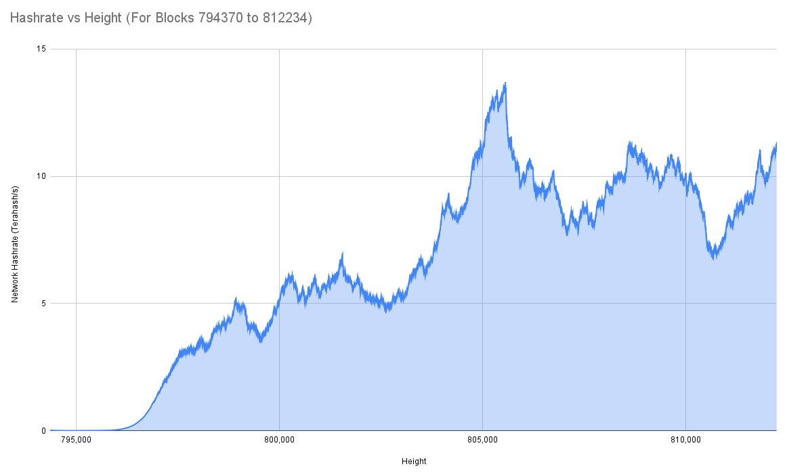
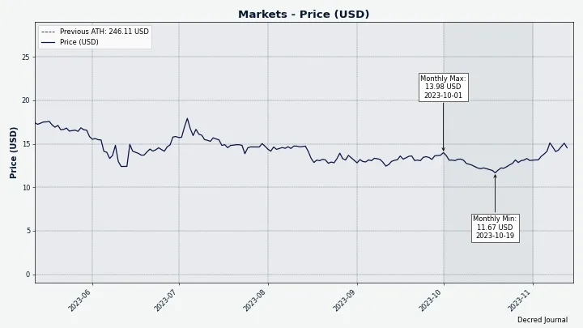
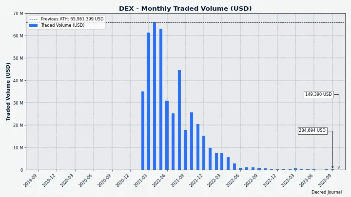

# Decred Journal – Październik 2023

_Obraz: Październikowa okładka, aut. @Exitus_

Najważniejsze wydarzenia z października:

- Wydano oprogramowanie podstawowe v1.8.1 z poprawkami dotyczącymi stakingu z wykorzystaniem VSP i DCRDEX.

- Budżet na integrację Cake Wallet został zatwierdzony i rozpoczęto pracę.

- gominer i dcrpool zostały zaktualizowane do obsługi wydobywania z algorytmem BLAKE3 przez GPU w pulach wydobywczych.

- Uruchomiono trzy publiczne pule wydobywcze.

- Cena biletu ustanowiła nowy rekord na poziomie 700 DCR.

Spis treści:

- [Wydanie głównej wersji oprogramowania v1.8.1](#core-software-v181-release)
- [Rozwój](#development)
- [Ludzie](#people)
- [Zarządzanie i finanse](#governance)
- [Sieć](#network)
- [Ekosystem](#ecosystem)
- [Nawiązywanie kontaktów](#outreach)
- [Media](#media)
- [Rynki](#markets)
- [Ważne kwestie i wiadomości poboczne](#relevant-external)

## Wydanie głównej wersji oprogramowania v1.8.1

To [wydanie](https://twitter.com/decredproject/status/1715463325595660307) zawiera poprawki dla użytkowników stakujących z VSP (Voting Service Providers), a także poprawki dla DCRDEX.

- **dcrd**: Komendy `getblock` i `getblockheader` mają teraz dodatkowe pole `powhash` dla nowego hasha BLAKE3. Zaktualizowano `getnetworkhashps -1`, aby zwracał szacowany hashrate dla ostatnich 120 bloków.

- **dcrwallet**: wiele poprawek niezawodności dla stakingu VSP.

- **Decrediton**: zawiera wszystkie zmiany wymienione powyżej, poprawkę błędu "zbyt krótkiego bufora odpowiedzi" zgłaszanego przez wielu użytkowników DEX oraz zaktualizowane tłumaczenia na język arabski i chiński.

- Moduł **DCRDEX** w Decrediton został zaktualizowany do wersji 0.6.3: limity handlowe skalują się wraz z poziomem kaucji i zawierają zabezpieczenia przed niezamierzonymi i potencjalnie niebezpiecznymi zmianami konfiguracji, poprawki do przetwarzania zamówień, kaucji i ponownego skanowania portfela BTC.

Pełne informacje o wydaniu i pliki do pobrania są dostępne [tutaj](https://github.com/decred/decred-binaries/releases/tag/v1.8.1). Zaleca się [sprawdzenie, czy pliki](https://docs.decred.org/advanced/verifying-binaries/) nie zostały zmodyfikowane.

To wydanie zawiera również najnowsze samodzielne pliki binarne aplikacji DCRDEX, które oferują szereg korzyści w porównaniu do [kompilacji dostępnych w repozytorium dcrdex](https://github.com/decred/dcrdex/releases/tag/v0.6.3): pliki są podpisane kluczem Decred Release, mają więcej opcji wyboru systemu operacyjnego i architektury procesora oraz korzystają z optymalizacji najnowszego kompilatora Go. Zobacz pliki `dexc-xxx` na końcu strony wydania.

## Rozwój

O ile nie zaznaczono inaczej, prace zgłaszane poniżej mają status „scalonych z repozytorium głównym (master)”. Oznacza to, że prace są ukończone, zrecenzowane i zintegrowane z kodem źródłowym, który zaawansowani użytkownicy mogą [kompilować i uruchamiać](https://medium.com/@artikozel/the-decred-node-back-to-the-source-part-one-27d4576e7e1c), ale ich efekty nie są jeszcze dostępne w wersji plików binarnych dla zwykłych użytkowników.

### dcrd

_[dcrd](https://github.com/decred/dcrd) jest pełną implementacją węzła, który obsługuje sieć peer-to-peer Decred na całym świecie._

Zmiany skierowane ku użytkownikom:

- Dodano obsługę [współbieżnych żądań `getdata`](https://github.com/decred/dcrd/pull/3203). Obecnie węzeł może przetwarzać tylko jedno żądanie `getdata` na raz, zachowanie odziedziczone po bardzo wczesnym kodzie sieciowym, które nie jest już istotne. Podczas gdy dane dla jednego żądania `getdata` są obsługiwane, inne wiadomości, które w przeciwnym razie byłyby szybko przetwarzane, takie jak pingi, mogą być potencjalnie opóźnione przez długi czas. Co więcej, teoretycznie możliwe jest, że para peerów utknie w oczekiwaniu na siebie nawzajem. W praktyce taka sytuacja w zasadzie nigdy się nie zdarza, ale może się to zmienić w przyszłości, gdy wprowadzone zostaną nowe komunikaty, takie jak te dotyczące mieszania peer-to-peer. Aby poprawić ogólną przepustowość i rozwiązać wyżej wymienione obawy, żądania `getdata` stały się asynchroniczne, dzięki czemu inne przychodzące wiadomości mogą być przetwarzane jednocześnie. Wprowadzono również nowe limity w celu zablokowania złośliwego zachowania. Ta zmiana w protokole wire jest planowana do włączenia do wydania v1.9.0.
- Współbieżne żądania `getdata` skracają również czas [początkowej synchronizacji łańcucha](https://matrix.to/#/!zefvTnlxYHPKvJMThI:decred.org/$mxemr1HGLNlX4eXYPuG9rTVUb15Jg7lWudGK3TQJEG0) z ~81 do ~47 minut (mierzone na systemie testowym dewelopera). Przed tą zmianą bloki byłyby obsługiwane partiami, a każde żądanie kolejnej partii musiałoby czekać, aż poprzednia partia zostanie odebrana. Ze względu na związane z tym opóźnienia sieciowe, czas "bezczynności" między partiami bloków mógł wynosić do ~ 5 sekund. Biorąc pod uwagę, że istnieje ponad 800 tys. bloków i są one zwykle obsługiwane w partiach po 2000, pełna początkowa synchronizacja spowodowałaby ponad 400 takich opóźnień lub ~33 minuty.
- Zaktualizowano pakiet `dcrutil` by pobierał [katalog domowy użytkownika](https://github.com/decred/dcrd/pull/3196) ze zmiennej środowiskowej `$HOME` zamiast analizować `/etc/passwd`. Ma to na celu zapewnienie kompatybilności z systemami pakowania takimi jak Flatpak lub Snap. Systemy te zapewniają sandboxowe środowiska dla aplikacji i nie pozwalają binarkom na bezpośredni zapis do katalogu domowego. Zamiast tego wyznaczają oddzielny katalog dla każdej aplikacji i odpowiednio ustawiają `$HOME`. Ta zmiana jest potrzebna dla trwających [prac nad opakowaniem](https://github.com/decred/dcrdex/issues/2581) dla aplikacji desktopowej DCRDEX.

Zmiany wewnętrzne i deweloperskie:

- Zaktualizowano [obraz Docker](https://github.com/decred/dcrd/pull/3198) do kompilacji z Go 1.21.3.
- Skonsolidowano kod zamykania, aby zmniejszyć ilość [długo działających goroutines](https://github.com/decred/dcrd/pull/3199) i uczynić użycie [`WaitGroup`](https://github.com/decred/dcrd/pull/3200) bardziej lokalnym, co jest łatwiejsze do zrozumienia i mniej podatne na błędy.
- Ulepszono obsługę [danych peer](https://github.com/decred/dcrd/pull/3201) w menedżerze synchronizacji, aby uprościć kod i wyeliminować niektóre trudne do trafienia przypadki narożne.

Integracja uprzęży testowej [dcrdtest](https://github.com/decred/dcrtest/tree/master/dcrdtest):

- Uproszczono API, aby pakiet był [bardziej użyteczny](https://github.com/decred/dcrtest/pull/17), nie tylko w testach, ale także w benchmarkach i w ogólnym kodzie niezwiązanym konkretnie z testami.
- Upewniono się, że [kod czyszczący](https://github.com/decred/dcrtest/pull/18) zawsze działa, nawet jeśli konfiguracja testu nie powiodła się. Dodaje to również flagę, aby zachować nienaruszone pliki danych w celu ułatwienia debugowania niepowodzeń testów.

_Obraz: Początkowa synchronizacja łańcucha odbędzie się o ~40% szybciej dzięki współbieżnym zapytaniom getdata_

### dcrwallet

_[dcrwallet](https://github.com/decred/dcrwallet) to serwer portfela używany przez wiersz polecenia oraz aplikacje graficzne._

- Zaktualizowano bazę danych [bbolt](https://github.com/decred/dcrwallet/pull/2290) do wersji v1.3.8, aby uniknąć używania `syscall(2)` na OpenBSD, ponieważ to API zostanie usunięte. Deweloperzy Decred dodali [łatkę do bbolt](https://github.com/etcd-io/bbolt/pull/404).
- Zoptymalizowano czas i użycie pamięci [początkowej synchronizacji łańcucha](https://github.com/decred/dcrwallet/pull/2292).

### Decrediton

_[Decrediton](https://github.com/decred/decrediton) to w pełni funkcjonalny desktopowy portfel ze zintegrowaną funkcją głosowania, mieszania StakeShuffle, Lightning Network, handlem na DEX i nie tylko. Działa z lub bez dostępu do pełnego łańcucha (tryb SPV)._

Scalono z gałęzią `master`:

- Naprawiono błąd [builda Trezor](https://github.com/decred/decrediton/pull/3922) spowodowany zmianą w bibliotece trezor-connect.

W toku:

- Deweloperzy Decred zaktualizowali [łatkę](https://github.com/trezor/trezor-firmware/pull/2703) dla trezor-firmware wymaganego do [stakingu DCR z portfelem Trezor](https://github.com/decred/decrediton/issues/2681), ale pozostaje ona niescalona; gotowa jest od grudnia 2022 roku i nie jest jasne, kiedy może zostać scalona. Pomoc w popchnięciu jej do przodu jest mile widziana. Uruchomienie stakingu z Trezorem w Decreditonie technicznie możliwe jest już dziś poprzez flashowanie Trezora niestandardowym oprogramowaniem układowym, ale urządzenie wyświetli wtedy przerażające czerwone ostrzeżenie "NIEBEZPIECZNE, NIE UŻYWAĆ!", więc ta metoda nie jest odpowiednia dla większości użytkowników.

### dcrseeder

_[dcrseeder](https://github.com/decred/dcrseeder) to crawler węzłowy, który tworzy listę rzetelnych węzłów Decred i wykorzystywany jest przez nowe węzły, aby nawiązać łączność z siecią_

- Zaktualizowano do kompilacji i testowania z [Go 1.21](https://github.com/decred/dcrseeder/pull/59), uproszczono skrypt kompilacji i dodano więcej linterów (lintery automatycznie sprawdzają kod pod kątem błędów).
- Poprawiono [obsługę](https://github.com/decred/dcrseeder/pull/61) [sygnałów zamknięcia](https://github.com/decred/dcrseeder/pull/60) wysyłanych przez systemy operacyjne i dodano logowanie, aby było jasne, dlaczego proces jest zamykany.
- Przygotowania do obsługi [podwójnej sieci](https://github.com/decred/dcrseeder/pull/62): zredukowano użycie stanu globalnego, uproszczono logikę inicjalizacji i zmieniono zadania zamykania na uruchamiane przez `defer`, co jest bardziej odporne na błędy.
- Dodano obsługę pojedynczej instancji dcrseeder do jednoczesnego indeksowania [mainnet i testnet](https://github.com/decred/dcrseeder/pull/63). Będzie on uruchamiał dwa serwery HTTP na dwóch różnych portach.

### gominer

_[gominer](https://github.com/decred/gominer) to oprogramowanie do wydobycia Decred w trybie solo, jak i z wykorzystaniem pul wydobywczych za pomocą urządzeń OpenCL oraz CUDA._

gominer został zaktualizowany, aby obsługiwać wydobywanie w pulach za pośrednictwem protokołu Stratum. Wszystkie poniższe zmiany zostały uwzględnione w wydaniu [v2.0.0](https://github.com/decred/gominer/releases/tag/release-v2.0.0). Jest to wydanie wyłącznie źródłowe, bez plików binarnych, ale proces kompilacji jest [dobrze udokumentowany](https://github.com/decred/gominer#readme).

- Zmieniono obsługę [nonce](https://github.com/decred/gominer/pull/219), aby umożliwić obsługę Stratum. Urządzenia wydobywcze muszą znaleźć hash nagłówka bloku, który spełniałby wymóg trudności. Nagłówek bloku [Decred](https://github.com/decred/dcps/blob/master/dcp-0011/dcp-0011.mediawiki#user-content-Proof_of_Work_Hash) to 180-bajtowa struktura, w której większość bajtów przechowuje użyteczne dane i nie może ulec zmianie. Aby dać górnikom sposób na zmianę hasha, nagłówek zawiera kilka specjalnych bajtów zwanych nonce. Górnicy nieustannie "rolują" nonce i ponownie obliczają hash, aż do znalezienia dobrego hasha. Stratum jest popularnym protokołem do dystrybucji tej pracy wydobywczej na wiele urządzeń i wymaga, aby nonce były używane inaczej niż w przypadku wydobywania solo.
- Poprawiono wiele błędów w [wydobyciu za pomocą protokołu Stratum oraz pulowego](https://github.com/decred/gominer/pull/220), głównie związanych z wypełnianiem i używaniem struktur danych wymaganych przez protokół Stratum.
- Użycie [paczki](https://github.com/decred/dcrd/tree/645f649907cda2e5510241959d16e61a936d212b/rpcclient) [rpcclient](https://github.com/decred/gominer/pull/208) w kodzie wydobycia solo. Ta zmiana usuwa zduplikowany kod i przełącza się na bardziej wydajne pobieranie danych z dcrd za pośrednictwem powiadomień WebSocket zamiast odpytywania.
- Dodano początkowe wywołanie [getwork](https://github.com/decred/gominer/pull/224) w trybie wydobywania solo, aby natychmiast rozpocząć wydobywanie bez czekania, aż pojawi się nowy blok lub transakcja.
- Zmieniono sposób obsługi [wersji programu](https://github.com/decred/gominer/pull/221), aby był bardziej niezawodny i pasował do reszty oprogramowania Decred. Wynik polecenia `gominer --version` będzie teraz zawierał wersję Git, z której gominer został zbudowany.
- Zaktualizowano [plik README](https://github.com/decred/gominer/pull/225) o instrukcje dotyczące uruchamiania gominera z dcrpool i innymi pulami opartymi na protokole Stratum.

### dcrpool

_[dcrpool](https://github.com/decred/dcrpool) to oprogramowanie serwera do operowania i zarządzania pulą wydobywczą._

Październikowe zmiany mające na celu dodanie wsparcia dla algorytmu BLAKE3 oraz oprogramowania gominer:

- Zoptymalizowano sposób [wysyłania danych do górników](https://github.com/decred/dcrpool/pull/409). Niektóre stare układy ASIC nieprawidłowo wykorzystywały drugie pole "generation transaction". Nagłówek bloku Decred jest lepiej zaprojektowany do wydobywania w porównaniu do Bitcoina i to pole nie powinno być w nim używane. Biorąc pod uwagę, że stare układy ASIC nie działają już w sieci, wykorzystuje to okazję do zaprzestania używania pola "gentx2" poprzez umieszczenie wszystkich istotnych informacji w polu "gentx1", co jest poprawne i bardziej wydajne.
- Zmodyfikowano pulę, aby działała z [BLAKE3](https://github.com/decred/dcrpool/pull/412), co jest obecnie wymagane przez sieć Decred.
- Dodano [gominer v2.0.x](https://github.com/decred/dcrpool/pull/413) jako obsługiwanego klienta wydobywczego.
- Naprawiono [wyścig danych](https://github.com/decred/dcrpool/pull/402).
- Naprawiono błąd, w którym pula nie śledziła poprawnie wydobywanych [bloków](https://github.com/decred/dcrpool/pull/416). W rezultacie nigdy nie wysyłała transakcji coinbase z takich bloków do uczestników wydobycia.

Zmiany wewnętrzne i deweloperskie:

- Ograniczono maksymalny [czas generowania bloku](https://github.com/decred/dcrpool/pull/411) do docelowego czasu bloku dla każdej sieci. Jest to konieczne dla prawidłowego wsparcia sieci simnet.
- Używanie wyrażeń regularnych do [identyfikacji klientów](https://github.com/decred/dcrpool/pull/406). Pozwala to na obsługę nowych wersji klientów wydobywczych bez konieczności aktualizacji oprogramowania puli.
- Zmieniono logikę [identyfikacji klienta](https://github.com/decred/dcrpool/pull/415), aby łatwiej obsługiwać różne wersje oprogramowania wydobywczego.
- Wiele mniejszych zmian wewnętrznych: usunięto nieużywany kod, poprawiono logowanie, poprawiono kod testowy itp.

### DCRDEX

_[DCRDEX](https://github.com/decred/dcrdex) to niepowiernicza giełda, umożliwiająca handel bez konieczności zaufania, działająca dzięki technologii atomic swaps._

Zmiany przeniesione do następnego wydania v0.6.x oraz następnego wydania Decrediton:

- Dodano [obejście](https://github.com/decred/dcrdex/pull/2596) dla okna DCRDEX, które nie ładowało się w Decreditonie. Wersja Electron używana w Decreditonie musiała zostać zaktualizowana, aby odblokować obsługę Ledger, ale nowsza wersja Electron zepsuła integrację DCRDEX. Długie i bolesne poszukiwanie błędów ujawniło, że Electron v21.3.0 wprowadził dziwne, nieistniejące ustawienia regionalne "c", a obejście polega na wyraźnym nieużywaniu go do formatowania liczb w DCRDEX.

Podane niżej wysiłki zostały scalone z gałęzią `master` ku przyszłym wydaniom.

Klient:

- Dodano możliwość [zresetowania zapomnianego hasła do aplikacji](https://github.com/decred/dcrdex/pull/2477) za pomocą ziarna aplikacji.
- Dodano [powiadomienia z przeglądarki i pulpitu](https://github.com/decred/dcrdex/pull/2558) dla zdarzeń takich jak zmiany zamówień, kaucji lub problemy z łącznością z serwerem. Powiadomienia te są wyświetlane nawet wtedy, gdy okno DEX nie jest aktywne.
- Zaktualizowano [dokumentację użytkownika](https://github.com/decred/dcrdex/pull/2538), aby odzwierciedlić nowy proces tworzenia konta klienta DEX.
- Naprawiono obsługę [nieobsługiwanych aktywów](https://github.com/decred/dcrdex/pull/2548) w widoku rynków.
- Naprawiono błąd podczas [dodawania nowego serwera DEX](https://github.com/decred/dcrdex/pull/2566).

Reputacja konta, kaucje, limity handlu:

- Przerobiono obliczenia [poziomów konta](https://github.com/decred/dcrdex/pull/2501). Koncepcja "poziomów bonusowych" została usunięta, ponieważ był nieużyteczna i jedynie dodawała złożoności. Serwer będzie teraz wysyłał aktualizacje dotyczące zmian wyników, o których klient wcześniej nie wiedział. Te i inne wewnętrzne zmiany pomogą klientowi staranniej śledzić wynik i poziom konta oraz nie przegapić odnowienia kaucji (co może skutkować utratą możliwości handlu na koncie do czasu przywrócenia docelowego poziomu).
- Zmieniono [limity handlowe](https://github.com/decred/dcrdex/pull/2503), aby naprawić nieuzasadnione [niskie limity handlowe](https://github.com/decred/dcrdex/issues/2472) na niektórych rynkach z niskimi opłatami transakcyjnymi. *Lot size (rozmiar lotu)* to minimalna ilość monet, którymi można handlować; chroni to udane transakcje przed płaceniem zbyt wysokich opłat transakcyjnych na łańcuchu (w stosunku do kwoty transakcji). Z drugiej strony, *trading limit (limit handlowy)* to maksymalna kwota, jaką użytkownik może umieścić w księdze zleceń; chroni to przed utratą zbyt dużych opłat w przypadku niepowodzenia transakcji i otrzymania zwrotu. Pary handlowe o niskich opłatach (takie jak DCR/LTC) mają mniejsze loty i pozwalają na mniejsze minimalne transakcje, co jest świetne z perspektywy doświadczenia użytkownika. Problem z rynkami o niskich opłatach polegał na tym, że ich limity handlowe były nieracjonalnie niskie ze względu na zastosowaną formułę. Formuła ta została ulepszona, aby umożliwić obrót większą wartością na raz na takich rynkach.
- Ujawniono więcej [informacji o kaucjach](https://github.com/decred/dcrdex/pull/2485) w interfejsie ustawień, takich jak bieżące i docelowe poziomy konta oraz kwota zablokowana w kaucjach.

Decred:

- Dodano obejście błędu dcrwallet, w którym transakcja może [nigdy nie zostać oznaczona jako potwierdzona](https://github.com/decred/dcrdex/pull/2555), jeśli portfel zostanie zamknięty w niewłaściwym czasie.
- Wdrożono aktualizacje interfejsu użytkownika dla bieżących [statystyk stakingu](https://github.com/decred/dcrdex/issues/2497) i ceny biletów.
- Zaktualizowano [salda](https://github.com/decred/dcrdex/pull/2554) portfela Decred SPV po wykryciu nowych niewydobytych transakcji w mempoolu.

Bitcoin:

- Dodano obsługę publicznych [dostawców danych łańcuchowych](https://github.com/decred/dcrdex/pull/2547) (aka dostawców RPC).

Ethereum:

- Dodano lokalne przechowywanie [historii transakcji](https://github.com/decred/dcrdex/pull/2504) portfela ETH. Jest to konieczne, ponieważ dostawcy danych Ethereum nie obsługują zapytań o transakcje dokonane na koncie. Dodatkowo, posiadanie transakcji portfela dostępnych lokalnie pozwala na konsolidację i optymalizację kodu śledzącego niepotwierdzone transakcje i zmniejsza zależność od dostawców RPC.

Zclassic:

- Wstępne wsparcie [Zclassic](https://github.com/decred/dcrdex/pull/2523) na backendzie i interfejsie użytkownika (na razie bez osłoniętych portfeli).

Zmiany wewnętrzne i deweloperskie:

- Zautomatyzowano żmudny proces aktualizacji [cache busterów](https://github.com/decred/dcrdex/pull/2557).
- Zaktualizowano [loadbota](https://github.com/decred/dcrdex/pull/2420), aby uruchamiał się z kursem rynkowym opartym na rzeczywistej cenie rynkowej monet. Jeśli ten tryb jest włączony, program testowy "wieloryb" będzie próbował popchnąć rynek testowy do rzeczywistych cen, a nie losowych wartości. Jest to część [frameworka testowego animatora rynku](https://github.com/decred/dcrdex/issues/2303), która zostanie wykorzystana do oceny działania botów w różnych warunkach rynkowych.
- Przechowywanie gotowych [świec](https://github.com/decred/dcrdex/pull/2443) w bazie danych. Obliczanie świec dla wykresów jest kosztowną operacją, a buforowanie jej wyników w bazie danych naprawia [powolne uruchamianie serwera](https://github.com/decred/dcrdex/pull/2151).

Pozostałe wiadomości:

- Circle uruchomiło [natywny token Polygon USDC](https://www.circle.com/blog/what-you-need-to-know-native-usdc-on-polygon-pos) jako bardziej wydajną alternatywę dla USDC "zmostkowanego" z Ethereum do Polygon (znanego jako USDC.e). Deweloperzy DEX rozważają [przejście](https://github.com/decred/dcrdex/issues/2559) na ten nowy token, podczas gdy Polygon nie jest jeszcze wspierane w żadnej stabilnej wersji DEX, aby zminimalizować zakłócenia dla użytkowników końcowych.
- Wrapped Ethereum i Wrapped Bitcoin [mogą pojawić się](https://matrix.to/#/!SFRQQFIHUUNXARfvew:decred.org/$OjqKljf7nmCrKB7YV4aYkh7Evf_zMzmpXqTFDGrzexQ) w następnej mniejszej wersji oprogramowania.

_Obraz: Ustawienia kaucji w DCRDEX (pokazane są kwoty testowe_

### Cryptopower

_[Cryptopower](https://github.com/crypto-power/cryptopower) to wielomonetowy desktopowy portfel z graficznym interfejsem dla DCR, BTC i LTC. Działa ze wsparciem dla chroniącego prywatność trybu lekkiego bez potrzeby pobierania pełnych łańcuchów wspieranych, wspiera staking, mieszanie, głosowanie oraz inne unikalne cechy Decred._

Nowa strona Przeglądu:

- Dodano prawdziwe dane portfela do [karty miksera](https://github.com/crypto-power/cryptopower/pull/118).
- Zaimplementowano wyświetlanie [kursów wymiany](https://github.com/crypto-power/cryptopower/pull/177) z Binance i Bittrex.
- Dodano [ostatnie transakcje](https://github.com/crypto-power/cryptopower/pull/157) i ostatnią aktywność stakingu we wszystkich portfelach.

Adaptacja na urządzenia mobilne:

- Dodano przyciski [dolnej nawigacji](https://github.com/crypto-power/cryptopower/pull/146), które zastępują zakładki najwyższego poziomu na urządzeniach mobilnych.
- Dodano układ mobilny dla strony [Przeglądu](https://github.com/crypto-power/cryptopower/pull/155).

Integracja DEX:

- Dodano [Krok 2](https://github.com/crypto-power/cryptopower/pull/135) (wybór serwera) i [Krok 3](https://github.com/crypto-power/cryptopower/pull/199) (wpłata kaucji) onboardingu na DEX.

Pozostałe:

- Dodano wskaźnik [całkowitej wartości w USD](https://github.com/crypto-power/cryptopower/pull/131) wszystkich zasobów.
- Zoptymalizowano [kod układu](https://github.com/crypto-power/cryptopower/pull/151), aby aplikacja była bardziej responsywna.
- Dodano widżet [selektora segmentów](https://github.com/crypto-power/cryptopower/pull/175) wielokrotnego użytku.
- Zaimplementowano [modal wysyłania](https://github.com/crypto-power/cryptopower/pull/176), do którego można szybko uzyskać dostęp z dowolnej strony za pomocą przycisku Wyślij na górnym pasku.
- Zaimplementowano strony informacyjne [onboardingu dla aplikacji](https://github.com/crypto-power/cryptopower/pull/189).
- Przeniesiono [Zarządzanie](https://github.com/crypto-power/cryptopower/pull/184) do zakładki najwyższego poziomu.
- Zaimplementowano nowy układ dla [selektora portfela](https://github.com/crypto-power/cryptopower/pull/166) na karcie Portfele najwyższego poziomu.
- Dodano widżet [ukrywania salda](https://github.com/crypto-power/cryptopower/pull/203) wielokrotnego użytku.
- Zezwolono na [utworzenie nowego portfela](https://github.com/crypto-power/cryptopower/pull/196) na stronie Utwórz zamówienie.
- Wdrożono nowy układ onboardingu na karcie [Handel](https://github.com/crypto-power/cryptopower/pull/218) ([wybór](https://github.com/crypto-power/cryptopower/issues/80) między handlem CEX i DEX).
- Zastąpiono lewy pasek boczny na [stronie głównej portfela](https://github.com/crypto-power/cryptopower/pull/201) zakładkami u góry.

Poprawki:

- Naprawiono [synchronizację portfela](https://github.com/crypto-power/cryptopower/pull/113), która nie uruchamiała się po uruchomieniu aplikacji.
- Naprawiono szacowanie [kursu wymiany](https://github.com/crypto-power/cryptopower/pull/148).
- Naprawiono odwrotną logikę [przełącznika synchronizacji](https://github.com/crypto-power/cryptopower/pull/154).
- Naprawiono awarię podczas przechodzenia do strony [informacji o portfelu](https://github.com/crypto-power/cryptopower/pull/163) podczas ponownego skanowania.
- Naprawiono błąd podczas otwierania [modalu głosowania](https://github.com/crypto-power/cryptopower/pull/169).
- Naprawiono brak możliwości [anulowania](https://github.com/crypto-power/cryptopower/pull/185) kroku tworzenia kopii zapasowej ziaren i modalu wprowadzania hasła.
- Naprawiono błąd podczas przechodzenia do strony [Utwórz zamówienie](https://github.com/crypto-power/cryptopower/pull/186) ze strony ustawień.
- Naprawiono awarię podczas pobierania [kursów wymiany](https://github.com/crypto-power/cryptopower/pull/202).
- Naprawiono 4 awarie związane z [portfelami tylko do obserwacji](https://github.com/crypto-power/cryptopower/pull/200).
- Naprawiono awarię na stronie [Utwórz zamówienie](https://github.com/crypto-power/cryptopower/pull/196), gdy do handlu wybrano aktywa bez istniejących portfeli.
- Naprawiono błąd, w wyniku którego [usunięcie portfela](https://github.com/crypto-power/cryptopower/pull/222) powodowało usunięcie górnego paska interfejsu użytkownika.

_Obraz: Widoki onboardingu na DEX w portfelu Cryptopower_

_Obraz: W portfelu Cryptopower można wymieniać monety za pomocą scentralizowanych usług_

_Obraz: Zaktualizowany projekt zakładki Zarządzania w portfelu Cryptopower (końcowa implementacja może odbiegać od prezentowanej)_

_Obraz: Projekt zakładki Przeglądu na urządzenia mobilne w portfelu Cryptopower (końcowa implementacja może odbiegać od prezentowanej)_

### Bison Relay

_[Bison Relay](https://github.com/companyzero/bisonrelay) to nowa platforma mediów społecznościowych peer-to-peer z silną ochroną przeciw cenzurze, inwiligacji, oraz reklamom, działająca na bazie Lightning Network projektu Decred._

Zmiany w aplikacji z interfejsem graficznym scalone z gałęzią `master`:

- Naprawiono pozycję przewijania [przeskakującą](https://github.com/companyzero/bisonrelay/pull/358) do początku dnia, gdy publikowane są nowe wiadomości w czacie.

Android:

- Wysłano pierwsze [wiadomości testowe](https://matrix.to/#/!GHnoHXSgkVAsUknRUg:decred.org/$Jqn9kojtkwKeCn83jIRsw1JT-hsocBdX4WCrFfmjuWY) z systemu Android. Synchronizacja zajęła około 10 minut i zużyła 10-15% baterii. Świeża instalacja BR na Androidzie [zajęła około 1 gigabajta](https://matrix.to/#/!GHnoHXSgkVAsUknRUg:decred.org/$6Nm8gEMHy1UgaNL-HjM1CCXH69yhNY9O7EJ5rEAVgzc).

### Integracja z portfelem Cake Wallet

[Cake Wallet](https://cakewallet.com/) to otwarty, niepowierniczy portfel wielozasobowy dla XMR, BTC, LTC i innych monet, działający na systemach Android, iOS, macOS i Linux.

Oto dotychczasowa historia integracji Decred:

- @Tivra nawiązał kontakt między Decred i Cake Wallet, co zaowocowało wspólnym [livestreamem](https://www.youtube.com/watch?v=0KKsD4ZhZn0) z [Vikiem Sharmą](https://twitter.com/vikrantnyc) i [Justinem Ehrenhoferem](https://twitter.com/JEhrenhofer) w sierpniu 2023 roku.
- Utworzono czat w celu omówienia integracji i eksperymentowania z kodem. Cake Wallet jest zbudowany ze złożonej mieszanki Dart + Flutter (główny język aplikacji), C++ (Monero), Go (Ethereum) oraz Kotlin i Swift (dla natywnych elementów integracji dla Androida i iOS). Proces konfigurowania działającego środowiska kompilacji najlepiej scharakteryzować jako "kompilacyjne piekło", ponieważ nie jest w pełni udokumentowany, a uzyskanie kompilacji tylko dla jednej platformy jest sporym wyzwaniem, podczas gdy w sumie celów jest cztery (Linux, macOS, Android, iOS).
- Dodano kilka ekranów Decred jako dowód koncepcji i osiągnięto działającą kompilację na Androida.
- Złożono [propozycję](https://proposals.decred.org/record/2f25f2d) o sfinansowanie integracji Decred. Nie osiągnęła ona kworum z powodu problemów po hardforku i została ona ponownie złożona we wrześniu. [Druga propozycja](https://proposals.decred.org/record/b3bdacb) została zatwierdzona w październiku.
- Deweloperzy ocenili strategie integracji i ustalili, że stworzą bibliotekę Decred opartą na kodzie DCRDEX i [libwallet](https://github.com/crypto-power/cryptopower/tree/master/libwallet) z Cryptopower i skompilują ją jako bibliotekę C, którą można wywołać z kodu Dart. Drugą opcją było zbudowanie biblioteki za pomocą gomobile, napisanie kodu sklejającego konkretnego dla platformy (Kotlin i Swift) i użycie "kanałów platformy" Dart do wywołania natywnego kodu. To podejście zostało odrzucone jako trudniejsze.
- Repozytorium kodu Cake Wallet zostało rozwidlone na [repozytorium etapowe](https://github.com/JoeGruffins/cake_wallet), aby mieć miejsce do szybkiej iteracji, dopóki coś nie będzie gotowe do przesłania z głównym repozytorium.
- Wstępna wersja [libwallet](https://github.com/itswisdomagain/libwallet/pull/1) została przesłana do przeglądu kodu. Jest to prosta biblioteka do tworzenia aplikacji portfela SPV dla DCR, BTC i LTC. Plan zakłada wykorzystanie tej biblioteki z Cake Wallet, Cryptopower i ewentualnie innego oprogramowania.
- Początkowe [ekrany Decred](https://github.com/JoeGruffins/cake_wallet/pull/1) zostały scalone w forku etapowym, aby stworzyć wspólną podstawę do rozpoczęcia prac rozwojowych.

### Pozostałe

[API listy VSP](https://github.com/decred/dcrwebapi/blob/master/docs/api.md) wyświetla teraz osobno liczbę [przegapionych i wygasłych](https://github.com/decred/dcrwebapi/pull/180) biletów, co pozwala na dokładniejszą ocenę niezawodności VSP. Im niższa liczba przegapionych biletów, tym lepiej; wygasłe bilety są rzeczną normalną i nie wskazują na żaden problem z VSP.

@Exitus zorganizował sesję "zapytaj o wszystko" (ask me anything - AMA)" z deweloperami Decred w [wątku na Reddicie](https://www.reddit.com/r/decred/comments/1700xyi/decred_developer_ask_me_anything_ama_feat_dev/), który zebrał 77 komentarzy. Oto kilka najważniejszych:

- Następne ważne rzeczy w [generalnym rozwoju sieci](https://www.reddit.com/r/decred/comments/1700xyi/decred_developer_ask_me_anything_ama_feat_dev/k44icgy/) to decentralizacja procesu mieszania i stworzenie podwalin do obsługi takich rzeczy jak NFT w prawdziwie zdecentralizowany sposób.
- @davecgh zasugerował zmianę w kierunku ułatwienia [rozwoju aplikacji](https://www.reddit.com/r/decred/comments/1700xyi/decred_developer_ask_me_anything_ama_feat_dev/k45rwmq/).
- Pakiet dcrd dla zoptymalizowanych operacji na krzywych eliptycznych [secp256k1](https://github.com/decred/dcrd/tree/master/dcrec/secp256k1) jest [używany](https://www.reddit.com/r/decred/comments/1700xyi/decred_developer_ask_me_anything_ama_feat_dev/k4abvjh/) przez INFURĘ na Ethereum, Nostr, Cosmos SDK, TzGo od Blockwatch (Tezos Go SDK), Ethereum Optimism i wiele innych.
- Rebranding [DCRDEX](https://www.reddit.com/r/decred/comments/1700xyi/decred_developer_ask_me_anything_ama_feat_dev/k46xyg9/) jest zaplanowany na wydanie v1 razem z wydaniem botów animatorów rynku. Deweloperzy zdają sobie sprawę, że wysokie opłaty w sieciach Bitcoin i Ethereum tłumią aktywność handlową i pracują nad rozwiązaniami. Ostatnie prace w tym kierunku obejmowały wsparcie dla WBTC i WETH na Polygon oraz utworzenie rynków o niskich rozmiarach lotów.
- Więcej wnikliwych odpowiedzi można znaleźć w [wątku](https://www.reddit.com/r/decred/comments/1700xyi/decred_developer_ask_me_anything_ama_feat_dev/).

## Ludzie

Witamy nowych współtwórców:

- @CPunch (programista, [Cryptopower](https://github.com/crypto-power/cryptopower/pull/113))
- @upright39 (programista, [Cryptopower](https://github.com/crypto-power/cryptopower/pull/202))
- @ZecHub (autor, [Cypherpunk Times](https://www.cypherpunktimes.com/social-media-data-collection-does-it-matter/))

Statystyki społeczności na dzień 2. listopada (w porównaniu z 2. października):

- Obserwujący na [Twitterze](https://twitter.com/decredproject): 53 475 (+68)
- Subskrybenci na [Reddit](https://www.reddit.com/r/decred/): 12 762 (+5)
- Użytkownicy na [Matrixie](https://chat.decred.org/) w pokoju #general: 826 (+7)
- Użytkownicy na [Discordzie](https://discord.gg/GJ2GXfz):  1838 (+43), zweryfikowani z możliwością pisania: 762 (+18)
- Użytkownicy na [Telegramie](https://t.me/Decred): 2297 (-24)
- Subskrybenci na [YouTube](https://www.youtube.com/decredchannel): 4640 (+0), wyświetleń: 242,4K (+2,4K)

## Zarządzanie i finanse

W październiku nowy [Skarbiec](https://dcrdata.decred.org/treasury) otrzymał 7628 DCR o wartości 97 tys. USD po średnim październikowym kursie wymiany $12,73. Ze Skarbca wydano 8412 DCR na opłacenie kontrahentów, co stanowiło wartość 107 tys. USD po kursie wymiany z tego miesiąca.

[Transakcja wypłaty ze Skarbca](https://dcrdata.decred.org/tx/dad857ec261237d51247d4bfae1a1ffb4348c8a7ed8933b2b877e6cac1d75436) wydobyta została na początku października i omówiona została już [w poprzednim wydaniu](202309.md#governance).

Na dzień 1. listopada, łączne saldo [starego](https://dcrdata.decred.org/address/Dcur2mcGjmENx4DhNqDctW5wJCVyT3Qeqkx) i [nowego Skarbca](https://dcrdata.decred.org/treasury) wynosi 873 tys. DCR (11,4 miliona USD po kursie $13,08).

_Obraz: Wpływy i wydatki ze Skarbca w DCR_

_Obraz: Miesięczne saldo Skarbca w USD; zauważyć należy, że kwota ta jest mocno uzależniona od kursu wymiany_

W październiku zakończyło się głosowanie nad trzema propozycjami:

- [Integracja z portfelem Cake Wallet...ponownie](https://proposals.decred.org/record/b3bdacb) autorstwa @JoeGruff z prośbą o $80 000 na integrację podstawowej funkcjonalności DCR w portfelu [Cake Wallet](https://cakewallet.com/) została zatwierdzona z 88% głosów na "tak" i 59% frekwencją.

- [Faza 5. propozycji usług PR dla Decred](https://proposals.decred.org/record/0c04c6f) autorstwa @l1ndseymm z prośbą o $48 000 na kolejny rok pracy w zakresie public relations w 5-cio osobowym zespole została odrzucona z 53% głosów na "tak" (brak przekroczenia progu 60% potrzebnego do zatwierdzenia) i 55% frekwencją.

- Propozycja [tworzenia treści na Odaily](https://proposals.decred.org/record/b80040f) złożona przez @conniej z prośbą o 15 000 USD na opublikowanie 2 artykułów sponsorowanych w ciągu 6 miesięcy i odpowiednią ekspozycję w mediach społecznościowych została odrzucona z 30% poparciem i 28% frekwencją. Propozycja została dopuszczona do głosowania po ~2 miesiącach bezczynności.

Powyższe propozycje nie miały większych aktualizacji, ponieważ zostały omówione w [Politeia Digest 64](https://blockcommons.red/politeia-digest/issue064/).

Głosowanie nad propozycjami [integracji z portfelem Cake Wallet](https://dcrdata.decred.org/proposal/b3bdacb776732b5b) i [fazy 5. propozycji usług PR dla Decred](https://dcrdata.decred.org/proposal/0c04c6fcebac8c58) [nie mogło zostać rozpoczęte](https://matrix.to/#/! qYpAAClAYrHaUIGkLs:decred.org/$uKiSVmR0a3Z1q1-1gLfsaN7JIG-UAmZbZCJ8QoykU2M) normalnie 28 września z powodu [błędu serwera](https://matrix. to/#/!ueeciPqvqEsPyPCJkp:decred.org/$sig85UC6YA5Mo1hRA6_3AKcAWPs7ZPGLFrDf2CJ1Prs). Problem z propozycją Cake Wallet został rozwiązany w ciągu ~4 dni. Naprawa propozycji Decred PR zajęła jeden dodatkowy dzień z powodu [niepoprawnych danych w bazie danych](https://matrix.to/#/!qYpAAClAYrHaUIGkLs:decred.org/$3d1pE7I1_tsf_jiinZnTEvg7tHGYtFeWS_IaltRcdNA), które musiały zostać zlokalizowane i ręcznie usunięte.

## Sieć

**Hashrate**: październikowy [hashrate](https://dcrdata.decred.org/charts?chart=hashrate&scale=linear&bin=day&axis=time) na początku miesiąca wyniósł ~8,8 TH/s, a zamknął go na poziomie ~12,3 TH/s, zaliczając niż w ok. 7,1 TH/s oraz szczyt w wys. 13,3 TH/s w ciągu miesiąca.

_Obraz: Moc obliczeniowa Decred pochodzi obecnie głównie z urządzeń GPU i mierzona jest w terahaszach_

Podział 1000 bloków [wydobytych](https://miningpoolstats.stream/decred) przed 1. listopada: [miningandco.com](https://decred.miningandco.com/) 20%, [pooltronic.tech](https://decred.pooltronic.tech/) 9%, [blake3dcr.com](https://blake3dcr.com/) 3%, oraz 68% bloków niezidentyfikowanych.

**Staking**: [Cena biletów](https://dcrdata.decred.org/charts?chart=ticket-price&axis=time&visibility=true-true&mode=stepped) wahała się między 157 a **701** DCR i ustanowiła nowy historyczny szczyt.

[Zablokowana suma](https://dcrdata.decred.org/charts?chart=ticket-pool-value&scale=linear&bin=day&axis=time) to pomiędzy 8,38 a 9,87 miliona DCR, co oznacza, że 53,9-63,5% podaży dostępnej w obiegu [wzięło udział](https://dcrdata.decred.org/charts?chart=stake-participation&scale=linear&bin=day&axis=time) w elemencie Proof of Stake.

Pojawiły się [spekulacje](https://matrix.to/#/!lDZCzVQjFoJsXMPkvr:decred.org/$4u119zQS2exfxIvD_AvvM295lmFhKJf47yrG3_6BjKQ), że pojedynczy podmiot tymczasowo wstrzymał zakup biletów, a następnie w krótkim czasie kupił bilety o wartości 1,4 mln DCR.

_Obraz: Względnie mały wzrost w zakupach biletów w pierwszym tygodniu października..._

_Obraz: ...spowodował największą huśtawkę cenową biletów, jaką kiedykolwiek do tej pory widziano..._

_Obraz: ...chociaż dla wykresu całkowitej ilości DCR w stakingu to jedynie korekta_

_Obraz: Rzadko spotykany przyrost w [ilości przegapionych biletów](https://dcrdata.decred.org/charts?chart=missed-votes) został odnotowany 4. października_

**VSP**: Na 1. listopada, ~7200 (-350) biletów w puli zarządzanych było przez [15 oficjalnych VSP](https://decred.org/vsp/), co stanowi 16,8% całej puli biletowej (-1.2%).

Największe wzrosty we wrześniu odnotowały [123.dcr.rocks](https://123.dcr.rocks/) (+395 biletów, lub +118%), [dcr.farm](https://vsp.dcr.farm/)(+107 biletów, lub +63%), oraz [ultravsp.uk](https://ultravsp.uk) (+87 biletów, lub +35%).

_Obraz: Podział biletów zarządzanych przez VSP_

_Obraz: 83% wszystkich biletów znajduje się w rękach hardkorowych solo stakerów, którzy nie potrzebują VSP_

**Węzły**: [Decred Mapper](https://nodes.jholdstock.uk/user_agents) odnotował między 145 a 153 węzły dcrd w ciągu miesiąca. Wersje 155 węzłów odnotowanych 1. listopada to: v1.8.0 - 77%, v1.8.1 - 15%, v1.7.x - 2%, dev buildy v1.8.0 - 0,6%, pozostałe - 5,8%.

_Obraz: 15% węzłów jest zaktualizowanych do wersji v1.8.1. Czerwony obszar przed styczniem 2023 oznacza niekompletne dane, którymi na ten czas dysponowaliśmy._

Ilość [monet mieszanych](https://dcrdata.decred.org/charts?chart=coin-supply&zoom=jz3q237o-la8vk000&scale=linear&bin=day&axis=time&visibility=true-true-true) wahała się w granicach 62,0-62,6%.
Dzienna [kwota mieszana](https://dcrdata.decred.org/charts?chart=privacy-participation&bin=day&axis=time) oscylowała w granicach 271-**1,036K** DCR, która wyznaczyła nowy szczyt wszechczasów.

_Obraz: W odróżnieniu od wykresu ilości DCR w stakingu, wykres ilości przemieszanych monet nie wykazuje dołka w przemieszanej i niewydanej podaży_

_Obraz: Miesięczny wolumen przemieszanych DCR ustanowił nowy rekord_

Eksplorator [Lightning Network](https://ln-map.jholdstock.uk/) sieci Decred na 1. listopada odnotował 220 węzłów (+9) oraz 448 kanałów (+19) o całkowitej pojemności 203 DCR (+13). Statystyki te mogą się różnić i zależą one od odpytanego węzła.

_Obraz: Ważna psychologiczna bariera 200 DCR zamkniętych w sieci Lightning Network została przełamana_

Dziękujemy @bochinchero za dostarczenie i ulepszenie widocznych tu wykresów. Stworzył on ponad 40 innych wykresów, które nie zostały wykorzystywane na łamach tego wydania Decred Journal, lecz są dostępne w repozytorium [dcrsnapshots](https://github.com/bochinchero/dcrsnapshots); zapraszamy wszystkich do dzielenia się nimi w mediach społecznościowych.

## Ekosystem

**Pule wydobywcze**:

- Deweloperzy Decred wypuścili oprogramowanie puli wydobywczej typu open source [w 2019 r.](https://blog.decred.org/2019/09/25/Introducing-Dcrpool/), mając nadzieję na obniżenie bariery dla uruchamiania nowych pul wydobywczych i zdecentralizowanie wydobywania Decred za pomocą dowodu pracy. Niestety, nie pojawiły się żadne publiczne pule, mimo tego, że dcrpool był aktywnie rozwijany przez 2 lata. Niedawny hardfork BLAKE3 [zrestartował](202309.md#mining) wydobycie Decred i tchnął nowe życie w dcrpool. We wrześniu gominer został [zaktualizowany](202309.md#gominer), aby odblokować kopanie na GPU dla wszystkich, a w październiku zarówno [gominer](https://github.com/decred/gominer), jak i [dcrpool](https://github.com/decred/dcrpool) zostały zaktualizowane, aby wspierać kopanie BLAKE3 w pulach. Wkrótce potem uruchomiono *trzy* publiczne pule wydobywcze.

- [blake3dcr.com](https://blake3dcr.com/) była pierwszą pulą wydobywczą, która została [ogłoszona](https://twitter.com/dezryth/status/1712768415214002595) po hardforku. W chwili pisania tego tekstu metodą płatności jest PPLNS, a opłata za pulę wynosi 0,8%. W razie jakichkolwiek pytań prosimy o kontakt z @dezryth na [Twitterze](https://twitter.com/dezryth) lub Matrix.

- [decred.miningandco.com](https://decred.miningandco.com/) został uruchomiony przez @sebit27. W chwili pisania tego tekstu metodą płatności jest PPS, a opłata za pulę wynosi 1,0%.

- [decred.pooltronic.tech](https://decred.pooltronic.tech/) został [ogłoszony](https://twitter.com/makertronicYT/status/1716098122617692530) przez @makertronic, który stworzył również francuskie samouczki wideo dotyczące wydobywania GPU na [Linuxie i Windowsie](https://www.youtube.com/watch?v=Xsx6uaFA8x4), [HiveOS](https://www.youtube.com/watch?v=sxuBNhYe9G0) i [BzMiner na Windows](https://www.youtube.com/watch?v=T1S7mB2EHw4). W chwili pisania tego tekstu metodą płatności jest PPLNS, a opłata za pulę wynosi 1,0%.

**Voting Service Providers**:

- [vsp.coinmine.pl](https://vsp.coinmine.pl/) została [przemianowana](https://github.com/decred/dcrwebapi/pull/179) na [decred.stake.fun](https://decred.stake.fun/) na [stronie VSP](https://decred.org/vsp/) i w innych miejscach, które używają [API VSP](https://github.com/decred/dcrwebapi/blob/master/docs/api.md), takich jak Decrediton lub Cryptopower. Stara domena nadal działa w celu zapewnienia kompatybilności. [Stake.Fun](https://stake.fun/) to portal stakingu kryptowalut dla Decred i Radix, który zastąpił [CoinMine.pl](https://coinmine.pl/), który był wspierającą wiele monet pulą wydobywczą uruchomioną w 2013 roku. Usługa jest obsługiwana przez @feeleep (dostępny [wywiad](https://medium.com/decred/decred-intriguing-and-extraordinary-an-interview-with-coinmine-pl-mining-pool-operator-5c5592443cb4) z 2018 r.). W chwili pisania tego tekstu VSP może pochwalić się ~ 29 200 przegłosowanymi biletami, ustępując jedynie [stakey.net](https://stakey.net/) z ~30 000 głosów.

- Serwis [123.dcr.rocks](https://123.dcr.rocks/) ogłosił, że [kończy działalność](https://github.com/decred/dcrwebapi/pull/182). Nowe bilety nie są już przyjmowane, a serwery zostaną wyłączone za kilka miesięcy, gdy wszystkie przyjęte do tej pory bilety zostaną przegłosowane. W chwili pisania tego tekstu jest to 280 biletów lub 0,7% całej puli biletów. VSP działał przez 2,5 roku od jego uruchomienia w [maju 2021 r.](202105.md#ecosystem) i przegłosował ~ 23 260 biletów, z czego 175 lub 0,75% to bilety wygasłe. Nie możemy zobaczyć dokładnej liczby przegapionych biletów, ponieważ serwis nie został zaktualizowany do wersji vspd v1.3.0, ale powinna ona być bardzo mała, a większość "odwołanych" to prawdopodobnie bilety, które wygasły, ponieważ ~ 0,5% wszystkich zgłoszeń wygasa [zgodnie z projektem](https://docs.decred.org/proof-of-stake/overview/). Podziękowania dla [Franka Brauna](https://frankbraun.org/) za prowadzenie serwisu!

- Od 1 listopada 9 VSP zaktualizowało oprogramowanie vspd do wersji [v1.3.1](https://github.com/decred/vspd/releases/tag/release-v1.3.1), 4 VSP działają na v1.3.0, a 2 VSP na v1.2.0 (z czego 1 jest zamykany).

**Portfele**:

- Portfel Cryptopower został [dodany](https://github.com/decred/dcrweb/pull/1144) do [listy portfeli na decred.org](https://decred.org/wallets/); strona zawiera teraz 4 opcje portfeli od twórców projektu i 6 opcji firm trzecich. Aby uzyskać wsparcie i dołączyć do ogólnej dyskusji na temat portfela, dołącz do czatu [#cryptopower](https://matrix.to/#/!oxOZZtibVUXxXtdPJS:decred.org) na Matrixie.

**Pozostałe wiadomości**:

- Czat [#ecosystem](https://chat.decred.org/#/room/#ecosystem:decred.org) (gdzie powyższe aktualizacje są publikowane jako pierwsze) został ograniczony do publikowania wiadomości, podczas gdy dyskusje i badania zostały przeniesione do nowego pokoju [#ecochat](https://chat.decred.org/#/room/#ecochat:decred.org). Subskrybenci mogą teraz szybciej czytać wiadomości bez konieczności pomijania powiązanych rozmów i włączać głośniejsze powiadomienia, aby nie przegapić żadnych postów. Powinno to również lepiej skalować się teraz, gdy pokój jest również dostępny na Discordzie.

Uwaga: autorzy Decred Journal nie są w stanie ocenić wiarygodności żadnego z powyższych podmiotów czy ich usług. Uprasza się o dołożenie należnych starań i własnoręczną weryfikację informacji przed powierzeniem jakichkolwiek środków innym stronom.

## Nawiązywanie kontaktów

### Decred Vanguard

Decred Vanguard jest inicjatywą marketingową opartą na społeczności, której celem jest zwiększenie zasięgu i obecności Decred w mediach społecznościowych.

Jesteś twórcą memów, artystą, strategiem lub po prostu pasjonatem projektu Decred? Rozszerzamy nasz społecznościowy program marketingowy i chcemy właśnie CIEBIE!

Co możesz zyskać?

- Zarabiaj $100 w DCR każdego miesiąca za samo uczestnictwo.
- Pokryjemy koszt X Premium.
- Brak ścisłych zasad uczestnictwa. Przyczyniaj się na swój własny, unikalny sposób, kiedy tylko możesz.
- Wygrywaj potencjalne nagrody za wkład.

Zawsze testujemy nowe inicjatywy i prowadzimy konkursy memowe z nagrodami!

Zainteresowani? Skontaktujcie się z [@Exitus](https://twitter.com/exitusdcr) na Twitterze/Matrixie/Discordzie.

### Cypherpunk Times

Cypherpunk Times has onboarded ZecHub from the Zcash community, and their first article [Social media data collection, does it matter?](https://www.cypherpunktimes.com/tag/zechub/) is now available.

ZecHub ze społeczności Zcash dołączył do zespołu Cypherpunk Times, a ich pierwszy artykuł [Gromadzenie danych w mediach społecznościowych, czy to ma znaczenie?](https://www.cypherpunktimes.com/tag/zechub/) jest już dostępny.

Statystyki aktywności za październik 2023:

- Całkowita liczba artykułów na Cypherpunk Times: 565
- Subskrybentów newslettera: 110
- Opublikowane nowe posty i newslettery: 26
- Aktywne kampanie w mediach społecznościowych: 89
- Zakończone kampanie w mediach społecznościowych: 31
- Posty w mediach społecznościowych: 220
- Liczba obserwujących na wszystkich kontach i platformach mediów społecznościowych: 1675
- Statystyki [@decredsociety](https://twitter.com/decredsociety): obserwujących - 985, wyświetleń tweetów - 8,4K, polubień - 175, retweetów - 35
- Statystyki [@decredmagazine](https://twitter.com/decredmagazine): obserwujących - 498, wyświetleń tweetów  - 16,5K, polubień - 413, retweetów - 112
- Statystyki [@cypherpunktimes](https://twitter.com/cypherpunktimes): obserwujących - 192, wyświetleń tweetów  - 24,0K, polubień - 271, retweetów - 84
- Rozkład postów według projektu na październik: ZCash - 1, Firo - 9, Decred - 8, inne projekty krypto - 3

### Pozostałe

- [Logo](https://coinmarketcap.com/currencies/decred/) Decred na CoinMarketCap zostało [zaktualizowane](https://matrix.to/#/!lDZCzVQjFoJsXMPkvr:decred.org/$x6LYvmchy5mT06FVTI2RJxnz-nQQZ0gxtK20GpUBlEA), aby było bardziej widoczne, zwłaszcza gdy ikona jest wyświetlana w małym rozmiarze.
- DCR zostało [usunięte](https://matrix.to/#/!lDZCzVQjFoJsXMPkvr:decred.org/$1QpVA7AJ1nygVaB5QspR2lcKNorh_4LM1isW6n-lxiM) z listy [Tokenów prywatności CoinMarketCap](https://coinmarketcap.com/view/privacy/). Złożono wniosek o jego ponowne dodanie.
- Decred został dodany do listy zasobów [1. warstwy](https://www.coingecko.com/en/categories/layer-1) CoinGecko za pośrednictwem prośby e-mail.
- Złożono wniosek o dodanie Decred do kategorii [Kryptowaluta](https://www.privacyguides.org/en/tools/#cryptocurrency) w przewodniku po prywatności.
- DCR zostało [przedstawione](https://twitter.com/exitusdcr/status/1717347009785397391) giełdzie AgoraDesk.
- @Tivra przeprowadził [ankietę na Twitterze](https://twitter.com/WasPraxis/status/1718001388355981568) z pytaniem, czy Decred powinien zmienić nazwę/branding. Wyniki z 229 głosów: 25% "Tak, znajdźmy lepszą nazwę", 42% "Nie, za późno na to", 32% "Obojętne".

Wysiłki te pokazują, że każdy może przyczynić się do ułatwienia integracji, aktualizacji różnych stron internetowych w celu przedstawienia dokładnych informacji o projekcie, tworzenia treści edukacyjnych, przeprowadzania ankiet lub po prostu informowania świata o Decred. Każda drobnostka pomaga!

## Media

**Wybrane artykuły**

Generalna tematyka krypto i trochę o Decred:

- [Psychologia inwestowania w kryptowaluty: zrozumienie nastrojów rynkowych](https://www.cypherpunktimes.com/the-psychology-of-crypto-investing-understanding-market-sentiment/), aut. @tallamericano
- Portfele kryptowalutowe: Bezpieczeństwo cyfrowych monet [Część 1](https://www.cypherpunktimes.com/crypto-wallets-keeping-your-digital-coins-safe-and-secure/), [Część 2](https://www.cypherpunktimes.com/crypto-wallets-keeping-your-digital-coins-safe-and-secure-2-3/) i [Część 3](https://www.cypherpunktimes.com/crypto-wallets-keeping-your-digital-coins-safe-and-secure-3-3/), aut. @tallamericano
- [Brazylijski kongres uruchamia parlamentarny front blockchain](https://www.cypherpunktimes.com/bazilian-congress-launches-a-blockchain-parliamentary-front/), aut. @Joao
- [SocialFi i bezpieczeństwo](https://www.cypherpunktimes.com/socialfi-and-security/), aut. @BlockchainJew
- [Co się dzieje z Ethereum?](https://www.cypherpunktimes.com/what-is-going-on-with-ethereum/), aut. @Joao
- [Gromadzenie danych w mediach społecznościowych, czy to ma znaczenie?](https://www.cypherpunktimes.com/social-media-data-collection-does-it-matter/), aut. @ZecHub - odnosi się do sposobu myślenia "nie mam nic do ukrycia"
- [Rząd USA posiada dużo Bitcoinów! Czy to problem?](https://www.cypherpunktimes.com/u-s-government-holds-a-lot-of-bitcoin-is-this-a-problem/), aut. @Joao
- [Decred vs Siacoin](https://www.cypherpunktimes.com/decred-vs-siacoin/), aut. @Joao

**Wideo**

- [Bison Relay aktualizuje się do wersji 0.19](https://www.youtube.com/watch?v=Wz0Gn7Kdjeo), aut. @phoenixgreen - również jako [post tekstowy](https://www.cypherpunktimes.com/bison-relay-upgrades-to-version-0-19/)
- [Decred News - Blockchain ewoluował, BLAKE3 i ASERT, aktualizacje deweloperów i mapa drogowa DEX!](https://www.youtube.com/watch?v=DGgB6YsbDXk), aut. @Exitus

Sesje Q&A aut. @phoenixgreen:

- [Najlepsze kryptowaluty do trzymania przy wymianie na Decred](https://www.youtube.com/watch?v=fYCNaY3MKps) - także na [Spotify](https://podcasters.spotify.com/pod/show/cypherpunktimes/episodes/The-best-cryptocurrencies-to-hold-when-exchanging-for-Decred---QA-Sessions-e2aeevt) i jako [post tekstowy](https://www.cypherpunktimes.com/the-best-cryptocurrencies-to-hold-when-exchanging-for-decred/)
- [Jaką użyteczność ma Decred?](https://www.youtube.com/watch?v=vUkHWs2bX4s) - również na [Spotify](https://podcasters.spotify.com/pod/show/cypherpunktimes/episodes/What-utility-does-Decred-have----QA-Sessions-e2apn15) i jako [post tekstowy](https://www.cypherpunktimes.com/what-utility-does-decred-have/)
- [Jaki jest najlepszy sposób na przechowywanie Decred](https://www.youtube.com/watch?v=RjsNn6ZQGGI) - również na [Spotify](https://podcasters.spotify.com/pod/show/cypherpunktimes/episodes/Whats-the-best-way-to-hold-Decred---QA-Sessions-e2b60of) i jako [post tekstowy](https://www.cypherpunktimes.com/whats-the-best-way-to-hold-decred-q-a-sessions/)

Livestreamy:

- [Decred wraca na urządzenia mobilne - Stan rynku](https://www.youtube.com/watch?v=aAklt_V6EY8), aut. @phoenixgreen i @Exitus z udz. @dreacot ([Spotify](https://podcasters.spotify.com/pod/show/cypherpunktimes/episodes/Decred-is-coming-back-to-mobile-e2a5eko))

Shorty:

- [Decred - przejście z wydobycia ASIC na GPU!](https://www.youtube.com/watch?v=q2Efh2Q2AZ4), aut. @DajanaDcr i @Exitus - również na [TikToku](https://www.tiktok.com/@decred_crypto/video/7285169725930294561)
- [Decred to ewoluujący pieniądz. Bezpieczeństwo, zarządzanie, prywatność i niekończąca się mapa rozwoju](https://www.youtube.com/watch?v=h4xDz0PiyhE), aut. @DajanaDcr i @Exitus - także na [TikToku](https://www.tiktok.com/@decred_crypto/video/7296103794012638497)

**Audio**

- ["Decred: Nawigacja po przyszłości blockchain, prywatności i zdecentralizowanego zarządzania". Wnikliwa rozmowa z Jake Yocom-Piatt CTO i liderem projektu Decred](https://podcasters.spotify.com/pod/show/blockchain-dxb/episodes/Decred-Navigating-the-Future-of-Blockchain--Privacy--and-Decentralized-Governance--An-insightful-conversation-with-Jake-Yocom-Piatt-CTO--Project-lead-for-Decred-e2ad684), aut. Blockchain DXB z udz. @jy-p - zdobyte dzięki @l1ndseymm, również na [podcastach Apple](https://podcasts.apple.com/us/podcast/decred-navigating-the-future-of-blockchain/id1515214520?i=1000630845282)

**Tłumaczenia**

- [SocialFi i bezpieczeństwo](https://www.cypherpunktimes.com/socialfi-and-security/) - w jęz. [chińskim](https://github.com/DominicTing/articles/blob/master/SocialFi%20and%20Security.md) by @Dominic
- [Psychologia inwestowania w kryptowaluty: zrozumienie nastrojów rynkowych](https://www.cypherpunktimes.com/the-psychology-of-crypto-investing-understanding-market-sentiment/) - w jęz. [chińskim](https://github.com/DominicTing/articles/blob/master/RESEARCH%20%26%20ANALYTICS%20The%20Psychology%20of%20Crypto%20Investing:%20Understanding%20Market%20Sentiment.md) @Dominic
- Decred Journal lipiec-sierpień otrzymał w sumie 3 nowe [tłumaczenia](https://xaur.github.io/decred-news/) na jęz. arabski (@arij) i polski (@kozel). Dziękujemy za waszą pracę!

**Treści nieanglojęzyczne**

- [Samodzielne wydobywanie Decred za pomocą BzMiner w systemie Windows - samouczek](https://www.youtube.com/watch?v=T1S7mB2EHw4), aut. @makertronic (w jęz. francuskim)
- Artykuł [wydobycie GPU dla algorytmu BLAKE3 Decred](https://www.cryptoprofi.info/?p=14427) (w jęz. rosyjskim)

**Dyskusje społeczności**

- [Sesja "zapytaj o wszystko (AMA)" z głównym programistą Decred  Dave'em Collinsem](https://www.reddit.com/r/decred/comments/1700xyi/decred_developer_ask_me_anything_ama_feat_dev/)

**Coś dla oka i dla serca**

- [Bizony, Lightning oraz kurs na księżyc](https://twitter.com/real_sussey/status/1708600475560673512) - obraz akrylowy autorstwa @real\_sussey (zwycięzca konkursu memowego)
- [Wydanie Bison Relay v0.1.9](https://twitter.com/karamblez/status/1709678998966476853) - animacja autorstwa @karamble
- [Hodlerzy Decred czekający na nieunikniony szok podażowy](https://www.youtube.com/watch?v=v8CpyZcHh-8), aut. @Exitus
- [Podmuch z przeszłości](https://www.cypherpunktimes.com/blast-from-the-past/), aut. @OfficialCryptos
- [Konkurs memowy](https://twitter.com/exitusdcr/status/1708184512805405096) aut. @Exitus zebrał tak wiele zgłoszeń, że liczba [zwycięzców](https://twitter.com/exitusdcr/status/1708981341033816333) została zwiększona z 3 do 6, a pula nagród została zwiększona do $200. Najbardziej dziwaczne wpisy nie są już niestety dostępne.

_Obraz: Moi rodzice vs ja w swoich latach 20tych, aut. @Andrewke_

_Obraz: Portfolio Decred Onyl, aut. @void_

_Obraz: Bizony, Lightning oraz kurs na księżyc, aut. @real\_sussey_

## Rynki

W październiku kurs wymiany DCR mieścił się w przedziale USDT 11,38-14,08 / BTC 0,00036-0,00051. Średni dzienny kurs wynosił $12,73.

_Obraz: Osiągi cenowe DCR, DASH i ZEC względem USD, aut. @saender_

_Obraz: Wartość rynku (USD) oparta o model [Staked Realized Value](https://bochinchero.medium.com/decred-on-chain-staked-realised-value-444ab5a146d8) aut. @bochinchero_

_Obraz: Ostatnie kursy DCR/BTC, dane z Coin Metrics_

_Obraz: Ostatnie kursy DCR/USD, dane z Coin Metrics_

_Obraz: Miesięczny wolumen DCRDEX w USD_

## Ważne kwestie i wiadomości poboczne

Portfel społecznościowego systemu crowdfundingowego Monero (Community Crowdfunding System (CCS)) został [opróżniony](https://github.com/monero-project/meta/issues/916) z całego salda 2675 XMR (~ 450 000 USD) przez nieznanego sprawcę. XMR w portfelu zostały przekazane przez członków społeczności w celu sfinansowania zatwierdzonych projektów realizowanych przez innych członków społeczności i zarządzali nimi deweloperzy luigi i fluffypony. W chwili pisania tego tekstu nie wiadomo, w jaki sposób atakujący mógł uzyskać dostęp do środków. Środki zostały skradzione 1. września, ale fakt ten został odkryty dopiero pod koniec miesiąca.

Wieloletni programista Bitcoin Core [ogłosił](https://cointelegraph.com/news/bitcoin-core-developer-antoine-riard-steps-back-lightning-network-dilemma), że wycofuje się z pracy nad Lightning Network po tym, jak odkryto niedawną klasę ataków typu "replacement cycling", które umożliwiają kradzież środków z kanałów płatności, bez widocznej poprawki, która nie wymaga zmian w Bitcoinie na poziomie zasad konsensusu. Dla Antoine'a Riarda to kropla, która przelała czarę goryczy i uświadomiła mu, że Lightning Network nie znajduje się na trajektorii, aby stać się użytecznym w sposób, w jaki był pierwotnie zamierzony.

THORswap, zdecentralizowana giełda na platformie THORchain, wprowadziła swój front-end w tryb [konserwacji](https://twitter.com/THORSwap/status/1710162462639575065) w odpowiedzi na wymianę środków z ataku na FTX o wartości 475 mln USD z ETH na BTC na ich platformie. Przed przejściem THORswap w tryb konserwacji wymieniono około 120 mln USD, ale hakerowi nadal udało się [zmostkować](https://www.theblock.co/post/256127/elliptic-finds-apparent-russian-connection-in-laundering-of-ftx-stolen-funds) fundusze do THORchain za pomocą innych sposobów. Około tydzień później THORswap [wznowił](https://www.theblock.co/post/256301/thorswap-resumes-with-updated-terms-to-exclude-users-from-sanctioned-countries) usługi front-end ze zmianą warunków użytkowania zabraniającą użytkownikom z krajów objętych sankcjami przez USA, Wielką Brytanię lub Unię Europejską - oraz z niewymienionym z nazwy partnerem do nadzoru łańcucha, który ma pomóc w identyfikacji adresów powiązanych z tymi jurysdykcjami.

Thor Technologies (niezwiązany z łańcuchem lub usługą swap THOR) i założyciel David Chin przegrali sprawę z SEC w wyroku [zaocznym](https://www.coindesk.com/policy/2023/10/20/sec-scores-default-win-against-thor-token-company-and-founder-david-chin/). Zarzuty zostały postawione w grudniu 2022 r. za zebranie 2,6 mln USD w niezarejestrowanej ofercie papierów wartościowych dla tokena THOR, który miał mieć coś wspólnego z gospodarką gig. Firma Thor Technologies została zamknięta w kwietniu 2019 r. z powodu "kwestii regulacyjnych".

Nowojorski prokurator generalny [wniósł](https://unchainedcrypto.com/ny-attorney-general-sues-crypto-firms-gemini-genesis-and-dcg-for-over-1-billion-fraud/) sprawę przeciwko Gemini, Genesis i Digital Currency Group (DCG), oskarżając je o oszukanie inwestorów na ponad 1 miliard dolarów. Sprawa koncentruje się na programie "Gemini Earn", który umożliwiał klientom pożyczanie aktywów firmom za stałą stopę zwrotu i był promowany jako inwestycja o niskim ryzyku, mimo, że wewnętrzne dochodzenia z tamtego czasu wykazały, że sytuacja finansowa firm była niepewna. Upadek programu i straty poniesione przez inwestorów są jednym z punktów tarcia w trwającym sporze między bliźniakami Winklevoss, którzy prowadzą Gemini, a Barrym Silbertem, dyrektorem generalnym DCG.

Reddit [ogłosił](https://techcrunch.com/2023/10/17/reddit-is-phasing-out-community-points-blockchain-rewards) zakończenie eksperymentu z punktami społecznościowymi (tokenami MOON i BRICK dla subredditów /r/cryptocurrency i /r/fortnite), a ceny tokenów natychmiast spadły. Powodem podjętej decyzji są trudności i koszty zasobów związane ze skalowaniem systemu do pozostałych społeczności platformy. Trzyletni eksperyment rozpoczął się od tokenów, którymi można było handlować na Ethereum, a następnie, aby obniżyć koszty, został przeniesiony do Arbitrum Nova, warstwy 2 Ethereum - ale Reddit zdecydował się porzucić aspekt zdecentralizowanej księgi dla jakiejkolwiek przyszłej alternatywy projektu.

[Odnotowano](https://twitter.com/Pledditor/status/1714610041699930439), że 3 moderatorów /r/cryptocurrency, którzy otrzymali wczesne ostrzeżenie, wykorzystało tę okazję do zrzucenia swoich MOONów, powodując 22% spadek ceny tuż przed pojawieniem się wiadomości i spadkiem ceny o 90%. Moderatorzy ci zostali [usunięci](https://www.coindesk.com/markets/2023/10/23/reddit-crypto-community-removes-moderators-accused-of-moon-insider-trading/) przez resztę zespołu modów, którzy wyrazili zamiar utrzymania tokena MOON w jakiejś formie na subreddicie.

Giełda Huobi została zhakowana na 5000 ETH (~ 8 mln USD), ale haker przyjął ofertę Justina Suna w wys. 5% sumy i oferty pracy jako konsultant ds. bezpieczeństwa za [zwrot](https://twitter.com/justinsuntron/status/1710687727686160676) funduszy.

Wall Street Journal opublikował serię [artykułów](https://www.wsj.com/world/middle-east/militants-behind-israel-attack-raised-millions-in-crypto-b9134b7a) na temat Hamasu i Palestyńskiego Islamskiego Dżihadu, w których stwierdzono, że organizacje te z powodzeniem zbierały kryptowaluty o wartości milionów dolarów, co najwyraźniej opierało się na błędnym odczycie danych on-chain. [Chainalysis](https://www.coindesk.com/consensus-magazine/2023/10/19/hamas-crypto-funding-likely-overstated-chainalysis/) i Elliptic wskazały, że ich odczyt danych jest zupełnie inny, a wiele podmiotów uwikłanych w wyższe kwoty jest pośrednikami bez bezpośrednich powiązań z finansowaniem terroryzmu. Nic Carter był liderem krytyki artykułów, w tym programu [bounty](https://twitter.com/nic__carter/status/1717622001014067417) dla analiz open source finansowanego początkowo kwotą 10 500 USD, a następnie zwiększonego o dalsze wpłaty innych fundatorów i uzupełnionego innymi programami [bounty](https://twitter.com/ArkhamIntel/status/1719363225827922004). Od tego czasu WSJ [wycofał](https://twitter.com/nic__carter/status/1717997939140722758) niektóre stwierdzenia zawarte w oryginalnym artykule, ale nie jest jasne, czy zmniejszyło to entuzjazm 104 przedstawicieli Kongresu, którzy [podpisali](https://www.forbes.com/sites/digital-assets/2023/11/08/how-misinformation-on-hamas-and-crypto-fooled-nearly-20-of-congress/) list wzywający do zbadania zbierania funduszy kryptowalutowych przez Hamas na podstawie oryginalnego artykułu.

Su Zhu, znany z upadku Three Arrows Capital, został [aresztowany](https://techcrunch.com/2023/09/29/three-arrows-capital-co-founder-zhu-arrested-in-singapore-airport-sentenced-four-months-in-prison) podczas próby opuszczenia Singapuru i skazany na 4 miesiące więzienia w wyniku braku współpracy w procesie upadłościowym 3AC.

NiceHash kończy świadczenie usług dla mieszkańców Wielkiej Brytanii, zgodnie z [wiadomościami e-mail](https://www.reddit.com/r/NiceHash/comments/16tl5jg/nicehash_is_leaving_the_uk/) wysłanymi do obecnych użytkowników pod koniec września. Usługi blokujące użytkowników z Wielkiej Brytanii obejmują rynek mocy obliczeniowej, pule wydobywcze i giełdę. Organizacja podała "ostatnie zmiany w przepisach" jako czynnik motywujący, ale nie podała bardziej szczegółowych informacji.

To wszystko na październik. Podzielcie się swoimi aktualizacjami do następnego numeru na naszym kanale [#journal](https://chat.decred.org/#/room/#journal:decred.org).

## O tym wydaniu

To 64. wydanie Decred Journal. Spis wszystkich wydań, mirrorów i tłumaczeń dostępny jest [tutaj](https://xaur.github.io/decred-news/).

Większość informacji od stron trzecich jest przekazywana bezpośrednio ze źródła po minimalnym sprawdzeniu poprawności. Autorzy Decred Journal nie mają możliwości zweryfikowania wszystkich publikowanych stwierdzeń. Proszę uważać na oszustwa i przeprowadzać własny research.

Zasługi (kolejność alfabetyczna):

- redakcja treści: bee, bochinchero, Exitus, jz, karamble, kozel, phoenixgreen, richardred
- recenzje i komentarze: davecgh
- ilustracja tytułowa: Exitus
- finansowanie: interesariusze Decred
