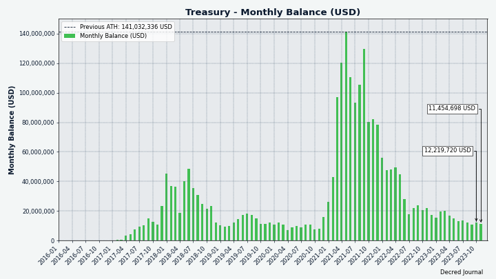
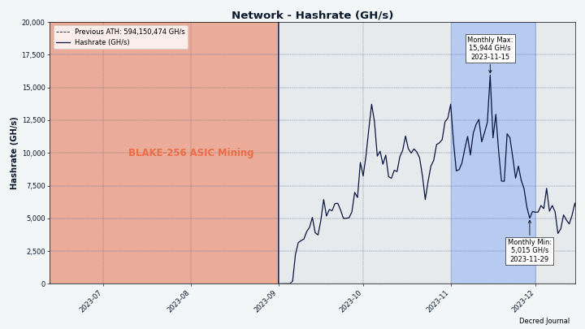
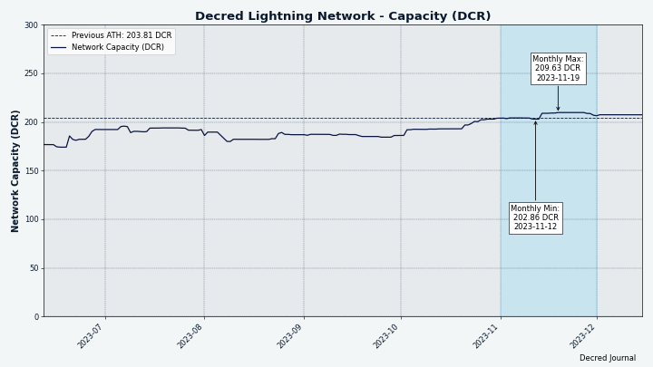
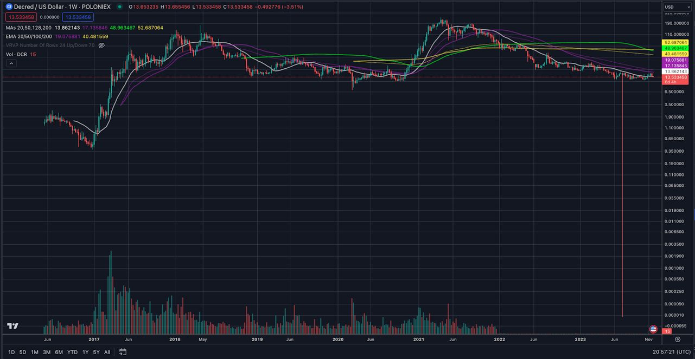

# Decred Journal – Listopad 2023

_Obraz: Listopadowa okładka, aut. @Exitus_

_W grudniu dużym ograniczeniem był dla mnie czas i to z tej przyczyny wypuszczamy to wydanie tak późno. Przepraszamy, że musieliście czekać! \[@bee\]_

Najważniejsze wydarzenia z listopada:

- Zaproponowano proof-of-concept projektu sieci typu mesh (siatki) dla DCRDEX.

- Rozpoczęły się prywatne testy wersji Cryptopower na Androida i iOS.

- Lightning Network sieci Decred otrzymała ogromną aktualizację do bazy kodu lnd v0.13.

- Poloniex i HTX zostały zhakowane i wyłączyły wypłaty DCR na kilka tygodni. Bittrex ogłosił, że kończy działalność i wezwał użytkowników do wycofania środków z giełdy.

Spis treści:

- [Rozwój](#development)
- [Ludzie](#people)
- [Zarządzanie i finanse](#governance)
- [Sieć](#network)
- [Ekosystem](#ecosystem)
- [Nawiązywanie kontaktów](#outreach)
- [Eventy](#events)
- [Media](#media)
- [Rynki](#markets)
- [Ważne kwestie i wiadomości poboczne](#relevant-external)

## Rozwój

O ile nie zaznaczono inaczej, prace zgłaszane poniżej mają status „scalonych z repozytorium głównym (master)”. Oznacza to, że prace są ukończone, zrecenzowane i zintegrowane z kodem źródłowym, który zaawansowani użytkownicy mogą [kompilować i uruchamiać](https://medium.com/@artikozel/the-decred-node-back-to-the-source-part-one-27d4576e7e1c), ale ich efekty nie są jeszcze dostępne w wersji plików binarnych dla zwykłych użytkowników.

### dcrd

_[dcrd](https://github.com/decred/dcrd) jest pełną implementacją węzła, który obsługuje sieć peer-to-peer Decred na całym świecie._

Zmiany wewnętrzne i deweloperskie:

- [Naprawiono błąd](https://github.com/decred/dcrd/pull/3209), który został wprowadzony w [październiku](202310.md#dcrd) wraz z nową zdolnością do obsługi [jednoczesnych wiadomości](https://github.com/decred/dcrd/pull/3203) od peerów. dcrd zawieszał się, jeśli peer rozłączył się po wysłaniu wielu wiadomości. Ta poprawka błędu pozwala dcrd odpowiednio reagować, gdy peery się rozłączają.
- Zaktualizowano [obraz Docker](https://github.com/decred/dcrd/pull/3210) do kompilacji z Go 1.21.4.
- Połączenia peer nie powinny wysyłać sobie nawzajem wiadomości `nil`. W celu wcześniejszego znalezienia i debugowania przypadków, w których może się to zdarzyć, dcrd będzie teraz [panikować, jeśli wiadomość `nil` jest w kolejce](https://github.com/decred/dcrd/pull/3213) ("panika" oznacza, że dcrd zakończy działanie i ostrzeże użytkownika o problemie). Ta zmiana zawiera przydatne śledzenie błędów, które pomaga informować programistów o tym, który fragment kodu spowodował panikę.

W toku:

- Zaproponowano nowy komunikat przewodowy, który przyspieszy synchronizację klienta SPV, umożliwiając dcrd [wysyłanie kompaktowych filtrów blokowych w partiach](https://github.com/decred/dcrd/issues/3206) zamiast jednego dla każdego bloku. Wstępna [implementacja](https://github.com/decred/dcrd/pull/3211) została przesłana do przeglądu kodu.

Decred został [uruchomiony](https://blog.companyzero.com/2015/12/decred-rethink-digital-currency/) jako fork [projektu btcsuite](https://blog.companyzero.com/2015/03/btcsuite-code-migration-and-btcd-0-10-0-release/). Zapytany o to, jak kod dcrd zmienił się na przestrzeni lat, @davecgh odpowiedział:

> dcrd jest *znacznie* ulepszony w stosunku do btcd. To po prostu noc i dzień. Nie mam na myśli tylko sposobów, w jakie DCR poprawia się w stosunku do BTC.  APBF, znacznie ulepszony kod sieciowy, cały sposób, w jaki kod łańcucha pozwala na semantykę nagłówków, sposób obsługi ogólnej synchronizacji, obsługa unieważniania bloków i ponownego rozpatrywania, sposób obsługi peerów ze starymi łańcuchami, znacznie szybsze krypto, 50-krotna (co najmniej) poprawa czasu synchronizacji, zasadniczo pełne przepisanie podstawowej semantyki skryptu (np. stdscript, stdaddr, odpowiednia obsługa wersji itp.) i wiele więcej. [@davecgh w [rozmowie na kanale](https://matrix.to/#/!zefvTnlxYHPKvJMThI:decred.org/$TTnbRmx8LDGfU-0-0phuCKMut55fcdt0sJpMqhU-Hhk)]

### dcrwallet

_[dcrwallet](https://github.com/decred/dcrwallet) to serwer portfela używany przez wiersz polecenia oraz aplikacje graficzne._

Wiele zmian dla użytkowników w tym miesiącu koncentruje się na optymalizacji [trybu SPV](https://docs.decred.org/wallets/spv/), w którym portfel może działać bez konieczności pobierania pełnego łańcucha bloków. Jest to świetny wybór dla portfeli o ograniczonej wydajności sprzętowej, zwłaszcza urządzeń mobilnych. Tryb SPV Decred wykorzystuje [zaawansowaną technologię kryptograficzną](https://github.com/decred/dcps/blob/master/dcp-0005/dcp-0005.mediawiki#simplified-payment-verification-spv), aby zapewnić lekkim klientom wysoki poziom bezpieczeństwa i decentralizacji.

Optymalizacja [początkowej synchronizacji SPV](https://github.com/decred/dcrwallet/issues/2289) - część procedury uruchamiania portfela SPV, gdy dogania on łańcuch:

- [Walidacja trudności bloków](https://github.com/decred/dcrwallet/pull/2297) nastąpi wcześniej. Oznacza to, że jeśli jakiekolwiek bloki naruszają konsensus dotyczący trudności PoW lub PoS, portfel może zignorować te bloki wcześniej i wykonać mniej pracy. Pomoże to przyspieszyć czas synchronizacji. Dodatkowo, jeśli portfel otrzyma bloki, które naruszają konsensus trudności, teraz [zgłosi je w dzienniku](https://github.com/decred/dcrwallet/pull/2294).
- Etap ["pobrania brakujących filtrów kompaktowych"](https://github.com/decred/dcrwallet/pull/2298) wykonywany jest tylko raz. Wcześniej miało to miejsce przy łączeniu się z każdym nowym peerem, ale teraz musi się to zdarzyć tylko raz na synchronizację, co zmniejsza powielanie pracy. "Kompaktowe filtry" lub po prostu "cfilters" to skuteczny sposób na śledzenie transakcji w blokach bez pobierania pełnego bloku.
- [Pobieranie nowych nagłówków bloków i filtrów kompaktowych jednokrotnie](https://github.com/decred/dcrwallet/pull/2300) podczas uruchamiania zamiast pobierania tych samych nagłówków od każdego peera. Pozwala to uniknąć zmarnowanego, zduplikowanego wysiłku dla każdego peera i znacznie zmniejsza ilość zasobów (CPU, RAM, przepustowość, goroutines) wykorzystywanych podczas początkowej synchronizacji.
- Wykonywanie [wykrywania konta/adresu i ponowne skanowanie bloków](https://github.com/decred/dcrwallet/pull/2301) jednokrotnie podczas uruchamiania zamiast po każdym nowym podłączonym peerze. Ułatwia to rozumowanie kodu.
- [Żądanie filtrów tylko dla najlepszego łańcucha bocznego](https://github.com/decred/dcrwallet/pull/2302). Pozwala to uniknąć konieczności wykonywania pracy dla łańcuchów bocznych, które nie są (i nigdy nie staną się) głównym łańcuchem.
- [Zezwolenie dcrwallet na pobieranie filtrów w mniejszych partiach](https://github.com/decred/dcrwallet/pull/2307). Nie nastąpi jeszcze żadna zmiana funkcjonalna, ale sprawia to, że kod będzie gotowy do przełączenia się na wsadowe żądania filtrów, gdy tylko będą one obsługiwane w dcrd. Prace nad dcrd są [już w toku](https://github.com/decred/dcrd/pull/3211).
- [Równoległe pobieranie filtrów cfilters z wielu połączeń równorzędnych jednocześnie](https://github.com/decred/dcrwallet/pull/2308). Rozkłada to obciążenie na wiele połączeń równorzędnych, dzięki czemu początkowy proces synchronizacji (średnio) jest nieco szybszy ze względu na mniejsze wykorzystanie zasobów zdalnych urządzeń równorzędnych.

Pozostałe optymalizacje trybu SPV:

- Eliminacja konieczności wielokrotnego [obliczania haszów bloków](https://github.com/decred/dcrwallet/pull/2295). Skutkuje to krótszym czasem synchronizacji i mniejszym zużyciem pamięci. Podczas działania SPV, czas spędzony na obliczaniu haszy bloków jest zredukowany o ~72%.
- Po połączeniu w SPV, [rozłącz się z ociągającymi się peerami](https://github.com/decred/dcrwallet/pull/2299). Podczas początkowej synchronizacji przydatne może być połączenie z peerem dla uzyskania wcześniejszych zakresów bloków, ale ten peer może później zostać wyprzedzony przez portfel z powodu odkrycia przez niego bardziej aktualnych bloków od innych peerów. Jeśli dany peer nie wysyła żadnych nagłówków po tym, jak portfel otrzymał kilka nowszych nagłówków, prawdopodobnie oznacza to, że peer ma słabą łączność z siecią i powinien zostać odłączony na rzecz próby znalezienia lepszego peera.

Zmiany wewnętrzne i deweloperskie:

- Jeśli użytkownik spróbuje wydać multisigowe UTXO, które zawiera jeden lub więcej [nieprawidłowych podpisów](https://github.com/decred/dcrwallet/pull/2274), wskaż, że transakcja nie jest gotowa do wysłania i zwróć błędy podpisywania. Jest to krok w kierunku poprawy UX dla zaawansowanych użytkowników i programistów pracujących z [multisigami](https://en.bitcoin.it/wiki/Multi-signature), które są obecnie możliwe, ale nie są szeroko stosowane ani [dobrze rozwinięte](https://gist.github.com/norwnd/890ad642985f4e9e9f7b1dd243b21f9e) w Decred.
- Dodano [testy jednostkowe](https://github.com/decred/dcrwallet/pull/2293) dla semantycznego wersjonowania pakietu `chain`.
- Inne refaktoryzacje kodu.

### Decrediton

_[Decrediton](https://github.com/decred/decrediton) to w pełni funkcjonalny desktopowy portfel ze zintegrowaną funkcją głosowania, mieszania StakeShuffle, Lightning Network, handlem na DEX i nie tylko. Działa z lub bez dostępu do pełnego łańcucha (tryb SPV)._

Scalono z gałęzią `master` ku przyszłemu wydaniu:

- Zaktualizowano do wersji [Electron v26](https://github.com/decred/decrediton/pull/3928), aby włączyć nową integrację z portfelem Ledger. Było to możliwe dzięki znalezieniu drobnej zmiany w Electron v21.3.0, która zepsuła okno DCRDEX i dodaniu [obejścia](https://github.com/decred/dcrdex/pull/2596) dla niej.
- [Nowsza wersja](https://www.electronjs.org/blog/electron-23-0) Electrona oznacza, że Windows 7/8/8.1 nie będzie obsługiwany w następnej wersji Decrediton. Entuzjaści bezpieczeństwa kryptowalut i tak nie przechowują swoich kluczy prywatnych na tych niezabezpieczonych systemach operacyjnych, prawda?
- Poprawiono kilka zależności Go i webowych.
- Naprawiono błąd [nieprawidłowego hasła](https://github.com/decred/decrediton/pull/3916), który nie był wyświetlany podczas próby zakupu biletów przy użyciu nieprawidłowego hasła.
- Naprawiono brak możliwości usunięcia hosta peer z pola [połącz w trybie SPV](https://github.com/decred/decrediton/pull/3915) w Ustawieniach.

### vspd

_[vspd](https://github.com/decred/vspd) to oprogramowanie serwera dla pul udziałów (Voting Service Provider). VSP oddaje głos za swoich użytkowników 24/7 oraz nie wchodzi w posiadanie żadnych środków, a tym samym nie może ich ukraść._

Zmiany zawarte w listopadowym wydaniu [v1.3.2](https://github.com/decred/vspd/releases/tag/release-v1.3.2):

- Dodano logikę ponawiania transmisji [transakcji nadrzędnej biletu](https://github.com/decred/vspd/pull/455), jeśli nie powiodła się ona z powodu odniesienia do nieznanych danych wyjściowych. Istnieje duża szansa, że brakujące transakcje przodków rozprzestrzenią się w sieci i pojawią się w lokalnym mempoolu po kilku sekundach.
- Przywrócono [poprzedni algorytm obliczania opłat VSP](https://github.com/decred/vspd/pull/454), który nie uwzględnia aktywacji DCP-12. Rozwiązuje to problem, w którym Decrediton czasami nie płacił opłat VSP, ponieważ obliczał opłatę inaczej niż serwer.

### dcrpool

_[dcrpool](https://github.com/decred/dcrpool) to oprogramowanie serwera do operowania i zarządzania pulą wydobywczą._

Zmiany skierowane na użytkowników:

- Naprawiono kilka błędów w [obliczaniu opłat za płatności](https://github.com/decred/dcrpool/pull/427), które w niektórych przypadkach powodowały naliczanie bardzo wysokich opłat. Powiązane testy zostały przerobione i rozszerzone, aby przetestować więcej przypadków.

Wewnętrzna refaktoryzacja (zmiany, które nie dodają funkcji ani nie naprawiają błędów, ale rozplątują kod, ułatwiają znajdowanie i naprawianie błędów oraz ułatwiają zmianę kodu w przyszłości):

- Usunięto zduplikowane i podatne na błędy [zamknięcia kanałów](https://github.com/decred/dcrpool/pull/422) z programów obsługi powiadomień.
- Uproszczono kod obliczający [płatności nagród](https://github.com/decred/dcrpool/pull/423).
- Zaktualizowano testy, aby używały bardziej [realistycznych](https://github.com/decred/dcrpool/pull/426) kwot DCR.

### Lightning Network

_[dcrlnd](https://github.com/decred/dcrlnd) to oprogramowanie węzła Lightning Network dla Decred. LN umożliwia przesyłanie natychmiastowych i niskokosztowych transakcji._

- Baza kodu dcrlnd została [zsynchronizowana](https://github.com/decred/dcrlnd/pull/193) ze zmianami wprowadzonymi w głównym repozytorium [lnd](https://github.com/lightningnetwork/lnd) między wersją 0.12.1 a [v0.13.4](https://github.com/lightningnetwork/lnd/releases/tag/v0.13.4-beta) (wydaną w listopadzie 2021 r.). Przeniesiono z niego około 140 ze 170 pull requestów, co przyniosło 451 nowych commitów, w tym około tuzina commitów konkretnych dla Decred, aby dostosować zmiany z repozytorum głównego i uprościć przyszłe wysiłki związane z przenoszeniem. Pełną listę przeniesionych i pominiętych pull requestów można znaleźć [tutaj](https://github.com/decred/dcrlnd/blob/master/docs/upstream-prs.csv). Wszystkie istotne zmiany zostały udokumentowane w informacjach o wydaniu lnd: [v0.13.0](https://github.com/lightningnetwork/lnd/releases/tag/v0.13.0-beta), [v0.13.1](https://github.com/lightningnetwork/lnd/releases/tag/v0.13.1-beta), [v0.13.3](https://github.com/lightningnetwork/lnd/releases/tag/v0.13.3-beta) i [v0.13.4](https://github.com/lightningnetwork/lnd/releases/tag/v0.13.4-beta). dcrlnd został przetestowany z tymi zmianami zastosowanymi produkcyjnie na kilku hubach sieci mainnet.
- Zaktualizowano kilka bibliotek [Go](https://github.com/decred/dcrlnd/pull/194).

Należy pamiętać, że chociaż Anchor Outputs stały się domyślnym typem kanału dla Bitcoina w lnd v0.13, są one [wyłączone](https://matrix.to/#/!FRpxSOMVXBCUXtQsDk:decred.org/$xOjxggI8ida5REJTWq-90TIG_Wfj-FsjiNl3FH__hJA) w sieci głównej Decred LN w celu dodatkowego zabezpieczenia przed atakami, takimi jak podatność na ataki typu [replacement cycling](https://cointelegraph.com/news/bitcoin-core-developer-antoine-riard-steps-back-lightning-network-dilemma) ujawniona w październiku 2023 roku.

### DCRDEX

_[DCRDEX](https://github.com/decred/dcrdex) to niepowiernicza giełda, umożliwiająca handel bez konieczności zaufania, działająca dzięki technologii atomic swaps._

Największe zmiany w kliencie:

- Wyłączono przycisk [Złóż zamówienie](https://github.com/decred/dcrdex/pull/2534) w różnych warunkach, takich jak niewystarczające saldo.
- Przeniesiono przycisk [Wyloguj](https://github.com/decred/dcrdex/pull/2590) na koniec menu hamburgera.
- Dostrojono [kolory](https://github.com/decred/dcrdex/pull/2601): dodano pewne różnice w kolorach tła elementów w trybie jasnym i ciemnym, dodano niewielką przezroczystość tła za aktywnymi modami i zmniejszono kolor tła w trybie jasnym, aby użyć delikatniejszego białego koloru.
- Usunięto efekt [zmiany wagi czcionki](https://github.com/decred/dcrdex/pull/2610) po najechaniu myszą, ponieważ nie wyglądał on spójnie w różnych przeglądarkach i ustawieniach czcionek.
- Zmieniono przepływ logowania na [niewymuszanie na użytkownikach rejestracji na serwerze](https://github.com/decred/dcrdex/pull/2614). Po zalogowaniu lokalnym użytkownik zostanie przekierowany na stronę Portfeli.
- Naprawiono [panel stakingu](https://github.com/decred/dcrdex/pull/2586), który nie aktualizował się po utworzeniu portfela.
- Naprawiono monit o utworzenie [brakujących portfeli](https://github.com/decred/dcrdex/pull/2577) w widoku rynków.

Aplikacja desktopowa:

- Naprawiono otwieranie [zewnętrznych](https://github.com/decred/dcrdex/pull/2541) [linków](https://github.com/decred/dcrdex/pull/2597); będą one uruchamiać domyślną obsługę URL systemu operacyjnego (która może uruchomić domyślną przeglądarkę lub wyświetlić okno dialogowe).
- Naprawiono brak zapisywania preferencji [trybu ciemnego](https://github.com/decred/dcrdex/pull/2604) w systemie Linux. Poprawka polega na zapisywaniu go w lokalnej pamięci WebView zamiast w pliku cookie, ponieważ pliki cookie nie są trwałe między uruchomieniami aplikacji w wersji składnika WebView dla systemu Linux.

Szczeble handlowe konta, kaucje oraz system reputacji:

- Ujawniono więcej [danych obligacji i reputacji](https://github.com/decred/dcrdex/pull/2575) w widokach rejestracji i ustawień. Gdy użytkownik wprowadzi numer poziomu, nowy formularz podglądu pokaże kwotę, która zostanie faktycznie zablokowana w kaucji, limity handlowe i ich odpowiedniki w USD. Formularz handlowy w widoku Rynki pokaże, ile lotów można wykorzystać dla bieżącego poziomu obrotu. Dodano wiele treści wyjaśniające kaucje, poziomy handlowe i kary za złe zachowanie.

Boty animatora rynku:

- Zaktualizowano interfejs użytkownika [ustawień animatora rynku](https://github.com/decred/dcrdex/pull/2587), aby uzyskać bardziej responsywny układ i wyjaśnić strategie botów (obecnie dostępnych jest 5 strategii).
- Dodano strategię bota łączącą [animatora rynku i prosty arbitraż](https://github.com/decred/dcrdex/pull/2530). Opierając się na księdze zleceń CEX, umieszcza zlecenia w księdze zleceń DEX, a gdy istnieje dopasowanie na DEX, przeciwne zlecenie na CEX jest natychmiast realizowane z zyskiem.

Decred:

- Dodano ogólną infrastrukturę dla [mieszania funduszy](https://github.com/decred/dcrdex/pull/2478) i zaimplementowano niskopoziomowe elementy dla DCR (jeszcze bez GUI).

Bitcoin:

- Przechowywanie [historii transakcji](https://github.com/decred/dcrdex/pull/2550) dla portfeli SPV Bitcoin. Chociaż bazowa implementacja portfela SPV ([Neutrino](https://github.com/lightninglabs/neutrino)) przechowuje już dane transakcji, korzystanie z tego magazynu prowadzi do niewiarygodnego i mylącego kodu. Przechowywanie transakcji w oddzielnej bazie danych naprawia to, a także odblokowuje większą dokładność, taką jak rozróżnianie zwykłych transakcji wysyłania od transakcji swap.

Zcash:

- Wyodrębniono kod Zcash do jego własnej [implementacji portfela](https://github.com/decred/dcrdex/pull/2553). Jest to konieczne, aby oddzielić go od kodu Bitcoina, ponieważ portfel Zcash bardzo różni się od portfela Bitcoina. Zmiana ta umożliwia domyślne ekranowanie portfeli Zcash i rozwiązuje pewne wewnętrzne problemy.

Ethereum:

- Wyświetlanie [adresu kontraktu tokena](https://github.com/decred/dcrdex/pull/2592) w interfejsie użytkownika, aby użytkownicy mogli być pewni, którego tokena Ethereum lub Polygon używają. Na przykład, adres kontraktu ERC-20 dla USDC to [0xa0b8699...eb48](https://etherscan.io/token/0xa0b86991c6218b36c1d19d4a2e9eb0ce3606eb48).

Zmiany wewnętrzne i deweloperskie:

- Zaktualizowano [zależności sieciowe](https://github.com/decred/dcrdex/pull/2584) klienta, co naprawia jedną krytyczną lukę w kompilatorze Babel.

W toku:

- Weryfikacja koncepcji implementacji zabawkowej sieci mesh o nazwie [Tatanka](https://github.com/decred/dcrdex/pull/2602) została przedłożona do dyskusji. Jest to praca na rzecz propozycji [infrastruktury sieci siatki DCRDEX](https://proposals.decred.org/record/4d2324b) zatwierdzonej w czerwcu 2023 roku. Czytelnikom zaleca się obejrzenie [krótkiego wideo](https://www.youtube.com/watch?v=uZRTLpXXlds), aby zrozumieć, czym naprawdę jest Tatanka (polecamy [Invidious](https://redirect.invidious.io/watch?v=uZRTLpXXlds), jeśli wideo jest ograniczone w Twojej lokalizacji).
- Implementacja [prywatnych atomic swapów](https://github.com/decred/atomicswap/pull/130) z sygnaturami adapterowymi Schnorra została przesłana do przeglądu w repozytorium atomicswap. Metoda atomic swap używana obecnie przez DCRDEX pozostawia tę samą unikalną wartość w obu łańcuchach, umożliwiając każdemu powiązanie transakcji kupującego i sprzedającego. Podpisy adapterowe pozwalają użytkownikom naprawić tę lukę w prywatności kosztem dodatkowej komunikacji poza łańcuchem wymaganej między stronami. Istnieje jednak pewna [krytyka](https://matrix.to/#/!lDZCzVQjFoJsXMPkvr:decred.org/$-PRFKJglyc2CZefIwH7dA0boM_hyJ0yqYl15TEPYBIo) tego podejścia ze względu na jego zależność od Taproot (który wprowadza nietrywialne problemy) i [kryptografii krzywej eliptycznej](https://en. wikipedia.org/wiki/Elliptic-curve_cryptography) (więc kod ten zostałby złamany w przypadku aktualizacji Decred do [kryptografii postkwantowej](https://en.wikipedia.org/wiki/Post-quantum_cryptography)). Zauważyć warto, że `atomicswap` jest narzędziem wiersza poleceń oddzielnym od projektu DCRDEX, ale kod w nim zapoczątkowany może być również zastosowany w DCRDEX.

_Obraz: Interfejs użytkownika ustawień animatora rynku w DCRDEX_

_Obraz: DCRDEX w lepszy sposób prezentuje matematykę za kaucjami i limitami handlowymi_

_Obraz: Ulepszone informacje o kaucjach w ustawieniach DCRDEX_

### Cryptopower

_[Cryptopower](https://github.com/crypto-power/cryptopower) to wielomonetowy desktopowy portfel z graficznym interfejsem dla DCR, BTC i LTC. Działa ze wsparciem dla chroniącego prywatność trybu lekkiego bez potrzeby pobierania pełnych łańcuchów wspieranych, wspiera staking, mieszanie, głosowanie oraz inne unikalne cechy Decred._

Projekt implementacji podstron menu domowego:

- Zaimplementowano nową kartę [Transakcji](https://github.com/crypto-power/cryptopower/pull/198) pokazującą wszystkie transakcje we wszystkich portfelach z opcjonalnymi filtrami według portfela i typu transakcji.
- Przejście do [szczegółów transakcji](https://github.com/crypto-power/cryptopower/pull/258) po kliknięciu transakcji w przeglądzie.
- Przejście do [szczegółów propozycji](https://github.com/crypto-power/cryptopower/pull/272) po kliknięciu propozycji w przeglądzie.
- Ukryj [przycisk Wyślij](https://github.com/crypto-power/cryptopower/pull/302) dla portfeli tylko do obserwacji.

Projekt implementacji podstron portfeli:

- Dodano nowe karty do strony [informacje o portfelu](https://github.com/crypto-power/cryptopower/pull/247), aby wyświetlić status miksera, ostatnie transakcje i ostatnią aktywność stakingu.
- Zaimplementowano nowy układ na stronie [Ustawień portfela](https://github.com/crypto-power/cryptopower/pull/228).
- Zaktualizowano układ sekcji strony [Stakingu](https://github.com/crypto-power/cryptopower/pull/244) portfela: ogólne informacje o stakingu, statystyki i bilety.

Adaptacja mobilna:

- Dostosowano stronę [wyboru portfela](https://github.com/crypto-power/cryptopower/pull/226) do układu mobilnego.

Wymiana monet:

- Dodano niskopoziomową obsługę [Trocador.app](https://github.com/crypto-power/instantswap/pull/7) w bibliotece [instantswap](https://github.com/crypto-power/instantswap).

Poprawki:

- Naprawiono renderowanie [tła kart monet](https://github.com/crypto-power/cryptopower/pull/236) na karcie Przeglądu.
- Naprawiono wyświetlanie stron onboardingu podczas [zamykania aplikacji](https://github.com/crypto-power/cryptopower/pull/259).
- Naprawiono awarię podczas przełączania między zakładkami [Portfele i Przegląd](https://github.com/crypto-power/cryptopower/pull/263).
- Drobne poprawki.

Zmiany wewnętrzne i deweloperskie:

- Refaktoryzacja w celu uproszczenia [wewnętrznych interfejsów API](https://github.com/crypto-power/cryptopower/pull/232), optymalizacji [użycia pamięci](https://github.com/crypto-power/cryptopower/pull/223) i usunięcia niepotrzebnego kodu.
- Usunięto wiele niepotrzebnego [kodu pomocniczego nasłuchiwania](https://github.com/crypto-power/cryptopower/pull/240).
- Usunięto zduplikowane [obliczenia szerokości aplikacji](https://github.com/crypto-power/cryptopower/pull/274).
- Naprawiono [błędy lintera](https://github.com/crypto-power/cryptopower/pull/241) i zaktualizowano konfigurację CI.

Prywatne testy kompilacji aplikacji mobilnych zostały skonfigurowane w Google Play Store i Apple Store (TestFlight). Jeśli chcesz wziąć udział, zapytaj na czacie [#cryptopower](https://chat.decred.org/#/room/#cryptopower:decred.org) na Matrixie (zobacz [jak dołączyć do Matrixa](https://docs.decred.org/getting-started/joining-matrix-channels/)).

Zaobserwuj [@cryptopowerWlt](https://twitter.com/cryptopowerWlt) na Twitterze, aby wspierać projekt i otrzymywać więcej aktualizacji.

_Obraz: Zakładka przeglądu w portfelu Cryptopower_

_Obraz: Zaktualizowane ustawienia w portfelu Cryptopower_

_Obraz: Zaktualizowany podgląd portfela w Cryptopower_

_Obraz: Layout mobilny w Cryptopower (praca w toku)_

### Dokumentacja

_[dcrdocs](https://github.com/decred/dcrdocs) to repozytorium źródłowe [dokumentacji użytkownika](https://docs.decred.org/) dla Decred._

- Zaktualizowano dane [podziału nagrody za blok i całkowitej podaży](https://github.com/decred/dcrdocs/pull/1234) na kilku stronach.
- Poprawiono datę [wdrożenia DCP-12](https://github.com/decred/dcrdocs/pull/1233).

### Bison Relay

_[Bison Relay](https://github.com/companyzero/bisonrelay) to nowa platforma mediów społecznościowych peer-to-peer z silną ochroną przeciw cenzurze, inwiligacji, oraz reklamom, działająca na bazie Lightning Network projektu Decred._

Zmiany podane poniżej zostały scalone z gałęzią `master` ku następnemu wydaniu.

Zmiany w aplikacji graficznej oraz wiersza polecenia:

- Filtrowanie [niechcianej zawartości](https://github.com/companyzero/bisonrelay/pull/377) podczas odczytywania zapisanej historii czatu. Wcześniej filtrowanie treści obsługiwało tylko nowo otrzymane wiadomości.
- Bittrex zostało zastąpione przez MEXC jako źródło [kursów wymiany](https://github.com/companyzero/bisonrelay/pull/383).

Zmiany skierowanie ku użytkownikom aplikacji graficznej:

- Umożliwiono użytkownikom [zaznaczanie tekstu](https://github.com/companyzero/bisonrelay/pull/379) w wiadomościach i postach.
- Naprawiono [niepojawianie się](https://github.com/companyzero/bisonrelay/pull/376) nowo utworzonego czatu grupowego w na liście pokojów czatu.

Adaptacja aplikacji graficznej na urządzenia mobilne:

- Różne [poprawki mobilne i udoskonalenia UX](https://github.com/companyzero/bisonrelay/pull/375), w tym: zastąpienie przycisku Menu przyciskiem Wstecz na niektórych stronach, poprawki rozmiaru czcionki, poprawki w procesie onboardingu, poprawki przepełnienia i poprawki kompilacji Androida.
- Zwiększono [odstępy](https://github.com/companyzero/bisonrelay/pull/378) w czatach na podstawie opinii użytkowników.

Zmiany wewnętrzne w aplikacji graficznej:

- Skonsolidowano deklaracje i zastosowania [rozmiaru czcionek](https://github.com/companyzero/bisonrelay/pull/346) w celu zapewnienia spójności i większej kontroli nad czcionkami w zależności od systemu operacyjnego lub platformy, na której działa aplikacja.

W toku:

- Użytkownicy zgłaszali różne problemy [z kanałem LN](https://matrix.to/#/!GHnoHXSgkVAsUknRUg:decred.org/$nOaRAKaygrxyyvZkPzJ4jGr5S0MsC7FGYS0iPFRG7pc) podczas interakcji z botem Oprah. Główna przyczyna niektórych z nich została znaleziona w dcrlnd i trwają nad nią prace.

Pozostałe wiadomości:

- Archiwa Decred Journal są teraz publikowane na Bison Relay. Skontaktuj się z @karamble, aby uzyskać instrukcje użytkowania.

### Integracja z portfelem Cake Wallet

Ukończone prace scalone w pośrednim [drzewku integracji](https://github.com/JoeGruffins/cake_wallet/tree/cw-decred):

- Dodano [stub dla libwallet](https://github.com/JoeGruffins/cake_wallet/pull/4), aby rozwijać kod wyższego poziomu podczas pisania prawdziwego libwallet. Usunięto również wiele niepotrzebnego kodu pozostałego po wcześniejszych eksperymentach.
- Kontynuowano badanie najlepszych sposobów wywoływania kodu Decred napisanego w Go z wysokopoziomowego kodu Cake napisanego w Dart/Flutter.
- Trzech deweloperów skonfigurowało środowiska kompilacji i otrzymało działające kompilacje Cake Wallet pokazujące fikcyjne widoki Decred na iOS, Androidzie i macOS. Samo uzyskanie działającej kompilacji jest znaczącym kamieniem milowym, biorąc pod uwagę, jak złożony i zagmatwany jest proces kompilacji.

Praca w toku odn. Cake Wallet:

- Pierwsza zmiana dodająca [początkowe ekrany Decred](https://github.com/cake-tech/cake_wallet/pull/1165) została przesłana do gałęzi integracji repozytorium upstream o nazwie `decred_main`. Działający kod Decred zostanie przetestowany i dopracowany w tej gałęzi, zanim zostanie dodany do gałęzi `main` Cake Wallet.
- Integracja [libwallet](https://github.com/JoeGruffins/cake_wallet/pull/8) zbudowanego jako biblioteka C, w tym wszelki niezbędny kod sklejający w Kotlin i Swift oraz kod kompilacji dla różnych systemów operacyjnych i architektur procesorów.
- Skrypty i przewodnik po budowaniu Cake Wallet [na macOS](https://github.com/cake-tech/cake_wallet/pull/1163). Dokumentuje to brakującą wiedzę na temat złożonego procesu kompilacji, który był dość trudny do odkrycia.

Prace scalone w repozytorium [libwallet](https://github.com/itswisdomagain/libwallet):

- Zaimplementowano [podstawowe funkcje](https://github.com/itswisdomagain/libwallet/pull/1) dla portfeli DCR, BTC i LTC, w tym: tworzenie portfela, tworzenie portfela tylko do obserwacji, otwieranie portfela, uruchamianie/zatrzymywanie synchronizacji portfela, ustawianie daty urodzin portfela. Zapożycza to trochę kodu i pomysłów z DCRDEX i Cryptopower i opiera się na istniejących projektach kryptowalutowych napisanych w Go, w tym: [Decred](https://github.com/decred), [btcsuite](https://github.com/btcsuite), [ltcsuite](https://github.com/ltcsuite), [Neutrino](https://github.com/lightninglabs/neutrino) dla BTC i [forku Neutrino](https://github.com/ltcsuite/neutrino) dla LTC (plus [łatki](https://github.com/dcrlabs/neutrino-ltc) od deweloperów DCRDEX).
- Implementacja pamięci masowej do zapisywania [konfiguracji portfela i danych transakcji](https://github.com/itswisdomagain/libwallet/pull/3).

Praca w toku odn. libwallet:

- Warstwa opakowująca do budowania libwallet jako [biblioteki C](https://github.com/itswisdomagain/libwallet/pull/2), którą można wywołać z wysokopoziomowego kodu aplikacji Cake Wallet.
- Pakiet do zarządzania [synchronizacją portfela](https://github.com/itswisdomagain/libwallet/pull/4) i raportowania postępu synchronizacji dla portfeli DCR, BTC i LTC.

libwallet to biblioteka multi-coin implementująca lekkie portfele (SPV) dla Decred, Bitcoin i Litecoin. Pierwotnie została stworzona w celu integracji Decred z Cake Wallet, ale ma potencjał, aby stać się platformą do tworzenia oprogramowania dla Decred i innych monet. Drugą aplikacją korzystającą z libwallet będzie prawdopodobnie portfel Cryptopower. Będzie to podobne do tego, w jaki sposób obecnie wycofany [dcrlibwallet](https://github.com/planetdecred/dcrlibwallet) był współdzielony przez GoDCR i aplikacje Decred na Androida/iOS, ale będzie obsługiwał więcej zasobów niż tylko Decred. Wkrótce zostanie dodana warstwa interoperacyjna C, która pozwoli na wykorzystanie libwallet przez dowolny język programowania, który może [wywołać kod C](https://en.wikipedia.org/wiki/Foreign_function_interface), ułatwiając integrację Decred z szeroką gamą istniejącego i nowego oprogramowania kryptograficznego (był to jeden z celów [TinyDecred v2](202206.md#tinywallet)).

Aplikacje portfelowe zbudowane na libwallet będą miały znacznie lepszą prywatność w porównaniu do wielu istniejących aplikacji na rynku, gdzie powszechne jest korzystanie z centralnych serwerów, które mogą śledzić środki użytkowników. Niestety, portfel Bitcoin firmy Cake jest jednym z takich przypadków, ponieważ opiera się na ich [serwerze Electrum](https://github.com/cake-tech/cake_wallet/blob/3760285a64405935fafe7aeeb051fd25d850585b/assets/bitcoin_electrum_server_list.yml), który nie jest [dobry dla prywatności](https://electrum.readthedocs.io/en/latest/faq.html). Pod maską libwallet używa [dcrwallet](https://github.com/decred/dcrwallet) dla Decred i [Neutrino](https://github.com/lightninglabs/neutrino) dla Bitcoina, które łączą się bezpośrednio z pełnymi węzłami i pobierają dane prywatnie bez ujawniania posiadanych środków i transakcji.

### Pozostałe

- Tłumaczenie interfejsu [timestamply.org](https://timestamply.org/) na jęz. arabski zostało [przesłane](https://github.com/decred/dcrtimegui/pull/157) do przeglądu kodu.

## Ludzie

Witamy nowych współtwórców:

- @Philip-21 (programista, [dcrwallet](https://github.com/decred/dcrwallet/pull/2293))

Statystyki społeczności na dzień 3. grudnia (w porównaniu z 2. listopada):

- Obserwujący na [Twitterze](https://twitter.com/decredproject): 53 939 (+464)
- Subskrybenci na [Reddit](https://www.reddit.com/r/decred/): 12 773 (+11)
- Użytkownicy na [Matrixie](https://chat.decred.org/) w pokoju #general: 833 (+7)
- Użytkownicy na [Discordzie](https://discord.gg/GJ2GXfz):  1862 (+24), zweryfikowani z możliwością pisania: 769 (+7)
- Użytkownicy na [Telegramie](https://t.me/Decred): 2319 (+22)
- Subskrybenci na [YouTube](https://www.youtube.com/decredchannel): 4660 (+20), wyświetleń: 244,7K (+2,3K)

## Zarządzanie i finanse

W listopadzie nowy [Skarbiec](https://dcrdata.decred.org/treasury) otrzymał 7060 DCR o wartości 101 tys. USD po średnim listopadowym kursie wymiany $14,35. Ze Skarbca wydano 8471 DCR na opłacenie kontrahentów, co stanowiło wartość 122 tys. USD po kursie wymiany z tego miesiąca.

Transakcja [wypłaty ze Skarbca](https://dcrdata.decred.org/tx/ca24ed5e5d4819ca68b270a78345be07d5a18890b83ada366e970807425e8bfc) została wydobyta 21. listopada stosunkiem 7346 głosów na "tak" i 57% udziale w głosowaniu i zawierała 50 wyjść dokonujących płatności kontrahentom w przedziale od 3 DCR do 1411 DCR. Większość z tej sumy to zapłata za pracę z września i części października po uśrednionym kursie wymiany $12,98 za te dwa miesiące a cała transakcja TSpend opiewa na równowartość $110K.

Jedną z kwestii związanych z harmonogramem i strukturą wypłat ze Skarbca na rzecz wykonawców w tych miesiącach jest utrzymanie limitu 150% miesięcznych wpływów zgodnie z [DCP-7](https://github.com/decred/dcps/blob/master/dcp-0007/dcp-0007.mediawiki). Niższy kurs wymiany DCR/USD i spadek dotacji z nagród blokowych wraz z upływem czasu oznacza, że osiągnięcie limitu po raz pierwszy staje się realistyczną obawą, zwłaszcza jeśli istnieje zaległość w opłacaniu nagromadzonych starszych faktur. W tym przypadku faktury, które zostały już przesłane za październik, zostały wysłane do zapłaty w tym samym czasie, co te za wrzesień, zamiast czekać kolejny miesiąc, co jest bardziej typowe.

Na dzień 1. grudnia, łączne saldo [starego](https://dcrdata.decred.org/address/Dcur2mcGjmENx4DhNqDctW5wJCVyT3Qeqkx) i [nowego Skarbca](https://dcrdata.decred.org/treasury) wynosi 871 828 DCR (12,5 miliona USD po kursie $14,39).

_Obraz: Wpływy i wydatki ze Skarbca w DCR_

_Obraz: Miesięczne saldo Skarbca w USD; zauważyć należy, że kwota ta jest mocno uzależniona od kursu wymiany_

W listopadzie [nie zgłoszono](https://proposals.decred.org/?tab=under%20review), [przyjęto](https://proposals.decred.org/?tab=approved) ani [odrzucono](https://proposals.decred.org/?tab=rejected) żadnych propozycji na platformie Politeia.

Dnia 23. listopada [zgłoszono](https://matrix.to/#/!xUNvyzkFgiMjhvPbIi:decred.org/$LluGF4EWaQrEEb8lKRKyBRxeQxSqpjWPK8GOSVUA4zU), że jeden z użytkowników nie był w stanie zarejestrować się na platformie i złożyć wniosku. Najwyraźniej Politeia [nie wykryła](https://matrix.to/#/!qYpAAClAYrHaUIGkLs:decred.org/$jmqFcgH8De7TuG2Z9FofSxeBfcYPWn5KMjcG-V6d0bk) opłaty rejestracyjnej. Na dzień 1. grudnia problem ten nie został rozwiązany.

## Sieć

Ta sekcja śledzi kluczowe wskaźniki stanu podstawowej infrastruktury projektu.

### Wydobycie

Listopadowy [hashrate](https://dcrdata.decred.org/charts?chart=hashrate&scale=linear&bin=day&axis=time) na początku miesiąca wyniósł ~13,7 TH/s, a zamknął go na poziomie ~5,5 TH/s, zaliczając niż w ok. 5,0 TH/s oraz szczyt w wys. 15,9 TH/s w ciągu miesiąca.

_Obraz: Moc wydobywcza Decred szuka obecnie poziomu równowagi po początkowym napływie górników GPU_

Podział 1000 bloków [wydobytych](https://miningpoolstats.stream/decred) przed 3. grudnia: [miningandco.com](https://decred.miningandco.com/) 41%, [losmuchachos.digital](https://losmuchachos.digital/) 8%, [pooltronic.tech](https://decred.pooltronic.tech/) 3,6%, oraz 47% bloków niezidentyfikowanych przez [miningpoolstats.stream](https://miningpoolstats.stream/decred).

_Obraz: Zmniejszenie się liczby unikatowych adresów wydobycia sugeruje, że wydobycie ponownie się centralizuje_

### Staking

[Cena biletów](https://dcrdata.decred.org/charts?chart=ticket-price&axis=time&visibility=true-true&mode=stepped) wahała się między 224 a 324 DCR.

_Obraz: Cena biletów ustabilizowała się dość szybko_

[Zablokowana suma](https://dcrdata.decred.org/charts?chart=ticket-pool-value&scale=linear&bin=day&axis=time) to pomiędzy 9,27 a 9,85 miliona DCR, co oznacza, że 59,4-63,1% podaży dostępnej w obiegu [wzięło udział](https://dcrdata.decred.org/charts?chart=stake-participation&scale=linear&bin=day&axis=time) w elemencie Proof of Stake.

_Obraz: Suma DCR zablokowanych w biletach pozostaje blisko ATH_

_Obraz: Oprócz innych rzeczy, procent DCR w stakingu pośrednio wskazuje na to, ile nowowyemitowanej podaży zostaje ponownie przeznaczone na staking_

### Staking z wykorzystaniem VSP

Na 1. grudnia, ~5850 (-1350) biletów w puli zarządzanych było przez [14 oficjalnych VSP](https://decred.org/vsp/), co stanowi 14,3% całej puli biletowej (-2.5%).

Jedyne wzrosty w listopadzie odnotował [99split.com](https://vspd.99split.com) (+136 biletów lub +32%); 13 pozostałych VSP odnotowało odpływ biletów z ich usług.

_Obraz: Podział biletów zarządzanych przez VSP_

_Obraz: Liczba przegapionych głosów powraca do minimalnych wartości_

### Węzły

[Decred Mapper](https://nodes.jholdstock.uk/user_agents) odnotował między 150 a 158 węzłów dcrd w ciągu miesiąca. Wersje 147 węzłów odnotowanych 1. grudnia to: v1.8.0 - 67%, v1.8.1 - 23%, dev buildy v1.9.0 - 3%, v1.7.x - 2%, v1.8.0 - 0,7%, pozostałe - 3%.

_Obraz: Węzły aktualizują się do wersji v1.8.1. Czerwony obszar przed styczniem 2023 oznacza niekompletne dane, którymi na ten czas dysponowaliśmy._

### StakeShuffle

Ilość [monet mieszanych](https://dcrdata.decred.org/charts?chart=coin-supply&zoom=jz3q237o-la8vk000&scale=linear&bin=day&axis=time&visibility=true-true-true) wahała się w granicach 62,1-62,3%.
Dzienna [kwota mieszana](https://dcrdata.decred.org/charts?chart=privacy-participation&bin=day&axis=time) oscylowała w granicach 0-1032K DCR.

_Obraz: Drugi duży spadek i odbicie sumy dziennie przemieszanych DCR_

_Obraz: Ponad 62% podaży w obiegu korzysta z opcji prywatności_

### Lightning Network

Decred [LN Explorer](https://ln-map.jholdstock.uk/) saw 220 nodes (+0), 420 channels (-28) with a total capacity of 206 DCR (+3), as of Dec 3 (compared to Nov 1).

Eksplorator [Lightning Network](https://ln-map.jholdstock.uk/) sieci Decred na 3. grudnia odnotował 220 węzłów (+0) oraz 420 kanałów (-28) o całkowitej pojemności 206 DCR (+3).

_Obraz: Niektóre kanały LN zostały zamknięte_

_Obraz: Liczba węzłów LN pozostała niezmienna, podczas gdy pojemność sieci nieznacznie wzrosła_

Dziękujemy @bochinchero za dostarczenie i ulepszenie widocznych tu wykresów. Stworzył on ponad 40 innych wykresów, które nie zostały wykorzystywane na łamach tego wydania Decred Journal, lecz są dostępne w repozytorium [dcrsnapshots](https://github.com/bochinchero/dcrsnapshots); zapraszamy wszystkich do dzielenia się nimi w mediach społecznościowych.

## Ekosystem

### Voting Service Providers

- Wyszło wydanie wersji [v1.3.2 vspd](https://github.com/decred/vspd/releases/tag/release-v1.3.2), zawierające poprawki, które powinny rozwiązać problemy ze statusami biletów i problemy z płatnościami dla VSP. 9 z 14 VSP korzysta z tej wersji oprogramowania na dzień 1. grudnia.

- Strona [listy VSP](https://decred.org/vsp/) została [zaktualizowana](https://github.com/decred/dcrweb/pull/1148), aby wyświetlać statystyki wszystkich przegapionych biletów. Na dzień 1. grudnia, 14 aktywnych VSP w wieku od 6 miesięcy do 3 lat zgłosiło łącznie 1108 odwołanych biletów, z których 1101 wygasło [normalnie](https://docs.decred.org/proof-of-stake/overview/), a tylko 7 zostało przegapionych. Niska liczba przegapionych głosów pokazuje, że wdrożenia vspd są znacznie bardziej niezawodne w porównaniu do starego [dcrstakepool](https://github.com/decred/dcrstakepool), który miał wyższe wskaźniki głosów przegapionych. Uwaga: [bass.cf](https://vspd.bass.cf/) został wykluczony z tych statytsyk, ponieważ nie został jeszcze zaktualizowany do najnowszej wersji i nie zgłasza przegapionych biletów.

### Pule wdobywcze

- Pula [decred.miningandco.com](https://decred.miningandco.com/) została [otwarta dla wszystkich](https://matrix.to/#/!TSpuyuYWgkTrgPTcXh:decred.org/$H4QA2fDpl1OO6jLnJa6PTAHiEPPSYQYSlomhYzWLrb8). Ogłosiliśmy to w [październiku](202310.md#ecosystem), ale przeoczyliśmy, że początkowo była to pula prywatna. Obsługiwane oprogramowanie obejmuje oficjalny [gominer](https://github.com/decred/gominer) dla systemu Windows i [niestandardowe binarki](https://github.com/Gddrig/gominer/releases) gominera dla systemów Linux i HiveOS. Repozytorium [GitHub](https://github.com/Gddrig/gominer) hostujące te binaria nie zawiera jeszcze kodu źródłowego, więc należy zachować ostrożność.

### Serwisy stakingowe

- [BisonPool](https://twitter.com/BisonPool) [poinformował](https://twitter.com/BisonPool/status/1724110111503728738), że wraz z aktywacją DCP-10 zyski wzrosły z ~2,8%/rok do ~7,8%/rok, a teraz z DCP-12 do ~8,6%/rok. Aktualne stopy zwrotów są wyświetlane na ich [stronie głównej](https://bisonpool.org/), należy pamiętać, że nie są one stałe i zależą od cen biletów. BisonPool został [uruchomiony](https://www.reddit.com/r/decred/comments/vyydm1/bisonpool_is_now_live/) w lipcu 2022 r. przez dwóch entuzjastów bezpieczeństwa IT, którzy anonimowo uczestniczyli w Decred od 2018 roku. Usługa umożliwia staking i zdobywanie nagród przy wkładzie mniejszym, niż ten, wymagany do zakupu pełnego biletu. Należy pamiętać, że jest to usługa powiernicza, która przejmuje pełną kontrolę nad środkami użytkowników.

### Giełdy

- [Poloniex](https://poloniex.com/) został zhakowany 10 listopada z szacowaną stratą 118 milionów dolarów w aktywach Ethereum, Tron i BTC. Ponieważ DCR nie zostało wspomniane przez [Poloniex](https://twitter.com/Poloniex/status/1722956238160536049), [Justin Sun](https://twitter.com/justinsuntron/status/1722942733680296246) ani [tweet Lookonchain](https://twitter.com/lookonchain/status/1722969227915661531) o skradzionych aktywach, nie wiadomo, czy jakikolwiek DCR został skradziony podczas włamania. W każdym razie użytkownicy DCR zostali dotknięci zawieszeniem wszystkich wypłat. Klub badaczy łańcucha na kanale #trading [zauważył](https://matrix.to/#/!lDZCzVQjFoJsXMPkvr:decred.org/$c4Da_17xYGDPGRlK3JLf91bA2UbhoQvthyfVBCD6vvI) transakcję wysyłającą około ~60K DCR z [adresu Poloniex](https://dcrdata.decred. org/address/DsTSdjhiCY1z8AeQGWYJ5ryJKRA3eSBGRTj) na [Binance](https://dcrdata.decred.org/address/DsSJDWwDZtxjFvh7xvTzkENAtNZEeZsQgG8) około 12 godzin po upublicznieniu włamania i ~7 godzin po tym, jak kontrola nad Poloniex została [podobno](https://twitter.com/justinsuntron/status/1723009018086527126) "przywrócona". Spekuluje się, że może to być albo Poloniex ratujący pozostałe środki, albo haker likwidujący je na Binance.

- Poloniex powoli dochodził do siebie po włamaniu. Handel został [wznowiony](https://support.poloniex.com/hc/en-us/articles/18996694952983) następnego dnia, ale do 30. listopada nie umożliwiono żadnych wypłat, a ich [wsparcie na Twitterze](https://twitter.com/PoloSupport) milczało. W tym samym czasie nie brakowało promocji, szumu, a nawet [tweetów](https://twitter.com/Poloniex) o listingu monet. W konsekwencji niedziałających wypłat i arbitrażu międzygiełdowego, cena DCR znacznie spadła w porównaniu do innych rynków.

- Giełda [HTX](https://www.htx.com/) (dawniej Huobi) i jej HECO Chain Bridge straciły aktywa o wartości około 117 milionów dolarów w wyniku włamu na gorący portfel, zgodnie z oficjalnym [artykułem wsparcia](https://www.htx.com/support/en-us/detail/104954980569005) i [PeckShield](https://twitter.com/PeckShieldAlert/status/1727290028064436539). [Justin Sun](https://twitter.com/justinsuntron/status/1727304656622326180) i [HTX](https://www.htx.com/support/en-us/detail/104954980569005) obiecały w pełni zrekompensować użytkownikom poniesione straty. DCR nie został wymieniony jako skradziony zasób i prawdopodobnie nigdy nie został zintegrowany z HECO Chain Bridge. Jednak użytkownicy DCR zostali dotknięci zawieszeniem wszystkich wypłat.

- HTX dochodzi do siebie szybciej, niż Poloniex. Do 30. listopada wypłaty BTC, ETH, TRX i około stu innych aktywów zostały przywrócone (w tym USDT i USDC), ale w oparciu o oficjalne aktualizacje i poślizg DCR/USDT na HTX, DCR nie miał tyle szczęścia.

- [Bittrex Global](https://bittrexglobal.com/) ogłosiło, że [kończy działalność](https://twitter.com/BittrexGlobal/status/1726652430673121310). Cała działalność handlowa zakończy się do 4. grudnia, a od tego momentu klienci będą mogli jedynie wypłacać środki. Wszelkie pozostałe USD zostaną [automatycznie przekonwertowane na USDT](https://twitter.com/BittrexGlobal/status/1729897531448987831). To był zły rok dla Bittrex: [29 milionów dolarów](https://www.reuters.com/business/finance/crypto-exchange-bittrex-fined-53-mln-by-us-treasury-dept-2022-10-11/) grzywny w październiku 2022 r., konieczność zakończenia [działalności w USA](202303.md#ecosystem) w marcu 2023 r. z powodu nieprzyjaznego otoczenia regulacyjnego i gospodarczego, [zarzuty amerykańskiej SEC](202304.md#relevant-external) w kwietniu za naruszenia przepisów dotyczących papierów wartościowych oraz [upadłość](202305.md#ecosystem) w maju.

- Wypłaty DCR z Bittrex zostały zawieszone na 9 dni (sądząc po [tym adresie](https://dcrdata.decred.org/address/DsbvnccsFTAP7FQV7g3SgGfyoXNcPL2Y1fm)), w wyniku czego cena DCR spadła, a niektórzy sprytni traderzy zrobili zakupy już za 5 USD. Wypłaty zostały jednak wznowione 29. listopada, a jeden z użytkowników [zgłosił](https://matrix.to/#/!aNnAOHkWUdNcEXRGjJ:decred.org/$hj_TXo2KHkW8DLyE8UDYagtqXXjrva1RL0SSWCGAOtY), że działały również dla DCR bez żadnych problemów.

- [KuCoin](https://www.kucoin.com/) ogłosił, że [para handlowa DCR/USDT](https://www.kucoin.com/announcement/kucoin-will-add-and-close-certain-spot-trading-pairs) zostanie uruchomiona 24. listopada, podczas gdy para DCR/ETH zostanie zamknięta. Ta sama zmiana została wprowadzona dla 8 innych monet.

- [Bitvavo.com](https://bitvavo.com/en) może bawić się w staking DCR swoich klientów zgodnie z ustaleniami badaczy z kanału [#trading](https://matrix.to/#/!lDZCzVQjFoJsXMPkvr:decred.org/$PkJ9-s1hjxrdFMPBB1fXLqk0_-gK1q3q237PmVsg5Zk). Wsparcie Bitvavo [potwierdziło](https://twitter.com/CryptoDYOR/status/1723760185884164196), że giełda może zbierać nagrody generowane z posiadania aktywów w imieniu swoich użytkowników, zgodnie z ich Umową użytkownika. DCR nie znajduje się obecnie wśród aktywów ["kwalifikujących się do nagrody"](https://support.bitvavo.com/hc/en-us/articles/4405243949841-Staking-and-Lending-at-Bitvavo), więc użytkownicy nie mają możliwości wyrażenia zgody na otrzymywanie nagród za staking DCR. Staking DCR bez dzielenia się nagrodami z klientami otrzymał mieszane opinie od społeczności, od tego, że jest to wysoce nieetyczne, po to, że jest bezpieczniejsze (przed kradzieżą lub niewłaściwym użyciem przez samą giełdę), a nawet jako element marketingowy, aby DCR był notowany na większej liczbie giełd.

- [Changelly](https://github.com/decred/dcrweb/pull/1153) zostało usunięte ze strony [giełd decred.org](https://decred.org/exchanges/), ponieważ DCR nie działa od [września](202309.md#ecosystem).

- Przetestowano [MEXC.com](https://www.mexc.com/exchange/DCR_USDT) i [XT.com](https://www.xt.com/): Handel DCR działa przez VPN i bez KYC. Wypłaty DCR działają na MEXC; potrzebna jest pomoc, aby przetestować wypłaty w XT.

- [Trocador](https://trocador.app/) [uruchomił](https://twitter.com/TrocadorApp/status/1722987823664410844) nowe [przedpłacone karty wirtualne](https://trocador.app/en/prepaidcards/), które można kupić za kryptowaluty i używać jak zwykłych kart kredytowych. Testowe uruchomienie DCR ujawniło pewne problemy: błąd backendu (deweloperzy go naprawili), automatyczny e-mail z danymi karty nie działał (prośba o wsparcie rozwiązała to), działał z Google Pay, ale nie z płatnościami zbliżeniowymi NFC, a korzystanie z usługi wymagało około 8% marży. Pomimo tych problemów, usługa działa i umożliwia wysyłanie DCR oraz otrzymywanie przedpłaconej karty VISA, która może być używana do kupowania prawdziwych rzeczy.

### Pozostałe wiadomości

- Decred Vanguard uaktywnił się w testowaniu i dążeniu do nowych integracji dla Decred, sprawdź ich raport [poniżej](#decred-vanguard).

- Każdy może pomóc poprawić obecność Decred w ekosystemie kryptowalut. Nawet małe rzeczy, takie jak wysłanie e-maila lub tweeta do giełdy/portfela/usługi/influencera mogą mieć znaczenie.

Dołącz do ponad 100 członków naszego czatu [#ecosystem](https://chat.decred.org/#/room/#ecosystem:decred.org), aby uzyskać szczegółowe informacje o usługach Decred. Wolontariusze, którzy mogą pomóc w testowaniu wypłat, są również mile widziani w grupie roboczej [#ecochat](https://chat.decred.org/#/room/#ecochat:decred.org).

Uwaga: autorzy Decred Journal nie są w stanie ocenić wiarygodności żadnego z powyższych podmiotów czy ich usług. Uprasza się o dołożenie należnych starań i własnoręczną weryfikację informacji przed powierzeniem jakichkolwiek środków innym stronom.

## Nawiązywanie kontaktów

### Decred Vanguard

Aktualizacje:

- Przeprowadzono konkurs [memowy](https://twitter.com/exitusdcr/status/1719412415375241610) z nagrodami w wysokości 100 USD w DCR.
- Podjęto próby nawiązania kontaktu z giełdami kryptowalut [Kraken](https://www.kraken.com/), [CEX.IO](https://cex.io/) i [M2](https://www.m2.com/en_AE/) w celu uzyskania wskazówek dotyczących listingu.
- Złożono [wniosek o listing](https://twitter.com/exitusdcr/status/1723075248709370337) na [TradeOgre.com](https://tradeogre.com/).
- Przetestowano giełdy altcoinów [MEXC.com](https://www.mexc.com/exchange/DCR_USDT) i [XT.com](https://www.xt.com/), aby upewnić się, że wpłaty i wypłaty działają.
- Przetestowano [karty przedpłacone](https://trocador.app/en/prepaidcards/) Trocador kupione za $DCR.
- Rozpoczęto rozmowy z Trocador o możliwym partnerstwie. Doprowadziło to do tego, że Cryptopower [zintegrował](https://github.com/crypto-power/cryptopower/pull/257) usługę wymiany Trocador z ich portfelem, kwalifikując ich jako partnera, a tym samym wymieniony na głównej [stronie internetowej](https://trocador.app/en/) Trocador.
- Skontaktowano się z deweloperami [BTCPay Server](https://docs.btcpayserver.org/) i [potwierdzono](https://matrix.to/#/!zefvTnlxYHPKvJMThI:decred.org/$zRag-ReHSe8Ot8onMz-MPW7lMsS4DJssxWzlLAcFD3Y), że są otwarci na integrację altcoinów, jeśli zostanie to zrobione poprawnie.
- Skontaktowano się z jednym z wiodących głosów w branży krypto, [Justinem Bonsem](https://twitter.com/Justin_Bons), aby nawiązać kontakt.
- Odbyto rozmowę na Twitter Space [Cake Wallet](https://twitter.com/cakewallet/status/1724849595195253163) o pracy w Decred DAO.
- Przeprowadzono ankietę na temat tego, jakie [działania marketingowe](https://twitter.com/exitusdcr/status/1729192850544587079) społeczność chciałaby zobaczyć najbardziej. Współpraca z influencerami cieszyła się największą popularnością na poziomie 46%. Oddano 106 głosów.
- Ukończono konkurs [rozdający $100 w Decred](https://twitter.com/exitusdcr/status/1729571096230252835) z niskim progiem wejścia. Prezenty z niskimi barierami zawsze otrzymują więcej polubień, wyświetleń i retweetów.

Decred Vanguard jest inicjatywą marketingową opartą na społeczności, której celem jest zwiększenie zasięgu i obecności Decred w mediach społecznościowych.

Jesteś twórcą memów, artystą, strategiem lub po prostu pasjonatem projektu Decred? Rozszerzamy nasz społecznościowy program marketingowy i chcemy właśnie CIEBIE!

Co możesz zyskać?

- Zarabiaj $100 w DCR każdego miesiąca za samo uczestnictwo.
- Pokryjemy koszt X Premium.
- Brak ścisłych zasad uczestnictwa. Przyczyniaj się na swój własny, unikalny sposób, kiedy tylko możesz.
- Wygrywaj potencjalne nagrody za wkład.

Zawsze testujemy nowe inicjatywy i prowadzimy konkursy memowe z nagrodami!

Zainteresowani? Skontaktujcie się z [@Exitus](https://twitter.com/exitusdcr) na Twitterze/Matrixie/Discordzie.

### Cypherpunk Times

Statystyki aktywności za listopad:

- Całkowita liczba artykułów na Cypherpunk Times: 588
- Subskrybentów newslettera: 112
- Opublikowane nowe posty i newslettery: 23
- Liczba obserwujących na wszystkich kontach i platformach mediów społecznościowych: 1181
- Statystyki [@decredsociety](https://twitter.com/decredsociety): obserwujących - 985, postów - 16, wyświetleń tweetów - 17,1K, polubień - 350, retweetów - 51, komentarzy - 51
- Statystyki [@cypherpunktimes](https://twitter.com/cypherpunktimes): obserwujących - 196, postów - 154, wyświetleń tweetów - 19,3K, polubień - 439, retweetów - 107, komentarzy - 88
- Rozkład postów według projektu na listopad: Firo - 5, Decred - 7, pozostałe projekty krypto/wiadomości - 11

## Eventy

**Na których byliśmy:**

- @arij została zaproszona na dużą konferencję zorganizowaną przez LBANK Labs, skupiającą się na [dynamice inwestycji oraz pojawieniu się ekosystemu blockchain w Maroku](https://decredcommunity.github.io/events/index/20231121.1), gdzie uczestniczyła w sesjach networkingowych jako przedstawicielka Decred i nawiązała cenne kontakty.

## Media

### Artykuły

Decred:

- [Decred znów w grze! Na co możemy liczyć?](https://www.cypherpunktimes.com/decred-back-on-tracks-what-can-we-hope-for/), aut. @Joao
- [Decred vs Polygon: Decentralizacja i innowacja!](https://www.cypherpunktimes.com/decred-vs-polygon-decentralized-and/), aut. @Joao
- Zobacz towarzyszące posty tekstowe w sekcji Wideo poniżej

Generalna tematyka krypto:

- [Miesięczne podsumowanie Cypherpunk Times (wydanie z października 2023 r.)](https://www.cypherpunktimes.com/cypherpunktimes-monthly-roundup-october-2023-edition/), aut. @tallamericano
- Niedźwiedzi blues rynkowy: Przetrwanie i rozwój w kryzysach kryptowalutowych [część 1](https://www.cypherpunktimes.com/bear-market-blues-surviving-and-thriving-in-cryptocurrency-downturns/) i [część 2](https://www.cypherpunktimes.com/bear-market-blues-surviving-and-thriving-in-cryptocurrency-downturns-2-2/), aut. @tallamericano
- [Przegląd największych oszustw i włamań kryptowalutowych w październiku](https://www.cypherpunktimes.com/reviewing-major-crypto-scams-and-hacks-in-october/), aut. @BlockchainJew
- [Rok później: Sam Bankman z FTX został potępiony](https://www.cypherpunktimes.com/one-year-after-sam-bankman-from-ftx-is-condemned/), aut. @Joao
- [CEX na widoku](https://www.cypherpunktimes.com/cex-in-view/), aut. @BlockchainJew
- Poruszanie się po dżungli notowań giełdowych: kompleksowy przewodnik po tym, jak wprowadzić kryptowalutę na giełdę [Część 1](https://www.cypherpunktimes.com/navigating-the-exchange-listings-jungle-a-comprehensive-guide-on-how-to-get-your-cryptocurrency-listed-1-2/), aut. @tallamericano
- [Crypto w widoku: rozwikłanie cyfrowego dramatu tygodnia](https://www.cypherpunktimes.com/crypto-in-view-unraveling-the-weeks-digital-drama/), aut. @BlockchainJew

### Wideo

- [Decred News - Wersja 1.8.1, dev AMA na Reddicie, nowe ATH cen biletów, wiele aktualizacji!](https://www.youtube.com/watch?v=pRQSH3tO5xk), aut. @Exitus
- [Skalowanie blockchaina: Dlaczego Decred zdecydował się na skalowanie za pomocą Lightning Network - Moving Forward](https://www.youtube.com/watch?v=xWgjrKW1e1o), aut. @phoenixgreen - również jako [post tekstowy](https://www.cypherpunktimes.com/scaling-the-blockchain-why-decred-chose-to-scale-using-the-lightning-network/)
- [Nowy paradygmat pracy - Praca dla Decred DAO - Moving Forward](https://www.youtube.com/watch?v=1z0Q-jcRcHI), aut. @phoenixgreen - również jako [post tekstowy](https://www.cypherpunktimes.com/a-new-work-paradigm-working-for-the-decred-dao/)
- [Jak bezpiecznie przechowywać i tworzyć kopie zapasowe Decred - sesje Q&A](https://www.youtube.com/watch?v=fYCNaY3MKps), aut. @phoenixgreen - również jako [post tekstowy](https://www.cypherpunktimes.com/how-to-safely-store-and-backing-up-your-decred-qanda-session/)
- [Jak budowane są bloki Decred - sesje Q&A](https://www.youtube.com/watch?v=8DNSrEicKx0), aut. @phoenixgreen - również jako [post tekstowy](https://www.cypherpunktimes.com/how-are-decred-blocks-constructed-q-a-sessions/)

Livestreamy:

- [Przegląd deweloperski Decred - stan rynku](https://www.youtube.com/watch?v=mdtTVqEFewE), aut. @phoenixgreen i @Exitus, omawiająca [AMA dla deweloperów Decred](https://www.reddit.com/r/decred/comments/1700xyi/decred_developer_ask_me_anything_ama_feat_dev/) i pytania zadane przez społeczność.

Shorty:

- [Decred - kryptowaluta, która łączy prywatność z kontrolowaną podażą](https://www.youtube.com/watch?v=A7hHQuN9VX0), aut. @DajanaDcr i @Exitus - również na [TikToku](https://www.tiktok.com/@decred_crypto/video/7307471531305602336)

### Audio

- @Exitus przedstawił przegląd Decred DAO/Skarbca i sposób, w jaki wykonawcy wnoszą wkład na wczesnym etapie na Twitter Spaces [Cake Wallet](https://twitter.com/cakewallet/status/1724849595195253163) poświęconą pracy w branży kryptowalut.
- Sprawdź podcast [Cypherpunk Times](https://podcasters.spotify.com/pod/show/cypherpunktimes) na Spotify, aby uzyskać wersje audio filmów Decred.

### Treści nieanglojęzyczne

- Wideo o [Timestamply](https://www.youtube.com/watch?v=xvsoded_XsU), aut.[@arij](https://twitter.com/in_insaf/status/1728829464237514971)
- Wrześniowe wydanie Decred Journal otrzymało w sumie 3 nowe [tłumaczenia](https://xaur.github.io/decred-news/) na jęz. arabski (@arij), jęz. chiński (@Dominic) i jęz. polski (@kozel). Dziękujemy!

### Treści losowe

- Tweety edukacyjne na temat [Skarbca Decred](https://twitter.com/decredproject/status/1722177861803483579) i [głosowania nad transakcjami TSpend](https://twitter.com/decredproject/status/1723269730113323485), aut. @kozel
- Comiesięczna terapia grupowa dla kanałów [Random + Trader](https://www.reddit.com/r/decred/comments/17lahax/monthly_random_trader_talk/) na temat byczych tez i pomysłów na to, co robić
- Wyzwanie intelektualne od @h3la1: [zaproponuj dobry pomysł na stablecoina Decred](https://twitter.com/h3la1/status/1729116883889348704) i wygraj 1 DCR
- Pierwsze doświadczenia [DCRDEX](https://twitter.com/longtermdaily/status/1720895569529364900) od @pubpete

> Nigdy nie planowałem korzystać z #DCRDEX, ponieważ nie miałem takiej potrzeby, ale z czasem zdałem sobie sprawę, że to wartość dodana. Dopiero gdy jedyna giełda (@BittrexExchange), której używałem do kupowania #Decred, przestała działać w USA...., wtedy naprawdę mnie to uderzyło!  To nie było pragnienie, to była potrzeba! [[@longtermdaily](https://twitter.com/longtermdaily/status/1720895569529364900)]

### Coś dla oka i dla serca

- [Filary stworzenia](https://www.cypherpunktimes.com/pillars-of-creation/), aut. @OfficialCryptos
- Niektórzy zwycięzcy [konkursu memów](https://twitter.com/exitusdcr/status/1719412415375241610) aut. @Exitus: [@Atonito](https://twitter.com/exitusdcr/status/1720511478694822066), [@CahyadieDika](https://twitter.com/exitusdcr/status/1720504961635660253), [@MANCASTVZX](https://twitter.com/exitusdcr/status/1720411076527903070), [@wumudidi](https://twitter.com/wumudidi/status/1719539682999255443)

_Obraz: Uwięzieni użytkownicy Bitcoina spoglądający na lekarstwo, aut. [@yourkingroyal](https://twitter.com/yourkingroyal/status/1720035878318248374)_

_Obraz: Stary projekt paliwa rakietowego Decred na kubku [@wumudidi](https://twitter.com/wumudidi/status/1719539682999255443)_

## Rynki

W listopadzie kurs wymiany DCR mieścił się w przedziale USDT 12,33-16,50 / BTC 0,00036-0,00046. Korzystając z dziennych ważonych danych zamknięcia od Coin Metrics zakresy cenowe dla USD wynosiły 13,11-15,50, a dla BTC 0,00037-0,00043. Średni dzienny kurs obliczany dla płatności kontrahentom wynosił $14,35.

Brian Beamish z [The Rational Investor](https://www.therationalinvestor.com/) przeprowadził [analizę techniczną DCR](https://www.youtube.com/watch?v=l1wZCgi8Zv8&t=1h15m10s) (początek od 1:15:10).

_Obraz: Ostatnie kursy DCR/BTC, dane z Coin Metrics_

_Obraz: Szczyty dla DCR/BTC, dane z Coin Metrics_

_Obraz: Ostatnie kursy DCR/USD, dane z Coin Metrics_

_Obraz: Miesięczny wolumen DCRDEX w USD_

_Obraz: "Lepszy długoterminowy wykres, niż wielu ludzi zdaje sobie sprawę" aut. [@cburniske](https://twitter.com/cburniske/status/1729243261460734172)_

## Ważne kwestie i wiadomości poboczne

Pula wydobywcza Bitcoin f2pool [przyznała się](https://news.bitcoin.com/bitcoin-mining-pool-f2pool-acknowledges-ofac-transaction-censorship-backpedals-after-community-backlash/) do cenzurowania transakcji z adresów objętych sankcjami OFAC. Zachowanie to zostało odkryte przez dewelopera Bitcoin 0xB10C poprzez analizę transakcji, które powinny zostać uwzględnione przez f2pool, ale nie zostały. Początkowo f2pool zaprzeczył temu zachowaniu, ale później przyznał się i powiedział, że wstrzyma je do czasu ustalenia konsensusu społeczności - ale od tego czasu usunął różne posty na ten temat.

Badacze łańcucha Monero z Moonstone Research [przeanalizowali](https://moonstoneresearch.com/2023/11/03/Postmortem-of-Monero-CCS-Hack.html) transakcje dokonane przez atakującego, który opróżnił portfel Community Crowdfunding System (CCS) i odkryli niektóre transakcje, co do których są dość pewni, że reprezentują atakującego wysyłającego środki na giełdę lub do wspólnika. Wywołało to pewne [kontrowersje](https://twitter.com/sethforprivacy/status/1720792327579414915) w społeczności, ponieważ Monero jest znane ze swojej prywatności, ale jest to "najgorszy scenariusz" dla prywatności, w którym klucze prywatne portfela i metadane zostały udostępnione śledczym, a wydaje się, że atakujący dokonał nietypowej transakcji (używając funkcji "PocketChange" Monerujo) i kilku innych błędów (zamiatanie portfela), które ułatwiły pracę śledczym.

Istnieją różne propozycje nowego projektu systemu Monero CCS, który pozwoli uniknąć pułapki polegającej na posiadaniu dużej sumy XMR pod kontrolą niektórych członków konrolującej organizacji, którzy mogą być celem ataku. Jedną z nich jest "[propozycja cypherpunk](https://monero.observer/cypherpunk-transmission-017-rethinking-monero-ccs-cypherpunk-proposal/)", która usunęłaby rolę powiernika poprzez przekazywanie darowizn bezpośrednio do portfeli właścicieli projektów po ich zatwierdzeniu do finansowania - eliminując w ten sposób scentralizowany nadzór i rozdzielanie funduszy.

Fluffypony [zaproponował](https://github.com/monero-project/meta/issues/921) rozwiązanie zespołu "Monero Core" na rzecz 6 grup roboczych, których członkostwo jest określane przez konsensus społeczności, z datą zakończenia 1 stycznia 2024 roku. Propozycja ta jest częściowo spowodowana niedawnymi problemami z funduszami CCS, ale główny zespół jest również postrzegany jako posiadający zbyt dużą kontrolę w ogóle, a niektóre role, takie jak te zajmujące się dostawcami usług, wymagają "osób w tych konkretnych rolach, aby nie były gburowate i były ciepłe, wyrozumiałe i przyjazne dla osób, z którymi mają do czynienia u tych usługodawców". Proponowane przez niego grupy robocze dotyczą ogólnego funduszu darowizn, społecznościowego systemu finansowania społecznościowego, przechowywania własności intelektualnej, serwerów i hostingu CDN, konserwacji Git i moderowania kanałów społecznościowych. Propozycja wzywa do podjęcia decyzji o mechanizmie konsensusu w drodze sondującej ankiety w celu wyboru członków grup roboczych, ale zastrzega, że jedynie uczestnicy z kilkuletnim stażem powinni być brani pod uwagę jako członkowie grupy roboczej.

Jae Kwon, założyciel Cosmos, [wezwał](https://www.coindesk.com/markets/2023/11/27/cosmos-founder-calls-for-chain-split-atom-down-3/) do hardforkowego podziału łańcucha po tym, jak propozycja zmniejszenia emisji ATOM została zatwierdzona przez społeczność wbrew jego życzeniom. Propozycja obniżenia wskaźnika emisji z 14% rocznie do 10% została przyjęta z 41,1% głosów na tak i 31,9% głosów na nie - uzasadnieniem zmiany było to, że Cosmos Hub płacił zbyt dużo za bezpieczeństwo. Propozycja podziału łańcucha Kwona utworzyłaby nowy łańcuch, który miałby własny token, ale pozwoliłby również na wykorzystanie oryginalnego tokena ATOM w jakiś sposób. Może to również rozwiązać pewne napięcia w społeczności wokół zawetowanego planu "Cosmos 2.0", który miał znaczne wsparcie, ale został uznany za zbyt ryzykowny przez kierownictwo.

Stowarzyszenie Aragon [ogłosiło](https://protos.com/aragon-helped-lido-curve-form-daos-now-its-dissolving/), że zamierza się rozwiązać, zwracając 95% aktywów posiadanych przez organizację posiadaczom tokenów ANT i zatrzymując 5% w celu uregulowania zobowiązań. Posiadacze ANT będą mogli wymienić ANT na ETH po kursie 0,0025376 ETH za ANT do 2 listopada 2024 r., po czym wszelkie nieodebrane środki powrócą do nowo utworzonej "Aragon Shield", gdzie zostaną przeznaczone na luźno zdefiniowaną kontynuację rozwoju produktu. Chociaż narzędzia programowe Aragon były używane przez odnoszące sukcesy DAO, takie jak Lido i Curve, zespół zdecydował, że nie było możliwe uzyskanie żadnej wartości dla posiadaczy ANT z tego rodzaju użytkowania i przyznali, że przedsięwzięcia takie jak "Aragon Court" nie były opłacalne.

Niektórzy posiadacze tokenów ANT nie są zadowoleni z planu Stowarzyszenia Aragon, w szczególności z zatrzymania 11 milionów dolarów plus wszystkich nieodebranych środków po roku dla Aragon Shield, i [poparli](https://twitter.com/dcfgod/status/1726861803257471313/) propozycję ścigania stowarzyszenia o więcej pieniędzy poprzez "wysoce warunkową dotację" dla Patagon Management LLC, firmy handlowej specjalizującej się w tego rodzaju działaniach prawnych w celu odzyskania funduszy.

Fałszywa aplikacja "Ledger Live" trafiła do sklepu z aplikacjami Microsoftu, w wyniku czego ten, kto ją wydał, otrzymał 38 transakcji o wartości 588 tysięcy dolarów, ponieważ [ukradł](https://cointelegraph.com/news/fake-ledger-live-app-sneaks-into-microsoft-app-store-as-victims-lose-half-a-million) BTC osób, które myślały, że używają właściwego oprogramowania Ledger Live, aby uzyskać dostęp do swojego portfela sprzętowego.

[Włamano się na KyberSwap](https://twitter.com/kybernetwork/status/1727475235342217682) i wezwano użytkowników do wycofania swoich środków, jeśli to możliwe, ale atakujący był w stanie przejąć około 55 milionów dolarów środków użytkowników, [wykonując](https://therecord.media/kyberswap-crypto-platform-54-million-hack) wyrafinowaną sekwencję działań, która pozwoliła mu wykorzystać lukę w celu manipulowania cenami. Zespół KyberSwap zaoferował 10% nagrody za zwrot środków, a atakujący odpowiedział w wiadomości na łańcuchu, że negocjacje rozpoczną się za kilka godzin, gdy będą wypoczęci. Frontrunningowe boty były w stanie dołączyć do exploita i uzyskać 5,7 mln USD środków użytkowników przed atakującym, a operatorzy botów [zwracają](https://twitter.com/KyberNetwork/status/1728800315955437743) fundusze w zamian za 10% nagrody.

W ciągu dwóch miesięcy doszło do czterech poważnych włamań [na giełdy](https://cointelegraph.com/news/justin-sun-platforms-hacked-4-times) i most obsługiwany przez Justina Suna. Giełda HTX (dawniej Huobi) padła ofiarą dwóch włamań na kwoty 8 mln USD i 30 mln USD, podczas gdy Poloniex został zaatakowany na kwotę 100 mln USD, podobno z powodu kompromitacji klucza prywatnego. Most HECO Chain firmy HTX, używany do przenoszenia środków między giełdą a różnymi sieciami, był drugą ofiarą, a 87 milionów dolarów trafiło na podejrzane adresy.

LBRY Inc. [kończy działalność](https://twitter.com/LBRYcom/status/1715108834950123929) po tym, jak SEC pozwała ją i doprowadziła do bankructwa, a wszystkie jej aktywa zostaną sprzedane w celu spłacenia wierzycieli. Odysee będzie nadal korzystać z sieci LBRY w celu świadczenia usługi udostępniania wideo, według niektórych [pomiarów](https://odysee.com/@lbry:3f/theendoflbryinc:d) jednej z najczęściej używanych platform Web3 z 5,3 milionami unikalnych użytkowników miesięcznie.

SEC [pozwała](https://www.reuters.com/business/finance/us-sec-sues-kraken-operating-crypto-trading-platform-without-registering-2023-11-20/) Kraken o nielegalne prowadzenie giełdy papierów wartościowych, ponieważ nie dokonał rejestracji, podobnie jak w sprawach wniesionych przeciwko Coinbase i Binance w czerwcu.

CEO i CTO SafeMoon zostali [aresztowani](https://www.coindesk.com/policy/2023/11/01/sec-charges-safemoon-team-with-fraud-offering-unregistered-crypto-securities/) przez amerykański Departament Sprawiedliwości w dochodzeniu w sprawie oszustwa, ze skargą, że wprowadzili inwestorów w błąd, wydając 200 milionów dolarów na towary luksusowe, jednocześnie mówiąc im, że są one zablokowane w puli płynności. SEC postawiła zarzuty naruszenia papierów wartościowych związane z niezarejestrowaniem tokena SFM i manipulacją ceną, a token spadł w następstwie opublikowania zarzutów.

Proces SBF [zakończył się](https://decrypt.co/204154/sam-bankman-fried-verdict-ftx-fraud) wyrokiem skazującym w sprawie siedmiu zarzutów i wyrokiem, który ma zapaść w 2024 r., a SBF grozi maksymalnie 115 lat więzienia. Kwestia, czy ścigać element darowizn politycznych, miała zostać podjęta w późniejszym terminie - spoiler alert, [zdecydowali](https://www.bloomberg.com/news/articles/2023-12-30/us-drops-plan-for-second-bankman-fried-trial-on-other-charges), aby nie ujawniać zakresu tego przestępstwa i wszystkich polityków, którzy byli zaangażowani w kontrolę mediów, w grudniu.

Doradcy FTX w sprawie bankructwa [zapewnili](https://decrypt.co/204336/ftx-handing-over-customer-crypto-trading-data-fbi) biurom FBI dostęp do danych handlowych klientów.

Chińskie sądy [potwierdziły](https://cointelegraph.com/magazine/chinas-surprise-nft-move-hong-kongs-15m-bitcoin-fund-asia-express/) ochronę prawną NFT jako własności, z komentarzem, który wyjaśnia niektóre wcześniejsze sprzeczności. NFT są postrzegane jako posiadające zarówno wartość użytkową, jak i wartość wymiany, a ich rzadkość oznacza, że są zgodne z cechami wirtualnej własności online. Uznanie praw własności do NFT oznacza, że ludzie mogą być ścigani za ich kradzież.

Rezerwa Federalna Stanów Zjednoczonych zamierza [ścigać](https://twitter.com/BitcoinMagazine/status/1720433939431477400) Bitcoin Magazine za wyśmiewanie ich usługi FedNow w sposób, który rzekomo narusza ich prawa autorskie i znaki towarowe. Bitcoin Magazine [opublikował](https://bitcoinmagazine.com/legal/federal-reserve-threatens-to-sue-bitcoin-magazine) otwartą odpowiedź, w której odmawia podporządkowania się poprzez usunięcie z ich sklepu obraźliwej koszulki, która zawiera znak towarowy Fed.

Bittrex Global ostatecznie [zlikwidował](https://cointelegraph.com/news/bittrex-global-winds-down-operations) swoją działalność i zaprzestał handlu. Od czasu ogłoszenia daty zamknięcia występowały sporadyczne problemy z wycofywaniem DCR, a pary DCR zaczęły zachowywać się nietypowo z niską płynnością i obawami, czy ludzie będą w stanie wypłacić DCR, które tam kupili.

Uczestnicy corocznej imprezy ApeFest organizowanej przez Bored Ape Yacht Club zostali [poddani](https://arstechnica.com/health/2023/11/bored-ape-creator-says-uv-lights-at-apefest-burned-attendees-eyes-and-skin/) ekspozycji na światło UV, a ponad 20 osób, które znajdowały się zbyt blisko lampy UV, zgłosiło silny ból i pieczenie oczu, prawdopodobnie spowodowane fotokeratozą lub oparzeniem słonecznym rogówki.

To wszystko na listopad. Podzielcie się swoimi aktualizacjami do następnego numeru na naszym kanale [#journal](https://chat.decred.org/#/room/#journal:decred.org).

## O tym wydaniu

To 65. wydanie Decred Journal. Spis wszystkich wydań, mirrorów i tłumaczeń dostępny jest [tutaj](https://xaur.github.io/decred-news/).

Większość informacji od stron trzecich jest przekazywana bezpośrednio ze źródła po minimalnym sprawdzeniu poprawności. Autorzy Decred Journal nie mają możliwości zweryfikowania wszystkich publikowanych stwierdzeń. Proszę uważać na oszustwa i przeprowadzać własny research.

Zasługi (kolejność alfabetyczna):

- redakcja treści: bee, bochinchero, Exitus, jz, karamble, kozel, phoenixgreen, richardred, zippycorners
- ilustracja tytułowa: Exitus
- finansowanie: interesariusze Decred
